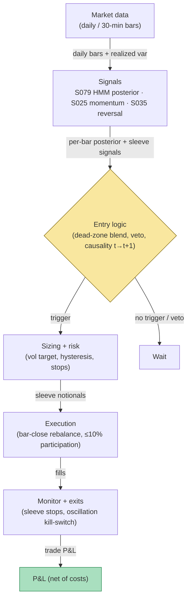

## Stage 153/200 — T053: HMM Regime-Switching Allocator

*Batch TB6 · Strategy 53/100 · Signals S079, S025, S035 · Provenance [D/SR]*

### T1. One-line verdict

| | |
|---|---|
| **Style** | Cross-sectional style allocator: a hidden Markov model decides, bar by bar, how much capital goes to a momentum book vs a reversal book |
| **Edge source** | Regime persistence: momentum works in persistent trends and crashes at turns; reversal works in chop. The HMM's forward-filter posterior shifts capital to the book the current regime favors — most of the value is *not trading the muddy middle* |
| **Typical holding period** | The allocator reweights daily (or per 30-min bar); sleeve trades hold minutes (momentum) to a day (reversal) |
| **Capacity hint** | Large: it allocates between two diversified equity books; capacity is the sleeves' capacity, not the allocator's |
| **Build-or-buy in one line** | Build — `hmmlearn` plus your two books; vendor "regime labels" are rarely cheap, rarely transparent, and never causal |

A **hidden Markov model (HMM)** says the market is in one of a few unobserved *regimes* (hidden states) that switch occasionally; each regime emits returns with its own distribution. **Baum–Welch** (forward–backward EM) estimates the model from history; the **forward filter** (α-recursion) computes, causally, the probability of each regime *given only data up to now*. **Time-series momentum** (S025) buys recent winners; **short-term reversal** (S035) fades recent extremes. T053 does not pick stocks — it scales two pre-built books (momentum and reversal) by the HMM's regime posterior, with **volatility targeting** (scaling each sleeve to a constant risk budget) and a **dead zone** (a band of posterior values where weights don't move, to avoid churn).

### T2. Full mechanics

**Universe & session.** Broad US equities for the two sleeves (the allocator itself runs on a liquid proxy such as SPY/ES or the universe's equal-weighted return). Daily bars for allocation (30-min bars for the intraday variant, `example`). Sleeve books trade RTH.

**Model specification.** Two hidden states $S_t \in \{M, R\}$ (momentum-favoring / reversal-favoring); an optional third state $U$ (uncertain/high-vol) maps to a cash sleeve. Observation $x_t = (r_t, \hat{\sigma}_t^2)$ — the proxy's log return and 20-bar realized variance (`example` feature set; variance separates regimes better than mean). Emissions $x_t \mid S_t = s \sim \mathcal{N}(\mu_s, \Sigma_s)$ (Student-$t$ if fat tails matter). Transition matrix $A_{ss'} = \Pr(S_{t+1} = s' \mid S_t = s)$, estimated by Baum–Welch on a trailing 60-day window, refit weekly (`example`). **Live inference uses only the forward filter** — never the smoothed posterior $\gamma_{t|T} = \Pr(S_t \mid x_{1:T})$, which peeks at the future:

$$\alpha_t(s) \propto p(x_t \mid S_t = s)\sum_{s'} A_{s's}\,\alpha_{t-1}(s'),\qquad \pi^M_t = \frac{\alpha_t(M)}{\alpha_t(M) + \alpha_t(R)}.$$

**Allocation weights.** Soft blend with a dead zone (the arithmetically consistent form; Grok's Q-TB6-1 text had a sign slip in the numerator, corrected here):

$$w^M_t = \mathrm{clip}\!\left(\frac{\pi^M_t - (1-\tau)}{2\tau - 1},\, 0,\, 1\right),\qquad w^R_t = 1 - w^M_t,$$

with $\tau = 0.65$ (`example`): $\pi^M \le 0.35 \to$ full reversal, $\pi^M \ge 0.65 \to$ full momentum, linear in between. **Hysteresis** (`example`): require two consecutive bars outside the dead zone before moving a weight more than 20 points — cuts whipsaw at turns. Then **volatility targeting** per sleeve (Moreira–Muir/Barroso–Santa-Clara style): $\lambda^k_t = \min(\sigma^\star_k / \hat{\sigma}^{EWMA}_{t,k},\, L_{\max})$ with $\sigma^\star = 10\%$ annualized and $L_{\max} = 2$ (`example`). Final notionals: $N^M_t = w^M_t\,\lambda^M_t\,V_t$, $N^R_t = w^R_t\,\lambda^R_t\,V_t$ for NAV $V_t$.

**Sleeve books (pre-built; the allocator only scales them).** Momentum book (S025-style): at each bar close, go long names (or the proxy) with prior-period return above $+0.75\%$ (`example`), hold one bar. Reversal book (S035-style): fade prior-bar extremes — long after a $< -1.5\%$ bar, short after a $> +1.5\%$ bar (`example`), hold one bar, on quote midpoints. **Hard allocator veto:** a sleeve trade fires only if its book's weight is positive ($w > 0$); a momentum entry during a full-reversal allocation is skipped entirely.

**Causal timing:** $\pi^M_t$ is computed at bar $t$'s close from data $\le t$; any notional change or sleeve entry is tradable no earlier than bar $t+1$ ($t \to t+1$). Detection lag is 1–2 bars by construction — the filter is late at turns, always.

**Risk limits.** Sleeve-level stop: if a sleeve's trailing 5-day P&L < −3% of its allocated notional, halve its $\lambda$ (`example`). Book-level daily loss stop −2% NAV (`example`). Max gross $1.5\times$ (`example`). **Kill switch:** if the filter's posterior oscillates across the dead zone more than 4 times in 10 bars (`example`), the regimes are unidentifiable — pin weights at 50/50 and halve leverage until it settles.

**Cost model (applied in T4).** 2.7 bp round-trip per dollar traded (`example`: ~2¢ spread + fees on a $100 stock). The allocator's own turnover cost: every weight change rebalances the sleeves — modeled as the per-trade cost on the rebalanced notional; the dead zone and hysteresis exist to keep this small.

**Order/execution sketch.** Rebalances via the sleeves' normal execution (participation ≤ 10% of 1-min volume, `example`); regime shifts are scheduled at bar closes, never chased mid-bar. (No queue-join honesty note applies — the risk that matters here is detection lag, disclosed above.)

### T3. Signals it consumes

| Signal | Role | Weight / logic |
|---|---|---|
| S079 — HMM regime-switching [D] | Primary trigger (allocation) | $\pi^M_t$ from the causal forward filter → $w^M_t, w^R_t$ via the dead-zone blend (`example` $\tau = 0.65$) |
| S025 — Intraday time-series momentum [D] | Momentum sleeve's entries | Long the prior-period winners; only funded when $w^M_t > 0$ |
| S035 — Short-term reversal [D] | Reversal sleeve's entries | Fade prior-bar extremes on midpoints; only funded when $w^R_t > 0$ |

Combination pseudocode (≤25 lines):

```
each closed bar t (daily; or 30-min for intraday):
    x = (r[t], realized_var[t])                       # proxy observations
    piM = hmm_forward_filter(x, A, emissions)         # S079, causal only
    wM = clip((piM - 0.35) / 0.30, 0, 1); wR = 1 - wM  # dead-zone blend (example tau=0.65)
    if hysteresis_blocks(wM, wM_prev): wM, wR = wM_prev, wR_prev
    lamM = min(0.10 / ewma_vol_M, 2.0)                # vol targeting (example)
    lamR = min(0.10 / ewma_vol_R, 2.0)
    N_M, N_R = wM*lamM*NAV, wR*lamR*NAV
    if r[t] >= +0.75% and wM > 0: momentum long next bar, notional N_M   # S025
    if abs(r[t]) >= 1.5% and wR > 0: reversal fade next bar, notional N_R # S035
    # allocator never picks names; it only scales the two books
```

### T4. Worked example — numbers + P&L (SYNTHETIC)

**Setup (all synthetic, seed 153 = `np.random.default_rng(153)`).** 8 bars; $\pi^M_t$ = persistent regime path (designed M,M,M,R,R,R,M,M latent) plus seed jitter ±10pp; $\tau = 0.65$ (`example`); $\lambda^M = \lambda^R = 1.0$ (`example` — both sleeves at target vol); NAV $1,000,000$ (`example`); cost 2.7 bp round-trip per dollar (`example`). Sleeve rules as in T2: momentum long after $r_t \ge +0.75\%$, reversal fade after $|r_t| \ge 1.5\%$, each held one bar; a sleeve trade fires only if its weight is positive.

| bar | $\pi^M_t$ | $w^M$ | $w^R$ | $r_t$ | allocator action |
|---|---|---|---|---|---|
| 0 | 0.9800 | 1.00 | 0.00 | +1.20% | MOM#1: long bar 1 @ $1,000,000 |
| 1 | 0.9288 | 1.00 | 0.00 | −0.60% | — |
| 2 | 0.8422 | 1.00 | 0.00 | −1.80% | reversal signal fires but $w^R = 0$ → **VETOED** |
| 3 | 0.1513 | 0.00 | 1.00 | −1.60% | REV#1: fade (long) bar 4 @ $1,000,000 |
| 4 | 0.0564 | 0.00 | 1.00 | +0.90% | momentum signal fires but $w^M = 0$ → **VETOED** |
| 5 | 0.1700 | 0.00 | 1.00 | −1.10% | — |
| 6 | 0.8971 | 1.00 | 0.00 | +1.30% | MOM#2: long bar 7 @ $1,000,000 |
| 7 | 0.9362 | 1.00 | 0.00 | +0.50% | — |

**Line-by-line P&L** (cost = notional × 2.7 bp):

- MOM#1 (hold bar 1, −60 bp): gross = −$6,000.00; cost $270.00; **net = −$6,270.00**.
- REV#1 (hold bar 4, +90 bp): gross = +$9,000.00; cost $270.00; **net = +$8,730.00**.
- MOM#2 (hold bar 7, +50 bp): gross = +$5,000.00; cost $270.00; **net = +$4,730.00**.
- **Total net = +$7,190.00** on $3M of sleeve notional.

**What the vetoes did (counterfactuals):** the vetoed t=2 reversal fade would have held bar 3 (−160 bp) → −$16,000 gross; the vetoed t=4 momentum long would have held bar 5 (−110 bp) → −$11,000 gross. The allocator's dead-zone blend avoided **−$27,000** of gross losses — more than 3× the book's realized net. That is the whole strategy in one toy: the value is in the trades it *refuses*.

**Where the example is optimistic.** (1) The regime path was *designed* to be perfectly persistent and perfectly aligned with the trades — real posteriors hover near 0.5 far more often, and the dead zone then means long stretches of 50/50 funding, not clean 1/0 switches. (2) $\tau = 0.65$ and the trade thresholds were chosen on this tape; production values need purged walk-forward (S088). (3) Sleeve trades were assumed to capture the full bar return with zero slippage — the momentum entry in particular fills worse live. (4) $\lambda = 1.0$ for both sleeves was fixed; real vol targeting adds its own turnover and estimation error. (5) Eight bars prove nothing — the documented value of HMM allocation is crash-avoidance over years (see T7), not 8-bar toy P&L.

### T5. Data & infra — what must run

**Pipeline inventory.** Pre-open: daily (or 30-min) bars for the proxy + VIX/HY OAS optional cross-asset features; corporate-action adjustment; survivorship-bias-free universe for the sleeves. Weekly batch: Baum–Welch refit of the HMM on the trailing 60 days (`example`), walk-forward check that the refit doesn't flip state labels. Intraday/daily loop: forward-filter update per bar (microseconds), dead-zone blend, hysteresis check, sleeve notional broadcast. Post-close: log $\pi^M_t$ vs sleeve P&L; monitor posterior oscillation (the kill-switch input); purged evaluation of $\tau$ and hysteresis (S088).

**M5 Max feasibility: trivial-to-feasible (Tier M, 20–60 h ≈ $3,000–$9,000 loaded-cost estimate at $150/hr, per cost-model §5** — the HMM library is the canonical Tier-M example; the allocator harness on top is the smaller half). Throughput (cost-model §2): fitting a 2-state Gaussian HMM on 5–10y of daily bars is ~0.2–2 s per series; 500 names refit weekly is minutes — embarrassingly parallel, CPU+BLAS, GPU irrelevant. The live filter is microseconds per bar. RAM (cost-model §3): the feature panel (500 × 2,500 days × 20 cols) is tens of MB — trivial. Storage: daily library < 5 GB (cost-model §4). Bottleneck: none on compute — label discipline (causal filter only, no smoothed labels in research) is the real work.

**Feed-outage safe mode.** If the proxy feed stalls: freeze weights at their last values (do *not* extrapolate the filter), block all sleeve entries that depend on fresh allocation, and let existing sleeve positions exit on their own stops. If the outage exceeds the allocation bar length (e.g. one full day on the daily variant, `example`), halve both sleeves' $\lambda$ — an allocator flying blind should be a smaller allocator.

### T6. Buy vs build

| Option | What you get | Indicative price | Gains | Loses |
|---|---|---|---|---|
| Build on `hmmlearn` + `statsmodels` (own stack) | Full HMM library, causal filter, allocator | $0 software + ~$50–500/mo bars data — *indicative — verify before budgeting* | The causality is yours to verify; no black box | 20–60 h engineering (Tier M, per cost-model §5) |
| Retail platform (QuantConnect) | Research/backtest harness | ~$0–$96/mo — *indicative — verify before budgeting* | Fast sleeve backtests | You still write the HMM and the allocator |
| Vendor "regime labels" feed | Third-party bull/bear labels | Rarely listed; typically $$$$ institutional — *indicative — verify before budgeting* | Saves modeling time | Rarely transparent, rarely causal, never tuned to *your* sleeves — the label methodology is the product and you can't see it |
| Institutional (full quant stack) | Production regime models | $$$$ — *indicative — verify before budgeting* | Battle-tested | Absurd for a ≤$1M paper op |

**Verdict: build; buy only clean bars.** There is no serious off-the-shelf "momentum/reversal HMM allocator" worth a license — the library is small, causal inference is the whole product, and vendor labels can't be audited for lookahead. **Buy** Tier-1 adjusted bars (~$50–500/mo retail-ish — *indicative — verify before budgeting*) and spend the budget on the weekly refit/monitoring job, not on labels.

### T7. Success-ratio evidence

| Study / source | Market & period | Metric | Before/after cost | Caveat |
|---|---|---|---|---|
| Hamilton (1989), *Econometrica* | US GNP/business cycle | Markov-switching model: latent regimes with state-dependent means/variances; the foundation every finance HMM is built on | N/A — econometric methodology | Regime-switching *exists*; tradable value-add is a separate claim |
| Nystrup, Madsen & Lindström (2017), *Quantitative Finance* | Multi-asset, dynamic portfolio optimization | Regime-aware (HMM) dynamic allocation improves risk-adjusted performance vs static allocation | After-cost framing in the paper's portfolio tests — verify before citing numbers | Institutional portfolio context, not an intraday momentum/reversal book |
| Christensen, Godsill & Turner (2020), arXiv:2006.08307 | Intraday momentum trading | HMM with latent momentum state + side information; 2–3 states selected by CV/penalized likelihood; forward-algorithm prediction of $t+1$ returns | Before-cost (prediction study) | Shows the HMM *can* be estimated intraday with side information — not a P&L claim |
| Ang & Timmermann (2011), NBER w17182 | Survey of regime-switching in finance | Regimes materially change optimal asset allocation; ignoring them carries welfare costs | N/A — survey | Corroborates the allocator's premise, not its profits |

**Capacity & decay.** The allocator adds no capacity constraint beyond the sleeves'. Documented decay channel: as volatility-targeting and regime-timing crowded post-2015, the marginal value of the HMM over a plain vol target shrank — a cautious read is that any value lies in *crash-avoidance vs static momentum*, smaller vs vol-targeting, and easy to fake with smoothed states. **Intraday allocator evidence is thin** — most HMM allocation work is daily; intraday, persistence is lower and turnover explodes without hysteresis.

**Honest bottom line.** For a ≤$1M paper operation this is one of the best value-for-money strategies in the batch: ~$50–500/mo data, ~$3k–$9k loaded engineering estimate, runs on a laptop. Expect the value to show up as *smaller drawdowns in regime turns* (2009/2020-style momentum crashes are the canonical case), not as a higher Sharpe in calm years. An institutional desk adds a third state, cross-asset features, and intraday refits — worth it at their scale, overkill at yours.

### T8. Failure modes

1. **Misclassification at turns** — the causal filter is late by construction; you hold the momentum book into the first bars of a reversal (the 2009/2020 momentum-crash shape). *Mitigation:* vol overlay *and* HMM — hard-cap $w^M$ when $\hat{\sigma}$ jumps; never use smoothed $\gamma_{t|T}$.
2. **Smoothed-label leakage in research** — backtests that tag history with a full-sample HMM fit disagree with the live forward filter — treat any backtest built this way as suspect until it is re-run causally). *Mitigation:* forward filter only, in research and live; purged walk-forward (S088).
3. **Overfit state count** — $K \ge 4$ states produce unstable, uninterpretable labels. *Mitigation:* 2–3 states selected by penalized likelihood/CV (Christensen et al. select 2–3); freeze $K$ a priori.
4. **Turnover explosion** — without the dead zone and hysteresis, $\pi^M_t$ flicker churns the sleeves. *Mitigation:* dead zone + 2-bar hysteresis + rebalance thresholds (only trade weight changes > 5pp, `example`).
5. **Transition-matrix staleness** — $A$ estimated on calm history underestimates turn frequency in stress. *Mitigation:* weekly refit; monitor expected state duration $E[D_i] = 1/(1-A_{ii})$ for drift.
6. **Regime unidentifiability** — when state emissions overlap, the posterior sits at 0.5 and the allocator is a coin flip. *Mitigation:* the kill-switch oscillation rule; fall back to 50/50 + halved leverage.
7. **Vol-targeting whipsaw** — $\lambda^k_t$ itself adds turnover in vol spikes. *Mitigation:* cap $\lambda$ changes per bar (`example`: ≤ 25%); use slow EWMA vol.
8. **Sleeve-model risk** — the allocator is only as good as the two books; a broken momentum book scaled "correctly" still loses. *Mitigation:* validate each sleeve standalone on purged splits before the allocator ever touches it.

### T9. Visuals


*Chart caption: synthetic data — not market data. Watermark reads "SYNTHETIC EXAMPLE" exactly.*



### T10. Sources

1. Hamilton, J. D. (1989). "A New Approach to the Economic Analysis of Nonstationary Time Series and the Business Cycle." *Econometrica*, 57(2), 357–384. https://doi.org/10.2307/1912559 — the Markov-switching foundation: latent regimes with state-dependent distributions; every finance HMM descends from this.
2. Christensen, H., Godsill, S. & Turner, R. E. (2020). "Hidden Markov Models Applied To Intraday Momentum Trading With Side Information." arXiv:2006.08307. https://arxiv.org/abs/2006.08307 — HMM with latent momentum state for intraday trading; 2–3 states selected by CV/penalized likelihood; forward-algorithm $t+1$ prediction; input-output HMM for side information. arXiv ID verified 2026-09-10.
3. Nystrup, P., Madsen, H. & Lindström, E. (2017). "Dynamic portfolio optimization across hidden market regimes." *Quantitative Finance*. https://backend.orbit.dtu.dk/ws/files/139272081/Dynamic_Portfolio_Optimization_Across_Hidden_Market_Regimes_ACCEPTED.pdf — regime-aware dynamic allocation across hidden market states; documents the risk-adjusted value of conditioning allocation on HMM regimes.
4. Ang, A. & Timmermann, A. (2011). "Regime Changes and Financial Markets." NBER Working Paper 17182. https://www.nber.org/papers/w17182 — survey: regimes materially change optimal allocation; ignoring them is costly.

**Unverified leads** (not confirmed facts — verify before use):
- Daniel, Jagannathan & Kim, "Hidden Markov Model of Momentum" (named by Grok Q-TB6-3; URL not spot-checked) — claimed: HMM timing that stands down in turbulent states avoids momentum crashes OOS. Promising lead; do not cite as evidence until verified.
- Barroso, P. & Santa-Clara, P. (2015) vol-managed momentum ("nearly doubles Sharpe") — named-only by Grok; treat the magnitude as an unverified chatbot claim.
- Grok Q-TB6-3's ES/SPY walk ("full-sample labels disagree with the forward filter ~1 day in 11") and short-window HMM-timing Sharpe ~2 claims — unverified chatbot claims; used here only as cautionary illustrations.
- Haase, F. & Neuenkirch, M. (2020) time-varying transition probabilities — cited in S079; not independently opened in this pass.
- Chatbot-sourced claim (Grok Q-TB6-3, unverified): HMM regime timing's value-add vs static momentum lies in crash-avoidance rather than higher calm-year Sharpe.

*Source log: Grok answered Q-TB6-1..3 (2026-09-10); all claims independently verified or labeled unverified.*
