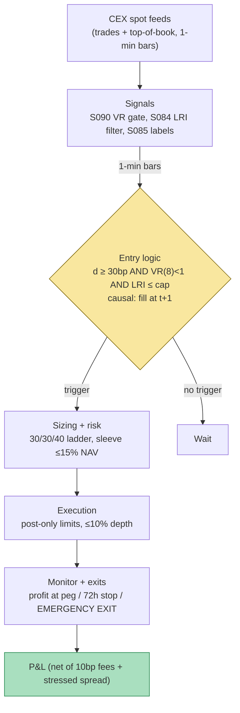

## Stage 154/200 — T054: Stablecoin Peg-Depeg Guard

*Batch TB6 · Strategy 54/100 · Signals S084, S085, S090 · Provenance [D/SR]*

### T1. One-line verdict

| | |
|---|---|
| **Style** | 24/7 crypto event-driven mean-reversion (dip-buying) |
| **Edge source** | Panic-driven stablecoin discounts vs $1.00 redemption value; flow-informativeness filter separates uninformed panic (buyable) from informed flight (avoid) |
| **Typical holding period** | Hours to 3 days (example time stop 72 h); most exits on peg recovery |
| **Capacity hint** | Tens of millions USD per event; events are rare (a few per year) — capacity is event-bound, not continuous |
| **Build-or-buy in one line** | Build the guard on free exchange feeds; buy historical ticks only for multi-year depeg research |

A **stablecoin** is a crypto token designed to hold a fixed price (usually $1.00). A **depeg** is when its market price breaks from that target — e.g. trading at $0.87 instead of $1.00. This strategy buys depeg dips in *fiat-backed* stablecoins (redeemable 1:1 for dollars, such as USDT or USDC), sizing by how *uninformed* the selling flow looks, with a hard **emergency exit protocol** so a survivable dip-buy never becomes a ride to zero. The documented USDC depeg of March 2023 (fell to ~$0.87 on Kraken, recovered within days after Circle pledged to cover the shortfall — CoinDesk, March 2023) is the canonical survivable case; the UST collapse of May 2022 (fell to ~$0, never recovered) is the canonical fatal case the emergency exit exists for.

### T2. Full mechanics

**Universe & session.** Fiat-backed stablecoins only: USDT, USDC, DAI (`example` set — coins with 1:1 dollar redemption and daily spot volume above `example` $500M/day). Explicitly excluded: algorithmic or under-collateralized stablecoins (the UST lesson — no redemption backstop means no dip is "cheap"). Venues: spot pairs STBL/USD and STBL/USDT on 2–3 large centralized exchanges (CEXs). Session is 24/7, but with a **weekend derisk**: banks are closed, so redemptions can halt — position caps halve (`example`) over the weekend.

**Entry rule.** Let P_t be the volume-weighted mid-price across venues. Define the discount d_t = 1 − P_t. All thresholds below are `example`, not institutional standards:

1. **Discount trigger:** d_t ≥ δ with δ = 30 bp (0.30%), sustained for N = 3 consecutive hourly bars — one wick is noise; three bars is a dislocation.
2. **Regime gate (S090):** on the trailing 24 h of 1-min log-returns, the variance-ratio VR(k) (Lo–MacKinlay; see MASTER.md S090 — VR(k) = Var(r_t(k)) / (k·Var(r_t)); VR < 1 means anti-persistence/mean-reversion) must satisfy VR(8) < 1 at the 5% level. Translation: the tape is in a *snap-back* regime around the peg, not a trending break. If VR(8) ≥ 1, the depeg is behaving like a persistent regime shift — stand down.
3. **Flow-informativeness filter (S084):** estimate the Hasbrouck (1991) trade–quote VAR on the STBL/USD 1-min tape (see MASTER.md S084: x_t = c + Σ A_ℓ x_{t−ℓ} + u_t with x_t = (Δm_t, q_t)ᵀ, mid-price revision and signed trade) and compute the long-run impact **LRI** of a sell innovation — the permanent price impact of one unexpected sell. Enter only if LRI ≤ LRI_max (`example`: the 70th percentile of its trailing-30-day distribution). Economic logic: if each unexpected sell *permanently* reprices the coin lower, the flow is informed (someone knows redemptions are impaired) — do not step in front of it. If LRI is low, the selling is uninformed panic and the discount is buyable.

Causal timing: all three conditions are evaluated on closed bars; the earliest fill is the *next* bar (t → t+1).

**Exit rule.**
- **Profit target:** scale out as P_t recovers through 1 − 10 bp; flat by 1 − 5 bp (`example`) — harvest the panic discount, don't invest in the coin.
- **Time stop:** 72 h (`example`) — a depeg that has not recovered in three days is telling you something; exit and re-evaluate.
- **Emergency exit protocol (the core of this strategy):** liquidate the *entire* sleeve immediately, at market, no averaging down, if ANY of: (a) d_t ≥ ε_max = 150 bp (`example`); (b) the issuer announces redemption suspension, banking-partner failure, or withdrawal halts; (c) any tracked CEX halts STBL withdrawals; (d) the S084 LRI estimate triples (`example`) intraday — the flow just became informed. This rule is hard-coded, not discretionary. It is what separates this strategy from "buy every dip" (which died with UST).

**Position sizing.** Sleeve cap: 15% of NAV (`example`). Scale-in tranches: 30% / 30% / 40% of the sleeve at d_t ≥ 30 / 60 / 100 bp (`example` ladder). Sizing formula per tranche: q_i = (w_i · sleeve_cap · NAV) / P_entry,i, rounded down to the venue's lot size. Portfolio heat: stablecoin sleeve + any correlated basis trades ≤ 25% NAV (`example`).

**Risk limits.** Daily loss stop: 2% of NAV on the sleeve → flatten and stand down 24 h. Max gross: the sleeve cap above. Kill switch: any issuer-level news (attestation failure, regulator action, bank-run headline) → cancel all resting entries, arm only the emergency exit.

**Cost model (applied explicitly in T4).** Spot taker fee 10 bp per side (`example`). Spread: ~1–5 bp normally, but Kaiko documented 2% depth for HUSD collapsing $3M → ~$200k in its August 2022 depeg — assume 20–200 bp effective spread (`example`) once d_t > 50 bp, modeled as slippage = max(quoted half-spread, κ·q/ADV), κ = 0.5 (`example`). No borrow cost (spot long only).

**Order/execution sketch.** Entries as post-only limit orders at the touch, participation ≤ 10% of visible depth per minute (`example`); if not filled within 3 bars, chase only up to the next tranche's trigger price. Emergency exits are market orders swept across venues simultaneously; the slippage is priced into ε_max. Queue-position honesty: resting bids during a panic get adversely selected — assume 5 bp adverse selection (`example`) on live fills; the T4 example omits this and says so.

### T3. Signals it consumes

| Signal | Role | Weight / logic |
|---|---|---|
| S090 — Variance-ratio / Hurst regime toggle | Regime gate (veto) | Enter only if VR(8) < 1 (anti-persistent around peg); veto otherwise |
| S084 — Hasbrouck trade–quote VAR | Entry filter (flow informativeness) | Enter only if sell-innovation LRI ≤ 70th pct of 30-day (`example`) |
| S085 — Triple-barrier labeling | Offline labeler for the meta-gate | Labels historical dip-buys y ∈ {+1, −1, 0}: profit barrier = peg recovery (+50 bp, `example`), stop = −150 bp, vertical = 72 h; labels train/validate the δ and LRI_max thresholds |

Combination pseudocode (≤25 lines):

```
each closed hourly bar t:
    P  = median venue mid(STBL) ; d = 1 - P
    if d < 30bp: cancel entries; continue          # no dislocation
    vr = variance_ratio(returns_1m[-24h], k=8)      # S090
    if vr >= 1: continue                           # trending break: veto
    lri = hasbrouck_LRI(tape_1m[-6h])              # S084
    if lri > pct70(lri_history_30d): continue      # informed flow: veto
    tranche = pick(30bp->30%, 60bp->30%, 100bp->40%)
    q = tranche * sleeve_cap * NAV / P
    place post-only limit bid(q) at touch
monitor every minute:
    if d >= 150bp or redemption_halted or cex_withdrawal_halted:
        EMERGENCY_EXIT_ALL()                       # market, all venues
    elif P >= 1 - 10bp: scale_out()
    elif age > 72h: exit_all()
```

### T4. Worked example — numbers + P&L (SYNTHETIC)

All numbers below are **synthetic**, generated with seed **154** (`rng = np.random.default_rng(154)`); the chart in T9 plots exactly these numbers. Setup: fictional fiat-backed stablecoin "STBL", peg $1.00, 60 hourly bars. A synthetic depeg shock bottoms near bar 34 (~$0.966) and recovers to ~$0.999 by bar 55. Fee 10 bp per side (`example`). Spread assumed zero in fills (optimistic — flagged below).

| Step | Bar | Action | Price | Notional | Fee (10 bp) |
|---|---|---|---|---|---|
| 1 | 22 | Buy tranche 1: 10,000 STBL | 0.9822 | $9,821.79 | $9.82 |
| 2 | 30 | Buy tranche 2: 10,000 STBL | 0.9685 | $9,684.50 | $9.68 |
| 3 | 36 | Buy tranche 3: 10,000 STBL | 0.9658 | $9,657.57 | $9.66 |
| 4 | 55 | Sell all 30,000 STBL (peg recovered) | 0.9987 | $29,959.63 | $29.96 |

Line-by-line net P&L (net_i = 10,000·(P_sell − P_buy,i) − fee_buy,i − fee_sell/3):

- Tranche 1: 10,000 × (0.9987 − 0.9822) = $164.75 gross − $9.82 − $9.99 = **+$144.94**
- Tranche 2: 10,000 × (0.9987 − 0.9685) = $301.50 gross − $9.68 − $9.99 = **+$282.36**
- Tranche 3: 10,000 × (0.9987 − 0.9658) = $328.90 gross − $9.66 − $9.99 = **+$309.33**
- **Total: gross $795.75 − fees $59.12 = net +$736.63** on ~$29,164 deployed (~2.5% in ~33 hours, before the optimistic omissions below).

**Where the example is optimistic.** Fills are at printed mid-prices with zero spread; in a real depeg the touch spread is 20–200 bp and resting bids suffer adverse selection (dip-buyers buy *more* as it falls). No partial fills, no latency, no withdrawal halt mid-trade. The DGP *guarantees* recovery — the real distribution includes UST-style zeros, which is what the emergency exit (not modeled here) exists to truncate. Fees are flat 10 bp; stressed venues cost more. The +$736.63 illustrates the ladder, not performance.

### T5. Data & infra — what must run

**Pipeline inventory.** (1) CEX websocket feeds (Binance, Coinbase, Kraken spot): STBL/USD + STBL/USDT trades and top-of-book, 24/7 ingest → 1-min bars; (2) hourly job: refit S084 VAR(10) on rolling 6 h tape, recompute LRI and its 30-day percentile; (3) hourly: S090 VR(8) on trailing 24 h; (4) news/issuer monitor: poll issuer status pages + a news wire for "redemption", "halt", "SVB"-type keywords — this feed arms the emergency exit; (5) nightly: S085 triple-barrier labeling of recent dip episodes to re-validate δ/LRI_max (purged/embargoed per S088 — labels overlap, so embargo ≥ max label horizon).

**M5 Max feasibility: feasible (Tier M+, ~40–80 h ≈ $6,000–12,000 loaded-cost estimate).** Per `notes/cost-model.md` §2: Python event loops handle ~100–500k events/sec — a 3-venue stablecoin tape is <1k events/sec, trivial. VAR(10) OLS refits hourly are milliseconds. RAM: 1-min bars for 3 coins × 2 years ≈ tens of MB — far under the 77 GB working budget (§3). Bottleneck is not compute but **feed reliability at 3 a.m. on a Sunday** — the machine must run 24/7 (electricity ~$100–180/yr, §1 — negligible). What breaks first at scale: adding 20 more stablecoins is still fine; the break point is full L2 depth on all venues (then Rust + per-symbol files, per §3).

**Feed-outage safe mode.** If the price feed drops > 5 min: cancel all resting entries, keep the emergency-exit monitor armed on the last known state, and page the operator. If the *issuer/news* feed drops while a position is open: treat as potential halt — tighten ε_max to 75 bp (`example`) until the feed returns. If a venue halts withdrawals: trigger the emergency exit on that venue's inventory immediately (trapped coins are the failure mode in T8).

### T6. Buy vs build

| Option | What you get | Indicative price | What buying gains | What buying loses |
|---|---|---|---|---|
| Tier 0: exchange websockets + issuer dashboards | Real-time trades/quotes, reserve attestations | ~$0 | Everything the live guard needs | No multi-year history for research |
| Tier 1: CryptoQuant / Glassnode retail tiers | On-chain flows, exchange balances, stablecoin supply | ~$30–300/mo, *indicative — verify before budgeting* | Pre-built stablecoin dashboards | Coarse granularity; labels are vendor-defined |
| Tier 2: Kaiko / Coin Metrics / Amberdata | Historical tick-level trades/quotes across venues, reference rates | Enterprise $$$ (often $1k+/mo), *indicative — verify before budgeting* | Research-grade depeg history (e.g. Kaiko's depeg-threshold studies) | Cost; overkill for a 3-coin guard |
| Build (Python + polars) | The VAR filter, regime gate, ladder, emergency exit | Tier M+ ~40–80 h ≈ $6k–12k loaded | Your own thresholds, no vendor lock-in | You own the 3 a.m. pages |

**Verdict: build the guard, buy nothing to start.** The live strategy runs on free feeds; the only purchase worth considering is one month of Tier-2 history for calibrating δ and LRI_max on the 2022–2023 depeg episodes. Crossover: buy Tier-2 history if you expand beyond ~5 coins or need venue-by-venue depth replay for the emergency-exit slippage model.

### T7. Success-ratio evidence

Honest framing first: there is **no published after-cost track record of a "stablecoin depeg dip-buying strategy"** as a standalone book. What exists is documented price history of depeg episodes plus practitioner research on depeg mechanics — case studies, not a backtest.

| Source | Episode / market | What is documented | Before/after cost | Caveat |
|---|---|---|---|---|
| CoinDesk, Mar 2023 | USDC, Mar 11–13 2023 | Fell to ~$0.87–0.88 on Kraken after Circle disclosed $3.3B stuck at SVB; recovered to ~$0.97+ within ~2 days on Circle's "cover any shortfall" pledge | Price history (before cost) | Buying the low required holding through withdrawal pauses; quoted lows were on thin books |
| Kaiko Research, "Defining Depegs" | USDT/USDC/TUSD/BUSD, 2023–2024 | Formal depeg-threshold metric; USDT's threshold tightest (~$0.998); TUSD threshold widened as Binance promoted it | Analytics (n/a) | Documents *measurement*, not tradability |
| Kaiko Research, Aug 2022 | HUSD depeg | $0.94 → $0.84; 2% market depth collapsed $3M → ~$200k | Liquidity data (before cost) | Partial recovery only — a dip-buy without an exit rule bled |
| Public price history | UST, May 2022 | ~$1 → ~$0, no recovery | Price history | The fatal case: no redemption backstop; any dip-buying rule without the emergency exit = ruin |

**Capacity.** Kaiko's order-book work notes ~$38M of selling would push USDC down 0.1% on its price-discovery venues — a $1M sleeve moves the market ~3 bp on entry: acceptable. Real capacity is **event-bound**: 2–5 tradable depegs per year across the majors, each absorbing perhaps $5–50M of dip-buying before the discount compresses.

**Decay.** Dip-buying bots proliferated after March 2023; discounts compress faster and 500 bp+ dislocations are rarer. The remaining edge is operational: being *able* to trade (funded venues, no withdrawal traps) at 3 a.m. Sunday when others cannot.

**Honest bottom line.** For a ≤$1M paper operation: a sensible opportunistic sleeve — expect months in cash, then 1–4% on deployed capital a few times a year; the emergency exit is the strategy, the entries are the setup. For an institutional desk: needs 24/7 staffing, direct issuer redemption access (the real edge — redeeming at $1.00 while the market prints $0.95), and multi-venue prime brokerage; without redemption access you rent the discount, not arbitrage it.

### T8. Failure modes

1. **Death-spiral averaging (the UST case).** An algorithmic coin keeps falling and the ladder keeps buying into zero. *Mitigation:* universe restricted to fiat-backed coins; emergency exit at ε_max = 150 bp is non-discretionary; tranche 3 requires the S084 filter to *re-pass*, not just the price to fall further.
2. **Redemption halt / bank failure (the SVB case).** The $1.00 backstop disappears over a weekend. *Mitigation:* weekend position caps halved; issuer-news monitor arms the emergency exit on keywords; if redemptions halt, the exit triggers regardless of price.
3. **Exchange withdrawal freeze.** You own the dip on a venue you cannot withdraw from. *Mitigation:* pre-fund 2–3 venues; any withdrawal halt triggers immediate exit of that venue's inventory; never >50% (`example`) on one venue.
4. **Informed-flow misread.** The S084 LRI filter is estimated on a crypto tape with spoofing, wash trading, and venue fragmentation — misspecification means buying into informed flight. *Mitigation:* LRI_max set conservatively (70th pct); require the S090 mean-reversion gate to agree; treat stablecoin tape as censored — label flow metrics `reported_*`.
5. **Regime misclassification at the turn.** VR/Hurst is late by construction; a break can look mean-reverting for the first hours. *Mitigation:* the ε_max emergency exit does not wait for the regime model to agree; hysteresis on re-entry (require 12 h of VR < 1 before re-arming, `example`).
6. **Spread/fees blowout.** Stressed spreads of 200 bp turn a 150 bp "discount" into a loss. *Mitigation:* cost model uses stressed spreads; entries are post-only with a max-payable-spread cap (`example` 50 bp) — if the book is wider, the tranche is skipped.
7. **Oracle/feed staleness.** A stuck price feed shows a fake discount (or hides a real one). *Mitigation:* cross-venue median pricing; any venue deviating >50 bp (`example`) from the median is excluded; feed age > 60 s = stale → safe mode.
8. **Crowded dip-buying.** Post-2023, every dislocation is swarmed; discounts compress before your ladder fills. *Mitigation:* accept partial fills; the strategy's return comes from the rare wide events — do not lower δ to manufacture frequency (that is overfitting the calm regime).

### T9. Visuals


*Caption: synthetic data — not market data. Watermark reads "SYNTHETIC EXAMPLE" exactly. Seed 154 (`np.random.default_rng(154)`); plotted prices are the T4 table values (buys @ 0.9822 / 0.9685 / 0.9658, sell @ 0.9987; per-tranche nets +$144.94 / +$282.36 / +$309.33; total net +$736.63).*



### T10. Sources

- Kaiko Research — "Defining Depegs: A New Metric for Stablecoin Stability" (2024): formal depeg-threshold methodology across USDT/USDC/TUSD/BUSD. https://research.kaiko.com/insights/defining-depegs-a-new-metric-for-stablecoin-stability
- Kaiko Research — "The Data Behind Tether's Depeg": stablecoin price-discovery venues and order-book depth during depeg stress. https://www.kaiko.com/resources/the-data-behind-tethers-depeg
- CoinDesk — "USDC Stablecoin Depegs, Crypto Market Goes Haywire After Silicon Valley Bank Collapses" (Mar 11, 2023): USDC to ~$0.87 on Kraken; $3.3B reserves at SVB. https://www.coindesk.com/markets/2023/03/11/usdc-stablecoin-and-crypto-market-go-haywire-after-silicon-valley-bank-collapses
- CoinDesk — "USDC Stablecoin Regains Dollar Peg After Silicon Valley Bank-Induced Chaos" (Mar 13, 2023): recovery on Circle's shortfall pledge. https://www.coindesk.com/business/2023/03/13/usdc-stablecoin-regains-dollar-peg-after-silicon-valley-bank-induced-chaos
- Kaiko (via marketing.kaiko.com, Aug 2022): HUSD depeg $0.94 → $0.84 with 2% depth collapsing $3M → ~$200k — the liquidity-evaporation case.
- Method references: MASTER.md S084 (Hasbrouck VAR/LRI), S085 (triple-barrier labeling), S090 (variance-ratio/Hurst regime toggle).

**Unverified leads.** Grok's TB6 answers (Q-TB6-1..3) supplied HMM/DeepLOB/news mechanics used only as background for the ML-infra framing; no Grok claim about stablecoin depeg profitability is used as evidence above. Any future claim of the form "X fund made Y% buying the USDC depeg" found in chatbots or social media should be treated as an unverified lead until a prime-brokerage statement or audited track record confirms it.

*Source log: Grok answered Q-TB6-1..3 (2026-09-10); all claims independently verified or labeled unverified.*
