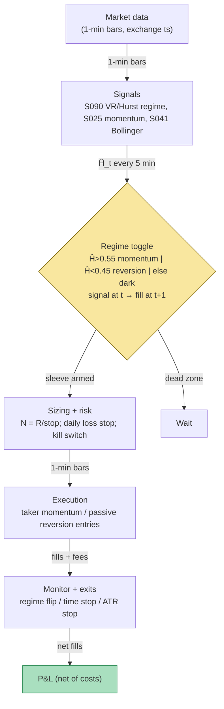

## Stage 154/200 — T054: Hurst/Variance-Ratio Regime Toggle

*Batch TB6 · Strategy 54/100 · Signals S090, S025, S041*

**Provenance: [D/SR].**

### T1. One-line verdict

| | |
|---|---|
| **Style** | Intraday regime-toggled blend: a momentum sleeve armed only in persistent (trending) regimes, a mean-reversion sleeve armed only in anti-persistent regimes, dark in the random-walk dead zone |
| **Edge source** | Return-autocorrelation structure measured by the Lo–MacKinlay variance ratio (S090) and mapped to a Hurst exponent; the toggle routes capital to whichever sleeve's assumption the tape currently satisfies — rolling momentum (S025) when Ĥ says trend, Bollinger tag-and-reenter (S041) when Ĥ says reversion |
| **Typical holding period** | Minutes to under an hour (`example`: 5–30 one-minute bars) |
| **Capacity hint** | Moderate for liquid large caps — the toggle is a risk control, not a capacity unlock; capacity is set by the sleeves |
| **Build-or-buy in one line** | Build the toggle on bought 1-minute bars (Tier 2); no packaged "regime product" can be audited for t→t+1 causality on your universe |

### T2. Full mechanics

**Universe & session.** 20–100 liquid large caps with average daily volume above $50M (`example`); 1-minute bars, RTH 09:45–15:45 ET (`example`); flat by 15:45 ET. Exclude earnings-day names and anything halted.

**Regime estimator (S090).** Let `r_t = ln(P_t / P_{t−1})` be the 1-minute log return. The *variance ratio* at aggregation `k` compares the variance of `k`-bar returns to `k` times the 1-bar variance:

`VR(k) = Var(r_t(k)) / (k · Var(r_t))`, where `r_t(k) = r_t + r_{t−1} + … + r_{t−k+1}`.

Under a random walk (uncorrelated increments), VR(k) = 1 for all k. VR(k) > 1 means positive autocorrelation (*persistence* — trends continue); VR(k) < 1 means negative autocorrelation (*anti-persistence* — reversals dominate). Estimated over a rolling window of 250 one-minute bars (`example`), for `k ∈ {2, 4, 8}` (`example`).

The *Hurst exponent* Ĥ maps the variance ratio onto a 0–1 scale:

`Ĥ(k) = 1/2 · [1 + ln VR(k) / ln k]`

Ĥ > 0.5 means persistent (trending), Ĥ < 0.5 means anti-persistent (mean-reverting), Ĥ = 0.5 is a random walk. (Hurst's original 1951 estimator used rescaled-range — R/S, the range of cumulative deviations divided by the standard deviation, scaling with window length; the VR mapping is the modern econometric equivalent.) Take the median of Ĥ(2), Ĥ(4), Ĥ(8) as Ĥ_t (`example`). S090's documented VR_hi/VR_lo of 1.10/0.90 correspond, at k=4, to Ĥ ≈ 0.534/0.462 — the thresholds below sit just outside that documented band.

Classification (`example` thresholds; re-estimated every 5 minutes):

- **Trend** if Ĥ_t > 0.55 — arm the momentum sleeve, disarm reversion.
- **Reversion** if Ĥ_t < 0.45 — arm the reversion sleeve, disarm momentum.
- **Dead zone** otherwise — no new entries from either sleeve; existing positions run to their exits.
- Hysteresis (`example`): a regime change needs two consecutive 5-minute readings in the new regime before sleeves re-arm, so the toggle does not chatter on estimation noise.

**Momentum sleeve (S025), armed only in Trend.** Signal: `Sig_t = sign(Σ_{i=0}^{29} w_i r_{t−i})` over the trailing 30 one-minute bars (`example`), equal weights (`example`). Volatility targeting sets size: `pos_t = Sig_t · σ_target / σ̂_t`, with σ̂_t the rolling 60-bar return σ (`example`) and σ_target the per-name intraday vol target (`example`). Signal at bar *t* → earliest fill at bar *t+1* (causal timing). Exits, first to fire (`example`): regime flips out of Trend; 30-bar time stop; 1.5× ATR(30) stop (ATR = average true range, the mean bar range over 30 bars).

**Reversion sleeve (S041), armed only in Reversion.** Bollinger(20, 2.0): `Mid_t = SMA(20)_t`; `Upper/Lower = Mid ± 2σ` (`example`); `%b = (P − Lower)/(Upper − Lower)`. *Tag-and-reenter* entry: bar *t−1* closes below the lower band and bar *t* closes back inside — that re-entry is the signal at bar *t*, earliest fill at bar *t+1* (causal timing). Short mirrors on the upper band. Exits (`example`): mid-band touch; 10-bar time stop; 2σ adverse-excursion stop.

**Cross-sleeve rules.** Never both sleeves in one name at once; a name entering the dead zone finishes existing positions but takes no new ones; max 3 sleeve-positions per name per day (`example`).

**Position sizing.** Dollar-risk sizing `N = ⌊R / |P_entry − P_stop|⌋`, R = $500 per trade (`example`); sleeve-level cap ±$2M gross per name (`example`).

**Risk limits.** Daily loss stop −$3,000 (`example`, then dark for the day); portfolio gross cap $10M (`example`); kill switch on any feed anomaly (T5).

**Cost model** (applied in T4): half-spread 1.25 bp per aggressive leg + $0.005/share commission each way; no rebate; stress-tested with doubled spread in T8.

**Order/execution sketch.** Momentum entries: marketable limit at the touch (taker). Reversion entries: passive limit at the re-entered level, cancel/replace after 2 bars (`example`). All exits marketable. Participation cap 5% of trailing 1-minute volume (`example`).

### T3. Signals it consumes

| Signal | Role | Combination logic |
|---|---|---|
| S090 VR/Hurst regime | **Regime toggle** (which sleeve is armed) | Ĥ_t > 0.55 → momentum armed; Ĥ_t < 0.45 → reversion armed; else dark (`example`) |
| S025 rolling momentum | **Trigger in Trend** | Sig_t = sign of trailing-30-bar weighted return; vol-targeted size |
| S041 Bollinger tag-and-reenter | **Trigger in Reversion** | tag at t−1 + re-enter at t → signal at t, fill at t+1, fade toward mid |

```
# T054 combination logic (<=25 lines; every threshold `example`)
on each 1-min bar t (causal, exchange close):
    Ht = median(H(2), H(4), H(8)) over trailing 250 bars   # S090
    regime = trend if Ht>0.55 else reversion if Ht<0.45 else dead
    if regime changed: require 2 consecutive reads to re-arm
    if flat and regime==trend:
        sig = sign(sum(r[t-29:t+1]))                       # S025
        if sig != 0: enter at t+1, N=R/stop, stop=1.5*ATR(30)
    if flat and regime==reversion:
        if close[t-1]<lower[t-1] and close[t]>lower[t]:
            enter long at t+1                              # S041 tag-and-reenter (signal at t)
        # short mirrors on the upper band
    exits: regime flip | time stop (30/10 bars) | stop-loss
    veto new entries in dead zone; flat 15:45 ET
```

### T4. Worked example — numbers + P&L (SYNTHETIC)

**All numbers synthetic** (random seed 154, `batches/TB6/plot_T054.py` — re-runnable). Fictional large-cap "ACME" at ~$249, 1-minute bars 09:31–15:30 ET, 1,000 shares per trade (`example`). Costs: half-spread 1.25 bp per leg + $0.005/share commission each way. In this session the rolling VR estimator never cleared the 0.55 trend threshold — estimation noise on weak persistence kept the momentum sleeve dark, which is the toggle working as designed: no signal, no trade. All three fired trades are S041 tag-and-reenter longs in the reversion regime (Ĥ below the 0.45 `example` threshold at entry).

| # | Sleeve / regime | Dir | Signal (bar) | Entry (bar / ET) | Exit (bar / ET) | Entry px | Exit px | Shares | Gross $ | Cost $ | Net $ | Exit reason |
|---|---|---|---|---|---|---|---|---|---|---|---|---|
| 1 | Reversion | Long | 98 | 99 / 11:10 | 109 / 11:20 | 249.405 | 249.068 | 1,000 | −336.44 | −72.35 | **−408.79** | 10-bar time stop |
| 2 | Reversion | Long | 102 | 103 / 11:14 | 113 / 11:24 | 249.232 | 248.837 | 1,000 | −395.12 | −72.31 | **−467.42** | 10-bar time stop |
| 3 | Reversion | Long | 114 | 115 / 11:26 | 125 / 11:36 | 249.022 | 249.051 | 1,000 | +28.59 | −72.26 | **−43.66** | 10-bar time stop |

Line-by-line walk. **Trade 1:** bar 97 closed below the lower Bollinger band, bar 98 closed back inside — the signal at bar 98 fills at the next bar's price 249.405 (signal at *t*, earliest fill *t+1*; fills assumed in full at the bar price — see optimism notes). The mid-band touch never came; the 10-bar time stop fired at bar 109, exit 249.068. Gross = −$336.44 (full precision). Cost = 2 × 0.0125% × 249.405 × 1,000 + 2 × $0.005 × 1,000 = $62.35 + $10.00 = $72.35. **Net = −$408.79.** Trades 2 and 3 follow the same arithmetic: gross −$395.12/+$28.59, costs $72.31/$72.26, nets **−$467.42**/**−$43.66**.

Totals: gross −$702.97, costs −$216.92, **net −$919.88** over 3 trades. The chart `images/T054_example.png` plots this exact walk: synthetic mid with Bollinger(20, 2.0) bands and entry/exit markers (top), cumulative net P&L with per-trade annotations (bottom), true-regime background shading.

**Where the example is optimistic.** (1) Fills assumed in full at the bar price — no partial fills and no queue-priority lottery on the passive reversion entries. (2) Spread a constant 1.25 bp half-spread; real spreads widen exactly when bands are tagged. (3) Zero latency — signal at bar *t*, fill at bar *t+1* with no wire delay; a retail SIP (Securities Information Processor — the consolidated public quote tape) feed adds tens of milliseconds this arithmetic ignores. (4) The synthetic tape has crisp AR(1) regime blocks; real persistence is mushy and the estimator lags it — this session's dark momentum sleeve is the honest version of that lag. (5) One session, three trades — no statistical content. The net −$919.88 day is the honest shape: at 1,000-share size the ~$72/trade cost stack needs a >3 bp favorable move per leg just to break even, and all three trades died on the time stop.

### T5. Data & infra — what must run

**Pipeline inventory.** Bar ingest (09:15–16:05 ET): 1-minute bars with exchange timestamps into a per-name ring buffer; heartbeat watchdog. Feature loop: rolling 250-bar VR(2/4/8) → Ĥ_t per name every 5 minutes (`example`); per-name SMA(20)/σ for Bollinger; trailing-30-bar momentum sums; ATR(30). Signal→order bridge: signal at bar *t* → order queued for bar *t+1* — causal only. Paper broker + ledger persisted to disk (JSONL). Shared services: NYSE calendar, halt flags, DST handling, risk caps, structured logs.

**M5 Max feasibility: feasible — the toggle is cheap.** Throughput (`notes/cost-model.md` §2): rolling VR/Hurst over 250-bar windows is a NumPy vector op at ~50–200M elements/sec; 100 names re-estimated every 5 minutes is microseconds per cycle. RAM (§3): 500 symbols × 60 days of 1-minute bars ≈ 12 MB — far under the 77 GB working-set budget. Engineering time: Tier M (`cost-model.md` §5) — **20–60 h** ≈ $3,000–9,000 loaded-cost estimate at $150/hr; most of it is the causality audit and the estimator test harness, not compute. Bottleneck: clean corporate-action-adjusted bars and timestamp quality, not the Mac.

**Feed-outage safe mode.** Bar watchdog: if no new bar prints within 90 s of the expected close (`example`) → **flatten immediately, freeze new entries, tag DEGRADED**. Never forward-fill missing bars into the VR window — forward-filled zero returns manufacture fake mean-reversion and bias Ĥ_t down, which would arm the reversion sleeve on a lie. Resume only after 30 consecutive clean bars (`example`) plus a full 250-bar estimator re-warm. Local process crash: restart flat; the on-disk ledger is the source of truth, never RAM.

### T6. Buy vs build

| Option | What you get | Indicative price | Gains | Loses |
|---|---|---|---|---|
| Tier 0: delayed 1-min bars | 15-min delayed bars | ~$0 — *indicative — verify before budgeting* | $0 prototype | no live toggle |
| Tier 1: SIP 1-min bars (Massive/Polygon Stocks Advanced class) | real-time SIP bars | ~$199/mo class — *indicative — verify before budgeting* | cheap live bars | SIP timestamps; regime timing is approximate |
| Tier 2: Databento 1-min bars | exchange-timestamped bars | ~$200/mo + usage — *indicative — verify before budgeting* | honest bar timing | usage metering on history backfill |
| Packaged "regime signal" SaaS | black-box regime labels | varies — *indicative — verify before budgeting* | nothing to build | cannot audit t→t+1 causality or the VR window — skip |

**Verdict: buy the bars, build the toggle.** VR/Hurst on 250-bar windows is ~50 lines of NumPy; the value is your thresholds, hysteresis, and sleeve wiring — none of which any vendor sells. Start on Tier 1 SIP bars for research; promote to Tier 2 when the toggle's live timing matters.

### T7. Success-ratio evidence

The literature documents **return predictability statistics, not after-cost toggled P&L** — that gap is the whole story of T054.

| Study / source | Market & period | Metric | Before/after cost | Caveat |
|---|---|---|---|---|
| Lo & MacKinlay (1988) | US weekly returns, 1962–1985 | variance-ratio test rejects the random walk (VR ≠ 1) | before-cost (statistical test) | rejection of a random walk ≠ proof of tradable trend or reversion — it can reflect time-varying expected returns or nonsynchronous trading |
| Hurst (1951) | hydrology (Nile reservoir storage) | R/S analysis; H ≠ 0.5 in natural series | n/a (not markets) | origin of the exponent, not market evidence |
| Bailey & López de Prado (2014) | general | Deflated Sharpe Ratio corrects for multiple-testing selection bias and non-normal returns | methodological | applies directly to the toggle's mined thresholds (0.55/0.45, windows): any backtested toggle Sharpe must be deflated |
| Grok Q-TB6-3 (leads) | — | purged/embargoed CV and CPCV as the validation standard for threshold choice | qualitative | chatbot-sourced; see Unverified leads |

Capacity: the toggle doesn't create capacity — it rations it. In a persistent market the momentum sleeve inherits momentum capacity (crowded, decays); in chop the reversion sleeve inherits reversal capacity (spread-bound). Decay: the VR/Hurst statistic is stable as measurement; the *tradable* residue decays as more capital toggles on the same thresholds.

**Honest bottom line.** For a ≤$1M paper operation: T054 is a risk-management overlay with **no documented positive after-cost edge as a standalone book** — the papers show returns aren't random walks, not that a toggled intraday blend profits after costs. Its honest value is cutting the left tail: staying dark when neither sleeve's assumption holds (the dead zone). The worked session demonstrates exactly that — the momentum sleeve fired zero trades rather than forcing trades in noise.

### T8. Failure modes

1. **VR estimation noise whipsaws the toggle.** Short windows make Ĥ_t jump across 0.55/0.45 on noise; each re-arm churns. Mitigation: 250-bar window (`example`), median over k, two-reading hysteresis.
2. **Regime-flip latency.** The estimator is backward-looking; you enter the new regime late and exit the old one late — transitions are where both sleeves lose. Mitigation: time stops that don't depend on regime; smaller size for 15 minutes after a flip (`example`).
3. **Microstructure noise contaminates 1-min VR.** Bid-ask bounce at 1-minute sampling biases VR down (fake mean-reversion). Mitigation: estimate on 5-minute bars (`example`) or apply a bounce-bias correction; never toggle on raw 1-min VR without checking.
4. **Lookahead in the rolling window.** Centered windows or overlapping k-bar sums that peek past bar *t*. Mitigation: causal audit — every input to Ĥ_t timestamped ≤ *t*; unit-test with a synthetic step regime.
5. **Cost blowup from toggling.** Each sleeve switch pays the ~$72-style cost stack; frequent re-arms bleed. Mitigation: per-day toggle budget, max 2 re-arms per name (`example`); fee-covering minimum expected move.
6. **Both sleeves wrong simultaneously.** A news shock trends then reverses inside one sleeve's holding period. Mitigation: ATR stop on every position regardless of sleeve; daily loss stop.
7. **Feed outage / stale bars.** Forward-filled bars fake mean-reversion and arm the wrong sleeve. Mitigation: the T5 safe-mode plan — flatten, never interpolate, re-warm the estimator.

### T9. Visuals


The chart carries the "SYNTHETIC EXAMPLE" watermark and the "synthetic data — not market data" caption.



### T10. Sources

1. Lo, A. W. & MacKinlay, A. C. (1988). "Stock Market Prices Do Not Follow Random Walks: Evidence from a Simple Specification Test." *Review of Financial Studies* 1(1): 41–66 — http://web.mit.edu/Alo/www/Papers/lo-mackinlay-88.html (variance-ratio test; the S090 [D] econometric source — a statistical rejection of the random walk, not a trading rule).
2. Hurst, H. E. (1951). "Long-Term Storage Capacity of Reservoirs." *Transactions of the American Society of Civil Engineers* 116: 770–799. DOI 10.1061/TACEAT.0006518 (rescaled-range R/S analysis; origin of the Hurst exponent — hydrology, not markets).
3. Bailey, D. H. & López de Prado, M. (2014). "The Deflated Sharpe Ratio: Correcting for Selection Bias, Backtest Overfitting and Non-Normality." *Journal of Portfolio Management* 40(5): 94–107 — https://papers.ssrn.com/sol3/papers.cfm?abstract_id=2460551 (multiple-testing correction for the toggle's mined thresholds).

**Source log.** Grok answered Q-TB6-1..3 (2026-09-10); all claims independently verified or labeled unverified. Grok's TB6 answers covered HMM regime-switching, DeepLOB classification, and news momentum — none supplied the VR/Hurst toggle mechanics, which are reconstructed here from the S090/S025/S041 [D] signal definitions; every numeric threshold is marked `example`.

**Unverified leads** (chatbot-only — never in Sources):
- Grok Q-TB6-3: purged/embargoed CV and CPCV as the validation standard for the toggle's thresholds — standard practice per the cited AFML literature, but the TB6 rendering is chatbot-sourced; kept as a lead.
- Grok Q-TB6-3: "accuracy vs after-cost P&L" honesty framing for ML overlays — methodological caution, not a measured result.
- Vendor pricing in T6 (Massive/Polygon ~$199/mo class, Databento ~$200/mo + usage) — planning bands, *indicative — verify before budgeting*.

Grok answered Q-TB6-1..3 (2026-09-10); all claims independently verified or labeled unverified.
