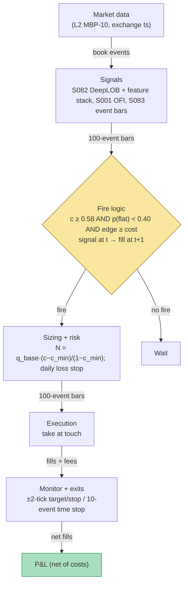

## Stage 155/200 — T055: DeepLOB + Feature-Stack Classifier

*Batch TB6 · Strategy 55/100 · Signals S082, S083, S001*

**Provenance: [D/SR].**

### T1. One-line verdict

| | |
|---|---|
| **Style** | Sub-second limit-order-book classifier scalping: a CNN+LSTM reads the book, a handcrafted feature stack (S082) plus touch OFI (S001) confirms it, and only high-confidence predictions become trades on S083 event bars |
| **Edge source** | Short-horizon predictability of the mid-price from order-book state — DeepLOB's documented finding that book structure predicts the next move — converted to trades through a confidence gate, uncertainty-aware sizing, and an executable-cost filter |
| **Typical holding period** | Seconds (`example`: 10-event time stop on event-time bars) |
| **Capacity hint** | Near zero for a non-colocated taker — the documented moves are fractions of the spread (see T7) |
| **Build-or-buy in one line** | Build the classifier harness on bought L2 (Tier 2/3); the network architecture is the commodity, your labels, calibration, and cost gate are the product |

**DeepLOB classification accuracy is not executable P&L.** Every number the literature reports about DeepLOB-class models is a classification score on labeled book snapshots — accuracy, F1 — measured before costs, before latency, and before the fill. A model can be 70% "accurate" and lose money after the spread, and the worked example below shows exactly how: two of the highest-confidence predictions lose. Read T7 before sizing anything.

### T2. Full mechanics

**Universe & session.** 1–3 liquid large-tick names where the book is deep and the spread is usually 1 tick (`example`); RTH 09:45–15:45 ET (`example`); flat by 15:45 ET. This strategy needs L2 (market-by-price, typically 10 levels — MBP-10) with exchange timestamps; L1 is insufficient because the model input is the depth profile.

**DeepLOB input (S082).** At each event time *t* (the clock advances one step per book event, not per second), form `X_t ∈ R^(100×40)`: the last 100 book snapshots × (10 bid prices, 10 bid sizes, 10 ask prices, 10 ask sizes). A *tick* is the minimum price increment ($0.01 for most US equities). The network: convolutional layers for local price-level patterns, an LSTM (long short-term memory — a recurrent layer carrying state across the 100-snapshot sequence), and a *softmax* (normalized 3-way probability) over {down, flat, up}. Labels compare the future vs past average mid over a short horizon (`example`: next-10-event mean vs past-10-event mean, tick-thresholded flat class). This paragraph is the documented S082 [D] construction; the trading rule around it is reconstructed.

**Feature stack (S082/S001).** Alongside the network, compute handcrafted features on the same event clock: touch OFI (S001 — `ΔOFI_n = e^b_n + e^a_n` per event from the Cont–Kukanov–Stoikov rules, aggregated per bar), queue imbalance, spread in ticks, depth at touch, and event intensity. A shallow meta-model (logistic regression, `example`) blends the network's class probabilities with these features into final `(p⁻, p⁰, p⁺)`. The stack is the fallback the literature recommends (see T7): simpler models often match deep nets, so the features stay even if the network is cut.

**Event bars (S083).** A bar is complete only when its close condition fires (`example`: every 100 events); the bar's features are tradable starting the *next* bar. Signal at bar *t* → earliest fill at bar *t+1* (causal timing).

**Fire rule.** Let `c_t = max(p⁻_t, p⁺_t)` be the *confidence*. Fire only if `c_t ≥ 0.58` (`example`); `p⁰_t < 0.40` (`example`) — flat-class veto; and expected move ≥ round-trip cost (`example`: 0.6-tick RT). Direction = argmax class.

**Uncertainty-aware sizing.** `N_t = ⌊q_base · (c_t − c_min)/(1 − c_min)⌋`, q_base = 100 shares (`example`): size grows linearly from 0 at the gate to full size at perfect confidence. Cap 1% of visible touch depth (`example`).

**Exits** (`example`, first to fire): ±2-tick target/stop on the mid; 10-event time stop; confidence collapse (fresh prediction with `c < 0.50` against the position).

**Cost model** (applied in T4): 0.6 ticks round-trip (`example`); no rebate; fills at the touch.

**Execution.** Marketable limits at the touch on the fire bar; 10% depth cap (`example`); SIP fills are `simulated only — requires MBO/ITCH`.

### T3. Signals it consumes

| Signal | Role | Combination logic |
|---|---|---|
| S082 DeepLOB + feature stack | **Primary trigger** (direction + confidence) | (p⁻, p⁰, p⁺) from CNN+LSTM blended with handcrafted features; fire only if c ≥ 0.58 and p⁰ < 0.40 (`example`) |
| S083 event bars | **Timing grid** | 100-event bars (`example`); bar complete → tradable next bar; t→t+1 causality |
| S001 touch OFI | **Feature + sanity check** | ΔOFI aggregated per bar feeds the stack; a fire whose OFI z-score contradicts the direction is vetoed (`example`) |

```
# T055 combination logic (<=25 lines; every threshold `example`)
on each completed 100-event bar t (causal):
    X = last 100x40 LOB tensor; feats = [OFI, queue_imb, spread, depth]
    (p_minus, p_flat, p_plus) = blend(deeplob(X), gbm(feats))
    c = max(p_minus, p_plus)
    if c >= 0.58 and p_flat < 0.40 and expected_ticks(c) >= 0.6:
        side = +1 if p_plus > p_minus else -1          # fire at t+1
        N = floor(100 * (c - 0.58) / 0.42)             # confidence sizing
        veto if OFI z-score contradicts side
    exits at t+1..: +-2 tick target/stop | 10-event time stop
    flat 15:45 ET; never trade a torn book (T5 safe mode)
```

### T4. Worked example — numbers + P&L (SYNTHETIC)

**All numbers synthetic** (random seed 155, `batches/TB6/plot_T055.py` — re-runnable). Fictional large-tick name "QXL", tick $0.01. Twelve synthetic predictions; each true class is drawn from its own predicted probabilities (a perfectly calibrated model — real models are worse). Directional hits move ±2 ticks; flat realizations move 0. Round-trip cost 0.6 ticks (`example`); gate c_min = 0.58, flat veto p⁰ < 0.40 (`example`).

| # | p⁻ | p⁰ | p⁺ | conf | Action | Size | True move | Gross $ | Cost $ | Net $ |
|---|---|---|---|---|---|---|---|---|---|---|
| 1 | 0.10 | 0.20 | 0.70 | 0.70 | Long | 28 | +1 | +0.56 | −0.17 | **+0.39** |
| 2 | 0.62 | 0.18 | 0.20 | 0.62 | Short | 9 | +1 | −0.18 | −0.05 | **−0.23** |
| 3 | 0.15 | 0.25 | 0.60 | 0.60 | Long | 4 | 0 | +0.00 | −0.02 | **−0.02** |
| 4 | 0.08 | 0.12 | 0.80 | 0.80 | Long | 52 | +1 | +1.04 | −0.31 | **+0.73** |
| 5 | 0.40 | 0.40 | 0.20 | 0.40 | No fire (below gate) | — | — | — | — | — |
| 6 | 0.70 | 0.15 | 0.15 | 0.70 | Short | 28 | −1 | +0.56 | −0.17 | **+0.39** |
| 7 | 0.12 | 0.28 | 0.60 | 0.60 | Long | 4 | +1 | +0.08 | −0.02 | **+0.06** |
| 8 | 0.55 | 0.30 | 0.15 | 0.55 | No fire (below gate) | — | — | — | — | — |
| 9 | 0.05 | 0.10 | 0.85 | 0.85 | Long | 64 | +1 | +1.28 | −0.38 | **+0.90** |
| 10 | 0.25 | 0.50 | 0.25 | 0.25 | No fire (below gate) | — | — | — | — | — |
| 11 | 0.66 | 0.20 | 0.14 | 0.66 | Short | 19 | +1 | −0.38 | −0.11 | **−0.49** |
| 12 | 0.20 | 0.60 | 0.20 | 0.20 | No fire (below gate) | — | — | — | — | — |

Line-by-line walk. **Trade 9 (the best):** p⁺ = 0.85 ≥ 0.58, p⁰ = 0.10 < 0.40 → fire long at the next bar. Size = ⌊100 × (0.85 − 0.58)/0.42⌋ = 64 shares. True class +1: +2 ticks = +$0.02/share. Gross = 64 × 0.02 = +$1.28. Cost = 0.6 × $0.01 × 64 ≈ $0.38. **Net = +$0.90.** **Trade 11 (the lesson):** confidence 0.66 fires short for 19 shares; true class +1 moves +2 ticks against it. Gross = −$0.38; cost $0.11; **net = −$0.49.** The model was confident and wrong, and costs deepened the loss — classification accuracy is not executable P&L. Trade 2 repeats the lesson at 0.62 confidence (−$0.23); trade 3 shows the flat-realization tax — directionally "right" but nothing happened, so the 0.6-tick cost is pure loss (−$0.02).

Totals: 8 fired of 12 predictions; gross +$2.96, costs −$1.23, **net +$1.71** (script total; displayed values rounded). The chart `images/T055_example.png` plots this exact walk: stacked class probabilities with the confidence gate and fired trades (top), cumulative net P&L with per-trade annotations (bottom).

**Where the example is optimistic.** (1) True classes drawn from the predicted probabilities — a perfectly calibrated model; real classifiers miscalibrate exactly when it matters. (2) Fixed ±2-tick moves; real moves are heavy-tailed and stops fill with slippage. (3) Fills assumed at the touch in full size — no partial fills, no queue lottery. (4) Zero latency — prediction at bar *t*, fill at bar *t+1* with no wire delay. (5) Twelve predictions — no statistical content; the +$1.71 total illustrates arithmetic, not evidence. (6) Cost a constant 0.6 ticks; real spreads widen when the book is most predictable.

### T5. Data & infra — what must run

**Pipeline inventory.** L2 ingest (09:15–16:05 ET): MBP-10 book events with exchange timestamps into ring buffers; heartbeat watchdog every 1–2 s; sequence-gap detector. Feature loop: per-event 100×40 tensor assembly, OFI aggregation, imbalance, spread/depth — all on the event clock. Inference per completed event bar; meta-model blend; fire logic. Signal→order bridge: prediction at bar *t* → order queued for bar *t+1* — causal only. Paper broker + ledger on disk (JSONL).

**M5 Max feasibility: feasible for 1–3 names, with the feed as the real constraint.** Throughput (`notes/cost-model.md` §2): a small CNN+LSTM forward pass runs ~1–50 ms/sequence on the M5 GPU — inside a 100-event bar budget for a handful of names, not for 500. RAM (§3): L2 MBP-10 runs ~8–40 GB per symbol-day; the live working set for 3 names fits under the 77 GB budget, but recording raw L2 for replay does not scale casually. Engineering time: Tier H DeepLOB/L2 (`cost-model.md` §5) — **60–200 h** ≈ $9,000–30,000 loaded-cost estimate at $150/hr; the label engineering, calibration, and purged validation are the bulk, not the network code. Bottleneck: L2 feed cost/licensing and inference latency discipline, not raw FLOPS.

**Feed-outage safe mode.** Sequence-number gap or heartbeat missed > 2 s (`example`) → **flatten immediately, freeze new entries, tag DEGRADED**. Never run inference on a torn book — a half-rebuilt 100×40 tensor manufactures confident garbage. Resume after a full snapshot rebuild plus 30 s of clean sequence numbers (`example`).

### T6. Buy vs build

| Option | What you get | Indicative price | Gains | Loses |
|---|---|---|---|---|
| Tier 1 retail: SIP L1 (Massive/Polygon Stocks Advanced class) | real-time SIP quotes | ~$199/mo class — *indicative — verify before budgeting* | cheap live data | no depth — cannot build the 100×40 input; research only |
| Tier 2: Databento MBP-10 | exchange-timestamped 10-level book | ~$200/mo + usage — *indicative — verify before budgeting* | honest event order, real depth | usage metering on history; non-display licensing questions |
| Packaged "AI signal" SaaS | black-box predictions | varies — *indicative — verify before budgeting* | nothing to build | cannot audit labels, calibration, or t→t+1 causality — skip |

**Verdict: buy the L2 feed, build the classifier.** The DeepLOB architecture is published (arXiv:1808.03668); the value is your label definition, calibration, and cost gate. Databento MBP-10 on 1–3 names is the honest Phase-1 spend; below that, run T055 as a *research* harness on historical L2 — never present classification accuracy as executable edge.

### T7. Success-ratio evidence

**DeepLOB classification accuracy is not executable P&L.** Every result below is a prediction score, not a trading P&L. The bridge from one to the other is the cost gate, and the arithmetic is unforgiving.

| Study / source | Market & period | Metric | Before/after cost | Caveat |
|---|---|---|---|---|
| Zhang, Zohren & Roberts (DeepLOB) | FI-2010 benchmark + LSE stocks | CNN+LSTM on 100×40 LOB tensors outperforms baseline models on the classification task | before-cost (classification, not P&L) | predicts the labeled move; says nothing about fills, latency, or the spread |
| Zhang, Zohren & Roberts (BDLOB) | LOB data | Bayesian extension adds uncertainty quantification for position sizing | before-cost (methodological) | uncertainty-aware sizing is a risk tool, not edge |
| Sirignano & Cont (2018) | ~1,000 US stocks, NASDAQ | universal deep model: pooled training generalizes across stocks | before-cost (classification) | cross-stock generalization of *predictions*; still not after-cost P&L |
| Cont, Kukanov & Stoikov (2014) | 50 S&P 500 names, NYSE TAQ | linear Δmid = β·OFI; slope ∝ 1/(2·depth) | before-cost; **contemporaneous impact, not a delayed fill** | the feature-stack's OFI leg predicts the concurrent tick, not your fill |
| Wang (2025) | crypto LOB data | simpler models match or beat deep nets on the paper's data | before-cost (classification) | model-complexity caution: the stack's GBM may be doing the real work |
| Grok Q-TB6-1(B) EV (corrected) | — | EV per fired trade = 2·p − 1 − 0.6 ticks; Grok's "still positive after 0.6 ticks" contradicts its own numbers (0.333 − 0.6 = −0.267) | arithmetic | chatbot-sourced; kept as a cautionary lead on checking chatbot arithmetic |

The breakeven arithmetic: with a ±2-tick target/stop and 0.6-tick round-trip cost, a directional call needs `P(correct) > (2 + 0.6)/4 = 65%` just to break even — before latency and partial fills. At 70% accuracy the model earns 0.7×2 − 0.3×2 − 0.6 = +0.2 ticks per share before latency; at 60% it loses −0.2 ticks. Every published accuracy number sits on the knife's edge of the cost model, which is why accuracy must never be quoted as P&L.

Capacity: near zero for a taker — every colocated participant sees the same public book. Decay: book *predictability* is structural; the *tradable* residue decays with your latency rank.

**Honest bottom line.** For a ≤$1M paper operation: T055 has **no documented positive after-cost edge** — the literature shows book state predicts the next move, and the fee-inclusive arithmetic shows the prediction must clear ~65% accuracy at 1:1 ticks just to break even. The honest institutional use is the BDLOB-flavored one: uncertainty-aware sizing and adverse-selection-aware quoting — "when not to get filled" — not a standalone taker book.

### T8. Failure modes

1. **Miscalibration.** Softmax probabilities are not calibrated frequencies; 0.85 confidence can mean 60% realized. Mitigation: calibrate on held-out data; size on calibrated probabilities only.
2. **Regime shift / news.** The book behaves differently in stress; the model trained on normal flow. Mitigation: spread-multiple and event-intensity tripwires (`example`); stand down on halts.
3. **Latency illusion / queue fantasy.** Your X_t is stale before inference finishes, and passive fills ignore the queue ahead of you. Mitigation: measure feature-to-fill latency into the cost model; this strategy takes (pays the spread) by design; label SIP work `simulated only — requires MBO/ITCH`.
5. **Overfit labels/thresholds.** Mining c_min = 0.58 and the flat veto on one quarter's microstructure. Mitigation: purged/embargoed walk-forward validation (S088); deflated Sharpe on the *trading* rule, not the classifier.
6. **L2 feed cost and gaps.** L2 is the expensive leg; a gap tears the tensor. Mitigation: the T5 safe-mode plan — flatten on sequence gaps, rebuild from snapshot.
7. **Complexity without benefit.** The deep net adds latency while the GBM-on-features does the work (Wang 2025). Mitigation: ablation — ship the stack alone first; add the network only if it clears the cost gate net of its latency.

### T9. Visuals


The chart carries the "SYNTHETIC EXAMPLE" watermark and the "synthetic data — not market data" caption.



### T10. Sources

1. Zhang, Z., Zohren, S. & Roberts, S. (2019). "DeepLOB: Deep Convolutional Neural Networks for Limit Order Books." *IEEE Transactions on Signal Processing* — arXiv:1808.03668 — https://arxiv.org/abs/1808.03668 (CNN+LSTM on 100×40 LOB tensors, three-class move prediction; the S082 [D] source — classification, not trading P&L).
2. Zhang, Z., Zohren, S. & Roberts, S. (2018). "BDLOB: Bayesian Deep Convolutional Neural Networks for Limit Order Books." arXiv:1811.10041 — https://arxiv.org/abs/1811.10041 (uncertainty quantification for the sizing leg — a risk tool, not edge).
3. Sirignano, J. & Cont, R. (2018). "Universal Features of Price Formation in Financial Markets." arXiv:1803.06917 — https://arxiv.org/abs/1803.06917 (pooled deep model generalizes across ~1,000 US stocks — prediction generality, still before-cost).
4. Cont, R., Kukanov, A. & Stoikov, S. (2014). "The Price Impact of Order Book Events." *Journal of Financial Econometrics* 12(1): 47–88. arXiv:1011.6402 — https://arxiv.org/abs/1011.6402 (OFI definition and contemporaneous impact; the S001 [D] source).
5. Wang (2025). "Better Inputs Matter More Than Stacking Another Hidden Layer." arXiv:2506.05764 — https://arxiv.org/abs/2506.05764 (simpler models match/exceed deep models on the paper's crypto LOB data — model-complexity caution; 2025 crypto evidence, not US-equity executable-P&L evidence).

**Source log.** Grok answered Q-TB6-1..3 (2026-09-10); all claims independently verified or labeled unverified. Grok's Q-TB6-1(B) supplied the prediction-to-trade walk structure (confidence gate, flat veto, confidence sizing, 0.6-tick cost) adapted here with independent seed-155 numbers; Grok's EV arithmetic in that answer was checked and found self-contradictory (0.333 − 0.6 = −0.267, negative — not "still positive"), and the corrected arithmetic is used above. Every numeric threshold is marked `example`.

**Unverified leads** (chatbot-only — never in Sources):
- Grok Q-TB6-1(B): DeepLOB "F1 83.40% on FI-2010, ~70% on LSE L2" — no checkable source captured; the verified claim is the abstract-level "outperforms baselines." Unverified.
- Grok Q-TB6-2: DeepLOB-on-M5-Max infra sizing (GPU memory, training hours) — chatbot estimates; planning only.
- Grok Q-TB6-3: handcrafted-GBM vs deep-net comparisons — directionally consistent with Wang (2025) but the TB6 numbers are chatbot-sourced.
- Vendor pricing in T6 (Massive/Polygon ~$199/mo class, Databento ~$200/mo + usage) — planning bands, *indicative — verify before budgeting*.

Grok answered Q-TB6-1..3 (2026-09-10); all claims independently verified or labeled unverified.
