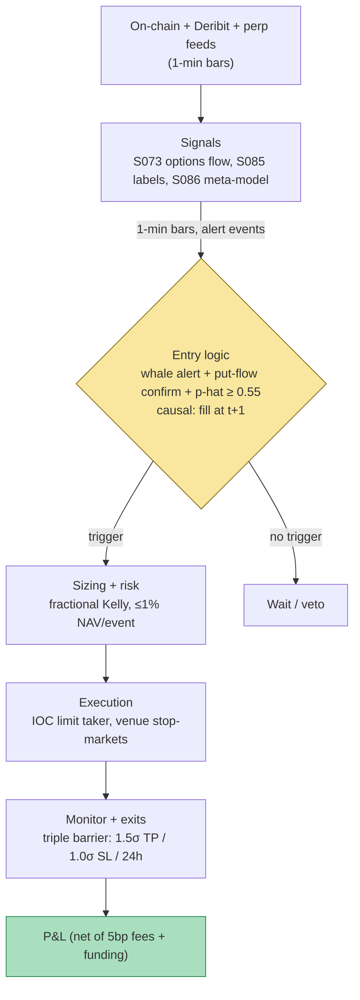

## Stage 155/200 — T055: On-Chain Whale-Flow Tracker

*Batch TB6 · Strategy 55/100 · Signals S085, S086, S073 · Provenance [D/SR]*

### T1. One-line verdict

| | |
|---|---|
| **Style** | Crypto event-driven directional (short-biased on whale distribution) |
| **Edge source** | Large exchange inflows ("whales" moving coins to sell) front-run retail; options-flow confirmation separates real distribution from internal wallet shuffling |
| **Typical holding period** | 4–24 hours (triple-barrier exits; `example` vertical barrier 24 h) |
| **Capacity hint** | $1–10M per event before the perp's own impact eats the edge; a few events per week |
| **Build-or-buy in one line** | Buy the on-chain alert feed (labeling exchange wallets is the hard part); build the confirmation and sizing stack yourself |

A **whale** is a holder of a very large crypto balance (commonly ≥ 1,000 BTC). An **exchange inflow** is an on-chain transfer into a wallet tagged as belonging to an exchange — the standard practitioner read is "coins moving to where they can be sold," i.e. potential sell pressure. This strategy follows whale-sized exchange inflows, but only when crypto **options flow** (Deribit put buying / call selling) confirms directional intent, and sizes each bet with a **meta-model** (a model that predicts whether the primary bet will win). The honesty headline, documented by CryptoQuant's own head of research: much "whale" activity is exchanges shuffling their own wallets, not distribution — the confirmation layer exists precisely because the raw alert is noisy.

### T2. Full mechanics

**Universe & session.** BTC and ETH (`example` universe — the only coins with both deep on-chain tagging and liquid options). Instruments: spot for the alert leg context, USD-margined perpetual futures ("perps" — futures with no expiry that track spot via a periodic **funding rate** payment between longs and shorts) for the trade. Session 24/7; no-trade window during major US macro releases is optional (`example` — crypto often ignores it).

**Entry rule** (all thresholds `example`, not institutional standards):

1. **Whale alert:** a single on-chain transaction (or cluster within 30 min) moving ≥ W\* = $10M (`example`) into a tagged exchange wallet, excluding known internal-consolidation patterns (round amounts, self-churn heuristics). Data is labeled `reported_inflow_*` — exchange wallet tags are vendor-labeled and censored (mixers, unlabeled OTC desks, and internal transfers the vendor mis-tags all corrupt the series; it is a lower bound on true whale flow).
2. **Options confirmation (S073):** within Δt = 30 min (`example`) of the alert, Deribit flow must show signed net put buying: F_t = Σ q_j Δ_j M_j (signed delta flow per MASTER.md S073; q_j = ±1 trade sign, Δ_j = option delta, M_j = contract multiplier) with F_t below −F\* (`example`: −$5M delta-equivalent), or equivalently put-volume/OI spiking above 1.5× (`example`) its 20-day median. Rationale: a whale about to sell often hedges or expresses the view in options first; options flow is harder to fake than a wallet transfer.
3. **Meta-model gate (S086):** a classifier p̂_t = f̂(x_t, s_t) ≈ P(win | features, side) (MASTER.md S086) trained on S085 triple-barrier labels of past whale events. Enter only if p̂_t ≥ τ = 0.55 (`example`). Features: inflow size, exchange-whale-ratio, funding rate, perp basis, recent volatility, time-of-day.

Causal timing: the alert is confirmed at bar close; earliest fill is the next 1-min bar (t → t+1). Never trade the alert candle itself — by the time the vendor tags it, the fast money has moved.

**Exit rule (S085 triple-barrier, `example` parameters).** For a short entered at P_0 with hourly ATR σ̂: profit barrier = P_0·(1 − 1.5σ̂), stop barrier = P_0·(1 + 1.0σ̂), vertical barrier = 24 h. First touch wins; the vertical-barrier exit is at the prevailing price. No discretionary overrides except the portfolio kill switch.

**Position sizing.** Fractional Kelly on the meta-model: q_t = q_base · max(0, 2·p̂_t − 1) · (σ_target / σ̂_t), with q_base = 2.0 BTC (`example`), σ_target = 25% annualized (`example`). Half size if p̂_t ∈ [0.55, 0.60). Max per-event risk 1% NAV (`example`); max 2 concurrent whale events.

**Risk limits.** Daily loss stop 3% NAV → flatten, no new alerts for 24 h. Kill switch: Deribit or perp venue API down → cancel entries, manage existing via stop-market. Weekend/illiquid-hour sizing halved.

**Cost model (applied in T4).** Perp taker fee 5 bp per side (`example`; VIP0 ~2–5 bp). Funding: shorts pay when funding is positive — `example` 1 bp per 8 h during stress, prorated by hours held. Slippage: half-spread on the perp, `example` 1 bp, plus impact ψσ√(q/V) with ψ = 0.5 (`example`) — negligible at 1–2 BTC on BTC perps.

**Order/execution sketch.** IOC (immediate-or-cancel) limit orders 2 bp through the touch (`example`) for entries — speed matters more than spread capture after confirmation; exits via stop-market (stop barrier) and limit take-profit. Participation cap n/a (perps are deep); queue-position honesty: entries are taker by design, so no queue games — costs are explicit.

### T3. Signals it consumes

| Signal | Role | Weight / logic |
|---|---|---|
| S085 — Triple-barrier labeling | Labeler: resolves every whale-alert bet to y ∈ {win, loss} | Profit 1.5σ̂ / stop 1.0σ̂ / vertical 24 h (`example`); labels train the meta-model |
| S086 — Meta-labeling | Veto + sizing: p̂_t = P(win \| x_t, side) | Trade only if p̂_t ≥ 0.55; size = q_base·max(0, 2p̂−1)·σ_target/σ̂ (`example`) |
| S073 — Unusual options activity | Confirmation filter | Require signed put-flow F_t < −$5M delta-equiv within 30 min of alert (`example`) |

Combination pseudocode (≤25 lines):

```
on whale_alert(inflow >= $10M to tagged exchange wallet):   # reported_inflow
    if is_internal_consolidation(alert): return             # CryptoQuant caveat
    wait up to 30 min for options window
    F = signed_delta_flow(Deribit, window)                  # S073
    if F > -$5M: return                                     # no confirmation
    x = [inflow_size, whale_ratio, funding, basis, vol, tod]
    p = meta_model.predict_proba(x, side='short')           # S086
    if p < 0.55: return                                     # veto
    q = 2.0 * max(0, 2*p - 1) * (0.25 / sigma_hat)          # BTC, example
    enter short q BTC perp at next bar (IOC limit)
    set triple barrier: TP 1.5*ATR, SL 1.0*ATR, vertical 24h  # S085
on barrier touch or vertical: exit at market/limit
```

### T4. Worked example — numbers + P&L (SYNTHETIC)

All numbers **synthetic**, seed **155** (`np.random.default_rng(155)`); chart in T9 plots exactly these. Setup: BTC perp, 96 hourly bars. Four whale alerts; fees 5 bp/side (`example`), funding 1 bp/8 h paid by shorts (`example`).

| # | Bar | Alert | Options (S073) | Meta p̂ (S086) | Action |
|---|---|---|---|---|---|
| A1 | 10 | $14M inflow to exchange wallet | F = −$7.2M put flow ✓ | 0.68 | SHORT 2.0 BTC @ $66,809 |
| A2 | 30 | $11M inflow | F = −$1.1M ✗ | 0.48 | VETOED — no trade |
| A3 | 55 | $22M inflow | F = −$9.8M put flow ✓ | 0.63 | SHORT 2.0 BTC @ $64,281 |
| A4 | 75 | $10M inflow | F = −$5.4M put flow ✓ | 0.55 | SHORT 1.0 BTC @ $63,372 (half size) |

Line-by-line (net = (entry − exit)·qty − taker fees − funding):

- **A1:** exit bar 16 @ $65,970 (**profit barrier**). Gross = (66,809 − 65,970) × 2 = **$1,678.50**. Fees = 0.0005 × 2 × (66,809 + 65,970) = $132.78. Funding = 0.0001 × (6/8) × 2 × 66,809 = $10.02. **Net +$1,535.70.**
- **A2:** vetoed. **Net $0** — the meta-model's most valuable contribution is the trades it prevents.
- **A3:** exit bar 73 @ $63,405 (**profit barrier**). Gross = (64,281 − 63,405) × 2 = **$1,751.72**. Fees $127.69, funding (18 h) $28.93. **Net +$1,595.11.**
- **A4:** exit bar 95 @ $63,772 (**time stop**, 20 h). Gross = (63,372 − 63,772) × 1 = **−$399.96**. Fees $63.57, funding $15.84. **Net −$479.38.**
- **Total net: +$2,651.42** across 3 traded events (2 wins, 1 loss; 1 vetoed).

**Where the example is optimistic.** The DGP places clean, taggable whale transfers with textbook options confirmation — real alerts arrive with vendor latency (minutes), many "whale" transfers are later re-tagged as internal, and Deribit flow during stress is dominated by dealer hedging that mimics directional flow. Fills are at printed prices with 5 bp fees; real entries after a public alert suffer 5–20 bp of slippage as the same signal fires across bots. Funding is a flat 1 bp/8 h; during real distribution events funding can spike against shorts. The +$2,651.42 is arithmetic illustration, not performance.

### T5. Data & infra — what must run

**Pipeline inventory.** (1) On-chain alert feed: vendor websocket/API (whale transfers to tagged exchange wallets) → normalize to `reported_inflow_*` series, 1-min; (2) Deribit trade feed (public websocket: options trades with price/size) → signed delta flow F_t per S073, 1-min; (3) perp venue feed (trades/quotes) + funding-rate history; (4) hourly job: recompute S085 labels on closed events, weekly purged/embargoed refit of the meta-model (S088 — event labels overlap, so purge + embargo ≥ 24 h); (5) 24/7 alert daemon with the entry/exit state machine.

**M5 Max feasibility: feasible (Tier M+, ~60–100 h ≈ $9,000–15,000 loaded-cost estimate).** Per `notes/cost-model.md` §2/§3: on-chain + Deribit + perp feeds are <5k events/sec — Python handles it; the meta-model (LightGBM on ~50 features, per Grok's TB6-2 lead that GBTs are the sane default) trains in minutes on CPU. RAM trivial (1-min bars). The real cost is the 24/7 daemon and alert latency, not compute. Bottleneck: vendor API rate limits and tag latency, not the Mac. Breaks at: full mempool ingestion for pre-confirmation detection (needs an archive node + Rust parser — Tier H).

**Feed-outage safe mode.** If the whale-alert feed drops > 10 min: no new entries (the trigger is gone); existing positions keep their triple-barrier exits, managed via venue-native stop-markets so they survive a local outage. If Deribit feed drops: confirmation unavailable → new entries vetoed (fail closed). If the perp venue API drops: cancel entries; exits fall back to venue stop-markets placed at entry time — never hold a position whose stop lives only in your process.

### T6. Buy vs build

| Option | What you get | Indicative price | What buying gains | What buying loses |
|---|---|---|---|---|
| Tier 0: exchange/Deribit public websockets, mempool.space | Raw trades, options prints, on-chain transfers | ~$0 | Everything except wallet labels | No exchange-wallet tagging (the hard part) |
| Tier 1: CryptoQuant / Glassnode (retail tiers) | Tagged exchange flows, whale ratio, alerts API | ~$30–300/mo, *indicative — verify before budgeting* | The alert feed itself; pre-built whale metrics | Vendor tag definitions; alert latency (minutes) |
| Tier 2: Kaiko / Coin Metrics / Amberdata | Historical tick + on-chain reference data | $$$ enterprise, *indicative — verify before budgeting* | Research-grade history for the meta-model | Cost; still no options-flow join |
| Build (Python + LightGBM) | S073 flow computer, S085/S086 label + meta-model, execution daemon | Tier M+ ~60–100 h ≈ $9k–15k loaded | Your own confirmation thresholds; no black-box tags in the decision | You maintain the 24/7 daemon |

**Verdict: buy the alert feed (Tier 1), build everything else.** Wallet tagging at scale is a data-moat business — rebuilding it is Tier H for zero edge. But never let the vendor's "whale alert" be the trade: the confirmation (S073), veto (S086), and exits (S085) are yours. Crossover: if you outgrow retail alert latency, Tier-2 with co-located ingestion — at that point you are an infra shop, budget accordingly.

### T7. Success-ratio evidence

The evidence base is thin and mostly vendor-adjacent — stated plainly.

| Source | Market & period | What is documented | Before/after cost | Caveat |
|---|---|---|---|---|
| CryptoQuant Quicktake (via Cointelegraph, 2026) | BTC, 2024–2026 | 30-day SMA of the Exchange Whale Ratio (top-10 inflows ÷ total inflows) near multi-year highs; "a downturn in whale deposits on spot exchanges often precedes a bullish rally" | Analytics (n/a) | Vendor marketing-adjacent; contrarian-timing folklore, not a traded backtest |
| CryptoQuant (via Cointelegraph, Sep 2026) | BTC | STH-whale unrealized profit at record $9.07B; "whale participation in exchange inflows relatively contained" | Analytics (n/a) | Describes positioning, not a signal return |
| Event-study paper (JOEEP via Dergipark) | BTC, multi-year | Net inflows to top-100 non-custodial wallets followed by +0.79%/+1.66%/+2.44% abnormal returns at 7/14/28 days | Before cost | Studies whale *accumulation*, the opposite direction of this strategy's distribution thesis |
| CryptoQuant head of research (Sep 2026) | BTC | "Whale accumulation" data distorted by exchange consolidation — wallets misclassified | Methodological caution | Directly weakens naive alert-following |

**Capacity.** Each event supports roughly $1–10M of short perp notional before 5–20 bp of self-impact; 2–4 events/week across BTC+ETH. Beyond ~$20M the strategy is the market impact.

**Decay.** Alert bots commoditized after 2021; the first minute after a public whale alert is now picked over. Residual edge, if any, is in the *confirmation stack* (options flow + meta-veto), which is harder to copy than the alert.

**Honest bottom line.** For a ≤$1M paper operation: run it as a risk overlay and opportunistic short book, not a core strategy — expect long flat stretches, a win rate barely above a coin flip before costs, and most value from the vetoed trades (A2-style). Paper-trade at least 100 alerts before sizing real capital; the published evidence does not support a standalone Sharpe claim. For an institutional desk: the desk already has better flow (its own OTC desk sees real distribution); this strategy is a retail-accessible proxy for information the institution gets directly — as a primary book it is outgunned.

### T8. Failure modes

1. **Mislabeled wallets (the documented killer).** Exchange consolidation routinely masquerades as whale accumulation/distribution (CryptoQuant's own research head, Sep 2026). *Mitigation:* internal-consolidation heuristics; require options confirmation — a wallet shuffle does not buy puts.
2. **Alert latency.** Vendor tags arrive minutes after the on-chain event; the move is done. *Mitigation:* measure tag latency per vendor; if median > 3 min (`example`), drop to a veto-only role (use alerts to *exit* longs, not to enter shorts).
3. **Dealer-hedging mimicry.** Deribit put buying can be dealers hedging structured-product issuance, not directional whales. *Mitigation:* S073 volume-vs-OI form (new positioning, not churn); cross-check perp funding — dealer hedging rarely moves funding.
4. **Funding blowout.** Shorting into a crowded distribution event when funding spikes to 30 bp/8 h (`example`) turns winners into losers. *Mitigation:* funding gate — no entry if |funding| > 5 bp/8 h (`example`); funding is a modeled cost, not an afterthought.
5. **Meta-model overfit.** A LightGBM on a few hundred whale events with purged CV still overfits regime (2021 bull vs 2022 bear). *Mitigation:* S088 purged/embargoed validation; walk-forward refit; DSR (deflated Sharpe) on the number of tried configs — per Grok's TB6-3 lead, halve the backtest Sharpe as a planning rule.
6. **Exchange-tag censorship.** Mixers, unlabeled OTC desks, and cross-chain bridges hide the largest flows — `reported_inflow_*` is a lower bound. *Mitigation:* label everything `reported_*`; size as if true flow is 2–3× reported (`example` haircut on q_base).
7. **Venue/venue-API failure mid-short.** A short with no working exit during a squeeze is the max-loss path. *Mitigation:* venue-native stop-markets placed at entry; position caps; kill switch flattens on API loss.
8. **Regime flip: inflows as accumulation.** Post-ETF, large inflows can be authorized-participant inventory, not distribution. *Mitigation:* the S073 confirmation must agree; AP flows do not buy puts — when in doubt, the veto wins.

### T9. Visuals


*Caption: synthetic data — not market data. Watermark reads "SYNTHETIC EXAMPLE" exactly. Seed 155 (`np.random.default_rng(155)`); plotted numbers are the T4 table (A1 short 2.0 @ $66,809 → $65,970 net +$1,535.70; A2 vetoed; A3 short 2.0 @ $64,281 → $63,405 net +$1,595.11; A4 short 1.0 @ $63,372 → $63,772 net −$479.38; total +$2,651.42).*



### T10. Sources

- Cointelegraph — "Bitcoin bull run comeback? Whale exchange inflow metric nears 5-year high" (2026): CryptoQuant Exchange Whale Ratio (top-10 inflows ÷ total), 30-day SMA 0.46. https://cointelegraph.com/markets/bitcoin-bull-run-comeback-whale-exchange-inflow-5-year-high
- Cointelegraph — "Bitcoin whales spark sell-side risk as unrealized gains hit $9B" (Sep 2026): CryptoQuant STH-whale data; "whale participation in exchange inflows relatively contained". https://cointelegraph.com/markets/new-bitcoin-whales-spark-sell-side-risk-as-unrealized-gains-hit-9b
- Event-study paper on whale purchases and BTC abnormal returns (Journal of Economics and Emerging Economies / Dergipark): net inflows to top-100 wallets followed by higher forward abnormal returns (7/14/28-day horizons). http://dergipark.org.tr/en/download/article-file/5483714
- CryptoQuant head of research via infomarine.net (Sep 2026): whale-accumulation data distorted by exchange consolidation — the mislabeling caveat. https://infomarine.net/en/insight/118-crypto-news/56264-no,-whales-are-not-accumulating-massive-amounts-of-bitcoin-cryptoquant.html
- Method references: MASTER.md S085 (triple-barrier), S086 (meta-labeling), S073 (unusual options activity / signed delta flow).

**Unverified leads.** Grok's TB6 answers supplied the purged-CV/embargo, meta-labeling, and GBM-vs-DeepLOB framing used in T5/T8 background; none of Grok's performance-adjacent claims are used as evidence. Chatbot claims of the form "whale alerts predict X% moves" are unverified leads until reproduced on purged/embargoed data.

*Source log: Grok answered Q-TB6-1..3 (2026-09-10); all claims independently verified or labeled unverified.*
