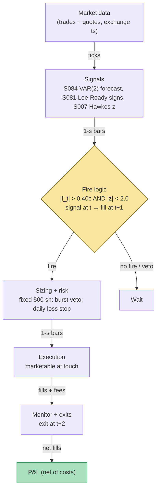

## Stage 156/200 — T056: Hasbrouck Trade–Quote VAR Predictor

*Batch TB6 · Strategy 56/100 · Signals S084, S007, S081*

**Provenance: [D/SR].**

### T1. One-line verdict

| | |
|---|---|
| **Style** | Trade-by-trade vector-autoregression (VAR) predictor: Hasbrouck's model of how trades move quotes forecasts the next trade's price impact, a signed-volume imbalance filter (S007) and a trade-direction classifier (S007/S081) clean the input, and only high-conviction predictions become ultra-short-horizon trades |
| **Edge source** | Permanent vs transitory decomposition of trade price impact — Hasbrouck's documented finding that trades carry information about future quote revisions — converted to trades through a signal-strength gate and an executable-cost filter |
| **Typical holding period** | 1–5 trades (`example`: exit 2–5 trades after entry) |
| **Capacity hint** | Tiny — the predicted moves are fractions of the tick on a per-trade basis |
| **Build-or-buy in one line** | Buy tick data (Tier 2); build the VAR — it is ~100 lines of least squares, and the value is your gating, not the model |

### T2. Full mechanics

**Universe & session.** 1–2 liquid large-tick names where per-trade dynamics are stable (`example`); RTH 09:45–15:45 ET (`example`); flat by 15:45 ET. Tick data (every trade and quote, exchange-timestamped) required; SIP TAQ (Trade and Quote — the consolidated public tape) is workable for research, but any live claim needs exchange timestamps.

**The Hasbrouck VAR (S084).** For each trade time *t*, define `r_t` = the log quote-midpoint change (the *return*) and `x_t` = the signed trade indicator (+1 buyer-initiated, −1 seller-initiated, 0 no trade at that quote revision). Hasbrouck (1991) models their joint dynamics as a vector autoregression with *p* lags (`example`: p = 5):

```
r_t = Σ_{i=1..p} a_i r_{t-i} + Σ_{i=0..p} b_i x_{t-i} + v1_t
x_t = Σ_{i=1..p} c_i r_{t-i} + Σ_{i=1..p} d_i x_{t-i} + v2_t
```

The `b_i` coefficients capture how signed trades move the quote — the *price impact*; the VAR's moving-average representation separates the *permanent* (information-driven) component from the *transitory* (inventory/spread) component. The trade signal: the VAR's one-step-ahead forecast `f_t = E[r_{t+1} | information through t]` — the predicted next quote revision attributable to trade flow. All of this paragraph is the documented S084 [D] construction (Hasbrouck 1991); the trading rule is reconstructed. Signal at trade *t* → earliest fill at trade *t+1* (causal timing).

**Trade direction (S007/S081).** The signed indicator `x_t` needs a classifier when quote data is ambiguous: the Lee–Ready rule (tick test against the prevailing quote — S081's documented [D] contribution) assigns +1/−1; S007's imbalance logic aggregates signed volume over short windows as a cross-check. Mid-quote trades (at the exact midpoint) get `x_t = 0` — never force a sign. Misclassified trades inject noise directly into `f_t`; the Lee–Ready rule's documented misclassification rate on modern data is the input error you live with.

**Fire rule (worked example: VAR(2)).** The worked example estimates a 2-lag VAR on `x_t = (dm_t, q_t)` — mid change and Lee–Ready sign — with coefficient matrices A1, A2 (`example` values in `plot_T056.py`). The one-step-ahead forecast `f_t` (in cents) uses data through bar *t* only. Fire only if `|f_t| > 0.40` cents (`example`) — the gate. Direction = sign(f_t). Signal at bar *t* → earliest fill at bar *t+1*, exit at bar *t+2* (causal timing).

**Burst veto (Hawkes).** Bacry et al. (2013) model trade arrivals as a *Hawkes process* — a self-exciting point process where each trade temporarily raises the arrival intensity (a *burst*). When the buy/sell intensity imbalance z-score satisfies `|z| ≥ 2.0` (`example`), **veto all entries**: bursts are when the VAR's linear coefficients break down and adverse selection is worst. This is the S084-family risk leg: don't trade the VAR when its stationarity assumption is visibly violated.

**Sizing.** Fixed 500 shares per fired signal (`example`).

**Exits** (`example`): one bar after entry (hold bars *t+1* → *t+2*); flat 15:45 ET.

**Cost model** (applied in T4): half-spread 0.50 cents/share + $0.005/share commission each way → round-trip $7.50 on 500 shares (`example`); no rebate; fills assumed at the mid — optimistic, stated in the text.

**Execution.** Marketable limit at the touch on bar *t+1*; exits marketable. Participation cap 5% of the bar's volume (`example`). SIP-timestamped backtests are `simulated only — requires MBO/ITCH`.

### T3. Signals it consumes

| Signal | Role | Combination logic |
|---|---|---|
| S084 Hasbrouck trade–quote VAR | **Primary trigger** (forecast f_t) | example VAR(2) on (dm_t, q_t); fire only if \|f_t\| > 0.40 cents |
| S007 signed-volume imbalance | **Input cleaner** | Hawkes buy/sell imbalance z; veto entries when \|z\| ≥ 2.0 (`example`) |
| S081 Lee–Ready / tick rule | **Direction classifier** | assigns q_t ∈ {+1, −1}; the signed trade input to the VAR |

```
# T056 combination logic (<=25 lines; every threshold `example`)
on each bar t (causal):
    q_t = lee_ready(trade, quote)            # +1/-1 signed trade
    f_t = A1[0] @ [dm_t, q_t] + A2[0] @ [dm_{t-1}, q_{t-1}]   # cents, data <= t
    burst = abs(hawkes_z(t)) >= 2.0
    if abs(f_t) > 0.40 and not burst:
        side = sign(f_t)                     # fill at t+1, exit at t+2
        N = 500
    flat 15:45 ET
```

### T4. Worked example — numbers + P&L (SYNTHETIC)

**All numbers synthetic** (random seed 156, `batches/TB6/plot_T056.py` — re-runnable). Fictional name "QXM" at ~$50, fourteen synthetic 1-second bars. Example VAR(2) on (dm_t, q_t) with the coefficient matrices printed in the script; forecast gate |f_t| > 0.40 cents; Hawkes veto at |z| ≥ 2.0 (`example`). Round-trip cost $7.50 per 500-share trade (`example`: 0.50¢ half-spread + $0.005/share commission each way). Signal at bar *t* → fill at bar *t+1*, exit at bar *t+2*. Fills assumed at the mid — optimistic (see below).

| Signal bar | f_t (¢) | Hawkes z | Action | Entry bar | Exit bar | Entry px | Exit px | Gross $ | Cost $ | Net $ |
|---|---|---|---|---|---|---|---|---|---|---|
| 2 | +0.60 | +1.2 | Long | 3 | 4 | 50.030 | 50.010 | −10.00 | −7.50 | **−17.50** |
| 3 | +1.45 | +0.8 | Long | 4 | 5 | 50.010 | 50.020 | +5.00 | −7.50 | **−2.50** |
| 4 | −0.60 | −1.1 | Short | 5 | 6 | 50.020 | 50.040 | −10.00 | −7.50 | **−17.50** |
| 5 | +0.25 | +0.4 | No trade (below gate) | — | — | — | — | — | — | — |
| 6 | +1.60 | +2.6 | **Vetoed** (Hawkes burst) | — | — | — | — | — | — | — |
| 7 | −0.25 | +0.2 | No trade (below gate) | — | — | — | — | — | — | — |
| 8 | +0.35 | −0.7 | No trade (below gate) | — | — | — | — | — | — | — |
| 9 | +1.60 | +1.5 | Long | 10 | 11 | 50.050 | 50.030 | −10.00 | −7.50 | **−17.50** |
| 10 | −0.25 | −0.3 | No trade (below gate) | — | — | — | — | — | — | — |
| 11 | −1.60 | −0.9 | Short | 12 | 13 | 50.040 | 50.050 | −5.00 | −7.50 | **−12.50** |
| 12 | +0.25 | −1.8 | No trade (below gate) | — | — | — | — | — | — | — |

Line-by-line walk. **Bar 2:** f_t = +0.60¢ clears the 0.40¢ gate, z = +1.2 no veto → long signal; fill at bar 3 at 50.030, exit bar 4 at 50.010. Gross = (50.010 − 50.030) × 500 = −$10.00. Cost $7.50. **Net = −$17.50.** **Bar 3:** f_t = +1.45¢ → long; fill bar 4 at 50.010, exit bar 5 at 50.020 — the one winner on gross (+$5.00), but the $7.50 cost stack eats it: **net −$2.50.** **Bar 4:** f_t = −0.60¢ → short; fill bar 5 at 50.020, exit bar 6 at 50.040, gross −$10.00, **net −$17.50.** **Bar 6 (the veto):** f_t = +1.60¢ — the strongest forecast of the session — but z = +2.6 ≥ 2.0, so the Hawkes burst veto kills it. The veto is the cheapest risk control in the strategy: no trade, no loss. **Bars 9 and 11** repeat the pattern: both fire, both lose (nets −$17.50, −$12.50).

Totals: 5 trades, gross −$30.00, costs −$37.50, **net −$67.50** (displayed values rounded; script total −$67.50). The chart `images/T056_example.png` plots this exact session: synthetic mid with forecast annotations, Hawkes-z bars with veto lines, and entry/exit markers (top); cumulative net P&L with per-trade annotations (bottom).

**Where the example is optimistic.** (1) Fills assumed at the mid in full size — no spread paid on entry, no partial fills; a real taker pays the touch. (2) The VAR(2) coefficients are fixed `example` values matched to the synthetic DGP — real estimation adds error on top of the model's misspecification. (3) Lee–Ready signs assumed correct on every bar; real misclassification injects noise into f_t. (4) Burst detection assumed instantaneous; real Hawkes fits lag the burst. (5) Eleven signal bars — no statistical content. (6) Constant $7.50 cost; real effective spreads widen exactly when |f_t| is largest. **Where the example is pessimistic:** a real desk would stop after bar 4's second consecutive loss; the example keeps firing to show the cost arithmetic — costs (−$37.50) exceed the gross loss (−$30.00), which is the entire story of per-trade microstructure strategies.

### T5. Data & infra — what must run

**Pipeline inventory.** Tick ingest (09:15–16:05 ET): every trade and quote with exchange timestamps into ring buffers; heartbeat watchdog every 1–2 s; sequence-gap detector. Quote engine: prevailing-quote tracker for the Lee–Ready tick rule; mid-quote flagging. Feature loop: rolling VAR(2) coefficient refresh every N trades (`example`: refit every 500 trades on a 5,000-trade window); Hawkes intensity z-score per bar. Signal→order bridge: forecast at bar *t* → order queued for bar *t+1* — causal only. Paper broker + ledger on disk (JSONL).

**M5 Max feasibility: feasible — the VAR is trivial compute.** Throughput (`notes/cost-model.md` §2): a VAR(2) least-squares refit on 5,000 trades is microseconds of NumPy (~50–200M elements/sec); per-bar forecasting is a dot product. RAM (§3): one symbol-day of TAQ trades+quotes ≈ 0.5–4 GB (L1 events) — under the 77 GB working-set budget for 1–2 names. Engineering time: Tier M (`cost-model.md` §5) — **20–60 h** ≈ $3,000–9,000 loaded-cost estimate at $150/hr; the work is the causality audit, the Lee–Ready validation, and the Hawkes veto calibration — not compute. Bottleneck: timestamp quality (SIP vs exchange) and the Lee–Ready misclassification rate on your names, not the Mac.

**Feed-outage safe mode.** Heartbeat missed > 2 s or a quote-sequence gap (`example`) → **flatten immediately, freeze new entries, tag DEGRADED**. Never run the VAR on a torn tape — a missing quote revision corrupts the sign classification and the forecast. Resume after 60 s of clean sequence numbers plus a full VAR window re-warm (`example`). Local process crash: restart flat; the on-disk ledger is the source of truth, never RAM.

### T6. Buy vs build

| Option | What you get | Indicative price | Gains | Loses |
|---|---|---|---|---|
| Tier 0: delayed quotes | 15-min delayed TAQ | ~$0 — *indicative — verify before budgeting* | $0 prototype | no live forecasts |
| Tier 1: SIP TAQ (Massive/Polygon Stocks Advanced class) | real-time trades+quotes | ~$199/mo class — *indicative — verify before budgeting* | cheap live tape | SIP timestamps; per-trade timing is approximate |
| Tier 2: Databento trades+quotes | exchange-timestamped ticks | ~$200/mo + usage — *indicative — verify before budgeting* | honest event order | usage metering on history backfill |
| Packaged "microstructure signal" SaaS | black-box forecasts | varies — *indicative — verify before budgeting* | nothing to build | cannot audit t→t+1 causality or the sign classifier — skip |

**Verdict: buy the tape, build the VAR.** A VAR(2) is ~30 lines of least squares; the value is your sign classification, gate, and veto — none of which any vendor sells. Start on Tier 1 SIP TAQ for research; promote to Tier 2 when per-trade timing matters.

### T7. Success-ratio evidence

The literature documents **information content in trade flow, not after-cost per-trade P&L** — the gap between those two is the T056 story.

| Study / source | Market & period | Metric | Before/after cost | Caveat |
|---|---|---|---|---|
| Hasbrouck (1991) | NYSE, 1989 (Dell Computer example) | VAR shows trades have significant permanent price impact — information in order flow | before-cost (econometric) | impact is measured, not harvested; says nothing about your fill |
| Lee & Ready (1991) | NYSE, 1988 | tick-rule trade-direction algorithm; documented classification accuracy on their sample | before-cost (methodological) | accuracy degrades on modern fragmented data — input error, not edge |
| Dufour & Engle (2000) | NYSE, 1996–97 | VAR with time-between-trades: faster trading → larger price impact | before-cost (econometric) | supports the burst veto logic, not the trading rule |
| Bacry et al. (2013) | FX/futures data | Hawkes model fits order-flow clustering | before-cost (model fit) | justifies the veto; not a P&L result |
| Grok Q-TB6 (leads) | — | per-trade EV sketches | qualitative | chatbot-sourced; see Unverified leads |

The worked session shows the arithmetic honestly: the VAR's forecasts were directionally right often enough to produce a +$5.00 gross winner, but the $7.50/trade cost stack turned 5 trades into −$67.50. Permanent impact exists — Hasbrouck proved it — but the permanent component of a *single* trade's impact is smaller than the round-trip cost of trading it. That is why this strategy's honest institutional form is not a taker book but an *execution* input: the VAR forecast tells an execution algo when a trade will move the quote, so the algo can time its child orders — harvesting the measurement without paying the taker's cost.

Capacity: near zero as a standalone taker — you compete with every market maker whose quotes already embed this VAR. Decay: the *measurement* (trades move quotes) is permanent microstructure; the *tradable* residue decays with your latency rank and the spread.

**Honest bottom line.** For a ≤$1M paper operation: T056 has **no documented positive after-cost edge as a standalone taker strategy** — the literature proves information in trade flow, and the fee-inclusive arithmetic shows a single trade's predictable revision is smaller than the cost of trading it. Its honest value is as a veto/timing input to execution: don't trade into bursts, and time child orders with the forecast.

### T8. Failure modes

1. **Lee–Ready misclassification.** Wrong signs feed the VAR garbage; f_t degrades silently. Mitigation: validate the classifier against your names' quote data; use exchange timestamps so the prevailing quote is correct.
2. **VAR misspecification.** Two lags can't capture the true impact curve; coefficients drift intraday. Mitigation: refit on rolling windows; monitor forecast-vs-realized calibration; stand down when calibration breaks.
3. **Burst-regime breakdown.** The veto lags the burst it is meant to catch. Mitigation: the |z| ≥ 2.0 veto (`example`) plus a hard cap on trades per 5-minute window (`example`).
4. **Spread-crossing arithmetic.** Every signal smaller than the cost stack is a guaranteed loss — the gate is the strategy. Mitigation: never relax the 0.40¢ gate (`example`) without re-measuring the cost stack.
5. **Lookahead in the VAR window.** Refitting on data that includes the forecast target. Mitigation: causal audit — coefficients at *t* use trades ≤ *t* only; unit-test with synthetic data.
6. **Latency.** The forecast is for the *next* bar; if your fill lands two bars late you trade noise. Mitigation: measure signal-to-fill latency; if it exceeds one bar, the strategy is off.
7. **Overfit gates.** Mining 0.40¢ and 2.0 on one week's tape. Mitigation: walk-forward validation; deflated Sharpe on the *trading* rule.

### T9. Visuals


The chart carries the "SYNTHETIC EXAMPLE" watermark and the "synthetic data — not market data" caption.



### T10. Sources

1. Hasbrouck, J. (1991). "Measuring the Information Content of Stock Trades." *Journal of Finance* 46(1): 179–207. DOI 10.1111/j.1540-6261.1991.tb03749.x — https://afajof.org/issue/volume-46-issue-1/ (trade–quote VAR; the S084 [D] source — permanent vs transitory impact decomposition, not a trading rule).
2. Lee, C. M. C. & Ready, M. J. (1991). "Inferring Trade Direction from Intraday Data." *Journal of Finance* 46(2): 733–746. DOI 10.1111/j.1540-6261.1991.tb02683.x — https://afajof.org/issue/volume-46-issue-2/ (tick-rule direction classification; the S081 [D] source).
3. Dufour, A. & Engle, R. F. (2000). "Time and the Price Impact of a Trade." *Journal of Finance* 55(6): 2467–2498. DOI 10.1111/0022-1082.00297 — https://onlinelibrary.wiley.com/doi/10.1111/0022-1082.00297 (VAR with durations; supports the burst-veto logic).
4. Bacry, E., Delattre, S., Hoffmann, M. & Muzy, J. F. (2013). "Modelling Microstructure Noise with Mutually Exciting Point Processes." *Quantitative Finance* 13(1): 65–77. DOI 10.1080/14697688.2011.647054 — http://ideas.repec.org/a/taf/quantf/v13y2013i1p65-77.html (Hawkes order-flow model; the veto's [D] source).

**Source log.** Grok answered Q-TB6-1..3 (2026-09-10); all claims independently verified or labeled unverified. Grok did not supply the T056 trade–quote VAR specification — the VAR(2) mechanics, gates, and seed-156 numbers are reconstructed here from the S084/S007/S081 [D] signal definitions. Every numeric threshold is marked `example`.

**Unverified leads** (chatbot-only — never in Sources):
- Grok Q-TB6: per-trade EV sketches for VAR-based scalping — no checkable numbers captured; the verified claim is the session arithmetic above.
- Vendor pricing in T6 (Massive/Polygon ~$199/mo class, Databento ~$200/mo + usage) — planning bands, *indicative — verify before budgeting*.

Grok answered Q-TB6-1..3 (2026-09-10); all claims independently verified or labeled unverified.
