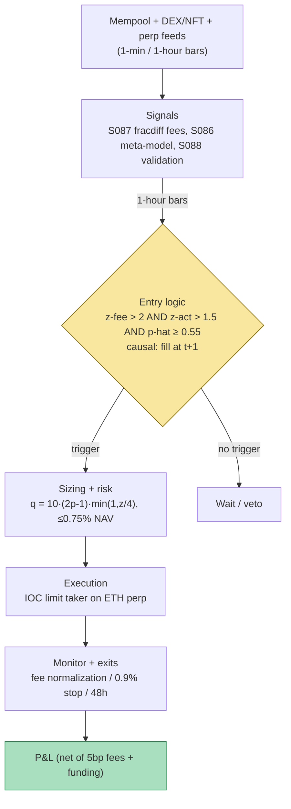

## Stage 156/200 — T056: Mempool Congestion Fee-Cycle Trader

*Batch TB6 · Strategy 56/100 · Signals S086, S087, S088 · Provenance [SR]*

### T1. One-line verdict

| | |
|---|---|
| **Style** | Crypto stat/ML mean-reversion on network-congestion cycles |
| **Edge source** | Gas-fee spikes mark speculative frenzy (NFT mints, liquidation cascades, mania tops); fading the frenzy in ETH perps with activity-volume confirmation |
| **Typical holding period** | 6–24 hours (exit on fee normalization or stop; `example`) |
| **Capacity hint** | $0.5–5M per episode; a few episodes per month — thin, episodic capacity |
| **Build-or-buy in one line** | Build the whole thing on free mempool data; there is nothing worth buying except your own discipline about the weak evidence base |

The **mempool** is the waiting room for unconfirmed blockchain transactions. **Gas** is the fee users pay to get transactions included; under **EIP-1559** (Ethereum's 2021 fee reform) each block has a **base fee** that rises when blocks are fuller than 50% and falls when emptier — a built-in mean-reverting cycle. This strategy trades the *cycle*: extreme congestion (fee z-score high) confirmed by surging on-chain activity (NFT mints, DEX volume) has historically coincided with local speculative excess; the strategy shorts ETH into the spike and covers when fees normalize. The tradable instrument is ETH perpetuals — gas itself is not tradable since EIP-1559 burned the old gas-token tricks. Provenance is [SR]: the fee-cycle pattern is practitioner folklore with real mechanism-design literature behind the cycle itself (Roughgarden 2021), but no published after-cost strategy record — the chapter says so repeatedly.

### T2. Full mechanics

**Universe & session.** ETH only (`example` universe; the fee cycle is an Ethereum phenomenon — do not port it to other chains without re-deriving). Instrument: USD-margined ETH perpetual. Session 24/7; fee spikes cluster in US/EU waking hours and around scheduled NFT mints — no session filter, the z-score handles it.

**Entry rule** (all thresholds `example`):

1. **Fee signal (S087):** take the base-fee series g_t (gwei), apply fractional differentiation (MASTER.md S087: (1−L)^d x_t = Σ w_k x_{t−k}, d = smallest with ADF p < 0.05, `example` d ≈ 0.3) to get a stationary-but-memory-retaining series g̃_t, then z-score against a diurnal baseline (median + MAD per hour-of-week, 90-day lookback): z^fee_t = (g̃_t − med_h) / MAD_h. Require z^fee_t > 2.0.
2. **Activity confirmation:** DEX swap volume + NFT marketplace volume (USD, 1-h bars), z-scored the same way: z^act_t > 1.5 (`example`). A fee spike *without* activity is usually a wallet bug or an airdrop-farming artifact — not tradable frenzy.
3. **Meta-model gate (S086):** p̂_t = P(win | [z^fee, z^act, funding, perp basis, recent ETH return]) ≥ 0.55 (`example`), trained on S085-style barrier labels of past spikes. This is what vetoes spike 3 in T4 (high fee, dead activity).

Causal timing: features on closed hourly bars; earliest fill next bar (t → t+1).

**Exit rule.**
- **Normalization exit:** cover when z^fee_t < 0.5 (`example`) — the frenzy passed; the edge is gone.
- **Stop:** +0.9% adverse move from entry (`example`) — congestion can precede genuine demand (a real catalyst), and the short must not become a thesis.
- **Time stop:** 48 h (`example`).

**Position sizing.** q = q_base · max(0, 2p̂ − 1) · min(1, z^fee/4), q_base = 10 ETH (`example`); max per-episode risk 0.75% NAV (`example`). No pyramiding into a running spike.

**Risk limits.** Daily loss stop 2% NAV. Max 1 concurrent fee-cycle position (episodes overlap; the book must not double-count the same frenzy). Kill switch: node/RPC feed down → no new entries; existing managed by venue stops.

**Cost model (applied in T4).** Perp taker 5 bp/side (`example`); funding 1 bp/8 h (`example`), can be negative (paid *to* shorts when perps trade below spot — a tailwind this strategy sometimes catches). Slippage: 2 bp (`example`) on entries — ETH perps are deep. On-chain hedging is deliberately avoided (paying gas to hedge a gas trade is circular); the perp basis is monitored instead.

**Order/execution sketch.** Entries: IOC limits 3 bp through touch (`example`) — the signal decays in hours, not milliseconds, but post-spike reversals start fast. Exits: limit take-profit at the normalization print; stop-market for the 0.9% stop. Participation: ≤ $2M notional per episode initially (`example` capacity discipline).

### T3. Signals it consumes

| Signal | Role | Weight / logic |
|---|---|---|
| S087 — Fractional differentiation | Feature engineering: stationarize gas series preserving memory | d = smallest with ADF p<0.05 (`example` ~0.3); z^fee vs diurnal baseline |
| S086 — Meta-labeling | Veto + sizing on spike trades | p̂ ≥ 0.55 to trade (`example`); size scales with (2p̂−1) |
| S088 — Purged / embargoed CV | Validation discipline for the meta-model | Purge overlapping spike labels; embargo ≥ max label horizon; walk-forward refit |

Combination pseudocode (≤25 lines):

```
each closed hourly bar t:
    g  = fracdiff(base_fee_series, d=0.3)          # S087
    zf = (g[t] - diurnal_median[hour]) / diurnal_mad[hour]
    za = zscore(dex_vol + nft_vol, diurnal)        # activity
    if zf < 2.0 or za < 1.5: continue              # example gates
    p = meta_model.predict([zf, za, funding, basis, ret_24h])  # S086
    if p < 0.55: continue                          # veto (spike 3 case)
    q = 10 * max(0, 2*p - 1) * min(1, zf/4)        # ETH, example
    short q ETH perp at next bar (IOC limit)
    exits: cover if zf < 0.5; stop +0.9%; time 48h
# offline: labels = barrier outcomes of past spikes;
# validate meta-model with purged CV + embargo (S088)
```

### T4. Worked example — numbers + P&L (SYNTHETIC)

All numbers **synthetic**, seed **156** (`np.random.default_rng(156)`); chart in T9 plots exactly these. Setup: 120 hourly bars; base-fee gwei series with three congestion spikes; ETH perp; fees 5 bp/side (`example`), funding 1 bp/8 h (`example`).

| Episode | Bar | z^fee | z^act | Meta p̂ | Action |
|---|---|---|---|---|---|
| Spike 1 | 24 | 15.48 | 2.14 | ≥0.55 ✓ | SHORT 10 ETH @ $3,356 |
| Spike 2 | 58 | 11.77 | 2.01 | ≥0.55 ✓ | SHORT 10 ETH @ $3,285 |
| Spike 3 | 93 | 16.33 | −0.17 | — | VETOED (activity dead) |

Line-by-line (net = (entry − exit)·qty − fees − funding):

- **Spike 1:** exit bar 35 @ $3,294 (**fee normalized**, z^fee < 0.5). Gross = (3,356 − 3,294) × 10 = **$613.72**. Fees = 0.0005 × 10 × (3,356 + 3,294) = $33.25. Funding (11 h) = $4.61. **Net +$575.86.**
- **Spike 2:** exit bar 61 @ $3,315 (**stop 0.9%** — the spike preceded genuine demand). Gross = (3,285 − 3,315) × 10 = **−$295.67**. Fees $33.00, funding $1.23. **Net −$329.90.**
- **Spike 3:** vetoed — the highest fee print of the three, with no activity behind it. **Net $0.**
- **Total net: +$245.96** on 2 traded episodes (1 win, 1 stopped; 1 vetoed).

**Where the example is optimistic.** The DGP draws clean, isolated spikes with a cooperative ETH response; real fee series have overlapping spikes, re-orgs, and MEV-bot wars that make z^fee whip. Activity volume is assumed cleanly measurable — real NFT/DEX volume is polluted by wash trading (label it `reported_activity_*`). Fills at printed prices with 5 bp fees; real post-spike entries face 5–15 bp slippage as momentum algos pile in. The meta-model's veto is assumed correct; in production it vetoes good trades too. The +$245.96 illustrates the mechanics, not an edge.

### T5. Data & infra — what must run

**Pipeline inventory.** (1) Execution/archive Ethereum node or mempool websocket (pending-tx count, base fee, priority fees) → 1-min/1-h bars; (2) DEX trade data (Uniswap v3 subgraph or a vendor) + NFT marketplace volume → `reported_activity_*`, 1-h; (3) ETH perp feed + funding history; (4) hourly feature job: fracdiff (S087), diurnal z-scores, meta-model scoring; (5) weekly: re-label past spikes with barrier outcomes, purged/embargoed refit of the meta-model (S088).

**M5 Max feasibility: feasible (Tier M, ~30–60 h ≈ $4,500–9,000 loaded-cost estimate).** Per `notes/cost-model.md` §2/§3: mempool + DEX + perp feeds are a few k events/sec — Python is fine; fracdiff on 90 days of hourly data is seconds; LightGBM refit weekly is minutes. RAM: everything in 1-h bars is megabytes. The expensive choice is running your own archive node (2–4 TB NVMe, `example` ~$400–800 per cost-model §2 guidance on external SSDs); a third-party mempool API avoids it. Bottleneck: node/RPC reliability, not the Mac. Breaks at: tick-level mempool replay for research (then Rust parser + per-day files).

**Feed-outage safe mode.** If the node/RPC feed drops: no new entries (the trigger is the feed). Existing position keeps venue-native stop-market + time-stop daemon on the perp feed (independent path). If the *activity* feed drops but fees are live: fail closed — entries require both gates, so no trade. If the perp venue API drops: cancel entries; exits fall back to pre-placed venue stops.

### T6. Buy vs build

| Option | What you get | Indicative price | What buying gains | What buying loses |
|---|---|---|---|---|
| Tier 0: own node / mempool.space, DEX subgraphs, perp websockets | Base fee, pending txs, DEX/NFT volume, perp data | ~$0 (+ hardware for a node) | The complete live stack | Historical depth for research |
| Tier 1: Amberdata / Coin Metrics community tiers | Normalized on-chain + DEX metrics | ~$0–300/mo, *indicative — verify before budgeting* | Clean `reported_activity_*` without running a node | Metric definitions are vendor-chosen |
| Tier 2: Kaiko / Amberdata enterprise | Historical tick mempool + DEX data | $$$ enterprise, *indicative — verify before budgeting* | Multi-year spike history for the meta-model | Overkill until the live book works |
| Build (Python + LightGBM) | S087 features, S086 meta-model, S088 validation, daemon | Tier M ~30–60 h ≈ $4.5k–9k loaded | Full control of the (weak) edge | You own the "is this even real" question |

**Verdict: build on Tier 0, buy nothing.** Every input is free or near-free; the binding constraint is evidence, not data access. Spend one Tier-1 month *only* if you need clean multi-year activity history to test whether the pattern predates 2021. Crossover: there is none on cost — the crossover is on belief: do not buy data until a purged/embargoed backtest on free data shows a pre-cost edge worth defending.

### T7. Success-ratio evidence

Brutal honesty: **no peer-reviewed or practitioner study documents an after-cost edge for trading ETH on gas-fee cycles.** What is documented is the *mechanism* that makes the cycle exist, plus adjacent facts:

| Source | What is documented | Relevance | Before/after cost |
|---|---|---|---|
| Roughgarden (2021), "Transaction Fee Mechanism Design", arXiv:2106.01340 | EIP-1559's base fee rises/falls with demand; the fee cycle is a designed mean-reverting process | The tradable cycle exists by construction | Theory (n/a) |
| Daian et al. (2019), "Flash Boys 2.0", arXiv:1904.05234 | Priority gas auctions (PGAs): bots competitively bid up fees; fee spikes coincide with DEX arbitrage wars | Spikes = frenzy, the strategy's core premise | Empirical measurement (before cost) |
| Leonardos et al. / Reijsbergen et al. (via "Empirical Analysis of EIP-1559", arXiv:2201.05574) | Post-London block-size oscillations; base-fee adjustment dynamics | The cycle's statistical character | Empirical (n/a) |
| Practitioner folklore (mempool.watching, CT) | "Gas spikes mark tops" | Anecdote only | Unverified |

**Capacity.** $0.5–5M per episode before the perp entry itself becomes the signal; episodes cluster (NFT season) then vanish for months. Realistic throughput: 20–40 episodes/year.

**Decay.** Whatever edge existed decayed as MEV bots professionalized fee bidding (Flash Boys 2.0 documented the 2019 version; by 2024 the bidding is institutional). The remaining fade is against *retail* frenzy, which migrates chains — the pattern must be re-derived per chain, per year.

**Honest bottom line.** For a ≤$1M paper operation: a research project, not a strategy — paper-trade it for a year, demand a purged/embargoed pre-cost Sharpe > 1.0 before risking capital, and expect it to fail that bar. The chapter's real value is the template (S087 → S086 → S088) applied to a novel domain, reusable wherever you find a cleaner cycle. For an institutional desk: not a book; at most a feature in a broader crypto relative-value model.

### T8. Failure modes

1. **No real edge (the base case).** The correlation of fee spikes with local tops may be entirely explained by volatility, which is tradable more cleanly. *Mitigation:* require the purged/embargoed backtest to beat a volatility-only benchmark; if it doesn't, kill the strategy.
2. **Wash-trading pollution.** `reported_activity_*` includes wash volume; z^act can confirm a fake frenzy. *Mitigation:* filter known wash patterns (self-trades, round-trip volumes); label series `reported_*`; require fee + activity + funding to agree.
3. **Genuine-demand spikes.** A real catalyst (ETF approval, major upgrade) spikes fees *and* price — the short faces a squeeze (T4 spike 2). *Mitigation:* the 0.9% stop is tight by design; news monitor vetoes entries within 24 h of scheduled catalysts (`example`).
4. **MEV-bot regime change.** Fee dynamics are set by bots, and bot strategies change quarterly. *Mitigation:* walk-forward refit; monitor the fracdiff d and diurnal baselines for drift — if d won't stationarize, the cycle changed shape.
5. **Overlapping episodes.** Spikes cluster; two positions become one big correlated bet. *Mitigation:* max 1 concurrent position; new entries blocked while one is open.
6. **Node/RPC failure during a spike.** The trigger feed dies exactly when congestion is worst. *Mitigation:* redundant RPC providers; fail closed (no entries); exits on the independent perp-venue path.
7. **Funding against the short.** Frenzy episodes can print deeply negative funding (perps below spot) — a tailwind — or spike positive. *Mitigation:* funding gate: skip if funding > 5 bp/8 h (`example`); model funding as a cost, never assume the tailwind.
8. **Chain migration.** The frenzy moves to L2s or another L1; Ethereum mainnet fees go quiet for a year. *Mitigation:* track L2 fee series too; the strategy is parameterized by chain — redeploy, don't force.

### T9. Visuals


*Caption: synthetic data — not market data. Watermark reads "SYNTHETIC EXAMPLE" exactly. Seed 156 (`np.random.default_rng(156)`); plotted numbers are the T4 table (spike 1: short 10 @ $3,356 → $3,294 net +$575.86; spike 2: short 10 @ $3,285 → $3,315 stopped net −$329.90; spike 3 vetoed; total +$245.96).*



### T10. Sources

- Tim Roughgarden — "Transaction Fee Mechanism Design" (EC 2021; arXiv:2106.01340): EIP-1559's history-dependent base fee; the designed mean-reverting fee cycle. https://arxiv.org/abs/2106.01340
- Philip Daian et al. — "Flash Boys 2.0: Frontrunning, Transaction Reordering, and Consensus Instability in Decentralized Exchanges" (2019; arXiv:1904.05234): priority gas auctions — bots bidding up fees around DEX opportunities. https://arxiv.org/abs/1904.05234
- "Empirical Analysis of EIP-1559: Transaction Fees, Waiting Time, and Consensus Security" (arXiv:2201.05574): post-London fee dynamics and block-size oscillations. https://arxiv.org/abs/2201.05574
- Method references: MASTER.md S087 (fractional differentiation), S086 (meta-labeling), S088 (purged/embargoed CV).

**Unverified leads.** Grok's TB6 answers (Q-TB6-1..3) supplied the fracdiff/purged-CV/GBT-default framing used in T2/T5; no Grok claim about fee-cycle profitability is used as evidence. Practitioner claims of the form "gas spikes mark tops" (social media, mempool dashboards) are unverified leads — anecdote, not evidence — until reproduced with purged/embargoed labels.

*Source log: Grok answered Q-TB6-1..3 (2026-09-10); all claims independently verified or labeled unverified.*
