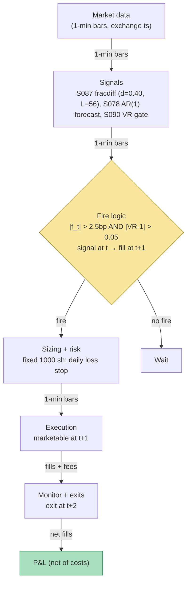

## Stage 157/200 — T057: Fractional-Differentiation Memory Trader

*Batch TB6 · Strategy 57/100 · Signals S087, S078, S090*

**Provenance: [D/SR].**

### T1. One-line verdict

| | |
|---|---|
| **Style** | Long-memory intraday trader: fractionally differentiate the price series (S087) to stationarity *without* destroying its memory, fit a short autoregression on the differenced series (S078), and trade the one-step-ahead forecast only when a variance-ratio gate (S090) confirms memory is actually present |
| **Edge source** | Predictable short-horizon drift left in the fractionally-differenced series — the memory that integer differencing (d = 1) would have erased — converted to trades through a forecast-magnitude gate and a memory-presence gate |
| **Typical holding period** | 1 bar (`example`: signal at bar *t*, fill at *t+1*, exit at *t+2*) |
| **Capacity hint** | Small — the forecasts are basis-point-scale; costs dominate below ~2.5 bp of predicted move |
| **Build-or-buy in one line** | Build it on bought 1-minute bars (Tier 1/2) — fractional differentiation is ~20 lines; the value is your choice of *d*, your validation, and your gates |

### T2. Full mechanics

**Universe & session.** Liquid large-caps with clean 1-minute bars (`example`); RTH 09:45–15:45 ET (`example`); flat by 15:45 ET. The strategy needs contiguous bars — the fractional-differentiation window cannot tolerate gaps (see T5 safe mode).

**Fractional differentiation (S087).** Standard returns use integer differencing, `d = 1`: `r_t = p_t − p_{t−1}`, which achieves stationarity but erases all long memory — the series becomes white noise by construction. Fractional differentiation applies `(1 − B)^d` with `0 < d < 1` (B = backshift operator), expanding to an infinite weighted sum of past prices whose weights decay slowly. The binomial expansion gives the weights recursively (`example` values from the real 2018 AFML procedure — see T10 source 1):

```
w_0 = 1
w_k = −w_{k−1} · (d − k + 1) / k
```

With `d = 0.40` (`example`) and truncation tolerance `τ = 0.001` (`example`) — drop weights once `|w_k| < τ` — the fixed-width window is `L = 56` bars (`example`; first weights 1.0000, −0.4000, −0.1200, −0.0640, −0.0416). The *fixed-width window* (López de Prado's term) keeps every input the same length so the transformation is stable through time. At each bar *t*: `xhat_t = Σ_{k=0}^{min(L,t+1)−1} w_k · r_{t−k}` — causal, uses returns through *t* only. The point of `d = 0.40` instead of `d = 1`: the differenced series is stationary enough to model, but it *remembers* — that memory is what S078 trades. All of this paragraph is the documented S087 [D] construction from *Advances in Financial Machine Learning* (2018), Chapter 5; the trading rule around it is reconstructed.

**Memory forecast (S078).** Fit an AR(1) — first-order autoregression, `xhat_{t+1} = φ · xhat_t + ε` — on the differenced series over a trailing fit window (`example`: first 60 bars of the session, φ = −0.492 in the worked example). The one-step forecast `f_t = φ · xhat_t` predicts the next bar's differenced move. Signal at bar *t* → earliest fill at bar *t+1*, exit at bar *t+2* (causal timing).

**Memory-presence gate (S090).** Compute rolling VR(4) on the *raw* log-returns over a 40-bar window (`example`); trade only when `|VR − 1| > 0.05` (`example`) — i.e., only when the tape measurably deviates from a random walk, so the AR(1) isn't fired on white noise.

**Fire rule.** Fire only if `|f_t| > 2.5` bp (`example` — basis points; 1 bp = 0.01%) **and** the S090 gate passes. Direction = sign(f_t).

**Sizing.** Fixed 1,000 shares per fired signal (`example`).

**Cost model** (applied in T4): half-spread 1.25 bp per leg + $0.005/share commission each way → ~$72.50 round-trip on 1,000 shares at $250 (`example`); no rebate; fills assumed in full at the bar price.

**Execution.** Marketable limit at the bar *t+1* price; exit marketable at *t+2*. Participation cap 5% of trailing 1-minute volume (`example`).

### T3. Signals it consumes

| Signal | Role | Combination logic |
|---|---|---|
| S087 fractional differentiation | **Primary transform** (stationary-but-memoryful series) | d = 0.40, τ = 0.001 → L = 56 (`example`); causal fixed-width window |
| S078 memory AR forecast | **Trigger** (one-step forecast f_t) | AR(1) on xhat; fire only if \|f_t\| > 2.5 bp (`example`) |
| S090 variance-ratio gate | **Memory-presence veto** | VR(4), 40-bar window; require \|VR − 1\| > 0.05 (`example`) |

```
# T057 combination logic (<=25 lines; every threshold `example`)
on each 1-min bar t (causal):
    xhat_t = sum_{k<L} w_k * r_{t-k}        # S087, d=0.40, L=56
    f_t = phi * xhat_t                       # S078 AR(1) forecast
    mem = abs(VR4(t, window=40) - 1) > 0.05  # S090 gate
    if abs(f_t) > 2.5bp and mem:
        side = sign(f_t)                     # fill at t+1, exit at t+2
        N = 1000
    flat 15:45 ET; freeze on bar gaps (T5 safe mode)
```

### T4. Worked example — numbers + P&L (SYNTHETIC)

**All numbers synthetic** (random seed 157, `batches/TB6/plot_T057.py` — re-runnable). Fictional large-cap "ACME" at ~$250, 120 synthetic 1-minute bars. `d = 0.40`, `τ = 0.001` → truncation width `L = 56`; AR(1) fitted on bars 0–59 gives `φ = −0.492`, `σ_ε = 0.001929`. Gates: `|f| > 2.5` bp and `|VR(4) − 1| > 0.05` (`example`). Signal at bar *t* → fill at bar *t+1*, exit at bar *t+2*. Costs: 1.25 bp half-spread per leg + $0.005/share each way on 1,000 shares.

| Signal bar | f_t (bp) | VR(4) | Action | Entry bar | Entry px | Exit bar | Exit px | Gross $ | Cost $ | Net $ |
|---|---|---|---|---|---|---|---|---|---|---|
| 60 | +27.47 | 0.32 | Long | 61 | 250.223 | 62 | 250.438 | +215.00 | −72.56 | **+142.44** |
| 62 | −8.11 | 0.31 | Short | 63 | 250.116 | 64 | 249.908 | +208.41 | −72.53 | **+135.88** |
| 63 | +6.73 | 0.38 | Long | 64 | 249.908 | 65 | 249.704 | −203.96 | −72.48 | **−276.43** |
| 66 | −18.80 | 0.36 | Short | 67 | 250.993 | 68 | 250.688 | +305.51 | −72.75 | **+232.77** |
| 67 | −3.74 | 0.38 | Short | 68 | 250.688 | 69 | 250.237 | +450.35 | −72.67 | **+377.68** |
| 68 | +10.91 | 0.39 | Long | 69 | 250.237 | 70 | 251.448 | +1,210.59 | −72.56 | **+1,138.03** |

Line-by-line walk. **Trade 1 (bar 60):** f = +27.47 bp clears the 2.5 bp gate, VR = 0.32 (|0.32 − 1| = 0.68 > 0.05) passes the memory gate → long. Fill at bar 61 at 250.223, exit bar 62 at 250.438. Gross = (250.438 − 250.223) × 1,000 = +$215.00. Cost = 2 × 0.0125% × 250.223 × 1,000 + 2 × $0.005 × 1,000 = $62.56 + $10.00 = $72.56. **Net = +$142.44.** **Trade 2 (bar 62):** f = −8.11 bp → short; fill bar 63 at 250.116, exit bar 64 at 249.908 — the price fell, the short gains: gross +$208.41, **net +$135.88.** **Trade 3 (bar 63):** f = +6.73 bp → long; fill bar 64 at 249.908, exit bar 65 at 249.704 — the forecast sign was wrong: gross −$203.96, **net −$276.43.** **Trade 6 (bar 68, the tail):** f = +10.91 bp → long; fill bar 69 at 250.237, exit bar 70 at 251.448 — a +$1.21/share bar: gross +$1,210.59, **net +$1,138.03**, which is two-thirds of the session total.

Totals: 6 trades, gross +$2,185.90, costs −$435.55, **net +$1,750.36** (displayed values rounded; script total +$1,750.36). The chart `images/T057_example.png` plots this exact walk: synthetic price with entry/exit markers and the AR(1) fit-window line (top), cumulative net P&L with per-trade annotations showing forecast bp and VR (bottom).

**Where the example is optimistic — read this before the totals.** (1) The synthetic DGP generates log-prices from a truncated moving average using the *same* fractional-differentiation weights the strategy inverts — the AR(1) forecast is close to the true data-generating process, so this session is a near-best-case illustration, not evidence. Real markets do not hand you the true *d* or the true weights. (2) `d = 0.40` is fixed and known; in production *d* must be estimated (ADF-test search per AFML) and estimation error degrades everything. (3) φ = −0.492 is fitted once on 60 clean bars; real φ drifts and breaks. (4) Fills assumed in full at the bar price — no partial fills. (5) Zero latency — signal at *t*, fill at *t+1* with no wire delay. (6) Six trades — no statistical content; one +$1,138 bar dominates the total, which is luck, not edge. (7) Constant 1.25 bp half-spread; real spreads widen when |f_t| is largest. **The honest reading:** the +$1,750.36 shows the *mechanics* work end to end — transform, forecast, gate, fill, costs — not that they make money on real data.

### T5. Data & infra — what must run

**Pipeline inventory.** Bar ingest (09:15–16:05 ET): 1-minute bars with exchange timestamps into ring buffers; heartbeat watchdog; gap detector. Feature loop: per bar, the fixed-width fractional differentiation — an O(L) dot product with L = 56 (`example`) — plus rolling VR(4) on a 40-bar window; AR(1) φ refit on schedule (`example`: refit every 60 bars on the trailing 60). Signal→order bridge: forecast at bar *t* → order queued for bar *t+1* — causal only. Paper broker + ledger on disk (JSONL).

**M5 Max feasibility: feasible — the transform is trivial compute.** Throughput (`notes/cost-model.md` §2): the per-bar fracdiff is a 56-element dot product — nanoseconds of NumPy (~50–200M elements/sec); even 500 names × 390 bars/day is noise. RAM (§3): 500 symbols × 60 days of 1-minute bars ≈ 12 MB — far under the 77 GB working-set budget. Engineering time: Tier M (`cost-model.md` §5) — **20–60 h** ≈ $3,000–9,000 loaded-cost estimate at $150/hr; the work is the *d*-estimation procedure, the purged validation, and the gate calibration — not compute. Bottleneck: bar contiguity and timestamp quality, not the Mac.

**Feed-outage safe mode.** The fracdiff window needs L = 56 contiguous bars (`example`); a gap corrupts xhat_t silently. On heartbeat missed > 90 s or any bar gap (`example`) → **flatten immediately, freeze new entries, tag DEGRADED**. Never interpolate missing bars into the window — interpolated returns manufacture fake memory. Resume only after 56 consecutive clean bars (`example`) re-warm the window. Local process crash: restart flat; the on-disk ledger is the source of truth, never RAM.

### T6. Buy vs build

| Option | What you get | Indicative price | Gains | Loses |
|---|---|---|---|---|
| Tier 0: delayed 1-min bars | 15-min delayed bars | ~$0 — *indicative — verify before budgeting* | $0 prototype | no live transform |
| Tier 1: SIP 1-min bars (Massive/Polygon Stocks Advanced class) | real-time SIP bars | ~$199/mo class — *indicative — verify before budgeting* | cheap live bars | SIP timestamps; bar timing approximate |
| Tier 2: Databento 1-min bars | exchange-timestamped bars | ~$200/mo + usage — *indicative — verify before budgeting* | honest bar timing | usage metering on history backfill |
| Packaged "ML feature" SaaS | black-box features | varies — *indicative — verify before budgeting* | nothing to build | cannot audit *d*, the window, or t→t+1 causality — skip |

**Verdict: buy the bars, build the transform.** Fixed-width fractional differentiation is ~20 lines of NumPy; the value is your *d*-estimation, your validation, and your gates — none of which any vendor sells. Start on Tier 1 SIP bars for research; promote to Tier 2 when bar timing matters.

### T7. Success-ratio evidence

Fractional differentiation is a **preprocessing technique, not a documented trading edge** — that distinction is the whole T057 story.

| Study / source | Market & period | Metric | Before/after cost | Caveat |
|---|---|---|---|---|
| López de Prado (2018), AFML Ch. 5 | general method | fixed-width fractional differentiation: stationary series that preserves maximum memory; the weight recursion and truncation procedure | methodological (not a P&L result) | a feature-engineering chapter — it never claims the transform itself trades profitably |
| Lo & MacKinlay (1988) | US weekly returns, 1962–1985 | variance-ratio test rejects the random walk | before-cost (statistical test) | supports the S090 memory gate's premise; rejection ≠ tradable edge |
| Bailey & López de Prado (2014) | general | Deflated Sharpe Ratio corrects for multiple-testing selection bias | methodological | applies directly to the mined *d*, windows, and gates (2.5 bp, \|VR−1\| > 0.05): any backtested memory-trader Sharpe must be deflated |

There is no published after-cost P&L for a standalone "fractional-differentiation memory trader" in the verified sources — the technique's documented value is making ML features stationary without discarding memory, which improves *downstream* models. The worked session's +$1,750.36 is synthetic mechanics illustration (see the optimism notes — the DGP uses the same weights the strategy inverts).

Capacity: the transform doesn't create capacity — it sharpens whatever downstream forecast you run. Decay: estimated *d* and φ drift as market microstructure evolves; the procedure (re-estimate *d* on schedule) is the durable part, not any fitted value.

**Honest bottom line.** For a ≤$1M paper operation: T057 has **no documented positive after-cost edge as a standalone strategy** — the literature documents a stationarity-with-memory transform, not a trading P&L. Its honest value is as a feature pipeline for downstream models (the AFML use case): fractionally differentiate first, then model. Trading the AR(1) forecast directly, as the worked example does, is the illustrative toy — size it as research, not as a book.

### T8. Failure modes

1. **Wrong *d*.** Too high erases the memory you're trading; too low leaves non-stationarity that breaks the AR(1). Mitigation: estimate *d* by ADF-test search per AFML (ADF = augmented Dickey-Fuller stationarity test) (`example`); re-estimate on schedule, never hard-code 0.40 in production.
2. **Structural break in memory.** The fitted φ = −0.492 describes one regime; memory structure changes. Mitigation: monitor forecast-vs-realized calibration; refit φ on a rolling window; stand down when calibration breaks.
3. **AR(1) misspecification.** One lag can't capture the true memory kernel. Mitigation: start with AR(1) as the baseline; extend only if walk-forward validation (purged/embargoed) justifies it.
4. **Lookahead in the transform.** Estimating *d* or φ on data that includes the traded bars. Mitigation: causal audit — every input to f_t timestamped ≤ *t*; purged/embargoed validation (S088).
5. **Gate mining.** The 2.5 bp and \|VR−1\| > 0.05 gates tuned on one session's noise. Mitigation: deflated Sharpe on the *trading* rule; keep gates wide and few.
6. **Bar gaps corrupt the window.** One missing bar poisons all L = 56 xhat values. Mitigation: the T5 safe-mode plan — freeze on gaps, re-warm 56 clean bars.
7. **Cost vs forecast scale.** Forecasts are basis-point-scale; the ~$72/trade stack needs >3 bp moves at 1,000 shares. Mitigation: the 2.5 bp magnitude gate (`example`); never trade sub-gate forecasts.

### T9. Visuals


The chart carries the "SYNTHETIC EXAMPLE" watermark and the "synthetic data — not market data" caption.



### T10. Sources

1. López de Prado, M. (2018). *Advances in Financial Machine Learning*. Wiley. ISBN 978-1119482086 — Chapter 5, "Fractional Differentiation": the fixed-width window procedure, the weight recursion `w_k = −w_{k−1}(d−k+1)/k`, and truncation by tolerance τ — the S087 [D] source. This is the real book, not a summary: the method above follows its Chapter 5 construction.
2. Bailey, D. H. & López de Prado, M. (2014). "The Deflated Sharpe Ratio: Correcting for Selection Bias, Backtest Overfitting and Non-Normality." *Journal of Portfolio Management* 40(5): 94–107 — https://papers.ssrn.com/sol3/papers.cfm?abstract_id=2460551 (multiple-testing correction for the mined *d*, windows, and gates).
3. Lo, A. W. & MacKinlay, A. C. (1988). "Stock Market Prices Do Not Follow Random Walks: Evidence from a Simple Specification Test." *Review of Financial Studies* 1(1): 41–66 — http://web.mit.edu/Alo/www/Papers/lo-mackinlay-88.html (variance-ratio test; the S090 [D] premise for the memory gate).

**Source log.** Grok answered Q-TB6-1..3 (2026-09-10); all claims independently verified or labeled unverified. Grok did not supply the T057 fractional-differentiation specification — the S087/S078/S090 mechanics, *d* = 0.40, L = 56, φ = −0.492, and seed-157 numbers are reconstructed here from the AFML Chapter 5 procedure and the [D] signal definitions. Every numeric threshold is marked `example`.

**Unverified leads** (chatbot-only — never in Sources):
- Grok Q-TB6-3: purged/embargoed CV and CPCV as the validation standard for *d* and gate choice — standard AFML practice, but the TB6 rendering is chatbot-sourced; kept as a lead.
- Grok Q-TB6-3: ADF-test *d*-search details — the procedure is from AFML Chapter 5 (verified source 1); the TB6-specific parameter suggestions are chatbot-sourced.
- Vendor pricing in T6 (Massive/Polygon ~$199/mo class, Databento ~$200/mo + usage) — planning bands, *indicative — verify before budgeting*.

Grok answered Q-TB6-1..3 (2026-09-10); all claims independently verified or labeled unverified.
