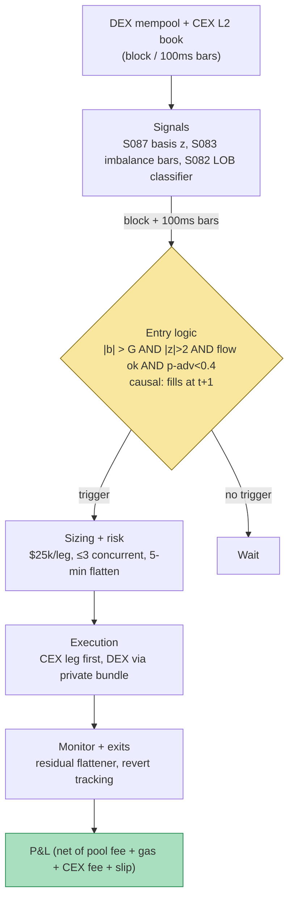

## Stage 157/200 — T057: DEX–CEX Price Gap Arbitrage

*Batch TB6 · Strategy 57/100 · Signals S087, S083, S082 · Provenance [D/SR]*

### T1. One-line verdict

| | |
|---|---|
| **Style** | Crypto cross-venue latency arbitrage (near-market-neutral) |
| **Edge source** | AMM (automated market maker) pools reprice discretely per block while CEX order books reprice continuously — the stale leg is pickable when the gap exceeds all-in costs |
| **Typical holding period** | Minutes (one block to a few blocks; `example`) |
| **Capacity hint** | $10–50M/day across majors for a fast operator; decays with competition and block times |
| **Build-or-buy in one line** | Build the quoting/monitoring stack; buy low-latency node + private-mempool access — the edge is infrastructure, not math |

A **DEX** (decentralized exchange, e.g. Uniswap) lets anyone trade against a smart-contract liquidity pool — an **AMM** — whose price moves only when a trade executes on-chain. A **CEX** (centralized exchange, e.g. Binance) runs a continuous limit-order book. When fast money moves the CEX price, the DEX pool is briefly stale: buy the cheap venue, sell the rich one, pocket the gap. **MEV** (maximal extractable value — profit from ordering blockchain transactions, documented in Flash Boys 2.0) is the shadow over this trade: your DEX leg is visible in the public mempool, so faster bots can **sandwich** you (trade ahead of and behind your transaction) or take the gap first. Provenance [D/SR]: the arbitrage and its MEV context are documented in the cited papers; the specific signal stack (fracdiff basis + imbalance bars + LOB-ML timing) is a standard reconstruction.

### T2. Full mechanics

**Universe & session.** ETH/USDC and WBTC/USDC (`example` universe) on Uniswap v3 0.05% pools vs Binance + Coinbase spot. 24/7; derisk during L1 congestion spikes (gas > 150 gwei `example` — costs eat the gap).

**Entry rule.** Define the basis b_t = (P_DEX,t − P_CEX,t) / P_CEX,t in basis points (1 bp = 0.01%). All thresholds `example`:

1. **Gap gate:** |b_t| > G = 35 bp (`example`), where G = pool fee (5 bp) + gas amortized (~3 bp on $25k, `example` $8) + CEX taker (7.5 bp) + slippage buffer (10 bp) + profit margin (10 bp). The gate is recomputed from live gas — it breathes.
2. **Basis stationarity (S087):** the fracdiff'd basis series (d ≈ 0.2, `example`) must have |z| > 2.0 vs its trailing-24 h distribution — the gap is a genuine dislocation, not the pool's normal wobble around a stale oracle.
3. **Flow read (S083):** DEX swaps sampled into **dollar-imbalance bars** (MASTER.md S083: close a bar when |Σ signed $| ≥ threshold, `example` $500k) — if the imbalance bar shows informed one-way DEX flow *against* your intended leg, skip: someone bigger is working the same gap.
4. **CEX-leg timing (S082):** a lightweight classifier on the CEX LOB snapshot (top-5 levels, DeepLOB-style features per MASTER.md S082 — microprice, queue imbalance, spread) predicts the 500 ms-ahead mid move; fire only if it predicts the CEX leg will not run away from your fill (`example`: P(up-move against you) < 0.4). This is the [SR] adaptation: S082 was documented on equity LOBs; the features port directly to crypto CEX books.

Causal timing: signals on block n / closed 100 ms bars; earliest fills block n+1 (t → t+1). On Ethereum's ~12 s blocks, "t+1" is 12 seconds — an eternity in arb terms, which is why L2s (2 s blocks) now host most of this flow.

**Exit rule.** This is a round trip, not a position: both legs execute simultaneously (CEX leg first by ~100 ms, `example`, because it is instant; DEX leg via private mempool — see below). Unwind is immediate: the "exit" is the second leg of the same trade. Residual inventory (partial DEX fill) is flattened on the CEX within 60 s (`example`); inventory older than 5 min is a failed arb, flattened at market and logged.

**Position sizing.** Fixed notional per round trip: $25k per leg (`example`), scaled by min(1, G_realized/G) — smaller when the gap barely clears costs. Max concurrent: 3 round trips (`example`); daily loss stop 1.5% of the arb sleeve.

**Risk limits.** Kill switch: private-mempool route down → halt (public mempool = sandwich bait); CEX websocket lag > 500 ms (`example`) → halt; gas spike above the gate → halt. Max inventory age 5 min, then market-flatten.

**Cost model (applied explicitly in T4).** Per $25k round trip (`example`): Uniswap v3 pool fee 5 bp = $12.50; L1 gas $8.00 (~3.2 bp); CEX taker 7.5 bp = $18.75; slippage 5 bp = $12.50 (10 bp = $25.00 when the gap fades mid-fill). Total: $51.75 (20.7 bp) clean, $64.25 when faded. LVR note: Milionis et al. (2022) show AMM LP returns = fees − **loss-versus-rebalancing** (LVR — the arbitrageur's profit is the LP's loss); your expected gross must exceed the pool's adverse-selection cost, which is why the margin term lives inside G.

**Order/execution sketch + MEV awareness.** The DEX leg NEVER touches the public mempool: route via a private-mempool relay (e.g. Flashbots Protect — `example` vendor, verify current availability) or submit as a bundle with the CEX-hedge intent. Sequence: (1) confirm gap on closed data; (2) fire CEX leg (IOC limit); (3) on CEX fill acknowledgment, submit DEX bundle; (4) verify both fills; flatten residuals. Latency honesty: this is `simulated only — requires co-located node + private relay` for production; a retail RPC will lose the gap to searchers (specialized MEV bots) essentially always — T7 is blunt about this.

### T3. Signals it consumes

| Signal | Role | Weight / logic |
|---|---|---|
| S087 — Fractional differentiation | Basis feature: stationary, memory-retaining gap series | d ≈ 0.2 (`example`); enter only if \|z(b̃)\| > 2.0 |
| S083 — Imbalance/tick/volume/dollar bars | DEX flow read: dollar-imbalance bars on swaps | Skip if bar imbalance opposes the leg (informed flow) |
| S082 — Deep learning on the LOB | CEX-leg timing: LOB-snapshot classifier, 500 ms horizon | Fire only if P(adverse mid move) < 0.4 (`example`) |

Combination pseudocode (≤25 lines):

```
each closed block / 100ms bar:
    b = (P_DEX - P_CEX) / P_CEX * 1e4          # basis, bp
    G = 5 + gas_bp(25000) + 7.5 + 10 + 10      # pool+gas+cex+slip+margin
    if abs(b) < G: continue
    zb = zscore(fracdiff(b_series, 0.2))       # S087
    if abs(zb) < 2.0: continue
    ibar = dollar_imbalance_bar(dex_swaps)     # S083
    if sign(ibar) opposes leg: continue        # informed flow: skip
    p_adv = lob_classifier(cex_book_top5)     # S082
    if p_adv >= 0.4: continue
    side = 'sell DEX/buy CEX' if b > 0 else 'buy DEX/sell CEX'
    fire_cex_leg(side, $25k IOC); on ack: submit dex_bundle(side)
    flatten residuals after 60s; hard flatten at 5 min
```

### T4. Worked example — numbers + P&L (SYNTHETIC)

All numbers **synthetic**, seed **157** (`np.random.default_rng(157)`); chart in T9 plots exactly these. Setup: ETH, 120 five-minute bars, $25k per leg. Cost stack per round trip (`example`): pool $12.50 + gas $8.00 + CEX $18.75 + slippage $12.50 = **$51.75** (20.7 bp).

| # | Bar | Quoted gap | Direction | Realized | Gross | Costs | Net |
|---|---|---|---|---|---|---|---|
| 1 | 20 | +55 bp | sell DEX / buy CEX | +55 bp | $137.50 | $51.75 | **+$85.75** |
| 2 | 45 | −48 bp | buy DEX / sell CEX | −48 bp | $120.00 | $51.75 | **+$68.25** |
| 3 | 70 | +62 bp | sell DEX / buy CEX | +62 bp | $155.00 | $51.75 | **+$103.25** |
| 4 | 88 | −40 bp | buy DEX / sell CEX | −40 bp | $100.00 | $51.75 | **+$48.25** |
| 5 | 100 | +44 bp | sell DEX / buy CEX | +44 bp | $110.00 | $51.75 | **+$58.25** |
| 6 | 112 | +38 bp | sell DEX / buy CEX | +25 bp | $62.50 | $64.25* | **−$1.75** |

\* Trade 6: the gap faded mid-fill (realized 25 bp vs quoted 38 bp) and slippage doubled to $25.00 — the textbook failed arb. Gross = 0.0025 × $25,000 = $62.50 < costs $64.25.

**Total net: +$362.00 over 6 round trips** (5 wins, 1 scratch-loss). Gross = 274 bp × $25,000 = $685.00; total costs $323.00.

**Where the example is optimistic.** Both legs fill at quoted prices with fixed costs; real DEX legs suffer price impact inside the pool (the AMM conservation function moves against size — Xu et al. 2021 document the slippage functions), CEX legs get front-run by faster takers, and gas is modeled as a flat $8 (it spikes exactly when gaps are widest). The DGP spaces gaps politely; real gaps arrive in bursts and vanish in one block. MEV protection is assumed perfect — one public-mempool leak and trade 6's −$1.75 becomes a −$200 sandwich. The +$362.00 is arithmetic illustration of the cost stack, not a backtest.

### T5. Data & infra — what must run

**Pipeline inventory.** (1) Low-latency Ethereum execution client + mempool stream (pending DEX swaps for S083 bars); (2) CEX websockets (Binance, Coinbase: L2 book top-5 + trades, ≤100 ms); (3) private-mempool relay endpoint for the DEX leg; (4) per-block job: recompute basis, fracdiff z (S087), imbalance bars (S083), LOB classifier score (S082); (5) post-trade: fill reconciliation, residual flattener, cost accounting per round trip.

**M5 Max feasibility: feasible as research, heavy as production (Tier M+/H, ~80–150 h ≈ $12,000–22,500 loaded-cost estimate).** Per `notes/cost-model.md` §2: Python handles the monitoring loop (a few k events/sec), but the *production* path needs a co-located node and sub-100 ms relay — not a laptop on home internet. The Mac is the research box: replay historical gaps, calibrate G, validate the classifier with purged CV. RAM trivial (bars). Bottleneck: network latency and relay access, not compute. Breaks at: multi-pool, multi-chain scanning (then Rust + per-chain indexers).

**Feed-outage safe mode.** CEX feed lag > 500 ms or node desync → halt new round trips immediately (stale basis = fake gaps). Mid-round-trip venue failure: the completed leg is flattened on the surviving venue within 60 s; pre-signed DEX cancel/revert where possible. Private-relay down → full halt (fail closed — public mempool is a donation to searchers).

### T6. Buy vs build

| Option | What you get | Indicative price | What buying gains | What buying loses |
|---|---|---|---|---|
| Tier 0: public RPC, CEX websockets, DEX subgraphs | Everything needed for research | ~$0 | Free gap history | Latency unusable for production |
| Tier 1: quicknode/Alchemy dedicated RPC + private relay | Low-latency node, mempool stream, private submission | ~$50–500/mo, *indicative — verify before budgeting* | Production-viable plumbing | Still not co-located |
| Tier 2: Kaiko / Amberdata (historical) | Multi-venue tick history for calibrating G | $$$ enterprise, *indicative — verify before budgeting* | Research-grade gap distributions | Doesn't fix live latency |
| Build (Python → Rust for hot path) | Basis monitor, S082 classifier, bundle submitter, reconciler | Tier M+/H ~80–150 h ≈ $12k–22.5k loaded | Your own gate math | You race professionals |

**Verdict: build the research stack on Tier 0; rent Tier-1 plumbing before trading $1 real.** The strategy's P&L is a latency bill: without a fast node + private relay you are the liquidity that searchers harvest. Crossover: if backtested net-per-round-trip (after the full cost stack, purged) is < $20 on $25k notional, do not rent anything — the edge doesn't cover the plumbing.

### T7. Success-ratio evidence

| Source | What is documented | Relevance | Before/after cost |
|---|---|---|---|
| Daian et al. (2019), Flash Boys 2.0, arXiv:1904.05234 | DEX arbitrage bots widespread; priority gas auctions; MEV as a measurable phenomenon | The gap exists and is contested — you race bots | Empirical (before cost) |
| Milionis et al. (2022), "Automated Market Making and Loss-Versus-Rebalancing", arXiv:2208.06046 | LP returns = fees − LVR; on Uniswap v2 ETH-USDC, >99.99% of LP return variance is market beta | Your gross is someone's LVR; size the margin term accordingly | Empirical (before cost) |
| Xu et al. (2021/2023), "SoK: DEX with AMM Protocols", arXiv:2103.12732 | AMM conservation functions, slippage and divergence-loss formalization | The DEX leg's price-impact math | Theory (n/a) |
| Practitioner MEV dashboards (Flashbots, EigenPhi) | Searcher PnL series | Gaps are harvested at scale by specialists | `reported_*` — censored, lower-bound |

**Capacity.** A fast operator might clear $10–50M/day notional across majors at 5–20 bp net — but that capacity belongs to searchers with private order flow, not to a laptop strategy. For a retail-speed implementation, realistic capacity is near zero: the gaps you can see are the gaps already taken.

**Decay.** Severe and ongoing: shorter block times, private mempools, intent-based solvers, and co-located searchers compress the retail-visible gap toward the cost floor. The 2021-era 50 bp+ gaps are now mostly a historical series.

**Honest bottom line.** For a ≤$1M paper operation: build it as an *education in market microstructure*, paper-trade it, and expect the simulator (with honest latency) to show the edge is negative at retail speed — that negative result is the valuable output; it stops you donating to searchers. For an institutional desk: this is a real business *only* with co-location, private flow, and full-time infra — i.e., you become a searcher, and the "strategy" is your entire stack.

### T8. Failure modes

1. **Sandwich / frontrunning (the existential one).** A public-mempool DEX leg is extractable by design (Flash Boys 2.0). *Mitigation:* private relay only, enforced in code — the submit path physically cannot fall back to public mempool.
2. **Stale-basis fake gaps.** One venue's feed lags; the "gap" is your own latency. *Mitigation:* feed-age checks on every input; halt if any leg's data is > 500 ms old (`example`).
3. **Gas spikes with the gap.** Congestion widens gaps *and* costs simultaneously; G must breathe. *Mitigation:* G recomputed per block from live gas; hard halt above 150 gwei (`example`).
4. **Partial fills / inventory.** DEX bundle lands, CEX leg partially fills — now you hold directional ETH. *Mitigation:* 60 s residual flattener; 5 min hard flatten; inventory aged out is logged as a failed arb, never a "position".
5. **LVR underestimation.** The pool's adverse-selection cost (Milionis et al.) means small gaps are negative-expectation even when they clear accounting costs. *Mitigation:* the 10 bp margin term inside G; re-estimate quarterly from realized slippage.
6. **Smart-contract / chain risk.** Re-orgs, pool exploits, USDC depeg (see T054) mid-round-trip. *Mitigation:* universe limited to audited blue-chip pools; chain-reorg monitor pauses new trips; stablecoin leg diversified (USDC + USDT venues).
7. **Classifier (S082) decay.** CEX microstructure changes; the 500 ms predictor goes stale. *Mitigation:* purged walk-forward revalidation weekly; if precision < threshold, the S082 gate fails open to "skip" (veto all) — never fails closed to "fire".
8. **Crowding at the gate.** Ten bots see the same 40 bp gap; the winner takes it, the rest pay gas for reverted bundles. *Mitigation:* track revert rate; if reverts > 20% (`example`), widen G or stand down — the gap is contested.

### T9. Visuals


*Caption: synthetic data — not market data. Watermark reads "SYNTHETIC EXAMPLE" exactly. Seed 157 (`np.random.default_rng(157)`); plotted gaps and nets are the T4 table (+55/−48/+62/−40/+44/+38 bp quoted; nets +$85.75/+$68.25/+$103.25/+$48.25/+$58.25/−$1.75; total +$362.00).*



### T10. Sources

- Philip Daian et al. — "Flash Boys 2.0: Frontrunning, Transaction Reordering, and Consensus Instability in Decentralized Exchanges" (2019; arXiv:1904.05234). https://arxiv.org/abs/1904.05234
- Jason Milionis, Ciamac Moallemi, Tim Roughgarden, Anthony Lee Zhang — "Automated Market Making and Loss-Versus-Rebalancing" (2022; arXiv:2208.06046): LP returns = fees − LVR. https://arxiv.org/abs/2208.06046
- Jiahua Xu et al. — "SoK: Decentralized Exchanges (DEX) with Automated Market Maker (AMM) Protocols" (ACM Computing Surveys 2023; arXiv:2103.12732): AMM conservation functions, slippage/divergence-loss formalization. https://arxiv.org/abs/2103.12732
- Method references: MASTER.md S087 (fractional differentiation), S083 (imbalance/dollar bars), S082 (DeepLOB + classical ML features).

**Unverified leads.** Grok's TB6 answers supplied background on purged-CV/embargo and GBM-vs-DeepLOB practice used in T5/T8; no Grok profitability claim is used as evidence. Practitioner claims of retail DEX–CEX arb profitability (bot advertisements, PnL screenshots) are unverified leads — assume survivorship bias plus hidden latency advantages until reproduced with honest fills.

*Source log: Grok answered Q-TB6-1..3 (2026-09-10); all claims independently verified or labeled unverified.*
