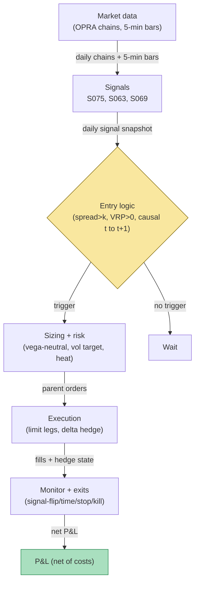

## Stage 158/200 — T058: Dispersion Trader

*Batch TB6 · Strategy 58/100 · Signals S075, S063, S069 · Provenance [D]*

### T1. One-line verdict

| | |
|---|---|
| **Style** | Options relative-value (volatility) stat-arb: long single-stock volatility, short index volatility |
| **Edge source** | Correlation risk premium (correlation risk premium = implied correlation priced into index options minus subsequently realized constituent correlation; index options embed a rich correlation assumption that usually fails to materialize) harvested by delta-hedged long-component / short-index option positions, entered only when the premium is wide and the index variance risk premium is positive |
| **Typical holding period** | Days to weeks per trade (example: up to 30 trading days or signal-flip, whichever first) |
| **Capacity hint** | Moderate — capped by single-name options liquidity and the cost of crossing wide constituent option spreads |
| **Build-or-buy in one line** | Build the signal and sizing logic yourself on bought options data; you cannot buy the trade. |

Provenance **[D]** (documented: S075, S063, S069 are all [D]; dispersion literature below).

### T2. Full mechanics

**Universe & session.** The liquid options segment of a major equity index — example: the 50–100 S&P 500 names with the highest options dollar-volume, plus SPX (or SPY) index options as the short leg. Trades are positioned at or after the daily close and delta-hedged (continuously offsetting directional exposure by trading the underlying stock so the book stays direction-neutral) intraday during RTH (regular trading hours, 9:30–16:00 ET). Exclusions: single names with an earnings announcement within the option tenor (event volatility contaminates the correlation read), option expiries under 7 days (*example*; gamma churn — rapid, costly hedging as expiry approaches), index-rebalance days, and any name with a borrow fee above an example 2% annualized (hard-to-borrow names break the delta hedge).

**Entry rule.** Computed at day *t*'s close on data ≤ *t*; the earliest trade is *t+1*'s open (causal t→t+1):

1. **S075 (primary trigger):** implied correlation minus trailing realized correlation exceeds an entry threshold — `signal_t = ρ_impl,t − ρ_real,t(30d) > κ`, with `κ = 0.10` *example*.
2. **S069 (regime gate):** index variance risk premium positive — index implied variance exceeds the HAR-forecast realized variance, `VRP_t^σ = IV_t^ann − E_t[RV^ann] > 0` (*example* gate: at least +1 vol point). This confirms the short index-vol leg is actually being paid for.
3. **S063 (measurement):** realized correlation and realized variances are measured with range-based estimators (Parkinson/Garman–Klass on 5-minute bars), which are 5–8× more efficient per observation than close-to-close — so a 30-day realized-corr window is actually informative.

Enter the long-dispersion direction (long single-stock straddles — a straddle is a call plus a put at the same strike, profiting from large moves either way — short index straddle). If `signal_t < −κ` (*example*), the book stands down; it never runs short dispersion without a separate mandate, because the reverse trade is short idiosyncratic gamma (unbounded loss if one name gaps on news).

**Exit rule.** First of: (a) signal-flip — `ρ_impl − ρ_real < 0.05` (*example*); (b) time stop — 30 trading days (*example*); (c) stop-loss — cumulative net P&L worse than an *example* −3× the book's target daily vol; (d) **correlation-break kill switch** — 5-day realized correlation (*example* window) exceeds implied correlation (the 2008 shape: correlations spike toward 1.0 and the short index leg detonates).

**Position sizing.** Vega-neutral construction: vega (the option's sensitivity to a 1-point change in implied volatility) of the long single-name straddles ≈ vega of the short index straddle, so the book is a pure correlation bet rather than a directional vol bet. Then vol-targeting: scale total premium so the sleeve's target daily vol is σ⋆ (*example* 8% annualized). Per-name cap: no single name contributes more than *example* 10% of book vega. Portfolio heat: total premium paid ≤ *example* 5% of NAV.

**Risk limits.** Daily loss stop at *example* −2% of sleeve NAV; max gross premium *example* 1.5× NAV equivalent in vega terms; kill-switch conditions: OPRA (Options Price Reporting Authority — the consolidated US options quote feed) feed stale > 5 minutes (*example*), or realized correlation 5-day average (*example*) above implied correlation.

**Cost model.** Crossed spreads at entry and exit (single-name ATM straddles: *example* 3–8% of premium; index: *example* 0.5–2%), commissions *example* $0.65/contract/side, delta-hedge slippage *example* $60–180/day at this book size, and exchange/regulatory option fees. Borrow cost on the delta hedge is excluded names only. The worked example applies all of these explicitly.

**Order/execution sketch.** Leg in via limit orders worked at mid ± a tick rather than market orders (options spreads are the dominant cost); typical institutional path is an RFQ (request-for-quote) to market makers for the package. Delta-hedge with the underlying stock, participation ≤ *example* 10% of visible depth per child order. Queue-position honesty note: without listed single-stock options liquidity at the printed size, the mid-based paper P&L is fantasy — a Mac on SIP (Securities Information Processor — the consolidated US equity tape) data cannot honestly simulate options fills; label any SIP-only backtest `simulated only`.

### T3. Signals it consumes

| Signal | Role | Weight / logic |
|---|---|---|
| S075 Dispersion / implied-correlation spread | **Primary trigger** | Enter long dispersion iff `ρ_impl,t − ρ_real,t(30d) > κ` (κ = 0.10 *example*) |
| S069 Variance risk premium | **Regime gate** | Trade only if index `VRP_t^σ > 0` (*example*: ≥ +1 vol point); vetoes entries when implied is cheap vs forecast |
| S063 Range-based realized vol | **Sizing / monitoring** | Parkinson/Garman–Klass 5-min RV feeds realized-correlation measurement and the vol-targeting scaler |

```text
# T058 combination logic (example thresholds; causal: signal at t -> fill at t+1)
each day t at close, on data <= t:
    rho_impl  = implied_corr(SPX_IV, constituent_IVs)        # S075
    rho_real  = realized_corr(30d, range_based_RV)          # S075 + S063
    vrp       = index_IV - HAR_forecast_RV                  # S069
    spread    = rho_impl - rho_real
    if spread > 0.10 and vrp > 0 and no_exclusion(names):   # ENTRY
        size legs vega-neutral; scale to vol target
        enter long single-name straddles / short index straddle at t+1 open
    elif in_position and (spread < 0.05 or days_held >= 30
                          or cum_pnl < -3*target_daily_vol):  # EXITS
        unwind all legs at t+1 open
    if realized_corr(5d) > rho_impl:                          # KILL SWITCH
        flatten immediately at next liquid quote
```

### T4. Worked example — numbers + P&L (SYNTHETIC)

All numbers below are synthetic (random seed 158, stated for reproducibility); they are an arithmetic illustration, not a backtest. Scenario: at a synthetic day-*t* close, the desk measures implied correlation `ρ_impl = 0.47` against a 30-day realized correlation `ρ_real = 0.31` (range-based, S063), so `spread = 0.16 > κ = 0.10` (*example*). Index VRP check (S069): index IV 16.5% annualized vs HAR forecast 13.0% → `+3.5 vol points > 0` → gate passes. Entry at *t+1* open:

- **Long:** 500 single-name straddle contracts (100 per name × 5 names), mid $5.00, bought at ask $5.15 → pay $257,500.
- **Short:** 100 index straddles, mid $22.00, sold at bid $21.70 → receive $217,000.
- **Entry costs:** spread cross = 500×$0.15 + 100×$0.30 = **$105**; commissions 600×$0.65 = **$390**; total **$495**.
- Delta-hedged daily; hedge slippage $60–180/day (synthetic).
- **Exit day 20:** spread narrowed to 0.03 < 0.05 (*example* exit) → signal-flip unwind; exit costs **$495** (symmetric).

Day-by-day synthetic gross P&L (long single-name gamma capture minus short index theta, delta-hedged):

| Day | Gross ($) | Hedge slip ($) | Net ($) | Cum. net ($) |
|---|---|---|---|---|
| 0 (entry) | — | — | −495 | −495 |
| 1 | 12,715 | 71 | 12,644 | 12,149 |
| 2 | 3,325 | 73 | 3,252 | 15,401 |
| 3 | −5,702 | 68 | −5,770 | 9,631 |
| 4 | −2,843 | 110 | −2,953 | 6,678 |
| 5 | 6,255 | 120 | 6,135 | 12,813 |
| 6 | −14,663 | 84 | −14,747 | −1,934 |
| 7 | 7,831 | 158 | 7,673 | 5,739 |
| 8 | −2,589 | 73 | −2,662 | 3,077 |
| 9 | 2,388 | 137 | 2,251 | 5,328 |
| 10 | −6,177 | 126 | −6,303 | −975 |
| 11 | 1,950 | 166 | 1,784 | 809 |
| 12 | −8,668 | 149 | −8,817 | −8,008 |
| 13 | 2,294 | 179 | 2,115 | −5,893 |
| 14 | −3,567 | 175 | −3,742 | −9,635 |
| 15 | 1,190 | 139 | 1,051 | −8,584 |
| 16 | 8,105 | 144 | 7,961 | −623 |
| 17 | −7,287 | 88 | −7,375 | −7,998 |
| 18 | 7,870 | 116 | 7,754 | −244 |
| 19 | −277 | 129 | −406 | −650 |
| 20 (exit) | −1,081 | 133 | −1,214 − 495 exit | −2,359 |

Walk: gross total = **+$1,069**; hedge slippage total = **−$2,438**; entry −$495 and exit −$495 → **trade net = −$2,359**. The largest day (day 6, −$14,747) is a correlation-spike day: realized correlation jumped toward the implied level, the short index straddle lost more than the long single-name gamma gained — the trade's core risk, arriving exactly as the literature warns.

**Where the example is optimistic.** Fills are assumed at ask/bid for 600 contracts with no partial fills and no market impact; in real single-name options, working 100 straddles per name moves the quote. Delta hedging is assumed frictionless apart from the slippage line — real hedging has discrete rebalancing error. The implied-correlation input is assumed clean; real constituent IVs are polluted by earnings jumps and wide quotes. And the exit assumes a liquid two-sided unwind on the signal-flip day — during a correlation break, that is precisely when liquidity vanishes.

### T5. Data & infra — what must run

**Daily/intraday pipeline inventory.** (1) Pre-open: full-chain option snapshots for the 50–100 candidate names + index (OPRA or Cboe delayed; implied vols and greeks computed or bought); implied-correlation computation (S075 formula). (2) Intraday loop (example every 15 min): delta-hedge monitor, realized-correlation tracker on 5-minute bars (S063), kill-switch check. (3) Post-close: signal recompute, HAR vol forecast refresh (S069 inputs), P&L attribution (gamma vs theta vs vega). Storage: per cost-model §4, options chain snapshots run ~100–300 MB/day for a handful of underlyings — a 50-name panel is tens of GB/month; keep rolling 60-day windows hot, archive the rest.

**M5 Max feasibility.** Feasible — this is a daily-signal, intraday-hedge strategy, not a tick engine. Greeks for 50 chains in numpy/polars run in seconds; the pipeline is I/O-bound on the options feed. Verdict pattern (per cost-model §7): *feasible on the M5 Max (Tier M+, ~60–100 h ≈ $9k–15k loaded-cost estimate + ~$200/mo data at the research tier); bottleneck is options-data licensing and quote quality, not compute; breaks if you try full OPRA for all names locally.* Engineering band: M+ (strategy harness around M-tier signals), 40–100 h per cost-model §5.

**Feed-outage safe mode.** If the options feed drops mid-session: halt new entries immediately; keep the delta-hedge loop running on the last good quotes for a grace window (*example* 5 minutes); if quotes stay stale, flatten the book at the next liquid print rather than flying blind — an unhedged short-gamma book during an outage is the catastrophic state.

### T6. Buy vs build

| Option | What you get | Indicative price | What buying gains | What buying loses |
|---|---|---|---|---|
| Tier 0: Cboe delayed quotes + exchange delayed chains | 15-min delayed option quotes, KCJ/ICJ implied-correlation index | ~$0 | Free implied-correlation regime gauge | No tradable real-time greeks; redistribution limits |
| Tier 1: Polygon / Tiingo options (indicative) | Real-time-ish chains, greeks | ~$30–200/mo, *indicative — verify before budgeting* | Cheap research chains | Thin single-name history; not full OPRA |
| Tier 2: Databento OPRA research | Honest full-chain options history + L1 equity | ~$200/mo + usage, *indicative — verify before budgeting* | Research-grade backtest data | Production OPRA is a separate institutional contract |
| QuantConnect / retail backtest platform | Options data + backtest harness | subscription-based, *indicative — verify before budgeting* | Fastest path to a paper backtest | You still design the signal; platform assumptions may flatter fills |

**Verdict: build the signal and sizing, buy the data.** There is no vendor selling "dispersion as a service" worth licensing; the edge lives in your correlation measurement and execution. Crossover: buy full production OPRA only if you run the book live with real size; for research, Tier 1–2 delayed/full-history data plus a bought IV surface is the sane spend.

### T7. Success-ratio evidence

| Study / source | Market & period | Metric | Before/after cost | Caveat |
|---|---|---|---|---|
| Driessen, Maenhout & Vilkov (2009) | S&P 500 options, 1996–2003 | Correlation risk premium ≈ 18%; avg implied corr 47% vs realized 29% | Before cost (risk premium estimate) | The premium compensates correlation-break risk; it is not free |
| Bakshi & Kapadia (2003) | S&P 500 index options | Negative market volatility risk premium: index options priced above subsequently realized volatility | Before cost | Foundational for the index-leg richness the trade harvests |
| Deng (2008) | Volatility dispersion trades | Profitability changed after late-1999/2000 structural options-market changes | Before cost | Supports inefficiency (crowding) over a stable risk premium — the edge decays as desks pile in |
| Ferrari, Poy & Abate (2019) | S&P 100 options | Dispersion backtest risk-adjusted return beat buy-and-hold, low market correlation | Before cost (options spread costs not fully charged) | Single-market study; transaction costs understated |
| Bollerslev, Tauchen & Zhou (2009) | US equities | Variance risk premium predicts returns | Before cost | Long-horizon evidence; intraday VRP is noise (per S069) |

**Honest bottom line.** For a ≤$1M paper operation: dispersion is a real, documented premium (correlation risk is priced), but it is capital-intensive, short-gamma on the index leg, and the documented edge lives at 1–3 month tenors — not an intraday strategy. A small paper book can research it honestly on Tier 1–2 data, but live trading needs institutional options execution and the correlation-break tail (2008, 2020) must be sized, not hoped away. Institutional desks harvest it with variance swaps (cleaner math, OTC) and balance-sheet to warehouse the tail; a retail account gets the worst version of the trade: wide constituent spreads and no variance-swap access.

### T8. Failure modes

1. **Correlation break (the 2008/2020 shape).** Realized correlation spikes toward 1.0; the short index leg's losses dwarf single-name gamma gains. *Mitigation:* the kill switch (flatten when 5-day realized corr > implied corr) plus hard per-trade stop-loss.
2. **Single-name jump on the long leg.** An earnings leak or takeover in one long name creates a windfall — the reverse (a gap in a name you are short vol on) does not apply here, but a halted name freezes your hedge. *Mitigation:* earnings-day exclusions; position caps per name.
3. **Vol-of-vol / vega mismatch.** If legs are not truly vega-neutral, the book is a directional vol bet wearing a dispersion costume. *Mitigation:* recompute vega neutrality daily; attribute P&L into correlation vs vega buckets.
4. **Liquidity mirage in single-name options.** Wide or one-sided quotes make the implied-correlation input garbage and the exit theoretical. *Mitigation:* liquidity filters (minimum options dollar-volume); mark the book at bid/ask, never mid, for risk.
5. **Dividend / corporate-action contamination.** Special dividends and splits distort constituent IVs and the hedge. *Mitigation:* corporate-action-adjusted data pipeline; manual review queue for actions.
6. **Overfit κ and windows.** The entry threshold and realized-corr window mined on 2003–2007 data will not survive the next correlation regime. *Mitigation:* purged/embargoed validation (S088 discipline); trade the premium, not the backtest's favorite parameter.
7. **Operational: stale kill-switch.** A dead monitoring loop during a correlation spike turns a managed loss into a blowup. *Mitigation:* heartbeat on the risk daemon; flatten-on-silence default.

### T9. Visuals


*Caption: synthetic 20-trading-day dispersion trade (seed 158) — long 500 single-name straddles vs short 100 index straddles; entry day 0 on spread 0.16 > 0.10 with VRP gate pass; exit day 20 on signal-flip (spread 0.03 < 0.05). Cumulative net P&L ends at −$2,359 after $990 of entry/exit costs and $2,438 of hedge slippage. Watermark reads "SYNTHETIC EXAMPLE"; corner caption: "synthetic data — not market data".*



### T10. Sources

1. Driessen, J., Maenhout, P. J. & Vilkov, G. (2009). "The Price of Correlation Risk: Evidence from Equity Options." *Journal of Finance* 64(3), 1377–1406. — correlation risk premium ≈ 18%; avg implied correlation 47% vs realized 29% (figures as documented in the FX correlation-risk literature citing this paper: https://files.fisher.osu.edu/department-finance/public/international_correlation_risk.pdf).
2. Bakshi, G. & Kapadia, N. (2003). "Delta-Hedged Gains and the Negative Market Volatility Risk Premium." *Journal of Derivatives*, Fall 2003. http://people.umass.edu/nkapadia/docs/Bakshi_Kapadia_JoD_Fall_2003.pdf
3. Deng, Q. (2008). "Volatility Dispersion Trading." SSRN. https://papers.ssrn.com/sol3/papers.cfm?abstract_id=1156620
4. Ferrari, P., Poy, G. & Abate, G. (2019). "Dispersion trading: an empirical analysis on the S&P 100 options." *Investment Management and Financial Innovations*, 16(1), 178–188. http://dx.doi.org/10.21511/imfi.16(1).2019.14
5. Bollerslev, T., Tauchen, G. & Zhou, H. (2009). "Expected Stock Returns and Variance Risk Premia." *Review of Financial Studies* 22:4463–4492. (FEDS working version via https://www.federalreserve.gov/pubs/ifdp/2011/1035/ifdp1035.htm)

**Unverified leads** (chatbot-provided or second-hand; not confirmed facts — verify before use):
- Quantpedia-style summary citing a "15.39% return 1996–2007 backtest" for dispersion — historical, model-dependent summary; not an expected return.
- Cboe Implied Correlation Index (tickers KCJ/ICJ) as a ready-made regime gauge — named in S075; index methodology page not independently opened this batch.

*Source log: Grok answered Q-TB6-1..3 (2026-09-10); all claims independently verified or labeled unverified.*
