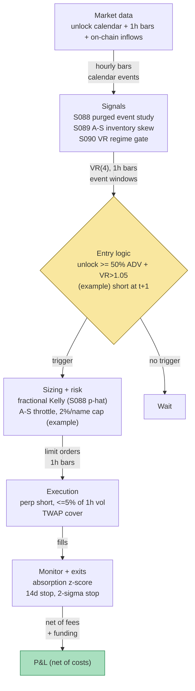

## Stage 158/200 — T058: Token Unlock Supply-Shock Fade

*Batch TB6 · Strategy 58/100 · Signals S088, S089, S090 · Provenance [D/SR]*

### T1. One-line verdict

| | |
|---|---|
| **Style** | Crypto event-driven short bias — a scheduled-supply-shock fade on vesting-cliff token unlocks |
| **Edge source** | Predictable, calendar-known supply hitting a finite book: unlock tranches are announced months ahead, so the sell-pressure window is forecastable; the fade harvests the absorption path (front-run dump → relief bounce → delayed holder selling), validated with purged/embargoed event studies |
| **Typical holding period** | 1–14 days per unlock (hours for the front-run leg, up to 2 weeks for the delayed-sell leg) |
| **Capacity hint** | Event-driven and lumpy: bounded by the tranche's dollar value and borrow availability; a ≤$1M book is the natural habitat — institutional size cannot short most unlock names |
| **Build-or-buy in one line** | Build the event calendar and the absorption monitor (public vesting data + on-chain flows); buy nothing except borrow access and a perp venue — there is no off-the-shelf "unlock fade" product |

Provenance **[D/SR]**: the unlock-dump phenomenon is documented (The Tie 2023 event study, Tokenomist causal study — cited in T7); the absorption-rate timing rule, the A-S-style position management, and the regime gate are the chapter's practitioner reconstruction (SR). All thresholds below are `example — not an institutional standard`.

### T2. Full mechanics

**Jargon first.** A **token unlock** is a scheduled release of previously locked (non-transferable) tokens — allocations to investors, teams, or treasuries that become transferable on a known date. A **vesting cliff** is a schedule where a large tranche unlocks all at once on one date (vs **linear vesting**, which drips tokens daily). **ADV** is average daily trading volume (dollar volume). **Absorption** is the market's ability to take the new supply without the price falling further — measured here by exchange inflows normalizing and the discount-to-pre-unlock price stabilizing. A **perp** (perpetual futures contract) is a crypto derivative with no expiry that tracks spot via a periodic **funding rate** payment between longs and shorts. **Front-running** here means selling *before* the unlock, anticipating the dump — the documented pattern is that prices decline *in the lead-up* to the event. **Borrow** is the ability to short: you must locate lendable tokens or use perps.

**Universe & session.** Top-200 crypto tokens by market capitalization with (a) a published vesting schedule (Tokenomist/vesting-trackers/whitepapers), (b) a perp listing on a major venue (for short access), and (c) 30-day ADV ≥ $5M (*example*). Crypto trades 24/7; entries are keyed to the unlock timestamp (usually a UTC block time), not a session. Exclusions: unlocks < 10% of 30-day ADV (*example* — too small to move price), tokens with no borrow/perp (can't express the short), and unlocks coinciding with the project's own mainnet/token-generation event (a different trade).

**Entry rule.** Two legs, sequenced by the documented causal chain:

1. **Front-run leg (primary).** At *t = unlock − 72h* (*example*), if the unlock value ≥ 50% of 30-day ADV (*example*) AND the S090 gate reads persistent (VR(4) > 1.05 on 1-hour bars, *example*), open a perp short at the next 1h close. Causal timing: signal on bars ≤ *t* → earliest fill *t+1*. The 72-hour lead is the S088 study's output, not a guess.
2. **Absorption leg (secondary).** If the dump under-shoots or the front-run stops out: after the unlock, if price bounces ≥ 1.5 vol units (*example*) within 48h while 24h exchange inflows stay elevated (inflow z > 1.0, *example* — holders still distributing), short the bounce for the delayed-sell leg (The Tie: prices fall below initial levels *within two weeks* when unlocks exceed 100% of ADV).

**Exit rule.** Cover at the first of: (a) absorption — inflow z < 0.5 (*example*) for two consecutive days; (b) time stop — 14 days post-unlock (*example*; 7 days for the absorption leg, *example*); (c) stop-loss — price rises 2.0 vol units (*example*) above entry.

**Position sizing.** The S088-validated win rate *p̂* and payoff ratio feed a fractional-**Kelly** size (Kelly: the bet-size rule maximizing long-run growth for known win probabilities; fractional = half-Kelly for safety), *f* = 0.5 × (*p̂* − (1−*p̂*)/*b*), where *b* is the win/loss payoff ratio — then the S089 A-S layer manages the live short as "inventory": the reservation price *r(s,q,t) = s − qγσ²(T−t)* (S089, *q* negative for a short) rises above mid as the short grows, throttling further adds — a thermostat against over-shorting into a squeeze. Caps: max 2% of book per unlock (*example*), max 5 concurrent unlocks (*example*), max gross short 30% (*example*).

**Risk limits.** Daily loss stop −3% of book (*example*) → flatten all unlock shorts. Kill switch: perp funding above 0.3%/8h (*example*) against the short (crowded short) → halve positions. Hard rule: never short a tranche exceeding 300% of ADV (*example*) — beyond that, squeezes dominate the absorption edge.

**Cost model.** Perp taker fee 5 bp/side (*example*), funding 0.03%/day paid by shorts (*example*), plus half-spread slippage on entry/exit. Spot-short borrow fees modeled per event. All applied line-by-line in T4.

**Order/execution sketch.** Entries: limits at the 1h-close mid minus 1 tick, participation ≤ 5% of trailing-1h volume (*example*); unfilled after 2h → marketable limit. Exits into absorption: 6-hour TWAP (time-weighted average price) (*example*). Queue-position claims on aggregated crypto feeds are `simulated only — requires MBO/ITCH`-equivalent depth.

**Causality.** The unlock timestamp is calendar-known; regime/inflow inputs use data ≤ *t*; fills at *t+1* earliest. Subtle leak: schedules get *revised* — always use the schedule as published at *t*, never the final revised history (point-in-time discipline).

### T3. Signals it consumes

| Signal | Role | Weight / logic |
|---|---|---|
| S088 — Purged / embargoed CV | **Primary validation engine** | The entry-lead (72h), exit rules, and Kelly inputs are chosen on purged/embargoed event studies over historical unlocks: purge any training unlock whose [entry, exit] window overlaps a test unlock's window; embargo ≥ max holding period. No parameter survives without an honest OOS estimate |
| S089 — Avellaneda–Stoikov inventory skew | **Position-management layer** | Reservation price *r(s,q,t) = s − qγσ²(T−t)* with *q* < 0 (short book): as the short grows, *r* rises above mid, which throttles further adds and accelerates covers — the A-S thermostat repurposed from market making to directional inventory control. Spread term *δ\** sets the limit-order offset |
| S090 — Variance-ratio / Hurst regime toggle | **Regime gate** | VR(4) on 1h bars > 1.05 (*example*) → tape is persistent, front-run leg armed; VR(4) < 0.90 (*example*) → anti-persistent/choppy, stand down (dumps get bought instantly in chop). The gate conditions *whether* the book takes unlock risk, never the direction |

```pseudocode
# T058 combination logic — evaluated hourly; fills at next bar (t -> t+1)
for unlock in calendar.next(14d):                       # known future events
    size_adv = unlock.usd_value / adv30(unlock.token)   # tranche vs liquidity
    if size_adv < 0.50: continue                        # example: too small to matter
    vr = variance_ratio(returns_1h, k=4)                 # S090: persistence read
    if vr < 1.05: continue                              # example gate: chop -> stand down
    p_hat, payoff = purged_event_study(unlock.token)    # S088: honest OOS win rate
    if p_hat < 0.55: continue                           # example: no validated edge
    at(unlock.t - 72h):                                 # example lead from S088 study
        short(qty=kelly_frac(p_hat, payoff, cap=0.02))   # S089 sizes the add
        # live: S089 reservation price throttles adds as |q| grows
    cover_when(absorption_z < 0.5 for 2d               # supply distributed (example)
               or age > 14d or adverse_move > 2*sigma)   # example exits
```

### T4. Worked example — numbers + P&L (SYNTHETIC)

All numbers synthetic — fictitious token "UNLK". Script `batches/TB6/plot_T058.py`, **seed 158**; the chart in T9 plots these exact trades. Cost schedule (*example*): perp taker fee 5 bp/side, funding 0.03%/day on average notional (paid by the short).

**Setup.** UNLK trades at $2.50. A cliff unlock of $42M notional lands at t=0 — 8% of circulating supply and **140% of 30-day ADV** ($30M), i.e. squarely in The Tie's ">100% of ADV" bucket. VR(4) on 1h bars = 1.18 (> 1.05 gate, *example*). S088 event study gives *p̂* = 0.61, payoff 1.4 (*example* outputs of the validation, not facts about real unlocks).

**Trade T1 — front-run short.** Short 20,000 UNLK @ **$2.4000** at t=0 (first 1h close after the calendar trigger). Cover day 6 @ **$1.9120** on the absorption signal (inflow z < 0.5 for two days).

| Line | Calc | $ |
|---|---|---|
| Gross | 20,000 × (2.4000 − 1.9120) | +9,760.00 |
| Fees | 2 × 0.0005 × 20,000 × (2.4000 + 1.9120)/2 → 0.0005 × 20,000 × (2.40 + 1.912) | −43.12 |
| Funding | 6 days × 0.0003 × 20,000 × (2.40 + 1.912)/2 | −77.62 |
| **Net T1** | 9,760.00 − 43.12 − 77.62 | **+9,639.26** |

**Trade T2 — faded bounce, stopped.** Day 9 relief bounce to $2.0240 with inflows still elevated → re-short 8,000 @ **$2.0240**; stop-loss hits day 11 @ **$2.1500** (adverse move > 2 vol units).

| Line | Calc | $ |
|---|---|---|
| Gross | 8,000 × (2.0240 − 2.1500) | −1,008.00 |
| Fees | 0.0005 × 8,000 × (2.0240 + 2.1500) | −16.70 |
| Funding | 2 days × 0.0003 × 8,000 × (2.0240 + 2.1500)/2 | −10.02 |
| **Net T2** | −1,008.00 − 16.70 − 10.02 | **−1,034.71** |

**Total net: +$9,639.26 − $1,034.71 = +$8,604.55** on ~$99.6k gross notional traded. Fees arithmetic: 20,000 × 0.0005 × 4.312 = $43.12 ✓; funding: 6 × 0.0003 × 43,120 = $77.62 ✓.

**Where the example is optimistic.** The fill prices are exact — no partial fills, no slippage beyond the modeled fee, and the unlock executes its dump on schedule. Real unlocks get *revised, delayed, or pre-announced*; recipients often sell OTC (over-the-counter, off-exchange) rather than on the lit market, so the "dump" never appears on your venue's tape. The absorption signal (exchange inflows) assumes you can attribute flows to the unlock cohort — in practice inflow data is noisy and delayed. The S088 win rate (0.61) is an *example* input, not a measured property of unlocks, and the two-trade tape is far too short to support any performance inference — it demonstrates the *mechanics* (calendar → gate → short → absorption cover → stop), not an edge. Unlock schedules are speculative inputs: treat every projection as an *example projection*, never a forecast.

### T5. Data & infra — what must run

**Pipeline inventory.** Daily: refresh the unlock calendar (vesting schedules, cliff dates, tranche sizes), recompute tranche-vs-ADV ratios; weekly S088 purged event-study refresh on the growing unlock history. Hourly: 1h bars, VR(4) gate, exchange-inflow z-scores, perp funding, borrow availability. Event-driven: arm entries at unlock−72h (*example*); switch to absorption monitoring at unlock. Storage is trivial — the calendar is kilobytes and 1h bars for 200 tokens are megabytes (per notes/cost-model.md §4, 1-min bars for 500 symbols are ~50 MB/day; hourly is ~65× smaller).

**M5 Max feasibility: trivially feasible (Tier L).** Per notes/cost-model.md §2/§3: the hourly loop is rolling statistics on ~1.75M bars/year — seconds in polars; the S088 event study is index arithmetic on a few thousand historical unlock events — minutes. RAM: tens of MB against the 77 GB budget (§3). Engineering: Tier L, 4–12 h ≈ **$600–1,800** loaded-cost estimate (§5) for calendar + gate + backtest harness; on-chain inflow attribution adds ~10–20 h. *One-line verdict: feasible on the M5 Max (Tier L, ~15 h ≈ $2.3k eng + ~$30–200/mo data); bottleneck is borrow access and schedule accuracy, not compute.*

**Feed-outage safe mode.** Calendar stale >48h (*example*): no new entries — a stale calendar means shorting into a *delayed* unlock; existing positions follow normal exits. 1h-bar feed drops: the S090 gate freezes and new entries block; existing shorts keep their stop-loss and time stop, evaluated on the venue's own price feed as backup. Inflow feed drops: the absorption exit suspends and the time stop becomes the primary exit. All transitions logged; the book never silently resumes entries.

### T6. Buy vs build

| Option | What you get | Indicative price | Gains | Loses |
|---|---|---|---|---|
| Tier-0 free (CoinGecko free tier, project docs, Etherscan) | Prices, vesting docs, on-chain flows | ~$0, *indicative — verify before budgeting* | Free calendar + inflow data | Manual curation; rate limits; no revision history |
| Vesting tracker (Tokenomist-style) | Curated unlock calendar + alerts | freemium → ~$20–100/mo, *indicative — verify before budgeting* | The calendar done for you | Revision tracking still your job |
| Tier-1 retail (CoinGecko paid / Kaiko) | Clean OHLCV + reference data | ~$30–300/mo, *indicative — verify before budgeting* | Reliable bars for the VR gate | Doesn't solve borrow |
| Perp venue (Binance/Bybit-style) | Short access via perps | trading fees only | The actual instrument | Funding can spike against you; venue risk |
| On-chain analytics (Nansen/Arkham-style) | Labeled exchange inflows | ~$100–1,000+/mo, *indicative — verify before budgeting* | The absorption signal, attributed | Expensive vs a ≤$1M book; labels are the vendor's opinion |
| Build in-house (Python + polars) | Calendar scraper, S088 harness, S089/S090 layers | ~15–30 h ≈ $2,250–4,500 eng (loaded-cost estimate) | Your thresholds, auditable study | You own schedule-accuracy risk |

**Verdict: build the calendar and the study; rent the inflow attribution only if the book is real.** No vendor sells your entry lead, your absorption definition, or your purged event study — those *are* the strategy. **Buy** a curated unlock calendar feed the moment manual curation costs you an event (one missed $40M unlock pays for years of subscription); **build** everything downstream. The crossover: if you're tracking >50 unlocks/quarter by hand, buy the calendar.

### T7. Success-ratio evidence

| Source | Market / period | Metric | Before/after cost | Caveat |
|---|---|---|---|---|
| The Tie research via CoinDesk (2023) | 350,000+ unlock events, 100+ tokens | Pre-unlock decline; unlocks > 100% of ADV: quick rebound, then below initial levels within 2 weeks; "exponential" volume rise | Before-cost (price-path study) | Practitioner event study, not peer-reviewed; borrow/timing/costs not measured |
| Tokenomist "When Token Unlocks Actually Move Price" | 236 events descriptive + 221 matched-peer causal | Causal −4.85%; early-stage −16.02% (n=77, p=0.0012); large non-insider tranches −26% raw 1-month vs BTC | Before-cost (excess-return study) | The worst-affected cohort (early-stage) is the hardest to short |
| Practitioner consensus (Cointelegraph/Tokenomist 2025–26) | ~$3–6.3B/month unlocks in 2025 | Unlocks framed as the market's most predictable supply event | n/a — market-structure description | Confirms event *predictability*, not fade *profitability* |

Capacity and decay: the edge, if any, is in *timing the absorption* — the calendar is public, so the front-run leg is the crowded one. Documented decay channel: as unlock calendars became mainstream data (2023→2026), pre-unlock drift should attenuate — the fade must migrate to less-obvious legs (absorption timing, tranche-composition conditioning). Capacity is hard-capped by borrow/perp open interest.

**Honest bottom line.** For a ≤$1M paper operation: a calendar-and-discipline strategy, not a data-moat strategy — the documented effects are *before-cost*, and the worst-affected cohort is largely unshortable. Paper-trade it as an event-study harness first (the S088 layer is genuinely useful infrastructure); expect live P&L to be dominated by borrow/funding costs and missed revisions. For an institutional desk: a known, capacity-constrained flow trade — the edge is execution (OTC flow color, borrow sourcing), not the signal. **Unlock schedules are speculative inputs — every projection in this chapter is an *example projection*, not a forecast.**

### T8. Failure modes & pitfalls

1. **Schedule revision / delay** — the unlock moves or shrinks after you've shorted the front-run. *Mitigation:* point-in-time calendar; re-confirm the schedule within 7 days of the event (*example*), else stand down.
2. **OTC / off-exchange distribution** — recipients sell OTC; no on-exchange dump, and your short funds a grind higher. *Mitigation:* the S090 persistence gate; require inflow z-score confirmation that distribution is actually hitting exchanges before the absorption leg.
3. **Short squeeze on crowded front-run** — everyone read the same calendar; funding spikes and a 10% rip stops you out. *Mitigation:* funding-rate kill switch (halve at 0.3%/8h, *example*); the S089 reservation-price throttle caps adds as the short grows.
4. **Unshortable cohort** — the −16% early-stage names have no perp/borrow; the backtest shorts them, the live book can't. *Mitigation:* hard filter — no perp with ≥$1M open interest (*example*), no trade; report backtests with and without the filter.
5. **Inflow-attribution noise** — inflows spike for many reasons; the absorption signal fires on noise. *Mitigation:* require the spike inside the unlock window ±48h (*example*); two-day confirmation before early covers.
6. **Regime-gate whipsaw** — VR(4) flickers around 1.05; the book arms/stands-down repeatedly. *Mitigation:* hysteresis — arm at 1.05, stand down at 0.98 (*example*); gate changes effective next bar only.
7. **Purged-CV theater** — purging label overlap while the *calendar* leaks (revised schedules in training). *Mitigation:* S088 on point-in-time calendars only; audit event metadata as well as features.
8. **Linear-vesting bleed** — the rule is tuned for cliffs; linear unlocks bleed with no tradeable event. *Mitigation:* cliffs only, unless the S088 study validates a linear-vesting variant independently.

### T9. Visuals


The chart plots the T4 tape exactly: short 20,000 @ $2.4000 (t=0) covered @ $1.9120 (day 6) for **+$9,639.26** net; re-short 8,000 @ $2.0240 (day 9) stopped @ $2.1500 (day 11) for **−$1,034.71** net; cumulative **+$8,604.55**. Watermark reads "SYNTHETIC EXAMPLE" exactly; corner caption reads "synthetic data — not market data".



### T10. Sources

- The Tie (via CoinDesk, Lewitinn, 2023). "Large Crypto Token Unlocks Drive Prices Lower Within Two Weeks, Research Suggests." https://www.coindesk.com/markets/2023/07/21/large-crypto-token-unlocks-drive-prices-lower-within-two-weeks-new-research-suggests?_gl=1*193xc3r*_up*MQ..*_ga*ODYzMjEwMjgzLjE3MDExMTM0NDE.*_ga_VM3STRYVN8*MTcwMTExMzQ0MS4xLjAuMTcwMTExMzQ0MS4wLjAuMA.. — 350,000+ unlock events: pre-unlock decline, >100%-of-ADV unlocks rebound then fall below initial levels within two weeks; volumes rise "exponentially" around large unlocks. (Verifies the T7 front-run/delayed-sell structure.)
- Tokenomist Research. "Tokenomics Insight: When Token Unlocks Actually Move Price." https://tokenomist.ai/research/do-token-unlocks-crash-prices — matched-peer causal estimate −4.85%; early-stage tokens −16.02% (n=77); large non-insider tranches −26% raw 1-month vs BTC. (Verifies the T7 magnitude/cohort claims.)
- Avellaneda, M. & Stoikov, S. (2008). "High-frequency trading in a limit order book." *Quantitative Finance* 8(3), 217–224 — the reservation-price *r(s,q,t) = s − qγσ²(T−t)* and optimal-spread formulas used by the S089 position-management layer (per S089; formulas verified in the S089 chapter's extraction notes).
- López de Prado, M. (2018). *Advances in Financial Machine Learning*. Wiley, ch. 7 — purge rule (*I_i ∩ [T_a,T_b] ≠ ∅*) and embargo construction behind the S088 validation engine (per S088).
- Lo, A. & MacKinlay, A. C. (1988). "Stock market prices do not follow random walks." *Review of Financial Studies* 1(1), 41–66 — the VR(k) = Var(r_t(k))/(k·Var(r_t)) statistic behind the S090 regime gate (per S090).

**Unverified leads** (chatbot-provided without an independent checkable source — do not treat as evidence):
- *Unverified chatbot claim* (Grok, 2026-09-10, Q-TB6-3): Deflated Sharpe / PBO trial-count corrections for purged-CV stacks — directionally consistent with AFML ch. 7, but the specific numbers are Grok's, not verified.
- *Unverified chatbot claim* (Grok, 2026-09-10, Q-TB6-2): vendor pricing bands for on-chain analytics — used only where marked *indicative — verify before budgeting*.
- Unlock *recipient-behavior* breakdowns (funds vs teams vs market makers selling first) circulate in practitioner newsletters with no checkable study cited here; the absorption signal does not depend on recipient identity.

*Source log: Grok answered Q-TB6-1..3 (2026-09-10); all claims independently verified or labeled unverified.*
