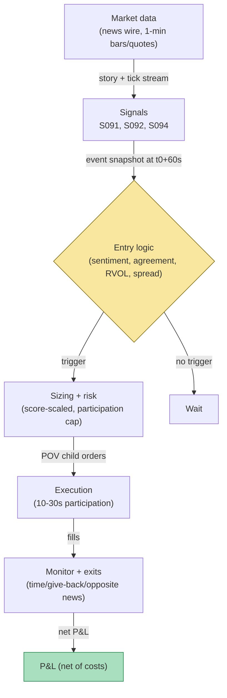

## Stage 159/200 — T059: News-Sentiment First-Minute Momentum

*Batch TB6 · Strategy 59/100 · Signals S091, S092, S094 · Provenance [D/SR]*

### T1. One-line verdict

| | |
|---|---|
| **Style** | Intraday event-driven momentum: trades the continuation after machine-readable news, confirmed by volume |
| **Edge source** | Investor underreaction — prices jump on signed news but the reaction continues for minutes (the first-minute print confirms direction; the drift after it is the trade) |
| **Typical holding period** | Minutes (example: 10-minute time stop; 5–30 minute window) |
| **Capacity hint** | Low per event (participation-capped); scales with news flow, not size — dozens of small trades, not a few big ones |
| **Build-or-buy in one line** | Buy the licensed news feed; build the reaction, agreement, and volume-confirmation logic yourself. |

Provenance **[D/SR]** (documented: S091, S092 are [D]; S094 is [SR] — standard RVOL/block reconstruction).

### T2. Full mechanics

**Universe & session.** Liquid US large- and mid-caps — example filter: average daily dollar volume above $50M, quoted spread normally ≤ 3 ticks (a tick is the minimum price increment, e.g. $0.01). RTH only (9:30–16:00 ET); no overnight holds — this is a minutes-long overlay, not a PEAD (post-earnings-announcement drift — the multi-day continuation after earnings surprises) book.

**Entry rule.** Pipeline per news story, all thresholds *example*:

1. **Ingest:** point-in-time machine-readable wire (vendor feed). The timestamp that matters is `t_0` = arrival at *your* pipe, exchange-clock synchronized — not the vendor's publication datetime.
2. **S091 (primary trigger):** score the story — sentiment `s ∈ [−1, +1]`, relevance `rel ≥ 80`, novelty `nov ≥ 70` (S091's ESS/relevance/novelty fields). Require `|s| ≥ 0.50`.
3. **First-minute return:** `r_1m = (P_{t_0+60s} − P_{t_0+})/P_{t_0+}`, measured on mid or microprice (not last trade, to limit bid-ask bounce bias). Require `|r_1m| ≥ 15 bp` for large-caps (*example*; 40 bp for mid-caps) **and** `sign(r_1m) = sign(s)` — the *agreement filter*: trade only when the market's first printed reaction agrees with the machine-read sentiment.
4. **S092 (filter):** the story must be *identified* news under the S092 procedure — matched to the name within the match window with relevance above the cutoff — so that jumps with no matched fundamental story are skipped.
5. **S094 (volume confirmation):** the event bin's RVOL ≥ 2.0 (*example*) — unusual volume confirms institutional participation — and the quoted spread ≤ 3 ticks (*example*), so the cost gate passes.
6. Enter at `t_0 + 60s` with the sign of `s`. Causal timing: the signal is complete at `t_0+60s`; the earliest fill is the first quote after that — never the headline instant.

**Exit rule.** First of: (a) time stop — *example* 10 minutes after entry; (b) give-back — exit if open profit retraces 50% (*example*); (c) opposite headline — a new story with opposite sign and `|s| ≥ 0.50` flips the book flat.

**Position sizing.** `q = q_base · |s| · min(1, |r_1m|/r_ref) · min(1, ADV/ADV_0)`, with `q_base = 25,000` shares (*example*), `r_ref = 40` bp, capped at *example* 1.5% of the 1-minute volume (participation cap) and a hard notional cap per name. Slippage model for planning: half-spread + impact.

**Risk limits.** Max *example* 5 concurrent news positions; daily loss stop *example* −1.5% of sleeve NAV; per-event stop at the give-back exit; kill switch if the news feed latency exceeds an *example* 5-second staleness budget.

**Cost model.** Spread crossing on entry and exit (the Groß-Klußmann & Hautsch finding: spreads widen right after news — modeled explicitly), commissions *example* $0.0008/share/side, and impact from the participation cap. The worked example charges all three.

**Order/execution sketch.** Child orders worked over *example* 10–30 seconds via POV (percentage-of-volume) at the participation cap — this is not a race to the first tick; the decision SLO (service-level objective) after `t_0+60s` is *example* < 100–200 ms to the first child, which is ample. Queue-position honesty: you are a liquidity *taker* here; never model maker fills.

**Intraday-news latency caveat (read before building).** This strategy dies if `t_0` is wrong. Retail news APIs typically stamp the *processed* time — 2–15 seconds after the exchange-visible headline — by which point the first-minute return is already in the price and you are trading the echo. Scheduled macro (CPI/NFP) is a sub-second race you will not win from a Mac. The documented, tradable edge is the *minutes-scale continuation after firm news with an accurate timestamp* — not the first impulse. If you cannot verify your feed's timestamp against the exchange clock, do not trade this.

### T3. Signals it consumes

| Signal | Role | Weight / logic |
|---|---|---|
| S091 News sentiment (first-minute reaction) | **Primary trigger** | Sign of `s`; enter iff `|s| ≥ 0.50`, `z`-style confirmation via `r_1m` agreement |
| S092 Identified-news vs no-news | **Filter** | Story must be *identified* (matched, relevant) — vetoes no-news jumps and rumour-class stories |
| S094 RVOL + signed block pressure | **Volume confirmation** | `RVOL ≥ 2.0` (*example*) confirms institutional flow; block imbalance sign must agree with `s` |

```text
# T059 combination logic (example thresholds; signal complete at t0+60s)
on story arrival at t0 (exchange-sync stamp):
    s, rel, nov = score(story)                       # S091
    if not (abs(s) >= 0.50 and rel >= 80 and nov >= 70): return
    if not identified_news(story, window=15min): return   # S092 veto
    wait until t0 + 60s
    r1m = (mid(t0+60s) - mid(t0+)) / mid(t0+)          # first-minute print
    if not (abs(r1m) >= 15bp and sign(r1m) == sign(s)): return  # agreement
    if not (RVOL(bin) >= 2.0 and spread <= 3 ticks): return    # S094 + cost gate
    q = 25000 * abs(s) * min(1, abs(r1m)/40bp)         # sizing
    enter sign(s) at next quote, cap 1.5% of 1-min volume
    exit at min(t0+660s, 50% give-back, opposite headline)
```

### T4. Worked example — numbers + P&L (SYNTHETIC)

Synthetic two-week tape of 10 news events (seed 159). Gate: `|s| ≥ 0.50`, `|r_1m| ≥ 15` bp, sign agreement, `RVOL ≥ 2.0`, spread ≤ 3 ticks. Exactly one event passes all five gates — the filter's selectivity is the point:

| # | Ticker | s | r_1m (bp) | RVOL | Spr | Trade? | Reason |
|---|---|---|---|---|---|---|---|
| 1 | ABC | +0.50 | −36.0 | 5.4 | 3 | No | sign mismatch (sentiment +, print −) |
| 2 | DEF | +0.12 | −37.3 | 4.8 | 1 | No | `|s|` < 0.50 |
| 3 | GHI | −0.22 | −30.5 | 2.2 | 1 | No | `|s|` < 0.50 |
| 4 | JKL | −0.34 | −3.8 | 2.2 | 2 | No | `|s|` < 0.50 |
| 5 | MNO | +0.78 | −3.9 | 5.2 | 1 | No | `|r_1m|` < 15 bp (no confirmation) |
| 6 | PQR | −0.19 | +5.8 | 3.3 | 3 | No | `|s|` < 0.50 |
| 7 | STU | +0.80 | +20.8 | 2.3 | 2 | **Yes** | all gates pass |
| 8 | VWX | +0.65 | +39.9 | 5.9 | 4 | No | spread 4 > 3 ticks (cost gate) |
| 9 | YZA | −0.54 | +18.9 | 2.6 | 2 | No | sign mismatch |
| 10 | BCD | −0.26 | −33.3 | 3.4 | 4 | No | `|s|` < 0.50 |

Event 7 (STU, synthetic) walked line by line:
- 09:41:00.000 — wire arrives (exchange-sync `t_0`); story scores `s = +0.80`, `rel = 84`, `nov = 76` → passes sentiment gate; S092 match confirms identified firm news.
- 09:42:00 — first-minute print: mid 100.00 → 100.208, `r_1m = +20.8 bp ≥ 15 bp`, sign matches `s`; bin RVOL = 2.3 ≥ 2.0; spread 2 ticks ≤ 3 → all gates pass. Gates are complete at `t_0+60s` — the earliest fill is the first quote *after* that, never the pre-reaction mid.
- Size: `q = 25,000 × 0.80 × min(1, 20.8/40) = 25,000 × 0.80 × 0.52 = 10,400` shares; participation cap not binding.
- Entry: buy 10,400 @ ask **100.218** (post-gate mid 100.208 + $0.01 half-spread on the 2-tick quoted spread).
- Exit: time stop at 09:52:00 (10 min), tape mid 100.131 → sell 10,400 @ bid **100.121**.
- Mid-to-mid gross: `10,400 × (100.131 − 100.208)` = **−$800.80**. (The +13.1 bp drift from the *pre-reaction* mid never belonged to the trade — the gates owned that minute.)
- Spread cross: `2 × 10,400 × $0.01` = **−$208.00**.
- POV impact: `2 × 10,400 × $0.005/share` (`example`) = **−$104.00**.
- Fees: `10,400 × 2 × $0.0008` = **−$16.64**.
- **Net: −$1,129.44.** Ten-event tape net: **−$1,129.44**.

**What the correction changed.** The old walk bought the pre-reaction mid 100.000 and printed +$1,345.76 — a lookahead fill: the gates only complete at `t_0+60s`, so no quote below 100.208 was executable. With the causal fill, the single traded event loses −$1,129.44 after full costs. The flip is the point: this strategy's apparent edge lives in the timestamp, and the honesty of the example is that the first-minute confirmation is *bought*, not free — you pay the post-reaction ask and the wide post-news spread.

**Where the example is optimistic.** The timestamp is assumed perfectly exchange-synced — the entire edge. Fills assume the POV child completes inside the participation cap at the stated impact; real news bursts see spreads triple in seconds (the example's own gate rejected event 8 for exactly this). Only one trade fired in ten events: at this selectivity the strategy needs high news throughput to matter, and the single printed trade *lost* after costs — it says nothing about the win rate. No partial fills, no opposite-headline whipsaw, no stale reprints — the S093 failure the real book must survive.

### T5. Data & infra — what must run

**Daily/intraday pipeline inventory.** (1) Always-on: news wire ingest with entity linking (ticker map) and exchange-sync timestamping; novelty index (simhash/embedding cosine vs trailing stories); sentiment/relevance scorer. (2) Intraday loop: 1-minute bar + quote engine for `r_1m`, RVOL bins (S094), spread monitor; event state machine (waiting → armed at `t_0+60s` → in-trade → exited). (3) Post-close: reaction study (did the drift persist?), slippage vs arrival accounting, timestamp-drift audit (vendor stamp vs exchange clock). Storage: headline + score archive is small (GBs/year); the 1-minute quote history for the traded universe follows cost-model §4 (~50 MB/day for 500 symbols).

**M5 Max feasibility.** Feasible — scoring a frozen small classifier is < 10 ms/story on this box; the pipeline is feed-bound, not compute-bound. Verdict pattern (per cost-model §7): *feasible on the M5 Max (Tier H data-wise, eng Tier H, 60–200 h ≈ $9k–$30k loaded-cost estimate + news license; bottleneck is the licensed feed's timestamp quality, not FLOPs).* Note the cost-model honesty rule: a toy build on free RSS is cheap and researches a different market than the one you'd trade.

**Feed-outage safe mode.** If the news feed drops or timestamps go stale: cancel all armed (pre-`t_0+60s`) events immediately; existing positions run to their time stops (they are minutes long — flatten, don't babysit); halt new entries until the timestamp audit passes again. Never enter on a story whose `t_0` you cannot verify.

### T6. Buy vs build

| Option | What you get | Indicative price | What buying gains | What buying loses |
|---|---|---|---|---|
| Tier 0: SEC EDGAR + PR wires + RSS | Filings, press releases | ~$0 — *indicative — verify before budgeting* | Free, redistribution-safe for filings | Minutes-late; no entity linking; unusable `t_0` |
| Tier 1: Benzinga Pro / similar | Machine-readable headlines, some sentiment | ~$100–200/mo, *indicative — verify before budgeting* | Affordable real pipe | Timestamp trust must be audited; redistribution limits |
| Tier 3: RavenPack / Bloomberg-class | Ticker-linked events, relevance/novelty, synced stamps | $$$$ enterprise (typically $50k–250k+/yr), *indicative — verify before budgeting* | The timestamp is the product | Budget-breaking for a small operation; no redistribution |
| QuantConnect / Composer-style retail | Backtest harness, some news datasets | subscription, *indicative — verify before budgeting* | Fast paper prototype | Point-in-time correctness varies; check before trusting |

**Verdict: buy the feed, build the reaction layer.** Rolling your own NLP on RSS is how you discover, months later, that your "edge" was embargoed reprints. Novelty scoring (simhash + entity window) is worth building — vendors' novelty flags are a start, not a research-grade duplicate graph. Crossover: start on a Tier 1 trial with a timestamp audit; only step up to enterprise news if the audit shows the trial's `t_0` lagging the tape.

### T7. Success-ratio evidence

| Study / source | Market & period | Metric | Before/after cost | Caveat |
|---|---|---|---|---|
| Groß-Klußmann & Hautsch (2011) | LSE intraday, 20-second VAR | News arrivals move returns, volatility, volume, spreads; relevance classification crucial; sentiment predicts future price trends | Before cost — and the paper states profitability is *deteriorated by increased bid-ask spreads* | The cost sentence is the finding: the edge exists gross, spreads eat it |
| Tetlock (2007) | WSJ pessimism, US market | High media pessimism predicts downward pressure then reversion | Before cost | Daily horizon; pessimism factor, not first-minute |
| Chan (2003) | US headlines, monthly | Drift after bad news; reversal after extreme no-news moves | Before cost | Concentrated in smaller, illiquid stocks; monthly horizon |
| Bernard & Thomas (1989) | US earnings, 1974–1985 | SUE decile spread positive in 41 of 48 quarters; drift ≥ 60 days | Before cost | The slow clock — PEAD, not first-minute |
| Boudoukh et al. (2019) | US firm news | Fundamental news accounts for 49.6% of overnight idiosyncratic volatility (12.4% intraday) | Statistical decomposition, not a trade | Justifies the identified-news filter; not a P&L |

**Honest bottom line.** For a ≤$1M paper operation: the literature documents that news moves prices and that signed news drifts — but the documented after-cost intraday numbers are thin, and the one quantified cost finding (Groß-Klußmann & Hautsch: spreads deteriorate profitability) points the wrong way. The realistic version of this strategy is a *research operation proving timestamp quality first*: if your audited `t_0` is seconds late, your expected edge is ≈ 0 after spread. An institutional desk with a colocated licensed wire can run the minutes-scale book; a retail operation is likelier to find that its "first-minute momentum" is the vendor's latency, monetized against itself.

### T8. Failure modes

1. **Timestamp lag (the #1 killer).** Vendor's processed stamp trails the exchange-visible headline by seconds; the first-minute return is already in the price. *Mitigation:* continuous timestamp audit vs exchange clock; staleness kill switch.
2. **Stale reprints (S093's domain).** A "new" story is a rewrite; novelty scoring misses it; you buy the top of someone else's drift. *Mitigation:* embedding-cosine novelty index; require `nov ≥ 70` (*example*).
3. **Spread blowout at the event.** Spreads triple in the first seconds after news; the cost gate exists because of this. *Mitigation:* hard spread ≤ 3 ticks (*example*) gate; model spread as a function of RVOL, not a constant.
4. **Opposite-headline whipsaw.** A denials/correction story arrives mid-hold. *Mitigation:* the opposite-headline exit; cap concurrent positions.
5. **No-news jumps misclassified as news.** A price jump with a coincidentally timed irrelevant story passes the filter. *Mitigation:* S092's relevance cutoff and match window, kept tight (*example* 15 min).
6. **Scheduled-macro race.** Trying to trade CPI/NFP first impulses from a Mac — you are the liquidity. *Mitigation:* blacklist scheduled macro from this book; it belongs to a colocated operation or not at all.
7. **Overfit gate thresholds.** `|s| ≥ 0.50`, 15 bp, RVOL 2.0 tuned on one news regime. *Mitigation:* freeze the spec; validate on purged/embargoed event splits (S088 discipline); expect decay as wire speeds compress.

### T9. Visuals


*Caption: ten synthetic news events (seed 159) through the five-gate filter — nine rejected (sentiment, agreement, spread, or cost gates), one traded (event 7, STU: −$1,129.44 net after the causal post-gate fill and full costs). Total tape net −$1,129.44. Watermark reads "SYNTHETIC EXAMPLE"; corner caption: "synthetic data — not market data".*



### T10. Sources

1. Groß-Klußmann, A. & Hautsch, N. (2011). "When machines read the news: Using automated text analytics to quantify high frequency news-implied market reactions." *Journal of Empirical Finance* 18(2), 321–340. http://ideas.repec.org/a/eee/empfin/v18y2011i2p321-340.html — relevance classification crucial; sentiment predicts trends; profitability deteriorated by spreads.
2. Tetlock, P. C. (2007). "Giving Content to Investor Sentiment: The Role of Media in the Stock Market." *Journal of Finance* 62(3), 1139–1168. https://doi.org/10.1111/j.1540-6261.2007.01232.x
3. Chan, W. S. (2003). "Stock price reaction to news and no-news: drift and reversal after headlines." *Journal of Financial Economics* 70(2), 223–260. https://www.researchgate.net/publication/2856618_Stock_Price_Reaction_to_News_and_No-News_Drift_and_Reversal_After_Headlines_Wesley_S_Chan
4. Bernard, V. L. & Thomas, J. K. (1989). "Post-Earnings-Announcement Drift: Delayed Price Response or Risk Premium?" *Journal of Accounting Research* 27 (Supplement). — PEAD: SUE decile spread positive in 41/48 quarters (summary: https://en.wikipedia.org/wiki/Post%E2%80%93earnings-announcement_drift).
5. Boudoukh, J., Feldman, R., Kogan, S. & Richardson, M. (2019). "Information, Trading, and Volatility: Evidence from Firm-Specific News." *The Review of Financial Studies* 32(3), 992–1033. https://ideas.repec.org/a/oup/rfinst/v32y2019i3p992-1033..html

**Unverified leads** (chatbot-provided; not confirmed facts — verify before use):
- Grok (2026-09-10): "median SPY post-CPI quote lag compressed ~450 ms (2018–19) → ~120 ms (2023–24)" — chatbot claim, no checkable source captured; do not size latency budgets off it.
- Grok (2026-09-10): firm-level news-momentum "long-short on news-return deciles ~3.34%/month" — resembles published news-return drift work but no citable paper captured; unverified.
- Grok latency budgets (wire parse 5–50 ms, sentiment inference 10–80 ms) — illustrative estimates, not measurements.

*Source log: Grok answered Q-TB6-1..3 (2026-09-10); all claims independently verified or labeled unverified.*
