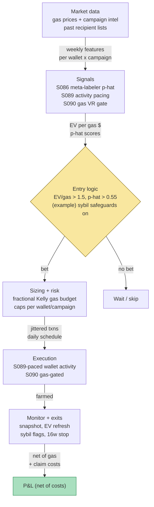

## Stage 159/200 — T059: Airdrop Farming Yield Optimizer

*Batch TB6 · Strategy 59/100 · Signals S089, S090, S086 · Provenance [D/SR]*

### T1. One-line verdict

| | |
|---|---|
| **Style** | Crypto incentive-harvesting — an expected-value allocator that spends gas across candidate airdrop campaigns and wallets, with anti-detection (sybil) safeguards |
| **Edge source** | Protocols distribute tokens to early users; a disciplined farmer treats each wallet×campaign as a bet with EV = p(eligible) × E[value] − gas cost, and wins by (a) selecting only positive-EV bets via meta-labeling and (b) surviving issuers' sybil filters through behavior decorrelation |
| **Typical holding period** | 4–16 weeks per campaign (farm → snapshot → claim → usually quick sale) |
| **Capacity hint** | Bounded by sybil detection: the documented finding is that ~50% of Arbitrum recipients were same-person addresses and issuers now filter aggressively — each extra wallet has diminishing, then negative, marginal EV |
| **Build-or-buy in one line** | Build the EV ledger and the meta-labeler (your campaign history is the dataset); buy nothing except gas — there is no legitimate "airdrop optimizer" product, only scams |

Provenance **[D/SR]**: airdrop farmer economics and sybil detection are documented (TierDrop arXiv:2407.01176; Liu & Zhu arXiv:2209.04603; CoinDesk 2023 reporting); the EV-per-gas allocator, the A-S-style activity pacing, and the meta-labeling overlay are the chapter's practitioner reconstruction (SR). Every projection is an *example projection* — airdrop EV is speculative.

### T2. Full mechanics

**Jargon first.** An **airdrop** is a free token distribution by a crypto protocol to early users, usually to bootstrap usage. **Airdrop farming** is performing protocol interactions (swaps, bridges, staking) specifically to qualify for anticipated airdrops. A **sybil** is one person controlling many wallets to multiply rewards; issuers run **sybil filters** (graph/clustering analysis) to disqualify them. **Gas** is the transaction fee paid on a blockchain (in the chain's native token). **EV** (expected value) = probability-weighted payoff minus cost. **Snapshot** is the cutoff time after which activity no longer counts. A **durable user** is an issuer's term for a genuine, retained user (vs a farmer who leaves after claiming).

**Universe & session.** EVM-compatible chains and L2s with live or credibly rumored incentive programs (points programs, announced criteria, or strong community signal). Exclusions: campaigns requiring KYC (know-your-customer identity checks — incompatible with multi-wallet farming and usually with the operator's risk tolerance), chains with median gas above the EV threshold (the S090 gate handles this dynamically), and any campaign whose terms prohibit farming where the operator has legal exposure — this chapter describes the mechanics, not legal advice.

**Entry rule.** Each wallet×campaign pair is a *bet*. Compute:

EV(wallet, campaign) = p̂_elig × E[value | eligible] − gas_budget

where p̂_elig comes from the S086 meta-labeler (T3), E[value | eligible] from comparable past drops (*example projection*, never a forecast), and gas_budget from the S090 gas-regime read. **Enter** (start farming) only if EV/gas_dollar > 1.5 (*example* — the bet must return $1.50 per $1 of gas) AND p̂_elig > τ = 0.55 (*example*, the S086 veto). Causal timing: the meta-score uses activity and campaign features known at decision time; farming transactions execute over the following days — there is no t→t+1 bar subtlety here, only the discipline of never scoring with post-snapshot data.

**Sybil safeguards (the S089 pacing layer).** The Avellaneda–Stoikov reservation-price logic is repurposed: treat each wallet's *activity concentration* as inventory *q*. The "cost" of the next transaction on wallet *i* rises with that wallet's recent activity share — *r_i = base_cost + γ·q_i* (reconstruction, *example* form) — so the scheduler *spreads* activity across the fleet exactly as A-S spreads quotes around inventory. Hard safeguards: no two wallets share a funding source on-chain (*example* rule — cluster analysis keys on common funders, per Liu & Zhu 2022), transactions jittered in time and amount (never identical amounts across wallets), distinct interaction *sequences* per wallet (same-protocol-different-path), and a cap of *N* wallets per campaign (*example*: N = 5–20, set by the S086 study of past disqualification rates).

**Exit rule.** Stop farming a wallet×campaign at the first of: (a) snapshot announced/passed; (b) EV turns negative on refreshed gas prices; (c) the wallet trips a sybil-risk flag (e.g., appears in a public cluster list — abandon it, the claim is worth less than the fleet's reputation); (d) campaign time stop — 16 weeks (*example*). Post-claim: sell the airdropped tokens within 24h (*example*) — the documented finding is that 35–95% of recipients dump quickly (TierDrop), so the post-drop drift is reliably *down*.

**Position sizing.** Fractional-Kelly on the meta-labeler's calibrated p̂_elig: size the *gas budget* per bet as *f* = 0.5 × edge/variance in EV units, capped at $200 gas per wallet×campaign (*example*) and at 10% of the farming book per campaign (*example*). The S089 pacing layer then *schedules* that budget across days to minimize the sybil signature.

**Risk limits.** Max 20 active wallets per campaign (*example*); max 30% of the farming book in unclaimed (pre-drop) EV (*example*); daily gas-spend stop. Kill switch: if a major issuer announces a new detection method (LayerZero-style self-report + cluster analysis), pause new farming 72h (*example*) and re-score the fleet.

**Cost model.** Gas per transaction (the worked example uses $0.85/tx, *example*), bridge fees, claim-transaction gas, and the sale's DEX swap fee (0.3%, *example*). The dominant "cost" is usually *disqualification*: a farmed-but-disqualified wallet is a 100% loss of its gas — which is why the S086 threshold exists.

**Order/execution sketch.** A scheduler, not a trading engine: it emits signed transactions per wallet on a jittered timetable, paced by the S090 gas gate (farm when gas is cheap and mean-reverting; pause in persistent spikes). On-chain activity is public — there is no queue to game, only patterns to avoid.

**Causality.** Meta-features use only pre-decision activity; eligibility labels come from *past* campaigns' published recipient lists; never train on the campaign you're currently farming (that would be training on the test set).

### T3. Signals it consumes

| Signal | Role | Weight / logic |
|---|---|---|
| S086 — Meta-labeling | **Primary bet selector** | The meta-model *f̂(x, s)* scores each wallet×campaign bet: p̂ = P(eligible & profitable \| wallet features, campaign features). **Veto** any bet with p̂ ≤ 0.55 (*example*); **size** the gas budget by p̂ above the threshold. Trained on the operator's own past campaigns (their mistakes are the dataset) |
| S089 — Avellaneda–Stoikov inventory skew | **Activity-pacing layer (reconstructed use)** | Wallet activity concentration treated as inventory *q*: the scheduler's cost for the next tx on wallet *i* rises with *q_i*, spreading activity across the fleet — the A-S thermostat repurposed from quoting to sybil-avoidance |
| S090 — Variance-ratio / Hurst regime toggle | **Gas-regime gate** | VR on gas-price series: VR < 0.9 (*example*, anti-persistent/cheap) → farm at full pace; VR > 1.2 (*example*, persistent spike) → pause non-urgent transactions. Conditions *when* gas is spent, never *which* campaign |

```pseudocode
# T059 combination logic — weekly re-score; scheduler emits txns daily
for campaign in live_campaigns:
    gas_vr = variance_ratio(gas_price_series, k=4)   # S090 gas regime
    pace = 1.0 if gas_vr < 0.9 else (0.0 if gas_vr > 1.2 else 0.5)  # example
    for wallet in fleet:
        x = wallet_features(wallet) + campaign_features(campaign)
        p = meta_model.predict_proba(x)               # S086: P(eligible & profitable)
        ev = p * exp_value(campaign) - gas_budget     # example projection
        if p <= 0.55 or ev / gas_budget < 1.5:        # example veto + EV gate
            continue                                 # skip: not a bet
        budget = kelly_frac(p, payoff)               # gas budget for this bet
        schedule(wallet, campaign, budget, pace,      # S089: spread txns,
                 jitter=True, max_q=concentration_cap) # decorrelate the fleet
# exits: snapshot passed, EV<0 on refresh, sybil flag, or 16-week stop
```

### T4. Worked example — numbers + P&L (SYNTHETIC)

All numbers synthetic — fictitious L2 campaign "AIRX". Script `batches/TB6/plot_T059.py`, **seed 159**; the chart in T9 plots these exact wallets. Cost schedule (*example*): gas $0.85/tx average, 12 tx per farmed wallet; claim gas $3.00 per eligible wallet; realized drop 450 AIRX at $0.40 = **$180.00** per eligible wallet (*example projection*, speculative).

**Setup.** 5-wallet fleet. S086 meta-scores: W1 0.72, W2 0.68, W3 0.61, W4 0.48, W5 0.35. Veto τ = 0.55 (*example*) → farm W1–W3; skip W4, W5. Gas spent: W1 $52.40, W2 $48.10, W3 $55.75. Realized: W1 and W2 eligible; W3 caught by the issuer's sybil filter (ineligible — its funding graph clustered).

| Wallet | Meta p̂ | Decision | Gas | Drop | Net |
|---|---|---|---|---|---|
| W1 | 0.72 | BET | −$52.40 | +$180.00 − $3.00 claim | **+$124.60** |
| W2 | 0.68 | BET | −$48.10 | +$180.00 − $3.00 claim | **+$128.90** |
| W3 | 0.61 | BET | −$55.75 | ineligible ($0) | **−$55.75** |
| W4 | 0.48 | SKIP | $0 | — | $0.00 |
| W5 | 0.35 | SKIP | $0 | — | $0.00 |
| **Total** | | 3 bets | −$156.25 | +$354.00 | **+$197.75** |

Check: 124.60 + 128.90 − 55.75 = 197.75 ✓. The value came from the *skips* (W4, W5 avoided two more likely-disqualified gas burns) — the S086 mechanism working as designed — while W3 shows the residual risk the meta-model can't eliminate: a 0.61 that still got filtered.

**Where the example is optimistic.** The $180 expected drop value is an *example projection* — real airdrop values are unknowable in advance and the documented range of outcomes includes zero (no airdrop ever happens). The meta-scores (0.72/0.68/0.61) are assumed calibrated; a real meta-labeler trained on a handful of past campaigns is noisy, and eligibility criteria change per campaign (points programs, self-reports, donations-to-claim like LayerZero's). Sybil detection is adversarial and *adaptive*: the filter that caught W3 is a snapshot of 2024-era clustering — issuers update. Five wallets and one campaign cannot support any performance inference; the example demonstrates the *EV ledger mechanics*, not a yield.

### T5. Data & infra — what must run

**Pipeline inventory.** Continuous: gas-price feeds per chain (S090 gate), campaign intelligence (points programs, snapshot announcements — mostly manual). Weekly: re-score wallet×campaign bets with S086; refresh the EV ledger. Per campaign end: ingest the published recipient list, label your wallets, append to the meta-training set. Storage is trivial — megabytes (per notes/cost-model.md §4, even 1-min bars for 500 symbols are ~50 MB/day; this strategy's data is orders of magnitude smaller).

**M5 Max feasibility: trivially feasible (Tier L).** Per notes/cost-model.md §2/§3: the meta-labeler trains on hundreds-to-thousands of labeled wallet×campaign bets — seconds with gradient boosting; the gas VR gate is rolling statistics — milliseconds. RAM: megabytes against the 77 GB budget (§3). Engineering: Tier L, 4–12 h ≈ **$600–1,800** loaded-cost estimate (§5) for the EV ledger + scheduler; the meta-labeler adds ~10–20 h once you have ≥3 labeled past campaigns. *One-line verdict: feasible on the M5 Max (Tier L, ~20 h ≈ $3k eng + ~$0–50/mo data); bottleneck is campaign intelligence and sybil-filter adaptation, not compute.*

**Feed-outage safe mode.** Gas feed drops: the S090 gate freezes at its last pace value and *new* transaction scheduling pauses — never emit a farming transaction without a current gas read (a stuck "cheap" read could burn the budget in a spike). Campaign-intel staleness (no update in 7 days, *example*): no new campaigns entered; existing farms continue to their time stops. Meta-model unavailable: fall back to the naive rule (farm only if realized past-campaign ROI > 2×, *example*) — degraded but explicit. All transitions logged.

### T6. Buy vs build

| Option | What you get | Indicative price | Gains | Loses |
|---|---|---|---|---|
| Tier-0 free (public RPCs, block explorers, project docs) | Gas data, recipient lists, criteria | ~$0, *indicative — verify before budgeting* | Everything the strategy needs is public | Manual campaign tracking; rate-limited RPCs |
| Points-dashboard trackers (community tools) | Campaign progress tracking | free–freemium, *indicative — verify before budgeting* | Convenience | Not your EV ledger; criteria change without notice |
| "Airdrop farming services"/bots for hire | They farm for you, take a cut | 10–30% of drop, *indicative — verify before budgeting* | No work | You inherit *their* sybil cluster — one flagged operator can poison your wallets; frequent scams |
| Private RPC (Alchemy/Infura-style) | Reliable transaction submission | ~$0–50/mo, *indicative — verify before budgeting* | Fewer stuck transactions | Doesn't improve EV |
| Build in-house (Python) | EV ledger, S086 meta-labeler, S089 scheduler, S090 gas gate | ~20–40 h ≈ $3,000–6,000 eng (loaded-cost estimate) | Your bets, your labels, auditable | You own the sybil-adaptation treadmill |

**Verdict: build — and never buy farming services.** The EV ledger and the meta-labeler *are* the strategy, and both depend on *your* wallet histories, which no vendor has. **Buy** at most a private RPC endpoint for reliable submission (~$0–50/mo, indicative). The crossover for paid campaign-intel tools: when manual tracking costs you a snapshot — one missed eligibility pays for years. Never outsource the wallets themselves: shared infrastructure means shared sybil graphs.

### T7. Success-ratio evidence

| Source | Market / period | Metric | Before/after cost | Caveat |
|---|---|---|---|---|
| Yaish & Livshits, "TierDrop" (arXiv:2407.01176, 2024) | Arbitrum recipients | ~50% same-person addresses; ~22% in sybil clusters ≥20; 35–95% dump post-receipt | Before-cost (behavioral measurement) | Documents the *scale* of farming and the post-drop dump — not farming profitability |
| Liu & Zhu, "Fighting Sybils in Airdrops" (arXiv:2209.04603, 2022) | Airdrop case study | Graph-based detection (common behaviors, regular transfer patterns) successfully identifies sybil clusters | n/a — detection method | Confirms the *adversary's* capability: the safeguards in T2 are a response to exactly this class of detector |
| CoinDesk, "Sybil Millionaires" (2023) | Arbitrum/ENS/Sui/Aptos airdrops | Multi-account operators captured ~48% of Arbitrum tokens; individual hunters reported $1–2M from Arbitrum alone; one hunter collected 933,365 ARB (>$1M) | Before-cost (anecdotal + on-chain measurement) | Survivorship journalism — the winners are visible; the disqualified and the never-airdropped are not |

Capacity and decay: the documented decay channel is *issuer adaptation* — LayerZero's 2024 anti-sybil campaign (self-report + cluster analysis, 1M+ accounts flagged) is the template every issuer now copies. Each campaign's filter is stricter than the last, so historical p̂_elig overstates future eligibility — the meta-labeler must be re-fit per campaign era, and the honest prior is *declining* EV per wallet over time.

**Honest bottom line.** For a ≤$1M paper operation: this is a positive-EV *hobby-scale* operation, not an institutional strategy — the documented economics say the game is real (hundreds of millions distributed; farmers captured roughly half of Arbitrum's drop) but the edge decays with every issuer's filter upgrade, and the entire P&L rests on *example projections* of drop values that are unknowable in advance. Paper-track it as an EV ledger for 2–3 campaigns before spending real gas; expect most campaigns to underperform the projection. For an institutional desk: not a strategy — unscalable, reputationally toxic, and adversarial in a way that doesn't diversify anything. **Airdrop EV is speculative — every value projection in this chapter is an *example projection*, not a forecast.**

### T8. Failure modes & pitfalls

1. **No airdrop ever happens** — the campaign was a rumor; all gas is sunk. *Mitigation:* the EV gate requires *p(airdrop happens)* as an explicit factor (*example*: only farm announced programs or points systems); cap spend per rumor-stage campaign.
2. **Sybil filter catches the fleet** — a new clustering method disqualifies all wallets at once. *Mitigation:* the S089 decorrelation safeguards; per-campaign wallet caps; the 72h pause on new detection announcements (*example*).
3. **Eligibility criteria change mid-campaign** — points formulas revised; your activity no longer counts. *Mitigation:* weekly EV refresh; stop-loss on farming spend (abandon at 50% of budget with no qualifying signal, *example*).
4. **Gas spike burns the budget** — a congestion event 10×s transaction costs mid-campaign. *Mitigation:* the S090 gate pauses non-urgent transactions in persistent gas spikes; hard per-wallet gas caps.
5. **Post-drop price collapse** — you hold the airdrop expecting more; the documented 35–95% dump happens. *Mitigation:* mechanical 24h sale rule (*example*); the drop is income, not an investment thesis.
6. **Meta-labeler overfit on few campaigns** — 3 past campaigns, 40 features, perfect in-sample p̂. *Mitigation:* purged/embargoed validation per campaign-era (S088 discipline); regularized models; report the *calibration*, not just the AUC.
7. **Shared-infrastructure poisoning** — one wallet in a public cluster taints the fleet by association. *Mitigation:* funding-source separation; quarantine any flagged wallet — never let it fund others.
8. **Claim-time extraction** — the claim is front-run, or requires a donation (LayerZero-style) that reprices the EV. *Mitigation:* include claim costs in the EV *before* farming; private mempool submission for large claims.

### T9. Visuals


The chart plots the T4 wallets exactly: W1 (meta 0.72) **+$124.60**, W2 (0.68) **+$128.90**, W3 (0.61, filtered) **−$55.75**, W4/W5 skipped at $0.00; campaign cumulative **+$197.75** after the week-8 claim. Watermark reads "SYNTHETIC EXAMPLE" exactly; corner caption reads "synthetic data — not market data".



### T10. Sources

- Yaish, A. & Livshits, B. (2024). "TierDrop: Harnessing Airdrop Farmers for User Growth." arXiv:2407.01176. https://arxiv.org/abs/2407.01176 (verified 2026-09-10 — resolves to the cited paper) — ~50% of Arbitrum recipients were same-person addresses; ~22% in sybil clusters ≥20; 35–95% dump post-receipt. (Verifies the T7 scale/dump claims.)
- Liu, Z. & Zhu, H. (2022). "Fighting Sybils in Airdrops." arXiv:2209.04603. https://arxiv.org/abs/2209.04603 (verified 2026-09-10) — graph-based sybil detection via common behaviors and regular transfer patterns. (Verifies the T7/T8 adversary model.)
- CoinDesk (2023). "Sybil Millionaires: How Airdrop Hunters Trick Projects and Snatch Fortunes." https://www.coindesk.com/consensus-magazine/2023/04/10/crypto-airdrop-sybil-attacks — ~48% of Arbitrum tokens to multi-address operators; $1–2M individual hauls; 933,365 ARB to one hunter. (Verifies the T7 anecdotal-scale claims.)
- López de Prado, M. (2018). *Advances in Financial Machine Learning*. Wiley, ch. 3 — the meta-labeling construction *p̂_t = f̂(x_t, s_t)* and the veto/sizing overlay behind S086 (per S086).
- Avellaneda, M. & Stoikov, S. (2008). "High-frequency trading in a limit order book." *Quantitative Finance* 8(3), 217–224 — the inventory-skew reservation-price logic repurposed for the S089 activity-pacing layer (per S089).

**Unverified leads** (chatbot-provided without an independent checkable source — do not treat as evidence):
- *Unverified chatbot claim* (Grok, 2026-09-10, Q-TB6-2): news/LOB vendor pricing bands — used only where marked *indicative — verify before budgeting*; not load-bearing for this strategy.
- Per-campaign *disqualification rates* and *expected drop values* circulate in farming communities — no checkable study is cited here; the chapter treats all such figures as *example projections*.
- Grok's Q-TB6-3 purged-CV/overfitting discussion (DSR, PBO) is directionally consistent with AFML but its specific numbers are Grok's — the S086 layer here uses only the documented meta-labeling construction.

*Source log: Grok answered Q-TB6-1..3 (2026-09-10); all claims independently verified or labeled unverified.*
