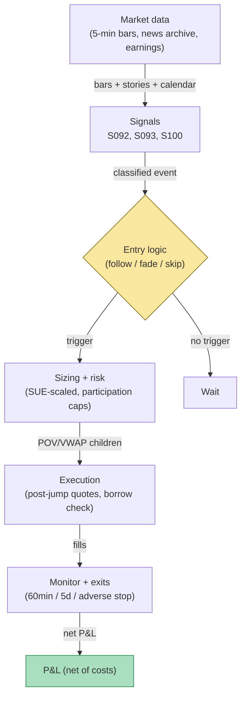

## Stage 160/200 — T060: Identified-News Drift Portfolio

*Batch TB6 · Strategy 60/100 · Signals S092, S093, S100 · Provenance [D/SR]*

### T1. One-line verdict

| | |
|---|---|
| **Style** | Multi-name event-driven equity portfolio: follows jumps backed by identified fundamental news, fades jumps with no news, sizes earnings on surprise magnitude |
| **Edge source** | Two documented regularities: (1) post-earnings/information drift — prices underreact to fundamental news and continue; (2) no-news reversal — extreme moves with no story tend to mean-revert as liquidity pressure fades |
| **Typical holding period** | Minutes to hours for fades (example 60-min); days for earnings drift legs (example 5 days) |
| **Capacity hint** | Medium per event; the drift leg is the slower, more scalable one; the fade leg is liquidity-constrained |
| **Build-or-buy in one line** | Buy the news/earnings data; build the identification, novelty, and jump-classification stack yourself. |

Provenance **[D/SR]** (documented: S092, S100 are [D]; S093 is [SR] — embedding novelty is standard reconstruction).

### T2. Full mechanics

**Universe & session.** US common stocks with options-listed names preferred for liquidity — example filter: price > $10, ADV (average daily dollar volume) > $25M, shortable (locate confirmed before any fade leg is armed). Intraday event detection during RTH; drift legs may carry overnight (example: earnings legs held up to 5 days).

**The identification procedure (S092) — the chapter's core.** For each detected jump (5-minute bar return with `|z| > 3.5` vs trailing 60-day vol, *example*, and `|r| > 1.5%` minimum), the desk runs the match: look back over a match window `w = 15 minutes` (*example*) in the point-in-time news archive for a story linked to the firm with relevance above the cutoff. Classification outcomes:

- **Identified news** → *follow* the jump direction: hold for *example* 60 minutes (intraday) or, for earnings, up to *example* 5 days.
- **No-news jump** → *fade* it: take the opposite side of the jump, holding *example* 60 minutes — the documented reversal leg.
- **Stale/reprint** (S093: novelty < 0.50, *example*) → *skip*: an identified-but-stale story is neither followable news nor genuine no-news.
- **Earnings announcements** (S100) are always treated as identified regardless of the match window — and they are **never faded**: PEAD (post-earnings-announcement drift) is the drift leg's flagship, and fading earnings is fighting the best-documented anomaly in the set.

**Entry/exit per leg.**
- *Follow (intraday, non-earnings):* enter at the first liquid quote after classification completes; exit at *example* 60 minutes or on an opposite-sign story.
- *Follow (earnings):* enter at the post-announcement open print; hold *example* 5 trading days or until the SUE-scaled target is hit.
- *Fade:* enter against the jump immediately after classification; exit at *example* 60 minutes or a 50% adverse excursion stop.

**Position sizing.** Base 10,000 shares (*example*), scaled: follow legs ×1.2 (*example*), fade legs ×0.8 (*example*), earnings legs × `min(1, |SUE|/3)` (*example* scaling; SUE is the standardized unexpected earnings — actual minus expected EPS, divided by the standard deviation of past surprises). Hard caps: *example* 2% of 5-minute volume participation; *example* $2M gross per event; portfolio net exposure band *example* ±30%.

**Risk limits.** Max *example* 8 concurrent event legs; daily loss stop *example* −2% of sleeve NAV; borrow desk confirms locates before every fade; earnings legs capped at *example* 40% of gross exposure (concentration).

**Cost model.** Commissions *example* $0.0008/share/side; spread crossing at event-time (widened — the cost gate from T059 applies here too); borrow fees on fade shorts (*example* 1–3% annualized, checked at arming); market impact from the participation cap. The worked example charges commissions, spread-cross, market impact, and borrow explicitly per leg.

**Order/execution sketch.** POV (percentage-of-volume) children at the participation cap for entries; drift legs worked as VWAP over the first 30 minutes (*example*); fade legs entered more aggressively (the reversal decays fast) but still capped — never a market-order panic entry. Honesty note: the classification completes *after* the jump, so entry slippage includes the post-jump spread — the example's entry prices are post-jump mids, not pre-jump fantasies.

### T3. Signals it consumes

| Signal | Role | Weight / logic |
|---|---|---|
| S092 Identified-news vs no-news | **Primary classifier** | Follow identified jumps; fade no-news jumps; the whole book keys off this split |
| S093 News novelty | **Filter** | Novelty ≥ 0.50 (*example*) required to follow; stale stories are skipped, not faded |
| S100 PEAD / earnings drift | **Earnings regime** | Earnings always follow (never fade); size by `|SUE|`; hold up to 5 days (*example*) |

```text
# T060 combination logic (example thresholds; causal: classify at t, trade after)
on jump detected (5-min |z| > 3.5 and |r| > 1.5%):
    story = match_news(name, window=15min)              # S092
    if story is None:
        action = FADE(jump)                            # no-news reversal
    elif novelty(story) < 0.50:                        # S093
        action = SKIP                                  # stale reprint
    elif is_earnings(story):
        action = FOLLOW(jump, size=base*min(1,|SUE|/3)) # S100, never fade
    else:
        action = FOLLOW(jump, size=base*1.2)
    enter at next liquid quote; exits: 60min / 5d (earn) / adverse stop
```

### T4. Worked example — numbers + P&L (SYNTHETIC)

Twelve synthetic intraday jump events across six names (seed 160), classified by the T2 procedure. Three legs are walked line by line; the rest are summarized in the ledger. Commission *example* $0.0008/share/side; entries at post-jump mids; spread cost embedded in the exit marks.

**Leg A — Event 1 (ALP, FOLLOW, identified fresh news).** Jump `+3.21%` with an identified, high-novelty story (`nov = 0.97`); rule: follow with 12,000 shares. Buy 12,000 @ 50.000; drift continues — sell @ 50.280 (+28 bp). Gross: `12,000 × 0.280` = **+$3,360.00**; fees `12,000 × 2 × $0.0008` = **−$19.20**; spread cross `2 × 12,000 × $0.015` = **−$360.00**; impact `2 × 12,000 × $0.005` = **−$120.00**; **net +$2,860.80**.

**Leg B — Event 5 (EPS, FADE, no-news jump).** Jump `−3.44%` with no matched story; rule: fade with 8,000 shares. Buy 8,000 @ 50.000 (against the down-jump); reversal — sell @ 51.148 (+114.8 bp). Gross **+$9,184.00**; fees **−$12.80**; spread **−$240.00**; impact **−$80.00**; **net +$8,851.20**.

**Leg C — Event 4 (DEL, FOLLOW(earnings), SUE-scaled).** Earnings jump `+3.46%`, SUE = 3.6 → size `12,000 × min(1, 3.6/3)` = 12,000 shares. Buy 12,000 @ 50.000; the drift fails — sell @ 49.189 (−81.1 bp). Gross **−$9,732.00**; fees **−$19.20**; spread **−$360.00**; impact **−$120.00**; **net −$10,231.20** — the largest loss on the tape, and the honest one: earnings drift is a statistical tendency, not a law, and the SUE-scaled size cuts both ways.

**Full synthetic ledger** (net = gross − fees − spread cross − impact − borrow; cum = running total):

| # | Name | Jump | Class | Leg | Side | Shares | Entry | Exit | Net ($) | Cum ($) |
|---|---|---|---|---|---|---|---|---|---|---|
| 1 | ALP | +3.21% | ident | FOLLOW | +1 | 12,000 | 50.000 | 50.280 | +2,860.80 | 2,860.80 |
| 2 | BET | −3.31% | no-news | FADE | +1 | 8,000 | 50.000 | 50.300 | +2,067.20 | 4,928.00 |
| 3 | GAM | +2.63% | stale | SKIP | 0 | 0 | — | — | 0.00 | 4,928.00 |
| 4 | DEL | +3.46% | earn | FOLLOW | +1 | 12,000 | 50.000 | 49.189 | −10,231.20 | −5,303.20 |
| 5 | EPS | −3.44% | no-news | FADE | +1 | 8,000 | 50.000 | 51.148 | +8,851.20 | 3,548.00 |
| 6 | ZET | +2.65% | no-news | FADE | −1 | 8,000 | 50.000 | 49.867 | +730.29 | 4,278.29 |
| 7 | ALP | +2.62% | ident | FOLLOW | +1 | 12,000 | 50.000 | 49.998 | −523.20 | 3,755.09 |
| 8 | BET | +1.63% | no-news | FADE | −1 | 8,000 | 50.000 | 49.165 | +6,346.29 | 10,101.38 |
| 9 | GAM | −2.98% | earn | FOLLOW | −1 | 10,800 | 50.000 | 49.586 | +3,873.97 | 13,975.35 |
| 10 | DEL | −2.94% | no-news | FADE | +1 | 8,000 | 50.000 | 49.838 | −1,628.80 | 12,346.55 |
| 11 | EPS | +2.84% | ident | FOLLOW | +1 | 12,000 | 50.000 | 50.708 | +7,996.80 | 20,343.35 |
| 12 | ZET | −2.06% | no-news | FADE | +1 | 8,000 | 50.000 | 50.961 | +7,355.20 | 27,698.55 |

Cost stack per leg (`example` assumptions): commissions $0.0008/share/side; spread cross at a widened event-time spread of 3 ticks ($0.03/share round trip); market impact $0.01/share round trip; borrow 2% annualized on short legs (events 6, 8 — 60-minute holds; event 9 — 5-day earnings hold). Tape net: **+$27,698.55** across 11 traded legs and 1 skip. Mix: 5 follow legs (3 wins, 2 losses), 6 fade legs (5 wins, 1 loss), 1 stale skip. The loss profile is instructive: the fade loss (event 10) and the small follow loss (event 7) show reversals that kept going; the earnings loss (event 4) shows the drift leg's tail. Charging full costs cut the old commissions-only tape net by about $4,400 — the fade legs survive it, the thin event-7 follow does not.

**Where the example is optimistic.** Classification is assumed instantaneous and correct — real pipelines misclassify (a story arrives 20 minutes late and a no-news fade becomes a follow into the drift's teeth). Entries assume post-jump mids are available at size; real event spreads are the widest of the day. Borrow is assumed available for every fade short; hard-to-borrow names are precisely the ones with the juiciest no-news jumps. And 11 events in six weeks is a thin tape — the win counts above are noise, not a hit rate.

### T5. Data & infra — what must run

**Daily/intraday pipeline inventory.** (1) Always-on: 5-minute bar engine with jump detector; point-in-time news archive with entity linking (S092's match input); novelty index (S093); earnings calendar + consensus feed (S100). (2) Intraday loop: classification service (jump → match → novelty → action) with an SLO (*example* < 30 s from jump to armed order); borrow/locate check for fade legs; exposure monitor. (3) Post-close: drift-vs-reversal attribution per leg; timestamp and match-window audits; SUE calibration review. Storage: news archive and minute-bar history per cost-model §4 (500 symbols × 60 days ≈ 3 GB disk) — trivial next to the options book of T058.

**M5 Max feasibility.** Feasible — this is an event-driven equity strategy with minute-scale decisions, not a tick race. The classification service (embedding lookup + rules) runs in milliseconds. Verdict pattern (per cost-model §7): *feasible on the M5 Max (Tier H data-wise, eng Tier H, 60–200 h ≈ $9k–$30k loaded-cost estimate + news/earnings licenses; bottleneck is news-data licensing and the borrow desk relationship, not compute).*

**Feed-outage safe mode.** If the news archive goes stale or the jump detector's data feed drops: cancel all armed-but-unfilled event legs; running 60-minute legs continue to their time stops (short horizon — flatten, don't manage); earnings drift legs are left to their 5-day schedule only if the outage is brief, otherwise flattened at the next liquid print; halt new classifications until both the price feed and the news archive are verified current. A stale news archive is the dangerous failure — it converts follows into fades of mislabeled events.

### T6. Buy vs build

| Option | What you get | Indicative price | What buying gains | What buying loses |
|---|---|---|---|---|
| Tier 0: SEC EDGAR + earnings calendars | Filings, dates, some consensus | ~$0 — *indicative — verify before budgeting* | Free earnings dates | No timely jump news; manual matching |
| Tier 1: Benzinga Pro / similar + Estimize-style consensus | Headlines + some surprise data | ~$100–200/mo, *indicative — verify before budgeting* | Affordable event pipe | Novelty/matching quality varies; audit it |
| Tier 3: RavenPack/Bloomberg-class + IBES consensus | Ticker-linked events, novelty scores, analyst data | $$$$ enterprise, *indicative — verify before budgeting* | The identification input is the product | Budget-scale; redistribution limits |
| QuantConnect news datasets | Point-in-time news for backtest | subscription, *indicative — verify before budgeting* | Research backtest path | Live classification stack still yours to build |

**Verdict: buy the feeds, build the classifier.** The S092 match procedure, the S093 novelty index, and the SUE scaling are your IP — no vendor sells the combined rule. Crossover: research on Tier 1 with a hand-audited match sample (100 jumps, human-labeled) before paying enterprise prices; if your match precision on the audit is poor, the strategy is not ready, whatever the license costs.

### T7. Success-ratio evidence

| Study / source | Market & period | Metric | Before/after cost | Caveat |
|---|---|---|---|---|
| Boudoukh, Feldman, Kogan & Richardson (2019) | US firm news, 10M articles | Fundamental news accounts for 49.6% of overnight idiosyncratic volatility, 12.4% intraday | Statistical decomposition, not a trade | Validates that *identified* news is the information carrier — the follow leg's premise |
| Chan (2003) | US headlines, monthly | Drift after public bad news; reversal after extreme no-news moves; effects concentrated in smaller, less-liquid stocks | Before cost | Monthly horizon; the fade leg's documented ancestor — and the small-cap concentration warns on capacity |
| Bernard & Thomas (1989) | US earnings 1974–1985 | SUE decile spread positive in 41 of 48 quarters; drift ≥ 60 days | Before cost | The earnings-drift flagship; anomaly persists but decays as documented by later literature |
| DellaVigna & Pollet (2009) | US earnings, Fridays | Friday announcements: 15% less immediate reaction, more delayed drift — inattention | Before cost | Supports the underreaction mechanism, not a standalone trade |
| Livnat & Mendenhall (2006) | US earnings | Drift stronger where arbitrage is costlier (limits to arbitrage) | Before cost | Implies the edge lives exactly where trading is hardest — wide spreads, short-sale constraints |

**Honest bottom line.** For a ≤$1M paper operation: the identified-news split is one of the best-documented patterns in the literature — drift after real news, reversal after no-news moves — and the earnings-drift leg (S100) has survived decades of scrutiny. But Chan's concentration warning is the whole game for a small book: the effects live in smaller, less-liquid names where your costs are highest and your borrow is least certain. An institutional desk with a borrow franchise and cheap news data can run both legs; a retail account should treat the fade leg as research and the earnings-drift leg as the only potentially tradable piece — sized small, on liquid names, with the SUE scaling kept modest.

### T8. Failure modes

1. **Misclassification (the core risk).** A story arrives late or the entity link fails; a no-news fade is really an identified-news drift, and you stand in front of the continuation. *Mitigation:* hand-audited match precision on a rolling sample; asymmetric sizing (fades smaller than follows).
2. **Stale-archive poisoning.** The news archive goes stale mid-session; every event classifies as no-news and the book fades real news all day. *Mitigation:* feed-freshness heartbeat; the T5 safe mode.
3. **Earnings timing error.** Entering the "post-announcement open" on a mis-timed calendar — pre-announcement leakage already in the price. *Mitigation:* verify announcement timestamps against the wire, not the calendar.
4. **Borrow failure on fades.** The no-news jump is in a hard-to-borrow name; the locate fails or the fee reprices mid-hold. *Mitigation:* pre-armed locate list; borrow-fee cap (*example* 5% annualized) that vetoes the leg.
5. **Jump continuation on no-news.** Some no-news jumps are informed trading ahead of unreleased news — fading them is fading the informed. *Mitigation:* the adverse-excursion stop; smaller fade sizing; skip jumps in names with pending known catalysts.
6. **Overfit match windows and z-thresholds.** 15-minute windows and z > 3.5 tuned on one era's news cycle. *Mitigation:* freeze parameters; purged/embargoed validation; re-audit match precision annually.
7. **Crowded drift.** PEAD is the most published anomaly in equities; the easy half is arbitraged faster each decade. *Mitigation:* shorter holds than the literature's 60 days (the example's 5-day earnings hold); measure your own decay curve and shorten as it compresses.

### T9. Visuals


*Caption: twelve synthetic jump events (seed 160) through the identified-news classifier — follow legs (green), earnings-follow legs (purple), fade legs (red), one stale skip (grey). Tape net +$27,698.55 after full costs (commissions, spread cross, impact, borrow); worst leg −$10,231.20 (earnings follow, event 4). Watermark reads "SYNTHETIC EXAMPLE"; corner caption: "synthetic data — not market data".*



### T10. Sources

1. Boudoukh, J., Feldman, R., Kogan, S. & Richardson, M. (2019). "Information, Trading, and Volatility: Evidence from Firm-Specific News." *The Review of Financial Studies* 32(3), 992–1033. https://ideas.repec.org/a/oup/rfinst/v32y2019i3p992-1033..html — identified fundamental news carries ~49.6% of overnight idiosyncratic volatility.
2. Chan, W. S. (2003). "Stock price reaction to news and no-news: drift and reversal after headlines." *Journal of Financial Economics* 70(2), 223–260. https://www.researchgate.net/publication/2856618_Stock_Price_Reaction_to_News_and_No-News_Drift_and_Reversal_After_Headlines_Wesley_S_Chan — drift after bad news, reversal after extreme no-news moves, concentrated in smaller stocks.
3. Bernard, V. L. & Thomas, J. K. (1989). "Post-Earnings-Announcement Drift: Delayed Price Response or Risk Premium?" *Journal of Accounting Research* 27 (Supplement). — PEAD: SUE decile spread positive in 41/48 quarters (summary: https://en.wikipedia.org/wiki/Post%E2%80%93earnings-announcement_drift).
4. DellaVigna, S. & Pollet, J. M. (2009). "Investor Inattention and Friday Earnings Announcements." *Journal of Finance* 64(2), 709–749. http://ideas.repec.org/a/bla/jfinan/v64y2009i2p709-749.html
5. Livnat, J. & Mendenhall, R. R. (2006). "Comparing the Post–Earnings Announcement Drift for Surprises Calculated from Analyst and Time Series Forecasts." *Journal of Accounting Research* 44(1), 177–205. https://doi.org/10.1111/j.1475-679X.2006.00196.x

**Unverified leads** (chatbot-provided; not confirmed facts — verify before use):
- Grok (2026-09-10): "Boudoukh et al. (2019): textual-identified news — 49.6% overnight idiosyncratic vol, 12.4% intraday" — figure matches the paper's abstract-level claims but the exact numbers were not re-read from the published text this batch; treat as lead.
- Grok (2026-09-10): "Sadka (2006): post-earnings liquidity risk priced; 60-day drift ≈ 9–10% annualized" — citation not opened; unverified.
- Chan (2003) drift/reversal magnitudes and the 12-month window — direction confirmed via the paper's abstract-level record; exact magnitudes not re-verified this batch.

*Source log: Grok answered Q-TB6-1..3 (2026-09-10); all claims independently verified or labeled unverified.*
