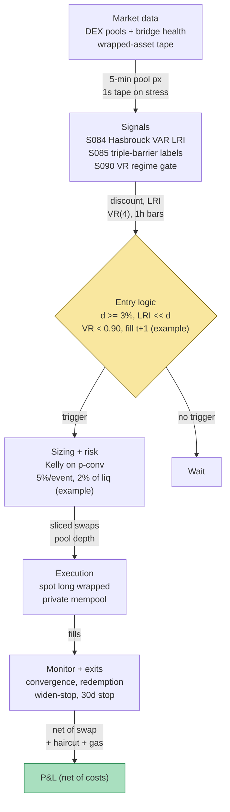

## Stage 160/200 — T060: Cross-Chain Bridge Flow Arbitrage

*Batch TB6 · Strategy 60/100 · Signals S090, S085, S084 · Provenance [D/SR]*

### T1. One-line verdict

| | |
|---|---|
| **Style** | Crypto relative-value / distressed — buys discounted wrapped (bridged) assets on a stressed chain and redeems or re-bridges them toward par |
| **Edge source** | Bridge stress breaks the wrapped asset's peg: when a bridge is exploited or paused, the wrapped token on the satellite chain trades at a discount to the native asset because redemption is uncertain. Uninformed panic flow (S084) overshoots; the discount converges if the bridge resumes — the arb buys the overshoot |
| **Typical holding period** | 1–30 days (hours if the bridge resumes fast; weeks if redemption is gated) |
| **Capacity hint** | Bounded by the discounted float and redemption throughput; bridge data are censored and lower-bound — reported volumes understate true flow. A ≤$1M book fits; size is the risk control |
| **Build-or-buy in one line** | Build the discount monitor and the flow-informativeness filter (public chain data); buy nothing except RPC access and a redemption path — no vendor sells stressed-bridge edge |

Provenance **[D/SR]**: bridge-exploit depegs are documented (Multichain, July 2023 — ~$130M drained, CoinDesk; the $280K→$1.9M Multichain-reopening trade, CoinTelegraph); the flow-informed entry rule, triple-barrier training labels, and regime gate are the chapter's practitioner reconstruction (SR). **Bridge data are censored/lower-bound — all reported_* metrics are labeled accordingly.**

### T2. Full mechanics

**Jargon first.** A **bridge** locks a native asset (e.g., USDC on Ethereum) and mints a **wrapped** representation (e.g., bridged USDC on Fantom) redeemable 1:1 while the bridge is healthy. A **depeg** is the wrapped token trading below (or above) the native asset's price. **Redemption** is burning the wrapped token to release the locked native asset. **TVL** (total value locked) is the assets held in the bridge contracts. **Censored/lower-bound data**: on-chain data only shows what happened on-chain — OTC deals, CEX (centralized-exchange) internal flows, and the attacker's own wallets are invisible, so every measured flow is a *lower bound* on true flow; the chapter labels such metrics `reported_*`.

**Universe & session.** Wrapped major assets (USDC, USDT, wBTC, wETH equivalents) on satellite chains, 24/7. Entry requires: (a) a *documented* bridge stress event (exploit announcement, paused bridge, abnormal outflows — never rumor alone); (b) a quoted discount ≥ 3% to native (*example*); (c) a *plausible redemption path* (bridge operator communicating, partial resumption, or an alternate bridge accepting the wrapped token). Exclusions: bridges whose backing is cryptographically unrecoverable (private keys confirmed compromised with no recovery plan — that discount is not an arb, it's a loss), and wrapped assets with no DEX liquidity to enter.

**Entry rule.** At stress detection *t* (the first credible public confirmation — operator tweet, analytics-firm alert — timestamped, never backfilled):
1. Measure the discount *d_t = 1 − P_wrapped/P_native* on the satellite chain's deepest DEX pool.
2. Run the S084 Hasbrouck VAR on the wrapped asset's recent trade tape: estimate the long-run impact (LRI) of trade innovations, *LRI = e_mᵀ(I − ΣA_ℓ)⁻¹e_q*. If the LRI is *small* relative to the discount (*example*: LRI < 20% of *d_t*), the flow is **uninformed** — panic, not information — and the discount is a candidate overshoot.
3. Check the S090 gate: VR(4) on 1h bars < 0.90 (*example*) → anti-persistent regime, discounts revert; VR > 1.15 (*example*) → persistent depeg, stand down.
4. **Enter** long the wrapped asset (spot, never levered — bridge risk is binary) at the next executable quote if all three pass. Causal timing: stress confirmed at *t*, VAR/VR on data ≤ *t*, fill at *t+1*.

**Exit rule.** The first of: (a) convergence — discount narrows to < 0.5% (*example*) → sell into strength or redeem; (b) redemption — bridge resumes → redeem at par minus the redemption haircut/fee; (c) stop-loss — discount *widens* by a further 50% of the entry discount (*example*: entered at 8% discount, stop at 12%) → the market knows something you don't; (d) time stop — 30 days (*example*); a bridge that hasn't resumed in a month is not resuming on your horizon.

**Position sizing.** Binary-risk sizing: size = min(Kelly-fraction on the S085-trained convergence probability, hard cap 5% of book per bridge event, *example*, and ≤ 2% of the wrapped token's *reported* DEX liquidity, *example* — your exit *is* the liquidity). Never add to a widening discount (no averaging down into a potential total loss).

**Risk limits.** Max 3 concurrent bridge events (*example*); max 15% of book in bridge-distress (*example*); daily loss stop −3% (*example*). Kill switch: operator confirms backing *unrecoverable* → liquidate at market — the thesis is dead, the discount is fair.

**Cost model.** DEX swap fee 0.3%/side (*example*), redemption haircut (*example*: 0.5%), bridge fee, gas on two chains, and slippage modeled as half-spread plus 1% price impact per 1% of pool depth consumed (*example*). All applied line-by-line in T4.

**Order/execution sketch.** Entries: split across the satellite chain's DEX pools, ≤ 10% of pool depth per transaction (*example*); redemptions: batch through the official bridge contract when it resumes, with an OTC-desk fallback if the UI stays down. Sandwich attacks (bots front-running your swap) are the crypto equivalent of queue games — use private mempools or small slices.

**Causality.** Stress timestamps are public confirmations, not rumors; the VAR and VR use data ≤ *t*; fills at *t+1*. The tradability subtlety: the *first* print of the discount is often unexecutable (pools drained) — the strategy only counts fills at *quoted, executable* depth.

### T3. Signals it consumes

| Signal | Role | Weight / logic |
|---|---|---|
| S084 — Hasbrouck trade–quote VAR | **Primary flow filter** | Estimate LRI on the wrapped asset's tape; enter only when LRI ≪ discount (*example*: LRI < 20% of *d_t*) — the discount is uninformed panic, not informed repricing. *x_t = c + ΣA_ℓx_{t−ℓ} + u_t*, *x_t = (Δm_t, q_t)ᵀ* |
| S085 — Triple-barrier labeling | **Training labels** | Historical bridge-stress events labeled by first touch: profit barrier = discount convergence (+2 vol units, *example*), stop = discount widening (−2 vol units, *example*), vertical = 30 days (*example*). Labels train the convergence-probability classifier — training only, never a live feature |
| S090 — Variance-ratio / Hurst regime toggle | **Regime gate** | VR(4) < 0.90 (*example*) → anti-persistent, discounts revert, arb armed; VR(4) > 1.15 (*example*) → persistent depeg, stand down. Conditions *whether* the book takes bridge risk |

```pseudocode
# T060 combination logic — evaluated on stress confirmation; fills at t+1
on stress_confirmed(event, t):                        # operator/analytics confirmation
    d = 1 - P_wrapped / P_native                      # reported_* discount (lower bound)
    if d < 0.03: return                               # example: too small to matter
    if not plausible_redemption_path(event): return   # no path -> not an arb
    lri = hasbrouck_LRI(tape_wrapped, p=10)           # S084: permanent impact
    if lri > 0.20 * d: return                         # example: informed flow -> skip
    if variance_ratio(returns_1h, k=4) > 1.15: return  # S090: persistent depeg (example)
    # S085 labels trained the convergence classifier offline (purged, embargoed)
    p_conv = convergence_model.predict(event_features)
    size = min(kelly(p_conv), 0.05*book, 0.02*reported_liq)  # example caps
    buy_wrapped(size, max_slice=0.10*pool_depth)      # spot only, no leverage
# exits: d < 0.005, redemption resumes, d widens 50%, or 30-day stop (all example)
```

### T4. Worked example — numbers + P&L (SYNTHETIC)

All numbers synthetic — fictitious chain "AltNet", bridge "BridgeX", wrapped stablecoin "wUSD" (native $1.00). Script `batches/TB6/plot_T060.py`, **seed 160**; the chart in T9 plots these exact trades. Cost schedule (*example*): DEX swap fee 0.3%/side, redemption haircut 0.5%, bridge fee $25, gas $40.

**Setup.** BridgeX pauses after abnormal outflows (*reported* outflow $18M — labeled `reported_outflow` because attacker wallets and CEX flows are invisible). wUSD falls to **$0.9120** (8.8% discount). S084 VAR on the wUSD tape: LRI ≈ 1.1¢ vs 8.8¢ discount (*example* outputs) → LRI < 20% of discount → uninformed panic. S090 VR(4) = 0.83 (< 0.90 gate, *example*) → anti-persistent. BridgeX operator announces a recovery plan → plausible redemption path. All gates pass.

**Trade T1 — buy the discount, redeem at par.** Buy 50,000 wUSD @ **$0.9120** (day 1): cost $45,600.00. Day 5: bridge resumes; redeem 50,000 wUSD → $50,000 × (1 − 0.005) = **$49,750.00** received.

| Line | Calc | $ |
|---|---|---|
| Buy cost | 50,000 × 0.9120 | −45,600.00 |
| Swap fee | 0.3% × 45,600 | −136.80 |
| Redemption received | 50,000 × 1.00 × 0.995 | +49,750.00 |
| Bridge fee + gas | 25 + 40 | −65.00 |
| **Net T1** | 49,750.00 − 45,736.80 − 65.00 | **+3,948.20** |

**Trade T2 — small add, stopped.** Day 2: buy 5,000 @ **$0.9050** ($4,525.00 + $13.58 fee). Day 3: discount widens; stop at **$0.8700** → $4,350.00 − $13.05 fee = $4,336.95.

| Line | Calc | $ |
|---|---|---|
| Net T2 | 4,336.95 − 4,538.58 | **−201.62** |

**Total net: +$3,948.20 − $201.62 = +$3,746.58.** T2 is the honest part of the example: the S090 gate read "reverting" and the discount widened anyway — regime labels are fallible, which is why the stop exists.

**Where the example is optimistic.** Redemption is assumed to resume in 5 days at a 0.5% haircut — the Multichain reality was a *permanent* halt with wrapped assets going to near-zero on some chains; this example's T1 is the good draw, not the typical one. The $0.9120 entry assumes executable depth at the quoted discount; in real stress the pool is drained and the first executable print is far worse. The S084 LRI read (1.1¢) is an *example* output — estimating a VAR on a gappy, halted tape is fragile, and "uninformed" flow can turn informed in one operator announcement. Bridge data are censored: `reported_*` flows understate true flows, so every capacity and liquidity input is a lower bound. One event cannot support any performance inference — it demonstrates the *gates-and-redemption mechanics*, not an edge.

### T5. Data & infra — what must run

**Pipeline inventory.** Continuous: discount monitor (DEX pool prices vs native price, per wrapped asset per chain — 5-minute cadence, *example*), bridge-health feed (operator announcements, pause events, TVL deltas), gas prices on both chains. Event-driven: on stress confirmation, pull the wrapped asset's full trade tape for the S084 VAR fit and the 1h-bar VR(4) read. Post-event: record the outcome for the S085 label set (converged / widened / time-barred). Storage: 5-min pool prices for ~50 wrapped assets are megabytes/month (per notes/cost-model.md §4); trade tapes are pulled on demand, not archived.

**M5 Max feasibility: feasible (Tier M).** Per notes/cost-model.md §2: the 5-min monitor is trivial; the on-demand S084 VAR fit is OLS on thousands of 1-second bars — seconds; the S085 label set is a small event table (dozens of historical bridge stresses) — the *constraint* is history, not compute: there are mercifully few labeled bridge-distress events. RAM: megabytes against the 77 GB budget (§3). Engineering: Tier M, 20–60 h ≈ **$3,000–9,000** loaded-cost estimate (§5) for monitor + VAR + execution; the real work is the redemption-path playbook per bridge (+20 h). *One-line verdict: feasible on the M5 Max (Tier M, ~40 h ≈ $6k eng + ~$30–200/mo data); bottleneck is event scarcity for training and redemption execution, not compute.*

**Feed-outage safe mode.** Discount feed drops: no new entries — you cannot verify the discount is executable; existing positions keep their stop-loss evaluated on the venue's own feed. Bridge-health feed drops: treat as *no new information* — do not assume resumption; the time stop becomes the primary exit. RPC failure on the satellite chain: positions are *unmanageable* — the kill switch flattens via any available path (CEX listing of the wrapped token, OTC) and blocks re-entry until RPC recovers. All transitions logged.

### T6. Buy vs build

| Option | What you get | Indicative price | Gains | Loses |
|---|---|---|---|---|
| Tier-0 free (public RPCs, DEX subgraphs, block explorers) | Prices, pool depths, bridge contract state | ~$0, *indicative — verify before budgeting* | The entire data plane is public | Manual stress detection; subgraph latency |
| DeFi analytics (DeFiLlama-style) | TVL, bridge flow dashboards | free–freemium, *indicative — verify before budgeting* | Fast stress spotting | `reported_*` lower bounds; not executable quotes |
| Private RPC (Alchemy/Infura-style) | Reliable submission on both chains | ~$0–50/mo per chain, *indicative — verify before budgeting* | Fewer stuck redemptions | Doesn't create edge |
| CEX listing of wrapped asset | Alternate exit path | trading fees only | Escape hatch if DEX pools drain | Listing may be suspended in stress |
| Build in-house (Python + polars) | Discount monitor, S084 VAR, S085 label set, S090 gate, execution | ~40–80 h ≈ $6,000–12,000 eng (loaded-cost estimate) | Your gates, your labels, auditable | You own the redemption playbook |

**Verdict: build the monitor and the gates; rent only RPC reliability.** No vendor sells the S084-informedness read on *your* wrapped asset's tape or the S085 label set built from *your* event history. **Buy** private RPC endpoints (~$0–50/mo per chain, indicative) — a stuck redemption transaction during a 2-hour resumption window is the most expensive failure in this strategy. The crossover: the strategy is only real once you've rehearsed a redemption end-to-end on a testnet or a minor event.

### T7. Success-ratio evidence

| Source | Market / period | Metric | Before/after cost | Caveat |
|---|---|---|---|---|
| CoinDesk (2023): Multichain exploit confirmed | July 2023, Fantom/Moonriver/Dogechain bridges | ~$130M drained (1,023 wBTC ≈ $30.9M, 7,214 wETH ≈ $13.6M, $57M USDC); Multichain halted, redemptions frozen | n/a — event description | Documents the *canonical* bridge-stress depeg: this is the environment the strategy trades — and most holders could not exit |
| CoinTelegraph (2023): Multichain reopening trade | Nov 2023 | One wallet turned $280K → $1.9M by buying discounted assets on Fantom via the briefly-reopened Multichain bridge and selling on Ethereum | Before-cost (single-wallet on-chain measurement) | A one-off exploiting a *reopening*, not a repeatable strategy; community suspected insider timing — the "edge" may have been information, not analysis |
| Practitioner pattern (2022–24 incidents: Wormhole, Ronin, Nomad, Multichain) | Multiple | Wrapped-asset discounts of 5–50%+ during stress; convergence only when redemption resumes; permanent impairment when backing is unrecoverable | Before-cost | No systematic after-cost study of buying bridge-stress discounts exists — the evidence is event anecdotes, which is why the S085 label set is small |

Capacity and decay: capacity is bounded by the discounted float — and by the uncomfortable fact that the biggest discounts coincide with the *least* plausible redemption paths. The documented decay channel is *speed*: as monitoring dashboards commoditized (2023→2026), the easy discounts are arbitraged in minutes; what remains is long-tail distressed stuff — weeks-long halts with binary outcomes. Bridge data are censored: every `reported_*` volume understates true flow, so backtested capacity is overstated by construction.

**Honest bottom line.** For a ≤$1M paper operation: this is a *distressed* trade wearing an arbitrage costume — the documented examples show both the $280K→$1.9M reopening win and the Multichain holders who never got out. Paper-trade it as a discount-monitoring harness; expect most real events to fail the "plausible redemption path" filter, which is the filter doing its job. Size for the halt scenario, not the resumption scenario. For an institutional desk: bridge-distress is a real relative-value niche, but the edge is legal/operational (recovery analysis, claims processes), not the S084 read — a quant signal doesn't tell you whether the keys are gone. **Bridge data are censored/lower-bound — all `reported_*` metrics understate true flow.**

### T8. Failure modes & pitfalls

1. **Backing unrecoverable** — keys compromised, no recovery; the discount is fair and goes to zero. *Mitigation:* the kill switch — liquidate on confirmed unrecoverability; never average down; the "plausible redemption path" filter is the primary defense.
2. **Redemption never resumes** — indefinite halt; capital trapped for the 30-day stop and beyond. *Mitigation:* the time stop is a *thesis* stop, not just risk — a month with no resumption means the base case was wrong; alternate exits (CEX, OTC) pre-mapped.
3. **Informed flow misread as panic** — the S084 LRI is estimated on a gappy tape; the "uninformed" discount was actually insiders selling. *Mitigation:* the widening-discount stop (50% beyond entry, *example*); treat the first 24h of tape as unreliable for VAR estimation.
4. **Pool drained at entry** — the quoted discount isn't executable; your market order walks the book 15% worse. *Mitigation:* max 10% of pool depth per slice (*example*); simulate the swap against live depth before committing; count only executable-depth fills.
5. **CEX suspends the wrapped asset** — your escape hatch closes mid-trade. *Mitigation:* pre-map two exit paths (DEX + redemption); never size assuming the CEX path.
6. **Regime-gate failure** — VR reads anti-persistent; the depeg deepens persistently anyway (T2 in the example). *Mitigation:* the stop-loss, not the gate, is the risk control — gates are filters, stops are protection.
7. **S085 label scarcity** — dozens of historical events, not thousands; the convergence classifier overfits. *Mitigation:* keep the model simple (logistic on 3–5 features, *example*); report purged/embargoed estimates with wide intervals; let the hard filters (redemption path, LRI) carry the decision.
8. **Sandwich/MEV extraction on entry** — visible DEX swaps get front-run. *Mitigation:* slice orders, private mempools, or CEX execution where listed.

### T9. Visuals


The chart plots the T4 tape exactly: buy 50,000 wUSD @ $0.9120 (day 1), redeem day 5 at par minus 0.5% haircut for **+$3,948.20** net; buy 5,000 @ $0.9050 (day 2), stopped @ $0.8700 (day 3) for **−$201.62** net; cumulative **+$3,746.58**. Watermark reads "SYNTHETIC EXAMPLE" exactly; corner caption reads "synthetic data — not market data".



### T10. Sources

- CoinDesk (2023). "Multichain Bridges Exploited for Nearly $130M Across Fantom, Moonriver and Dogechain." https://www.coindesk.com/business/2023/07/06/multichain-bridges-experience-unannounced-outflows-of-over-130m-in-crypto — ~$130M drained; bridge halted, redemptions frozen. (Verifies the T7 canonical depeg event.)
- CoinDesk (2023). "Exploit of Fantom, Moonriver and Dogechain Crypto Bridges Confirmed by Multichain Team." https://www.coindesk.com/tech/2023/07/07/multichain-team-confirms-exploit-across-fantom-moonriver-and-dogechain-bridges — operator confirmation, service suspension, revoke-approvals guidance. (Verifies the stress-confirmation mechanics in T2.)
- CoinTelegraph (2023). "Trader exploits Multichain opening to turn $280K to $1.9M; community suspects insider job." https://cointelegraph.com/news/trader-exploits-multichain-opening-to-turn-280k-to-1-9m-community-suspects-insider-job — the documented reopening-arb win and the insider-timing suspicion. (Verifies the T7 anecdote and its caveat.)
- Hasbrouck, J. (1991). "Measuring the Information Content of Stock Trades." *Journal of Finance* 46(1), 179–207 — the VAR(p) *x_t = c + ΣA_ℓx_{t−ℓ} + u_t* and LRI *= e_mᵀ(I − ΣA_ℓ)⁻¹e_q* behind the S084 flow filter (per S084; formulas verified in the S084 chapter).
- López de Prado, M. (2018). *Advances in Financial Machine Learning*. Wiley, ch. 3 — triple-barrier labeling (profit/stop/vertical, first-touch) behind the S085 training labels (per S085).

**Unverified leads** (chatbot-provided without an independent checkable source — do not treat as evidence):
- *Unverified chatbot claim* (Grok, 2026-09-10, Q-TB6-1): the trade–quote VAR sizing walk and "precision-as-win-probability" calibration for DeepLOB-style triggers — not used here; the S084 layer uses only the documented LRI construction.
- *Unverified chatbot claim* (Grok, 2026-09-10, Q-TB6-3): news-drift half-lives and sub-second macro-race figures — concern sibling strategies, not bridge flow; not used.
- Per-bridge *recovery probabilities* and *redemption timelines* circulate in practitioner channels — no checkable study is cited here; the chapter's "plausible redemption path" filter is deliberately qualitative.

*Source log: Grok answered Q-TB6-1..3 (2026-09-10); all claims independently verified or labeled unverified.*
