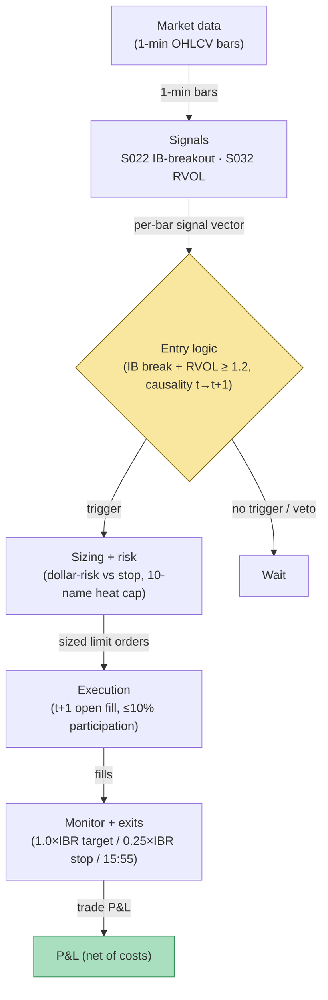

## Stage 161/200 — T061: Initial-Balance Expansion Trader

*Batch TB7 · Strategy 61/100 · Signals S022, S032 · Provenance [D/SR]*

### T1. One-line verdict

| | |
|---|---|
| **Style** | Intraday breakout: first-hour range expansion (Market Profile "initial balance" taxonomy) |
| **Edge source** | Directional commitment after a narrow first-hour auction resolves, confirmed by relative volume (S032); the breakout leg, not the range itself, is the candidate edge |
| **Typical holding period** | 30 minutes to 5 hours; flat 15:55 ET |
| **Capacity hint** | Small: one trade per name per day, 500-name universe, dollar-risk sizing; realistic small-book capacity in the low millions before slippage on the t+1 fill dominates |
| **Build-or-buy in one line** | Build the IB-freeze and narrow/wide classifier on bought 1-min bars; nothing packaged sells this rule with honest causality, so buy the data, not the "system" |

### T2. Full mechanics

**Universe & session.** Liquid US common stocks, ADV ≥ 2M shares (`example`), price ≥ $10, spread ≤ 3¢ median (`example`). RTH only, 09:30–15:55 ET. Exclusions: earnings-day names, halted/resumed names, and half-day sessions when a 1R target cannot complete before the early flatten (`example`: skip if expected session length after 10:30 < 2.5 hours). One trade per name per day (`example`) — the rule is a single auction-resolution bet, not a scalp engine.

**Initial-balance definition.** An **initial balance (IB)** is the first hour's auction range, borrowed from Steidlmayer's Market Profile taxonomy: the high and low printed between 09:30:00 and 10:29:59.999 ET. Define `IBH_d = max high`, `IBL_d = min low`, `IBR_d = IBH_d − IBL_d` over that window. Freeze both levels at 10:30 ET sharp; never update them intraday. **Narrow vs wide IB:** compare today's `IBR_d` to the 10-day median of `IBR` (`example`); *narrow* if `IBR_d < 0.75 × median` (`example`). Expansion trades are taken only on narrow IBs, on the logic that a compressed first-hour auction that then resolves directionally is the day-type this rule was reconstructed to catch.

**Entry rule.** After 10:30 ET, on 5-minute bars. Long: bar *t* closes above `IBH_d` **and** that bar's volume ≥ 1.2× its clock-slot 20-day median (`example`) — the relative-volume (S032) confirmation — **and** today's IB was classified narrow. Short: mirror below `IBL_d`. Signal at bar *t* → earliest fill at the open of bar *t+1* (`example`: fill = next-bar open). No fade-back-inside entries; no second entry after the first trade in the name.

**Exit rule.** Four exits, first touch wins (`example` parameters): (1) stop at the opposite IB edge, or tighter at 0.25×IBR back inside the broken edge (the worked example uses the tighter stop); (2) target at 1.0×IBR beyond the broken edge — the classic "normal variation" projection of a full IB-range extension; (3) time stop: flatten at 15:55 ET (12:55 on half days); (4) failure exit: a close back inside the IB after entry exits at the next open.

**Position sizing.** Dollar-risk sizing: `N = ⌊ R / |P_entry − P_stop| ⌋` with `R = $200` (`example`) per trade. Max per-name heat: 1R. Portfolio heat: cap concurrent expansion trades at 10 names (`example`) — first-hour breakouts cluster on trend days, and the book must survive the correlated-loss case.

**Risk limits.** Daily loss stop at −3R (`example`); kill-switch conditions: data feed stale > 60 seconds, any bar timestamped outside America/New_York, or a half-day calendar mismatch — all halt new entries and flatten at market on the next bar.

**Cost model.** Commission $0.005/share/side (`example`). Spread: pay the half-spread each way on continuous fills (`example`: 2¢-wide book → 1¢/side). Slippage function on the t+1 open fill: +0.5× spread adverse (`example`), applied explicitly in the worked example. No auction legs in this strategy — fills are continuous-session only.

**Order/execution sketch.** Marketable limit orders at the t+1 open (`example`: limit = open print + 2¢ for buys) so the fill price is bounded; participation cap ≤ 10% of the bar's volume (`example`); queue-position honesty note: the strategy is modeled as a taker — no queue-priority fantasy on the breakout bar, where the book is thinnest.

### T3. Signals it consumes

| Signal | Role | Weight / logic |
|---|---|---|
| S022 (initial-balance breakout detector) | Primary trigger | `break_up_t = close_t > IBH_d`; `break_dn_t = close_t < IBL_d`; levels frozen at 10:30, causal (only bars ≤ *t*) |
| S032 (relative volume) | Filter | `rvol_t = vol_t / median_slot20_t`; require `rvol_t ≥ 1.2` on the breakout bar (`example`) |
| Trailing stop / target / time-stop logic (strategy rule, not a signal) | Exit manager | Implements the opposite-edge / 0.25×IBR stop and the 1.0×IBR target; also enforces the 15:55 time stop and the close-back-inside failure exit |

Combination logic (pseudocode, 21 lines):

```
# runs on each 5-min bar close t, after 10:30 ET; levels frozen
IBH, IBL, IBR = freeze_at_1030(today)          # S022
narrow = IBR < 0.75 * median(IBR, 10d)         # example threshold
rvol = volume[t] / median_slot(volume, 20d)    # S032
if traded_today or not narrow: wait
if close[t] > IBH and rvol >= 1.2:              # S022 + S032
    side = LONG; ref = IBH
elif close[t] < IBL and rvol >= 1.2:
    side = SHORT; ref = IBL
else: wait
# signal at t -> earliest fill at open of t+1
entry = open[t+1] (+ taker slippage)
stop  = ref -/+ 0.25 * IBR                     # example stop rule
target = ref +/- 1.0 * IBR                     # example
N = floor(200 / abs(entry - stop))             # example R
flatten_at(15:55 ET) or on close_back_inside
```

### T4. Worked example — numbers + P&L (SYNTHETIC)

Synthetic 5-minute bars, equity XYZ, seed 161. IB window prints (high/low): 09:30 50.20/49.95; 09:35 50.28/50.02; 10:25 50.35/50.10. Freezing at 10:30: **IBH = 50.40, IBL = 49.90, IBR = 0.50**. The 10-day median IBR is 0.80, so `0.50 < 0.75 × 0.80 = 0.60` → narrow IB (`example` classifier). The 10:40–10:45 bar closes at **50.46** on 1.4× slot RVOL (≥ 1.2, confirmed). Signal at *t* = 10:45 close → earliest fill at the 10:45 bar's successor open: fill long at **50.48** (pay the ask; 0.5× spread slippage embedded). Tight stop = `50.40 − 0.25 × 0.50` = **50.275**. Risk/share = `50.48 − 50.275` = 0.205. `N = ⌊200 / 0.205⌋` = **975 shares**. Target = `50.40 + 0.50` = 50.90; the extension carries and the exit fills at **50.89**.

Ledger:

| Leg | Price | Shares | Amount |
|---|---|---|---|
| Buy (t+1 open) | 50.48 | 975 | −49,218.00 |
| Sell (target) | 50.89 | 975 | +49,617.75 |
| Gross | | | **+399.75** |
| Commission (975 × $0.01 round-trip) | | | −9.75 |
| **Net** | | | **+$390.00** |

Failure path (for the honest ledger): if the breakout fails and the stop fills at 50.27: gross = `975 × (50.27 − 50.48)` = −204.75, commission −9.75, net **−$214.50** — roughly −1.07R. The example is a single winning trade on a narrow-IB trend day; it is not a backtest.

**Where the example is optimistic.** Fills are assumed at the printed t+1 open with only a half-spread penalty — no partial fills, no queue slippage on the breakout bar (the worst bar to be a taker), no latency between the 10:45 close signal and the fill, and the target fill at 50.89 assumes the extension prints through cleanly. Real first-hour breakouts frequently wick the level and reverse; the stop at 50.275 would often fill worse on a fast tape. The RVOL 1.4× confirmation is measured on the same bar that triggers, which in live trading requires the bar to be complete before the signal exists — honored here (signal at *t* → fill *t+1*), but a common implementation bug is to peek at the in-progress bar.

### T5. Data & infra — what must run

Pipeline for a 500-name universe: (1) pre-open job (08:30 ET): load the 10-day IBR history, today's calendar (full vs half day), and the 20-day slot-volume medians; (2) intraday loop on 1-minute or 5-minute bars: maintain running IBH/IBL until 10:30, freeze, then evaluate S022/S032 per bar; (3) post-close: ledger reconciliation and the next day's median recomputation. Feeds: SIP-grade 1-minute OHLCV is sufficient — IB needs only highs/lows, RVOL needs bar volume. Storage: 500 symbols × 390 one-minute bars ≈ 195,000 bars/day is trivial locally; 60 days of one-minute bars for 500 symbols is ~3GB on disk with a trivial RAM footprint (per the project cost model). Keep the working set below ~77GB; Polars-class simple operations run at a planning assumption of ~10–50M rows/sec, so the entire IB/RVOL feature pass is a seconds-scale batch. Strategy-harness build effort for this tier is estimated at 40–100 hours ($6,000–$15,000 loaded at $150/hour) — the IB logic itself is an afternoon; the hours are calendar handling, corporate-action adjustment of the 10-day medians, and the replay harness with no look-ahead on the 10:30 freeze. **M5 Max feasibility verdict: yes, trivially** — peak intraday state is a few hundred MB; this runs on any modern laptop. Failure plan: if the bar feed drops mid-session, enter safe mode — no new entries, existing positions keep their stops, and everything flattens at 15:55 ET on the last known prices; never infer a breakout from a gap-filled bar.

### T6. Buy vs build

Retail platform: **QuantConnect** (paper/live research hosting, ~$60–$300/mo class, `indicative — verify before budgeting`) can host this — it accepts custom bar features and a 10:30 freeze is expressible. **Interactive Brokers paper trading** (no incremental platform fee on an existing account, `indicative — verify before budgeting`) is the cheapest routing test for the t+1 open fills. Professional data/venue: **Massive (formerly Polygon) Stocks Advanced** (~$199/mo, `indicative — verify before budgeting`) supplies SIP real-time plus 1-minute/second aggregates adequate for IB and RVOL; for history, Massive flat files or **Databento** usage-based history cover 2 years of 1-minute bars for tens to low hundreds of dollars (`indicative — verify before budgeting`). Verdict: **build the strategy, buy the bars.** The IB freeze, narrow/wide classifier, and dollar-risk sizing are ~100 lines plus a calendar file; no packaged "opening-range system" can be audited for t→t+1 causality, and several retail bots compute the range on in-progress bars. Crossover: if you ever add the auction-pin leg (T070), the data decision changes — that needs the imbalance feed, not just bars.

### T7. Success-ratio evidence

| Source | What it documents | Relevance / caveat |
|---|---|---|
| Zarattini, Barbon & Aziz, "A Profitable Day Trading Strategy For The U.S. Equity Market" (SSRN 4729284) | Stocks-in-Play opening-range breakout study, >7,000 US stocks, 2016–2023 | Nearest tested cousin of IB expansion; costs are commission-only ($0.0035/share), not spread+impact — the precise Sharpe/IRR/hit-rate figures circulating are per a third-party reading, commission-only (see Unverified leads) |
| Zarattini & Aziz, "Can Day Trading Really Be Profitable?" (SSRN 4416622) | QQQ 5-minute ORB, 2016–2023 | Same family, single-name; net of commissions, not necessarily spread/impact |
| Gao, Han, Li & Zhou, "Intraday Momentum: The First Half-Hour Return Predicts the Last Half-Hour Return" (SSRN 2552752) | S&P 500 ETF 1993–2013; first-half-hour return predicts last-half-hour return, stronger on volatile/high-volume/macro-news days | Supports the "first hour matters directionally" premise; it is an intraday-momentum fact, not an IB-breakout trading rule |
| Heston, Korajczyk & Sadka, "Intraday Patterns in the Cross-Section of Stock Returns" (JF 2010) | Short-term reversal tied to temporary liquidity imbalances and bid-ask bounce; direct trading loses after spread | The cautionary counterweight: microstructure edges decay fast and spreads eat naive implementations |
| Crabel, T., *Day Trading With Short Term Price Patterns and Opening Range Breakout* (Traders Press, 1990; ISBN 9780934380171) | Practitioner origin of opening-range breakout mechanics; computer-tested pattern catalog | Historical/practitioner record, not a peer-reviewed P&L study; the IB taxonomy itself (Steidlmayer/Dalton) is a day-type classification, not an alpha paper |

Capacity/crowding/decay: opening-range breakout is one of the most published intraday patterns in existence; any edge concentrates in the RVOL-confirmed, narrow-IB, trend-day subset, and 5-minute ranges are broken both ways on most days. Honest bottom line: for a ≤$1M paper operation, this is a reasonable first strategy to *implement* because its costs are honest and its logic is falsifiable — expect the unfiltered rule to be weak-to-negative after spread, and only the filtered subset to have a chance. For an institutional desk, the capacity is a rounding error; the desk would trade the underlying auction dynamics, not this rule.

### T8. Failure modes

- **Regime: wide-IB/range day.** The first hour already printed the day's range; expansion entries become failed auctions and stop out repeatedly. *Mitigation:* the narrow-IB classifier is a veto, not a suggestion — skip wide days entirely; track IB-width regime hit-rate weekly and widen the skip threshold if the filtered set degrades.
- **Crowding: the 10:30 level is public.** Everyone sees 50.40; stop runs and fakeouts cluster at round IB edges. *Mitigation:* require the RVOL confirmation (S032) rather than the level touch alone; consider the 0.25×IBR confirmation variant (enter only after a second bar holds outside).
- **Latency: SIP vs direct.** On a fast tape the t+1 open fill can be several cents worse than the printed open. *Mitigation:* model taker slippage explicitly (done in T4's cost model) and paper-trade with a 1-bar delay variant to measure sensitivity.
- **Costs: spread optimism.** A 2¢ spread assumption fails on names where the breakout bar widens the book to 5–10¢. *Mitigation:* spread filter — skip entries when the prevailing spread exceeds 3¢ (`example`).
- **Overfit: the 0.75× median / 1.2× RVOL / 0.25× IBR constants.** All marked `example`; they are round numbers, not estimated optima. *Mitigation:* walk-forward re-estimation with an embargo; freeze parameters quarterly, not daily.
- **Operations: DST/half-day calendar.** A mis-cut IB window or a missed early flatten is the classic way this strategy blows up on the day after Thanksgiving. *Mitigation:* single exchange-calendar file (America/New_York), tested against the half-day list before every early close; kill-switch on calendar mismatch.

### T9. Visuals


*Chart caption: synthetic data — not market data. Watermark reads "SYNTHETIC EXAMPLE" exactly.*



### T10. Sources

1. Zarattini, C., Barbon, A. & Aziz, A. "A Profitable Day Trading Strategy For The U.S. Equity Market." SSRN. https://papers.ssrn.com/sol3/papers.cfm?abstract_id=4729284 — Stocks-in-Play ORB on >7,000 US stocks, 2016–2023; costs commission-only. Title/authors verified 2026-09-10.
2. Zarattini, C. & Aziz, A. "Can Day Trading Really Be Profitable?" SSRN. https://papers.ssrn.com/sol3/papers.cfm?abstract_id=4416622 — QQQ 5-minute ORB, 2016–2023, net of commissions. Title/authors verified 2026-09-10.
3. Gao, L., Han, Y., Li, S.Z. & Zhou, G. "Intraday Momentum: The First Half-Hour Return Predicts the Last Half-Hour Return." SSRN. https://papers.ssrn.com/sol3/papers.cfm?abstract_id=2552752 — S&P 500 ETF 1993–2013; effect stronger on volatile, high-volume, recession, and macro-news days. Title verified 2026-09-10.
4. Heston, S.L., Korajczyk, R.A. & Sadka, R. "Intraday Patterns in the Cross-Section of Stock Returns." *Journal of Finance* 65(4), 1369–1407 (2010). https://www.kellogg.northwestern.edu/faculty/korajczy/htm/HestonKorajczykSadkaJF2010.htm — short-term reversal linked to temporary liquidity imbalances and bid-ask bounce; direct trading loses after spread. Title verified 2026-09-10.
5. Crabel, T. *Day Trading With Short Term Price Patterns and Opening Range Breakout.* Traders Press, 1990. ISBN 9780934380171. https://www.thriftbooks.com/w/day-trading-with-short-term-price-patterns-and-opening-range-breakout_toby-crabel/261589/ — bibliographic record confirms author, publisher, year, ISBN. Verified 2026-09-10.

**Unverified leads** (not confirmed facts — verify before use):
- Steidlmayer (Market Profile, CBOT 1985) and Dalton, Jones & Dalton, *Mind Over Markets* (1990) — named by Grok as the IB/day-type taxonomy sources; specific editions not verified in this pass.
- Grok Q-TB7-3 performance figures: unfiltered 5-min ORB Sharpe 0.48 / +3.2% IRR / 41% hit; RVOL top-20 Sharpe 2.81 / +41.6% IRR / ~48% hit (commission-only); QQQ 5-min ORB Sharpe ~1.12 net of commission with replication "net dies at ~2.2¢/share slippage"; NQ 7-year ORB practitioner test (tiny-target ≈ coin flip, "break and hold to EOD/2R" PF ~1.1, t ≈ 1.7–2.1); ES/NQ first hour ≈ 25–28% of RTH volume and ~55–63% of day's range; 30-min OR "continues" to close ~65–67% of days — all Grok-sourced, treat as research leads.
- 2026 NYSE holiday/half-day calendar specifics (e.g., half days 27 Nov and 24 Dec 2026, full close 3 Jul 2026) per Grok Q-TB7-1 — verify against the exchange's published calendar before trading.

*Source log: Grok answered Q-TB7-1..3 (2026-09-10); all claims independently verified or labeled unverified.*
