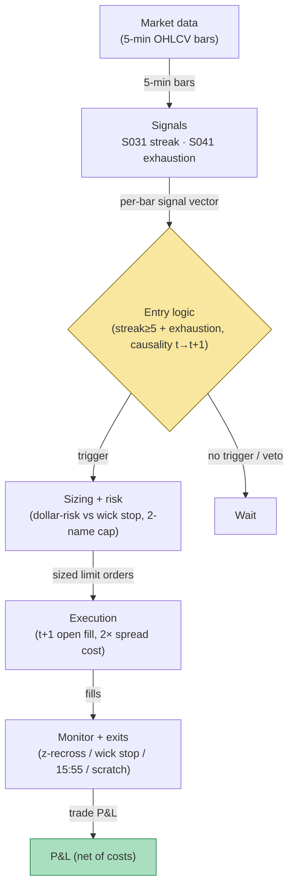

## Stage 162/200 — T062: Streak Runner with Exhaustion Flip

*Batch TB7 · Strategy 62/100 · Signals S031, S041 · Provenance [D/SR]*

### T1. One-line verdict

| | |
|---|---|
| **Style** | Intraday momentum-then-reversal: ride a consecutive-bar streak, flip at the exhaustion print |
| **Edge source** | Short-horizon continuation (S031) that terminates in a capitulation bar (S041); the flip harvests the inventory-driven snap-back documented in reversal literature |
| **Typical holding period** | 15 minutes to 2 hours per leg; flat 15:55 ET |
| **Capacity hint** | Modest: 2–4 names per day with qualifying streaks in a 500-name universe; sizing is dollar-risked so capacity is bounded by fill quality at the exhaustion bar |
| **Build-or-buy in one line** | Build — a streak counter plus an exhaustion z-score on bought 5-minute bars; no vendor sells the flip logic with honest t→t+1 timing |

### T2. Full mechanics

**Universe & session.** Same liquid large-cap/ETF universe as T061 (ADV ≥ 2M shares, price ≥ $10, `example`). RTH 09:45–15:55 ET — the first 15 minutes are excluded because the opening auction produces mechanical streaks that are not order-flow runs. Exclusions: earnings days, halts, FOMC 14:00 days after 13:30 (`example`; scheduled-volatility days break the streak/exhaustion pattern — see T068).

**Streak definition.** A **streak** is *n* consecutive same-direction 5-minute closes: `streak_t = streak_{t-1} + 1` if `sign(close_t − close_{t-1})` matches, else reset to 1. The strategy arms when `n ≥ 5` (`example`) **and** the cumulative run from streak start is ≥ 1.0× the 14-bar 5-minute ATR (Average True Range — the trailing 14-bar mean of per-bar ranges, a volatility ruler in price units) (`example`) — this rejects trivial drift. While the streak extends, the "runner" leg is conceptually long the run; in this implementation the runner leg is not traded separately — the strategy waits for the exhaustion print and trades only the flip (keeps the rule to one position per event and avoids paying spread twice).

**Exhaustion signature.** An **exhaustion bar** (S041) at bar *t* requires: (1) bar range > 2.0× the 20-bar median range (`example`); (2) bar volume ≥ 2.0× the slot median (`example`); (3) the bar closes in the *top* (for an up-streak) third of its range — the capitulation wick. A **parabolic exhaustion** additionally requires the last-3-bar slope to exceed 2× the streak's average slope (`example`) — the run is accelerating into the top.

**Entry rule.** At bar *t*: streak ≥ 5, cumulative run ≥ 1.0× ATR, and exhaustion signature prints. Flip direction: short after an up-streak exhaustion, long after a down-streak exhaustion. Signal at *t* → fill at the open of *t+1*. One flip per name per day (`example`).

**Exit rule.** (`example` parameters): (1) signal-flip exit — the mean-reversion z-score crosses back through ±0.5 toward zero; (2) stop at the exhaustion bar's extreme + 0.3× ATR (beyond the wick — a genuine new high/low invalidates the fade); (3) time stop 15:55 ET; (4) scratch: if adverse excursion exceeds 1.0R without the thesis breaking, exit at next open (prevents slow bleed).

**Position sizing.** `N = ⌊ R / |P_entry − P_stop| ⌋`, `R = $200` (`example`). Max 2 concurrent flips (`example`) — exhaustion events cluster at session extremes.

**Risk limits.** Daily loss stop −3R (`example`); no new flips after 15:30 ET (`example` — the last 25 minutes belong to the auction book, T070's territory); kill-switch on stale bars > 60 s.

**Cost model.** Commission $0.005/share/side (`example`); half-spread paid each way on continuous fills; the exhaustion bar is the widest-spread bar of the run — the cost model assumes a 2× normal spread on the t+1 fill (`example`), which is where this strategy's backtests most often lie to their authors.

**Order/execution sketch.** Marketable limit into the t+1 open (`example`); participation ≤ 10% of bar volume (`example`); the fill is modeled as a taker paying the post-exhaustion spread — never as a mid-price fill.

### T3. Signals it consumes

| Signal | Role | Weight / logic |
|---|---|---|
| S031 (consecutive-run momentum) | Arming condition | `n ≥ 5` consecutive same-sign closes and cumulative run ≥ 1.0× ATR(`14`) (`example`) |
| S041 (parabolic exhaustion) | Primary trigger | Range > 2.0× median range(20), volume ≥ 2.0× slot median, close in extreme third of range, optional 3-bar slope acceleration (`example`) |
| Mean-reversion z-score exit logic (strategy rule, not a signal) | Exit manager | z = (close − MA20)/σ20; exit when \|z\| recrosses 0.5 toward zero; also computes the wick+0.3×ATR stop (`example`) |

Combination logic (pseudocode, 22 lines):

```
# each 5-min bar close t, 09:45-15:30 ET
n, run = update_streak(close[t], close[t-1])     # S031
atr = ATR(close, 14)
if n >= 5 and run >= 1.0 * atr:                  # example; armed
    rng20 = median(range, 20); vol20 = slot_median(volume, 20)
    wick_up = close[t] > high[t] - range[t]/3
    if range[t] > 2.0*rng20 and volume[t] >= 2.0*vol20 and wick_up:
        side = SHORT                             # flip the up-streak
        # signal at t -> fill at open[t+1]
        entry = open[t+1] (taker, 2x spread cost) # example
        stop  = high[t] + 0.3 * atr               # example stop rule
        N = floor(200 / abs(entry - stop))
        z_exit = 0.5                             # recross toward 0
        flatten_at(15:55 ET); scratch if MAE > 1R
    # mirror for down-streaks
else: wait
```

### T4. Worked example — numbers + P&L (SYNTHETIC)

Synthetic 5-minute bars, equity DEF, seed 162. Morning: five consecutive up closes 09:45→10:10, cumulative run +0.95 vs 14-bar ATR 0.80 (≥ 1.0× ATR — armed, `example`). The 10:10–10:15 bar prints the exhaustion signature: range 0.55 vs 20-bar median 0.24 (2.3×), volume 2.4× slot median, close in the top third — parabolic (last-3-bar slope 2.1× streak average). Signal at *t* = 10:15 close → fill short at the 10:20 open: **62.30** (taker, 2× spread cost embedded).

- **Trade 1 (loser — the run extends).** Short 454 @ 62.30. Stop = exhaustion-bar high 62.50 + 0.3×0.80 = **62.74**; risk/share = 0.44; `N = ⌊200/0.44⌋` = **454**. The extension bar stops the position at 10:25: **62.74**. Gross = `454 × (62.30 − 62.74)` = −199.76. Commission = 454 × 0.01 = −4.54. Net = **−204.30**.

Afternoon: six consecutive down closes 13:30→14:00, cumulative run −1.10 vs ATR 0.85 (armed); 14:00–14:05 exhaustion bar: range 2.2× median, volume 2.1×, close in bottom third. Signal → fill long at 14:10 open: **61.10**. Stop = 60.72 − 0.3×0.85 = **60.465**→ 60.47; risk/share = 0.63; N = ⌊200/0.63⌋ = 317. z-score exit: z recrosses +0.5→ the 15:20 bar closes 61.68; fill next open **61.66**. Gross = `317 × (61.66 − 61.10)` = +177.52. Commission = 317 × 0.01 = −3.17. Net = **+174.35**.

Session ledger:

| Trade | Side | Entry | Exit | Shares | Gross | Comm. | Net |
|---|---|---|---|---|---|---|---|
| 1 | Short | 62.30 | 62.74 | 454 | −199.76 | −4.54 | −204.30 |
| 2 | Long | 61.10 | 61.66 | 317 | +177.52 | −3.17 | +174.35 |
| **Session** | | | | | | | **−$29.95** |

A deliberately losing day: the morning exhaustion was premature — the run extended and the stop did its job; the afternoon flip worked but not enough to cover. That asymmetry (exhaustion fades fail more often than they work, winners must be larger) is the strategy's documented character, not a flaw in the example.

**Where the example is optimistic.** The exhaustion bar is identified on the *closed* bar — in practice the volume condition is only known after the close, which this respects (signal at *t* → fill *t+1*), but the 2× spread cost on the t+1 fill is a guess; on real capitulation bars the spread can be 3–5× normal and the open can gap through the wick. The stop at the exhaustion extreme assumes a fill at 62.74; a fast extension gaps over stops. One flip per name per day is enforced; without it, traders re-fade the same run repeatedly and the −204.30 becomes a −600 day.

### T5. Data & infra — what must run

Same bar pipeline as T061 with two additions: the streak counter (O(1) per bar) and the 20-bar median range/volume baselines plus the z-score series. All computable from 1-minute or 5-minute OHLCV — no tick data required. Footprint: 500 symbols × 390 one-minute bars ≈ 195,000 bars/day, trivial; 60 days ≈ 3GB on disk (project cost model), working set far below the ~77GB budget; Polars-class throughput (~10–50M rows/sec planning assumption) makes the feature pass seconds-scale. Harness build: Tier M+ band, 40–100 hours ($6,000–$15,000 loaded at $150/hour) — the streak/exhaustion logic is simple; the hours go to the no-look-ahead replay (the exhaustion volume must be bar-complete) and the z-score exit calibration. **M5 Max feasibility verdict: yes** — intraday state under 1GB. Failure plan: stale feed → no new flips; existing flips keep wick stops; flatten 15:55 ET.

### T6. Buy vs build

Retail: **QuantConnect** (~$60–$300/mo class, `indicative — verify before budgeting`) hosts the streak/exhaustion logic; **IBKR paper** (no incremental platform fee on an existing account, `indicative — verify before budgeting`) for fill realism. Professional data: **Massive Stocks Advanced** (~$199/mo, `indicative — verify before budgeting`) 1-minute/second bars are adequate — this strategy does not need tick-level exhaustion detection to be testable. Verdict: **build on bought bars.** The exhaustion signature is three ratios; paying for a "reversal indicator" product buys you someone else's overfit constants. Crossover: if you move exhaustion detection to tick/event granularity, revisit — then you need a real-time trades feed and the build cost roughly doubles.

### T7. Success-ratio evidence

| Source | What it documents | Relevance / caveat |
|---|---|---|
| Heston, Korajczyk & Sadka, "Intraday Patterns in the Cross-Section of Stock Returns" (JF 2010) https://www.kellogg.northwestern.edu/faculty/korajczy/htm/HestonKorajczykSadkaJF2010.htm | Short-term reversal tied to temporary liquidity imbalances; same-interval seasonality | The flip leg's academic home: reversals after liquidity-driven moves are real, but direct trading loses after spread — the exhaustion filter is an attempt to trade only the liquidated tail |
| Lehmann, B. "Fads, Martingales, and Market Efficiency" (*QJE* 1990) https://econpapers.repec.org/RePEc:oup:qjecon:v:105:y:1990:i:1:p:1-28. | Weekly reversal evidence | Broader reversal background; weekly, not intraday — direction only, not a parameter source |
| Jegadeesh, N. "Evidence of Predictable Behavior of Security Returns" (JF 1990) https://doi.org/10.1111/j.1540-6261.1990.tb05110.x | Monthly return predictability incl. short-term reversal components | Useful only as reversal literature context; the packaged "run then flip" rule is a reconstruction `[D/SR]` |

Capacity/crowding/decay: streak-fading is folk knowledge; the exhaustion filter (2× range, 2× volume) is the only thing separating this from a naive fade, and those constants are `example` values, not estimated edges. Honest bottom line: for a ≤$1M paper operation this is a second-strategy candidate — trade it only after T061-style breakout logic is live, because its win rate is lower and its losers (like Trade 1 above) come from the run extending. For an institutional desk, intraday streak-flipping at 5-minute granularity has no capacity worth staffing; the desk's version is a market-making inventory problem, not this rule.

### T8. Failure modes

- **Regime: trend day without exhaustion.** A genuine institutional program prints streak after streak with no capitulation bar; every flip is run over. *Mitigation:* the cumulative-run ≥ 1.0× ATR arming plus the acceleration requirement; add a daily regime veto — if the first two flips both stop out, stand down for the day (`example`).
- **Crowding: exhaustion bars are where everyone fades.** The t+1 open after a famous wick is crowded and gaps. *Mitigation:* 2× spread cost assumption in the model (already), plus a "no trade if the open gaps beyond 50% of the exhaustion bar's range" filter (`example`).
- **Latency: the volume condition resolves at the close.** Computing "2× slot median" on a partial bar peeks. *Mitigation:* signal only on closed bars; replay harness asserts bar-completeness before signal evaluation.
- **Costs: the flip pays the worst spread of the day.** *Mitigation:* modeled explicitly; if live slippage exceeds the 2× assumption over 20 trades, widen the model or stop trading the rule.
- **Overfit: 5-bar streak, 2× range, 2× volume.** All `example`. *Mitigation:* walk-forward with embargo; report the parameter surface, not a point optimum.
- **Operations: FOMC/scheduled-news days.** Streaks into 14:00 ET are news positioning, not order-flow exhaustion. *Mitigation:* calendar veto from the T068 event feed (S076).

### T9. Visuals


*Chart caption: synthetic data — not market data. Watermark reads "SYNTHETIC EXAMPLE" exactly.*



### T10. Sources

1. Heston, S.L., Korajczyk, R.A. & Sadka, R. "Intraday Patterns in the Cross-Section of Stock Returns." *Journal of Finance* 65(4), 1369–1407 (2010). https://www.kellogg.northwestern.edu/faculty/korajczy/htm/HestonKorajczykSadkaJF2010.htm — short-term reversal linked to temporary liquidity imbalances and bid-ask bounce. Title verified 2026-09-10.
2. Lehmann, B.N. "Fads, Martingales, and Market Efficiency." *Quarterly Journal of Economics* 105(1), 1–28 (1990). https://econpapers.repec.org/RePEc:oup:qjecon:v:105:y:1990:i:1:p:1-28. — weekly reversal evidence; reversal background only. Title/metadata verified 2026-09-10.
3. Jegadeesh, N. "Evidence of Predictable Behavior of Security Returns." *Journal of Finance* 45(3) (1990). https://doi.org/10.1111/j.1540-6261.1990.tb05110.x — monthly return predictability; broader reversal context. DOI metadata verified 2026-09-10.

**Unverified leads** (not confirmed facts — verify before use):
- Grok Q-TB7-3 streak/exhaustion folklore: "5-min ranges are almost always broken both ways (double break ~70%+)"; ES/NQ configuration-sweep claims — named-only, no verifiable URL captured; treat as leads.
- The 5/2.0×/2.0×/0.3× constants in T2–T3 are illustrative (`example`), not estimated from any cited study.

*Source log: Grok answered Q-TB7-1..3 (2026-09-10); all claims independently verified or labeled unverified.*
