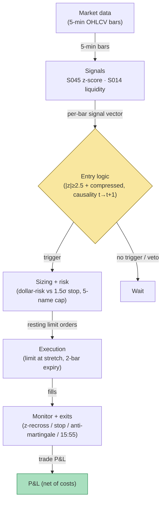

## Stage 163/200 — T063: Stretched-Move Z-Score Fade

*Batch TB7 · Strategy 63/100 · Signals S045, S014 · Provenance [D/SR]*

### T1. One-line verdict

| | |
|---|---|
| **Style** | Intraday statistical mean-reversion: fade statistically stretched moves after volatility compression |
| **Edge source** | Temporary liquidity-driven displacement (S045 z-score) that snaps back when the pre-move compression indicates positioning rather than information |
| **Typical holding period** | 30 minutes to 3 hours; flat 15:55 ET |
| **Capacity hint** | Moderate for a small book: many names stretch daily, but the compression pre-condition filters to a handful; dollar-risk sizing keeps per-trade risk at $200 (`example`) |
| **Build-or-buy in one line** | Build on 5-minute bars — a z-score, a compression ratio, and a liquidity-provision sizing rule; nothing to buy except the bars |

### T2. Full mechanics

**Universe & session.** Liquid US stocks, ADV ≥ 2M shares, price ≥ $10 (`example`). RTH 09:45–15:55 ET. Exclusions: earnings days, halts, and the 30 minutes around scheduled macro releases — a stretched move *into* a known event is information repricing, not a fade candidate.

**Z-score definition.** On 5-minute bars: `z_t = (close_t − MA20_t) / σ20_t`, where `MA20_t` and `σ20_t` are the trailing 20-bar mean and standard deviation of closes, computed causally (bars ≤ *t* only). **Stretched** means `|z_t| ≥ 2.5` (`example`). The z-score is a standardized displacement, not a forecast — it measures how far price has traveled from its recent center in units of recent noise.

**Volatility-compression pre-condition.** Before the stretch, require compression: the 5-bar realized range must be ≤ 0.6× the 20-bar median range (`example`). The logic: a move that erupts from a compressed coil and stretches 2.5σ is more likely to be a liquidity event (stop cascade, program imbalance) than a move that extends an already-volatile trend. This is the strategy's key filter and its main overfit surface.

**Liquidity-provision framing.** The fade is sized and executed as *liquidity provision* (S014): passive limit orders at the stretched extreme, never chasing. If the limit is not touched within 2 bars of the signal (`example`), the signal expires — a fade that needs chasing is not a liquidity trade.

**Entry rule.** At bar *t*: compression pre-condition true over bars *t−6…t−1* (`example` window), and `|z_t| ≥ 2.5`. Fade direction: short if `z_t > 0`, long if `z_t < 0`. Signal at *t* → fill at the open of *t+1* (`example`: limit at the stretched price; fill assumed at next open for the worked example). One fade per name per day (`example`).

**Exit rule.** (`example`): (1) z recrosses ±0.5 toward zero — the displacement has mean-reverted; (2) stop at 1.5σ adverse beyond entry (the stretch was information, not liquidity); (3) time stop 15:55 ET; (4) if a second consecutive bar stretches *further* (|z| increases and the bar closes beyond entry against the position), exit at next open — the anti-martingale rule.

**Position sizing.** `N = ⌊ R / |P_entry − P_stop| ⌋`, `R = $200` (`example`). Max 5 concurrent fades (`example`) — stretched moves correlate on market-wide liquidity events.

**Risk limits.** Daily loss stop −3R (`example`); kill-switch on stale bars; no new fades after 15:30 ET (`example`).

**Cost model.** Commission $0.005/share/side (`example`); limit-order execution assumed at the quote (maker) — half-spread *earned*, not paid — but the worked example conservatively assumes a taker-style fill at the next open with a half-spread penalty, because fading into momentum often means paying to get filled.

**Order/execution sketch.** Resting limit at the stretched level for 2 bars; if unfilled, re-price to the next open as a marketable limit (`example`). Participation ≤ 10% of bar volume (`example`). Queue honesty: the fill is not assumed at the extreme tick — the example fills at the next-bar open.

### T3. Signals it consumes

| Signal | Role | Weight / logic |
|---|---|---|
| S045 (deviation z-score) | Primary trigger | `z_t = (close_t − MA20_t)/σ20_t`; trigger `\|z_t\| ≥ 2.5` (`example`); exit on recross of ±0.5 |
| Volatility-compression gate (strategy rule, not a signal) | Filter / arming | `range5_t / median(range20)_t ≤ 0.6` (`example`) over the pre-move window; veto otherwise |
| S014 (liquidity provision) | Sizing + execution mode | Resting-limit execution, 2-bar expiry, participation cap; fill assumption discipline |

Combination logic (pseudocode, 20 lines):

```
# each 5-min bar close t, 09:45-15:30 ET
ma, sd = MA(close, 20), STDEV(close, 20)      # S045, causal
z = (close[t] - ma) / sd
compressed = range(close,5) <= 0.6 * median(range,20)  # example gate
if faded_today or not compressed: wait
if z >= 2.5: side = SHORT                     # S045, example
elif z <= -2.5: side = LONG
else: wait
# signal at t -> fill at open[t+1]
entry = open[t+1] (limit at stretched level, 2-bar expiry)  # S014
stop  = entry -/+ 1.5 * sd                    # example
N = floor(200 / abs(entry - stop))
exit when |z| recrosses 0.5 toward 0           # S045
exit next open if |z| extends 2 bars running   # anti-martingale
flatten_at(15:55 ET)
```

### T4. Worked example — numbers + P&L (SYNTHETIC)

Synthetic 5-minute bars, equity GHI, seed 163. The 11:00–11:25 window is compressed: 5-bar range 0.21 vs 20-bar median range 0.38 (0.55× ≤ 0.6 — armed, `example`). The 11:25–11:30 bar spikes: close **44.83** vs trailing MA20 **44.20**, σ20 **0.18** → `z = (44.83 − 44.20)/0.18 = +3.5` (≥ 2.5 — trigger). Signal at *t* = 11:30 close → fill short at the next open: **44.80**.

Stop = entry + 1.5σ = `44.80 + 1.5 × 0.18` = **45.07**. Risk/share = 0.27. `N = ⌊200/0.27⌋` = **740 shares**. The displacement mean-reverts: the 13:10 bar closes 44.35, z recrosses below +0.5 → exit at the next open: **44.36**.

Ledger:

| Leg | Price | Shares | Amount |
|---|---|---|---|
| Short (t+1 open) | 44.80 | 740 | +33,152.00 |
| Cover (z-recross exit) | 44.36 | 740 | −32,826.40 |
| Gross | | | **+325.60** |
| Commission (740 × $0.01 round-trip) | | | −7.40 |
| **Net** | | | **+$318.20** |

**Where the example is optimistic.** The z-score uses a 20-bar σ of 0.18 that is itself estimated on the compressed window — σ is understated exactly when compression precedes the move, so the +3.5 z is flattered; a σ estimated on a longer window would read a smaller stretch. The fill at 44.80 assumes the next open doesn't gap with the momentum; fading into a real liquidity event often fills 10–30¢ worse. The stop at 45.07 assumes a clean fill on a bar that is, by construction, moving fast. And the single winning trade shown is the *selected* outcome — the anti-martingale rule exists because roughly a third of such stretches (illustrative) keep stretching, and those exits are full 1R+ losers.

### T5. Data & infra — what must run

5-minute (or 1-minute resampled) OHLCV for 500 names; per-bar features: 20-bar MA/σ, 5-bar range, 20-bar median range — all O(1) rolling state per symbol. A subtle implementation point: the σ that standardizes the z-score must be recomputed causally on every bar from the trailing window only. Pre-computing σ on the full day and reading it back is the single most common look-ahead bug in mean-reversion replays, because the full-day σ "knows" the stretch before it happens and shrinks the z that the live strategy would have seen. The replay harness should therefore recompute the rolling statistics inside the bar loop and assert that no feature function ever indexes a bar dated after the signal bar. Footprint per the project cost model: 195,000 bars/day, trivial; 60 days ≈ 3GB disk; working set far below ~77GB; Polars-class throughput (~10–50M rows/sec planning assumption) makes the whole feature pass seconds-scale. Harness build: Tier M+ band, 40–100 hours ($6,000–$15,000 loaded at $150/hour) — the z-score logic is trivial; the hours are the replay harness (σ must be recomputed causally, no peeking at the full-day range) and the compression-window calibration. **M5 Max feasibility verdict: yes.** Failure plan: stale feed → no new fades; resting limits are day-orders that die with the session; flatten 15:55 ET.

### T6. Buy vs build

Retail: **QuantConnect** (~$60–$300/mo class, `indicative — verify before budgeting`) for research hosting; **IBKR paper** (no incremental platform fee on an existing account, `indicative — verify before budgeting`) for fill realism. Professional data: **Massive Stocks Advanced** (~$199/mo, `indicative — verify before budgeting`) covers the bar inputs. Verdict: **build.** A z-score fade is twenty lines; any vendor "mean-reversion indicator" is selling its own `example` constants. Crossover: none at this granularity — if you move to tick-level liquidity-provision modeling, that is a different strategy (market-making), not this one.

### T7. Success-ratio evidence

| Source | What it documents | Relevance / caveat |
|---|---|---|
| Heston, Korajczyk & Sadka, "Intraday Patterns in the Cross-Section of Stock Returns" (JF 2010) https://www.kellogg.northwestern.edu/faculty/korajczy/htm/HestonKorajczykSadkaJF2010.htm | Short-term reversal tied to temporary liquidity imbalances and bid-ask bounce; direct trading loses after spread | Direct academic support for the fade premise — displacements caused by liquidity provision snap back — plus the cost warning that governs position sizing |
| Lehmann, B. "Fads, Martingales, and Market Efficiency" (*QJE* 1990) https://econpapers.repec.org/RePEc:oup:qjecon:v:105:y:1990:i:1:p:1-28. | Weekly reversal evidence | Reversal background; weekly horizon, not intraday |
| Jegadeesh, N. "Evidence of Predictable Behavior of Security Returns" (JF 1990) https://doi.org/10.1111/j.1540-6261.1990.tb05110.x | Return predictability with short-term reversal components | Broader context; the compression pre-condition and z thresholds are the strategy's own reconstruction `[D/SR]`, not from these papers |

Capacity/crowding/decay: intraday reversal is among the most crowded statistical facts in markets; the compression filter is what makes this rule *different* from a naive fade, and its 0.6×/2.5 parameters are illustrative, not estimated. Honest bottom line: for a ≤$1M paper operation, this is a reasonable mean-reversion sleeve — trade small, enforce the anti-martingale exit, and expect the edge (if any) to live in the illiquid tail of the universe, not in SPY. For an institutional desk, this granularity is a market-making problem with inventory controls, not a signal-following rule.

### T8. Failure modes

- **Regime: information, not liquidity.** A stretched move on real news keeps stretching; the fade funds the informed. *Mitigation:* the compression pre-condition plus the earnings/macro exclusion list; the anti-martingale exit caps the damage at ~1R+.
- **Crowding: everyone fades 2.5σ.** Standard z-thresholds are consensus; fills deteriorate. *Mitigation:* the compression filter differentiates; track fill quality vs the model and widen the threshold if fills decay.
- **Latency: σ underestimation.** As noted, σ estimated on the compressed window understates the stretch. *Mitigation:* compute σ on a 60-bar window as a robustness check (`example`); require the trigger on *both*.
- **Costs: assumed maker, realized taker.** *Mitigation:* the worked example already assumes a taker fill; keep that conservatism in the model.
- **Overfit: 2.5 / 0.6 / 20-bar.** All `example`. *Mitigation:* walk-forward with embargo; the compression ratio is the parameter most likely to be curve-fit — stress it ±50%.
- **Operations: the 2-bar limit expiry.** A resting limit that isn't canceled on a halt becomes a gift. *Mitigation:* cancel-all on halt flags; no GTC orders, day-orders only.

### T9. Visuals


*Chart caption: synthetic data — not market data. Watermark reads "SYNTHETIC EXAMPLE" exactly.*



### T10. Sources

1. Heston, S.L., Korajczyk, R.A. & Sadka, R. "Intraday Patterns in the Cross-Section of Stock Returns." *Journal of Finance* 65(4), 1369–1407 (2010). https://www.kellogg.northwestern.edu/faculty/korajczy/htm/HestonKorajczykSadkaJF2010.htm — short-term reversal linked to temporary liquidity imbalances and bid-ask bounce; direct trading loses after spread. Title verified 2026-09-10.
2. Lehmann, B.N. "Fads, Martingales, and Market Efficiency." *Quarterly Journal of Economics* 105(1), 1–28 (1990). https://econpapers.repec.org/RePEc:oup:qjecon:v:105:y:1990:i:1:p:1-28. — weekly reversal evidence. Title/metadata verified 2026-09-10.
3. Jegadeesh, N. "Evidence of Predictable Behavior of Security Returns." *Journal of Finance* 45(3) (1990). https://doi.org/10.1111/j.1540-6261.1990.tb05110.x — return predictability; reversal context. DOI metadata verified 2026-09-10.

**Unverified leads** (not confirmed facts — verify before use):
- Temporary-impact/resiliency literature (e.g., liquidity-provision returns predicting reversals) was suggested as further reading by Grok; no specific paper was independently verified in this pass.
- All z-score, compression, and window constants are illustrative (`example`), not taken from the cited papers.

*Source log: Grok answered Q-TB7-1..3 (2026-09-10); all claims independently verified or labeled unverified.*
