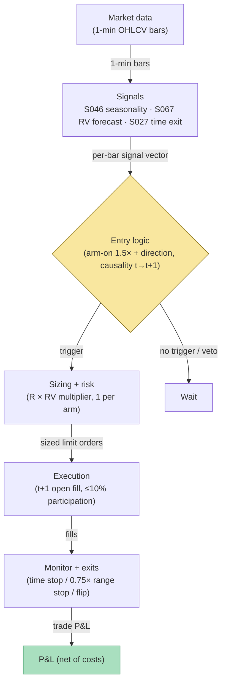

## Stage 164/200 — T064: U-Shape Seasonality Timer

*Batch TB7 · Strategy 64/100 · Signals S046, S067, S027 · Provenance [D/SR]*

### T1. One-line verdict

| | |
|---|---|
| **Style** | Intraday seasonality allocation: trade momentum on the high-volume U-arms, stand down in the midday doldrums |
| **Edge source** | The documented U-shaped intraday pattern of volume and volatility (S046) — directional persistence is highest when the session's own activity is highest; forecasts (S067) scale the bet |
| **Typical holding period** | 30–60 minutes per arm; two arms max per day; flat 15:55 ET |
| **Capacity hint** | Good for a small book: the arms are the most liquid minutes of the day; capacity constrained by the sizing rule, not by the book |
| **Build-or-buy in one line** | Build the slot-seasonality table on bought bars; the only thing to buy is clean history to estimate it |

### T2. Full mechanics

**Universe & session.** Liquid ETFs and large-caps (SPY/QQQ/AAPL-class, ADV ≥ 5M shares, `example`) — the U-shape is cleanest where volume is deep. RTH 09:30–16:00 ET. Exclusions: half days (the U compresses), FOMC days (the 14:00 event re-shapes the afternoon arm), earnings days.

**The U-shape.** Intraday volume and volatility are U-shaped: high at the open, a midday lull roughly 11:30–14:00 ET, high again into the close (documented since Wood–McInish–Ord 1985). Define per-30-minute clock slot *s*: `vol_med[s]` = 20-day median of slot volume, `rng_med[s]` = 20-day median of slot range (`example` lookback). **Arm-on condition:** the current slot's developing range ≥ 1.5× `rng_med[s]` (`example`) — the arm is "live" and carrying direction.

**Entry rule.** Two arms, one trade each (`example`):
- *Morning arm* (09:30–10:30): at the 09:35 bar close *t*, if the 09:30–09:35 bar range ≥ 1.5× `rng_med[09:30]` and the bar closed up (down), go long (short). Signal at *t* → fill at the open of *t+1*.
- *Afternoon arm* (15:00–15:55): same logic on the 15:00–15:05 bar; flatten at 15:55 regardless.
The realized-vol forecast (S067) scales size: `size_mult = clamp(forecast_slot_vol / median_slot_vol, 0.5, 1.5)` (`example`) — bet more when the arm is running hotter than its own history.

**Exit rule.** (`example`): (1) time stop — morning arm exits at 10:30, afternoon arm at 15:55 (S027); (2) stop at 0.75× the entry bar's range adverse; (3) signal flip — if the *next* bar closes against the position by more than the entry bar's range, exit at the following open (the arm's direction failed immediately).

**Position sizing.** `N = ⌊ (R × size_mult) / |P_entry − P_stop| ⌋`, `R = $200` (`example`). Max 1 position per arm.

**Risk limits.** Daily loss stop −3R (`example`); if the morning arm stops out, the afternoon arm is vetoed (`example` — a failed morning arm often marks a news-driven or range day, not a seasonality day); kill-switch on stale bars.

**Cost model.** Commission $0.005/share/side (`example`); half-spread each way; the arms are the most liquid minutes of the day, so the spread assumption is the most defensible in this batch — but the t+1 open fill still pays a half-spread penalty in the model.

**Order/execution sketch.** Marketable limit at the t+1 open (`example`); participation ≤ 10% of bar volume (`example`); taker modeling throughout.

### T3. Signals it consumes

| Signal | Role | Weight / logic |
|---|---|---|
| S046 (intraday seasonality) | Regime gate + trigger | Slot medians `vol_med[s]`, `rng_med[s]`; arm-on when developing range ≥ 1.5× `rng_med[s]` (`example`) |
| S067 (realized-vol forecast) | Sizing | `size_mult = clamp(forecast/median, 0.5, 1.5)` (`example`); scales R |
| S027 (time-based exit) | Exit manager | 10:30 / 15:55 time stops; owns the session clock and half-day shifts |

Combination logic (pseudocode, 21 lines):

```
# slot tables built pre-open from 20d history     # S046
vol_med, rng_med = slot_medians(20d)             # example
for arm, (t_entry, t_flat) in [(MORN, 0935, 1030), (AFT, 1505, 1555)]:
    s = clock_slot(t_entry)
    if range(bar[t_entry]) < 1.5 * rng_med[s]: wait   # arm not live
    dir = LONG if close[t_entry] > open[t_entry] else SHORT
    # signal at t_entry -> fill at open[t_entry+1]
    entry = open[t_entry+1]
    stop = entry -/+ 0.75 * range(bar[t_entry])   # example
    mult = clamp(rv_forecast(s)/rng_med[s], 0.5, 1.5)  # S067
    N = floor(200 * mult / abs(entry - stop))
    flatten_at(t_flat)                            # S027
    exit next open if next bar reverses > entry-bar range
```

### T4. Worked example — numbers + P&L (SYNTHETIC)

Synthetic 5-minute bars, equity JKL, seed 164. Morning arm: the 09:30–09:35 bar range is **0.62** vs `rng_med[09:30]` = 0.35 (1.77× ≥ 1.5 — arm live, `example`); the bar closes up. Signal at *t* = 09:35 close → fill long at the 09:40 open: **30.12**. S067 forecast ratio = 1.2 → `size_mult` = 1.2. Stop = `30.12 − 0.75 × 0.62` = **29.655** → 29.66; risk/share = 0.46; `N = ⌊200 × 1.2 / 0.46⌋` = **521 shares**. Time stop 10:30: exit at **30.58**. Gross = `521 × 0.46` = +239.66. Commission = 521 × 0.01 = −5.21. Net = **+234.45**.

Afternoon arm: the 15:00–15:05 bar range is **0.55** vs `rng_med[15:00]` = 0.30 (1.83× — live); closes up. Signal → fill long at 15:10 open: **30.70**. `size_mult` = 1.0. Stop = `30.70 − 0.75 × 0.55` = **30.2875** → 30.29; risk/share = 0.41; `N = ⌊200/0.41⌋` = **487 shares**. The arm fades: 15:55 time-stop exit at **30.55**. Gross = `487 × (30.55 − 30.70)` = −73.05. Commission = −4.87. Net = **−77.92**.

Session ledger:

| Arm | Entry | Exit | Shares | Gross | Comm. | Net |
|---|---|---|---|---|---|---|
| Morning | 30.12 | 30.58 | 521 | +239.66 | −5.21 | +234.45 |
| Afternoon | 30.70 | 30.55 | 487 | −73.05 | −4.87 | −77.92 |
| **Session** | | | | | | **+$156.53** |

The morning arm pays for the afternoon arm's fade — the honest shape of a seasonality rule: the pattern is real, the daily P&L is not guaranteed.

**Where the example is optimistic.** The slot medians are treated as known and stable; in practice the U-shape shifts with the volatility regime and the 20-day median lags it. The arm-on 1.5× test uses the *completed* 09:30–09:35 bar — respected here — but the fill at the 09:40 open assumes no gap between the signal bar's close and the next open on a running tape. The S067 size multiplier (1.2×) boosts the winner in this example; on a losing morning it would boost the loser symmetrically. The afternoon fade shown is mild; on inventory-driven closes (see T069) the afternoon arm can be actively hostile to momentum.

### T5. Data & infra — what must run

Pre-open: 20-day slot-median tables (48 thirty-minute slots) for the universe; intraday: developing slot range vs the table; post-close: table update. Data: 1-minute OHLCV, 500 names — 195,000 bars/day, trivial; 60 days ≈ 3GB disk (project cost model); working set far below ~77GB; Polars-class throughput (~10–50M rows/sec planning assumption) makes the slot-table build seconds-scale. Harness: Tier M+ band, 40–100 hours ($6,000–$15,000 loaded at $150/hour) — the slot logic is simple; the hours are the half-day/FOMC calendar and the no-look-ahead replay (slot medians must exclude today). **M5 Max feasibility verdict: yes.** Failure plan: stale feed → no new arm entries; running arms keep stops and time stops; a missed 10:30 flatten triggers a market flatten on the next available bar.

### T6. Buy vs build

Retail: **QuantConnect** (~$60–$300/mo class, `indicative — verify before budgeting`); **IBKR paper** (no incremental platform fee on an existing account, `indicative — verify before budgeting`). Professional data: **Massive Stocks Advanced** (~$199/mo, `indicative — verify before budgeting`) for bars; 2-year history for the slot tables runs tens to low hundreds of dollars on flat files (`indicative — verify before budgeting`). Verdict: **build.** The slot-seasonality table is the asset and it must be estimated on *your* universe and *your* calendar — a vendor's generic "time-of-day" indicator is the wrong table. Crossover: none — this strategy's data needs are fully covered by 1-minute bars.

### T7. Success-ratio evidence

| Source | What it documents | Relevance / caveat |
|---|---|---|
| Wood, McInish & Ord, "An Investigation of Transactions Data for NYSE Stocks" (JF 1985) https://digitalcommons.memphis.edu/facpubs/11516/ (DOI: 10.1111/j.1540-6261.1985.tb04996.x) | Unusually high returns/volatility at the beginning and end of the trading day | The empirical root of the U-shape; documents the pattern's existence, not a tradable momentum rule |
| Heston, Korajczyk & Sadka, "Intraday Patterns in the Cross-Section of Stock Returns" (JF 2010) https://www.kellogg.northwestern.edu/faculty/korajczy/htm/HestonKorajczykSadkaJF2010.htm | Intraday periodicity in returns incl. same-interval effects | Supports time-of-day structure in returns; the arm-momentum packaging is the strategy's own `[D/SR]` |
| Gao, Han, Li & Zhou, "Intraday Momentum: The First Half-Hour Return Predicts the Last Half-Hour Return" (SSRN 2552752) https://papers.ssrn.com/sol3/papers.cfm?abstract_id=2552752 | S&P 500 ETF 1993–2013; first-half-hour predicts last-half-hour, stronger on volatile/high-volume days | Closest to the morning-arm premise: early-session direction carries; it is index-level and not a per-name entry rule |

Capacity/crowding/decay: time-of-day effects are among the oldest documented patterns and are widely known; the arms are the day's most liquid minutes, so capacity is relatively good but the edge (if any) is thin and lives in the *sizing* (S067), not in the direction call. Honest bottom line: for a ≤$1M paper operation, this is a sensible "second sleeve" — it trades when liquidity is deepest and stands down when it isn't, which is good risk hygiene even if the alpha is zero. For an institutional desk, intraday seasonality is an execution-scheduling input (when to trade), not a proprietary signal.

### T8. Failure modes

- **Regime: volatility-regime shift.** After a vol spike, the 20-day slot medians understate the arms for weeks; the 1.5× gate fires constantly. *Mitigation:* regime-normalize the medians (divide by trailing 20-day daily range, `example`); re-estimate monthly.
- **Crowding: the arms are consensus.** 09:35 and 15:05 are crowded entry times. *Mitigation:* the t+1 fill discipline plus participation cap; measure slippage vs the model weekly.
- **Latency: the slot-median table must exclude today.** Including today's developing range in the median peeks. *Mitigation:* replay-harness assertion; tables built pre-open only.
- **Costs: afternoon-arm spreads.** The 15:00–15:30 window can be wide on rebalance days. *Mitigation:* spread filter (skip if spread > 3¢, `example`).
- **Overfit: 1.5×, 0.75×, 20-day.** All `example`. *Mitigation:* walk-forward with embargo; the arm-on multiplier is the parameter to stress first. Note that the two arms should be calibrated separately — the morning arm's 1.5× gate and the afternoon arm's 1.5× gate live in different volatility regimes, and forcing one shared multiplier across both is a needless constraint that usually costs the afternoon arm its selectivity.
- **Operations: FOMC/half-day.** The U-shape is not U-shaped on these days. *Mitigation:* calendar vetoes from the S076 event feed; the morning-arm-fails veto covers the rest.

### T9. Visuals


*Chart caption: synthetic data — not market data. Watermark reads "SYNTHETIC EXAMPLE" exactly.*



### T10. Sources

1. Wood, R.A., McInish, T.H. & Ord, J.K. "An Investigation of Transactions Data for NYSE Stocks." *Journal of Finance* 40(3), 723–739 (1985). https://digitalcommons.memphis.edu/facpubs/11516/ — unusually high returns/volatility at the beginning and end of the trading day. Title verified 2026-09-10.
2. Heston, S.L., Korajczyk, R.A. & Sadka, R. "Intraday Patterns in the Cross-Section of Stock Returns." *Journal of Finance* 65(4), 1369–1407 (2010). https://www.kellogg.northwestern.edu/faculty/korajczy/htm/HestonKorajczykSadkaJF2010.htm — intraday periodicity and short-horizon reversal. Title verified 2026-09-10.
3. Gao, L., Han, Y., Li, S.Z. & Zhou, G. "Intraday Momentum: The First Half-Hour Return Predicts the Last Half-Hour Return." SSRN. https://papers.ssrn.com/sol3/papers.cfm?abstract_id=2552752 — S&P 500 ETF 1993–2013 intraday momentum. Title verified 2026-09-10.

**Unverified leads** (not confirmed facts — verify before use):
- Admati & Pfleiderer, "A Theory of Intraday Patterns: Volume and Price Variability" (*RFS* 1988) — the theoretical U-shape reference named by Grok; a canonical publisher URL was not verified in this pass.
- Grok Q-TB7-3 claims: ES/NQ first hour ≈ 25–28% of RTH volume / ~55–63% of day's range; Boyarchenko–Larsen–Whelan (2023) overnight-drift figures — named-only, treat as leads.
- All slot, multiplier, and window constants are illustrative (`example`).

*Source log: Grok answered Q-TB7-1..3 (2026-09-10); all claims independently verified or labeled unverified.*
