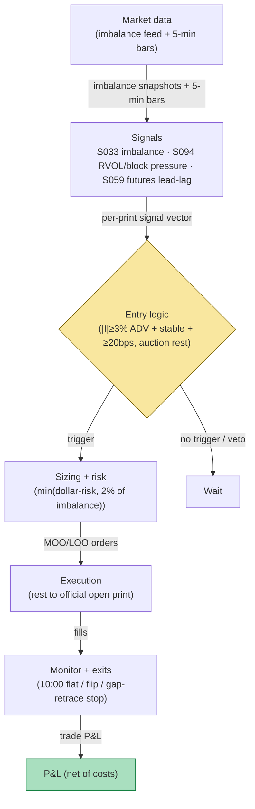

## Stage 165/200 — T065: Open-Auction Imbalance Continuation

*Batch TB7 · Strategy 65/100 · Signals S033, S094, S059 · Provenance [D/SR]*

### T1. One-line verdict

| | |
|---|---|
| **Style** | Opening-auction momentum: trade with the pre-open imbalance into the first 30 minutes of continuous trading |
| **Edge source** | Overnight order-flow imbalance revealed in the opening auction's indicative book (S033); the opening print often under-reacts and the imbalance leans the same way for the first half hour |
| **Typical holding period** | 5–30 minutes; flat by 10:00 ET |
| **Capacity hint** | Thin: one trade per name per day, sized to a fraction of the published imbalance; the opening cross is competitive and fills are the constraint |
| **Build-or-buy in one line** | Buy the opening-imbalance feed (or a vendor's pre-open indicative), build the continuation rule — the feed is the product, the rule is trivial |

### T2. Full mechanics

**Universe & session.** NYSE- and Nasdaq-listed large caps, ADV ≥ 5M shares (`example`). Pre-open window 09:15–09:30 ET for signal formation; trading window 09:30–10:00 ET only. Exclusions: halts, LULD limit states, news-halted names, and days when the name is in the S&P/Dow rebalance (the open is then an index event, not an imbalance event).

**Imbalance signal.** An **auction imbalance** is the net unpaired share volume published by the exchange before the opening cross: on NYSE the Opening Auction Imbalance Information (Total/Market Imbalance, imbalance reference price); on Nasdaq the NOII (Net Order Imbalance Indicator: paired shares, imbalance side/direction, near/far indicative prices). Define `I_t` = signed imbalance shares (positive = buy-heavy), `P̂_t` = indicative match price. Read at 09:25 (`example`). **Entry requires all of:** (1) `|I| ≥ 3% of 20-day ADV` or `≥ 50,000 shares` (`example`); (2) sign(I) stable vs the 09:15 print — no flip; (3) `|P̂ − prior_close| ≥ 20 bps` in the imbalance's direction (`example`) — there must be a gap worth continuing; (4) not a halt/LULD state.

**Entry rule.** Two implementations (`example`): (a) *auction entry* — MOO (market-on-open) or LOO (limit-on-open) in the imbalance direction, filled at the official opening print; (b) *confirmation entry* — wait for the first 5-minute bar (09:30–09:35) to close in the imbalance direction, then enter at the next open (signal at *t* → fill *t+1*). The worked example uses (a). Auction orders rest until the official auction print — they are not continuous-session fills.

**Exit rule.** (`example`): (1) time stop 10:00 ET flat; (2) signal flip — the 09:35 or 09:40 bar closes against the imbalance direction → exit next open; (3) stop at the opening print ∓ 0.5× the pre-open indicative range (a full retrace of the gap invalidates the continuation).

**Position sizing.** `N = min(⌊R/stop_dist⌋, 0.02 × |I|)` (`example`) — never be more than 2% of the published imbalance; you are riding the imbalance, not *being* it. `R = $200` (`example`).

**Risk limits.** Daily loss stop −3R (`example`); one trade per name per day; kill-switch on a missing 09:25 imbalance print (stale feed = no trade).

**Cost model.** Commission $0.005/share/side (`example`). Auction entry: no spread is paid on the cross itself — the fill is the official open print; cost vs the thesis is `open_print − P̂_09:25` (adverse selection if the print runs away before you commit). Confirmation entry: half-spread each way on the continuous fill.

**Order/execution sketch.** MOO/LOO submitted by the broker's cutoff (before 09:28 ET, `example`; broker cutoffs run ahead of the exchange's); LOO limit at `P̂ ± 10 bps` (`example`) so a runaway open doesn't fill at a bad print. Participation honesty: the opening cross is the day's most competitive print — model the fill at the official print with no price improvement.

### T3. Signals it consumes

| Signal | Role | Weight / logic |
|---|---|---|
| S033 (auction imbalance) | Primary trigger | Signed imbalance `I`, indicative `P̂`, paired shares; entry requires size ≥ 3% ADV, sign stability, ≥ 20 bps gap (`example`) |
| S094 (RVOL / block pressure) | Filter | Confirms the indicative gap direction vs prior close — the pre-open RVOL/block-pressure gap-confirmation filter |
| S059 (futures–spot lead-lag) | Confirmation | The pre-open futures leg confirms the gap direction; veto if it reverses the gap after 09:25; first 5-minute bar close in the imbalance direction for the confirmation-entry variant |

Combination logic (pseudocode, 20 lines):

```
# pre-open, 09:25 ET snapshot                      # S033
I, P_hat, paired = read_opening_imbalance(sym)     # exchange feed
if halted or LULD: no trade
adv = ADV(sym, 20d)
gap_bps = (P_hat - prior_close) / prior_close * 1e4  # S094
if abs(I) >= max(0.03*adv, 50000) and sign(I)==sign(I_0915) \
   and abs(gap_bps) >= 20 and sign(gap_bps)==sign(I):
    side = BUY if I > 0 else SELL                 # example thresholds
    # variant A: MOO/LOO -> filled at official open print
    # variant B: wait for 0930-0935 bar close with imbalance, fill t+1
    N = min(floor(200/stop_dist), 0.02*abs(I))    # example
    stop = open_print -/+ 0.5 * preopen_range     # example
    flatten_at(10:00 ET); exit on bar close vs imbalance
else: wait
```

### T4. Worked example — numbers + P&L (SYNTHETIC)

Synthetic pre-open tape, NYSE-listed ABC, seed 165. Prior close **90.00**. 20-day ADV = 8.0M shares. 09:15 print: buy imbalance 240,000. 09:25 print: buy imbalance **250,000** (≥ 3% × 8M = 240,000 — qualifies, `example`), sign stable, indicative **P̂ = 90.45** (+50 bps ≥ 20 bps — qualifies). S094 confirms the gap direction; no halt. Enter variant A: **buy 625 MOO** — check the imbalance cap: `0.02 × 250,000` = 5,000 ≥ 625 ✓; risk check: stop distance 0.32 (see below) → `⌊200/0.32⌋` = 625 ✓. The MOO rests until the official opening print: fill at **90.42** (the print undercuts the indicative — normal auction noise).

Stop = `90.42 − 0.5 × 0.64` = **90.10** (pre-open indicative range 0.64, `example`). The continuation holds: 09:35 and 09:40 bars close up; time-stop exit at 10:00: **90.73**.

Ledger:

| Leg | Price | Shares | Amount |
|---|---|---|---|
| Buy MOO (official open print) | 90.42 | 625 | −56,512.50 |
| Sell (10:00 time stop) | 90.73 | 625 | +56,706.25 |
| Gross | | | **+193.75** |
| Commission (625 × $0.01 round-trip) | | | −6.25 |
| **Net** | | | **+$187.50** |

**Where the example is optimistic.** The MOO fill at the official print assumes the broker's cutoff was met and the order was accepted — on a busy open, retail MOO orders can be rejected or filled at a worse print than the indicative suggested. The indicative-to-print slippage (90.45 → 90.42) is shown as favorable; it is frequently adverse. The 3%-of-ADV and 20-bps thresholds are `example` values; real opening-imbalance continuation is dominated by participants with faster indicative feeds than the one modeled here. The single winning trade is illustrative — opens that gap *and* continue are a minority of gap opens; most are faded by the continuous-session book within minutes.

### T5. Data & infra — what must run

Pre-open job: pull the 09:15/09:25 imbalance snapshots (NYSE Opening Auction Imbalance Information or Nasdaq NOII), prior close, 20-day ADV; 09:30–10:00: 5-minute bars for the confirmation variant and the flip exit. The imbalance feed is the critical path — SIP bars alone cannot produce it. Footprint: bars are trivial (195,000/day; 60 days ≈ 3GB per the cost model); the imbalance snapshots are kilobytes per name per day. Harness: Tier M+ band, 40–100 hours ($6,000–$15,000 loaded at $150/hour) — the continuation rule is simple; the hours are the venue-specific feed normalization (NYSE vs Nasdaq field schemas), the MOO/LOO order-type state machine, and half-day open-time shifts. **M5 Max feasibility verdict: yes** — the constraint is the feed license, not compute. Failure plan: missing 09:25 print → no trade, no exceptions; a halt between entry and 10:00 → the position is held to the resume with the stop widened to the halt-range (`example`), or flattened immediately if the halt was news-driven.

### T6. Buy vs build

Retail: **QuantConnect** (~$60–$300/mo class, `indicative — verify before budgeting`) for the research host; **IBKR paper** (no incremental platform fee on an existing account, `indicative — verify before budgeting`) — IBKR supports MOO/LOO routing for live testing. Professional data: **Nasdaq TotalView** (~$1.6k–$1.7k/mo firm + ~$80/user, `indicative — verify before budgeting`) carries NOII for Nasdaq names; **NYSE opening-auction imbalance** data is an exchange-direct or vendor add-on (vendor-individual pricing varies; `indicative — verify before budgeting`); **Massive/Polygon** offers an NYSE-listed imbalance-style product as a cheaper on-ramp (`indicative — verify before budgeting`). Verdict: **buy the feed, build the rule.** Without the official imbalance print you are guessing the auction from the tape — that is the documented way to lose at this game. Crossover: if the imbalance feed costs more than the strategy's expected monthly P&L at your size, drop the strategy — the feed *is* the edge's price tag.

### T7. Success-ratio evidence

| Source | What it documents | Relevance / caveat |
|---|---|---|
| Madhavan, A. & Panchapagesan, V. "Price Discovery in Auction Markets: A Look Inside the Black Box" (*RFS* 2000) https://ideas.repec.org/a/oup/rfinst/v13y2000i3p627-58.html | NYSE opening-auction price discovery with order-level data; designated dealers facilitate discovery vs a pure automated call | Academic foundation that the opening auction aggregates information — the imbalance is informative, not noise; it does not bless a continuation rule |
| Biais, B., Hillion, P. & Spatt, C. "An Empirical Analysis of the Limit Order Book and the Order Flow in the Paris Bourse" (JF 1995) https://ideas.repec.Org/a/bla/jfinan/v50y1995i5p1655-89.html | Order flow concentrated near the quote; quote shifts follow large trades (information effects) | Limit-order-book mechanics behind why an opening imbalance can lean the early continuous session; Paris Bourse, not US opens |
| NYSE Rule 7.35 Series — Auction mechanics (SEC Exhibit 5, 2026) https://www.sec.gov/files/rules/sro/nyse/2026/34-106126-ex5.pdf | Auction-only order types (MOO/MOC/LOC), imbalance definitions, freeze and cutoff rules | The venue rulebook the strategy must obey; confirms MOO/LOO exist as auction-only orders and that imbalance information is a defined, disseminated quantity — not a trading edge by itself |

Capacity/crowding/decay: the opening cross is the most-watched print of the day; any continuation edge is competed away by participants with faster indicative feeds and better queue positions. Honest bottom line: for a ≤$1M paper operation, this is a *feed-dependent* strategy — paper-trade it only if you have the real imbalance feed; a SIP-proxy version is self-deception. For an institutional desk, opening-imbalance continuation is a standard microstructure input, sized in basis points of the imbalance, not a standalone book.

### T8. Failure modes

- **Regime: index-rebalance and news opens.** The imbalance is then an index or information event; continuation logic misfires. *Mitigation:* rebalance/news exclusion list; S094 (RVOL / block pressure) gap-confirmation filter.
- **Crowding: the indicative feed is public.** Everyone sees the same 250,000-share print. *Mitigation:* the 2%-of-imbalance sizing cap and the LOO limit discipline — never chase a runaway print.
- **Latency: indicative vs your snapshot.** A 09:25 snapshot can be stale by the 09:28 broker cutoff. *Mitigation:* re-check sign stability at the latest available print; abort on flip.
- **Costs: MOO adverse selection.** The print can run away from the indicative between your decision and the cross. *Mitigation:* prefer LOO with a `P̂ ± 10 bps` limit (`example`); model the indicative-to-print slippage explicitly.
- **Overfit: 3% / 50k / 20 bps.** All `example`. *Mitigation:* walk-forward; these are filters, not optima — report sensitivity.
- **Operations: broker cutoff misses.** A MOO submitted after the broker's cutoff is dead or, worse, converted to a market order at 09:30. *Mitigation:* submit by 09:28 ET (`example`); hard-coded per-broker cutoff table; kill-switch on cutoff-table staleness.

### T9. Visuals


*Chart caption: synthetic data — not market data. Watermark reads "SYNTHETIC EXAMPLE" exactly.*



### T10. Sources

1. Madhavan, A. & Panchapagesan, V. "Price Discovery in Auction Markets: A Look Inside the Black Box." *Review of Financial Studies* 13(3), 627–658 (2000). https://ideas.repec.org/a/oup/rfinst/v13y2000i3p627-58.html — NYSE opening-auction price discovery; designated dealers facilitate discovery. Title verified 2026-09-10.
2. Biais, B., Hillion, P. & Spatt, C. "An Empirical Analysis of the Limit Order Book and the Order Flow in the Paris Bourse." *Journal of Finance* 50(5), 1655–1689 (1995). https://ideas.repec.Org/a/bla/jfinan/v50y1995i5p1655-89.html — order-flow/book interaction; quote shifts after large trades. Title verified 2026-09-10.
3. NYSE Rule 7.35 Series, "Auctions" (Rule 7P Equities Trading), via SEC Exhibit 5 (2026). https://www.sec.gov/files/rules/sro/nyse/2026/34-106126-ex5.pdf — auction-only orders (MOO/MOC/LOC), imbalance definitions, freeze rules. Content confirmed 2026-09-10.

**Unverified leads** (not confirmed facts — verify before use):
- Grok Q-TB7-1 opening-auction cutoff specifics (NYSE imbalance 15:50-style ladders applied to the open; Nasdaq NOII timing; LOO/MOO broker cutoffs) — venue-rule details per Grok; verify against current exchange rulebooks before trading.
- Grok Q-TB7-3 auction-design attributions (Hu & Murphy 2022 on Nasdaq imbalance dynamics; Comerton-Forde & Putniņš successors) — named-only or misattributed in the source material; the verified venue paper is Jegadeesh & Wu (2022), cited in T070.
- All imbalance-size, gap, and timing thresholds are illustrative (`example`).

*Source log: Grok answered Q-TB7-1..3 (2026-09-10); all claims independently verified or labeled unverified.*
