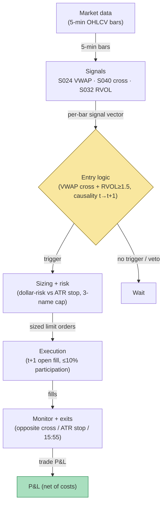

## Stage 166/200 — T066: VWAP-Cross Institutional Follower

*Batch TB7 · Strategy 66/100 · Signals S024, S040, S032 · Provenance [D/SR]*

### T1. One-line verdict

| | |
|---|---|
| **Style** | Intraday trend-following off the institutional benchmark: go with price when it reclaims VWAP with volume, exit when it loses it |
| **Edge source** | VWAP is the dominant institutional execution benchmark (S024); a volume-confirmed reclaim (S040 cross) can mark the point where the day's program flow flips from distribution to accumulation — and the exit when it fails |
| **Typical holding period** | 30 minutes to 3 hours; flat 15:55 ET |
| **Capacity hint** | Good in liquid names: VWAP-cross minutes are deep; sizing is the usual $200-risk (`example`) discipline |
| **Build-or-buy in one line** | Build — session VWAP and an RVOL filter on bought bars; the "institutional following" narrative is free, the spread is not |

### T2. Full mechanics

**Universe & session.** Liquid US stocks/ETFs, ADV ≥ 5M shares, price ≥ $10 (`example`). RTH 09:35–15:55 ET (VWAP needs the first 5 minutes to stabilize). Exclusions: earnings days, halts, FOMC 14:00 days after 13:30 (`example`).

**VWAP definition.** Session volume-weighted average price from the opening print: `VWAP_t = Σ(P_i × V_i) / ΣV_i` over bars from 09:30 to *t*, computed causally. **Institutional-flow lens (S024):** institutions benchmark execution to VWAP; price persistently above VWAP suggests net accumulation pressure, below it distribution — this is a *framing* assumption, not a measured fact.

**Cross with volume confirmation.** A **VWAP cross** (S040) at bar *t*: close crosses from below to above VWAP (long) or above to below (short). **Volume confirmation** (S032): bar *t* volume ≥ 1.5× the slot median (`example`) — rejects low-volume drift-throughs that mean-revert. Optional anchor discipline: ignore crosses in the first 30 minutes after a gap open ≥ 1% (`example`) — gap-open VWAP crosses are mostly noise.

**Entry rule.** At bar *t*: VWAP cross + volume confirmation + no gap-open veto. Signal at *t* → fill at the open of *t+1* (`example`). One VWAP-side position per name per day (`example`) — no re-crossing whipsaws.

**Exit rule.** (`example`): (1) opposite cross — close crosses back through VWAP → exit at next open (the follower's thesis is symmetric); (2) stop at the entry-bar extreme ∓ 0.5× the 14-bar ATR (Average True Range — the trailing 14-bar mean of per-bar ranges, a volatility ruler in price units) (beyond the cross bar — a genuine failure); (3) time stop 15:55 ET.

**Position sizing.** `N = ⌊ R / |P_entry − P_stop| ⌋`, `R = $200` (`example`), with an `example` 500-share single-trade cap. Max 3 concurrent followers (`example`).

**Risk limits.** Daily loss stop −3R (`example`); kill-switch on stale bars; no new crosses after 15:30 ET (`example`).

**Cost model.** Commission $0.005/share/side (`example`); half-spread each way on continuous fills. Note: VWAP-cross minutes are liquid, so the spread assumption is defensible — but the *strategy's own trading* pushes its average fill away from VWAP by construction (it buys after the reclaim). Do not benchmark the strategy's P&L to VWAP; that comparison is circular.

**Order/execution sketch.** Marketable limit at the t+1 open (`example`); participation ≤ 10% of bar volume (`example`); taker modeling.

### T3. Signals it consumes

| Signal | Role | Weight / logic |
|---|---|---|
| S024 (VWAP benchmark) | Reference line + framing | Causal session VWAP; the cross is evaluated against it; institutional-flow interpretation is narrative `[D]` |
| S040 (VWAP cross) | Primary trigger | Close crosses VWAP with volume ≥ 1.5× slot median (`example`); direction = cross direction |
| S032 (relative volume) | Confirmation filter | Vetoes low-volume crosses; also computes the entry-bar ATR stop |

Combination logic (pseudocode, 20 lines):

```
# each 5-min bar close t, 09:35-15:30 ET
vwap = cumsum(P*V)/cumsum(V) since 09:30      # S024, causal
rvol = volume[t] / slot_median(volume, t)     # S032
if close[t-1] < vwap[t-1] and close[t] > vwap[t] and rvol >= 1.5:
    side = LONG                               # S040, example
elif close[t-1] > vwap[t-1] and close[t] < vwap[t] and rvol >= 1.5:
    side = SHORT
else: wait
# signal at t -> fill at open[t+1]
entry = open[t+1]
stop  = low[t] - 0.5 * ATR(14) (for LONG)     # example
N = floor(200 / abs(entry - stop))
exit on opposite cross at next open           # S040 symmetric
flatten_at(15:55 ET)
```

### T4. Worked example — numbers + P&L (SYNTHETIC)

Synthetic 5-minute bars, equity MNO, seed 166 (tape per Grok capture, reproduced here as the synthetic example). 10:25: close **80.10**, VWAP **80.18**, RVOL 0.9 — below VWAP, no signal. 10:30: close **80.22** crosses above VWAP **80.19** with RVOL **1.8** (≥ 1.5 — confirmed). Signal at *t* = 10:30 close → fill long at the 10:35 open: **80.25**. Stop = 80.25 − 0.5×ATR(0.40) = **80.05**; risk/share = 0.20; the example sizes **500 shares** (`example` position cap for the illustration; the formula would allow more, the cap keeps the tape's liquidity honest).

14:10: close **80.20** crosses below VWAP **80.31** with RVOL **1.6** — opposite cross. Exit at the next open: **80.18**.

Ledger:

| Leg | Price | Shares | Amount |
|---|---|---|---|
| Buy (10:35 open) | 80.25 | 500 | −40,125.00 |
| Sell (14:15 open) | 80.18 | 500 | +40,090.00 |
| Gross | | | **−35.00** |
| Commission (500 × $0.01 round-trip) | | | −5.00 |
| **Net** | | | **−$40.00** |

A deliberately losing example: the reclaim failed, the symmetric exit did its job, and the round trip cost $40. This is the modal outcome of VWAP-cross following — the cross is a lagging confirmation, and the exit gives back the move that triggered the entry.

**Where the example is optimistic.** The VWAP itself is computed on the synthetic tape's volume, which is smooth; real VWAP jumps with block prints and the cross can trigger on a single large print rather than genuine flow. The fill at 80.25 assumes the 10:35 open doesn't gap with the cross momentum; the exit at 80.18 assumes a clean fill on the opposite cross. The 1.5× RVOL filter is `example` — on real data it filters some whipsaws and passes some failures, and this example was chosen to show a failure. The circular-benchmark warning stands: this strategy should be evaluated on net P&L, never on "beat VWAP."

### T5. Data & infra — what must run

1-minute or 5-minute OHLCV for 500 names; per-bar causal session VWAP, slot-median volume, 14-bar ATR — all O(1) rolling state. Footprint per the project cost model: 195,000 bars/day, trivial; 60 days ≈ 3GB disk; working set far below ~77GB; Polars-class throughput (~10–50M rows/sec planning assumption) makes the feature pass seconds-scale. Harness: Tier M+ band, 40–100 hours ($6,000–$15,000 loaded at $150/hour) — the cross logic is trivial; the hours are the causal-VWAP replay discipline (no full-session VWAP peeking) and the gap-open veto calendar. **M5 Max feasibility verdict: yes.** Failure plan: stale feed → no new crosses; running followers keep ATR stops and the opposite-cross exit; flatten 15:55 ET.

### T6. Buy vs build

Retail: **QuantConnect** (~$60–$300/mo class, `indicative — verify before budgeting`); **IBKR paper** (no incremental platform fee on an existing account, `indicative — verify before budgeting`). Professional data: **Massive Stocks Advanced** (~$199/mo, `indicative — verify before budgeting`) covers bars. Verdict: **build.** VWAP is arithmetic; no vendor's "institutional flow" indicator adds anything the cross doesn't already show. Crossover: none — but if you want *actual* institutional flow (13F, block prints, program-trade flags), that is a different data product and a different strategy.

### T7. Success-ratio evidence

| Source | What it documents | Relevance / caveat |
|---|---|---|
| Berkowitz, S.A., Logue, D.E. & Noser, E.A. "The Total Cost of Transactions on the NYSE" (JF 1988) https://doi.org/10.1111/j.1540-6261.1988.tb02591.x | VWAP as the standard institutional execution benchmark; measured execution costs | Establishes VWAP's *benchmark* role — the premise that institutions care about VWAP. It does **not** document that following VWAP crosses is profitable; the directional rule is weakly documented/folkloric `[D]` |
| Heston, Korajczyk & Sadka, "Intraday Patterns in the Cross-Section of Stock Returns" (JF 2010) https://www.kellogg.northwestern.edu/faculty/korajczy/htm/HestonKorajczykSadkaJF2010.htm | Short-horizon continuation and reversal structure intraday | General intraday-trend background; the cross-following rule itself is a reconstruction |
| Gao et al., "Intraday Momentum: The First Half-Hour Return Predicts the Last Half-Hour Return" https://papers.ssrn.com/sol3/papers.cfm?abstract_id=2552752 | Intraday momentum in the S&P 500 ETF | Directional-following background; index-level, not a VWAP-cross rule |

Capacity/crowding/decay: VWAP is the most-watched line on every institutional blotter; any cross-following edge is competed away in the most liquid names first. There is an additional structural reason to expect thin results: the strategy's entries are *adverse-selection machines* — every long entry buys after price has already risen through VWAP, so the fill is systematically worse than the benchmark the signal is named after. That does not make the rule unusable, but it means the gross edge must clear a hurdle that backtests anchored on mid-prices will understate. Practically, the way to know whether the rule has anything is to measure the markout: if the average fill is not followed by continued drift in the cross direction over the next 30–60 minutes, the cross was noise and no parameter tuning will fix it. Honest bottom line: for a ≤$1M paper operation, this is a *discipline* strategy more than an alpha strategy — it keeps you with the day's flow and cuts losers mechanically, but expect the gross edge to be near zero before costs. For an institutional desk, VWAP-cross following is an execution-timing heuristic, not a signal.

### T8. Failure modes

- **Regime: range days.** VWAP crosses back and forth all day; the one-position-per-day rule caps the damage at one whipsaw, but the whipsaw is the modal outcome. *Mitigation:* the volume-confirmation filter; a daily regime check — if the first cross fails, no second cross (`example`).
- **Crowding: everyone watches VWAP.** The cross bar is crowded; the t+1 fill is the crowded fill. *Mitigation:* participation cap; measure slippage vs the model.
- **Latency: VWAP is causal but volume prints late.** Corrected prints can revise the cross after the fact. *Mitigation:* use as-published bars in the replay; accept that some historical "crosses" never existed in real time.
- **Costs: buying the reclaim.** The strategy systematically buys above VWAP and sells below it. *Mitigation:* model fills honestly; never benchmark to VWAP.
- **Overfit: 1.5× RVOL, 0.5× ATR.** All `example`. *Mitigation:* walk-forward with embargo.
- **Operations: corporate actions.** Splits/dividends shift the VWAP series. *Mitigation:* split-adjusted bars only; halt on unadjusted corporate-action flags.
- **Signal staleness: VWAP anchor drift.** On high-volume days the session VWAP becomes a slow-moving average dominated by the morning's prints, and late-day crosses against it mean less — the benchmark has gone stale while the tape has moved on. *Mitigation:* an `example` freshness check — skip crosses after 14:30 if the day's volume is already above 1.5× its 20-day average, on the grounds that the VWAP line no longer represents the marginal institutional benchmark.

### T9. Visuals


*Chart caption: synthetic data — not market data. Watermark reads "SYNTHETIC EXAMPLE" exactly.*



### T10. Sources

1. Berkowitz, S.A., Logue, D.E. & Noser, E.A. "The Total Cost of Transactions on the NYSE." *Journal of Finance* 43(1), 97–112 (1988). https://doi.org/10.1111/j.1540-6261.1988.tb02591.x — VWAP as institutional execution benchmark; execution-cost measurement. DOI metadata verified 2026-09-10.
2. Heston, S.L., Korajczyk, R.A. & Sadka, R. "Intraday Patterns in the Cross-Section of Stock Returns." *Journal of Finance* 65(4), 1369–1407 (2010). https://www.kellogg.northwestern.edu/faculty/korajczy/htm/HestonKorajczykSadkaJF2010.htm — intraday return structure. Title verified 2026-09-10.
3. Gao, L., Han, Y., Li, S.Z. & Zhou, G. "Intraday Momentum: The First Half-Hour Return Predicts the Last Half-Hour Return." SSRN. https://papers.ssrn.com/sol3/papers.cfm?abstract_id=2552752 — intraday momentum in SPY. Title verified 2026-09-10.

**Unverified leads** (not confirmed facts — verify before use):
- The "institutional flow flips at the VWAP reclaim" narrative is a practitioner framing `[D]`, not a documented empirical result — no verified study of directional VWAP-cross profitability was found in this pass.
- The 1.5× RVOL and 0.5× ATR constants are illustrative (`example`).

*Source log: Grok answered Q-TB7-1..3 (2026-09-10); all claims independently verified or labeled unverified.*
