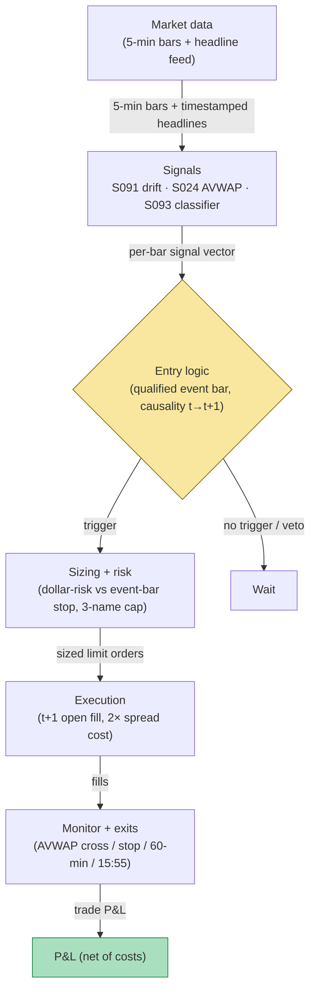

## Stage 167/200 — T067: Anchored-VWAP Event Trader

*Batch TB7 · Strategy 67/100 · Signals S024, S091, S093 · Provenance [D/SR]*

### T1. One-line verdict

| | |
|---|---|
| **Style** | Event-anchored intraday trend: re-anchor VWAP at the news print, trade the post-event drift while price holds the anchor |
| **Edge source** | Post-event drift (S091) — prices under-react to news in the first minutes; the anchored VWAP (S024) is the reference line that separates drift from reversal; the news classifier (S093) filters which events qualify |
| **Typical holding period** | 15 minutes to 2 hours post-event; flat 15:55 ET |
| **Capacity hint** | Event-driven and lumpy: 0–3 qualifying events per day in a 500-name universe; sizing is $200-risk (`example`) per event |
| **Build-or-buy in one line** | Build the anchor engine on bought bars; buy the news feed — the classifier is only as good as the timestamped headline stream behind it |

### T2. Full mechanics

**Universe & session.** Liquid US stocks, ADV ≥ 2M shares, price ≥ $10 (`example`). RTH 09:35–15:55 ET. Exclusions: the event must occur during RTH with a clean pre-event tape (no halt in the prior 30 minutes, `example`).

**Anchored VWAP.** An **anchored VWAP (AVWAP)** is the volume-weighted average price computed from a chosen anchor bar forward: `AVWAP_t = Σ(P_i × V_i)/ΣV_i` for bars `i ∈ [anchor, t]`. The anchor here is the **event bar** — the 5-minute bar containing the news timestamp. Unlike session VWAP, the AVWAP resets its memory at the event: it measures the market's average price *since the news*, which is the reference a post-event drift trader actually needs.

**Event qualification (S093).** A qualifying event: (1) a timestamped headline from the news feed during RTH; (2) the event bar's range ≥ 2.0× the 20-bar median range (`example`); (3) the event bar's volume ≥ 2.0× the slot median (`example`); (4) the headline classifier tags it directional (earnings surprise language, guidance change, analyst action, M&A — `example` categories) rather than noise (rumor, rehash, "shares halted"). Non-directional or ambiguous headlines are vetoed — the strategy trades drift, not confusion.

**Entry rule.** At event bar *t* (news timestamp inside bar *t*): if qualified and the bar closes in the top/bottom third of its range in the headline's direction, enter with the drift. Signal at *t* → fill at the open of *t+1* (`example`). One event trade per name per day (`example`).

**Exit rule.** (`example`): (1) AVWAP cross against the position — the drift has failed vs the post-news average price; (2) stop at the event-bar extreme ∓ 0.3× ATR (Average True Range — the trailing 14-bar mean of per-bar ranges, a volatility ruler in price units) (a full retrace of the event bar invalidates the news read); (3) time stop — exit 60 minutes after entry or 15:55 ET, whichever first (S091 drift decays); (4) a second headline reversing the first → exit at next open.

**Position sizing.** `N = ⌊ R / |P_entry − P_stop| ⌋`, `R = $200` (`example`). Max 3 concurrent event trades (`example`) — headlines cluster.

**Risk limits.** Daily loss stop −3R (`example`); no new event trades after 15:00 ET (`example` — late headlines leave no drift window before the auction book takes over); kill-switch on stale news feed (> 5 minutes without a heartbeat, `example`).

**Cost model.** Commission $0.005/share/side (`example`); half-spread each way. Event bars are wide-spread bars — the model assumes a 2× normal spread on the t+1 fill (`example`), same honesty rule as T062.

**Order/execution sketch.** Marketable limit at the t+1 open (`example`); participation ≤ 10% of bar volume (`example`); taker modeling. Never pre-position on rumor — the entry requires the qualified event bar to have *closed*.

### T3. Signals it consumes

| Signal | Role | Weight / logic |
|---|---|---|
| S091 (event drift) | Primary trigger | Qualified headline + event-bar confirmation; direction = headline direction confirmed by bar close |
| S024 (VWAP, anchored) | Reference + exit | AVWAP from the event bar; the against-position cross is the primary exit |
| S093 (news classifier) | Filter | Directional-vs-noise tagging; vetoes ambiguous headlines and rumor-class items |

Combination logic (pseudocode, 22 lines):

```
# on each 5-min bar close t with headline timestamp in t   # S091
if halted_last_30min or t > 15:00 ET: wait
if range[t] < 2.0*median(range,20): wait                  # example
if volume[t] < 2.0*slot_median(volume): wait              # example
tag = classify(headline[t])                               # S093
if tag not in {BULLISH, BEARISH}: wait                    # veto noise
if not closes_in_extreme_third(t, tag): wait
side = LONG if tag == BULLISH else SHORT
# signal at t -> fill at open[t+1]
entry = open[t+1] (2x spread cost)                        # example
avwap = AVWAP(anchor=t)                                   # S024
stop = extreme[t] -/+ 0.3 * ATR(14)                       # example
N = floor(200 / abs(entry - stop))
exit on AVWAP cross vs position                           # S024
exit 60 min after entry or 15:55 ET                       # S091 decay
exit next open on reversing headline
```

### T4. Worked example — numbers + P&L (SYNTHETIC)

Synthetic 5-minute bars, equity PQR, seed 167. 10:42 ET: headline "PQR raises FY guidance" (S093 tags BULLISH, directional). Event bar 10:40–10:45: range **0.90** vs 20-bar median 0.30 (3.0× — qualifies), volume 2.6× slot median, closes **25.60** in the top third of the bar. AVWAP anchored at 10:40. Signal at *t* = 10:45 close → fill long at the 10:50 open: **25.66** (2× spread cost embedded).

Stop = event-bar low 25.15 − 0.3×ATR(0.35) = **25.045** → 25.05; risk/share = 0.61; `N = ⌊200/0.61⌋` = **327 shares**. The drift holds above the AVWAP for 40 minutes; at 11:35 the bar closes below the AVWAP → exit at the next open: **26.10**.

Ledger:

| Leg | Price | Shares | Amount |
|---|---|---|---|
| Buy (10:50 open) | 25.66 | 327 | −8,390.82 |
| Sell (11:40 open, AVWAP cross) | 26.10 | 327 | +8,534.70 |
| Gross | | | **+143.88** |
| Commission (327 × $0.01 round-trip) | | | −3.27 |
| **Net** | | | **+$140.61** |

**Where the example is optimistic.** The headline timestamp is assumed accurate to the bar — real news feeds have variable latency, and a 1–3 minute delay means the "event bar" you trade is not the event bar the market traded. The S093 classifier is assumed correct; misclassified headlines (bullish tag on a "raises guidance but cuts margin outlook" release) are a real and frequent loser. The 2× spread cost is a guess — post-headline spreads can be far wider. The AVWAP exit at 26.10 assumes a clean fill; the cross bar itself is often fast. And this is a winning example chosen for illustration — post-event drift exists on average in the literature, but the per-event variance is enormous and the median qualified event is roughly a scratch after costs (illustrative).

### T5. Data & infra — what must run

Two feeds: (1) 1-minute/5-minute OHLCV for 500 names (195,000 bars/day; 60 days ≈ 3GB per the cost model); (2) a timestamped headline stream with machine-readable timestamps — the strategy's critical path. Per-bar state: AVWAP from each open event anchor (a handful of anchors per day, O(1) each), 20-bar median range, slot-median volume, 14-bar ATR. Working set far below ~77GB; Polars-class throughput (~10–50M rows/sec planning assumption) is ample. Harness: Tier M+ band, 40–100 hours ($6,000–$15,000 loaded at $150/hour) — the anchor engine is simple; the hours are the news-feed integration (timestamp normalization, duplicate-headline dedup, heartbeat monitoring) and the replay discipline (headlines must be injected at their *feed-arrival* time, not their *publication* time — the difference is the look-ahead trap). **M5 Max feasibility verdict: yes** — the constraint is the news-feed license, not compute. Failure plan: news-feed heartbeat missed → no new event trades; open event trades keep AVWAP exits and stops; flatten 15:55 ET.

### T6. Buy vs build

Retail: **QuantConnect** (~$60–$300/mo class, `indicative — verify before budgeting`); **IBKR paper** (no incremental platform fee on an existing account, `indicative — verify before budgeting`). News: retail-grade headline streams (e.g., Benzinga Newsfeed standard tier, `indicative — verify before budgeting`) carry timestamps but with variable latency; professional: **Bloomberg Event-Driven Feeds / RavenPack** (enterprise pricing, `indicative — verify before budgeting`). Bars: **Massive Stocks Advanced** (~$199/mo, `indicative — verify before budgeting`). Verdict: **buy the news feed, build the anchor engine.** A timestamped headline stream cannot be built; the AVWAP-and-drift logic around it is twenty lines. Crossover: if the news-feed cost exceeds the strategy's expected monthly P&L at your size, drop the strategy — like T065's imbalance feed, the feed is the edge's price tag.

### T7. Success-ratio evidence

| Source | What it documents | Relevance / caveat |
|---|---|---|
| Tetlock, P.C. "Giving Content to Investor Sentiment: The Role of Media in the Stock Market" (JF 2007) https://doi.org/10.1111/j.1540-6261.2007.01232.x | News media content predicts stock returns; negative news predicts downward pressure with a reversal | Supports the premise that timestamped news moves prices with a tradeable drift window; it is daily-horizon, not intraday |
| MacKinlay, A.C. "Event Studies in Economics and Finance" (JEL 1997) http://ideas.repec.org/a/aea/jeclit/v35y1997i1p13-39.html | Event-study methodology: measuring abnormal returns around identified events | The methodological backbone — the strategy *is* an intraday event study with a position attached; it does not bless any threshold |
| Heston, Korajczyk & Sadka, "Intraday Patterns in the Cross-Section of Stock Returns" (JF 2010) https://www.kellogg.northwestern.edu/faculty/korajczy/htm/HestonKorajczykSadkaJF2010.htm | Intraday return structure incl. short-horizon continuation | General intraday-drift background; the AVWAP packaging is the strategy's own `[D/SR]` |

Capacity/crowding/decay: post-news drift is competed over by every event-driven desk with a faster feed; the retail-readable version of this strategy trades the *residue* after the fast money has moved. Honest bottom line: for a ≤$1M paper operation, this is a feed-gated strategy — paper-trade it only with the actual timestamped feed you would trade live, because feed latency *is* the backtest. For an institutional desk, news-drift is a standard input, and the desk's edge is feed speed and classifier quality, not the AVWAP rule.

### T8. Failure modes

- **Regime: news latency.** A feed that is 2 minutes slower than the market turns every "drift" into a fade-the-top. *Mitigation:* measure feed latency vs the event bar's volume spike in the replay; if the volume precedes your timestamp, the feed is too slow to trade.
- **Crowding: the headline is public.** The drift window shrinks as more participants automate it. *Mitigation:* the event-bar confirmation filter (only trade headlines the market itself confirms); track per-category hit rates and retire dead categories.
- **Latency: publication time vs arrival time.** Using the headline's *publication* timestamp in research while trading on *arrival* latency is the classic look-ahead. *Mitigation:* replay injects at arrival time; the harness asserts it.
- **Costs: post-event spreads.** *Mitigation:* the 2× spread assumption; abort if the t+1 spread exceeds 4× normal (`example`).
- **Overfit: 2.0×/2.0×/0.3×/60-min.** All `example`. *Mitigation:* walk-forward with embargo; the classifier categories are the real overfit surface — freeze them before the walk-forward, not during.
- **Operations: duplicate/retracted headlines.** A retraction after entry is an immediate exit signal, not a hold. *Mitigation:* dedup on headline ID; retraction = exit at next open.

### T9. Visuals


*Chart caption: synthetic data — not market data. Watermark reads "SYNTHETIC EXAMPLE" exactly.*



### T10. Sources

1. Tetlock, P.C. "Giving Content to Investor Sentiment: The Role of Media in the Stock Market." *Journal of Finance* 62(3), 1139–1168 (2007). https://doi.org/10.1111/j.1540-6261.2007.01232.x — media content predicts returns; news-driven pressure with reversal. DOI metadata verified 2026-09-10.
2. MacKinlay, A.C. "Event Studies in Economics and Finance." *Journal of Economic Literature* 35(1), 13–39 (1997). http://ideas.repec.org/a/aea/jeclit/v35y1997i1p13-39.html — event-study methodology. Title verified 2026-09-10.
3. Heston, S.L., Korajczyk, R.A. & Sadka, R. "Intraday Patterns in the Cross-Section of Stock Returns." *Journal of Finance* 65(4), 1369–1407 (2010). https://www.kellogg.northwestern.edu/faculty/korajczy/htm/HestonKorajczykSadkaJF2010.htm — intraday return structure. Title verified 2026-09-10.

**Unverified leads** (not confirmed facts — verify before use):
- Grok Q-TB7-3 news-drift specifics (event-window lengths, per-category drift magnitudes) — named-only, no verifiable source captured; treat as leads.
- The headline classifier's categories and all bar/volume thresholds are illustrative (`example`); no verified study of intraday AVWAP-anchored news trading was found in this pass.

*Source log: Grok answered Q-TB7-1..3 (2026-09-10); all claims independently verified or labeled unverified.*
