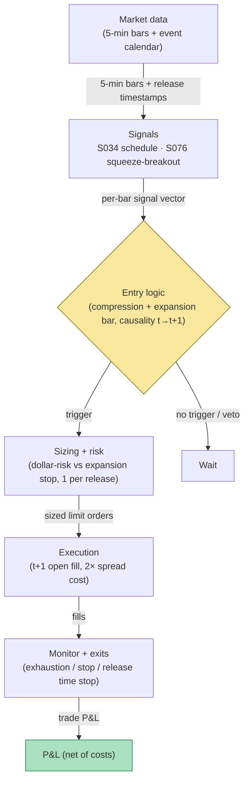

## Stage 168/200 — T068: Scheduled-Event Vol Expansion

*Batch TB7 · Strategy 68/100 · Signals S034, S076 · Provenance [D/SR]*

### T1. One-line verdict

| | |
|---|---|
| **Style** | Event-volatility breakout: buy the post-release expansion after scheduled macro events, in the direction of the release surprise |
| **Edge source** | Scheduled announcements resolve uncertainty and volatility expands (S034); the reactive side read sets the trade side; the pre-release compression → post-release expansion-breakout trigger (S076) times the entry |
| **Typical holding period** | 15 minutes to 2 hours post-release; flat 15:55 ET |
| **Capacity hint** | Sparse: 8 FOMC (Federal Open Market Committee) + 12 CPI (Consumer Price Index)/NFP (non-farm payrolls) days a year dominate; the strategy trades a handful of days per month, sized at $200-risk (`example`) per event |
| **Build-or-buy in one line** | Build the expansion-breakout rule on bought bars; the economic calendar is a commodity feed — buy the cheapest timestamped one |

### T2. Full mechanics

**Universe & session.** Liquid macro-sensitive instruments: SPY/QQQ and large-cap leaders (`example`). Event days only: FOMC decisions (14:00 ET), CPI/PPI (08:30 ET), NFP (08:30 ET), plus ECB (European Central Bank)/BOJ (Bank of Japan) decisions for the overnight session where traded (`example` list). Non-event days: the strategy does nothing.

**Volatility expansion (S076 — volatility breakout / squeeze positioning).** Scheduled releases resolve uncertainty and realized volatility expands after the print — the pattern documented by Ederington & Lee (1996) for scheduled announcements. Define the **pre-release compression**: the 30-minute realized range before the release ≤ 0.5× the 20-day median 30-minute range (`example`). Define **expansion**: the first post-release 5-minute bar range ≥ 2.0× the pre-release 30-minute range (`example`).

**Reactive side selection (strategy logic).** The trade side comes from the surprise: for FOMC, the 2-minute move in the front-month futures or the SPY tick in the release direction; operationally, the direction of the first post-release 5-minute bar's close (`example`) — the strategy follows the market's own verdict rather than forecasting the surprise. This is deliberately *reactive*: forecasting the surprise is a different (and harder) game.

**Entry rule.** At the first post-release 5-minute bar *t* that satisfies expansion: if it closes in the top/bottom third of its range, trade with it. Signal at *t* → fill at the open of *t+1* (`example`). One event trade per release (`example`).

**Exit rule.** (`example`): (1) expansion-exhaustion — a subsequent 5-minute bar closes against the position by more than the entry bar's range → exit next open; (2) stop at the entry-bar extreme ∓ 0.5× the pre-release 30-minute range (a full retrace of the expansion bar invalidates the breakout); (3) time stop — FOMC trades exit by 15:55 ET; CPI/NFP (08:30 releases) trades exit by 11:30 ET (`example` — the morning expansion decays into the midday lull).

**Position sizing.** `N = ⌊ R / |P_entry − P_stop| ⌋`, `R = $200` (`example`). Max 1 position per release.

**Risk limits.** Daily loss stop −3R (`example`); if the first post-release bar does *not* expand (a "dud" release), there is no trade — never force one; kill-switch on a missing calendar entry (an unscheduled headline is not this strategy's trade).

**Cost model.** Commission $0.005/share/side (`example`); half-spread each way. Post-release spreads are wide — the model assumes 2× normal spread on the t+1 fill (`example`).

**Order/execution sketch.** Marketable limit at the t+1 open (`example`); participation ≤ 10% of bar volume (`example`); taker modeling. Never enter *before* the release — this is not a straddle strategy and takes no position into the announcement.

### T3. Signals it consumes

| Signal | Role | Weight / logic |
|---|---|---|
| S034 (scheduled macro-announcement drift) | Primary trigger (schedule/context) | Timestamped release list; defines event days, release times, and the pre-release window — scheduled releases resolve uncertainty into realized-vol expansion (Ederington & Lee 1996); the calendar gate that arms the strategy on event days |
| S076 (volatility breakout / squeeze positioning) | Breakout trigger | Pre-release compression (≤ 0.5× median, `example`) + first post-release bar expansion (≥ 2.0×, `example`) — the compression→expansion volatility-breakout / squeeze-positioning trigger |
| Reactive side read (strategy logic, not a signal) | Side selector | Direction of the first expansion bar's close (`example` reactive read); no pre-release forecasting |

Combination logic (pseudocode, 20 lines):

```
# on scheduled release day, release time R        # S076
pre = range(bars[R-30min : R])                    # pre-release window
if pre > 0.5 * median(range30, 20d): wait         # no compression, example
# first 5-min bar t after R
if range[t] < 2.0 * pre: wait                    # dud release, example
if not closes_in_extreme_third(t): wait
side = LONG if close[t] > mid(range[t]) else SHORT  # reactive side read (example)
# signal at t -> fill at open[t+1]
entry = open[t+1] (2x spread cost)                 # example
stop = extreme[t] -/+ 0.5 * pre                   # example
N = floor(200 / abs(entry - stop))
exit on against-close > entry-bar range           # S034 exhaustion
flatten_at(15:55 ET or 11:30 ET)                  # release-dependent
```

### T4. Worked example — numbers + P&L (SYNTHETIC)

Synthetic 5-minute bars, SPY, FOMC day, seed 168. Release 14:00 ET. Pre-release 30-minute range (13:30–14:00): **0.42** vs 20-day median 1.05 (0.40× ≤ 0.5 — compressed, `example`). First post-release bar 14:00–14:05: range **1.30** (3.1× the pre-release range — expansion), closes **601.20** in the top third. Signal at *t* = 14:05 close → fill long at the 14:10 open: **601.35** (2× spread cost embedded).

Stop = entry-bar low 600.40 − 0.5×0.42 = **600.19**; risk/share = 1.16; `N = ⌊200/1.16⌋` = **172 shares**. The expansion continues; the 15:20 bar closes against the position by more than the entry-bar range → exit at the next open: **603.10**.

Ledger:

| Leg | Price | Shares | Amount |
|---|---|---|---|
| Buy (14:10 open) | 601.35 | 172 | −103,432.20 |
| Sell (15:25 open) | 603.10 | 172 | +103,733.20 |
| Gross | | | **+301.00** |
| Commission (172 × $0.01 round-trip) | | | −1.72 |
| **Net** | | | **+$299.28** |

**Where the example is optimistic.** The expansion bar is clean and directional; real FOMC bars whipsaw — the 14:00–14:05 bar frequently reverses in the 14:05–14:10 bar, and the t+1 fill then starts underwater. The 2× spread cost understates post-FOMC spreads, which can be far wider for minutes. The exit at 603.10 assumes the exhaustion signal fires on a closed bar and fills cleanly at the next open; in a fast tape the "against close" bar gaps. The compression pre-condition (0.5×) is `example` — some of the best FOMC trends come *without* clean pre-release compression. And this is a winning example: roughly half of expansion breakouts (illustrative) reverse within 30 minutes, and the stop at 600.19 is a full −$200 loser when they do.

### T5. Data & infra — what must run

Per event day: 1-minute/5-minute OHLCV for the traded names plus the timestamped calendar entry (release time to the minute). Pre-release: 20-day median 30-minute ranges; post-release: the expansion-bar logic. Data volume is small (event days only), but the calendar must be *correct* — a wrong release time is a wrong strategy. Footprint: bars trivial per the cost model; calendar entries are bytes. Harness: Tier M+ band, 40–100 hours ($6,000–$15,000 loaded at $150/hour) — the breakout rule is simple; the hours are the calendar feed (holiday shifts, release-time changes, "tentative" releases that move) and the replay discipline (the release timestamp must be the *announcement* time, and the pre-release window must exclude it). **M5 Max feasibility verdict: yes.** Failure plan: calendar entry missing or ambiguous → no trade; a release that doesn't expand → no trade (the dud rule); flatten at the release-dependent time stop.

### T6. Buy vs build

Retail: **QuantConnect** (~$60–$300/mo class, `indicative — verify before budgeting`); **IBKR paper** (no incremental platform fee on an existing account, `indicative — verify before budgeting`). Calendar: free economic calendars (ForexFactory-class, `indicative — verify before budgeting`) are adequate for FOMC/CPI/NFP timestamps — verify release times against the issuing agency, not the aggregator. Bars: **Massive Stocks Advanced** (~$199/mo, `indicative — verify before budgeting`). Verdict: **build on a bought-or-free calendar.** The calendar is a commodity; the expansion-breakout rule is twenty lines. Crossover: none — but if you want the *surprise* forecast (consensus vs actual), that is a separate data product and a separate strategy.

### T7. Success-ratio evidence

| Source | What it documents | Relevance / caveat |
|---|---|---|
| Ederington, L.H. & Lee, J.H. "The Creation and Resolution of Market Uncertainty: The Impact of Information Releases on Implied Volatility" (JFQA 1996) https://ideas.Repec.org/a/cup/jfinqa/v31y1996i04p513-539_02.html | Implied volatility impounds the anticipated impact of scheduled macro releases (employment report, PPI) before the release and declines as uncertainty resolves after | Direct support for the expansion premise — scheduled releases resolve uncertainty into volatility; it does not bless a directional breakout rule |
| Andersen, T.G. & Bollerslev, T. "Deutsche Mark–Dollar Volatility: Intraday Activity Patterns, Macroeconomic Announcements, and Longer Run Dependencies" (NBER 5783) https://EconPapers.RePEc.org/paper/nbrnberwo/5783.htm | Macro announcements drive intraday volatility patterns; volatility has long-memory structure | Supports announcement-driven vol expansion; FX, not US equities — direction only |
| Corsi, F. "A Simple Approximate Long-Memory Model of Realized Volatility" (J. Financial Econometrics 2009) https://econpapers.repec.org/RePEc:oup:jfinec:v:7:y:2009:i:2:p:174-196 | HAR-RV: daily/weekly/monthly realized-vol components forecast volatility | The forecasting backbone for the compression/expansion measurement; a vol model, not a trading rule |

Capacity/crowding/decay: FOMC/CPI volatility is the most studied event pattern in markets; the *expansion* is well known, the *directional* breakout rule is the strategy's own `[D/SR]`. Crucially, options markets price the expected expansion — implied volatilities rise into the release — so the underlying's move must exceed the *priced* move for any vol-linked P&L; this directional rule sidesteps that by trading direction, not vol, but the crowdedness of the post-release tape remains. Honest bottom line: for a ≤$1M paper operation, this is a part-time strategy — a dozen tradable days a year — and should be sized as a hobby sleeve, not a book. For an institutional desk, event vol is traded in options, not in the underlying's first 5-minute bar.

### T8. Failure modes

- **Regime: the priced move.** Options already impound the expected expansion; the underlying's directional move can be violent yet unprofitable after the whipsaw. *Mitigation:* the reactive (not predictive) entry; the dud-release rule keeps you out of non-events.
- **Crowding: the post-release tape.** The first minutes after FOMC are the most competitive tape of the month. *Mitigation:* 2× spread assumption; participation cap; accept that the t+1 fill is often the worst fill of the trade.
- **Latency: release-time accuracy.** A calendar that says 14:00 when the statement drops at 14:00:37 is fine; a calendar that is a day off is a disaster. *Mitigation:* verify release times against the issuing agency; heartbeat on the calendar feed.
- **Costs: post-release spreads.** *Mitigation:* modeled at 2×; abort if the t+1 spread exceeds 4× normal (`example`).
- **Overfit: 0.5× / 2.0× / 0.5×.** All `example`. *Mitigation:* walk-forward across release types; these are filters, not optima.
- **Operations: unscheduled headlines.** An unscheduled headline during the pre-release window contaminates the compression read. *Mitigation:* the news-feed veto from T067 — any RTH headline in the pre-release window voids the setup.

### T9. Visuals


*Chart caption: synthetic data — not market data. Watermark reads "SYNTHETIC EXAMPLE" exactly.*



### T10. Sources

1. Ederington, L.H. & Lee, J.H. "The Creation and Resolution of Market Uncertainty: The Impact of Information Releases on Implied Volatility." *Journal of Financial and Quantitative Analysis* 31(4), 513–539 (1996). https://ideas.Repec.org/a/cup/jfinqa/v31y1996i04p513-539_02.html — implied volatility around scheduled macro announcements (employment report, PPI), not FOMC. Verified against the live RePEc record on 2026-09-10 (title, authors, journal, volume/pages match the corrected entry).
2. Andersen, T.G. & Bollerslev, T. "Deutsche Mark–Dollar Volatility: Intraday Activity Patterns, Macroeconomic Announcements, and Longer Run Dependencies." NBER Working Paper 5783. https://EconPapers.RePEc.org/paper/nbrnberwo/5783.htm — macro announcements and intraday volatility. Title verified 2026-09-10.
3. Corsi, F. "A Simple Approximate Long-Memory Model of Realized Volatility." *Journal of Financial Econometrics* 7(2), 174–196 (2009). https://econpapers.repec.org/RePEc:oup:jfinec:v:7:y:2009:i:2:p:174-196 — HAR-RV long-memory vol model. Title verified 2026-09-10.

**Unverified leads** (not confirmed facts — verify before use):
- Grok Q-TB7-3 scheduled-event specifics (pre/post volatility ratios, e.g., "FOMC-day volume 1.5–2× normal") — named-only, no verifiable source captured; treat as leads.
- All compression, expansion, and stop multipliers are illustrative (`example`); the directional breakout rule is the strategy's own reconstruction `[D/SR]`.

*Source log: Grok answered Q-TB7-1..3 (2026-09-10); all claims independently verified or labeled unverified.*
