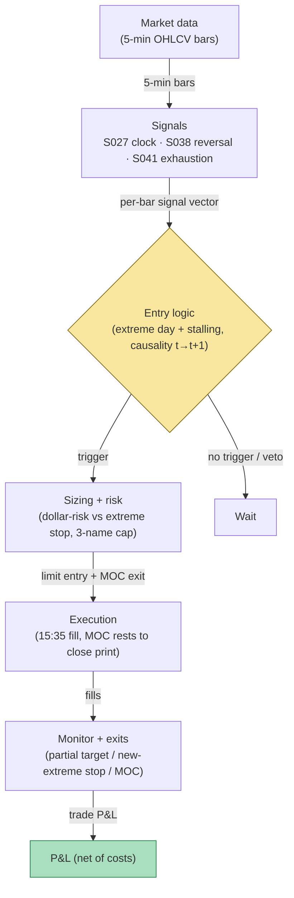

## Stage 169/200 — T069: Late-Day Reversal into Close

*Batch TB7 · Strategy 69/100 · Signals S027, S038, S041 · Provenance [D/SR]*

### T1. One-line verdict

| | |
|---|---|
| **Style** | Late-session mean-reversion: fade the day's extreme move in the last 30 minutes as intraday inventory mean-reverts into the close |
| **Edge source** | Intraday reversal of liquidity-driven extremes (S038/S041) timed by the session clock (S027) — the day's inventory imbalances get worked off before the closing auction |
| **Typical holding period** | 10–30 minutes; flat at the closing auction (MOC into the cross) |
| **Capacity hint** | Good in liquid names: the last 30 minutes are deep; sizing is $200-risk (`example`) per fade |
| **Build-or-buy in one line** | Build on 5-minute bars — a day-range position metric, an exhaustion read, and a clock; nothing to buy |

### T2. Full mechanics

**Universe & session.** Liquid US stocks/ETFs, ADV ≥ 5M shares, price ≥ $10 (`example`). Trading window 15:30–15:59 ET only — the strategy exists exclusively in the last half hour. Exclusions: index-rebalance days (the close is an index event — see T070), FOMC days after 14:00 (the afternoon is a news tape), earnings days.

**Extreme-day definition.** At 15:30, compute the day's range position: `day_pos = (close_15:30 − day_low) / (day_high − day_low)`. An **extreme day** long-fade candidate: `day_pos ≥ 0.85` (`example`) — the name is pinned near its high; short-fade candidate: `day_pos ≤ 0.15` (`example`). Add the exhaustion read (S041): the 15:00–15:30 advance must show deceleration — the last 30-minute bar's range ≤ 0.7× the prior 30-minute bar's range (`example`) — so the fade triggers on a *stalling* extreme, not a running one.

**Inventory rationale.** The working assumption `[D]`: intraday market-maker and program inventory accumulated during the day's trend gets worked off into the close, producing a partial reversal of the extreme. This is a framing story, not a measured inventory series — the strategy trades the price pattern, not observed positioning.

**Entry rule.** At the 15:30 bar close *t*: extreme-day + deceleration conditions met. Fade direction: short if pinned near the high, long if pinned near the low. Signal at *t* → fill at the 15:35 open (`example`). One fade per name per day (`example`).

**Exit rule.** (`example`): (1) MOC exit — submit a market-on-close order to flatten into the official closing cross (the strategy's natural endpoint; the MOC rests until the official auction print); (2) stop — if price makes a *new* day extreme after entry (the trend re-accelerates), exit at the next open immediately; (3) partial target — cover half at 50% of the entry-to-day-extreme distance (`example`).

**Position sizing.** `N = ⌊ R / |P_entry − P_stop| ⌋`, `R = $200` (`example`), with the stop defined as the day extreme + 0.25× the day's range (`example`). Max 3 concurrent fades (`example`).

**Risk limits.** Daily loss stop −3R (`example`); the new-day-extreme stop is hard — no second chances in the last 20 minutes; kill-switch on stale bars.

**Cost model.** Commission $0.005/share/side (`example`); entry pays half-spread on the continuous fill; the MOC exit crosses at the official close print with no spread — but the close print can differ from the 15:59 quote by the auction imbalance, which the model books as slippage, not as alpha.

**Order/execution sketch.** Limit entry at the 15:35 open (`example`); MOC submitted by the broker's cutoff (before 15:50 ET, `example`); the MOC rests until the official closing print. Participation ≤ 10% of bar volume (`example`).

### T3. Signals it consumes

| Signal | Role | Weight / logic |
|---|---|---|
| S027 (time-based) | Session gate | Defines the 15:30–15:59 window; owns the clock and the MOC cutoff |
| S038 (late-day reversal) | Primary trigger | Extreme-day position (`day_pos ≥ 0.85 / ≤ 0.15`, `example`) + deceleration (last 30-min range ≤ 0.7× prior, `example`) |
| S041 (exhaustion) | Confirmation | The stalling read — rejects extremes that are still accelerating into 15:30 |

Combination logic (pseudocode, 21 lines):

```
# at 15:30 bar close t                            # S027
day_pos = (close[t] - day_low) / (day_high - day_low)
decel = range(bars[15:00-15:30]) <= 0.7 * range(bars[14:30-15:00])  # example
if day_pos >= 0.85 and decel: side = SHORT         # S038 + S041
elif day_pos <= 0.15 and decel: side = LONG
else: wait
# signal at t -> fill at open[t+1] = 15:35
entry = open[t+1]
stop = day_high + 0.25 * day_range (for SHORT)     # example
N = floor(200 / abs(entry - stop))
submit MOC to flatten at the close                # S027
exit next open on new day extreme                 # invalidation
cover half at 50% retrace of entry-to-extreme     # example
```

### T4. Worked example — numbers + P&L (SYNTHETIC)

Synthetic 5-minute bars, equity STU, seed 169. The day trends up: day high **55.90**, day low 54.20, day range 1.70. At 15:30: close **55.72** → `day_pos = (55.72 − 54.20)/1.70` = 0.894 (≥ 0.85 — extreme, `example`). Deceleration: 15:00–15:30 range 0.28 vs 14:30–15:00 range 0.45 (0.62× ≤ 0.7 — stalling, `example`). Signal at *t* = 15:30 close → fill short at the 15:35 open: **55.68**.

Stop = day high + 0.25×range = `55.90 + 0.425` = **56.325** → 56.33; risk/share = 0.65; `N = ⌊200/0.65⌋` = **307 shares**. The reversal comes: the partial target is 50% of the entry-to-day-extreme distance — `(55.90 − 55.68) × 0.5` = 0.11, target `55.68 − 0.11` = **55.57** (`example`). Cover 153 at 55.57: gross = `153 × 0.11` = +16.83. Remainder 154 shares ride the MOC: official close print **55.42**; gross = `154 × (55.68 − 55.42)` = +40.04. Total gross = +56.87. Commission = 307 × 0.01 = −3.07. Net = **+$53.80**.

Session ledger:

| Leg | Price | Shares | Gross |
|---|---|---|---|
| Short (15:35 open) | 55.68 | 307 | — |
| Cover half (retrace target) | 55.57 | 153 | +16.83 |
| MOC flatten (official close) | 55.42 | 154 | +40.04 |
| Commission | | | −3.07 |
| **Net** | | | **+$53.80** |

A small winning example — deliberately small, because the window is 25 minutes and the edge (if any) is a partial retrace, not a trend.

**Where the example is optimistic.** The deceleration read uses completed 30-minute bars — respected — but the fill at the 15:35 open assumes no gap on a stalling tape; late-day tapes gap. The MOC exit at the official close print 55.42 assumes the auction imbalance doesn't run against the position; on real closes the print can differ from the 15:59 quote by several cents either way. The inventory story is `[D]` framing — no inventory is observed. The new-day-extreme stop is assumed fillable at the next open; in the last 15 minutes a re-accelerating trend gaps over stops. And the partial-target fill at exactly 55.57 assumes a resting limit gets filled — late-day limits at exact levels often don't.

### T5. Data & infra — what must run

5-minute OHLCV for 500 names through 15:59 plus the closing-auction print; per-bar state: running day high/low, 30-minute ranges, the MOC order state machine. Data: 195,000 bars/day, trivial; 60 days ≈ 3GB per the cost model; working set far below ~77GB; Polars-class throughput (~10–50M rows/sec planning assumption) ample. Harness: Tier M+ band, 40–100 hours ($6,000–$15,000 loaded at $150/hour) — the rule is simple; the hours are the MOC order-type state machine (cutoffs, cancel/replace rules, the auction-print fill) and the rebalance-day calendar. **M5 Max feasibility verdict: yes.** Failure plan: stale feed after 15:30 → no new fades; open fades keep the new-extreme stop and the MOC; a halt in the last 30 minutes → cancel the MOC and flatten on the resume (`example`).

### T6. Buy vs build

Retail: **QuantConnect** (~$60–$300/mo class, `indicative — verify before budgeting`); **IBKR paper** (no incremental platform fee on an existing account, `indicative — verify before budgeting`) — supports MOC routing for live testing. Bars: **Massive Stocks Advanced** (~$199/mo, `indicative — verify before budgeting`). Verdict: **build.** The rule is a day-range position plus a clock; no vendor product is needed. Crossover: none — though if you want the *actual* closing-auction imbalance feed to time the MOC (rather than fading blind into it), that is T070's feed and T070's cost-benefit applies.

### T7. Success-ratio evidence

| Source | What it documents | Relevance / caveat |
|---|---|---|
| Heston, Korajczyk & Sadka, "Intraday Patterns in the Cross-Section of Stock Returns" (JF 2010) https://www.kellogg.northwestern.edu/faculty/korajczy/htm/HestonKorajczykSadkaJF2010.htm | Short-term reversal tied to temporary liquidity imbalances; same-interval seasonality | The reversal premise for fading liquidity-driven extremes; the 15:30 timing is the strategy's own |
| Lou, Polk & Skouras, "A Tug of War: Overnight versus Intraday Expected Returns" (JFE 2019) https://researchonline.lse.ac.uk/id/eprint/87481/ (DOI: 10.1016/j.jfineco.2019.03.011) | Intraday vs overnight return decomposition; intraday reversals vs overnight momentum | Documents that intraday returns mean-revert while overnight trends — supports fading the *day's* extreme rather than chasing it |
| Cushing, D. & Madhavan, A. "Stock Returns and Trading at the Close" (J. Financial Markets 2000) https://repec.udesa.edu.ar/pub/Finanzas/Journals/Journal%20of%20Financial%20markets/2000/Volume%203,%20Issue%201/Stock%20returns%20and%20trading%20at%20the%20close.pdf | Trading concentration and return behavior at the close | Documents close-session microstructure; relevant to the MOC exit mechanics, not to the fade's profitability |

Capacity/crowding/decay: late-day reversal is folk knowledge and the last 30 minutes are heavily traded; the deceleration filter is the differentiator and its 0.7×/0.85 constants are `example`. Honest bottom line: for a ≤$1M paper operation, this is a reasonable end-of-day sleeve — small targets, hard stops, and flat into the close every night, which is good book hygiene. For an institutional desk, the close is an execution problem (how to trade the auction), not a fade-the-extreme signal.

### T8. Failure modes

- **Regime: trend-into-close days.** On genuine news days the extreme extends into the auction and the fade funds it. *Mitigation:* the deceleration requirement plus the earnings/FOMC exclusion list; the new-day-extreme stop is the hard backstop.
- **Crowding: the 15:30 fade is consensus.** *Mitigation:* the stalling filter differentiates; the MOC exit avoids competing for the 15:59 continuous liquidity.
- **Latency: the 15:30 bar must be complete.** A partial bar's day_pos is wrong. *Mitigation:* signal only on the closed 15:30 bar; replay-harness assertion.
- **Costs: the MOC print vs the quote.** *Mitigation:* the auction-imbalance slippage is modeled as a cost; on rebalance days (excluded) it would dominate. As a standing control, log the difference between the 15:59 mid and the official close print on every fade day — if that difference starts trending against the position, the auction book has learned the fade and the MOC exit needs re-timing.
- **Overfit: 0.85/0.15/0.7×/0.25×.** All `example`. *Mitigation:* walk-forward with embargo; stress the extreme-day threshold first.
- **Operations: MOC cutoff misses.** A MOC submitted after the broker's cutoff may be rejected, leaving the position overnight. *Mitigation:* submit by 15:50 ET (`example`); a missed cutoff triggers an immediate market flatten — never carry the fade overnight.

### T9. Visuals


*Chart caption: synthetic data — not market data. Watermark reads "SYNTHETIC EXAMPLE" exactly.*



### T10. Sources

1. Heston, S.L., Korajczyk, R.A. & Sadka, R. "Intraday Patterns in the Cross-Section of Stock Returns." *Journal of Finance* 65(4), 1369–1407 (2010). https://www.kellogg.northwestern.edu/faculty/korajczy/htm/HestonKorajczykSadkaJF2010.htm — short-term reversal linked to temporary liquidity imbalances. Title verified 2026-09-10.
2. Lou, D., Polk, C. & Skouras, S. "A Tug of War: Overnight versus Intraday Expected Returns." *Journal of Financial Economics* (2019). https://researchonline.lse.ac.uk/id/eprint/87481/ — intraday reversal vs overnight momentum decomposition. DOI: 10.1016/j.jfineco.2019.03.011. Title verified 2026-09-10.
3. Cushing, D. & Madhavan, A. "Stock Returns and Trading at the Close." *Journal of Financial Markets* 3(1) (2000). https://repec.udesa.edu.ar/pub/Finanzas/Journals/Journal%20of%20Financial%20markets/2000/Volume%203,%20Issue%201/Stock%20returns%20and%20trading%20at%20the%20close.pdf — return behavior and trading at the close. Title verified 2026-09-10.

**Unverified leads** (not confirmed facts — verify before use):
- Grok Q-TB7-3 late-day specifics (e.g., "last 30 min ≈ 18–22% of daily volume"; "70–80% of large intraday reversals begin in the final 60–90 min") — named-only, no verifiable source captured; treat as leads.
- All extreme-day, deceleration, and stop constants are illustrative (`example`); the inventory framing is `[D]`.

*Source log: Grok answered Q-TB7-1..3 (2026-09-10); all claims independently verified or labeled unverified.*
