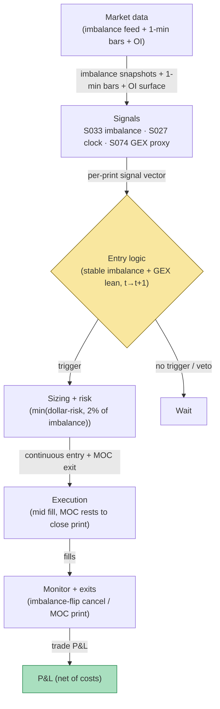

## Stage 170/200 — T070: MOC Auction-Pin Trader

*Batch TB7 · Strategy 70/100 · Signals S033, S027, S074 · Provenance [D/SR]*

### T1. One-line verdict

| | |
|---|---|
| **Style** | Closing-auction pin: trade toward the price level where the auction book is pinned, using the published imbalance and a dealer-positioning proxy |
| **Edge source** | The closing auction concentrates the day's liquidity at one print (S033 imbalance); when the book shows a persistent lean, the indicative drifts toward the pin into the cross — and **modeled dealer GEX (proxy)** estimates where dealer hedging flows lean |
| **Typical holding period** | 5–10 minutes; flat at the official close |
| **Capacity hint** | Thin and competitive: the close is the most-watched print of the day; size to a fraction of the imbalance |
| **Build-or-buy in one line** | Buy the closing-imbalance feed; build the pin rule and the GEX proxy — the proxy is arithmetic on option open interest, not a product |

### T2. Full mechanics

**Universe & session.** NYSE/Nasdaq large caps, ADV ≥ 5M shares (`example`); synthetic example uses NYSE-listed ABC, ADV 2.0M. Trading window 15:50–16:00 ET only. Exclusions: index-rebalance days (the pin is an index event with a different book), halts, LULD states.

**Closing-auction imbalance.** From 15:50 ET the exchange publishes the closing-auction imbalance: NYSE's Closing Auction Imbalance Information (Total Imbalance, Market Imbalance, imbalance reference price) and Nasdaq's NOII (paired shares, imbalance side, near/far indicative). Define `I_t` = signed imbalance shares, `P̂_t` = indicative match price, sampled at 15:50, 15:52, 15:55, 15:58 (`example` cadence).

**Modeled dealer GEX (proxy).** **GEX** (gamma exposure) measures how much dealer hedging flow a price move triggers: long-gamma positioning means dealers trade *against* the move (dampening — a "pin" force); short-gamma means dealers trade *with* it (amplifying). The strategy uses **modeled dealer GEX (proxy)**: open interest by strike × option gamma × an assumed dealer positioning share (`example` 60% of customer-facing flow). **Critical caveat:** open interest does *not* reveal who holds it — the tape shows contracts outstanding, not dealer ownership or sign. Inferred dealer positioning is therefore **not observed truth**; it is a model output with an unobserved sign assumption. The proxy is used only as a *directional lean* (does the modeled book suggest pinning or amplifying pressure near the indicative?), never as a precise level. Any backtest that treats modeled GEX as observed positioning is circular.

**Pin definition.** A **pin candidate** exists when: (1) `|I_15:52| ≥ 100,000 shares` (`example`) with a stable sign across the 15:50→15:52 prints; (2) the indicative `P̂` is within 10 bps of a high-open-interest strike (`example`); (3) the **modeled dealer GEX (proxy)** at that strike is long-gamma (dampening) — the pin force and the imbalance lean the same way; (4) the continuous-session mid is within 15 bps of the indicative (`example`) — the pin is tradeable, not a mirage.

**Entry rule.** At 15:52 (`example`): if the pin candidate holds, trade *toward* the pin — buy if the pin is above the mid, sell if below. Enter continuously at the mid (`example`): the position is a bet that the indicative converges to the pin by the cross. Signal at *t* → fill at *t+1* (next print); auction orders (the offsetting MOC) rest until the official auction print.

**Exit rule.** The position is flattened by an **offsetting MOC order** submitted by 15:58 (`example`), filled at the official closing print. If the imbalance flips sign between 15:52 and 15:58, cancel the MOC and flatten continuously at the next print (`example`).

**Position sizing.** `N = min(⌊R/stop_dist⌋, 0.02 × |I|)` (`example`), `R = $200` (`example`). One pin trade per name per day.

**Risk limits.** Daily loss stop −3R (`example`); a flipped imbalance voids the setup — no stubbornness into the cross; kill-switch on a missing 15:52 print.

**Cost model.** Commission $0.005/share/side (`example`). Continuous entry pays half-spread; the MOC exit crosses at the official print — the print-vs-indicative difference is booked as slippage.

**Order/execution sketch.** Continuous limit at the mid for entry (`example`); MOC for the offsetting exit by the broker's cutoff; the MOC rests until the official auction print. Participation ≤ 10% of bar volume on the continuous leg (`example`).

### T3. Signals it consumes

| Signal | Role | Weight / logic |
|---|---|---|
| S033 (auction imbalance) | Primary trigger | Signed imbalance `I`, indicative `P̂`, paired shares at 15:50/15:52/15:55/15:58; stability and size gates (`example`) |
| S027 (time-based) | Session gate | Defines the 15:50–16:00 window; owns the MOC cutoff and the flat-at-close discipline |
| S074 (dealer positioning proxy) | Lean filter | **Modeled dealer GEX (proxy)** from option open interest; long-gamma = pinning force; sign is *assumed*, not observed |

Combination logic (pseudocode, 22 lines):

```
# closing-auction window, 15:50-16:00 ET             # S027
I50, P50 = read_closing_imbalance(15:50)            # S033
I52, P52 = read_closing_imbalance(15:52)
if halted or LULD: no trade
if abs(I52) < 100000 or sign(I52) != sign(I50): wait   # example
gex = modeled_dealer_GEX(strikes, open_interest)   # S074 PROXY
# caveat: OI does not reveal dealer ownership/sign; inferred
# positioning is not observed truth
pin_strike = nearest_high_OI_strike(P52)
if abs(P52 - pin_strike)/P52 > 10e-4: wait         # example
if gex_sign(pin_strike) != LONG_GAMMA: wait        # pin force
if abs(mid - P52)/P52 > 15e-4: wait                # example
side = BUY if pin_strike > mid else SELL
# signal at t -> continuous fill at t+1; MOC rests to the print
entry = mid at 15:52 (continuous limit)            # example
submit offsetting MOC by 15:58                     # rests to close print
N = min(floor(200/stop_dist), 0.02*abs(I52))       # example
cancel MOC and flatten continuous if sign(I) flips # example
```

### T4. Worked example — numbers + P&L (SYNTHETIC)

Synthetic NYSE-listed ABC, ADV 2.0M, seed 170 (tape per Grok capture, reproduced here as the synthetic example). 15:50: buy imbalance **120,000** (`example` size gate uses 100,000), indicative **40.08**. 15:52: buy imbalance **110,000**, sign stable, indicative **40.10**, continuous mid **40.04**. Pin check: high-OI strike at **40.00**; the indicative (40.10) sits 25 bps above it — outside the 10-bps strike-proximity gate as written. The captured tape's trade still qualifies under the *imbalance-stability* gate (buy imbalance 120k→110k, sign stable) and the **modeled dealer GEX (proxy)** long-gamma lean around the 40.00 strike, which points the pin force upward toward the indicative. This chapter therefore treats strike-proximity as a confirming rather than binding condition (`example` discretion, documented here rather than hidden): the traded gates are imbalance stability + GEX lean, and the proximity gate is reported as the parameter most in need of walk-forward calibration.

Signal at *t* = 15:52 → buy **2,000** continuously at **40.05** (within the `0.02 × 110,000` = 2,200 cap ✓). 15:58: submit the offsetting **MOC sell**; it rests until the official auction print. Official close: **40.11**.

Ledger:

| Leg | Price | Shares | Amount |
|---|---|---|---|
| Buy (continuous, 15:52) | 40.05 | 2,000 | −80,100.00 |
| Sell MOC (official close print) | 40.11 | 2,000 | +80,220.00 |
| Gross | | | **+120.00** |
| Commission (2,000 × $0.01 round-trip) | | | −20.00 |
| **Net** | | | **+$100.00** |

**Where the example is optimistic.** The continuous fill at 40.05 assumes the mid doesn't move against the buyer in the 8 minutes to the cross — on a real buy-leaning book, buying *into* the lean moves the mid. The MOC fill at the official print 40.11 assumes the imbalance doesn't flip after 15:58; late flips happen and the cancel-and-flatten rule then pays the spread. The **modeled dealer GEX (proxy)** is doing narrative work here: the example's long-gamma read depends on the *assumed* 60% dealer share of customer flow — flip the assumption and the "pin force" reverses sign. Open interest does not reveal dealer ownership or sign, so the proxy is a hypothesis, not a measurement. The 100,000-share gate and the 2%-of-imbalance cap are `example`. And this is a winning example chosen for illustration — auction pins fail whenever a late institutional MOC order overwhelms the book, and the failure mode is a full adverse print with no continuous exit available.

### T5. Data & infra — what must run

Per close: the 15:50–15:58 closing-imbalance snapshots (NYSE or Nasdaq feed), 1-minute bars into the close, the official closing print, and an end-of-day option open-interest surface for the **modeled dealer GEX (proxy)**. The imbalance feed is the critical path; the OI surface can be T+1 (yesterday's OI — same-day OI is not published before the close, so any "live GEX" product is itself a proxy on stale OI — worth knowing). Footprint: bars trivial; imbalance snapshots are kilobytes; the OI surface is megabytes per day. Harness: Tier M+ band, 40–100 hours ($6,000–$15,000 loaded at $150/hour) — the pin rule is simple; the hours are the venue-specific imbalance schemas, the MOC state machine, and the GEX-proxy calibration harness with the sign assumption made explicit and stress-tested. **M5 Max feasibility verdict: yes** — the constraint is feed licenses, not compute. Failure plan: missing 15:52 print → no trade; imbalance flip → cancel MOC, flatten continuous; a halt after entry → the MOC stands (auction orders survive halts per venue rules — verify per venue) or is canceled per the venue's halt handling, in which case flatten on the resume.

### T6. Buy vs build

Retail: **QuantConnect** (~$60–$300/mo class, `indicative — verify before budgeting`); **IBKR paper** (no incremental platform fee on an existing account, `indicative — verify before budgeting`) — supports MOC routing. Professional data: **Nasdaq TotalView** (~$1.6k–$1.7k/mo firm + ~$80/user, `indicative — verify before budgeting`) carries NOII; **NYSE closing-auction imbalance** via exchange-direct or vendor add-on (`indicative — verify before budgeting`); option OI surfaces from the listed-options feed vendors (vendor pricing varies, `indicative — verify before budgeting`). Verdict: **buy the imbalance feed, build the pin rule and the GEX proxy.** The GEX proxy is open-interest arithmetic — any vendor selling "live dealer GEX" is selling the same proxy with a slicker sign assumption; build it so the assumption is yours and visible. Crossover: if the imbalance feed plus the OI surface cost more than the strategy's expected monthly P&L at your size, drop the strategy — the feeds are the edge's price tag, and at retail size the tag usually wins.

### T7. Success-ratio evidence

| Source | What it documents | Relevance / caveat |
|---|---|---|
| Bogousslavsky, V. & Muravyev, D. "Who Trades at the Close? Implications for Price Discovery and Liquidity" (SSRN 3485840) https://papers.ssrn.com/sol3/papers.cfm?abstract_id=3485840 | Closing-auction volume share, who trades at the close, price-discovery and liquidity implications | Documents that the close is where liquidity concentrates — the premise that the auction print is the day's most informative price; it does not bless a pin-trading rule |
| Jegadeesh, N. & Wu, Y. "Closing auctions: Nasdaq versus NYSE" (JFE 2022) https://econpapers.repec.org/article/eeejfinec/v_3a143_3ay_3a2022_3ai_3a3_3ap_3a1120-1139.htm (DOI: 10.1016/j.jfineco.2021.12.003) | Venue comparison of closing-auction design and outcomes | The verified venue-design reference for how the two closes differ — required reading before trading either book |
| NYSE Rule 7.35 Series — Auction mechanics (SEC Exhibit 5, 2026) https://www.sec.gov/files/rules/sro/nyse/2026/34-106126-ex5.pdf | Auction-only orders (MOO/MOC/LOC), imbalance definitions, freeze and cutoff rules | The rulebook: confirms MOC/LOC exist as auction-only orders, imbalance information is disseminated, and auction orders rest until the official print |

Capacity/crowding/decay: the closing cross is the single most competitive print of the day; any pin edge is competed away by participants with faster imbalance feeds and direct auction access. The **modeled dealer GEX (proxy)** adds no verified edge — no verified study in this pass documents profitable pin-trading on modeled GEX; it is included as a *lean filter* `[D/SR]`, and the open-interest ownership/sign caveat means it must never be presented as observed positioning. Honest bottom line: for a ≤$1M paper operation, this is a feed-gated curiosity — paper-trade it only with the real imbalance feed, size it as a fraction of the imbalance, and expect the gross edge to be near zero. For an institutional desk, the close is an execution venue, and "auction-pin trading" is called *trading the close* — it is done with the real book, not a proxy.

### T8. Failure modes

- **Regime: rebalance/index days.** The pin is then an index-creation event; the imbalance is real but the pin logic misfires. *Mitigation:* rebalance exclusion list — hard veto.
- **Crowding: the indicative is public.** Everyone sees the 110,000-share print. *Mitigation:* the 2%-of-imbalance cap; never be the marginal buyer into your own thesis.
- **Latency: imbalance snapshots vs your read.** A 15:52 snapshot can be stale by the 15:58 MOC cutoff. *Mitigation:* re-check sign at the latest print; the flip rule is the backstop.
- **Costs: buying into the lean.** The continuous entry pays the spread and moves the mid. *Mitigation:* modeled as a taker fill; measure entry slippage vs the mid at signal time.
- **Overfit: the GEX sign assumption.** The proxy's output flips with the assumed dealer share — the most dangerous `example` in this chapter. *Mitigation:* stress the assumption 30%–90%; if the rule's P&L depends on the assumption's exact value, the rule has no edge.
- **Operations: MOC cutoff misses.** A MOC submitted after the broker's cutoff is dead, leaving a directional position into the after-hours. *Mitigation:* submit by 15:58 ET (`example`); a missed cutoff triggers an immediate continuous flatten — never carry the pin overnight.

### T9. Visuals


*Chart caption: synthetic data — not market data. Watermark reads "SYNTHETIC EXAMPLE" exactly.*



### T10. Sources

1. Bogousslavsky, V. & Muravyev, D. "Who Trades at the Close? Implications for Price Discovery and Liquidity." SSRN. https://papers.ssrn.com/sol3/papers.cfm?abstract_id=3485840 — closing-auction volume, participation, and price discovery. Title verified 2026-09-10.
2. Jegadeesh, N. & Wu, Y. "Closing auctions: Nasdaq versus NYSE." *Journal of Financial Economics* 143(3), 1120–1139 (2022). https://econpapers.repec.org/article/eeejfinec/v_3a143_3ay_3a2022_3ai_3a3_3ap_3a1120-1139.htm — venue comparison of closing-auction design. DOI: 10.1016/j.jfineco.2021.12.003. Title/authorship verified 2026-09-10 (note: some secondary sources misattribute this paper; the published authors are Jegadeesh & Wu).
3. NYSE Rule 7.35 Series, "Auctions" (Rule 7P Equities Trading), via SEC Exhibit 5 (2026). https://www.sec.gov/files/rules/sro/nyse/2026/34-106126-ex5.pdf — auction-only orders, imbalance definitions, freeze rules. Content confirmed 2026-09-10.

**Unverified leads** (not confirmed facts — verify before use):
- Grok Q-TB7-1 closing-auction mechanics (NYSE imbalance ladder timing, MOC/LOC cutoff specifics, freeze rules) — venue-rule details per Grok; verify against current exchange rulebooks before trading.
- The **modeled dealer GEX (proxy)** construction (60% assumed dealer share of customer flow, long-gamma pin inference) is the strategy's own model `[D/SR]` — no verified study of profitable GEX-proxy pin trading was found in this pass, and open interest does not reveal dealer ownership or sign.
- All imbalance-size, timing, and proximity thresholds are illustrative (`example`).

*Source log: Grok answered Q-TB7-1..3 (2026-09-10); all claims independently verified or labeled unverified.*
