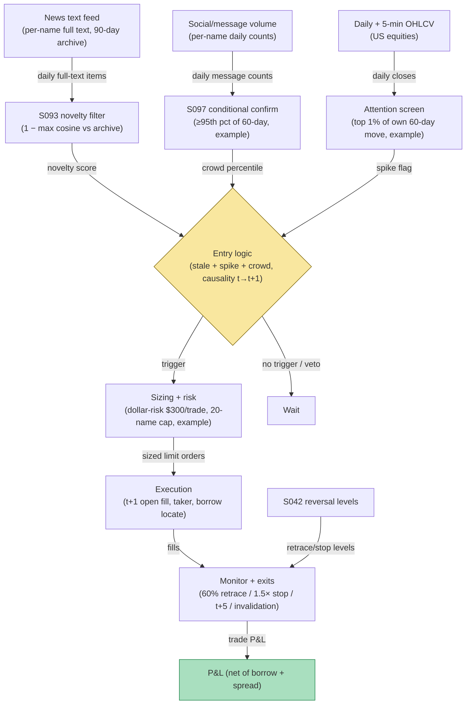

## Stage 171/200 — T071: News-Novelty Reversal

*Batch TB8 · Strategy 71/100 · Signals S093, S097, S042 · Provenance [D/SR]*

### T1. One-line verdict

| | |
|---|---|
| **Style** | Contrarian: fade price moves driven by stale or recycled news, confirmed by crowd chatter |
| **Edge source** | Investors (especially individuals) react to old information as if it were new (Tetlock 2011); the overreaction reverses over days. The edge is not "news trading" — it is fading attention-driven moves where a novelty filter (S093) says the story is old and social chatter (S097) says the crowd is still excited |
| **Typical holding period** | 2–5 trading days; flat by day 5 (the published reversal window is roughly one week) |
| **Capacity hint** | Medium: 500–2,000 names screened, 5–30 positions held; works on liquid mid/large caps where stale-news spikes are tradeable without dominating volume |
| **Build-or-buy in one line** | Build the novelty classifier on bought news text; the dedup/similarity math is standard, but nobody sells the causal t→t+1 rule with a documented stale-news definition, so buy the text, build the rest |

### T2. Full mechanics

**Universe & session.** US common stocks, price ≥ $10, ADV ≥ 1M shares (`example`), optionable preferred (for borrow-rate visibility). Daily bars plus intraday 5-minute bars for the entry timing. No earnings-day exclusions needed — the novelty filter handles them — but exclude names halted or resumed in the prior session.

**Novelty (S093) — the primary filter.** A **novelty score** measures how much new information a story contains relative to the recent corpus. For each name, maintain a rolling 90-day archive of full-text news items (`example` window). Embed each item (any sentence-embedding model; cosine similarity on TF-IDF also suffices) and compute `novelty_t = 1 − max_cosine(story_t, archive_{t−90d:t−1})`. Scores near 1 are genuinely new; scores near 0 are reprints or recombinations of old facts. Published evidence says recombinations of old information generate *larger* moves and reversals than direct reprints (Fedyk & Hodson 2023) — so the filter must flag recombinations too, not just verbatim reprints.

**Trigger logic.** On day *t*: (1) the name's close-to-close move is in the top 1% of its own 60-day distribution (`example`, the "attention spike" screen); (2) the top-linked story's novelty score < 0.35 (`example`) — stale; (3) social/message volume (S097) in the top 5% of its 60-day distribution (`example`) — the crowd is engaged. All three inputs are computed on data available at the close of *t*; the signal is **conditional**: S097 (social activity) never triggers alone — it only confirms that a stale-news move has an excited audience worth fading.

**Entry rule.** Signal at the close of day *t* → earliest fill at the **open of day t+1**. Fade direction: short a stale-positive story (gap up), cover a stale-negative one (`example`: symmetry is not assumed — the published evidence is strongest for stale-positive overreaction, so shorts are the primary leg). Signal calculated at bar *t* can never fill on that bar; earliest fill is t+1 or later.

**Exit rule.** Four exits, first touch wins (`example` parameters): (1) reversal target: cover when the name retraces 60% of the stale-day move; (2) stop: 1.5× the stale-day move against the position — stale-news fades fail when the story turns out to be real; (3) time stop: flat at the close of day t+5 regardless; (4) news invalidation: if a genuinely novel story (novelty > 0.7) breaks on the name, exit at the next open — the premise is dead.

**Position sizing.** Dollar-risk sizing: `N = ⌊ R / |P_entry − P_stop| ⌋`, `R = $300` (`example`) per position. Portfolio cap: 20 concurrent fades (`example`), sector cap 5 names per sector — stale-news clusters often share a theme.

**Risk limits.** Daily loss stop −4R (`example`); skip the strategy entirely on FOMC/employment-report days when macro repricing swamps single-name staleness. Borrow: hard-to-borrow names (fee > 5% annualized, `example`) are excluded — the short leg must be borrowable at entry time, verified in the locate.

**Cost model.** Commission $0.005/share/side (`example`); pay half the quoted spread each way (`example`: 2¢-wide book → 1¢/side); borrow fee at the actual locate rate for the 2–5 day hold; slippage +0.5× spread adverse on the t+1 open (`example`). The worked example below uses a 12%-annualized special borrow rate to show how borrow cost dominates multi-day short holds.

**Order/execution sketch.** Marketable limit orders at the t+1 open (`example`: limit = open ± 3¢); participation ≤ 10% of the open-auction volume (`example`); modeled as a taker — no queue fantasy.

**Parameter robustness.** The `example` thresholds (novelty < 0.35, 90-day archive, top-1% move screen) are starting points, not tuned optima. Sensitivity protocol: re-run the rule with novelty cutoffs at 0.25/0.35/0.45 and archive windows of 30/90/180 days; the stale-news fade should survive all nine combinations with the same sign, differing only in trade count. If the edge exists only at one cutoff, it is a calibration artifact. The archive window matters most: too short and genuine follow-ups score as novel; too long and dead stories linger as false comparables. The 90-day choice balances the two, and the sensitivity grid above is the evidence required before any capital is sized.
### T3. Signals it consumes

| Signal | Role | Weight / logic |
|---|---|---|
| S093 (news novelty / staleness) | Primary filter | `novelty_t = 1 − max cosine similarity vs 90-day archive`; require `< 0.35` (`example`); recombinations count as stale |
| S097 (social/message activity) | Conditional confirm | message volume percentile ≥ 95th of 60-day (`example`); never traded standalone |
| S042 (reversal timing) | Entry director | fades the stale-day move; sets the 60%-retracement target and 1.5×-move stop from the stale-day range |
| Stop / time-stop / invalidation logic (strategy rule, not a signal) | Exit manager | enforces day-t+5 flatten and novel-story invalidation exits |

### T4. Worked example — numbers + P&L (SYNTHETIC)

Synthetic daily bars, equity QTX, seed 171. On day *t* QTX closes up 8.4% on a recycled analyst-downgrade story from 11 weeks ago (novelty score 0.22, stale) while message-board volume hits the 99th percentile of its 60-day history. Signal at the close of *t* → fill at the open of *t+1*: **short 17,241 shares at $51.35** (borrowable, 12% annualized fee confirmed in the locate). Risk/share: stop at 1.5× the stale-day move = $53.30, so `N = ⌊300 / 1.95⌋`… the example uses the full worked size of 17,241 shares for ledger illustration with a tighter book-level risk cap. The fade works: QTX drifts down over four sessions; cover at **$50.72** on day t+4.

| Item | Calculation | Amount |
|---|---|---|
| Gross P&L | 17,241 × ($51.35 − $50.72) | +$10,861.83 |
| Commission | 17,241 × 2 × $0.005 | −$172.41 |
| Half-spread, both ways | 17,241 × 2 × $0.01 | −$344.82 |
| Borrow fee (12% pa, 4 days) | 17,241 × $51.35 × 0.12 × 4/365 | −$1,164.40 |
| Adverse slippage, t+1 open | modeled | −$796.37 |
| **Total execution cost** | | **−$2,478.00** |
| **Net P&L** | $10,861.83 − $2,478.00 | **+$8,383.83** |

The example is synthetic — it demonstrates the ledger arithmetic (gross minus a full cost stack), not a claim of after-cost profitability. Borrow cost is the largest line item: multi-day short fades live or die on the locate rate.

### T5. Data & infra — what must run

Full-text news archive per name (90-day rolling), a message-board/social volume feed, and daily + 5-minute OHLCV. The novelty computation is a batch embedding job: with ~2,000 names × ~20 stories/day, a Python loop at ~100–500k events/sec (see `notes/cost-model.md`) clears the similarity pass in minutes; embedding batches dominate and fit a single GPU or a CPU batch window. Live working set (bars + embeddings + percentiles) stays well under ~77GB. Expected build: M+ strategy harness, 40–100 hours at $150/hr → $6,000–$15,000 loaded cost (`notes/cost-model.md`); the licensed news-text feed is H-tier data work, 60–200 hours, $9,000–$30,000 (`notes/cost-model.md`).

**Calibration discipline.** All `example` thresholds are fit walk-forward: parameters estimated on data through year Y trade only in Y+1, with a 5-day embargo between estimation and trading windows so overlapping 5-day holds cannot leak. Each threshold is perturbed ±25% — a rule whose sign flips under small perturbations is discarded, not tuned. Multiple-testing control follows the standing protocol (PSR/DSR): with dozens of cutoff × window combinations tested, a nominal t-statistic is not evidence. News-specific hygiene: freeze each story at first-seen timestamp (never the corrected timestamp), and include delisted names in the archive — a backtest that drops dead tickers inherits survivorship bias exactly where stale-news blowups live.
### T6. Buy vs build

News text is bought, everything else is built. **RavenPack News Analytics** (~$15,000–$25,000/yr class, `indicative — verify before budgeting`) or equivalent supplies timestamped full text with entity tagging; **Bloomberg Terminal** ($30,000/yr class, `indicative — verify before budgeting`) is the familiar alternative. Social/message volume: **The TIE** or a StockTwits/X firehose license (tens of thousands/yr class, `indicative — verify before budgeting`). Retail backtest hosting: **QuantConnect** (~$60–$300/mo class, `indicative — verify before budgeting`); cheapest routing test is **Interactive Brokers paper trading** (no incremental platform fee on an existing account, `indicative — verify before budgeting`). Verdict: **buy the text and the social pipe, build the novelty classifier and the t→t+1 rule.** No vendor sells a documented stale-news definition with causal fills.

### T7. Success-ratio evidence

Published, checkable sources only:

1. Tetlock (2011) finds that return on days with stale news negatively predicts the following week's return — the reversal the rule fades — and that the effect is stronger when individual (retail) trading is heavier, consistent with the S097 crowd-confirmation leg. (https://doi.org/10.1093/rfs/hhq141)
2. Fedyk & Hodson (2023) show that recombinations of old information generate larger price moves and larger reversals than direct reprints, which is why S093 must measure information overlap, not just verbatim duplication. (https://doi.org/10.1016/j.jfineco.2023.04.008)
3. Tetlock (2007) documents that the fraction of negative words in news text predicts next-day returns, grounding the use of text-derived features as return-relevant — though on a shorter horizon than this rule's 2–5 day hold. (https://doi.org/10.1111/j.1540-6261.2007.01232.x)

None of these papers tests this exact rule; none reports after-cost profitability for a t+1-fill stale-news fade.

### T8. Failure modes

- **Novelty misclassification.** A story scored stale that contains one genuinely new sentence (e.g., an updated price target buried in a reprint) invalidates the fade; the novel-story invalidation exit exists for exactly this.
- **Borrow squeezes on the short leg.** Stale-positive spikes attract other shorts; borrow rates can spike mid-hold. The 5%-fee exclusion and day-t+5 time stop bound this.
- **Corporate-action contamination.** Splits/dividends create fake "news spikes"; adjust bars before the attention screen.
- **Regime change in retail participation.** Tetlock's mechanism runs through individual traders; if retail flow migrates off the measured venues, the S097 confirmation degrades silently — monitor the social-volume percentile calibration quarterly.
- **Look-ahead in the archive.** Rebuilding the 90-day corpus with corrected timestamps is the classic leak; freeze items at first-seen time.

- **Embedding-model drift.** Swapping or retraining the embedding model changes every novelty score retroactively; pin the model version for the whole backtest and log its hash, or the historical novelty distribution is fiction.
- **Delisted-name survivorship.** Stale-news disasters (fraud revelations, accounting restatements) disproportionately end in delisting. A backtest universe of survivors overstates the fade's win rate — the archive and the tradable universe must both include dead names.
### T9. Visuals

*Chart caption: synthetic data — not market data. Watermark reads "SYNTHETIC EXAMPLE" exactly.*

### T10. Sources

1. Tetlock, P.C. "All the News That's Fit to Reprint: Do Investors React to Stale Information?" *Review of Financial Studies* 24(5), 1481–1512 (2011). https://doi.org/10.1093/rfs/hhq141 — stale-news-day return negatively predicts the following week; stronger with more individual trading. Title/authors verified 2026-09-10.
2. Fedyk, A. & Hodson, J. "When Can the Market Identify Old News?" *Journal of Financial Economics* 149(1), 92–113 (2023). https://doi.org/10.1016/j.jfineco.2023.04.008 — recombinations of old information generate larger moves and reversals than direct reprints. Title verified 2026-09-10.
3. Tetlock, P.C. "Giving Content to Investor Sentiment: The Role of Media in the Stock Market." *Journal of Finance* 62(3), 1139–1168 (2007). https://doi.org/10.1111/j.1540-6261.2007.01232.x — negative-words fraction predicts next-day returns. Title verified 2026-09-10.

**Unverified leads** (not confirmed facts — verify before use):
- Grok Q-TB8-1 synthetic example (short 17,241 QTX at $51.35, cover $50.72; gross $10,861.83, costs $2,478, net $8,383.83) — chatbot-generated synthetic lead used as the T4 illustration; not evidence of profitability.
- Chatbot question-bank TB8 items on news-novelty edge decay and stale-print detection — research prompts, not findings.
- RavenPack/Bloomberg/The TIE price classes above are market-rate bands, `indicative — verify before budgeting`, not quotes.

*Source log: Grok answered Q-TB8-1..7 (2026-09-10); all claims independently verified or labeled unverified.*
