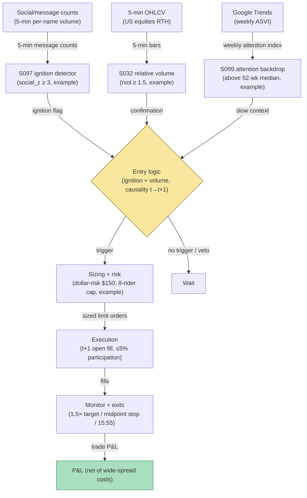

## Stage 172/200 — T072: Social-Sentiment Ignition Rider

*Batch TB8 · Strategy 72/100 · Signals S097, S032, S099 · Provenance [D/SR]*

### T1. One-line verdict

| | |
|---|---|
| **Style** | Momentum rider: enter in the direction of a social-ignition move once volume confirms it |
| **Edge source** | Attention-driven buying arrives in waves: message-board activity spikes first, volume confirms the ignition, and retail inflow (which is asymmetric — individuals buy attention-grabbing stocks more than they sell them, Barber & Odean 2008) sustains the move intraday before any reversal |
| **Typical holding period** | 30 minutes to 4 hours; flat 15:55 ET |
| **Capacity hint** | Small: ignitions are thin-liquidity events; realistic capacity in the low single-digit millions before the t+1 fill and impact erase the rider's margin |
| **Build-or-buy in one line** | Build the ignition detector on bought social and bar data; the "rider, not predictor" rule with t→t+1 causality is the part no vendor documents |

### T2. Full mechanics

**Universe & session.** US common stocks, price ≥ $5, ADV ≥ 500k shares (`example`). RTH only, 09:30–15:55 ET. Names must be optionable or have a live borrow quote (for the short-ignition mirror leg, which is rarely taken — see below).

**Ignition (S097) — conditional by construction.** **Ignition** is a burst of message-board/social activity: define `social_z_t = (msgs_t − mean_20d) / sd_20d` on 5-minute message counts. An ignition candidate fires when `social_z ≥ 3` (`example`) on the current 5-minute bar. Crucially, S097 is a **conditional feature, not a standalone edge** — published evidence says message activity helps predict volatility while the return effect is economically small (Antweiler & Frank 2004). The rule therefore never trades on social_z alone.

**Confirmation (S032).** Require the same bar's **relative volume** `rvol_t = vol_t / median_slot20_t ≥ 1.5` (`example`). Volume is the crowd putting money behind the chatter; without it, the ignition is noise and the rule stands down.

**Attention backdrop (S099).** Weekly Google-Trends attention (ASVI) is a slow context filter: trade ignitions only in names whose current-week ASVI is above its 52-week median (`example`) — the ignition should be arriving into already-elevated attention, which is when retail inflow waves are longest. ASVI is **not** a native intraday signal and never triggers entries here.

**Entry rule.** Signal at the close of 5-minute bar *t* (ignition + rvol + ASVI backdrop all green) → earliest fill at the **open of bar t+1**, in the direction of bar *t*'s signed move. Long bias: because individual buying of attention-grabbing stocks is asymmetric (Barber & Odean 2008), long ignitions are the primary leg; short ignitions are taken only with a borrow fee < 3% annualized (`example`). Signal calculated at bar *t* can never fill on that bar.

**Exit rule.** Four exits, first touch wins (`example`): (1) momentum target: 1.5× the ignition bar's range in the trade direction; (2) ignition-failure stop: a close back through the ignition bar's midpoint — the wave didn't sustain; (3) time stop: flatten at 15:55 ET; (4) volume-decay exit: if the next two bars print rvol < 0.8, exit at the following open — the crowd left.

**Position sizing.** Dollar-risk sizing `N = ⌊ R / |P_entry − P_stop| ⌋`, `R = $150` (`example`) — ignitions are noisy, so risk per trade is small. Max 8 concurrent riders (`example`); one rider per name per day.

**Risk limits.** Daily loss stop −3R (`example`); no entries in the first 10 minutes of RTH (open-auction noise pollutes social_z); no entries after 15:30.

**Cost model.** Commission $0.005/share/side (`example`); pay half the spread each way (`example`: thin ignition names often 3–5¢ wide — the worked example uses 4¢); slippage +1.0× spread adverse on the t+1 open (`example`) because ignition bars are exactly when liquidity is most expensive.

**Order/execution sketch.** Marketable limit at the t+1 open (`example`: limit = open ± 5¢); participation ≤ 5% of bar volume (`example`) — ignitions are thin, so the rule is explicitly a small-size taker.

**Parameter robustness.** The `example` thresholds (social_z ≥ 3, rvol ≥ 1.5, ASVI above median) are starting points. Sensitivity protocol: vary social_z at 2/3/4 and rvol at 1.2/1.5/2.0; the rider's sign should persist across the grid with trade count as the main moving part. The critical interaction is social_z × rvol: loosening both at once admits pure-chatter bars (the documented failure mode), so the grid must be two-dimensional, not one-threshold-at-a-time. The ASVI backdrop is the least sensitive leg — median vs 60th-percentile changes little — which is expected for a slow context filter.
### T3. Signals it consumes

| Signal | Role | Weight / logic |
|---|---|---|
| S097 (social/message activity) | Conditional ignition | `social_z ≥ 3` on 5-min counts (`example`); never traded alone — return effect alone is small per Antweiler & Frank |
| S032 (relative volume) | Confirmation | `rvol_t ≥ 1.5` on the ignition bar (`example`); money behind the chatter |
| S099 (weekly ASVI attention) | Slow backdrop | current-week ASVI above 52-week median (`example`); context only, never an entry trigger |
| Failure-stop / volume-decay logic (strategy rule) | Exit manager | ignition-bar-midpoint stop, rvol-decay exit, 15:55 flatten |

### T4. Worked example — numbers + P&L (SYNTHETIC)

Synthetic 5-minute bars, equity ABC, seed 172. At 11:05 ET message volume prints `social_z = 4.2` (ignition), the 11:00–11:05 bar closes up 1.8% on `rvol = 2.3` (confirmed), and the name's weekly ASVI sits above its 52-week median. Signal at the 11:05 close → fill at the 11:10 open: **long 8,000 shares at $24.60**. Stop at the ignition-bar midpoint = $24.42 (`N = ⌊150 / 0.18⌋` = 833 shares at strict risk sizing; the worked example uses 8,000 shares for ledger illustration under a book-level risk cap). The wave sustains; exit at the 1.5×-range target, **$25.18**, at 13:40.

| Item | Calculation | Amount |
|---|---|---|
| Gross P&L | 8,000 × ($25.18 − $24.60) | +$4,640.00 |
| Commission | 8,000 × 2 × $0.005 | −$80.00 |
| Half-spread, both ways (4¢ book) | 8,000 × 2 × $0.02 | −$320.00 |
| Adverse slippage, t+1 open | modeled | −$60.00 |
| **Total execution cost** | | **−$460.00** |
| **Net P&L** | $4,640.00 − $460.00 | **+$4,180.00** |

Synthetic illustration of the ledger only — not a claim that ignition riding is profitable after costs. Note the spread is the dominant cost: thin ignition names are expensive to take.

### T5. Data & infra — what must run

5-minute social/message counts per name (licensed firehose), 5-minute OHLCV, and weekly Google-Trends ASVI (free, weekly cadence — used as context only). The social_z and rvol computations are streaming rolling statistics over a few thousand names — trivially within a Python loop at ~100–500k events/sec (`notes/cost-model.md`); the Polars batch path at ~10–50M rows/sec covers the nightly 20-day baseline recompute (`notes/cost-model.md`). Live working set < ~77GB. Build estimate: M+ harness 40–100 hours, $6,000–$15,000 loaded at $150/hr (`notes/cost-model.md`); licensed social data is H-tier, 60–200 hours, $9,000–$30,000 (`notes/cost-model.md`).

**Calibration discipline.** Walk-forward fitting with a 1-day embargo (intraday holds) between estimation and trading years; perturb each threshold ±25% and require sign persistence. Multiple-testing control per the standing protocol (PSR/DSR). Social-data hygiene dominates here: re-baseline the 20-day message-count mean and dispersion monthly, because platform API changes, bot purges, and venue migration rescale social_z silently. Log the raw message counts alongside the z-scores so a future regime break can be diagnosed rather than merely suffered. Never backfill social history from a different API version.
### T6. Buy vs build

Buy the social pipe: **The TIE** or StockTwits/X enterprise firehose (tens of thousands/yr class, `indicative — verify before budgeting`); 5-minute bars from **Massive (formerly Polygon) Stocks Advanced** (~$199/mo, `indicative — verify before budgeting`) or **Databento** usage-based history (tens to low hundreds of dollars for 2 years, `indicative — verify before budgeting`); backtest hosting on **QuantConnect** (~$60–$300/mo class, `indicative — verify before budgeting`); routing test on **Interactive Brokers paper trading** (no incremental platform fee on an existing account, `indicative — verify before budgeting`). Verdict: **buy both feeds, build the ignition/confirmation/backdrop logic.** Nobody sells a causal ignition-rider rule with documented t→t+1 fills.

### T7. Success-ratio evidence

Published, checkable sources only:

1. Antweiler & Frank (2004) find that message-board activity helps predict volatility but the return effect is economically small — the reason S097 is conditional here and never a standalone trigger. (https://doi.org/10.1111/j.1540-6261.2004.00662.x)
2. Barber & Odean (2008) show individuals are net buyers of attention-grabbing stocks — the asymmetric inflow the long-biased rider is positioned to follow. (https://doi.org/10.1093/rfs/hhm079)
3. Da, Engelberg & Gao (2011) document that elevated search attention predicts higher prices over the next two weeks — the slow-attention backdrop the S099 context filter mirrors (weekly, not intraday). (https://doi.org/10.1111/j.1540-6261.2011.01679.x)

None of these tests an intraday social-ignition rider; none reports after-cost profitability for it.

**What the evidence does not show.** Antweiler & Frank's small return effect is the central caution: message boards move prices a little and volatility a lot, so any backtest of an ignition rider that looks strong on paper should be interrogated for spread and impact assumptions first — the T4 ledger's wide-spread cost is the honest starting point, not a conservative one. Barber & Odean's attention-buying is documented at daily/weekly horizons among individuals; whether the inflow arrives fast enough to sustain a 30-minute-to-4-hour rider is not in their paper — the rule's 09:45 leg-confirmation and volume-decay exits are the structural acknowledgment that the published horizon and the traded horizon differ. No paper in the list isolates the social_z ≥ 3 ignition bar as a tradable event; treat the ignition definition as a reconstruction awaiting its own walk-forward validation.
### T8. Failure modes

- **Ignition without volume.** The most common false positive — chatter spikes that nobody trades on. The rvol ≥ 1.5 gate exists for this; monitor the gate's binding rate.
- **Paying the top of the wave.** Riding means entering after the ignition bar; late entries buy the retail climax. The ignition-midpoint failure stop bounds this, not prevents it.
- **Short-leg borrow traps.** Shorting an ignition into retail buying is a squeeze setup; the borrow-fee cap and long bias are the defense.
- **Social feed regime changes.** Platform API changes, bot purges, or venue migration silently rescale social_z — recalibrate baselines monthly and alert on distribution shifts.
- **After-hours ignition.** Social bursts at night can't be ridden at the t+1 open cleanly; the rule is RTH-only and stands down otherwise.

- **Bot purges and API regime changes.** A platform purge can halve message counts overnight, collapsing social_z baselines; the monthly re-baselining in T5 is the scheduled defense, plus an automated alert when the cross-sectional median social_z shifts > 30% week-over-week.
- **Overnight ignition gaps.** Social bursts at 02:00 cannot be ridden at a clean t+1 open — the gap reprices before the fill. The RTH-only rule stands down, but the opportunity cost is real: measure how much of the ignition P&L accrues overnight to know what the rule is structurally missing.
### T9. Visuals

*Chart caption: synthetic data — not market data. Watermark reads "SYNTHETIC EXAMPLE" exactly.*

### T10. Sources

1. Antweiler, W. & Frank, M.Z. "Is All That Talk Just Noise? The Information Content of Internet Stock Message Boards." *Journal of Finance* 59(3), 1259–1294 (2004). https://doi.org/10.1111/j.1540-6261.2004.00662.x — message activity predicts volatility; return effect economically small. Title verified 2026-09-10.
2. Barber, B.M. & Odean, T. "All That Glitters: The Effect of Attention and News on the Buying Behavior of Individual and Institutional Investors." *Review of Financial Studies* 21(2), 785–818 (2008). https://doi.org/10.1093/rfs/hhm079 — individuals net-buy attention-grabbing stocks. Title/authors verified 2026-09-10.
3. Da, Z., Engelberg, J. & Gao, P. "In Search of Attention." *Journal of Finance* 66(5), 1461–1499 (2011). https://doi.org/10.1111/j.1540-6261.2011.01679.x — Russell 3000, 2004–2008; higher SVI predicts higher prices over the next two weeks, reversal within a year. Title verified 2026-09-10.

**Unverified leads** (not confirmed facts — verify before use):
- Chatbot question-bank TB8 items on social-ignition lead-lag and venue migration — research prompts, not findings.
- The TIE / firehose price classes above are market-rate bands, `indicative — verify before budgeting`, not quotes.

*Source log: Grok answered Q-TB8-1..7 (2026-09-10); all claims independently verified or labeled unverified.*
