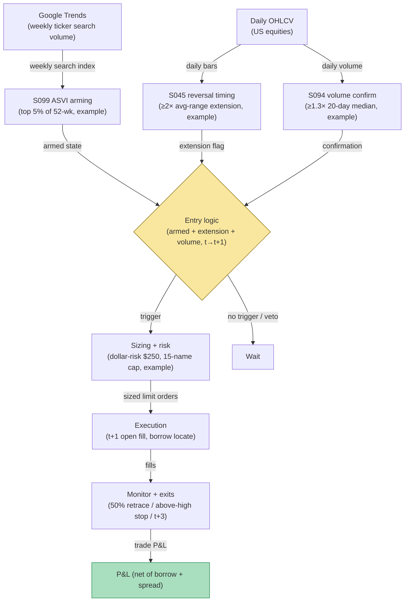

## Stage 173/200 — T073: ASVI Attention Reversal

*Batch TB8 · Strategy 73/100 · Signals S099, S045, S094 · Provenance [D/SR]*

### T1. One-line verdict

| | |
|---|---|
| **Style** | Contrarian: fade the intraday extension of a weekly attention spike |
| **Edge source** | Abnormal search attention predicts higher prices over the next two weeks and reversal within a year (Da, Engelberg & Gao 2011); this rule trades the short-horizon echo — when a weekly ASVI spike is followed by an intraday over-extension, the reversal-timing (S045) and volume-confirmation (S094) legs fade the extension, not the attention trend itself |
| **Typical holding period** | 1–3 trading days; flat by day 3 |
| **Capacity hint** | Medium: weekly signal, daily timing; capacity in the tens of millions across a broad universe, bounded by the intraday fade's spread costs |
| **Build-or-buy in one line** | Build: Google Trends is free, the ASVI construction is published, and the intraday fade timing is the proprietary part no vendor sells |

### T2. Full mechanics

**Universe & session.** US common stocks, price ≥ $10, ADV ≥ 1M shares (`example`). Weekly signal cadence, daily/intraday execution, RTH only.

**Attention (S099).** **ASVI** (abnormal search volume index) is the log of this week's Google search volume for the ticker/company name minus the log median of the prior 8 weeks (`example`), per Da, Engelberg & Gao's construction. It is **attention, not sentiment** — it measures how many people are looking, not what they think. It is a weekly series, not a native intraday signal. The rule arms when a name's ASVI lands in the top 5% of its own 52-week history (`example`) — the "attention spike" state. Armed state persists for the trading week.

**Entry trigger (S045 + S094).** While armed, watch daily bars: if the name rallies ≥ 2× its 20-day average daily range (`example`) into the attention spike — the **over-extension** — and the day's volume is ≥ 1.3× its 20-day median (`example`, S094 volume confirmation), the reversal-timing leg (S045) fires. Signal at the close of day *t* → earliest fill at the **open of day t+1**, fading the extension (short the over-extended rally). Signal calculated at bar *t* can never fill on that bar.

**Exit rule.** Four exits, first touch wins (`example`): (1) reversal target: cover at 50% retracement of the over-extension day; (2) stop: a close above the over-extension day's high — attention is still pushing; (3) time stop: flat at the close of day t+3; (4) ASVI reset: if next week's ASVI falls below its 8-week median, exit — the attention fuel is gone.

**Position sizing.** Dollar-risk sizing `N = ⌊ R / |P_entry − P_stop| ⌋`, `R = $250` (`example`). Max 15 concurrent fades (`example`); ASVI spikes cluster in hot sectors, so cap 4 per sector.

**Risk limits.** Daily loss stop −4R (`example`); borrow fee exclusion > 5% annualized (`example`) on the short leg; no new arms during the week containing a scheduled FOMC decision.

**Cost model.** Commission $0.005/share/side (`example`); half-spread each way (`example`: 2¢ book); borrow at the locate rate for a 1–3 day hold; +0.5× spread adverse slippage on the t+1 open (`example`).

**Order/execution sketch.** Marketable limit at the t+1 open; participation ≤ 10% of open-auction volume (`example`); taker modeling.

**Parameter robustness.** The `example` choices (ASVI top 5% of 52 weeks, ≥2× average-range extension, volume ≥ 1.3× median) are starting points. Sensitivity protocol: arm at top 3%/5%/10% and trigger at 1.5×/2×/2.5× range; the fade's sign should survive the grid. Two construction choices deserve explicit testing: ticker-symbol vs company-name search queries (names are noisier but catch more attention), and the 8-week median baseline vs 4/12-week alternatives. Google Trends returns sampled data — the same query pulled twice gives different values — so average three pulls per week per ticker before computing ASVI, and treat single-pull spikes as suspect.
### T3. Signals it consumes

| Signal | Role | Weight / logic |
|---|---|---|
| S099 (weekly ASVI attention) | Arming state | top 5% of own 52-week ASVI (`example`); weekly cadence; attention-only, never sentiment |
| S045 (reversal timing) | Entry director | fires on ≥2× average-range over-extension day (`example`); sets 50%-retrace target and above-high stop |
| S094 (volume confirmation) | Filter | day volume ≥ 1.3× 20-day median (`example`) on the extension day |
| Time-stop / ASVI-reset logic (strategy rule) | Exit manager | t+3 flatten; weekly ASVI reset invalidation |

### T4. Worked example — numbers + P&L (SYNTHETIC)

Synthetic weekly/daily bars, equity XYZ, seed 173. XYZ's ASVI prints in the top 3% of its 52-week history (armed). On day *t* it rallies 6.2% — 2.4× its 20-day average daily range — on 1.8× median volume (over-extension + volume confirmation). Signal at the close of *t* → fill at the open of *t+1*: **short 6,500 shares at $88.40** (borrow 4% annualized). The extension fails; cover at 50% retracement, **$87.55**, on day t+2.

| Item | Calculation | Amount |
|---|---|---|
| Gross P&L | 6,500 × ($88.40 − $87.55) | +$5,525.00 |
| Commission | 6,500 × 2 × $0.005 | −$65.00 |
| Half-spread, both ways | 6,500 × 2 × $0.01 | −$130.00 |
| Borrow fee (4% pa, 2 days) | 6,500 × $88.40 × 0.04 × 2/365 | −$125.97 |
| Adverse slippage, t+1 open | modeled | −$214.03 |
| **Total execution cost** | | **−$535.00** |
| **Net P&L** | $5,525.00 − $535.00 | **+$4,990.00** |

Synthetic illustration only — the published ASVI evidence is weekly, not a guarantee that any single intraday fade is profitable after costs.

### T5. Data & infra — what must run

Google Trends weekly series per ticker (free, rate-limited — batch weekly), daily + 5-minute OHLCV, borrow-rate feed. ASVI construction is a weekly batch over a few thousand names — seconds of compute; the nightly percentile arming pass is a Polars groupby at ~10–50M rows/sec (`notes/cost-model.md`). Live working set trivially under ~77GB. Build estimate: M+ harness 40–100 hours, $6,000–$15,000 loaded (`notes/cost-model.md`); data work is light (free Trends + bought bars), no H-tier licensing needed for the core loop.

**Calibration discipline.** Walk-forward with a 5-day embargo between estimation and trading windows (the 1–3 day holds overlap weekly ASVI prints); perturb thresholds ±25% with sign-persistence required. Multiple-testing control per the standing protocol (PSR/DSR). Trends-specific hygiene: the weekly series is revised and resampled — snapshot every pull with its pull timestamp, never overwrite history in place, and pin the geographic/market setting of the query. A backtest built on today's revised Trends history is not the history the rule would have seen.
### T6. Buy vs build

Google Trends is free. Buy daily bars: **Massive (formerly Polygon) Stocks Advanced** (~$199/mo, `indicative — verify before budgeting`) or **Databento** usage-based history (tens to low hundreds of dollars, `indicative — verify before budgeting`); borrow rates from the broker's locate feed (e.g., **Interactive Brokers**, no incremental platform fee on an existing account, `indicative — verify before budgeting`); backtest hosting on **QuantConnect** (~$60–$300/mo class, `indicative — verify before budgeting`). Verdict: **build everything on free Trends plus bought bars.** There is nothing to buy — no vendor sells the ASVI-arm/intraday-fade rule with causal fills.

**Crossover note.** If the ASVI fade ever graduates from research to production, the data decision changes in one place: Google Trends' sampling noise becomes the binding uncertainty, and a licensed search-data product (e.g., consumer search panels, tens of thousands/yr class, `indicative — verify before budgeting`) may replace the free pull-average workaround. Until the rule survives paper trading on the free feed, that spend is premature — the T5 sampling-noise protocol (three pulls averaged, snapshots pinned) is the cheap substitute. The bar-data decision does not change: daily bars from Massive or Databento remain sufficient, since the trigger is a daily extension day, not a microstructure event.
### T7. Success-ratio evidence

Published, checkable sources only:

1. Da, Engelberg & Gao (2011), Russell 3000 2004–2008: higher SVI predicts higher prices over the next two weeks and reversal within a year — the attention-then-reversal shape this rule's arming/trigger structure mirrors. (https://doi.org/10.1111/j.1540-6261.2011.01679.x)
2. Antweiler & Frank (2004): message activity helps predict volatility with only a small return effect — why this rule requires volume confirmation (S094) rather than trading attention alone. (https://doi.org/10.1111/j.1540-6261.2004.00662.x)
3. Barber & Odean (2008): individuals net-buy attention-grabbing stocks — the inflow that creates the over-extension the rule fades. (https://doi.org/10.1093/rfs/hhm079)

Honesty note: the published ASVI horizon is weeks, not the 1–3 day fade here; the intraday timing layer is a reconstruction, not a tested literature result.

**What the evidence does not show.** Da, Engelberg & Gao's reversal plays out within a year, not within three days — the published effect is a slow attention cycle, and this rule's 1–3 day fade is a much faster extraction that the paper does not test. The honest reading: the paper justifies fading attention-driven extensions in principle, but the specific over-extension trigger (≥2× average range) and the t+3 time stop are reconstructions with no published backtest behind them. Antweiler & Frank's small return effect further warns that attention alone, without the volume confirmation leg, is mostly volatility — which is why S094 is a hard gate rather than a weighting. Any live deployment should paper-trade the trigger timing for at least two full attention cycles before sizing.
### T8. Failure modes

- **Attention without exhaustion.** ASVI spikes can persist for weeks (meme regimes); the over-extension day can extend further. The above-high stop and the t+3 time stop are the defense, not a cure.
- **Weekly cadence lag.** Google Trends publishes weekly; an ASVI spike may be stale by the time it arms — the rule fades extensions, never the first spike day.
- **Short-leg borrow spikes.** Attention names get crowded on the short side; the 5% fee exclusion must be re-checked at entry, not just at arming.
- **Ticker-name ambiguity.** Search volume for ambiguous company names pollutes ASVI; use ticker-symbol queries with manual review of the top names.
- **Corporate actions.** Splits and dividends distort the average-range baseline; adjust before the over-extension screen.

- **Weekly publication lag.** Trends publishes with a lag; an ASVI spike can be days old before it arms the rule. The rule compensates by fading only the intraday extension, never the first spike — but in fast attention cycles the extension may already be exhausted. Measure the arm-to-trigger delay distribution before sizing.
- **ASVI/price lead-lag instability.** The published two-week attention effect is an average over 2004–2008; the lead-lag between search spikes and price moves is not a constant. If the 1–3 day fade window drifts out of phase with the actual attention cycle, the rule fades noise — re-estimate the timing quarterly.
- **Sector-wide attention waves.** ASVI spikes often arrive sector-wide (AI, biotech, crypto-adjacent names together); the 4-per-sector cap in T2 exists because fading five names on the same attention wave is one bet, not five. Monitor the cross-sectional correlation of armed names and cut the book when it approaches one.
### T9. Visuals

*Chart caption: synthetic data — not market data. Watermark reads "SYNTHETIC EXAMPLE" exactly.*

### T10. Sources

1. Da, Z., Engelberg, J. & Gao, P. "In Search of Attention." *Journal of Finance* 66(5), 1461–1499 (2011). https://doi.org/10.1111/j.1540-6261.2011.01679.x — higher SVI predicts higher prices over two weeks, reversal within a year. Title verified 2026-09-10.
2. Antweiler, W. & Frank, M.Z. "Is All That Talk Just Noise?" *Journal of Finance* 59(3), 1259–1294 (2004). https://doi.org/10.1111/j.1540-6261.2004.00662.x — message activity predicts volatility; small return effect. Title verified 2026-09-10.
3. Barber, B.M. & Odean, T. "All That Glitters." *Review of Financial Studies* 21(2), 785–818 (2008). https://doi.org/10.1093/rfs/hhm079 — individuals net-buy attention-grabbing stocks. Title/authors verified 2026-09-10.

**Unverified leads** (not confirmed facts — verify before use):
- Chatbot question-bank TB8 items on ASVI timing and attention-vs-sentiment separation — research prompts, not findings.
- Google Trends is free; bar-data price classes above are `indicative — verify before budgeting`, not quotes.

*Source log: Grok answered Q-TB8-1..7 (2026-09-10); all claims independently verified or labeled unverified.*
