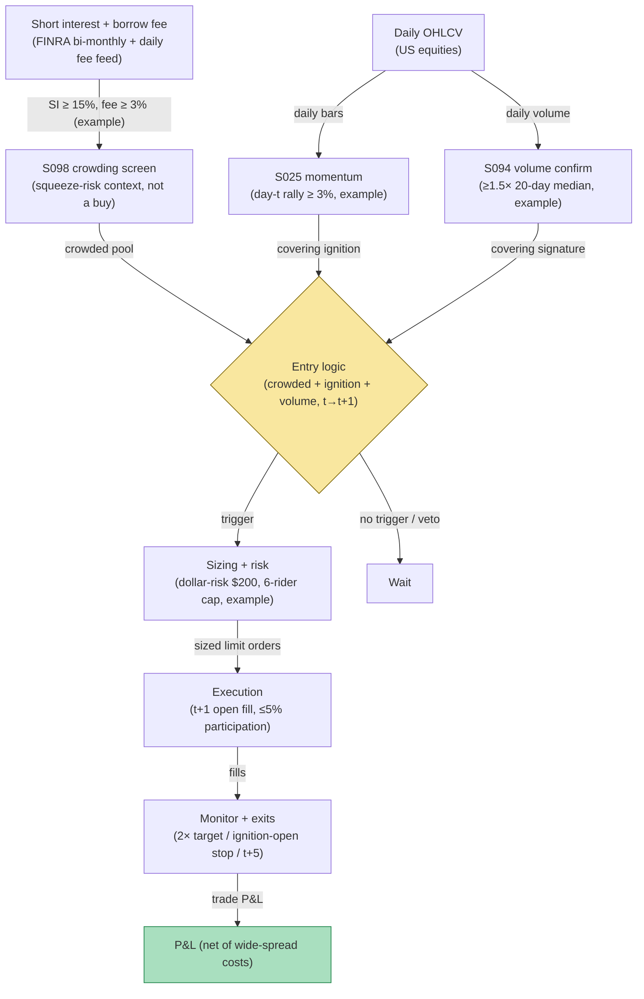

## Stage 174/200 — T074: Short-Interest Squeeze Rider

*Batch TB8 · Strategy 74/100 · Signals S098, S025, S094 · Provenance [D/SR]*

### T1. One-line verdict

| | |
|---|---|
| **Style** | Momentum rider: long crowded shorts once covering begins, confirmed by volume |
| **Edge source** | High short interest plus a borrow-fee spike identifies a crowded short (S098 as squeeze-risk and cost context — never as "high SI means buy"); when momentum turns against the shorts (S025) and volume confirms covering (S094), forced buy-to-cover flow can extend the move intraday. The literature warns shorts are often informed (Boehmer, Jones & Zhang 2008) — so the rule rides only confirmed covering, never anticipates it |
| **Typical holding period** | 1–5 trading days; flat by day 5 |
| **Capacity hint** | Small: squeeze names are volatile and capacity-constrained; low single-digit millions before impact dominates |
| **Build-or-buy in one line** | Build the crowding screen on bought short-interest/borrow data; the "ride confirmed covering only" rule is the proprietary discipline no vendor documents |

### T2. Full mechanics

**Universe & session.** US common stocks, price ≥ $5, ADV ≥ 750k shares (`example`), with published short-interest (FINRA bi-monthly, supplemented by a daily borrow-fee feed). RTH only.

**Crowding (S098).** **Short interest** (shares sold short ÷ float) and the **borrow fee** (annualized stock-loan rate) are read as **squeeze-risk and cost context**, not as buy signals. A name is "crowded" when: short interest ≥ 15% of float (`example`) **and** borrow fee ≥ 3% annualized (`example`) **and** fee rising week-over-week. This is the pool — the rule does nothing with the pool alone, because the published evidence says heavily shorted stocks *underperformed* (shorts may be informed).

**Ignition of covering (S025 + S094).** The rider enters only when: (1) the name rallies ≥ 3% on day *t* (`example`, S025 momentum against the shorts); (2) day-*t* volume ≥ 1.5× its 20-day median (`example`, S094 — buy-to-cover leaves a volume signature); (3) borrow fee still elevated (the crowd is still short). Signal at the close of *t* → earliest fill at the **open of t+1**, long. Signal calculated at bar *t* can never fill on that bar.

**Exit rule.** Four exits, first touch wins (`example`): (1) momentum target: 2× the ignition day's range; (2) failure stop: a close below the ignition day's open — covering stalled; (3) time stop: flat at the close of t+5; (4) borrow-collapse exit: if the borrow fee falls > 50% from entry, exit at the next open — the crowd has covered, the fuel is spent.

**Position sizing.** Dollar-risk sizing `N = ⌊ R / |P_entry − P_stop| ⌋`, `R = $200` (`example`). Max 6 concurrent riders (`example`) — squeezes are idiosyncratic and violent; concentration is the risk.

**Risk limits.** Daily loss stop −3R (`example`); no entries on names with pending corporate actions; hard cap: no position may exceed 5% of the name's ADV in notional (`example`) — squeeze exits are disorderly.

**Cost model.** Commission $0.005/share/side (`example`); half-spread each way (`example`: squeeze names often 3–5¢ wide — worked example uses 4¢); +1.0× spread adverse slippage on the t+1 open (`example`) — ignition opens are gappy. No borrow cost on the long leg, but the fee feed is a data cost.

**Order/execution sketch.** Marketable limit at the t+1 open (`example`: limit = open + 5¢); participation ≤ 5% of open-auction volume (`example`); taker modeling; no overnight holds through binary events discovered after entry (exit at next open).

**Parameter robustness.** The `example` thresholds (SI ≥ 15%, fee ≥ 3% and rising, day-t rally ≥ 3%, volume ≥ 1.5× median) are starting points. Sensitivity protocol: vary SI at 10%/15%/20% and the rally trigger at 2%/3%/5%; sign persistence across the grid is required. The binding constraint is data frequency: FINRA short interest prints bi-monthly, so the SI leg is always stale intra-period — test the rule with SI lagged an extra settlement cycle to confirm the edge does not depend on fresh SI. The borrow-fee leg (daily) carries the timing; if results collapse when the fee leg is removed, the strategy is a fee-momentum rule wearing a short-interest costume.
### T3. Signals it consumes

| Signal | Role | Weight / logic |
|---|---|---|
| S098 (short interest / borrow fee) | Crowding + cost context | SI ≥ 15% float and fee ≥ 3% annualized and rising (`example`); never a buy signal alone |
| S025 (momentum) | Covering ignition | day-*t* rally ≥ 3% against the crowded short (`example`) |
| S094 (volume confirmation) | Covering signature | day-*t* volume ≥ 1.5× 20-day median (`example`) |
| Borrow-collapse / failure-stop logic (strategy rule) | Exit manager | fee-drop and below-ignition-open exits; t+5 flatten |

### T4. Worked example — numbers + P&L (SYNTHETIC)

Synthetic daily bars, equity SQZ, seed 174. SQZ carries 22% short interest with a 6% annualized borrow fee, rising. On day *t* it rallies 4.1% on 2.2× median volume (covering ignition, volume-confirmed). Signal at the close of *t* → fill at the open of *t+1*: **long 4,200 shares at $12.30**. Failure stop at the ignition day's open, $11.85. The squeeze extends over three sessions; exit at the 2×-range target, **$13.05**, on day t+3 as the borrow fee starts collapsing.

| Item | Calculation | Amount |
|---|---|---|
| Gross P&L | 4,200 × ($13.05 − $12.30) | +$3,150.00 |
| Commission | 4,200 × 2 × $0.005 | −$42.00 |
| Half-spread, both ways (4¢ book) | 4,200 × 2 × $0.02 | −$168.00 |
| Adverse slippage, t+1 open | modeled | −$40.00 |
| **Total execution cost** | | **−$250.00** |
| **Net P&L** | $3,150.00 − $250.00 | **+$2,900.00** |

Synthetic illustration of the ledger only — not a claim that riding squeezes is profitable after costs. The literature cautions that the shorts being squeezed are often informed, which is why this rule waits for confirmed covering rather than buying high short interest.

### T5. Data & infra — what must run

Bi-monthly FINRA short interest (free), a daily borrow-fee feed (licensed), and daily OHLCV. The crowding screen is a daily batch; the ignition check is a close-of-day pass over the crowded pool — trivially within a Python loop at ~100–500k events/sec (`notes/cost-model.md`); history backfills in Polars at ~10–50M rows/sec (`notes/cost-model.md`). Live working set well under ~77GB. Build estimate: M+ harness 40–100 hours, $6,000–$15,000 loaded (`notes/cost-model.md`); the daily borrow feed is H-tier licensed data, 60–200 hours, $9,000–$30,000 (`notes/cost-model.md`).

**Calibration discipline.** Walk-forward with a 5-day embargo; perturb thresholds ±25%; multiple-testing control per the standing protocol (PSR/DSR). Borrow-data hygiene: fee history is sparse and vendor-specific — record the vendor, the fee definition (annualized, compounded or not), and the timestamp convention for every observation. Never splice two vendors' fee series without an overlap reconciliation; fee-level shifts between vendors are large enough to fabricate or erase the crowding screen.
### T6. Buy vs build

Borrow-fee data is bought: **S3 Partners / Hazeltree / FIS Astec** short-interest and stock-loan feeds (tens of thousands/yr class, `indicative — verify before budgeting`); daily bars from **Massive (formerly Polygon) Stocks Advanced** (~$199/mo, `indicative — verify before budgeting`); backtest hosting on **QuantConnect** (~$60–$300/mo class, `indicative — verify before budgeting`); routing test on **Interactive Brokers paper trading** (no incremental platform fee on an existing account, `indicative — verify before budgeting`). Verdict: **buy the borrow feed and the bars, build the crowding screen and the confirmed-covering rule.** No vendor documents the ride-only-confirmed-covering discipline with causal fills.

**Crossover note.** The borrow-fee feed is the one input where "buy" can quietly become "build": some desks reconstruct effective borrow cost from options put-call parity or from the stock-loan desks they can poll directly. That reconstruction is a project, not a shortcut — vendor fee history (S3/Hazeltree/Fis Astec class) remains the auditable choice for research, because a hand-rolled fee series cannot be defended in a review. If the rule graduates, negotiate the fee feed's history depth before the full license: the crowding screen needs at least two full short-interest cycles to calibrate, and shallow history is the most common reason squeeze research fails review.
### T7. Success-ratio evidence

Published, checkable sources only:

1. Boehmer, Jones & Zhang (2008): heavily shorted stocks underperformed lightly shorted stocks by 1.16% over 20 trading days — evidence shorts may be informed, and the reason this rule never buys high short interest alone. (https://doi.org/10.1111/j.1540-6261.2008.01324.x)
2. Cohen, Diether & Malloy (2007): increases in shorting demand predict −2.98% abnormal returns the following month — shorting-market flow carries private information, reinforcing that the crowded short is dangerous to fade. (https://doi.org/10.1111/j.1540-6261.2007.01269.x)
3. Barber & Odean (2008): individuals net-buy attention-grabbing stocks — the retail inflow that can ignite covering in a crowded name. (https://doi.org/10.1093/rfs/hhm079)

No published paper tests this exact ride-the-covering rule; nothing here is an after-cost profitability claim.

**What the evidence does not show.** Boehmer, Jones & Zhang's 1.16% underperformance of heavily shorted stocks cuts against the naive squeeze trade — it says the crowded short is often right, which is why this rule waits for confirmed covering rather than buying high short interest. Cohen, Diether & Malloy's −2.98% shorting-demand effect is a monthly-horizon finding about information revelation, not a squeeze study; it disciplines the rule (respect the shorts' information) rather than supporting it. There is no published paper demonstrating that a 3%-rally-plus-volume rule reliably identifies forced covering in advance — the ignition is identified after the fact by construction, and the rule's profitability depends entirely on the covering continuing, which no cited paper guarantees.
### T8. Failure modes

- **Informed shorts are right.** The dominant failure: the crowd is short for a reason, the "ignition" is a dead-cat bounce, and the failure stop is hit. The rule accepts many small stop-outs by design.
- **Borrow data staleness.** FINRA SI is bi-monthly; intra-period covering is invisible — the fee-collapse exit can trigger late.
- **Halt risk.** Squeeze names halt; a halted long can't exit. The 5%-of-ADV cap and the halt-exclusion are partial defenses.
- **Fee-spike whipsaw.** Borrow fees spike on settlement technicals unrelated to crowding; the rising-fee requirement plus volume confirmation filters most of these.
- **Overnight gap against.** Squeezes reverse violently; the t+5 time stop and the ignition-open failure stop bound the tail.

- **Takeover-rumor squeezes.** Rumor-driven rallies in crowded shorts look identical to covering ignitions but resolve as rumor denials — the failure stop is the defense, and names with active M&A chatter should be excluded at the screen.
- **ETF creation-unit flows.** Large creation/redemption flows can print the volume signature without any covering; cross-check the ignition against the borrow-fee path — genuine covering usually coincides with fee softening at the margin, while flow-driven volume does not.
- **Reg-SHO threshold-list dynamics.** Names on the threshold list face forced buy-ins that mimic covering volume but resolve differently — the covering ignition can be a clearing artifact rather than a sentiment turn. Exclude threshold-list names from new entries, or model the buy-in calendar explicitly.
### T9. Visuals

*Chart caption: synthetic data — not market data. Watermark reads "SYNTHETIC EXAMPLE" exactly.*

### T10. Sources

1. Boehmer, E., Jones, C.M. & Zhang, X. "Which Shorts Are Informed?" *Journal of Finance* 63(2), 491–527 (2008). https://doi.org/10.1111/j.1540-6261.2008.01324.x — heavily shorted stocks underperformed by 1.16% over 20 trading days. Title verified 2026-09-10.
2. Cohen, L., Diether, K.B. & Malloy, C.J. "Supply and Demand Shifts in the Shorting Market." *Journal of Finance* 62(5), 2061–2096 (2007). https://doi.org/10.1111/j.1540-6261.2007.01269.x — shorting-demand increases predict −2.98% next-month abnormal returns. Title verified 2026-09-10.
3. Barber, B.M. & Odean, T. "All That Glitters." *Review of Financial Studies* 21(2), 785–818 (2008). https://doi.org/10.1093/rfs/hhm079 — individuals net-buy attention-grabbing stocks. Title/authors verified 2026-09-10.

**Unverified leads** (not confirmed facts — verify before use):
- Chatbot question-bank TB8 items on squeeze identification and borrow-fee lead-lag — research prompts, not findings.
- Borrow-feed price classes above are market-rate bands, `indicative — verify before budgeting`, not quotes.

*Source log: Grok answered Q-TB8-1..7 (2026-09-10); all claims independently verified or labeled unverified.*
