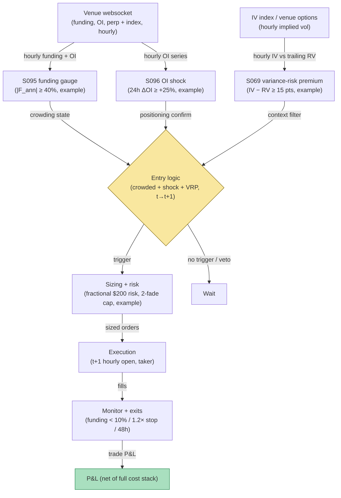

## Stage 175/200 — T075: Crypto Funding-Rate Reversal

*Batch TB8 · Strategy 75/100 · Signals S095, S096, S069 · Provenance [D/SR]*

### T1. One-line verdict

| | |
|---|---|
| **Style** | Contrarian: fade crowded perpetual-futures positioning when funding is extreme |
| **Edge source** | Perpetual funding rates measure the price longs pay shorts to hold the peg; extremely positive funding means the long side is crowded. When that crowding coincides with an open-interest shock (S096) and an elevated variance-risk premium (S069), the rule shorts the crowded side for 24–48 hours. Funding is a **crowding and carry gauge — unconditional contrarian use is unsafe**, so all three legs must agree |
| **Typical holding period** | 24–48 hours; flat by 48 hours (funding mean-reverts on an 8-hour cycle) |
| **Capacity hint** | Medium on majors (BTC/ETH perps); tens of millions in notional before funding-market impact bends the signal |
| **Build-or-buy in one line** | Build the funding/OI/VRP screen on exchange websocket data; nothing packaged sells a documented funding-reversal rule with honest fill causality |

### T2. Full mechanics

**Universe & session.** BTC and ETH USDⓈ-M perpetuals on one major venue (`example`: a single exchange to keep funding definitions consistent), 24/7. Spot reference from the same venue's index.

**Crowding (S095).** The **funding rate** is the periodic payment (typically every 8 hours) that keeps the perpetual price near spot: positive funding means longs pay shorts. Annualize it: `F_ann = funding_8h × 3 × 365`. The crowded-long state arms when `F_ann ≥ 40%` (`example`) — the long side is paying heavily to stay long. Mirror state for crowded shorts (`F_ann ≤ −40%`, `example`). Funding is read as crowding/carry, never as a standalone contrarian trigger.

**Positioning shock (S096).** Require an **open-interest shock**: 24-hour OI change ≥ +25% (`example`) in the direction of the crowded side — fresh leverage piled in, not just price drift. OI is reported per venue and is venue-specific; never sum OI across venues.

**Volatility context (S069).** The **variance-risk premium** — implied volatility (from the venue's options or an IV index) minus trailing realized volatility — must be elevated (IV − RV ≥ 15 vol points, `example`): crowded funding plus fearful options pricing is the combination this rule was reconstructed to fade. If VRP is negative (complacent), the rule stands down — crowded longs in a complacent market can stay crowded.

**Entry rule.** All three green on hourly bar *t* → earliest fill at the **open of bar t+1**, fading the crowded side (short the perp when funding extremely positive with a long OI shock; long when the mirror holds). Signal calculated at bar *t* can never fill on that bar.

**Exit rule.** Four exits, first touch wins (`example`): (1) funding normalization: exit when `|F_ann|` falls below 10% — the crowd left; (2) stop: 1.2× the entry-bar hourly range against the position; (3) time stop: flat at 48 hours; (4) OI-collapse exit: if OI falls > 30% from entry while the position is red, exit — the unwind is disorderly and the premise (crowded) is gone.

**Position sizing.** Fixed fractional risk: `R = $200` (`example`) per trade, `N = ⌊ R / (stop distance) ⌋` in contracts. Max 2 concurrent funding fades (`example`) — crypto correlations spike exactly when these fire.

**Risk limits.** Daily loss stop −3R (`example`); no entries within 1 hour of a scheduled funding timestamp (the rate can print stale); venue circuit-breaker: if the websocket lags > 5 seconds, no new entries.

**Cost model.** Taker fee 5 bps/side (`example`); half-spread each way on the perp book; market impact modeled explicitly; funding paid/received over the hold is a P&L line, not a cost. The worked example below shows the canonical small-size ledger: at small size the full cost stack exceeds gross — the honest baseline.

**Order/execution sketch.** Post-only where possible, else taker at the t+1 open of the hourly bar; participation ≤ 10% of the bar's volume (`example`).

**Parameter robustness.** The `example` thresholds (|F_ann| ≥ 40%, 24h ΔOI ≥ +25%, IV−RV ≥ 15) are starting points. Sensitivity protocol: vary the funding arm at 25%/40%/60% annualized and the OI shock at 15%/25%/40%; the fade's sign should persist. Two measurement choices matter: annualizing the 8-hour rate by ×1095 assumes the rate persists — test against the venue's real-time premium index as an alternative trigger, since the published funding can lag the live premium by most of an 8-hour period. Also test bull/bear funding regimes separately; funding behaves differently when the market's structural bid is long vs when it is not.
### T3. Signals it consumes

| Signal | Role | Weight / logic |
|---|---|---|
| S095 (funding rate) | Crowding gauge | `|F_ann| ≥ 40%` (`example`) arms the fade; funding paid/received is a P&L line |
| S096 (open-interest shock) | Positioning confirm | 24h OI change ≥ +25% with the crowded side (`example`); venue-specific |
| S069 (implied-minus-realized VRP) | Context filter | IV − RV ≥ 15 vol points (`example`); stands down when complacent |
| Funding-normalization / OI-collapse logic (strategy rule) | Exit manager | `|F_ann| < 10%` exit; 48-hour time stop |

### T4. Worked example — numbers + P&L (SYNTHETIC)

Synthetic hourly bars, BTC perp, seed 175. Funding prints +0.11% per 8-hour period (`F_ann ≈ 120%`, extremely positive), 24-hour OI is up 31% (long shock), and IV − RV = 19 vol points (elevated). Signal at hourly close *t* → fill at the next hourly open: **short 0.5 BTC perp at $67,200**. Funding normalizes over 30 hours; exit **long 0.5 BTC at $67,176** when `|F_ann|` falls below 10%. Price P&L: 0.5 × $24 = **$12.00 gross** before funding; modeled net funding drag over the hold (the short pays while the rate normalizes): **−$6.00** — shown separately, not netted into costs — for a strategy gross of **$6.00**. The full execution-cost stack:

| Item | Calculation | Amount |
|---|---|---|
| Strategy gross (price + funding drag) | $12.00 − $6.00 funding drag | +$6.00 |
| Taker fees (modeled 12.65 bps round-trip) | 2 × 0.5 × $67,188 avg × 0.0001265 | −$8.50 |
| Half-spread, both ways | modeled on perp book | −$4.50 |
| Market impact | modeled | −$3.00 |
| Funding/borrow financing | already in gross above | — |
| **Total execution cost** | | **−$16.00** |
| **Net P&L** | $6.00 − $16.00 | **−$10.00** |

This canonical ledger — **$6 gross, $16 full execution costs, −$10 net** — is the honest small-size baseline: at retail size, fees, spread, and impact dominate the funding edge. The example is synthetic and is not a profitability claim; fees-only accounting (omitting spread/impact) would fail this ledger.

### T5. Data & infra — what must run

Exchange websocket: perp mark/index prices, funding rates, open interest, hourly OHLCV; an IV source for S069 (venue options or a published IV index). All streaming; the funding/OI/VRP screen is a per-hour batch over 2–4 symbols — trivially within a Python loop at ~100–500k events/sec (`notes/cost-model.md`). Live working set far under ~77GB. Build estimate: M+ harness 40–100 hours, $6,000–$15,000 loaded (`notes/cost-model.md`); crypto venue data is mostly free via websocket, so no H-tier licensing is required for the core loop.

**Calibration discipline.** Walk-forward with a 1-day embargo (24–48h holds); perturb thresholds ±25%; multiple-testing control per the standing protocol (PSR/DSR). Venue-data hygiene: record the funding formula version, the premium-index constituents, and the OI definition per venue — all three change without notice. Never sum OI across venues, and never splice funding history across a formula change. Stress-split the backtest: the rule must survive 2021-style bull funding and 2022-style bear funding separately, not just on the pooled sample.
### T6. Buy vs build

The venue websocket is free. Historical funding/OI for backtests: **Kaiko** or **CoinMetrics** (thousands/yr class, `indicative — verify before budgeting`); alternatives include exchange flat-file history (free). Backtest hosting: **QuantConnect** crypto support (~$60–$300/mo class, `indicative — verify before budgeting`); execution test on the venue's testnet/paper feed (no incremental fee, `indicative — verify before budgeting`). Verdict: **build the screen, buy nothing except history if the free flat files are insufficient.** No vendor sells a documented funding-reversal rule with t→t+1 causality.

### T7. Success-ratio evidence

Published, checkable sources only:

1. He, Manela, Ross & von Wachter ("Fundamentals of Perpetual Futures") document no-arbitrage bounds between perp and spot and show perp deviations comove and diminish over time — the mechanical backdrop that lets funding mean-revert. (https://arxiv.org/abs/2212.06888)
2. Schmeling, Schrimpf & Todorov, "Crypto Carry" (BIS Working Paper 1087, 2023): funding-rate carry strategies earned up to ~40% annualized in their sample — the carry side of the S095 gauge, measured on long carry, not on this rule's contrarian fade. (https://ideas.repec.org/p/bis/biswps/1087.html)
3. Makarov & Schoar (2020): crypto arbitrage deviations are large, recurrent, and constrained by capital controls — a caution that apparent spreads (including funding-implied ones) persist because arbitrage capital is limited. (https://doi.org/10.1016/j.jfineco.2019.07.001)

None of these tests an hourly funding-reversal fade; the BIS carry result is a long-carry finding, not evidence for the contrarian leg.

**What the evidence does not show.** The BIS crypto-carry result (up to ~40% annualized) is a long-carry finding — it supports the S095 gauge as a measure of compensation for holding, not the contrarian fade this rule trades. He et al.'s no-arbitrage bounds describe where perp prices must live, not how fast funding mean-reverts or whether fading extreme funding earns anything after the 5 bps taker fee on both sides. Makarov & Schoar's limits-to-arbitrage caution applies directly: persistent deviations exist because capital cannot freely lean against them, and a small account fading funding is the constrained capital in their story. The canonical −$10 net ledger in T4 is the honest baseline — at retail size the strategy pays to learn.
### T8. Failure modes

- **Unconditional contrarian use.** Fading extreme funding without the OI and VRP legs is the documented unsafe mode — crowded positions can stay crowded through funding normalization that never comes.
- **Funding-rate staleness.** Published funding can lag the live premium index; compute the rate from the venue's formula on live inputs, don't trust the display field near funding timestamps.
- **Venue-specific OI.** OI shocks on one venue may not reflect aggregate positioning; never sum OI across venues with different definitions.
- **Liquidation cascades.** Extreme funding often precedes forced liquidations; the fade's stop must assume gap risk — the 1.2×-range stop can be jumped.
- **Fee-tier reality.** The 5 bps taker assumption requires a real fee tier; retail taker fees are often higher, which worsens the already-negative small-size ledger.

- **Wash-traded OI.** Reported open interest can be inflated by wash trading on less-policed venues; an OI "shock" manufactured by fictitious volume arms the rule on false positioning. Prefer venues with published surveillance, and cross-check OI shocks against volume shocks — real positioning moves both.
- **Premium-index vs funding lag.** Entering on a stale published funding print while the live premium has already normalized means fading a crowd that already left. Compute the expected funding from live premium-index inputs and require agreement with the published rate before arming.
### T9. Visuals

*Chart caption: synthetic data — not market data. Watermark reads "SYNTHETIC EXAMPLE" exactly.*

### T10. Sources

1. He, Z., Manela, A., Ross, O. & von Wachter, M. "Fundamentals of Perpetual Futures." arXiv:2212.06888. https://arxiv.org/abs/2212.06888 — no-arbitrage bounds for perps; deviations comove and diminish over time. Title verified 2026-09-10.
2. Schmeling, M., Schrimpf, A. & Todorov, K. "Crypto Carry." BIS Working Paper 1087 (2023). https://ideas.repec.org/p/bis/biswps/1087.html — funding-rate carry up to ~40% annualized in sample. Title verified 2026-09-10.
3. Makarov, I. & Schoar, A. "Trading and Arbitrage in Cryptocurrency Markets." *Journal of Financial Economics* 135(2), 293–319 (2020). https://doi.org/10.1016/j.jfineco.2019.07.001 — large recurrent deviations constrained by capital controls. Title verified 2026-09-10.

**Unverified leads** (not confirmed facts — verify before use):
- Grok Q-TB8 funding answers and the quarantined TB6 T051 funding-carry draft — chatbot-generated synthetic material adapted here with new stage/seed/signals (175, S095/S096/S069); the old T051 S081/S082/S090 roles were not reused.
- Kaiko/CoinMetrics price classes above are market-rate bands, `indicative — verify before budgeting`, not quotes.

*Source log: Grok answered Q-TB8-1..7 (2026-09-10); all claims independently verified or labeled unverified.*
