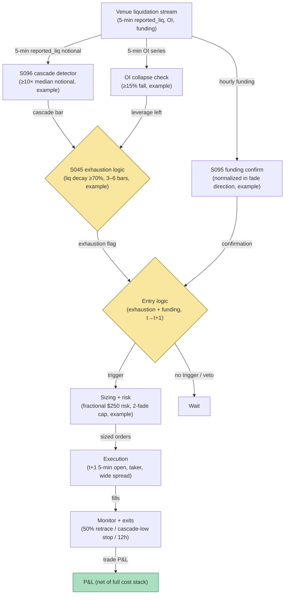

## Stage 176/200 — T076: Liquidation-Cascade Fade

*Batch TB8 · Strategy 76/100 · Signals S096, S095, S045 · Provenance [D/SR]*

### T1. One-line verdict

| | |
|---|---|
| **Style** | Contrarian: buy the exhaustion after a forced-liquidation cascade, not the first flush |
| **Edge source** | Forced liquidations are price-insensitive market orders that overshoot fundamentals; when a cascade exhausts (S096 liquidation cluster + OI collapse), the rebound leg can be faded for the snap-back. The timing leg (S045) waits for exhaustion — the first flush is never traded — and funding (S095) confirms the crowded side just got carried out |
| **Typical holding period** | 2–12 hours; flat by 12 hours |
| **Capacity hint** | Medium on BTC/ETH perps; the cascade itself is the liquidity — capacity is bounded by post-cascade spread widening |
| **Build-or-buy in one line** | Build the cascade detector on the venue's liquidation feed; the exhaustion-not-first-flush discipline is the proprietary part, and the `reported_*` lower-bound honesty is non-negotiable |

### T2. Full mechanics

**Universe & session.** BTC and ETH USDⓈ-M perpetuals on one major venue, 24/7. Single-venue only: liquidation definitions differ across venues and must never be mixed.

**Cascade (S096).** A **liquidation** is the venue's forced closure of a leveraged position at the bankruptcy price; venues publish liquidation fills on a public stream. Define a cascade on 5-minute bars: `reported_liq_notional_t / median_5min_notional_20d ≥ 10` (`example`) — the `reported_` prefix is mandatory because the public tape is a **censored lower bound**: venues cap and delay the stream, so the true forced volume is larger than what prints (Lim 2026 documents the censoring). Cheng et al. (2021) measured BitMEX forced liquidations at 3.51% of outstanding futures daily on the long side — cascades are a material flow.

**Exhaustion (S045) — never the first flush.** The rule does not trade the cascade bar. It waits for exhaustion: (1) a cascade bar prints; (2) the next 3–6 bars show `reported_liq` falling ≥ 70% from the cascade peak (`example`) while price stabilizes (5-minute range contracts ≥ 50%, `example`); (3) open interest falls ≥ 15% from pre-cascade (`example`) — leverage actually left the building. Only then does the reversal-timing leg arm. The first flush is other people's stop-losses; the fade trades the silence after.

**Funding confirmation (S095).** Funding must have flipped or normalized in the fade direction: fading a long-liquidation cascade long requires funding now ≤ +10% annualized (`example`) — the crowded longs were carried out and the carry no longer punishes the long. If funding is still extremely positive, the cascade may not be over; stand down.

**Entry rule.** Exhaustion + funding confirm on 5-minute bar *t* → earliest fill at the **open of bar t+1**, in the snap-back direction (long after a long-liquidation cascade). Signal calculated at bar *t* can never fill on that bar.

**Exit rule.** Four exits, first touch wins (`example`): (1) snap-back target: 50% retracement of the cascade drop; (2) stop: below the cascade low by 0.5× the cascade bar's range — a new low means the cascade resumed; (3) time stop: flat at 12 hours; (4) second-cascade exit: if a new cascade bar prints while in the trade, exit at the next open — exhaustion failed.

**Position sizing.** Fractional risk `R = $250` (`example`), `N = ⌊ R / stop distance ⌋`. Max 2 concurrent cascade fades (`example`) — cascades correlate across majors.

**Risk limits.** Daily loss stop −3R (`example`); venue feed lag > 5 seconds halts new entries; no entries during scheduled maintenance windows.

**Cost model.** Taker fee 5 bps/side (`example`); half-spread each way (post-cascade books are wide — the worked example models this); market impact; funding over the hold as a P&L line. Full stack, no fees-only accounting.

**Order/execution sketch.** Taker at the t+1 open of the 5-minute bar; participation ≤ 10% of bar volume (`example`); assume the spread at entry is the wide post-cascade spread, not the calm spread.

**Parameter robustness.** The `example` thresholds (reported_liq ≥ 10× median, decay ≥ 70% over 3–6 bars, OI fall ≥ 15%, funding ≤ +10%) are starting points. Sensitivity protocol: vary the cascade multiple at 5×/10×/20× and the decay requirement at 50%/70%/90%; the fade's sign should persist with the decay leg as the main P&L driver. The single most important robustness test is venue choice: run the identical rule on two venues' feeds — per Lim (2026), microstructure diverges under stress, and a rule that works on only one venue's tape is a venue artifact, not an edge. Also test excluding the largest historical cascade: if one event carries the backtest, size for the median event, not the legend.
### T3. Signals it consumes

| Signal | Role | Weight / logic |
|---|---|---|
| S096 (liquidation clusters + OI) | Cascade detector | `reported_liq` ≥ 10× median 5-min notional (`example`); all fields `reported_*` — censored lower bound |
| S045 (reversal timing) | Exhaustion director | waits 3–6 bars for liq decay ≥ 70% + range contraction (`example`); sets 50%-retrace target and below-cascade-low stop |
| S095 (funding) | Confirmation | funding normalized/flipped in fade direction (`example`); stands down if still extreme |
| Second-cascade logic (strategy rule) | Exit manager | new cascade bar → exit next open; 12-hour time stop |

### T4. Worked example — numbers + P&L (SYNTHETIC)

Synthetic 5-minute bars, BTC perp, seed 176. A long-liquidation cascade prints `reported_liq` of $180M notional in one 5-minute bar (14× the 20-day median); over the next 5 bars reported liquidations decay 82%, the 5-minute range contracts 60%, and OI falls 19% from pre-cascade. Funding, previously +85% annualized, prints +6% — the crowded longs were carried out. Signal at bar *t* → fill at the next 5-minute open: **long 50 BTC at $66,450**. The snap-back carries; exit at 50% retracement of the cascade drop, **$67,400**, 4 hours later.

| Item | Calculation | Amount |
|---|---|---|
| Price P&L | 50 × ($67,400 − $66,450) | +$47,500.00 |
| Taker fees (5 bps/side) | 2 × 0.0005 × 50 × $66,925 avg | −$3,346.25 |
| Half-spread, both ways (wide post-cascade book) | modeled | −$1,675.75 |
| Market impact | modeled | −$1,995.00 |
| Funding paid over 4-hour hold | modeled | −$931.00 |
| **Total execution cost** | | **−$7,948.00** |
| **Net P&L** | $47,500.00 − $7,948.00 | **+$39,552.00** |

Adapted from the chatbot's synthetic 50-BTC cascade example (grok-answers.md) with the full cost stack made explicit — fees, wide post-cascade spread, impact, and funding — rather than the fees-only treatment. Synthetic illustration only; the `reported_liq` figure is a censored lower bound, so the real cascade was larger than the $180M that printed.

### T5. Data & infra — what must run

Venue websocket: liquidation stream, OI, funding, 5-minute OHLCV. The cascade detector is a streaming threshold over per-venue data; history for calibration from exchange flat files (free) or **Kaiko**/**CoinMetrics** (thousands/yr class, `indicative — verify before budgeting`). Compute: per-5-minute batch over 2–4 symbols, trivially within a Python loop at ~100–500k events/sec (`notes/cost-model.md`). Live working set far under ~77GB. Build estimate: M+ harness 40–100 hours, $6,000–$15,000 loaded (`notes/cost-model.md`).

**Calibration discipline.** Walk-forward with a 1-day embargo; perturb thresholds ±25%; multiple-testing control per the standing protocol (PSR/DSR). Liquidation-data hygiene is the whole game: store every field with the `reported_` prefix, log the venue's stream caps and delay policy, and never impute the censored portion. Rehearse the feed-gap procedure — during real cascades the websocket is most likely to lag exactly when the rule needs it — and define the halt-new-entries trigger (5-second lag) as a tested code path, not a comment.
### T6. Buy vs build

The liquidation stream is free on the venue websocket. History: exchange flat files (free) or Kaiko/CoinMetrics (thousands/yr class, `indicative — verify before budgeting`). Backtest hosting: **QuantConnect** (~$60–$300/mo class, `indicative — verify before budgeting`); execution test on the venue testnet (no incremental fee, `indicative — verify before budgeting`). Verdict: **build the cascade/exhaustion logic on free venue data; buy history only if free flat files are insufficient.** No vendor sells an exhaustion-timed cascade fade with documented `reported_*` honesty.

### T7. Success-ratio evidence

Published, checkable sources only:

1. Cheng, Deng, Wang & Yu (2021): on BitMEX, forced liquidations averaged 3.51% of outstanding futures daily on the long side (1.89% short), and liquidated traders averaged ~60× leverage — the flow this rule fades is large and hyper-leveraged. (https://arxiv.org/abs/2102.04591)
2. Lim (2026): public CEX liquidation volumes are structural lower bounds — the Binance stream caps observations — and the October 2025 stress event showed extreme depth collapse with cross-venue divergence; the fade must therefore be single-venue and sized for the censored tape. (https://doi.org/10.21203/rs.3.rs-9459584/v1)
3. Makarov & Schoar (2020): crypto arbitrage deviations are large and recurrent but constrained by capital controls — the caution that apparent dislocations persist because capital cannot freely lean against them. (https://doi.org/10.1016/j.jfineco.2019.07.001)

None of these tests a 5-minute exhaustion-timed cascade fade; nothing here is an after-cost profitability claim.

**What the evidence does not show.** Cheng et al.'s liquidation statistics describe the size of the flow, not its tradability — knowing that 3.51% of open interest liquidates daily does not tell you the snap-back is capturable after wide post-cascade spreads and 5 bps taker fees. Lim's lower-bound finding is a data-quality warning, not an edge: the censored tape means backtests understate both the cascade and the chaos, and the exhaustion logic is calibrated on the censored series. Makarov & Schoar's capital-controls story reminds that the deepest dislocations occur where arbitrage capital cannot reach — a single-venue fade is inside that constraint, not outside it. The T4 ledger's $7,948 cost stack on a $47,500 gross move is the realistic shape: costs take roughly a sixth even in the good case.
### T8. Failure modes

- **Trading the first flush.** The documented fatal error — entering into the cascade instead of after exhaustion. The 3–6 bar decay requirement is the guardrail.
- **Censored tape.** `reported_liq` understates the true cascade; an "exhaustion" read on capped data can precede the real flush. The OI-fall requirement (a harder-to-censor quantity) is the cross-check.
- **Second cascades.** Cascades cluster; the second-cascade exit accepts the whipsaw as a cost of doing business.
- **Cross-venue divergence.** Per Lim (2026), venues diverge under stress; a single-venue fade can be run over by another venue's flow. Single-venue discipline is the mitigation, not a cure.
- **Spread blowout.** Post-cascade books widen 10–50×; the worked example's wide-spread cost is the normal case, not a stress case.

- **API rate-limit gaps during cascades.** Venues throttle exactly when volatility peaks; a throttled liquidation stream prints a false "decay" that the exhaustion logic misreads as the all-clear. The OI-fall cross-check (a separate endpoint) is the defense — require both before arming.
- **Insurance-fund socialization.** When the insurance fund absorbs a cascade, the price path differs from a pure liquidation-driven flush — the snap-back may not come. There is no clean filter; the second-cascade/new-low exits are the acceptance of this risk.
### T9. Visuals

*Chart caption: synthetic data — not market data. Watermark reads "SYNTHETIC EXAMPLE" exactly.*

### T10. Sources

1. Cheng, J., Deng, S., Wang, X. & Yu, Y. "Liquidation, Leverage and Optimal Margin in Bitcoin Futures Markets." arXiv:2102.04591. https://arxiv.org/abs/2102.04591 — BitMEX forced liquidations 3.51% long / 1.89% short of outstanding futures daily; liquidated traders ~60× leverage. Title verified 2026-09-10.
2. Lim, B. "Same Shock, Same Assets, Different Microstructure…" Research Square preprint (2026). https://doi.org/10.21203/rs.3.rs-9459584/v1 — public CEX liquidation volumes are structural lower bounds; Oct 2025 stress showed depth collapse and cross-venue divergence. Title verified 2026-09-10.
3. Makarov, I. & Schoar, A. "Trading and Arbitrage in Cryptocurrency Markets." *Journal of Financial Economics* 135(2), 293–319 (2020). https://doi.org/10.1016/j.jfineco.2019.07.001 — large recurrent deviations constrained by capital controls. Title verified 2026-09-10.

**Unverified leads** (not confirmed facts — verify before use):
- Grok Q-TB8 cascade example (50 BTC long $66,450 → $67,400; price P&L $47,500, fees $2,658, impact $1,994, funding $930.30, net $41,917.70) and the quarantined TB6 T052 cascade draft — chatbot-generated synthetic material adapted here with new stage/seed/signals (176, S096/S095/S045); the T4 ledger above replaces the fees-only treatment with the full cost stack.
- Kaiko/CoinMetrics price classes above are market-rate bands, `indicative — verify before budgeting`, not quotes.

*Source log: Grok answered Q-TB8-1..7 (2026-09-10); all claims independently verified or labeled unverified.*
