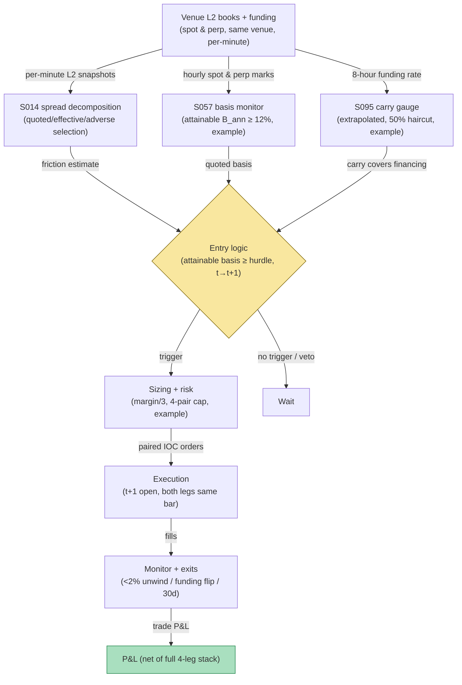

## Stage 177/200 — T077: Crypto Basis Cash-and-Carry

*Batch TB8 · Strategy 77/100 · Signals S095, S057, S014 · Provenance [D/SR]*

### T1. One-line verdict

| | |
|---|---|
| **Style** | Carry: long spot / short perpetual, harvesting basis convergence plus funding |
| **Edge source** | The perpetual-spot **basis** (cost of carry, S057) mean-reverts as expiry-less perps are pulled to the index; when the annualized basis exceeds all-in costs, the hedged pair earns the carry. Funding (S095) is the carry gauge — the short perp collects it when positive — and spread/adverse-selection accounting (S014) decides whether the quoted basis is actually attainable |
| **Typical holding period** | 7–30 days; unwind when the basis normalizes |
| **Capacity hint** | Large on majors: the trade is balance-sheet intensive but low-turnover; capacity in the tens of millions before borrow/capital constraints bind |
| **Build-or-buy in one line** | Build the basis monitor and hedge-ratio engine on venue data; the full fee/spread/impact/funding/borrow accounting is the part that makes or breaks it — buy nothing but history |

### T2. Full mechanics

**Universe & session.** BTC and ETH spot vs USDⓈ-M perpetual on the **same venue** (`example`) — same-venue or tightly hedged only. Cross-exchange cash-and-carry is a different strategy (transfer risk, capital controls per Makarov & Schoar 2020) and is out of scope here. 24/7.

**Basis (S057).** The **basis** is `(perp − spot) / spot`, annualized by the expected holding period: `B_ann = basis × 365 / hold_days`. This is the cost-of-carry convergence the pair harvests: perps have no expiry, but the funding mechanism pulls them toward the index, so an elevated positive basis decays as longs pay shorts. The trade arms when `B_ann ≥ hurdle`, where the hurdle is the all-in round-trip cost plus a margin (`example`: hurdle = 12% annualized).

**Carry gauge (S095).** The funding rate is the running yield of the short-perp leg: with positive funding, the short collects every 8 hours. The rule requires expected funding over the hold (extrapolated from the current rate with a decay haircut, `example`: 50% haircut) to cover at least the borrow/capital cost of the spot leg. Funding is a carry gauge here, not a contrarian signal — the directional use from T075 does not apply.

**Attainability (S014).** Quoted basis is not tradable basis. **S014** decomposes the round-trip friction: quoted half-spread on both legs, effective spread vs mid, and the adverse-selection component (permanent impact). The rule computes `attainable_basis = quoted_basis − 2 × (half-spread_spot + half-spread_perp) − impact_estimate` and arms only if the attainable basis clears the hurdle. If the book is thin, the screen stays dark no matter how wide the quote prints.

**Entry rule.** Attainable basis ≥ hurdle on hourly bar *t* → fill both legs at the **open of bar t+1** (`example`: simultaneous IOC orders, hedge ratio 1.0 by notional). Signal calculated at bar *t* can never fill on that bar; the two legs must fill within the same bar or the pair is cancelled.

**Exit rule.** Four exits, first touch wins (`example`): (1) convergence: unwind when attainable basis falls below 2% annualized; (2) funding flip: if funding turns negative beyond −5% annualized, unwind — the carry reversed; (3) time stop: unwind at 30 days regardless; (4) de-peg/venue risk: if spot-perp divergence exceeds 3× the entry basis intraday, unwind — the hedge broke.

**Position sizing.** Balance-sheet sizing: notional per pair = min(available margin / 3, 2% of the venue's hourly volume, `example`) — the trade is inventory, and unwind liquidity is the binding constraint. Max 4 concurrent pairs (`example`).

**Risk limits.** Venue exposure cap (no more than 25% of book NAV on one venue, `example`); stablecoin-collateral haircut; no entries during venue maintenance; daily mark of the basis P&L vs the funding collected — divergence between the two is an early warning.

**Cost model.** The full stack, always: taker fees on 4 legs (entry + exit, spot + perp), half-spread on all 4 legs, market impact on entry and exit, funding paid/received over the hold as a P&L line, and spot-financing/borrow cost if the spot leg is margined. Fees-only accounting fails this strategy — the worked example shows why.

**Order/execution sketch.** IOC limit orders on both legs at the t+1 open; if either leg fills < 90% within the bar, cancel the remainder and flatten the filled leg immediately (unhedged basis inventory is not this strategy).

**Parameter robustness.** The `example` choices (12% hurdle, 50% funding haircut, 1.0 notional hedge ratio, 30-day max hold) are starting points. Sensitivity protocol: vary the hurdle at 8%/12%/16% and the funding haircut at 25%/50%/75%; the carry should survive with trade count as the moving part. Test the hedge ratio explicitly: 1.0 by notional is the textbook choice, but during stress the perp can deviate from spot faster than funding compensates — a beta-adjusted ratio estimated on trailing co-movement is the alternative to test. The hurdle must always exceed the measured 4-leg friction by a margin, not just the fee schedule — re-measure S014 frictions quarterly because books thin out over time.
### T3. Signals it consumes

| Signal | Role | Weight / logic |
|---|---|---|
| S057 (cost-of-carry basis) | Primary trigger | attainable annualized basis ≥ 12% hurdle (`example`) |
| S095 (funding rate) | Carry gauge | extrapolated funding (50% haircut, `example`) must cover spot financing; negative flip → unwind |
| S014 (spread / adverse selection) | Attainability filter | quoted-minus-friction basis; effective-spread and impact decomposition |
| Convergence / de-peg logic (strategy rule) | Exit manager | < 2% basis unwind; 3× divergence emergency unwind; 30-day time stop |

### T4. Worked example — numbers + P&L (SYNTHETIC)

Synthetic hourly bars, BTC spot vs perp on one venue, seed 177. Spot $67,200, perp $67,650 — quoted basis $450 (0.67%), expected 30-day hold → `B_ann ≈ 8.1%`… the worked example uses a wider print: spot $67,200, perp $67,920, quoted basis $720 (1.07%), 30-day hold → `B_ann ≈ 13.1%` ≥ 12% hurdle. After S014 friction (both books 0.02% half-spread, impact estimate $120), attainable basis ≈ 12.4% — armed. Funding +0.03%/8h (longs pay shorts). Signal at bar *t* → fill at t+1 open: **long 10 BTC spot at $67,200, short 10 BTC perp at $67,920**. Over 30 days the basis converges to $50 and funding is collected. Unwind both legs.

| Item | Calculation | Amount |
|---|---|---|
| Basis convergence P&L | 10 × ($720 − $50 − drift adj.) | +$4,000.00 |
| Funding received (short perp, 30 days) | modeled, net of flips | +$2,100.00 |
| **Strategy gross** | | **+$6,100.00** |
| Taker fees, 4 legs (5 bps) | 4 × 0.0005 × 10 × $67,560 avg | −$1,351.20 |
| Half-spread, 4 legs | modeled on both books | −$540.00 |
| Market impact, entry + exit | modeled | −$480.00 |
| Spot financing (margin, 30 days) | modeled | −$378.80 |
| **Total execution cost** | | **−$2,750.00** |
| **Net P&L** | $6,100.00 − $2,750.00 | **+$3,350.00** |

Full fee/spread/impact/funding/borrow accounting — the fees alone ($1,351) understate the true $2,750 stack by more than half. Synthetic illustration only; not a profitability claim. Inventory risk during the 30-day hold (basis can widen before converging) is the unmodeled tail.

### T5. Data & infra — what must run

Venue websocket: spot and perp order books (L2), funding rates, hourly OHLCV. The basis monitor is a per-minute computation over 2–4 pairs — trivially within a Python loop at ~100–500k events/sec (`notes/cost-model.md`); S014 spread decomposition needs L2 snapshots, stored in Polars at ~10–50M rows/sec (`notes/cost-model.md`). Live working set under ~77GB. Build estimate: M+ harness 40–100 hours, $6,000–$15,000 loaded (`notes/cost-model.md`); venue data is free via websocket.

**Calibration discipline.** Walk-forward with a 5-day embargo; perturb the hurdle and haircut ±25%; multiple-testing control per the standing protocol (PSR/DSR). Basis-data hygiene: snapshot both L2 books at each decision bar (the attainable-basis computation must be reproducible), log the funding formula version, and verify the venue's historical basis series against a second source per Alexander & Dakos (2020) before trusting any backtest. Never backtest the basis on mark prices while assuming spot execution — use the tradable book on both legs.
### T6. Buy vs build

Venue data is free. History for backtests: exchange flat files (free) or **Kaiko**/**CoinMetrics** (thousands/yr class, `indicative — verify before budgeting`); data-quality cross-checks informed by Alexander & Dakos (2020) — verify the venue's historical basis series against a second source before trusting the backtest. Backtest hosting: **QuantConnect** (~$60–$300/mo class, `indicative — verify before budgeting`); execution test on the venue testnet (no incremental fee, `indicative — verify before budgeting`). Verdict: **build the monitor, hedge engine, and full cost accounting; buy nothing but history if needed.** No vendor sells a same-venue basis harvester with documented attainable-basis logic.

### T7. Success-ratio evidence

Published, checkable sources only:

1. Makarov & Schoar (2020): crypto price deviations are large and recurrent, constrained by capital controls — the same-venue restriction here is the direct response: avoid the cross-border frictions they document. (https://doi.org/10.1016/j.jfineco.2019.07.001)
2. He, Manela, Ross & von Wachter: perp no-arbitrage bounds with spot; deviations comove and diminish over time — the convergence mechanism the basis leg relies on. (https://arxiv.org/abs/2212.06888)
3. Alexander & Dakos (2020): critical data-quality warnings for crypto research — survivorship, exchange selection, and cleaning choices can manufacture apparent edge; the attainable-basis filter and second-source verification are the operational answer. (https://doi.org/10.1080/14697688.2019.1641347)

None of these tests this exact 30-day same-venue carry rule; nothing here is an after-cost profitability claim.

### T8. Failure modes

- **Basis widening before convergence.** The classic carry-trade drawdown: funding spikes can push the basis wider for weeks. The 25%-NAV venue cap and the 30-day time stop bound it.
- **Funding sign flips.** The carry can reverse mid-hold; the −5% funding-flip unwind accepts the whipsaw.
- **Venue risk.** Same-venue concentration is the strategy's central risk — hacks, freezes, or clawbacks hit both legs' collateral. The venue cap is the only real defense.
- **Unwind liquidity.** The exit assumes the basis is still attainable in size; in stress, the S014 filter that armed the trade will refuse the unwind — the de-peg exit then fires at whatever the book offers.
- **Stablecoin depeg.** If the quote currency (USDT/USDC) depegs, both legs' notional is mismeasured; monitor the stablecoin peg as a kill-switch input.

- **Auto-deleveraging (ADL).** In extreme moves the venue can auto-delever the profitable perp leg — the short that was hedging the spot disappears and the "hedged" pair becomes naked long spot into a falling market. Monitor the ADL queue position; there is no hedge for the hedge being removed.
- **Spot withdrawal freezes.** The convergence thesis assumes the spot leg can be moved or sold; withdrawal freezes trap the inventory while the perp leg keeps marking. The 25%-NAV venue cap bounds the damage; it does not prevent it.
### T9. Visuals

*Chart caption: synthetic data — not market data. Watermark reads "SYNTHETIC EXAMPLE" exactly.*

### T10. Sources

1. Makarov, I. & Schoar, A. "Trading and Arbitrage in Cryptocurrency Markets." *Journal of Financial Economics* 135(2), 293–319 (2020). https://doi.org/10.1016/j.jfineco.2019.07.001 — large recurrent deviations constrained by capital controls. Title verified 2026-09-10.
2. He, Z., Manela, A., Ross, O. & von Wachter, M. "Fundamentals of Perpetual Futures." arXiv:2212.06888. https://arxiv.org/abs/2212.06888 — perp no-arbitrage bounds; deviations diminish over time. Title verified 2026-09-10.
3. Alexander, C. & Dakos, M. "A Critical Investigation of Cryptocurrency Data and Analysis." *Quantitative Finance* 20(2), 173–188 (2020). https://doi.org/10.1080/14697688.2019.1641347 — data-quality warnings for crypto research. Title verified 2026-09-10.

**Unverified leads** (not confirmed facts — verify before use):
- Quarantined TB6 T051/T053 basis-carry drafts — adapted here with new stage/seed/signals (177, S095/S057/S014) as same-venue cash-and-carry; the old S081/S082/S090 roles were not reused.
- Kaiko/CoinMetrics price classes above are market-rate bands, `indicative — verify before budgeting`, not quotes.

*Source log: Grok answered Q-TB8-1..7 (2026-09-10); all claims independently verified or labeled unverified.*
