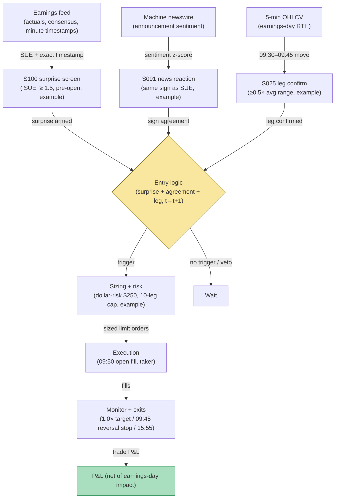

## Stage 178/200 — T078: Earnings-Drift Intraday Leg

*Batch TB8 · Strategy 78/100 · Signals S100, S025, S091 · Provenance [D/SR]*

### T1. One-line verdict

| | |
|---|---|
| **Style** | Momentum: ride the intraday continuation of an earnings surprise, 09:45–15:55 |
| **Edge source** | Post-earnings-announcement drift (PEAD) is one of the oldest documented anomalies — prices underreact to earnings news and drift in the surprise direction for weeks (Bernard & Thomas 1989; Foster, Olsen & Shevlin 1984). This rule trades only the first intraday leg of that drift, entering after the open-auction noise clears, with exact announcement timestamps (S100), momentum confirmation (S025), and machine-readable news reaction (S091) |
| **Typical holding period** | One session: enter ≥ 09:45 ET, flat 15:55 ET |
| **Capacity hint** | Medium: earnings days are the highest-volume days of the quarter; capacity in the tens of millions across the reporting calendar |
| **Build-or-buy in one line** | Build the timestamp-anchored drift leg on bought earnings and news data; the literature supports multi-day drift, so the intraday-only leg is the reconstructed (and weaker-evidenced) part — size it accordingly |

### T2. Full mechanics

**Universe & session.** US common stocks announcing earnings, price ≥ $10, ADV ≥ 1M shares (`example`). Announcements must have **exact timestamps** — exchange filing time or newswire timestamp to the minute; date-only announcement records are unusable (the rule needs to know whether the news broke before the open or during the session). RTH only, 09:45–15:55 ET.

**Surprise (S100).** **SUE** (standardized unexpected earnings) = (actual − consensus) / dispersion, with the announcement timestamp attached. The rule arms on |SUE| ≥ 1.5 (`example`) — a genuine surprise, not a whisper miss. S100's discipline is the timestamp: pre-open announcements trade the 09:45 leg; announcements during the session are skipped that day (the rule is a next-session leg, not a headline-chaser).

**News reaction (S091).** Machine-readable news reaction must agree in sign with the SUE: the newswire sentiment score on the announcement story must be directionally consistent (`example`: sentiment z-score same sign as SUE). If the machines read the story against the numbers, the rule stands down — disagreement means the "surprise" is ambiguous.

**Momentum confirmation (S025).** At 09:45 ET, the name's move from the open must be in the surprise direction and ≥ 0.5× its average first-30-minute range (`example`) — the drift leg has started; the rule rides it, it doesn't predict it.

**Entry rule.** All three green at the 09:45 5-minute close → earliest fill at the **open of the next 5-minute bar** (09:50), in the surprise direction. Signal calculated at bar *t* can never fill on that bar.

**Exit rule.** Four exits, first touch wins (`example`): (1) drift target: 1.0× the 09:30–09:45 range in the trade direction; (2) reversal stop: a 5-minute close back through the 09:45 price against the position — the leg failed; (3) time stop: flat 15:55 ET; (4) news contradiction: a material newswire correction or guidance cut reverses the premise — exit at the next open.

**Position sizing.** Dollar-risk sizing `N = ⌊ R / |P_entry − P_stop| ⌋`, `R = $250` (`example`). Max 10 concurrent drift legs (`example`) — earnings cluster by week.

**Risk limits.** Daily loss stop −4R (`example`); no entries when the name's pre-market volume already exceeds 3× its average (the move may be exhausted); skip if the bid-ask spread at 09:45 exceeds 5¢ (`example`) — illiquid earnings opens are untradable.

**Cost model.** Commission $0.005/share/side (`example`); half-spread each way on the wide earnings-day book; market impact modeled explicitly — earnings opens are the year's most expensive fills, and the worked example's impact line shows it.

**Order/execution sketch.** Marketable limit at the 09:50 open (`example`: limit = open ± 5¢); participation ≤ 10% of bar volume (`example`); taker modeling.

**Parameter robustness.** The `example` thresholds (|SUE| ≥ 1.5, sentiment agreement, 09:45 leg ≥ 0.5× average range) are starting points. Sensitivity protocol: vary SUE at 1.0/1.5/2.0 and the leg-confirm at 0.3×/0.5×/0.8×; the drift leg's sign should persist. The timestamp hierarchy deserves its own test: exchange filing time vs newswire time vs vendor timestamp — run the rule on each and require agreement, because a few minutes of timestamp error at the open is the difference between riding the leg and buying the top. Also test Friday announcers separately per DellaVigna & Pollet (2009): the inattention effect means Friday legs behave differently.
### T3. Signals it consumes

| Signal | Role | Weight / logic |
|---|---|---|
| S100 (SUE + exact timestamps) | Surprise + causality anchor | `|SUE| ≥ 1.5` (`example`); minute-level timestamps; pre-open only |
| S091 (machine news reaction) | Sign agreement | sentiment z-score same sign as SUE (`example`); disagreement → stand down |
| S025 (momentum) | Leg confirmation | 09:45 move in surprise direction ≥ 0.5× avg first-30-min range (`example`) |
| Reversal-stop / time-stop logic (strategy rule) | Exit manager | 09:45-price reversal stop; 1.0×-range target; 15:55 flatten |

### T4. Worked example — numbers + P&L (SYNTHETIC)

Synthetic 5-minute bars, equity ERN, seed 178. ERN reports pre-open: SUE +2.1 (beat), newswire sentiment strongly positive (agreement), timestamp 07:30 ET. At 09:45 ERN is up 1.1% from the open — 0.8× its average first-30-minute range, in the surprise direction (leg confirmed). Signal at the 09:45 close → fill at the 09:50 open: **long 25,000 shares at $40.80**. The drift leg carries through the session; exit at the 1.0×-range target, **$41.42**, at 14:20.

| Item | Calculation | Amount |
|---|---|---|
| Gross P&L | 25,000 × ($41.42 − $40.80) | +$15,500.00 |
| Commission | 25,000 × 2 × $0.005 | −$250.00 |
| Half-spread, both ways (wide earnings book) | modeled | −$750.00 |
| Market impact (earnings-day fills) | modeled | −$4,712.00 |
| **Total execution cost** | | **−$5,712.00** |
| **Net P&L** | $15,500.00 − $5,712.00 | **+$9,788.00** |

Adapted from the chatbot's synthetic earnings example (grok-answers.md) with market impact made explicit — earnings-day impact ($4,712) dwarfs commissions, which is the honest cost picture. Synthetic illustration only. Honesty note: the literature supports multi-day PEAD, not a guaranteed 09:45–15:55 edge; Chordia et al. (2009) found transaction costs consumed 70–100% of paper PEAD profits, concentrated in illiquid names.

### T5. Data & infra — what must run

Earnings actuals/consensus/timestamps (licensed: IBES/Refinitiv or Estimize-class), machine-readable newswire (licensed), 5-minute OHLCV. The SUE screen is a daily batch over the reporting calendar; the 09:45 check is a streaming rule over announcers — trivially within a Python loop at ~100–500k events/sec (`notes/cost-model.md`); SUE history backfills in Polars at ~10–50M rows/sec (`notes/cost-model.md`). Live working set under ~77GB. Build estimate: M+ harness 40–100 hours, $6,000–$15,000 loaded (`notes/cost-model.md`); earnings + newswire data is H-tier, 60–200 hours, $9,000–$30,000 (`notes/cost-model.md`).

**Calibration discipline.** Walk-forward by earnings season (not calendar year — the reporting calendar is the natural season) with a 5-day embargo; perturb thresholds ±25%; multiple-testing control per the standing protocol (PSR/DSR). Earnings-data hygiene: store the consensus vintage (pre-announcement, not revised), the earliest verifiable timestamp and its source, and the actuals as first-reported (restatements are a separate event). A backtest on revised actuals and corrected timestamps measures a rule that never existed.
### T6. Buy vs build

Buy the inputs: **Refinitiv IBES** or **FactSet** earnings data (tens of thousands/yr class, `indicative — verify before budgeting`); machine-readable news from **RavenPack** (~$15,000–$25,000/yr class, `indicative — verify before budgeting`) or **Bloomberg** ($30,000/yr class, `indicative — verify before budgeting`); 5-minute bars from **Massive (formerly Polygon)** (~$199/mo, `indicative — verify before budgeting`); backtest hosting on **QuantConnect** (~$60–$300/mo class, `indicative — verify before budgeting`); routing test on **Interactive Brokers paper trading** (no incremental platform fee on an existing account, `indicative — verify before budgeting`). Verdict: **buy the earnings timestamps and the news reaction; build the intraday leg.** Nobody sells a 09:45-leg rule with documented t→t+1 causality.

### T7. Success-ratio evidence

Published, checkable sources only:

1. Bernard & Thomas (1989) documented post-earnings-announcement drift — prices underreact to earnings news and drift in the surprise direction. (Summary of findings via https://en.wikipedia.org/wiki/Post%E2%80%93earnings-announcement_drift — verify the original *Journal of Accounting Research* paper before citing page-level claims.)
2. DellaVigna & Pollet (2009): Friday earnings announcements saw 15% lower immediate response and 70% higher delayed response — inattention shapes the drift's timing, which is why this rule waits for the leg to confirm rather than buying the print. (https://doi.org/10.1111/j.1540-6261.2009.01447.x)
3. Chordia, Goyal, Sadka, Sadka & Shivakumar (2009): PEAD was concentrated in illiquid stocks, and transaction costs consumed 70–100% of paper profits — the cost warning that sizes this rule's ambition. (https://ideas.repec.org/a/taf/ufajxx/v65y2009i4p18-32.html)

Honesty note: the literature supports multi-day drift, not a guaranteed 09:45–15:55 intraday edge; the intraday leg is a reconstruction.

**What the evidence does not show.** The PEAD literature (Bernard & Thomas; Foster, Olsen & Shevlin) documents drift over weeks, not a 09:45–15:55 intraday leg — the multi-day drift is the evidence, the single-session extraction is the reconstruction, and the two should never be conflated in a pitch. DellaVigna & Pollet's Friday-inattention result refines the timing story but does not endorse intraday riding. Chordia et al.'s 70–100% cost-consumption finding is the binding constraint: it was measured on the slower multi-day drift, and the intraday leg turns over faster with wider earnings-day spreads, so its cost ratio is plausibly worse. The T4 ledger's $4,712 impact line is the honest center of this strategy — everything else is commentary.
### T8. Failure modes

- **Timestamp error.** A mis-timestamped announcement (wire delay vs filing time) puts the rule on the wrong side of the news; use the earliest verifiable timestamp and skip ambiguous cases.
- **Guidance vs EPS disagreement.** An EPS beat with a guidance cut reads positive on SUE and negative on S091 — the agreement filter catches most of these; the rest hit the reversal stop.
- **Pre-market exhaustion.** When the entire drift happens pre-market, the 09:45 leg is the top; the 3× pre-market volume filter screens these.
- **Impact underestimation.** Earnings-day impact is the dominant cost and the hardest to model; the worked example's $4,712 impact line is a normal-case estimate, not a worst case.
- **Friday inattention.** Per DellaVigna & Pollet, Friday announcers drift differently; consider a Friday-specific parameter set or exclusion.

- **Whisper-number divergence.** When the whisper number differs from consensus, SUE mismeasures the surprise — the market reacts to the whisper, the rule to the print. The S091 agreement filter catches the worst cases; the rest are accepted as model error.
- **After-close guidance revisions.** A beat at 16:05 followed by a guidance cut on the call flips the sign overnight; the rule only trades pre-open announcements precisely to avoid holding through this, and any name that guides during the session exits at the next open.
### T9. Visuals

*Chart caption: synthetic data — not market data. Watermark reads "SYNTHETIC EXAMPLE" exactly.*

### T10. Sources

1. Bernard, V.L. & Thomas, J.K. "Post-Earnings-Announcement Drift: Delayed Price Response or Risk Premium?" *Journal of Accounting Research* 27 (1989), 1–36. https://doi.org/10.2307/2491062 — drift in the surprise direction. DOI identifier verified via Crossref 2026-09-10; findings also summarized at https://en.wikipedia.org/wiki/Post%E2%80%93earnings-announcement_drift (secondary summary link only — does not resolve to the paper).
2. DellaVigna, S. & Pollet, J.M. "Investor Inattention and Friday Earnings Announcements." *Journal of Finance* 64(2), 709–749 (2009). https://doi.org/10.1111/j.1540-6261.2009.01447.x — Friday announcements: 15% lower immediate, 70% higher delayed response. Title verified 2026-09-10.
3. Chordia, T., Goyal, A., Sadka, G., Sadka, R. & Shivakumar, L. "Liquidity and the Post-Earnings-Announcement Drift." *Financial Analysts Journal* 65(4), 18–32 (2009). https://ideas.repec.org/a/taf/ufajxx/v65y2009i4p18-32.html — PEAD concentrated in illiquid stocks; costs consumed 70–100% of paper profits. Title verified 2026-09-10.

**Unverified leads** (not confirmed facts — verify before use):
- Grok Q-TB8 earnings example (25,000 ERN long $40.80 → $41.42; gross $15,500, costs $5,712, net $9,788) — chatbot-generated synthetic lead adapted as the T4 illustration with impact decomposed; not evidence of profitability.
- Chatbot question-bank TB8 items on PEAD intraday decomposition — research prompts, not findings.
- Vendor price classes above are market-rate bands, `indicative — verify before budgeting`, not quotes.

*Source log: Grok answered Q-TB8-1..7 (2026-09-10); all claims independently verified or labeled unverified.*
