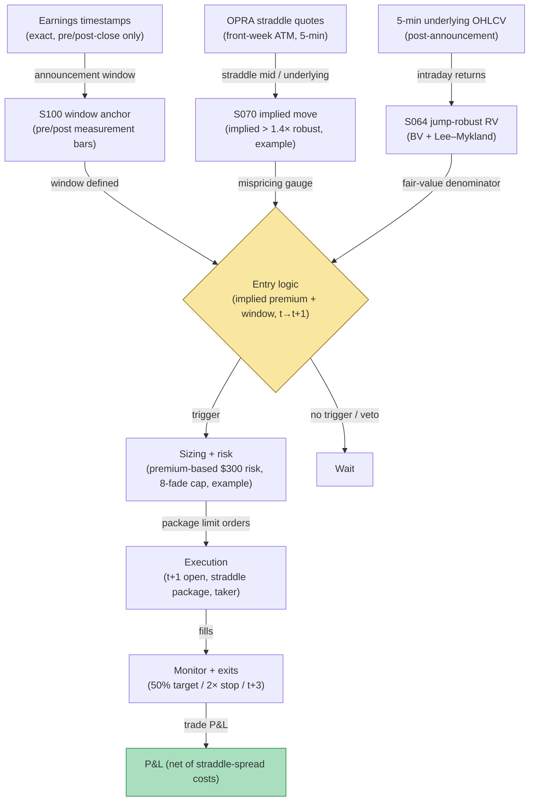

## Stage 179/200 — T079: Post-Announcement Vol Fade

*Batch TB8 · Strategy 79/100 · Signals S100, S070, S064 · Provenance [D/SR]*

### T1. One-line verdict

| | |
|---|---|
| **Style** | Volatility contrarian: sell the post-announcement implied-volatility premium once the news is out |
| **Edge source** | Options price in an announcement-day move; after the news breaks, implied volatility typically collapses ("vol crush") faster than realized volatility justifies. The rule compares the straddle-implied move (S070) against jump-robust realized variance (S064) — selling the straddle only when implied exceeds the jump-robust estimate by a margin — with exact announcement timestamps (S100) defining the window |
| **Typical holding period** | 1–3 trading days after the announcement; exit by day 3 |
| **Capacity hint** | Medium: single-name options are wide but the edge is per-name; capacity in the low tens of millions across the earnings calendar |
| **Build-or-buy in one line** | Build the implied-vs-jump-robust comparator on bought options and earnings data; the timestamp-anchored vol-fade rule with causal fills is not sold anywhere |

### T2. Full mechanics

**Universe & session.** US common stocks with liquid listed options (bid-ask on the front-week straddle ≤ 10% of mid, `example`), price ≥ $20, announcing earnings with exact timestamps (S100). Announcements must be pre-open or post-close — the rule never holds through the announcement itself; it trades the aftermath.

**Implied move (S070).** The **straddle-implied move** is the front-week at-the-money straddle mid-price divided by the underlying price — the market's forecast of the move through the near expiry. Measure it at the close *before* the announcement (`example`: the last liquid print) and again at the first tradable print *after* the announcement.

**Jump-robust realized variance (S064).** **Realized variance** from intraday returns overstates true diffusive volatility when the announcement itself is a jump. S064 uses **jump-robust** estimators — **bipower variation (BV)**, which is robust to jumps, and the **Lee–Mykland** jump test to flag and exclude the announcement jump — to estimate the diffusive variance that should price the straddle after the news is out. Define terms at first use: *bipower variation* sums products of adjacent absolute returns, so a single jump contaminates only its neighbors and the estimator stays consistent for the continuous component; the *Lee–Mykland test* flags returns too large to be diffusive.

**Entry rule.** After the announcement, on the first 5-minute bar *t* where both legs are quotable: sell the front-week ATM straddle if `implied_move_t > 1.4 × jump_robust_move_t` (`example`) — implied is pricing 40% more move than the jump-robust estimate justifies. Signal at bar *t* → earliest fill at the **open of bar t+1**. Signal calculated at bar *t* can never fill on that bar.

**Exit rule.** Four exits, first touch wins (`example`): (1) decay target: buy back at 50% of the entry credit; (2) stop: buy back at 2× the entry credit — the market is repricing, not overpricing; (3) time stop: close at day t+3 regardless; (4) second-news exit: any new material announcement on the name → buy back at the next open.

**Position sizing.** Premium-based: contracts = `⌊ R / (2 × entry_credit_per_share × 100) ⌋` with `R = $300` (`example`) — the 2×-credit stop defines the risk. Max 8 concurrent straddle fades (`example`); earnings cluster, and vol events correlate.

**Risk limits.** Daily loss stop −3R (`example`); no entries when the post-announcement book is one-sided (no two-sided straddle quote within the 10% width bound); underlying hard-borrow names excluded (assignment/dividend risk on the call leg).

**Cost model.** Options commission $0.65/contract/side (`example`); pay half the straddle spread each way — the dominant cost, modeled explicitly; slippage on the t+1 fill. The worked example shows the spread as the largest line.

**Order/execution sketch.** Limit orders at the straddle mid minus/plus half-spread at the t+1 open (`example`); modeled as a taker on both legs; no legging — the straddle trades as a package or not at all.

**Parameter robustness.** The `example` choices (implied > 1.4× jump-robust, front-week ATM straddle, 50%-credit target, 2×-credit stop) are starting points. Sensitivity protocol: vary the premium ratio at 1.2×/1.4×/1.6× and the target at 30%/50%/70% of credit; sign persistence required. Test the straddle tenor explicitly: front-week has the most crush but the widest spreads — second-week straddles are the calmer alternative and the comparison belongs in the research log. The Lee–Mykland jump threshold itself is a parameter: run the estimator at two significance levels and confirm the 1.4× test fires on the same names.
### T3. Signals it consumes

| Signal | Role | Weight / logic |
|---|---|---|
| S100 (exact announcement timestamps) | Window anchor | defines the pre/post measurement bars; pre-open or post-close announcements only |
| S070 (straddle-implied vs realized) | Mispricing gauge | `implied > 1.4 × jump-robust` (`example`) triggers the sale |
| S064 (jump-robust RV: BV, Lee–Mykland) | Fair-value estimate | bipower variation + Lee–Mykland jump exclusion; the denominator of the 1.4× test |
| Decay-target / 2×-credit stop logic (strategy rule) | Exit manager | 50%-credit target; 2×-credit stop; t+3 flatten |

### T4. Worked example — numbers + P&L (SYNTHETIC)

Synthetic options/equity bars, equity VOL, seed 179. VOL announces post-close Tuesday with an exact timestamp. Wednesday's first quotable 5-minute bar: front-week ATM straddle mid $3.20 (implied move 6.4% on a $50 stock); jump-robust estimate from Wednesday's diffusive bars (announcement jump excluded via Lee–Mykland) implies a 3.9% move — ratio 1.64× ≥ 1.4× (`example`), armed. Signal at bar *t* → fill at the next 5-minute open: **sell 100 straddles at $3.20** (contract multiplier 100). Implied decays; **buy back 100 straddles at $2.45** on day t+2.

| Item | Calculation | Amount |
|---|---|---|
| Gross P&L | 100 × ($3.20 − $2.45) × 100 | +$7,500.00 |
| Commission | 200 contracts × $0.65 | −$130.00 |
| Half-spread, both ways (straddle 10¢ wide) | 100 × $0.10 × 100 | −$1,000.00 |
| Adverse slippage, t+1 fill | modeled | −$300.00 |
| **Total execution cost** | | **−$1,430.00** |
| **Net P&L** | $7,500.00 − $1,430.00 | **+$6,070.00** |

Synthetic illustration only — not a claim that post-announcement vol fading is profitable after costs. The straddle spread ($1,000) is the dominant cost: single-name options friction is the strategy's tax.

### T5. Data & infra — what must run

Options quotes (NBBO-level, licensed: OPRA via **Databento** or **Massive**), earnings timestamps (licensed), 5-minute underlying OHLCV for the BV/Lee–Mykland computation. The jump-robust estimation is a per-name intraday batch — seconds in Polars at ~10–50M rows/sec (`notes/cost-model.md`); the live screen is a per-5-minute check over announcers, within a Python loop at ~100–500k events/sec (`notes/cost-model.md`). Live working set under ~77GB. Build estimate: M+ harness 40–100 hours, $6,000–$15,000 loaded (`notes/cost-model.md`); options + earnings data is H-tier, 60–200 hours, $9,000–$30,000 (`notes/cost-model.md`).

**Calibration discipline.** Walk-forward by earnings season with a 3-day embargo; perturb the premium ratio and target ±25%; multiple-testing control per the standing protocol (PSR/DSR). Options-data hygiene: use NBBO quotes (not trades) for the implied-move computation, timestamp the straddle mid and the underlying print to the same bar, and store the dividend/rate inputs to the vol calculation. Split the backtest by vol regime — the crush behaves differently when market-wide vol is high — and require the edge in both.
### T6. Buy vs build

Buy the data: OPRA options history from **Databento** (usage-based, thousands/yr class, `indicative — verify before budgeting`) or **Massive (formerly Polygon) Options** (~$199/mo class for standard tiers, `indicative — verify before budgeting`); earnings timestamps from **Refinitiv IBES**/**FactSet** (tens of thousands/yr class, `indicative — verify before budgeting`); backtest hosting on **QuantConnect** (~$60–$300/mo class, `indicative — verify before budgeting`); routing test on **Interactive Brokers paper trading** (no incremental platform fee on an existing account, `indicative — verify before budgeting`). Verdict: **buy the options prints and the timestamps; build the implied-vs-jump-robust comparator and the causal rule.** No vendor sells it.

**Crossover note.** The options-data decision has a real fork: OPRA history from Databento (usage-based) versus a bundled Massive options feed. For this rule the fork resolves on quote depth — the implied-move computation needs NBBO quotes, not just trades, and the cheaper trade-only histories are unusable for the 1.4x test. Verify before buying that the history includes millisecond-stamped quotes with size; a surprising number of "options history" products are trade prints with end-of-day quotes. The backtest also needs the underlying's 5-minute bars from the same day to run the Lee-Mykland estimator — mismatched timestamps between the options and equity feeds are the classic silent killer.
### T7. Success-ratio evidence

Published, checkable sources only:

1. Chordia et al. (2009): PEAD concentrated in illiquid stocks; transaction costs consumed 70–100% of paper profits — the friction warning applies doubly to options-based PEAD expressions. (https://ideas.repec.org/a/taf/ufajxx/v65y2009i4p18-32.html)
2. DellaVigna & Pollet (2009): Friday announcements show 15% lower immediate and 70% higher delayed response — the timing structure that makes post-announcement (not pre-announcement) positioning the testable leg. (https://doi.org/10.1111/j.1540-6261.2009.01447.x)
3. Tetlock (2007): news-text sentiment predicts next-day returns — the text-reaction channel that the S100/S070 window is built around, on a shorter horizon than the original finding. (https://doi.org/10.1111/j.1540-6261.2007.01232.x)

Honesty note: no published paper tests this exact straddle-fade rule; the jump-robust estimators are standard econometrics, not evidence of edge.

**What the evidence does not show.** No cited paper tests selling post-announcement straddles against a jump-robust fair value — the 1.4× premium test, the BV/Lee–Mykland machinery, and the 50%-credit target are a reconstructed volatility trade, not a literature result. Chordia et al.'s cost warning applies with extra force to options: their 70–100% figure was for stock-based PEAD, and single-name options spreads are wider in relative terms, as the T4 ledger's $1,000 spread line shows. DellaVigna & Pollet's delayed-response finding describes the underlying's drift, not the straddle's decay — the link from "prices underreact" to "implied vol overprices the aftermath" is the rule's own inference. Short straddles carry gap risk that no backtest spread assumption can fully capture.
### T8. Failure modes

- **The 2×-credit stop.** Vol can re-expand on guidance revisions or macro shocks; short straddles have unbounded tails and the stop is a market order into a widening book.
- **Jump misclassification.** If the Lee–Mykland test fails to exclude the announcement jump, the "jump-robust" estimate is contaminated and the 1.4× test misfires — validate the estimator on known announcement days before trading.
- **Pin risk and dividends.** Holding short options through ex-div dates or into expiry pins creates assignment risk; the t+3 time stop and the front-week-only rule bound this.
- **One-sided books.** Post-announcement options books can go one-sided; the two-sided-quote requirement keeps the rule out of untradable prints.
- **Correlation across announcers.** Earnings cluster by week and sector; the 8-name cap and the daily loss stop are the portfolio defense.

- **Announcement-date misclassification.** Earnings dates move; a straddle sold for "post-announcement" crush while the announcement is actually still ahead is a naked short-vol position into the event. Verify the timestamp against two sources before arming — the S100 window is only as good as its calendar.
- **Market-wide circuit breakers.** A macro halt during the hold freezes the underlying while the straddle's implied vol reprices on reopen — the 2×-credit stop becomes a suggestion. The 8-name cap and the daily loss stop are the portfolio-level acceptance of this tail.
### T9. Visuals

*Chart caption: synthetic data — not market data. Watermark reads "SYNTHETIC EXAMPLE" exactly.*

### T10. Sources

1. Chordia, T., Goyal, A., Sadka, G., Sadka, R. & Shivakumar, L. "Liquidity and the Post-Earnings-Announcement Drift." *Financial Analysts Journal* 65(4), 18–32 (2009). https://ideas.repec.org/a/taf/ufajxx/v65y2009i4p18-32.html — costs consumed 70–100% of paper PEAD profits. Title verified 2026-09-10.
2. DellaVigna, S. & Pollet, J.M. "Investor Inattention and Friday Earnings Announcements." *Journal of Finance* 64(2), 709–749 (2009). https://doi.org/10.1111/j.1540-6261.2009.01447.x — delayed response to Friday announcements. Title verified 2026-09-10.
3. Tetlock, P.C. "Giving Content to Investor Sentiment." *Journal of Finance* 62(3), 1139–1168 (2007). https://doi.org/10.1111/j.1540-6261.2007.01232.x — news-text sentiment predicts next-day returns. Title verified 2026-09-10.

**Unverified leads** (not confirmed facts — verify before use):
- Chatbot question-bank TB8 items on vol-crush timing and jump-robust estimator choice — research prompts, not findings.
- OPRA/earnings price classes above are market-rate bands, `indicative — verify before budgeting`, not quotes.

*Source log: Grok answered Q-TB8-1..7 (2026-09-10); all claims independently verified or labeled unverified.*
