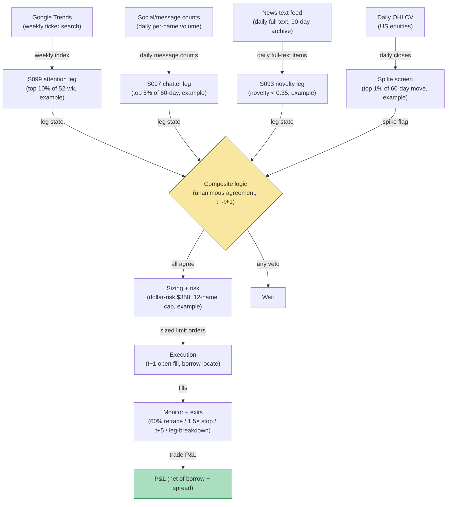

## Stage 180/200 — T080: Multi-Source Attention Composite

*Batch TB8 · Strategy 80/100 · Signals S099, S097, S093 · Provenance [D/SR]*

### T1. One-line verdict

| | |
|---|---|
| **Style** | Contrarian: fade attention spikes only when three independent attention measures agree the crowd is excited about old news |
| **Edge source** | Each attention proxy is weak alone — weekly search attention (S099) is slow, social chatter (S097) has a small return effect (Antweiler & Frank 2004), and news volume without a novelty check is noise. The composite requires all three to agree: elevated search attention, excited social chatter, *and* a stale-news verdict (S093). The intersection is rarer and more tradeable than any single leg, and it fades the same overreaction Tetlock (2011) documents |
| **Typical holding period** | 2–5 trading days; flat by day 5 |
| **Capacity hint** | Medium: the composite fires less often than any single leg, so per-trade size can be larger; capacity in the tens of millions |
| **Build-or-buy in one line** | Build the composite on bought news/social data plus free Trends; the agreement logic and its calibration are the proprietary part |

### T2. Full mechanics

**Universe & session.** US common stocks, price ≥ $10, ADV ≥ 1M shares (`example`). Daily signal cadence (the composite's slowest input, S099, is weekly), RTH execution.

**The three legs.** (1) **S099 — search attention:** weekly ASVI in the top 10% of its 52-week history (`example`); attention, not sentiment. (2) **S097 — social chatter:** daily message volume in the top 5% of its 60-day distribution (`example`); conditional by construction — never traded alone. (3) **S093 — novelty verdict:** the top-linked story's novelty score < 0.35 (`example`) — the excitement is about old information. Each leg is computed on data available at the close of day *t*.

**Composite rule.** Fire only on **unanimous agreement**: ASVI elevated AND social excited AND news stale, coincident with a top-1%-of-60-day price move (`example`). Any single leg vetoes the trade. The composite is deliberately conservative: backtests of attention strategies degrade when any one proxy is allowed to dominate, because each proxy's failure mode (slow Trends, noisy social, misclassified news) is different and the intersection cancels most of them.

**Entry rule.** Composite fires at the close of day *t* → earliest fill at the **open of day t+1**, fading the move (short the stale-positive spike; the short leg is primary per Tetlock's stale-positive evidence). Signal calculated at bar *t* can never fill on that bar.

**Exit rule.** Four exits, first touch wins (`example`): (1) reversal target: cover at 60% retracement of the spike day; (2) stop: 1.5× the spike-day move against the position; (3) time stop: flat at the close of t+5; (4) leg-breakdown exit: if any one of the three legs reverses state (ASVI collapses, social goes quiet, or a genuinely novel story breaks), exit at the next open — the composite's premise was unanimity.

**Position sizing.** Dollar-risk sizing `N = ⌊ R / |P_entry − P_stop| ⌋`, `R = $350` (`example`) — the composite's selectivity justifies slightly larger risk per trade than the single-leg fades. Max 12 concurrent composites (`example`); sector cap 4.

**Risk limits.** Daily loss stop −4R (`example`); borrow fee exclusion > 5% annualized (`example`); no entries on FOMC/employment days.

**Cost model.** Commission $0.005/share/side (`example`); half-spread each way; borrow at the locate rate for the 2–5 day hold; +0.5× spread adverse slippage on the t+1 open (`example`).

**Order/execution sketch.** Marketable limit at the t+1 open; participation ≤ 10% of open-auction volume (`example`); taker modeling.

**Parameter robustness.** The `example` choices (ASVI top 10%, social top 5%, novelty < 0.35, unanimous agreement) are starting points. Sensitivity protocol: run unanimity against majority-vote (2-of-3) — if majority-vote works and unanimity does not, the composite is over-filtered; if unanimity works and majority does not, the veto structure is doing real work and the difference must be documented, not assumed. Vary each leg's cutoff ± one grid step and require sign persistence. The ablation test is mandatory: drop each leg in turn and report the three 2-leg composites — a leg that adds nothing in ablation should not gate entries.
### T3. Signals it consumes

| Signal | Role | Weight / logic |
|---|---|---|
| S099 (weekly ASVI) | Attention leg | top 10% of 52-week ASVI (`example`); weekly, attention-only |
| S097 (social/message activity) | Chatter leg | top 5% of 60-day message volume (`example`); conditional, never standalone |
| S093 (news novelty) | Staleness leg | novelty < 0.35 (`example`); recombinations count as stale |
| Unanimity + leg-breakdown logic (strategy rule) | Entry/exit manager | all three must agree to enter; any leg reversing exits the trade |

### T4. Worked example — numbers + P&L (SYNTHETIC)

Synthetic daily bars, equity CMP, seed 180. CMP spikes 7.8% on day *t* — top 1% of its 60-day moves. All three legs agree: weekly ASVI in the top 6% of its 52-week history, message volume at the 98th percentile, and the top story's novelty score 0.19 (a recycled partnership announcement). Composite fires at the close of *t* → fill at the open of *t+1*: **short 9,000 shares at $33.90** (borrow 5% annualized). The spike decays; cover at 60% retracement, **$33.42**, on day t+3.

| Item | Calculation | Amount |
|---|---|---|
| Gross P&L | 9,000 × ($33.90 − $33.42) | +$4,320.00 |
| Commission | 9,000 × 2 × $0.005 | −$90.00 |
| Half-spread, both ways | 9,000 × 2 × $0.01 | −$180.00 |
| Borrow fee (5% pa, 3 days) | 9,000 × $33.90 × 0.05 × 3/365 | −$125.42 |
| Adverse slippage, t+1 open | modeled | −$144.58 |
| **Total execution cost** | | **−$540.00** |
| **Net P&L** | $4,320.00 − $540.00 | **+$3,780.00** |

Synthetic illustration of the ledger only — not a claim that composite attention fading is profitable after costs. The composite's edge over single-leg fades is selectivity, which this one example cannot demonstrate.

### T5. Data & infra — what must run

Google Trends weekly series (free), daily social/message counts (licensed), full-text news archive with embeddings (licensed), daily OHLCV. The composite is a daily batch: three percentile/novelty computations joined per name — seconds in Polars at ~10–50M rows/sec (`notes/cost-model.md`); the novelty embedding pass fits the Python-loop budget at ~100–500k events/sec (`notes/cost-model.md`). Live working set under ~77GB. Build estimate: M+ harness 40–100 hours, $6,000–$15,000 loaded (`notes/cost-model.md`); news + social licensing is H-tier, 60–200 hours, $9,000–$30,000 (`notes/cost-model.md`).

**Calibration discipline.** Walk-forward with a 5-day embargo; perturb each leg's threshold ±25%; multiple-testing control per the standing protocol (PSR/DSR) — the composite tests more combinations than any single-leg rule, so the multiplicity burden is heaviest here. Data hygiene inherits all three legs' requirements: Trends pull snapshots, social baseline logs, and frozen news timestamps. Additionally log the leg-agreement rate over time: a composite whose unanimity rate drifts is a composite whose calibration is drifting, and the drift usually starts in the social leg.
### T6. Buy vs build

Buy the feeds: news text from **RavenPack** (~$15,000–$25,000/yr class, `indicative — verify before budgeting`) or **Bloomberg** ($30,000/yr class, `indicative — verify before budgeting`); social volume from **The TIE** or a firehose license (tens of thousands/yr class, `indicative — verify before budgeting`); daily bars from **Massive (formerly Polygon)** (~$199/mo, `indicative — verify before budgeting`); Trends is free; backtest hosting on **QuantConnect** (~$60–$300/mo class, `indicative — verify before budgeting`); routing test on **Interactive Brokers paper trading** (no incremental platform fee on an existing account, `indicative — verify before budgeting`). Verdict: **buy all three attention feeds, build the composite agreement logic and calibration.** The unanimity rule and its veto structure are not for sale.

**Crossover note.** The composite inherits the most expensive data stack in TB8 — three licensed attention feeds — which makes the build-vs-buy math unusually sensitive to the book's size. Before licensing all three, run the ablation study from T2 on the cheapest available proxies (free Trends, a sampled social feed, a small news sample): if a 2-leg composite survives ablation, license only the legs that earn their keep. The most common failure in composite research is licensing the full stack first and discovering afterward that one leg never contributed — at H-tier data costs ($9,000-$30,000 per the cost model), that mistake is a budget line, not a rounding error.
### T7. Success-ratio evidence

Published, checkable sources only:

1. Tetlock (2011): stale-news-day return negatively predicts the following week, stronger with individual trading — the overreaction the composite fades. (https://doi.org/10.1093/rfs/hhq141)
2. Da, Engelberg & Gao (2011): higher SVI predicts higher prices over two weeks, reversal within a year — the slow attention leg's published shape. (https://doi.org/10.1111/j.1540-6261.2011.01679.x)
3. Antweiler & Frank (2004): message activity predicts volatility with a small return effect — why the social leg is conditional and never standalone. (https://doi.org/10.1111/j.1540-6261.2004.00662.x)

No published paper tests a three-way attention composite; the unanimity structure is a reconstruction, and nothing here is an after-cost profitability claim.

**What the evidence does not show.** No published paper tests a three-way attention composite — the unanimity structure, the specific cutoffs, and the leg-breakdown exit are reconstructions. Each leg's paper supports only its own leg: Tetlock for stale-news reversal, Da–Engelberg–Gao for the slow attention cycle, Antweiler–Frank for the (small) social return effect. The composite's central claim — that the intersection of three weak proxies is more tradeable than any one — is plausible but untested, and the legs are not independent: one big story drives search, social, and price together, so "unanimous agreement" partly measures the same event three times. The ablation test in T2 is the required honesty check, and the regime-split backtest in T8 is the required humility check.
### T8. Failure modes

- **Leg correlation in disguise.** The three legs are not independent — big news drives search, social, and price together. The composite's "agreement" is partly one event measured three ways; the novelty leg (S093) is the only one that adds genuinely new information, so its calibration deserves the most scrutiny.
- **Novelty misclassification.** As in T071: a stale-scored story with one new fact invalidates the fade; the leg-breakdown exit is the defense.
- **Weekly ASVI staleness.** The slowest leg can hold the composite armed (or vetoed) on week-old information; the daily legs gate actual entries.
- **Borrow and fee stacking.** Three licensed feeds plus borrow costs make the fixed-cost base high; the composite must clear its data costs before its trading costs — size the book accordingly.
- **Regime shifts in retail attention.** If attention migrates across platforms, the S097 leg's calibration breaks first; monitor leg-agreement rates for drift.

- **Composite staleness.** The weekly ASVI leg can hold the composite vetoed (or armed) on week-old information while the daily legs see a fresh setup — the slowest input gates the fastest. Consider a time-decay on the ASVI leg's vote rather than a binary arm.
- **Overfitting the agreement rule.** With three legs and a unanimity structure, it is easy to fit the historical attention regime (e.g., the 2020–2021 retail wave) and fail in the next one. The regime-split backtest — attention-heavy vs attention-quiet years — is required, not optional.
### T9. Visuals

*Chart caption: synthetic data — not market data. Watermark reads "SYNTHETIC EXAMPLE" exactly.*

### T10. Sources

1. Tetlock, P.C. "All the News That's Fit to Reprint." *Review of Financial Studies* 24(5), 1481–1512 (2011). https://doi.org/10.1093/rfs/hhq141 — stale-news reversal, stronger with individual trading. Title/authors verified 2026-09-10.
2. Da, Z., Engelberg, J. & Gao, P. "In Search of Attention." *Journal of Finance* 66(5), 1461–1499 (2011). https://doi.org/10.1111/j.1540-6261.2011.01679.x — SVI predicts two-week prices, one-year reversal. Title verified 2026-09-10.
3. Antweiler, W. & Frank, M.Z. "Is All That Talk Just Noise?" *Journal of Finance* 59(3), 1259–1294 (2004). https://doi.org/10.1111/j.1540-6261.2004.00662.x — message activity predicts volatility; small return effect. Title verified 2026-09-10.

**Unverified leads** (not confirmed facts — verify before use):
- Chatbot question-bank TB8 items on attention-composite construction — research prompts, not findings.
- Vendor price classes above are market-rate bands, `indicative — verify before budgeting`, not quotes.

*Source log: Grok answered Q-TB8-1..7 (2026-09-10); all claims independently verified or labeled unverified.*
