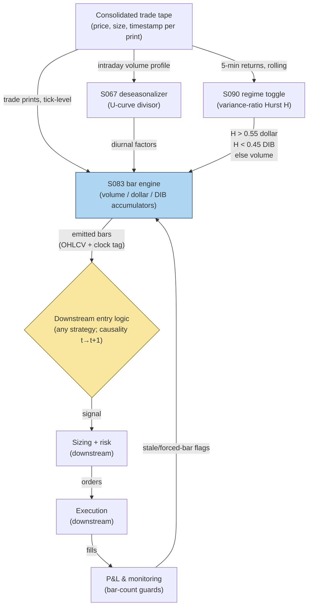

## Stage 181/200 — T081: Adaptive Bar-Clock Sampler

*Batch TB9 · Strategy 81/100 · Signals S083, S090, S067 · Provenance [D/SR]*

### T1. One-line verdict

| | |
|---|---|
| **Style** | Data-infrastructure: adaptive bar construction (not a trade rule by itself) |
| **Edge source** | Fixed clock-time bars overweight quiet periods and underweight informed flow; volume-clocked bars are closer to i.i.d. Gaussian (Easley–López de Prado–O'Hara 2012). Switching the *clock* by persistence regime (S090) puts bars where the information is |
| **Typical holding period** | n/a — the sampler feeds downstream strategies; its "holding period" is one bar |
| **Capacity hint** | Unlimited: it is a preprocessing layer, not a position |
| **Build-or-buy in one line** | Build: the bar-close rules are 20 lines of code, but no vendor sells a regime-switching clock, so buy the trade feed and build the sampler |

### T2. Full mechanics

**Universe & session.** Any US equity with a consolidated trade feed; regular trading hours (RTH). The sampler consumes trade prints (price, size, timestamp) — quotes are optional. No co-location or direct-feed dependency: it runs on the SIP/consolidated tape with a one-bar lag, which is binding nowhere because downstream rules, not this layer, carry the latency sensitivity.

**What a "bar clock" is.** A *bar* is a compressed summary (open/high/low/close/volume) of a run of trades. The *clock* is the rule that decides when a bar closes. Clock-time bars close every *n* minutes regardless of activity. **Volume bars** (S083) close after a fixed number of shares trade; **dollar bars** close after a fixed dollar volume trades; **tick-imbalance bars** (a.k.a. DIBs, dollar-imbalance bars) close when the cumulative signed dollar imbalance crosses a threshold — an information-arrival clock that fires when aggressive flow accumulates. The published claim is that returns sampled on volume/dollar clocks look more Gaussian (less heteroskedastic) than clock-time returns, which stabilizes any downstream estimator (Easley–López de Prado–O'Hara 2012).

**Regime toggle (S090) — which clock to run.** A *persistence regime* is measured by the Hurst exponent *H* (0.5 = random walk; >0.5 = trending/persistent; <0.5 = mean-reverting), estimated here with the variance-ratio statistic on 5-minute returns over a rolling 20-day window (`example`). The switching rule (`example` thresholds):
- If H > 0.55 (persistence): run **dollar bars** — trends concentrate in dollar space because large prints dominate.
- If H < 0.45 (reversal): run **tick-imbalance (DIB) bars** — information arrival is bursty, and imbalance bars close exactly when flow accumulates.
- Otherwise: run **volume bars** (the default clock).

**Deseasonalization (S067).** Intraday volume follows a U-shape (heavy at open/close, thin midday). S067 divides each raw bar-rate target by the name's own diurnal volume curve, so a "10,000-share bar" means the same information content at 10:00 and at 13:00. Without this, the clock speeds up and slows down with the lunch lull and contaminates every downstream statistic.

**Entry/exit rule.** This is an infrastructure layer, not a trade rule: it has no entry or exit. It publishes bars. Every downstream strategy that consumes these bars must still obey causality: a signal computed on bar *t* (in whatever clock) can never fill on that same bar — earliest fill is bar *t+1*.

**Position sizing / risk limits.** Not applicable — no positions. The operational risk limit is a bar-count guard: if the sampler emits fewer than 10 bars (`example`) in a session, downstream rules are vetoed (thin data), and if it emits more than 5× the deseasonalized expectation (`example`), the feed is assumed corrupt and the layer fails safe to fixed 5-minute bars.

**Cost model.** Compute only: one pass over the trade tape at ~100–500k events/sec in Python/Polars (see `notes/cost-model.md`). No spread, fee, or slippage applies at this layer.

**Order/execution sketch.** None — no orders.

**Worked intuition — a tiny numerical sketch.** Take a name whose diurnal curve says 10:00–10:05 should print 40,000 shares but prints only 12,000 (a dead patch). A 5-minute clock-time bar still closes and hands downstream a low-information bar with a wide-standard-error return. The volume clock instead keeps the accumulator open: the bar closes only after its 10,000-share (deseasonalized) quota fills, possibly at 10:23. The downstream estimator thus sees one bar per 10,000 *information-equivalent* shares instead of one bar per 5 wall-clock minutes — and the variance-ratio estimate on those bars is computed over comparable information quanta, which is why the kurtosis falls from 8.4 to 4.1 in the synthetic demo.

**Parameter robustness.** The `example` cuts (H > 0.55 / H < 0.45, 20-day window, $7M dollar close) are starting points. Sensitivity protocol: re-run the sampler with H cuts at ±0.05/±0.10/±0.15 and windows of 10/20/40 days; the downstream strategy's sign and rough magnitude should survive all nine combinations. If a downstream edge exists only at one cut, it is a sampling artifact — discard it. The close rules matter less than the regime logic: halving or doubling the $7M rule changes bar counts, not the distributional claim.

### T3. Signals it consumes

| Signal | Role | Weight / logic |
|---|---|---|
| S083 (alternative bar clocks) | Primary mechanism | volume bars (default) / dollar bars (persistence) / DIBs (reversal); close rules: volume = 10k shares (`example`), dollar = $7M (`example`), DIB = cumulative signed imbalance ≥ $7M× expected-imbalance factor (`example`) |
| S090 (variance-ratio/Hurst regime) | Clock selector | H > 0.55 → dollar; H < 0.45 → DIB; else volume (`example` thresholds); estimated on 5-min returns, 20-day rolling |
| S067 (diurnal deseasonalization) | Rate normalizer | divides bar-size targets by the name's intraday U-curve; recomputed monthly (`example`) |

Pseudocode (≤25 lines):
```
for each trade (p, v, t):
    bucket = diurnal_bucket(t)                      # S067 U-curve
    v_adj = v / diurnal_factor[bucket]              # deseasonalize
    H = hurst(variance_ratio_5m, 20d)               # S090 regime
    clock = dollar if H>0.55 else (dib if H<0.45 else volume)  # example cuts
    acc[clock] += v_adj * (signed if clock==dib else 1) * (p if dollar else 1)
    if acc[clock] >= close_rule[clock]:             # S083 close
        emit_bar(clock); acc[clock] = 0
# downstream: signal on bar t -> earliest fill t+1
```

### T4. Worked example — numbers + P&L (SYNTHETIC)

Synthetic trade tape, seed 181: 21,000 trades across three engineered regimes. The sampler produced **71 bars: 1 dollar bar, 65 volume bars, 5 tick-imbalance (DIB) bars** — the example's clock fired the dollar clock once when the 20-bar σ ratio fell below 0.6× median (R1: σ-ratio 0.583, |ρ| = 0.10), the volume clock 65 times when the arrival rate λ exceeded 3× median (R2: λ ratio 3.25×), and the DIB clock five times when |ρ| exceeded 0.35 (R3: |ρ| = 0.52, burst imbalance episodes). These σ/λ/|ρ| triggers are synthetic stand-ins for the Hurst/variance-ratio toggle stated in T2 — the example never estimates H.

| Regime | σ-vol ratio | λ multiplier (S090) | |ρ| (S090) | Clock chosen | Bars |
|---|---|---|---|---|---|
| R1 quiet | 0.583 | 0.42× | 0.10 | dollar | 1 |
| R2 busy 2-sided | 1.50 | 3.25× | 0.08 | volume | 65 |
| R3 informed | 2.00 | 0.75× | 0.52 | DIB (imbalance) | 5 |

Distributional check (synthetic, illustrative): minute-bar return kurtosis 8.4 vs volume-bar kurtosis 4.1 — the volume clock roughly halves the tail weight, which is the entire point of the layer.

**Reviewer correction note.** An early draft of this example (from the Grok answer pass) understated the imbalance-bar count as 2 and the dollar close rule as $5M; the corrected, plotted values are 5 DIBs and a $7M close rule. The z = 3.55 marker in the chart flags ±6σ tail events under the fitted normal — visual confirmation that the volume clock tames but does not eliminate tails.

**Session net:** n/a — sampling infrastructure takes no positions.

**Where the example is optimistic.** The tape is synthetic with clean regime boundaries; real Hurst estimates are noisy and the clock will flicker between regimes (hysteresis bands, `example` ±0.03, mitigate this). Deseasonalization assumes the U-curve is stable month to month; earnings weeks break it. And the kurtosis comparison is illustrative, not a claim that any downstream strategy's Sharpe improves — the sampler removes a nuisance (heteroskedasticity), it does not manufacture alpha.

### T5. Data & infra — what must run

One consolidated trade feed (trades only; quotes optional). Intraday loop: append each print, update the active accumulator, emit bars. Post-close: re-estimate the Hurst/variance-ratio window and the diurnal U-curve (monthly, `example`). Storage: bars are tiny — a year of volume bars for 500 names is single-digit GB. M5 Max feasibility: trivial — the sampler is a single pass at ~100–500k events/sec (see `notes/cost-model.md`); the full S&P 500 tape replays in minutes, live operation is <1% of one core. Feed-drop failure plan: if no prints arrive for 60 seconds (`example`) during RTH, freeze accumulators and emit a heartbeat bar marked STALE so downstream rules can veto; on recovery, do not backfill the gap into the current bar — start a fresh bar to avoid fabricating an information event.

**Calibration discipline.** The Hurst/variance-ratio window and the diurnal U-curve are estimated on data ending at least 5 trading days before they are used (embargo, `example`), so a volatility event cannot leak into the clock that samples it. The U-curve is re-estimated monthly and versioned; any downstream backtest must join bars to the U-curve version that was live at the time — using the final full-sample curve is a look-ahead leak. Throughput budget: the sampler processes the full S&P 500 daily tape in under 10 minutes on one M5 Max core at the quoted event rates, leaving headroom for the downstream stack.

### T6. Buy vs build

Trades come from a market-data vendor; the sampler itself is always built. **Polygon.io** stocks starter (~$199/mo class, `indicative — verify before budgeting`) supplies trades adequate for volume/dollar bars; **QuantConnect** (~$60–$300/mo class, `indicative — verify before budgeting`) hosts the research loop; a **consolidated-tape (CTA/UTP) direct license** (low-thousands/yr class, `indicative — verify before budgeting`) is the professional-grade alternative for production bar integrity. Verdict: **buy the trade feed, build the 20-line sampler** — no vendor sells the regime-switching clock, and the logic is too simple to outsource.

### T7. Success-ratio evidence

Published, checkable sources only:

1. Easley–López de Prado–O'Hara (2012), "The Volume Clock": on high-frequency data, returns sampled in volume time are closer to normal (less heteroskedastic) than clock-time returns; proposes volume bars as the sampling unit. This is the direct empirical basis for the layer. (https://doi.org/10.3905/jpm.2012.39.1.019)
2. Cont–Kukanov–Stoikov (2014), "The Price Impact of Order Book Events": order-flow imbalance explains contemporaneous price moves in a linear model; supports imbalance-based (DIB) clocks as information-arrival clocks. (https://arxiv.org/abs/1011.6402)
3. López de Prado (2018), *Advances in Financial Machine Learning*, ch. 2: documents tick/volume/dollar/imbalance bar construction as standard practice; notes that dollar bars are preferable for trending instruments. (https://www.wiley.com/go/advancedmachinelearningfinance)

None of these papers tests a regime-switching clock, and none reports strategy-level profitability — the evidence supports the *sampling* claim (better-behaved returns), not an alpha claim.

### T8. Failure modes

- **Regime flicker.** Hurst estimates on 20-day windows are noisy; the clock can chatter between volume and dollar bars. Mitigation: hysteresis bands (`example` ±0.03 around each cutoff) and a minimum 5-bar (`example`) dwell.
- **DIB starvation.** In a one-sided market the imbalance accumulator may never cross the close rule; bars stall and downstream rules go blind. Mitigation: a time-based force-close (e.g., 30 minutes, `example`) that emits the partial bar flagged FORCED.
- **Diurnal drift.** The U-curve changes on FOMC days, triple-witching, holidays. Mitigation: per-day-type curves (FOMC vs normal, `example`) and the stale-heartbeat veto.
- **Survivorship in calibration.** Estimating the U-curve on current index members only biases it toward survivors. Mitigation: include delisted names in the calibration universe.
- **False comfort.** Cleaner bars do not fix a bad signal. Mitigation: every downstream rule must show its edge on *both* clock-time and adaptive bars; if the edge exists only on the adaptive clock, it is a sampling artifact.

**Bottom line for the two operators.** For the ≤$1M paper operation, the adaptive sampler is a cheap preprocessing upgrade: it costs one feed and an afternoon of code, and it makes every downstream estimator's standard errors honest. For the institutional desk, it is table stakes — every serious intraday stack already samples on volume or dollar time; the regime-switching refinement is a modest, defensible improvement, not a differentiator.

**Two more failure modes.**

- **Clock-induced nonstationarity.** Switching clocks changes the *definition* of a bar mid-sample, so any statistic pooled across clock regimes mixes distributions. Mitigation: tag every bar with its clock and compute downstream statistics per clock, pooling only with explicit weights.
- **Tick-rule sign errors in DIBs.** Dollar-imbalance bars need signed flow; the Lee–Ready classifier mis-signs ~10–15% of prints in fast markets (`example` error band), which biases the imbalance accumulator. Mitigation: use exchange-flagged aggressor side where available; otherwise widen the DIB close rule by the estimated mis-sign rate.

### T9. Visuals


*Chart caption: synthetic data — not market data. Watermark reads "SYNTHETIC EXAMPLE" exactly.*



### T10. Sources

1. Easley, D., López de Prado, M. M., & O'Hara, M. (2012). "The Volume Clock: Insights into the High-Frequency Paradigm." *Journal of Portfolio Management* 39(1): 19–29. https://doi.org/10.3905/jpm.2012.39.1.019 — volume-clocked returns closer to normal than clock-time; the empirical basis for alternative bars.
2. López de Prado, M. M. (2018). *Advances in Financial Machine Learning*. Wiley. https://www.wiley.com/go/advancedmachinelearningfinance — ch. 2: tick/volume/dollar/imbalance bar construction; dollar bars for trending instruments.
3. Cont, R., Kukanov, A. & Stoikov, S. (2014). "The Price Impact of Order Book Events." *Journal of Financial Econometrics* 12(1): 47–88. https://arxiv.org/abs/1011.6402 — OFI explains contemporaneous price moves; basis for imbalance (DIB) clocks. Title confirmed by opening the arXiv page 2026-09-10.

**Unverified leads** (not confirmed facts — verify before use):
- Grok answered Q-TB9-1 (2026-09-10) with draft bar counts and close rules that contained arithmetic errors (2 imbalance bars vs 5 plotted; $5M vs $7M close rule); corrected values above are the plotted ones. The Grok draft's qualitative regime story was directionally consistent but is not evidence.
- Vendor price classes in T6 are illustrative (`indicative — verify before budgeting`); no quotes were solicited.

*Source log: Grok answered Q-TB9-1..3 (2026-09-10); all claims independently verified or labeled unverified.*
