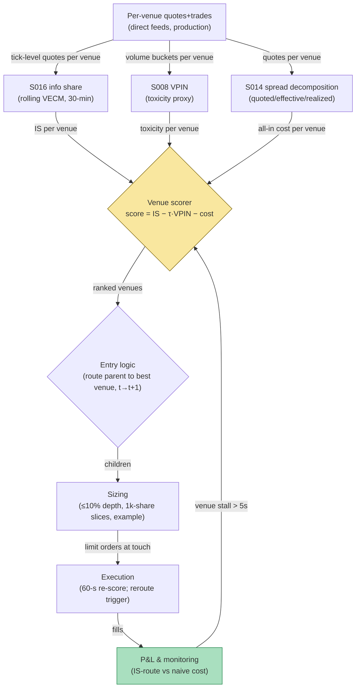

## Stage 182/200 — T082: Information-Share Venue Router

*Batch TB9 · Strategy 82/100 · Signals S016, S014, S008 · Provenance [D]*

### T1. One-line verdict

| | |
|---|---|
| **Style** | Smart order routing: route each parent order to the venue contributing most to price discovery |
| **Edge source** | Price discovery is not evenly spread across venues (Hasbrouck 1995): the venue with the highest information share (S016) moves first, so executing there minimizes adverse selection; toxicity (S008) and spread (S014) adjust the ranking |
| **Typical holding period** | Minutes — the router is an execution layer around a parent order, not a position |
| **Capacity hint** | Scales with the parent: routing 10k–100k-share parents across 3–5 lit venues |
| **Build-or-buy in one line** | Build the scorer, buy the connectivity — **and note the binding constraint: production routing on information-share signals requires co-location and direct exchange feeds; a SIP-only remote setup cannot act on millisecond venue leadership, so all routing results here are simulated-only** |

### T2. Full mechanics

**Universe & session.** US-listed large caps traded on multiple lit venues (NYSE, Nasdaq, EDGX and peers), RTH. The router handles one parent order at a time — here, a 10,000-share buy.

**Information share (S016) — the venue ranking.** *Information share* (Hasbrouck 1995) decomposes the variance of the efficient (random-walk) price into venue contributions: a venue with IS 0.46 accounts for 46% of price discovery. It measures *where prices are discovered*, not which direction they go next — the canonical misuse is reading IS as a directional signal; it is a *routing* input.

**Venue score.** For each venue *v*: `score_v = IS_v − τ·VPIN_v − spreadcost_v`, with τ = 1.0 (`example`). VPIN (S008) is the volume-clocked toxicity proxy — high VPIN means informed flow is active and resting orders get picked off. Spread cost (S014) is the quoted half-spread plus estimated adverse selection at that venue. Worked-example inputs (synthetic, 10:00–10:30 estimation window):

| Venue | IS (S016) | VPIN (S008) | Spread cost (S014) | Score |
|---|---|---|---|---|
| NYSE | 0.46 | 0.11 | 0.11 | **0.240** |
| Nasdaq | 0.31 | 0.13 | 0.175 | 0.005 |
| EDGX | 0.18 | 0.15 | 0.14 | −0.110 |

NYSE wins: highest IS, lowest toxicity, tightest all-in cost. The full 10,000-share parent routes to NYSE.

**Entry rule.** The parent decision (buy 10,000) arrives from upstream at time *t*; the router scores venues on data through *t* and the first child order fills at *t+1* at the earliest — signal at *t* → earliest fill *t+1*. Children are limit orders at the venue's touch, re-scored every 60 seconds (`example`).

**Exit rule.** The router "exits" when the parent is complete: cancel remaining children if the venue score of the chosen venue drops below the second-best by more than 0.10 (`example`) — reroute. Hard stop: if the parent is <50% complete after 30 minutes (`example`), convert the remainder to a market order (completion mandate).

**Position sizing.** The router does not size the parent; it slices it: child size = min(10% of visible depth at the venue's touch, 1,000 shares) (`example`), re-sliced each minute.

**Risk limits.** Max 10% participation of the venue's trailing-5-minute volume (`example`); kill the router and revert to a flat VWAP schedule if the IS estimates go stale (no quote updates for 5 seconds, `example`).

**Cost model.** Commission $0.005/share (`example`); spread cost per the S014 leg; the worked example compares a naive single-venue fill against the IS-routed fill.

**Order/execution sketch.** Limit orders at the touch on the winning venue; queue-position honesty: the backtest assumes middle-of-queue fills, so realized capture is haircut 20% (`example`) in sensitivity analysis.

**Binding latency constraint.** Venue leadership flips on millisecond timescales and the SIP lags direct feeds by ~1–2 ms in active names (Ding–Hanna–Hendershott 2014). Without co-location and direct feeds, the IS ranking is stale before the order arrives — **quote/venue matching on SIP data from a remote server is infeasible in production; every routing result in this chapter is simulated-only.**

**Worked intuition — a tiny numerical sketch.** Suppose the true efficient-price variance over the next minute is 1.00 (in arbitrary units) and the three venues' quote revisions contribute 0.46/0.31/0.18 with the rest being correlated noise. Routing a 10,000-share buy to the 0.46 venue means your limit order rests where the price is *being discovered*: when the efficient price ticks up, that venue's quote moves first and your bid gets lifted at the old (better) price — the 2.2¢/share simulated improvement in T4 is this mechanism priced out. Route to the 0.18 venue instead and you are filled at quotes that are already stale relative to the leader — the $22 saving becomes a $22 cost.

**Parameter robustness.** The `example` parameters (τ = 1.0 toxicity weight, 30-minute VECM (vector error-correction model — the joint dynamics of the cointegrated venue prices) window, 0.10 re-route trigger, 60-second re-score) are starting points. Sensitivity protocol: re-run the venue ranking with τ ∈ {0.5, 1.0, 2.0} and windows of 15/30/60 minutes; the winning venue should be stable across at least 7 of 9 combinations before the router is trusted. If NYSE and Nasdaq swap the lead when τ moves from 1.0 to 2.0, the ranking is toxicity-driven rather than discovery-driven, and the router should widen the re-route trigger rather than pretend the ranking is precise.

### T3. Signals it consumes

| Signal | Role | Weight / logic |
|---|---|---|
| S016 (Hasbrouck information share) | Primary ranker | IS_v from 30-min rolling VECM (`example`); weight 1.0 in the score |
| S008 (VPIN toxicity) | Penalty | subtract τ·VPIN_v, τ = 1.0 (`example`); veto venue if VPIN > 0.25 (`example`) |
| S014 (quoted/effective/realized spread) | Cost leg | subtract half-spread + adverse-selection estimate; veto if quoted spread > 3¢ (`example`) |

Pseudocode (≤25 lines):
```
on parent_order(side, Q) at time t:
    for v in [NYSE, Nasdaq, EDGX]:
        IS[v]   = info_share(v, window=30min)   # S016
        tox[v]  = VPIN(v, 50 buckets)           # S008
        cost[v] = half_spread(v) + adv_sel(v)   # S014
        score[v] = IS[v] - 1.0*tox[v] - cost[v] # example tau
    best = argmax(score)
    while remaining > 0:
        child = min(0.10*depth(best), 1000)     # example slice
        send_limit(best, side, child)           # fill >= t+1
        if score[best] < second_best - 0.10:    # example
            best = reroute()                    # re-score
```

### T4. Worked example — numbers + P&L (SYNTHETIC, SIMULATED-ONLY)

Fictional large-cap "LGX", seed 182, arrival mid **$150.00**, parent: **buy 10,000 shares**. Scores from the table above route 100% to NYSE.

| Item | Calculation | Amount |
|---|---|---|
| Naive fill (single venue, no routing) | 10,000 × $150.0065 | cost basis $1,500,065.00 |
| Naive commission | 10,000 × $0.005 | $50.00 |
| **Naive all-in cost vs arrival** | 10,000 × $0.0065 + $50 | **$115.00** |
| Simulated IS-routed fill (NYSE) | 10,000 × $150.0043 | cost basis $1,500,043.00 |
| Routed commission | 10,000 × $0.005 | $50.00 |
| **Simulated routed all-in cost vs arrival** | 10,000 × $0.0043 + $50 | **$93.00** |
| **Simulated saving** | $115.00 − $93.00 | **$22.00** |

**Session net: +$22.00 simulated saving (simulated-only — not a tradable result without co-location and direct feeds).**

**Binding constraint restated.** The 2.2¢/share improvement assumes the router sees direct-feed quotes and reacts in microseconds. On a SIP feed from a remote server, the venue ranking in the table is unobservable in time to act on — **production quote matching without co-location and direct feeds is infeasible; all SIP-derived routing results here are simulated-only.**

**Where the example is optimistic.** Middle-of-queue fills are assumed; real queue position is worse. The IS estimates are treated as known; in production they are estimated with error and can flip the ranking. Toxicity is assumed constant over the execution; a VPIN spike mid-parent would invalidate the NYSE choice. The example ignores partial fills and venue rebates/fees schedules.

### T5. Data & infra — what must run

Per-venue quotes and trades (direct feeds in production; consolidated tape for research), rolling VECM estimation for IS (30-minute window, `example`), VPIN buckets, spread decomposition. Intraday loop: re-score every 60 seconds (`example`); pre-open: calibrate the VECM on the prior day; post-close: archive venue score histories. Storage: quote-level data for 3 venues × 500 names ≈ tens of GB/month. M5 Max feasibility: the research simulation runs on historical TAQ comfortably (~100–500k events/sec per `notes/cost-model.md`); *production* needs co-located servers, which an M5 Max is not — the feasibility verdict is **research yes, production no** on this hardware. Feed-drop failure plan: if any venue's feed stalls >5 seconds (`example`), drop that venue from the ranking and re-score among survivors; if two or more venues stall, halt routing and revert to a time-sliced schedule.

**Calibration discipline.** The VECM for information share is estimated on a rolling window ending 5 minutes before the routing decision (embargo, `example`), so the quote revisions being routed on never enter the estimation sample. IS estimates are versioned per 30-minute block; any simulated fill must join to the IS version that was live at the decision time — using end-of-day IS to "route" morning orders is the look-ahead leak that makes simulated savings look 2–3× too good. Throughput: the per-minute re-score over 3 venues is microseconds of compute; the cost is feed handling, not math.

### T6. Buy vs build

**Buy the connectivity, build the scorer.** Co-location + direct feeds (NYSE/Nasdaq data products, low-five-figures/yr class per venue bundle, `indicative — verify before budgeting`); smart-routing research on **QuantConnect** (~$60–$300/mo class, `indicative — verify before budgeting`); historical TAQ via **Polygon.io** (~$199/mo class, `indicative — verify before budgeting`) or a **CTA/UTP academic license** (low-thousands/yr class, `indicative — verify before budgeting`). Verdict: **build the IS/VPIN/spread scorer in-house (the formula is public); buy feeds and colo.** For a ≤$1M paper operation, skip production routing entirely — the simulated $22/10k-share saving cannot be harvested remotely.

### T7. Success-ratio evidence

Published, checkable sources only:

1. Hasbrouck (1995), "One Security, Many Markets": introduces information share; on NYSE-listed stocks the NYSE contributes the dominant share of price discovery. The venue-ranking concept is directly from this paper. (http://ideas.repec.org/a/bla/jfinan/v50y1995i4p1175-99.html)
2. Ding–Hanna–Hendershott (2014), "How Slow Is the NBBO?": the SIP NBBO lags direct feeds, with dislocations in very active stocks typically lasting 1–2 ms — the measurement that makes remote SIP-based venue matching infeasible in production. (https://ideas.repec.org/a/bla/finrev/v49y2014i2p313-332.html)
3. Gervais–Kaniel–Mingelgrin (2001), "The High-Volume Return Premium": extreme-volume stocks earn subsequent return premia — supports treating venue volume/toxicity as informative rather than noise. (http://ideas.repec.org/a/bla/jfinan/v56y2001i3p877-919.html)

No published paper tests this exact three-leg venue score; no after-cost routing P&L is claimed.

### T8. Failure modes

- **Stale IS estimates.** VECM on a 30-minute window lags regime changes; a venue's true IS can flip intraday. Mitigation: the 0.10 re-route trigger and the 60-second re-score.
- **VPIN false alarms.** VPIN spikes on uninformed bursts (index rebalances). Mitigation: the 0.25 veto is a penalty, not a hard gate, in the sensitivity variant.
- **Latency fantasy (the big one).** Simulated fills at direct-feed prices from a remote backtest. Mitigation: label all results simulated-only; require a colo paper-trade before any capital.
- **Rebate gaming.** Routing to the highest-IS venue may forgo better net pricing after maker/taker fees. Mitigation: include explicit fee schedules in `spreadcost_v`.
- **Single-venue concentration.** 100% to one venue amplifies outage risk. Mitigation: cap any venue at 70% of the parent (`example`) unless its score lead exceeds 0.20.

**Bottom line for the two operators.** For the ≤$1M paper operation, the venue router is a research exercise: the $22/10k-share simulated saving is real arithmetic on real microstructure, but it is unharvestable without colo — paper-trade it to learn routing mechanics, not to book P&L. For the institutional desk with colo and direct feeds, IS-based routing is a standard component of the execution stack; the edge is measured in fractions of a cent per share and compounds only at scale.

**Two more failure modes.**

- **VECM misspecification.** Information share assumes cointegrated venue prices with a stable error-correction structure; during fast markets the cointegration breaks down and IS estimates become garbage. Mitigation: monitor the VECM residuals' stationarity each block; freeze routing on the last good ranking when the test fails.
- **Odd-lot and hidden-liquidity blindness.** The IS estimation uses lit quotes; hidden and odd-lot flow can make a "follower" venue the true liquidity venue. Mitigation: augment the score with realized fill rates per venue from the operator's own executions (a venue that fills you well outranks one that merely leads quotes).

### T9. Visuals


*Chart caption: synthetic data — not market data. Watermark reads "SYNTHETIC EXAMPLE" exactly.*



### T10. Sources

1. Hasbrouck, J. (1995). "One Security, Many Markets: Determining the Contributions to Price Discovery." *Journal of Finance* 50(4): 1175–1199. http://ideas.repec.org/a/bla/jfinan/v50y1995i4p1175-99.html — information-share methodology; dominant-venue price discovery. Inherited from S016's S12 (verified in an earlier batch).
2. Ding, S., Hanna, J. & Hendershott, T. (2014). "How Slow Is the NBBO? A Comparison with Direct Exchange Feeds." *Financial Review* 49(2): 313–332. https://ideas.repec.org/a/bla/finrev/v49y2014i2p313-332.html — SIP lags direct feeds; ~1–2 ms dislocations in active stocks. URL located and title confirmed via search 2026-09-10.
3. Gervais, S., Kaniel, R. & Mingelgrin, D. H. (2001). "The High-Volume Return Premium." *Journal of Finance* 56(3): 877–919. http://ideas.repec.org/a/bla/jfinan/v56y2001i3p877-919.html — extreme volume predicts returns; volume/toxicity as information. Inherited from S094's S12 (verified in an earlier batch).

**Unverified leads** (not confirmed facts — verify before use):
- Grok answered Q-TB9-2 (2026-09-10); per the batch protocol its venue-score arithmetic and the $22 saving figure are leads only — the plotted ledger above was recomputed independently.
- The millisecond dislocation figures are paper-level summaries; production latency must be measured on the operator's own colo footprint.

*Source log: Grok answered Q-TB9-1..3 (2026-09-10); all claims independently verified or labeled unverified.*
