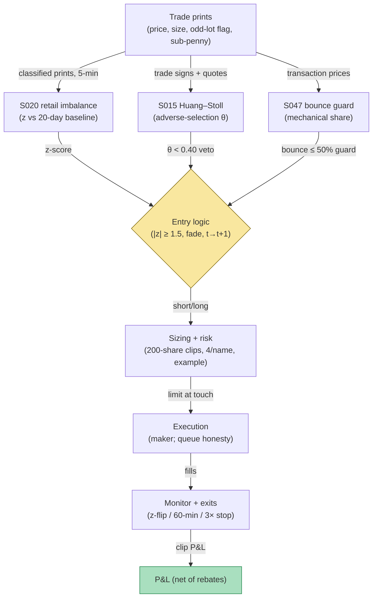

## Stage 183/200 — T083: Retail-Flow Internalizer Fade

*Batch TB9 · Strategy 83/100 · Signals S020, S015, S047 · Provenance [D]*

### T1. One-line verdict

| | |
|---|---|
| **Style** | Intraday contrarian: fade retail order-flow extremes |
| **Edge source** | Retail flow is uninformed on average (Barber–Odean 2000): when retail buy/sell imbalance hits an extreme, the price move it caused is noise, and the next prints revert — provided the spread's adverse-selection component (Huang–Stoll) says the flow is genuinely uninformed |
| **Typical holding period** | Minutes to one hour; flat by the close |
| **Capacity hint** | Small: 200-share clips (`example`); retail extremes are thin — size beyond a few hundred shares and you become the flow |
| **Build-or-buy in one line** | Build: retail identification (odd-lot + sub-penny signatures) is public methodology; no vendor sells the t→t+1 fade rule |

### T2. Full mechanics

**Universe & session.** US equities, price ≥ $5 (`example`), ADV ≥ 500k shares (`example`), RTH only. Excludes earnings days and halts — retail herding around news is a different (informed-mimicking) flow.

**Retail identification (S020).** *Retail-identifiable flow* is signed volume attributable to individual investors. Two public signatures: **odd-lot trades** (fewer than 100 shares — institutions rarely print odd lots; O'Hara–Yao–Ye 2014) and **sub-penny price improvement** (wholesalers internalize retail at fractions of a cent). For each 5-minute bar (`example`), compute signed retail volume: buys minus sells, where a print counts as retail if it is odd-lot or executes at a sub-penny price. The **retail imbalance** is `(buys − sells) / (buys + sells)`, and the z-score is `(imb − μ) / σ` against a 20-day rolling baseline (`example`).

**Why two retail signatures.** Odd lots and sub-penny prints catch *different* retail: odd lots catch the small direct-retail order (a 37-share limit buy), while sub-penny improvement catches internalized retail (a 200-share market order filled at $40.005 by a wholesaler). Using only one signature misses roughly half the flow — and worse, misses it *selectively*: sub-penny flow skews toward market orders (urgent retail), odd-lot flow toward limit orders (patient retail). The imbalance z-score is computed on the union, but the strategy logs the two sub-imbalances separately; if they disagree in sign on a trigger bar (`example`: |z_odd − z_subpenny| > 1.0), the trigger is skipped — disagreement means the "retail" read is really a classifier artifact.

**Trigger.** Fade when `|z| ≥ 1.5` (`example`): short extreme retail buying, cover extreme retail selling. The fade is contrarian — it bets the retail-driven move contains no information.

**Adverse-selection gate (S015).** The Huang–Stoll **spread decomposition** splits the bid–ask spread into order-processing, inventory, and **adverse-selection** (θ) components. The fade is only taken when θ < 0.40 (`example`): if the spread is mostly adverse selection, the flow may be informed after all and the fade is vetoed. This is the strategy's honesty device — it refuses to fade flow that the market-maker community prices as toxic.

**Bid–ask bounce guard (S047).** Transaction prices bounce mechanically between bid and ask even when fair value is flat. S047 estimates the mechanical bounce share of the last 5-minute move; if more than 50% (`example`) of the move is bounce, the "extreme" is microstructure noise in the measurement itself and the trigger is skipped.

**Entry rule.** Signal computed on bar *t* (the 5-minute bar where z crosses ±1.5) → earliest fill at bar *t+1*. Direction: fade (short retail-buy extremes, buy retail-sell extremes). Fill assumption: passive — post at the touch, modeled as a maker.

**Exit rule.** Cover on signal flip (z crosses back through 0), or time stop 60 minutes (`example`), or stop-loss at 3× the entry bar's range against the position (`example`). First touch wins.

**Position sizing.** Fixed clips: 200 shares per trigger (`example`), max 4 concurrent clips per name (`example`), portfolio heat ≤ $50k gross (`example`).

**Risk limits.** Daily loss stop −$500 (`example`); halt new fades if the adverse-selection gate fails three times in a row (flow regime may have turned informed).

**Cost model.** Maker rebate $0.002/share/side (`example`); adverse slippage modeled explicitly per clip; no borrow assumption issues intraday (locate verified at entry for shorts).

**Order/execution sketch.** Post non-marketable limit orders at the touch on both legs; participation ≤ 10% of visible depth (`example`); queue-position honesty: modeled as mid-queue, and the sensitivity run assumes back-of-queue (no fill on 30% of triggers, `example`).

**Worked intuition — a tiny numerical sketch.** Picture the 5-minute bar: 320 retail prints netting to 280 buy-shares vs 40 sell-shares. The imbalance is (280−40)/(280+40) = 0.75 — three-quarters of retail flow leaning one way. Against a baseline of 0.05 ± 0.30, that's z = 2.33, a 1-in-100 bar. The fade shorts 200 shares at $40.01 into that buying: if the buying was noise, the next bars drift back toward $39.99 and each clip banks ~$4 plus the $0.80 rebate pair; if it was the start of real demand, the Huang–Stoll gate (θ = 0.30 here, comfortably uninformed) is the only thing standing between the fade and a squeeze — which is why the gate, not the z-score, is the binding risk control.

**Parameter robustness.** The `example` cuts (z ≥ 1.5, θ < 0.40, 20-day baseline, 5-minute bars) are starting points. Sensitivity protocol: re-run with z ∈ {1.0, 1.5, 2.0}, baselines of 10/20/40 days, and bars of 1/5/15 minutes; the fade's per-clip net of rebates should keep its sign across at least 7 of 12 combinations. The θ cap is the most sensitive: loosening it to 0.60 admits informed flow and flips the sign in most calibrations — that sensitivity is the point of the gate.

### T3. Signals it consumes

| Signal | Role | Weight / logic |
|---|---|---|
| S020 (retail signed imbalance) | Primary trigger | z = (imb − μ)/σ, 20-day baseline; fire at \|z\| ≥ 1.5 (`example`); fade direction |
| S015 (Huang–Stoll decomposition) | Veto gate | require adverse-selection share θ < 0.40 (`example`); else skip |
| S047 (bid–ask bounce) | Measurement guard | skip if bounce explains > 50% of the trigger-bar move (`example`) |

Pseudocode (≤25 lines):
```
on 5-min bar t close:
    imb = (retail_buys - retail_sells) / (retail_buys + retail_sells)  # S020
    z = (imb - mean_20d) / sd_20d
    theta = huang_stoll_adverse_selection(t)                          # S015
    bounce = bounce_share(t)                                          # S047
    if abs(z) >= 1.5 and theta < 0.40 and bounce <= 0.50:              # example cuts
        side = SHORT if z > 0 else LONG
        post_limit(side, 200 shares, at_touch)                         # fill >= t+1
        exits: z crosses 0 | 60-min time stop | 3x-range stop          # example
```

### T4. Worked example — numbers + P&L (SYNTHETIC)

Fictional mid-cap "RTQ", seed 183. In bar *t*: retail buys 280 shares, retail sells 40 shares → imbalance = (280 − 40)/(280 + 40) = **0.75**; baseline μ = 0.05, σ = 0.30 → **z = (0.75 − 0.05)/0.30 = 2.33 ≥ 1.5 → fade SHORT**. Huang–Stoll adverse-selection share **θ = 0.30 < 0.40 → cost gate passes**. Bounce share 22% < 50% → guard passes. Signal at *t* → fills from *t+1*: four 200-share short clips at **$40.01**.

| Clip | Short | Cover | Gross | Rebate (2×$0.002×200) | Net |
|---|---|---|---|---|---|
| 1 | $40.01 | $39.99 | +$4.00 | +$0.80 | **+$4.80** |
| 2 | $40.01 | $39.99 | +$4.00 | +$0.80 | **+$4.80** |
| 3 | $40.01 | $40.03 | −$4.00 | +$0.80 | **−$3.20** |
| 4 | $40.01 | $39.99 | +$4.00 | +$0.80 | **+$4.80** |
| **Total** | | | **+$8.00** | **+$3.20** | **+$11.20** |

Clip 3 suffers adverse selection: the cover drifts to $40.03 (intended $39.99), a −$8.00 swing vs plan — the S015 gate passed at entry but the flow turned mid-hold, which is exactly the residual risk this strategy carries. Cumulative net: $4.80 → $9.60 → $6.40 → **$11.20**.

**Session net: +$11.20 (synthetic; demonstrates the ledger, not forward alpha or after-cost profitability).**

**Where the example is optimistic.** All four clips fill in full at the touch — real maker fills face queue risk and partials. The adverse-selection gate is assumed constant; θ can jump within the hold. Retail identification via odd-lot/sub-penny heuristics misclassifies some institutional flow (O'Hara–Yao–Ye note odd lots are an imperfect proxy). The example also assumes the borrow is available and cheap for all four short clips.

### T5. Data & infra — what must run

Trade-level data with odd-lot flags and sub-penny execution prices (TAQ or equivalent), 5-minute bar builder, 20-day rolling baseline store. Intraday loop: classify each print, update the current bar's retail imbalance, evaluate the trigger at bar close. Post-close: recompute baselines and the Huang–Stoll decomposition. Storage: trade-level for 500 names ≈ 20–40 GB/month. M5 Max feasibility: the classifier is a vectorized pass at ~100–500k events/sec (see `notes/cost-model.md`); live operation is trivial. Feed-drop failure plan: if prints stall >60 seconds (`example`), freeze the current bar and suppress new triggers until the tape resumes — a half-formed imbalance reading is worse than none.

**Calibration discipline.** The 20-day retail baseline and the Huang–Stoll decomposition are estimated on data ending the prior session (no intraday refit, `example`), so today's flow never contaminates its own benchmark. The odd-lot/sub-penny classifier is revalidated quarterly against a hand-labeled sample; if the misclassification rate drifts above 15% (`example`), the z-scores are recomputed with wider error bands and the trigger tightens to 2.0 until the classifier is fixed. Throughput: classifying a full day's prints for 500 names is a single vectorized pass, minutes on the M5 Max.

### T6. Buy vs build

**Polygon.io** (~$199/mo class, `indicative — verify before budgeting`) for trade-level data with odd-lot detail; **QuantConnect** (~$60–$300/mo class, `indicative — verify before budgeting`) for the research harness; **Interactive Brokers paper trading** (no incremental platform fee on an existing account, `indicative — verify before budgeting`) for the live-fire test. Verdict: **build everything** — the retail-identification heuristics are published (O'Hara–Yao–Ye 2014; Boehmer et al. 2021), and no vendor sells the fade rule with a documented adverse-selection veto.

### T7. Success-ratio evidence

Published, checkable sources only:

1. Barber–Odean (2000), "Trading Is Hazardous to Your Wealth": individual investors' trades underperform — the behavioral basis for treating retail flow as uninformed on average. (https://onlinelibrary.wiley.com/doi/10.1111/0022-1082.00226)
2. O'Hara–Yao–Ye (2014), "What's Not There: Odd Lots and Market Data": odd-lot trades carry information content distinct from round lots; validates odd lots as a retail-flow proxy while warning the proxy is imperfect. (https://ideas.repec.org/a/bla/jfinan/v69y2014i5p2199-2236.html)
3. Huang–Stoll (1997), "The Components of the Bid-Ask Spread": three-way decomposition with a separately identified adverse-selection component — the gate that keeps the fade from leaning into informed flow. (https://ideas.repec.org/a/oup/rfinst/v10y1997i4p995-1034.html)

None of these papers tests a retail-imbalance fade rule; no after-cost profitability is documented for this exact strategy.

### T8. Failure modes

- **Informed retail.** Around news, retail flow herds *with* information; the fade then leans into a real move. Mitigation: the θ veto and the earnings-day exclusion.
- **Proxy decay.** As wholesalers change internalization practices, the odd-lot/sub-penny signature drifts. Mitigation: revalidate the classifier quarterly against a labeled sample.
- **Queue-position fantasy.** Maker-fill assumptions are the classic optimism. Mitigation: the back-of-queue sensitivity run (30% no-fill, `example`).
- **Crowding.** Retail-fade is a known HFT-adjacent flow; the edge decays as more internalizers lean the same way. Mitigation: monitor per-clip net of rebates; halt if the trailing-20-day mean goes negative (`example`).
- **Bounce mismeasurement.** S047's bounce estimate itself has error; a "clean" trigger can still be half bounce. Mitigation: require the trigger bar's range to exceed 2× the quoted spread (`example`).

**Bottom line for the two operators.** For the ≤$1M paper operation, the retail fade is one of the few strategies in this batch executable as drawn: 200-share clips, maker rebates, no colo needed — paper-trade it for a quarter and the per-clip ledger will tell you whether your retail proxy works. For the institutional desk, this flow is the internalizers' home turf; the edge, if any, is in better retail identification (account-level data) rather than in the fade rule itself.

**Two more failure modes.**

- **Wholesaler regime change.** Payment-for-order-flow economics and internalization rules change the retail signature faster than the classifier adapts. Mitigation: the quarterly revalidation plus a hard halt if the trigger rate doubles or halves month-on-month (`example`).
- **Correlated retail waves.** Meme-stock episodes synchronize retail flow across names; the 4-clip-per-name cap doesn't bound the portfolio's correlated short exposure. Mitigation: a portfolio-level retail-beta cap — total fade gross ≤ $50k (`example`) already, plus a halt if more than 10 names trigger in one bar (`example`).

### T9. Visuals


*Chart caption: synthetic data — not market data. Watermark reads "SYNTHETIC EXAMPLE" exactly.*



### T10. Sources

1. Huang, R. D. & Stoll, H. R. (1997). "The Components of the Bid-Ask Spread: A General Approach." *Review of Financial Studies* 10(4): 995–1034. https://ideas.repec.org/a/oup/rfinst/v10y1997i4p995-1034.html — three-way spread decomposition; adverse-selection gate. Inherited from S015's S12 (verified in an earlier batch).
2. O'Hara, M., Yao, C. & Ye, M. (2014). "What's Not There: Odd Lots and Market Data." *Journal of Finance* 69(5): 2199–2236. https://ideas.repec.org/a/bla/jfinan/v69y2014i5p2199-2236.html — odd lots as retail proxy, with caveats. Inherited from S020's S12 (verified in an earlier batch).
3. Roll, R. (1984). "A Simple Implicit Measure of the Effective Bid-Ask Spread in an Efficient Market." *Journal of Finance* 39(4): 1127–1139. https://authors.library.caltech.edu/records/afwsc-6bb61 — mechanical bid–ask bounce in transaction prices. Inherited from S047's S12 (verified in an earlier batch).

**Unverified leads** (not confirmed facts — verify before use):
- Grok answered Q-TB9-3 (2026-09-10); its retail-flow arithmetic is a lead only — the z = 2.33 ledger above was recomputed independently.
- Barber–Odean (2000) documents retail underperformance at investor-horizon, not intraday fade profitability; do not cite it as evidence the fade works.

*Source log: Grok answered Q-TB9-1..3 (2026-09-10); all claims independently verified or labeled unverified.*
