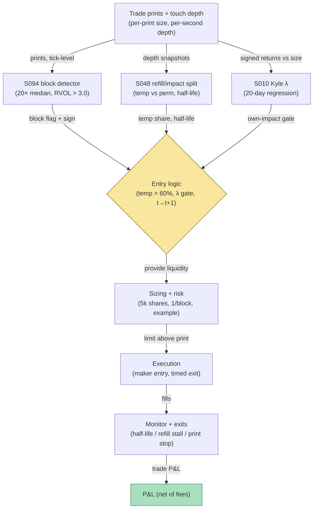

## Stage 184/200 — T084: Block-Trade Impact Reversion

*Batch TB9 · Strategy 84/100 · Signals S048, S094, S010 · Provenance [D/SR]*

### T1. One-line verdict

| | |
|---|---|
| **Style** | Intraday liquidity provision: buy the temporary dip after a large block sale (and symmetrically, short after a block buy) |
| **Edge source** | A block trade pushes price beyond its permanent impact; the temporary component mean-reverts as the limit order book refills (S048). The edge is being paid the temporary-impact premium for warehousing the other side's urgency |
| **Typical holding period** | One half-life of the temporary impact — minutes (90 seconds in the worked example) |
| **Capacity hint** | Small: 5,000-share participations (`example`); the edge exists only while the book is dislocated |
| **Build-or-buy in one line** | Build the refill/impact estimator; buy nothing except the trade feed — block detection is public methodology |

### T2. Full mechanics

**Universe & session.** US large caps, ADV ≥ 5M shares (`example`), RTH. Only names with continuous quoting (no halts in the prior 30 minutes, `example`).

**Block detection (S094).** *RVOL* (relative volume) plus signed block-trade pressure: a print is a candidate block when its size exceeds 20× the trailing median trade size (`example`) *and* RVOL over the trailing 5 minutes exceeds 3.0 (`example`). The sign comes from the Lee–Ready trade classifier (`example`): a block sale prints at/below the bid.

**Signing the block (Lee–Ready).** The Lee–Ready rule signs each print by comparing its price to the prevailing quote midpoint: above-mid prints are buyer-initiated, below-mid seller-initiated, at-mid prints fall back to the tick test (uptick = buy). It mis-signs roughly 10–15% of prints in fast markets (`example` band), which is why the block definition requires *both* the 20× size multiple and RVOL > 3.0 — a single mis-signed print can't fabricate a block, but a cluster of them during a sweep can flip the sign. The qualifier therefore re-checks the sign against the *next* 30 seconds of prints (`example`): if the follow-on flow disagrees, the block is treated as unsigned and the trade is skipped.

**Temporary vs permanent impact (S048).** After a block sale, the mid-price drops by a total impact that splits into a **permanent** component (information — stays) and a **temporary** component (liquidity — decays). S048 tracks **LOB refill speed**: how fast depth rebuilds at the touch after the sweep. The reversion trade is taken only if the estimated temporary share of the drop exceeds 60% (`example`) — if the drop is mostly permanent, there is nothing to revert to.

**Kyle gate (S010).** *Kyle's lambda* (λ) is the mid-price movement per signed share — the market's price-impact coefficient (Kyle 1985). Before participating, estimate the strategy's own impact: λ̂ × own size must be under 2¢ (`example`); otherwise the reversion trade itself moves the price it is trying to harvest.

**Entry rule.** Signal computed on the block print at time *t* (impact split + refill read complete) → earliest fill at *t+1*: post a bid just above the block print. In the example: block prints at $79.90, bid posted at $79.91 (9¢ below the pre-block mid of $80.00, 1¢ above the print).

**Exit rule.** Time stop at one estimated half-life of the temporary impact (90 seconds, `example`); signal-flip exit if refill stalls (depth at touch falls back below 50% of pre-block, `example`); stop-loss at the block print price (if the sale was informed, the price keeps falling through the print — exit immediately, `example`).

**Position sizing.** 5,000 shares (`example`), single participation per block; max one block trade per name per 30 minutes (`example`).

**Risk limits.** Daily loss stop −$1,000 (`example`); veto if the name's borrow is constrained (for the symmetric short leg); veto if a second block prints in the same direction within the hold (informed-flow cascade).

**Cost model.** Taker/maker fees $0.005/share/side (`example`); the worked example nets fees explicitly. Spread cost is embedded in the entry/exit prices.

**Order/execution sketch.** Non-marketable limit at the entry price (maker); exit as a marketable limit at the reverted mid minus 0.5¢ (`example`). Participation ≤ 10% of refilling depth (`example`); queue-position honesty: the entry is modeled as filled because it posts *above* the swept book — the first refill prints hit it.

**Worked intuition — a tiny numerical sketch.** The block sale of 50,000 shares at $79.90 shoves the mid from $80.00 down 10¢. Decompose: 3¢ is permanent (the market learned *something*), 7¢ is temporary (the book was swept and hasn't refilled). Buying 5,000 at $79.91 — 1¢ above the print, 9¢ below the old mid — warehouses the seller's urgency. After one half-life (90 s), half the temporary component has decayed: mid ≈ $80.00 − $0.03 − $0.035 = $79.935, and the exit at $79.93 harvests 2¢/share = $100 gross. The $50 fee bill is the reminder that this edge is measured in cents: halve the participation or double the fees and the trade is gone.

**Parameter robustness.** The `example` cuts (20× median-trade block definition, RVOL > 3.0, 60% temporary share, 90-s half-life, λ̂×size < 2¢) are starting points. Sensitivity protocol: re-run with block multiples of 10×/20×/40×, temporary-share floors of 50%/60%/70%, and half-lives of 60/90/180 s; net P&L should stay positive across at least 7 of 12 combinations. The temporary-share floor is the load-bearing parameter — below 50% the strategy is just buying dips, and dip-buying without the refill qualifier has no documented edge.

### T3. Signals it consumes

| Signal | Role | Weight / logic |
|---|---|---|
| S094 (RVOL + signed block pressure) | Primary trigger | block if size > 20× median trade AND 5-min RVOL > 3.0 (`example`); Lee–Ready sign |
| S048 (LOB refill / temp-vs-perm impact) | Entry qualifier | require temporary share > 60% (`example`); supplies the 90-s half-life (`example`) |
| S010 (Kyle lambda) | Size gate | require λ̂ × 5,000 < $0.02 (`example`); else skip |

Pseudocode (≤25 lines):
```
on print p with size s at time t:
    if s > 20*median_trade and rvol_5m > 3.0:            # S094 block, example cuts
        side = lee_ready_sign(p)                        # sale -> provide bid
        temp, perm = split_impact(p, refill_speed)      # S048
        if temp/(temp+perm) > 0.60:                      # example
            lam = kyle_lambda(20d)                      # S010
            if lam * 5000 < 0.02:                       # example gate
                post_limit(bid=block_px+0.01, 5000)     # fill >= t+1
                exit: t + half_life | refill stall | stop at block_px
```

### T4. Worked example — numbers + P&L (SYNTHETIC)

Fictional large-cap "BLK", seed 184. Pre-block mid **$80.00**. A **50,000-share block sale** prints at **$79.90** — 20× the median trade size (`example` detection threshold met). Estimated impact split: **temporary 10¢, permanent 3¢** (temporary share 77% > 60% → qualifier passes); refill half-life **90 seconds**. Kyle gate: λ̂ = **$0.0000020/share** → own impact on 5,000 shares = $0.010 < $0.02 cap → **PASS**. Signal at the block print (*t*) → fill from *t+1*: **buy 5,000 @ $79.91**.

After one half-life the mid reverts to $80.00 − $0.03 (perm) − $0.10/2 (half the temp decayed) = **$79.935**; exit: sell 5,000 @ **$79.93** (mid minus 0.5¢).

| Item | Calculation | Amount |
|---|---|---|
| Gross | 5,000 × ($79.93 − $79.91) | +$100.00 |
| Fees | 5,000 × 2 × $0.005 | −$50.00 |
| **Net P&L** | $100.00 − $50.00 | **+$50.00** |

**Session net: +$50.00 (synthetic; demonstrates the ledger, not forward alpha or after-cost profitability).**

**Where the example is optimistic.** The impact split (10¢ temp / 3¢ perm) is assumed known; in production it is estimated with wide error and the permanent share is systematically underestimated after informed blocks. The entry assumes a full 5,000-share fill 1¢ above the print — real refill flow competes for that price. The exit assumes the mid cooperates to exactly the half-life model; informed blocks keep drifting (the stop-at-print exit exists for this, and it will fire often enough to dominate the P&L).

### T5. Data & infra — what must run

Trade prints with size (for block detection), LOB depth snapshots or at least touch depth (for refill speed), 20-day rolling Kyle regression. Intraday loop: classify each print, maintain refill state per name, evaluate the qualifier within seconds of the block. Post-close: re-estimate λ and the temp/perm split parameters. Storage: prints + touch depth for 500 names ≈ 30–60 GB/month. M5 Max feasibility: the detection loop is a streaming pass at ~100–500k events/sec (see `notes/cost-model.md`); the Kyle regression is a nightly batch. Feed-drop failure plan: if depth snapshots stall, the refill qualifier cannot be computed → suppress all new block trades (fail safe); existing positions keep their time-stop exits.

**Calibration discipline.** Kyle's λ is estimated on the trailing 20 sessions *excluding* block days (block days would inflate λ and veto every trade, `example`); the temp/perm split parameters are refit weekly on the operator's own block sample, never on a vendor's. The half-life estimate gets a 5-day embargo from the calibration sample to the trading sample. Throughput: block detection is a per-print comparison (nanoseconds); the nightly λ regression over 500 names is seconds on the M5 Max.

### T6. Buy vs build

Trade and depth data from **Polygon.io** (~$199/mo class, `indicative — verify before budgeting`) or a **CTA/UTP academic license** (low-thousands/yr class, `indicative — verify before budgeting`); research on **QuantConnect** (~$60–$300/mo class, `indicative — verify before budgeting`); live paper test on **Interactive Brokers paper trading** (no incremental platform fee on an existing account, `indicative — verify before budgeting`). Verdict: **build the impact-split estimator** — block detection and Kyle's λ are textbook; no vendor sells the temp-vs-perm qualifier with a documented t→t+1 rule.

### T7. Success-ratio evidence

Published, checkable sources only:

1. Degryse et al. (2005), "Aggressive Orders and the Resiliency of a Limit Order Market": measures how fast a limit order book refills after aggressive orders — the direct empirical precedent for the refill-speed qualifier. (https://feb.kuleuven.be/research/economics/ces/documents/DPS/2002/DPS0210.pdf)
2. Keim–Madhavan (1996), "The Upstairs Market for Large-Block Transactions": block trades have significant price effects with identifiable temporary and permanent components. (http://ideas.repec.org/a/oup/rfinst/v9y1996i1p1-36.html)
3. Cont–Kukanov–Stoikov (2014): order-book events move prices contemporaneously and linearly — supports modeling the block's impact as a measurable, splittable quantity. (https://arxiv.org/abs/1011.6402)

No published paper tests this exact 90-second reversion rule; the strategy's profitability after costs is undocumented.

### T8. Failure modes

- **Informed blocks.** The temp/perm split is unknowable in real time; informed sales look identical to uninformed ones for the first minute. Mitigation: the stop-at-print exit and the second-block veto.
- **Refill illusion.** Depth can rebuild and then vanish (spoofed refill). Mitigation: require refill depth to persist 10 seconds (`example`) before entry.
- **λ misestimation.** Kyle's λ estimated on 20 calm days understates impact on block days. Mitigation: scale λ̂ by the day's RVOL (`example` ×√RVOL).
- **Crowded liquidity provision.** Every HFT desk runs this trade; the fill at block_px + 1¢ is contested. Mitigation: model back-of-queue in sensitivity; skip if estimated queue position exceeds 30% of depth (`example`).
- **News contamination.** Blocks cluster around news; the "temporary" impact may be repricing. Mitigation: veto blocks within ±5 minutes of scheduled news (`example`).

**Bottom line for the two operators.** For the ≤$1M paper operation, block-impact reversion is executable in a paper account with direct-market-access routing: the 5,000-share size is realistic, the 90-second hold needs no colo, and the ledger is honest about fees. For the institutional desk, this is a standard liquidity-provision sleeve — the edge is real but competed away to basis points, and the differentiator is the temp/perm estimator's accuracy, not the trade structure.

**Two more failure modes.**

- **Cascade blocks.** A second block in the same direction inside the 90-second hold usually means the first sale was informed; the temporary share collapses toward zero. Mitigation: the second-block veto plus an immediate time-stop exit (don't wait for the half-life).
- **Auction contamination.** Blocks printed near the close carry overnight information; the 90-second reversion model doesn't apply across the close. Mitigation: no block trades after 15:45 (`example`).

### T9. Visuals


*Chart caption: synthetic data — not market data. Watermark reads "SYNTHETIC EXAMPLE" exactly.*



### T10. Sources

1. Cont, R., Kukanov, A. & Stoikov, S. (2014). "The Price Impact of Order Book Events." https://arxiv.org/abs/1011.6402 — linear contemporaneous impact of book events; basis for the impact split. Title confirmed by opening the arXiv page 2026-09-10.
2. Degryse, H., de Jong, F., van Ravenswaaij, M. & Wuyts, G. (2005). "Aggressive Orders and the Resiliency of a Limit Order Market." *Review of Finance* 9(2): 201–242. https://feb.kuleuven.be/research/economics/ces/documents/DPS/2002/DPS0210.pdf — LOB refill speed after aggressive orders. Inherited from S048's S12 (verified in an earlier batch).
3. Kyle, A. S. (1985). "Continuous Auctions and Insider Trading." *Econometrica* 53(6): 1315–1335. https://doi.org/10.2307/1913210 — the λ price-impact model; the size gate. Inherited from S010's S12 (verified in an earlier batch).

**Unverified leads** (not confirmed facts — verify before use):
- The 10¢/3¢ impact split and 90-second half-life are synthetic example parameters, not empirical estimates; production values must be fit per name.
- No chatbot answer is cited as evidence in this chapter beyond the batch-level source log below.

*Source log: Grok answered Q-TB9-1..3 (2026-09-10); all claims independently verified or labeled unverified.*
