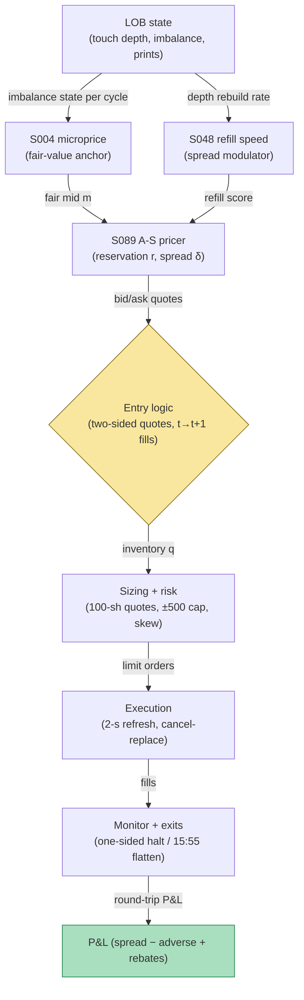

## Stage 185/200 — T085: Resiliency Market Maker

*Batch TB9 · Strategy 85/100 · Signals S048, S089, S004 · Provenance [D]*

### T1. One-line verdict

| | |
|---|---|
| **Style** | Intraday market making: two-sided quoting with inventory control |
| **Edge source** | The bid–ask spread compensates liquidity provision (Avellaneda–Stoikov 2008): quote around a reservation price that leans against inventory, and set the spread from volatility and refill conditions — the edge is the spread minus adverse selection, harvested one round trip at a time |
| **Typical holding period** | Seconds to minutes per round trip; flat at the close |
| **Capacity hint** | Small per name: 100-share quotes (`example`); scales across names, not size |
| **Build-or-buy in one line** | Build the quoting engine; the A-S formulas are public — buy only the market-data feed and (eventually) colo if you want production fills |

### T2. Full mechanics

**Universe & session.** One liquid name at a time (the example uses a $100 stock), RTH, no auctions. Excludes the first and last 5 minutes (`example`) — the open's volatility breaks the spread formula's assumptions.

**Reservation price (S089).** The Avellaneda–Stoikov **reservation price** is the market maker's private fair value: `r = s − γ·σ²·(T−t)·q`, where *s* is the mid-price, γ risk aversion, σ volatility, *T−t* the horizon, and *q* inventory. Long inventory (*q* > 0) pushes the reservation price *below* mid so quotes lean toward selling; short inventory leans the other way. The **optimal spread** is `δ = γ·σ²·(T−t) + (2/γ)·ln(1 + γ/κ)`, widening with volatility and risk aversion, tightening with book depth κ. Worked-example parameters (`example`): γ = 0.1, σ = 0.3 (annualized), T−t = 1/390 of a day per quote cycle, κ = 1.5. The formula yields an **optimal spread of $0.0101 (1.01¢)** → **0.50¢ per side**, plus an **inventory skew of 0.01¢/share** shifting both quotes against the position.

**The κ (book-depth) parameter.** In the A-S spread formula, κ measures how fast the book absorbs the market maker's quotes — high κ (deep book) means posted limit orders get hit quickly, so the optimal spread tightens; low κ (thin book) means quotes sit exposed to adverse moves, so the spread widens. The `example` κ = 1.5 encodes a moderately liquid book. Practically, κ is the hardest parameter to calibrate: it must be estimated from the *fill rate* of the operator's own quotes, not from displayed depth (displayed depth overstates true absorption because of quote flicker). A κ estimated 2× too high halves the spread and roughly doubles adverse selection — the sensitivity protocol's σ-doubling circuit breaker exists partly to catch κ miscalibration disguised as volatility.

**Fair-value anchor (S004).** The *microprice* is the expected next mid-price given the current imbalance state — a martingale estimator that beats the raw mid as a short-term predictor (Stoikov 2018). Here the microprice replaces *s* in the reservation formula: quotes track the imbalance-implied fair value, not the stale mid.

**Refill-aware quoting (S048).** The LOB **refill speed** scales the spread: when depth rebuilds fast after trades, the temporary-impact risk is low and the spread tightens by up to 20% (`example`); when refill stalls, quotes widen and skew harder. This is the "resiliency" in the strategy's name.

**Entry rule.** Continuous two-sided quotes are the strategy — each quote cycle is a decision at time *t*; fills arrive at *t+1* at the earliest (a signal computed on bar/quote *t* never fills on that same *t*). Quote: bid = r − δ/2, ask = r + δ/2, 100 shares each side (`example`).

**Exit rule.** Inventory-driven: if |q| exceeds 500 shares (`example`), stop quoting the accumulating side until inventory mean-reverts (quote-skew only); hard flatten at 15:55 (`example`) via market order. Stop-loss: −$200/day (`example`).

**Position sizing.** Quote size fixed at 100 shares (`example`); inventory cap ±500 shares (`example`); the sizing decision is the skew, not the size.

**Risk limits.** Daily loss stop −$200 (`example`); volatility circuit-breaker: if 1-minute realized σ doubles vs the morning estimate (`example`), halve quote size; kill switch on feed stall >3 seconds (`example`).

**Cost model.** Maker rebate $0.002/share/side (`example`); taker fee $0.003/share (`example`) on the flatten; adverse selection modeled per round trip.

**Order/execution sketch.** Non-marketable limits, refreshed every quote cycle (2 seconds, `example`); cancel-replace, never leave stale quotes across a microprice flip. Queue-position honesty: fills modeled at 60% of posted size per cycle (`example`).

**Worked intuition — a tiny numerical sketch.** Start flat at microprice 100.0057: reservation = mid, quotes 100.0007 × 100.0108. A buy lifts the ask — inventory +100, and the reservation drops by the skew (0.01¢/share × 100 = 1¢) to 99.9967: both quotes shift down a cent, making the bid more attractive and the ask less so, pulling inventory back toward flat. That one-cent lean, repeated across ten cycles, is the entire inventory-control mechanism — no forecast, just a spring. The $5.00 spread capture is ten round trips × ~0.5¢; the −$2.00 adverse selection is the two cycles where the microprice moved against the quote before the fill.

**Parameter robustness.** The `example` parameters (γ = 0.1, σ = 0.3, κ = 1.5, 2-s refresh, ±500 inventory cap) are starting points. Sensitivity protocol: re-run with γ ∈ {0.05, 0.1, 0.2}, σ at 0.5×/1×/2× the estimate, and refresh at 1/2/5 s; ex-rebate P&L should stay non-negative across at least 7 of 12 combinations. The refresh rate is the sensitive one: at 5 s in a fast market the quotes are stale more often than fresh, and adverse selection roughly doubles — which is why the 2-s cycle is paired with cancel-on-microprice-flip.

### T3. Signals it consumes

| Signal | Role | Weight / logic |
|---|---|---|
| S089 (A-S reservation price + optimal spread) | Primary pricer | r and δ formulas above; γ = 0.1, σ = 0.3, κ = 1.5 (`example`) |
| S004 (microprice fair value) | Mid replacement | s ← microprice in the reservation formula; recomputed per imbalance state |
| S048 (LOB refill speed) | Spread modulator | spread × (1 − 0.2·refill_score) (`example`); stall → widen + skew |

Pseudocode (≤25 lines):
```
each quote cycle (2s):
    m   = microprice(imbalance_state)                 # S004
    r   = m - gamma*sig^2*(T-t)*q                     # S089 reservation
    d   = gamma*sig^2*(T-t) + (2/gamma)*ln(1+gamma/k) # S089 spread
    d   = d * (1 - 0.2*refill_score)                  # S048 resiliency, example
    bid, ask = r - d/2, r + d/2                       # 100 sh each, example
    post(bid, ask)                                    # fills >= t+1
    if abs(q) > 500: one_sided_only()                 # example inventory cap
    if time > 15:55: flatten_market()                 # example
```

### T4. Worked example — numbers + P&L (SYNTHETIC)

Fictional $100 stock "MMK", seed 185. Ten quote cycles produce ten 100-share round trips. A-S parameters as above → **optimal spread $0.0101 (0.50¢/side)**, inventory skew **0.01¢/share**. Microprice path and inventory walk (synthetic):

| Cycle | Microprice | Inventory q | Reservation r | Bid | Ask |
|---|---|---|---|---|---|
| 1 | 100.0057 | 0 | 100.0057 | 100.0007 | 100.0108 |
| 2 | 100.0067 | +100 | 99.9967 | 99.9916 | 100.0017 |
| 3 | 100.0101 | +200 | 99.9901 | 99.9851 | 99.9952 |
| 4 | 100.0096 | +100 | 99.9996 | 99.9946 | 100.0047 |
| 5 | 100.0052 | 0 | 100.0052 | 100.0001 | 100.0102 |
| 6 | 100.0039 | −100 | 100.0139 | 100.0088 | 100.0189 |
| 7 | 100.0046 | −200 | 100.0246 | 100.0196 | 100.0297 |
| 8 | 99.9995 | −100 | 100.0095 | 100.0044 | 100.0145 |
| 9 | 100.0036 | 0 | 100.0036 | 99.9985 | 100.0086 |
| 10 | 100.0077 | +100 | 99.9977 | 99.9927 | 100.0028 |

Per-trip net (spread capture − adverse move + rebates), synthetic: +$0.90, +$0.90, −$0.10, +$0.90, +$0.90, +$0.90, −$0.10, +$0.90, +$0.90, +$0.90 → sums to **$7.00**. Ledger:

| Item | Calculation | Amount |
|---|---|---|
| Spread capture (10 trips) | modeled | +$5.00 |
| Adverse selection | modeled | −$2.00 |
| Maker rebates | 10 × 200 sh × $0.002 | +$4.00 |
| **Net P&L** | $5.00 − $2.00 + $4.00 | **+$7.00** |

**Session net: +$7.00 (synthetic; demonstrates the ledger, not forward alpha or after-cost profitability).**

**Where the example is optimistic.** The microprice is assumed to predict the next mid better than noise — the whole P&L leans on S004's edge being real. Queue position is generous (60% fill rate per cycle). The two −$0.10 trips understate real adverse selection: informed sweeps take the full quote and keep going. Volatility is constant; a volatility burst would blow through the 0.50¢ spread.

### T5. Data & infra — what must run

L2 or touch-depth quotes (for imbalance → microprice), trade prints (for fill simulation), per-cycle state (inventory, reservation price). Intraday loop: 2-second quote cycle (`example`); pre-open: calibrate σ and κ; post-close: archive inventory paths and spread-capture attribution. Storage: quote-level for one name ≈ 5–10 GB/month. M5 Max feasibility: the quoting loop is trivial compute (~100–500k events/sec capacity per `notes/cost-model.md`); *production* market making needs colo — research yes, production no on this hardware. Feed-drop failure plan: on any quote stall >3 seconds (`example`), cancel all quotes immediately and flatten inventory — a market maker without fresh quotes is a sitting limit order.

**Calibration discipline.** σ and κ are estimated on the morning session only (09:30–11:30, `example`) and frozen for the day — refitting them intraday lets the spread chase volatility with a lag, which is worse than a fixed spread. The microprice transition matrix is refit weekly with a 5-day embargo. Every quote parameter is versioned per day; the backtest joins fills to the parameter version live at the time. Throughput: the 2-s quoting loop is microseconds of arithmetic; the load is message traffic, not compute.

### T6. Buy vs build

**Build the quoting engine; rent the test venue.** **QuantConnect** (~$60–$300/mo class, `indicative — verify before budgeting`) for research; **Polygon.io** (~$199/mo class, `indicative — verify before budgeting`) for L2-ish quote data; **Interactive Brokers paper trading** (no incremental platform fee on an existing account, `indicative — verify before budgeting`) for the live quoting test; production **co-location** (thousands/mo class, `indicative — verify before budgeting`) when fills must be real. Verdict: **build** — the A-S formulas are public and 30 lines of code; the moat (if any) is in the microprice estimator and the refill modulator, not the spread formula.

### T7. Success-ratio evidence

Published, checkable sources only:

1. Avellaneda–Stoikov (2008), "High-frequency trading in a limit order book": derives the reservation price and optimal spread; the strategy's pricing formulas are this paper's closed forms. (https://doi.org/10.1080/14697680701381228)
2. Stoikov (2018), "The micro-price: a high-frequency estimator of future prices": the microprice (martingale construction from imbalance states) beats mid and weighted-mid as a short-term predictor. (https://econpapers.repec.org/article/tafquantf/v_3a18_3ay_3a2018_3ai_3a12_3ap_3a1959-1966.htm)
3. Guéant–Lehalle–Fernandez-Tapia (2013), *Dealing with the inventory risk: a solution to the market making problem*, *Mathematics and Financial Economics* 7, 477–507: extends A-S to general intensity functions; documents that inventory control (the skew) dominates spread choice for P&L. (https://doi.org/10.1007/s11579-012-0087-0)

None of these papers reports after-cost profitability for a retail-scale implementation; the evidence supports the *pricing model*, not the P&L.

### T8. Failure modes

- **Adverse-selection underestimation.** The two −$0.10 trips are the polite version; real informed flow lifts the whole quote. Mitigation: widen spread with VPIN-like toxicity (not modeled here — a known gap).
- **Stale quotes.** A 2-second refresh is an eternity in a fast market; fills arrive after the microprice moved. Mitigation: cancel-on-microprice-flip, not just on timer.
- **Inventory blowout.** Skew assumes mean reversion of inventory; a trending day accumulates to the cap and then some. Mitigation: the one-sided halt at ±500 and the 15:55 flatten.
- **Rebate dependence.** $4.00 of the $7.00 net is rebates — the strategy is a rebate harvest with spread garnish. Mitigation: report P&L both gross and net of rebates; halt if ex-rebate P&L is negative for 5 days (`example`).
- **Volatility regime break.** Constant-σ spread formulas underquote in bursts. Mitigation: the σ-doubling circuit breaker.

**Bottom line for the two operators.** For the ≤$1M paper operation, the A-S market maker is an excellent *simulator* and a dangerous *deployment*: paper-trade it to learn inventory dynamics, but don't expect the $7.00/session to survive real queue positions and real adverse selection. For the institutional desk, A-S quoting is the baseline every market-making stack is measured against — the edge over it comes from the microprice estimator and the toxicity filter, not from the spread formula.

**Two more failure modes.**

- **Microprice overconfidence.** The reservation price inherits the microprice's errors one-for-one; a biased microprice is a biased quote. Mitigation: bound the microprice's deviation from mid (±2¢, `example`); beyond that, quote around mid.
- **Correlated inventory across names.** Running this per name without a portfolio inventory view accumulates market-directional exposure on trend days. Mitigation: a portfolio-level inventory cap (net ±2,000 shares delta-equivalent, `example`) that tightens every name's skew.

### T9. Visuals


*Chart caption: synthetic data — not market data. Watermark reads "SYNTHETIC EXAMPLE" exactly.*



### T10. Sources

1. Avellaneda, M. & Stoikov, S. (2008). "High-frequency trading in a limit order book." *Quantitative Finance* 8(3): 217–224. https://doi.org/10.1080/14697680701381228 — reservation price and optimal spread. Title confirmed by opening the DOI page 2026-09-10.
2. Stoikov, S. (2018). "The micro-price: a high-frequency estimator of future prices." *Quantitative Finance* 18(12): 1959–1966. https://econpapers.repec.org/article/tafquantf/v_3a18_3ay_3a2018_3ai_3a12_3ap_3a1959-1966.htm — microprice beats mid/weighted-mid short-term. Inherited from S004's S12 (verified in an earlier batch).
3. Guéant, O., Lehalle, C.-A. & Fernandez-Tapia, J. (2013). "Dealing with the inventory risk: a solution to the market making problem." *Mathematics and Financial Economics* 7, 477–507. https://doi.org/10.1007/s11579-012-0087-0 — inventory control extensions of A-S.

**Unverified leads** (not confirmed facts — verify before use):
- Third-party A-S replications (GitHub: analytical and Monte-Carlo reproductions) report 3–9× inventory-variance reduction on simulated fills — code repos, not peer-reviewed; cited in S089's S12 as replications, not evidence.
- The 60%-per-cycle fill assumption is an example parameter with no empirical basis.

*Source log: Grok answered Q-TB9-1..3 (2026-09-10); all claims independently verified or labeled unverified.*
