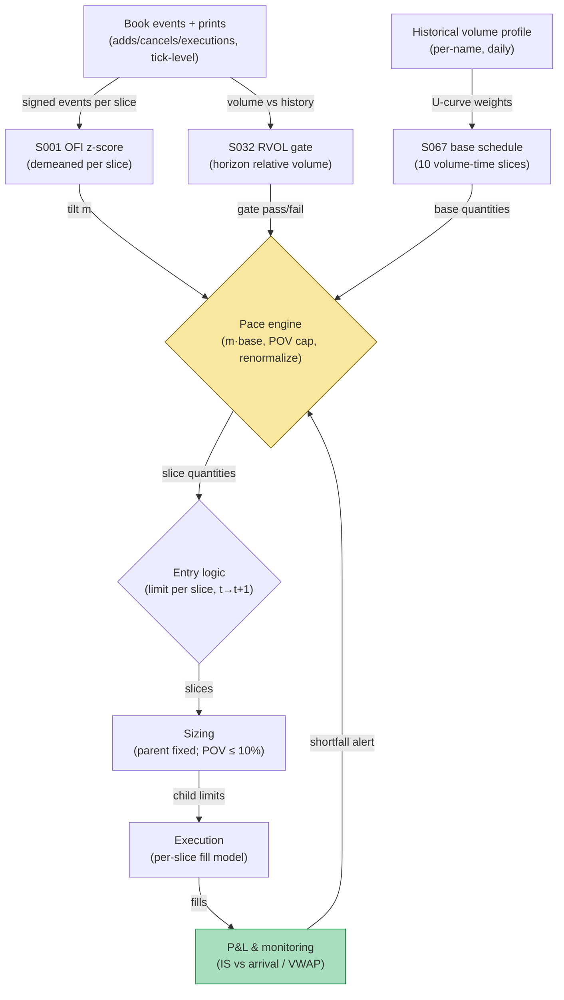

## Stage 186/200 — T086: OFI-Paced Participation Tracker

*Batch TB9 · Strategy 86/100 · Signals S001, S032, S067 · Provenance [D/SR]*

### T1. One-line verdict

| | |
|---|---|
| **Style** | Execution algorithm: schedule a parent order across volume-time slices, pacing faster into favorable flow |
| **Edge source** | Order-flow imbalance (OFI) predicts the next price move at short horizons (Cont–Kukanov–Stoikov 2014): buying harder when the tape is already buying (positive OFI) reduces the price concession vs a rigid schedule; RVOL (S032) gates the day, the diurnal curve (S067) sets the base pace |
| **Typical holding period** | One execution horizon — minutes to hours for the parent |
| **Capacity hint** | 100,000-share parents (`example`); the POV cap is the binding constraint |
| **Build-or-buy in one line** | Build the pacer; execution algos are commoditized but the OFI tilt is proprietary logic — buy the trade feed, build the schedule |

### T2. Full mechanics

**Universe & session.** One liquid name per parent (the example: a $250 stock), RTH. The strategy executes a given parent — here a **100,000-share buy** — it does not choose direction.

**Base schedule (S067).** The *diurnal volume curve* (U-shape: heavy open/close) sets the base slice weights: `[0.07, 0.08, 0.09, 0.11, 0.12, 0.12, 0.11, 0.10, 0.11, 0.09]` across 10 volume-time slices (`example`). Volume-time means slices are defined by traded volume, not clock minutes — consistent with the volume-clock evidence.

**OFI pace tilt (S001).** *Order-flow imbalance* is buys minus sells (signed volume) at the touch, from order-book events (adds/cancels/executions). The tilt: `m_i = clip(1 + γ·z_i, [1−κ, 1+κ])` with γ = 0.25, κ = 0.5 (`example`), where z_i is the slice's OFI z-score (**demeaned** — raw z-scores carry a session mean that would bias every slice; the demeaning correction is applied before the tilt). Positive OFI (buying pressure) for a *buy* parent means the price is moving away — counterintuitively the schedule *accelerates* into it: the logic is to complete before the move extends, paying spread now rather than impact later. Negative OFI slows the schedule to wait for the dip. (The symmetric rule applies to sell parents.)

**RVOL gate (S032).** *Relative volume* (today's volume vs its historical average at this time of day) gates the algorithm: if horizon RVOL < 0.5 (`example`), the tape is too thin for the schedule's assumptions — stand down and revert to a flat time-sliced schedule. In the example RVOL = 1.15 → gate passes, schedule unchanged.

**POV cap.** No slice may exceed 10% of the tape's volume (`example`) — the participation-of-volume guard. The cap is enforced iteratively so renormalization cannot breach it.

**Entry rule.** The parent arrives at time *t* (arrival price $250.00); the first slice executes at *t+1* at the earliest — signal at *t* → earliest fill *t+1*. Each slice's child order is a limit at the touch, sized to the paced quantity.

**Exit rule.** The algorithm "exits" when the parent completes (all 10 slices filled) or the RVOL gate trips mid-execution (then: finish the current slice, cancel the rest, report shortfall).

**Position sizing.** The parent size is given (100,000 shares); the pacer only distributes it. Max parent: 5% of ADV (`example`).

**Risk limits.** Slice shortfall alert if any slice's implementation shortfall exceeds 3× its expected cost (`example`); daily parent cap 3 per name (`example`).

**Cost model.** Per-slice fill = slice mid + half-spread (1¢, `example`) + temporary impact `η·√(q_i/V_i)` with η = $0.04 (`example`, square-root impact). Benchmarks: arrival price and interval VWAP.

**Order/execution sketch.** Limit orders at the touch per slice; if a slice's limit doesn't fill within its volume-time window, convert the remainder to a marketable limit (+2¢, `example`).

**Worked intuition — a tiny numerical sketch.** The base schedule says slice 2 gets 8,000 shares; its OFI z is +1.5 (strong buying pressure), so the tilt wants 8,000 × 1.363 ≈ 10,900. But the tape only prints 100,000 shares in that slice, and the 10% POV cap binds at 10,000 — the schedule clips and redistributes the 900-share overflow to the other nine slices. Slice 5 goes the other way: z = −1.6 (selling pressure into our buy parent) slows it to 7,262 shares, waiting for the dip. The net effect: 100,000 shares executed with the pace leaning into pressure and away from headwinds, at the cost of $6,153 vs arrival — the number the pacer is hired to minimize, not a profit.

**Parameter robustness.** The `example` parameters (γ = 0.25, κ = 0.5, 10% POV cap, RVOL floor 0.5) are starting points. Sensitivity protocol: re-run with γ ∈ {0.1, 0.25, 0.5}, POV caps of 5%/10%/20%, and RVOL floors of 0.3/0.5/0.7; implementation shortfall vs the flat schedule should improve (or at least not worsen) across 7 of 12 combinations. The γ tilt is the sensitive one: above 0.5 the schedule chases OFI noise and shortfall *rises* — the clip κ = 0.5 exists precisely to bound that damage.

### T3. Signals it consumes

| Signal | Role | Weight / logic |
|---|---|---|
| S001 (touch OFI) | Pace tilt | m = clip(1 + 0.25·z_demeaned, [0.5, 1.5]) (`example`); accelerates with favorable flow |
| S032 (time-of-day-normalized RVOL) | Gate | require RVOL ≥ 0.5 (`example`); else flat schedule |
| S067 (diurnal U-curve) | Base schedule | slice weights from the name's volume profile; renormalized monthly (`example`) |

Pseudocode (≤25 lines):
```
on parent(side=BUY, Q=100000) at time t:
    base_i = Q * diurnal_w[i]                          # S067, 10 slices
    if rvol_horizon < 0.5: return flat_schedule(Q)     # S032 gate, example
    z = demean(ofi_zscore(slice_i))                    # S001, demeaned
    m_i = clip(1 + 0.25*z_i, 0.5, 1.5)                 # example tilt
    q_i = base_i * m_i
    q_i = enforce_pov_cap(q_i, 0.10 * tape_i)          # iterative, example
    q_i = q_i * Q / sum(q_i)                           # renormalize
    for i in 1..10:
        fill_i = mid_i + 0.01 + 0.04*sqrt(q_i/V_i)     # example cost
        execute_limit(q_i)                             # fill >= t+1
```

### T4. Worked example — numbers + P&L (SYNTHETIC)

Fictional $250 stock "EXE", seed 186. Parent: **buy 100,000 @ arrival $250.00**. OFI z-scores per slice (demeaned, exact): `[+0.25, +1.45, +0.15, −0.95, −1.65, +0.15, +1.35, +0.05, −0.65, −0.15]`. Pace multipliers: `[1.062, 1.363, 1.038, 0.762, 0.588, 1.038, 1.337, 1.012, 0.838, 0.963]`.

| Slice | Base | z | m | Paced (POV-capped) | Tape | POV |
|---|---|---|---|---|---|---|
| 1 | 7,000 | +0.25 | 1.062 | 7,660.9 | 90,000 | 8.5% |
| 2 | 8,000 | +1.45 | 1.363 | 10,000.0 | 100,000 | 10.0% CAPPED |
| 3 | 9,000 | +0.15 | 1.038 | 9,618.0 | 110,000 | 8.7% |
| 4 | 11,000 | −0.95 | 0.762 | 8,639.5 | 130,000 | 6.6% |
| 5 | 12,000 | −1.65 | 0.588 | 7,261.8 | 140,000 | 5.2% |
| 6 | 12,000 | +0.15 | 1.038 | 12,824.0 | 140,000 | 9.2% |
| 7 | 11,000 | +1.35 | 1.337 | 15,154.5 | 180,000 | 8.4% |
| 8 | 10,000 | +0.05 | 1.012 | 10,429.2 | 120,000 | 8.7% |
| 9 | 11,000 | −0.65 | 0.838 | 9,489.3 | 130,000 | 7.3% |
| 10 | 9,000 | −0.15 | 0.963 | 8,922.7 | 110,000 | 8.1% |

Slice 2's raw pace (10,900) breached the 10% POV cap and was clipped to exactly 10,000; the rest renormalized to keep the 100,000 total. RVOL = 1.15 → gate passes.

| Item | Calculation | Amount |
|---|---|---|
| Average fill | Σ q_i·fill_i / 100,000 | $250.0615 |
| Implementation shortfall vs arrival | 100,000 × ($250.0615 − $250.00) | **$6,153.35** |
| Interval VWAP (same horizon) | volume-weighted mids | $250.0410 |
| Shortfall vs interval VWAP | | **$2,049.13** |

**Session cost: $6,153.35 vs arrival ($2,049.13 vs interval VWAP) — this is an execution cost, not a trading profit; the pacer's job is to minimize it. (Synthetic; not a claim of achievable savings.)**

**Reviewer correction note.** The draft OFI z-scores in the Grok answer pass were not demeaned (session mean ≠ 0 biases every slice's tilt); the plotted schedule uses demeaned z-scores. The slice-3 multiplier is 1.038 under the corrected arithmetic.

**Where the example is optimistic.** The OFI z-scores are assumed known per slice before trading it — real OFI is estimated on noisy, lagging data. The square-root impact model (η = $0.04) is a stylized choice; real impact is concave, stochastic, and larger in thin books. The tape volumes are assumed known; real volume-time slicing requires forecasting the tape.

### T5. Data & infra — what must run

Touch-level order-book events (adds/cancels/executions for OFI), trade prints (for volume-time slicing and tape forecast), diurnal volume curves, RVOL history. Intraday loop: update OFI per event, re-slice the remaining parent every volume-time bucket (`example`: every 1% of expected horizon volume). Pre-open: load diurnal curves and RVOL baselines. Storage: event-level for traded names ≈ 50–100 GB/month. M5 Max feasibility: the event loop at ~100–500k events/sec (see `notes/cost-model.md`) handles a handful of names live; a full-universe live pacer needs more. Feed-drop failure plan: if book events stall >5 seconds (`example`), freeze the tilt at m = 1.0 (flat) and continue the base schedule — never extrapolate OFI across a gap.

**Calibration discipline.** The diurnal curve and RVOL baselines are estimated on the trailing 20 sessions ending 5 days before use (embargo, `example`); the OFI z-score mean and variance are estimated on the morning session and frozen — demeaning with a stale mean reintroduces the exact bias the reviewer correction removed. The tape forecast per slice uses the diurnal curve, never the realized tape (using realized volume to slice volume-time is a look-ahead leak). Throughput: the event loop at ~100–500k events/sec handles the pacer's names with headroom; the slice re-computation is a dozen floating-point ops.

### T6. Buy vs build

**Build the pacer; the venue is your broker's.** OFI computation needs full depth events: **Polygon.io** (~$199/mo class, `indicative — verify before budgeting`) or **Databento** (~$200–$500/mo class for event data, `indicative — verify before budgeting`); research harness **QuantConnect** (~$60–$300/mo class, `indicative — verify before budgeting`); broker algos (VWAP/POV) are the buy alternative — free with **Interactive Brokers** (no incremental platform fee on an existing account, `indicative — verify before budgeting`) but without the OFI tilt. Verdict: **build** — the tilt formula is the only proprietary piece, and it is small.

### T7. Success-ratio evidence

Published, checkable sources only:

1. Cont–Kukanov–Stoikov (2014): order-flow imbalance explains contemporaneous price moves — the predictive leg the tilt leans on (contemporaneous, not a forward guarantee). (https://arxiv.org/abs/1011.6402)
2. Gervais–Kaniel–Mingelgrin (2001): high-volume stocks earn subsequent premia — volume-time pacing aligns execution with the informative part of the tape. (http://ideas.repec.org/a/bla/jfinan/v56y2001i3p877-919.html)
3. Llorente et al. (2002), "Dynamic Volume-Return Relation of Individual Stocks": volume interacts with return autocorrelation — supports conditioning pace on volume-state, not just volume-level. (http://ideas.repec.org/a/oup/rfinst/v15y2002i4p1005-1047.html)

No published paper tests an OFI-tilted participation schedule; execution-cost improvement vs VWAP is undocumented.

### T8. Failure modes

- **OFI estimation lag.** Real OFI is computed on stale snapshots; the tilt chases yesterday's flow. Mitigation: shrink γ when book-event latency exceeds 100 ms (`example`).
- **Tilt direction error.** Accelerating into positive OFI for a buy assumes the move extends; if OFI mean-reverts, the tilt buys the top. Mitigation: the κ clip bounds the damage; sensitivity runs flip the tilt sign to confirm the chosen direction.
- **Tape forecast error.** Volume-time slices need tomorrow's tape today. Mitigation: the POV cap and the RVOL gate bound the worst case.
- **Impact model optimism.** Square-root with η = $0.04 is gentle. Mitigation: stress η at 2× and 3× (`example`) and require the schedule to still beat flat pacing.
- **Unde meaned z-scores.** The exact defect caught in review — a session-mean bias tilts every slice one way. Mitigation: always demean over the estimation window; unit-test the mean.

**Bottom line for the two operators.** For the ≤$1M paper operation, the OFI pacer is overkill for small tickets — below ~10,000 shares the tilt's savings are smaller than the complexity cost; use the broker's VWAP algo. For the institutional desk running 100k-share parents daily, a well-calibrated pacer is standard infrastructure: the savings are measured in basis points of the parent, and they compound across every ticket the desk trades.

**Two more failure modes.**

- **OFI sign flips mid-slice.** The tilt commits a slice quantity on the slice's *opening* OFI read; if flow reverses mid-slice, the tilt is exactly wrong. Mitigation: split large slices into sub-slices (`example`: halves) with independent tilt reads.
- **Tape-forecast regime error.** The diurnal curve fails on event days (FOMC, CPI); slices sized for a normal tape either starve or flood. Mitigation: an event-day tape multiplier from the historical event-day curve (`example` ×1.8 volume), or stand down to the flat schedule.

### T9. Visuals


*Chart caption: synthetic data — not market data. Watermark reads "SYNTHETIC EXAMPLE" exactly.*



### T10. Sources

1. Cont, R., Kukanov, A. & Stoikov, S. (2014). "The Price Impact of Order Book Events." https://arxiv.org/abs/1011.6402 — OFI explains contemporaneous price moves. Title confirmed by opening the arXiv page 2026-09-10.
2. Gervais, S., Kaniel, R. & Mingelgrin, D. H. (2001). "The High-Volume Return Premium." *Journal of Finance* 56(3): 877–919. http://ideas.repec.org/a/bla/jfinan/v56y2001i3p877-919.html — volume as information; volume-time pacing rationale. Inherited from S032's S12 (verified in an earlier batch).
3. Llorente, G., Michaely, R., Saar, G. & Wang, J. (2002). "Dynamic Volume-Return Relation of Individual Stocks." *Review of Financial Studies* 15(4): 1005–1047. http://ideas.repec.org/a/oup/rfinst/v15y2002i4p1005-1047.html — volume-state conditioning. Inherited from S032's S12 (verified in an earlier batch).

**Unverified leads** (not confirmed facts — verify before use):
- The Grok answer pass supplied OFI z-scores that were not demeaned and a slice-3 multiplier of 1.025; both were corrected above (demeaned z, multiplier 1.038 under the stated formula). The draft is a lead, not a source.
- The η = $0.04 square-root impact coefficient is an example parameter, not an empirical estimate.

*Source log: Grok answered Q-TB9-1..3 (2026-09-10); all claims independently verified or labeled unverified.*
