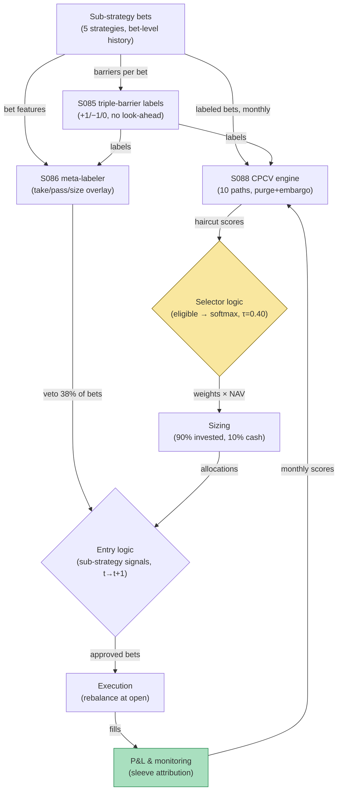

## Stage 187/200 — T087: Purged-CV Strategy Selector

*Batch TB9 · Strategy 87/100 · Signals S088, S086, S085 · Provenance [D]*

### T1. One-line verdict

| | |
|---|---|
| **Style** | Meta-strategy: allocate capital across sub-strategies by purged cross-validated skill, not backtest Sharpe |
| **Edge source** | Naive backtests overstate skill through look-ahead leakage and multiple testing (Bailey et al. 2017): purged/embargoed cross-validation (S088) with a haircut score selects the strategies whose edge survives honest validation; meta-labeling (S086) then sizes only the best bets |
| **Typical holding period** | Inherits the winners' horizons — the selector itself rebalances monthly (`example`) |
| **Capacity hint** | $1M sleeve (`example`); the selector adds no capacity beyond its components |
| **Build-or-buy in one line** | Build: the CPCV harness is the moat — no vendor sells your strategies' honest scores |

### T2. Full mechanics

**Universe & session.** A fixed menu of 5 in-house sub-strategies (`example`): S1 scalp, S2 breakout, S3 reversal, S4 news, S5 vol. Monthly selection (`example`); daily meta-label overlay.

**Purged cross-validation (S088).** Standard k-fold CV leaks in finance because labels overlap in time (a 5-day label at *t* shares 4 days with the label at *t+1*) and because training data adjacent to test data shares information. **Purging** drops training labels whose windows overlap any test label; the **embargo** drops a further buffer after each test block. **Combinatorial purged CV (CPCV)** runs many train/test splits and collects out-of-sample performance paths. Here: 10 CPCV paths (`example`) per sub-strategy, each path scored by the **Probabilistic Sharpe Ratio (PSR)** — the probability the true Sharpe exceeds zero (or a benchmark), which accounts for skew, kurtosis, and sample length.

**PSR vs Sharpe — why the haircut uses PSR.** The ordinary Sharpe ratio is a point estimate with no uncertainty attached; a Sharpe of 1.5 on 40 trades is statistically meaningless, while the same Sharpe on 4,000 trades is strong evidence. The Probabilistic Sharpe Ratio folds in sample length, skew, and kurtosis to answer the right question: *what is the probability the true Sharpe exceeds the benchmark?* The haircut score then takes the median PSR across CPCV paths (typical skill) minus half the IQR (instability penalty). A strategy with median PSR 0.95 and IQR 0.10 scores 0.90 — genuinely skilled and stable; one with median 0.95 and IQR 1.20 scores 0.35 — the same headline skill, but the paths disagree violently, so it gets a fraction of the capital. That distinction is invisible to plain Sharpe ranking.

**Haircut score.** For strategy *i*: `score_i = median_j(PSR_j) − 0.5·IQR_j(PSR_j)` (`example`). The median rewards typical skill; subtracting half the interquartile range penalizes instability across paths. Negative score → **ineligible** (S4's −0.30 excludes it outright). This is the multiple-testing haircut made operational: a strategy must be good *and* consistently good across leakage-free splits.

**Softmax allocation.** Eligible scores go through a softmax with temperature τ = 0.40 (`example`): `w_i ∝ exp(score_i/τ)`, scaled to 90% of NAV with a 10% cash sleeve (`example`). Low temperature concentrates on the winner; the cash sleeve bounds model risk.

**Meta-label overlay (S086).** *Meta-labeling* trains a secondary model on the primary strategy's *bets* (not on prices): given the primary fired, will this bet make money? It acts as a take/pass/size overlay — it never initiates trades. Here the meta-labeler vetoes an estimated 38% of the selected strategies' bets (`example`), keeping 62%.

**Triple-barrier labels (S085).** The training labels for both layers use the **triple-barrier method**: each bet gets a profit-taking barrier, a stop-loss barrier, and a vertical (time) barrier — the first touched determines the label (+1/−1/0). S085 is a *labeling* method, not a signal; it defines what "correct" means without look-ahead.

**Entry rule.** The selector allocates; entries are the sub-strategies' own signals, each still obeying signal-at-*t* → earliest-fill-*t+1*. The selector's monthly rebalance trades at the next open after the CPCV recompute.

**Exit rule.** Monthly de-selection: a strategy whose haircut score turns negative is cut to zero at the next rebalance; the meta-label veto applies per bet.

**Position sizing.** Softmax weights × $1M NAV (`example`); per-strategy cap 70% (`example`).

**Risk limits.** Sleeve daily loss stop −3% (`example`); if 3+ strategies go ineligible in one month, halve the sleeve (regime break) (`example`).

**Cost model.** Sub-strategies' own costs plus 5 bps/month rebalance drag (`example`).

**Order/execution sketch.** Rebalance via market-on-close; meta-label vetoes are applied before order generation (a vetoed bet never becomes an order).

**Worked intuition — a tiny numerical sketch.** S1's haircut score of 1.40 means its median PSR across 10 leakage-free paths is high *and* its IQR is tight — say median PSR 1.70 with IQR 0.60, giving 1.70 − 0.30 = 1.40. S4's −0.30 means something like median 0.10 with IQR 0.80: barely positive on average and wildly unstable across splits — exactly the profile the PBO literature warns about, and the softmax correctly gives it zero. The temperature τ = 0.40 is doing quiet work: at τ = 1.0 the weights would be nearly equal (the scores differ by ~1, exp(1) ≈ 2.7× spread); at τ = 0.40 the exp(1/0.4) ≈ 12× spread concentrates 63% on S1. Temperature is a concentration dial, and 0.40 is an aggressive setting — which is why the 70% per-strategy cap exists.

**Parameter robustness.** The `example` parameters (10 CPCV paths, 0.5·IQR penalty, τ = 0.40, 10% cash) are starting points. Sensitivity protocol: re-run with 6/10/16 paths, IQR penalties of 0.25/0.5/1.0, and τ ∈ {0.25, 0.40, 0.70}; the eligible set {S1, S2, S3, S5} should be stable across at least 7 of 12 combinations, and S4 should remain excluded in all of them. If S3 (score 0.20) flickers in and out, that flicker is information: size it at half weight or drop it — marginal eligibility is not eligibility.

### T3. Signals it consumes

| Signal | Role | Weight / logic |
|---|---|---|
| S088 (purged/embargoed CV) | Selector | 10 CPCV paths (`example`); PSR per path; haircut score; negative → ineligible |
| S086 (meta-labeling) | Bet filter | take/pass overlay on selected strategies' bets; keeps 62% (`example`) |
| S085 (triple-barrier labels) | Labeling | defines ±1/0 labels for both layers; barriers set per strategy (`example`) |

Pseudocode (≤25 lines):
```
monthly:
    for s in [S1..S5]:
        psrs = [PSR(path) for path in CPCV(s, 10 paths, purged+embargo)]  # S088
        score[s] = median(psrs) - 0.5*IQR(psrs)                           # example haircut
    elig = {s: score[s] for s in scores if score[s] >= 0}
    w = softmax(score[elig]/0.40) * 0.90                                  # example tau, cash
    allocate(w * NAV)                                                     # rebalance at next open
daily per bet b from an eligible strategy:
    label = triple_barrier(b)                                             # S085 (training)
    if meta_model(b.features) < 0.5: veto(b)                             # S086, example cut
    else: size(b) * meta_confidence(b)
```

### T4. Worked example — numbers + P&L (SYNTHETIC)

$1M NAV sleeve, seed 187. CPCV haircut scores (synthetic): S1 **1.40**, S2 **0.85**, S3 **0.20**, S4 **−0.30** (excluded), S5 **0.55**.

Softmax (τ = 0.40): exp(score/τ) = [33.12, 8.37, 1.65, —, 3.96], sum 47.09 → raw weights [70.32%, 17.78%, 3.50%, —, 8.41%] → final (90% invested): **[63.29%, 16.00%, 3.15%, 0%, 7.56%]**, cash 10%.

| Sleeve | Weight | Notional |
|---|---|---|
| S1 scalp | 63.29% | $632,885 |
| S2 breakout | 16.00% | $160,018 |
| S3 reversal | 3.15% | $31,509 |
| S4 news | 0% (excluded) | $0 |
| S5 vol | 7.56% | $75,587 |
| Cash | 10% | $100,000 |

Meta-label overlay on the selected strategies' bets (synthetic week): precision improves **0.46 → 0.58**, keeping **62%** of bets. Illustrative next-week sleeve outcome (synthetic returns S1 +1.2%, S2 −0.4%, S3 +2.1%, S5 +0.6%, weighted, net of the cash drag): **+$8,069.77 ≈ +$8,070**.

**Session net: +$8,070 on the $1M sleeve for the illustrative week (synthetic; demonstrates the allocation arithmetic, not forward alpha or after-cost profitability).**

**Where the example is optimistic.** The haircut scores are assumed; real CPCV on 5 strategies × 10 paths is compute-heavy and the PSR estimates have wide confidence bands — S3's 0.20 could easily be noise. The meta-label precision gain (0.46 → 0.58) is asserted, not measured. The weekly returns are illustrative weights math, not a backtest. Softmax concentration (63% in S1) is itself a risk the example doesn't penalize.

### T5. Data & infra — what must run

Each sub-strategy's full bet history with features (for the meta-labeler), triple-barrier labels, and the CPCV harness. Monthly loop: recompute 10 CPCV paths per strategy (the heavy job — embargo-aware splitting over the full history), refit the meta-labeler. Daily: score incoming bets. Storage: bet-level history is small (MBs); the CPCV paths dominate compute. M5 Max feasibility: 50 CPCV path-fits monthly is a batch job of hours on one machine (see `notes/cost-model.md` for Python throughput baselines); daily meta-label scoring is trivial. Feed-drop failure plan: if a sub-strategy's bet feed stalls, freeze its weight (don't reallocate on missing data) and let the meta-labeler veto-by-default (fail closed: no score → no bet).

**Calibration discipline.** The CPCV paths use purged training sets with a 5-day embargo between estimation and trading windows (`example`); the meta-labeler is trained on triple-barrier labels computed *only* from data available at bet time. The monthly recompute must finish before the rebalance open — a late CPCV run means trading on last month's weights, which must be logged as a staleness event, not silently accepted. Throughput: 50 path-fits is the monthly batch (hours on the M5 Max per `notes/cost-model.md`); daily meta-label scoring is milliseconds per bet.

### T6. Buy vs build

**Build the harness; rent the compute if needed.** CPCV/PSR/PBO are textbook (Bailey et al.; AFML) — **QuantConnect** (~$60–$300/mo class, `indicative — verify before budgeting`) hosts the research; a cloud batch box for the monthly CPCV run (~$200–$500/mo class when used, `indicative — verify before budgeting`) beats blocking the local machine; **Interactive Brokers paper trading** (no incremental platform fee on an existing account, `indicative — verify before budgeting`) for the sleeve paper-trade. Verdict: **build** — the selector's value is entirely in honest validation of *your* strategies; nothing off the shelf does that.

### T7. Success-ratio evidence

Published, checkable sources only:

1. Bailey et al. (2017), "The Probability of Backtest Overfitting": quantifies how multiple testing inflates backtest Sharpe — the reason the haircut score exists. (https://www.davidhbailey.com/dhbpapers/backtest-prob.pdf)
2. López de Prado (2018), *Advances in Financial Machine Learning*, ch. 7: purge, embargo, and CPCV for financial cross-validation; ch. 3 (§3.6) for meta-labeling. (https://www.wiley.com/go/advancedmachinelearningfinance)
3. Bailey et al. record at https://scholarworks.wmich.edu/math_pubs/42/ — institutional repository record for the PBO paper (checkable identifier).

No published paper validates this exact selector; the evidence supports the *validation methodology*, not the allocation's profitability.

### T8. Failure modes

- **CPCV overfitting.** With only 10 paths, the haircut score itself is noisy — selecting on noise. Mitigation: the 0.5·IQR penalty and the 70% per-strategy cap.
- **Meta-labeler overfit.** A secondary model trained on the primary's bets can memorize regimes. Mitigation: the meta-labeler gets its own purged CV; veto-by-default on stall.
- **Strategy correlation.** S1–S5 may all load the same risk factor; the softmax then concentrates factor risk. Mitigation: penalize pairwise bet-correlation in the score (not implemented in the example — a known gap).
- **Rebalance drag.** Monthly turnover at 5 bps/month compounds. Mitigation: rebalance only when weights move >10 pp (`example`).
- **Regime break.** All five strategies can go ineligible together. Mitigation: the halve-the-sleeve rule.

**Bottom line for the two operators.** For the ≤$1M paper operation, the selector is the single highest-ROI infrastructure in this batch: it costs nothing but compute and it prevents the #1 small-account killer — trading a backtest mirage. For the institutional desk, purged selection is baseline governance; the differentiator is the *menu* of sub-strategies, not the selection math.

**Two more failure modes.**

- **PSR benchmark gaming.** PSR against a zero benchmark flatters low-volatility strategies; a strategy with Sharpe 0.3 and tiny volatility can outscore a Sharpe 1.0 strategy on PSR. Mitigation: benchmark PSR against the current sleeve's Sharpe (`example`), not zero.
- **Silent strategy death.** A deselected strategy's code rots; when it becomes eligible again months later, its data connectors are broken. Mitigation: every menu strategy paper-trades continuously at minimum size (`example`: 1 share) so eligibility is always actionable.

### T9. Visuals


*Chart caption: synthetic data — not market data. Watermark reads "SYNTHETIC EXAMPLE" exactly.*



### T10. Sources

1. López de Prado, M. (2018). *Advances in Financial Machine Learning*. Wiley. https://www.wiley.com/go/advancedmachinelearningfinance — ch. 7 (purge/embargo/CPCV), ch. 3 §3.6 (meta-labeling).
2. Bailey, D. H., Borwein, J., López de Prado, M. & Zhu, Q. J. (2017). "The Probability of Backtest Overfitting." *Journal of Computational Finance* 20(4). https://www.davidhbailey.com/dhbpapers/backtest-prob.pdf — multiple-testing inflation of backtest Sharpe.
3. Same paper, institutional record: https://scholarworks.wmich.edu/math_pubs/42/ — checkable repository identifier.

**Unverified leads** (not confirmed facts — verify before use):
- The haircut-score formula (median − 0.5·IQR) and τ = 0.40 are example parameters from the batch design, not published recommendations.
- The meta-label precision gain (0.46 → 0.58) is a synthetic illustration.

*Source log: Grok answered Q-TB9-1..3 (2026-09-10); all claims independently verified or labeled unverified.*
