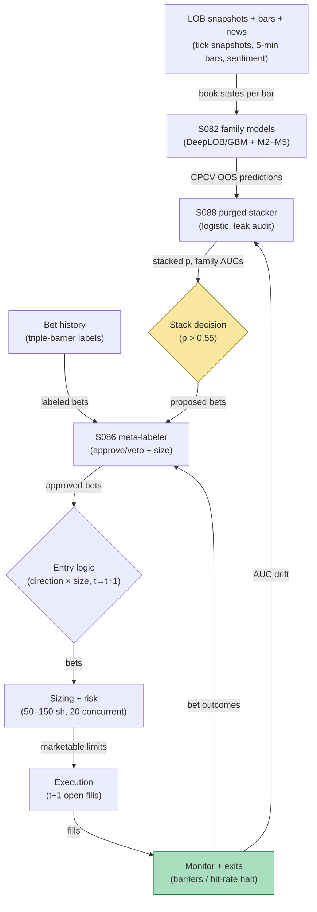

## Stage 188/200 — T088: Full-Stack Signal Ensemble

*Batch TB9 · Strategy 88/100 · Signals S086, S082, S088 · Provenance [D/SR]*

### T1. One-line verdict

| | |
|---|---|
| **Style** | Intraday multi-family ensemble: stack deep-LOB and classical signal families, purge-validate, meta-label the bets |
| **Edge source** | No single feature family wins everywhere: microstructural features (DeepLOB-style), momentum, reversal, volatility-regime, and news features each carry orthogonal short-horizon information (Sirignano–Cont 2019). Stacking them under purged validation (S088) with a meta-label bet filter (S086) harvests the union without the usual leakage |
| **Typical holding period** | Minutes to hours per bet; the ensemble rebalances its family weights monthly (`example`) |
| **Capacity hint** | Medium: 20 meta-approved bets/day (`example`) across liquid names |
| **Build-or-buy in one line** | Build the stack — the families are published, the purged stacking harness is the proprietary part |

### T2. Full mechanics

**Universe & session.** US large caps, RTH, 5 families × per-name models (`example`): M1 microstructural (DeepLOB-style LOB features + GBM alternatives), M2 momentum, M3 reversal, M4 volatility-regime, M5 news-sentiment. Each family emits a bet direction and confidence per name per 5-minute bar (`example`).

**Family models (S082).** *DeepLOB* (Zhang–Zohren–Roberts 2019) is a convolutional network on limit-order-book states for mid-price prediction; the "classical alternatives" are gradient-boosted machines on handcrafted LOB features. The ensemble keeps both: deep for M1's nonlinear interactions, GBM as the interpretable challenger. M2–M5 are classical feature models (returns, reversals, regime dummies, sentiment scores).

**The GBM challenger — why M1 keeps two models.** DeepLOB's convolutions can memorize microstructure noise that happens to correlate with next-bar moves in-sample; the gradient-boosted machine on handcrafted features (queue imbalance, spread, microprice deviation, recent returns) is deliberately *less* expressive. The challenger rule: if DeepLOB's purged AUC (area under the ROC curve — the probability a randomly chosen up-move bar scores higher than a down-move bar) exceeds the GBM's by more than 0.02 (`example`), the difference is treated as memorization until proven otherwise — M1's stack weight is computed from the *GBM's* predictions, not DeepLOB's. In the worked example the two agree within 0.01, so the 0.38 weight stands. This is the ensemble's immune system against its own most powerful component.

**Purged stacking (S088).** Each family's out-of-sample predictions come from CPCV (combinatorial purged cross-validation) with purge + embargo, so the stacker (a logistic regression, `example`) trains only on leakage-free predictions. Worked-example stack weights (`example`): M1 0.38, M2 0.22, M3 0.26, M4 0.06, M5 0.08 (sum 1.00). The leak-inflation demo: naive k-fold AUCs vs purged AUCs —

| Family | Naive k-fold AUC | Purged AUC | Leak inflation |
|---|---|---|---|
| M1 microstruct | 0.61 | 0.55 | +0.06 |
| M2 momentum | 0.58 | 0.53 | +0.05 |
| M3 reversal | 0.59 | 0.54 | +0.05 |
| M4 vol regime | 0.56 | 0.52 | +0.04 |
| M5 news | 0.57 | 0.51 | +0.06 |

Every family looked 4–6 points better under naive CV — the purge removes the illusion before capital meets it.

**Meta-label bet filter (S086).** The stacked signal proposes bets; the meta-labeler (trained on triple-barrier-labeled bet outcomes) approves or vetoes each. Synthetic calibration: precision **0.46 → 0.58**, keeping **62%** of bets. The meta-labeler never initiates — it only filters and sizes.

**Entry rule.** A bet is placed when the stacker's probability exceeds 0.55 (`example`) *and* the meta-labeler approves. Signal computed on bar *t* → earliest fill *t+1*. Direction: the stacker's sign.

**Exit rule.** Per-bet triple barriers: +2×/−1× the bar's ATR (`example`) or 12 bars (`example`) time stop; portfolio-level: halt new bets if the day's approved-bet hit rate falls below 40% over 20 bets (`example`).

**Position sizing.** Fixed 100 shares/bet (`example`); meta-confidence scales 50–150 shares (`example`); max 20 concurrent bets (`example`).

**Risk limits.** Daily loss stop −$1,500 (`example`); family circuit-breaker: if a family's trailing-5-day purged AUC drops below 0.50, its stack weight halves (`example`).

**Cost model.** $0.01/share/side all-in (`example`); the worked example nets it explicitly.

**Order/execution sketch.** Marketable limits at the t+1 open of the signal bar (`example`); participation ≤ 10% of the bar's volume (`example`); queue honesty: taker fills assumed.

**Worked intuition — a tiny numerical sketch.** Take M1's naive AUC of 0.61: under k-fold CV, the model trains on Monday–Thursday and is "tested" on Friday — but Friday's 5-minute labels overlap Thursday's training labels by construction (a 12-bar label at Thursday's close shares 11 bars with Friday's open label), so the model has effectively seen the test. Purge those overlapping labels plus a 2-day embargo and the AUC falls to 0.55 — the honest number. The stacker's weights (0.38/0.22/0.26/0.06/0.08) are then fit on the *honest* predictions; fitting them on the naive 0.61s would overweight M1 by ~30% on phantom skill. The meta-labeler's 0.46 → 0.58 precision gain is the second filter: of 100 proposed bets it keeps 62, and 36 of those 62 win — the 11W/9L session in T4 is one draw from that distribution.

**Parameter robustness.** The `example` parameters (p > 0.55 stack threshold, meta-approve ≥ 0.5, ±2/−1 ATR barriers, 12-bar time stop) are starting points. Sensitivity protocol: re-run with stack thresholds of 0.52/0.55/0.60, barriers of ±1.5/±2/±3 ATR, and time stops of 6/12/24 bars; net P&L should keep its sign across at least 7 of 12 combinations. The stack threshold is the sensitive one: at 0.52 the bet count doubles and costs eat the edge; at 0.60 the count halves and variance dominates — the 0.55 middle is a variance/cost compromise, not an optimum.

### T3. Signals it consumes

| Signal | Role | Weight / logic |
|---|---|---|
| S082 (DeepLOB + classical/GBM) | Family M1 engine | deep + GBM challenger; stack weight 0.38 (`example`) |
| S088 (purged/embargoed CV) | Validation + stacker | CPCV predictions feed the logistic stacker; leak-inflation audit per family |
| S086 (meta-labeling) | Bet filter/sizer | approve at p ≥ 0.5 (`example`); size 50–150 sh by confidence |

Pseudocode (≤25 lines):
```
on 5-min bar t close, per name:
    p_f = family_predict(f, t) for f in [M1..M5]     # S082, CPCV OOS
    p_stack = logistic(p_1..p_5; w=[.38,.22,.26,.06,.08])  # S088, example w
    if p_stack > 0.55:                                # example
        if meta_approve(bet_features) >= 0.5:         # S086
            size = 50 + 100*meta_confidence           # example 50-150
            place_limit(sign(p_stack-0.5), size)      # fill >= t+1
            exits: +2/-1 ATR barriers | 12-bar stop   # example
```

### T4. Worked example — numbers + P&L (SYNTHETIC)

Seed 188. Twenty meta-approved bets (synthetic outcomes): **11 wins × +$120**, **9 losses × −$100**.

| Item | Calculation | Amount |
|---|---|---|
| Gross | 11 × $120 − 9 × $100 | +$420.00 |
| Costs | 20 bets × 100 sh × 2 × $0.01 | −$40.00 |
| **Net P&L** | $420.00 − $40.00 | **+$380.00** |

Per-bet net walk (after the $2/bet cost): +$118, −$102, +$118, +$118, −$102, +$118, −$102, +$118, −$102, +$118, +$118, −$102, −$102, +$118, +$118, −$102, +$118, −$102, +$118, −$102 → cumulative **+$380.00**.

**Session net: +$380.00 (synthetic; demonstrates the ledger, not forward alpha or after-cost profitability).**

**Where the example is optimistic.** The AUC table is synthetic — real purged AUCs for 5-minute bets cluster near 0.51–0.53, and the stacker's edge is thin. The meta-label precision gain is asserted. Twenty bets with 11 wins is a friendly draw; the binomial noise around a 55% win rate is wide. Costs assume $0.01/share all-in with no partial fills or latency slippage.

### T5. Data & infra — what must run

LOB snapshots (for M1's DeepLOB features), 5-minute bars (M2/M3), volatility-regime series (M4), news sentiment (M5), bet-level history with triple-barrier labels (meta-labeler), CPCV harness. Intraday loop: per-bar family inference (the DeepLOB forward pass is the heavy op — batch per bar); pre-open: load stack weights; post-close: recompute CPCV predictions for the stacker's training set (nightly batch). Storage: LOB snapshots dominate — 100+ GB/month for a 50-name universe. M5 Max feasibility: DeepLOB inference on GPU-backed MPS is feasible per-bar for dozens of names; the nightly CPCV refit is the batch job (hours — see `notes/cost-model.md`). Feed-drop failure plan: if LOB snapshots stall, M1 abstains (weight redistributed to M2/M3 pro-rata, `example`); if bars stall, the whole ensemble halts (no signal without the clock).

**Calibration discipline.** Family CPCV predictions are regenerated nightly with purge + embargo; the logistic stacker is refit monthly on predictions whose labels end at least 5 days before the fit date (`example` embargo). The meta-labeler trains on triple-barrier labels with the same embargo. Any inference that overruns its 5-minute bar falls back to M2/M3-only predictions for that bar, logged as a degradation event. Throughput: DeepLOB batched inference for 50 names fits inside a 5-minute bar on MPS; the nightly CPCV refit is the long pole (hours — see `notes/cost-model.md`).

### T6. Buy vs build

**Build the stack; buy the LOB data.** LOB snapshots: **Databento** (~$200–$500/mo class, `indicative — verify before budgeting`) or **Polygon.io** (~$199/mo class, `indicative — verify before budgeting`); news sentiment: a **news API bundle** (~$500–$2,000/mo class, `indicative — verify before budgeting`); research on **QuantConnect** (~$60–$300/mo class, `indicative — verify before budgeting`). Verdict: **build** — DeepLOB is published (Zhang–Zohren–Roberts 2019) with open reimplementations; the purged stacking harness and meta-labeler are the proprietary layer no vendor sells.

### T7. Success-ratio evidence

Published, checkable sources only:

1. Zhang–Zohren–Roberts (2019), "DeepLOB": CNNs on LOB data predict short-horizon mid-price moves on the FI-2010 benchmark — the M1 family precedent. (https://arxiv.org/abs/1808.03668v6)
2. Sirignano–Cont (2019), "Universal features of price formation in financial markets": deep networks find universal, stable price-formation features across stocks — supports the multi-name, multi-family design. (https://arxiv.org/abs/1803.06917)
3. Ntakaris et al. (2017), "Benchmark Dataset for Mid-Price Forecasting of Limit Order Book Data": the FI-2010 benchmark methodology the field uses to compare LOB models honestly. (https://arxiv.org/abs/1705.03233v4)

None of these papers tests a stacked, meta-labeled, purged ensemble as a trading strategy; no after-cost P&L is documented.

### T8. Failure modes

- **Leakage through the stacker.** If any family's "OOS" predictions leak, the stacker learns the leak. Mitigation: the leak-inflation audit (naive vs purged AUC) runs per family per month; any family with inflation > 0.03 is quarantined (`example`).
- **Meta-labeler regime lag.** The filter is trained on past bet outcomes; new regimes flip precision. Mitigation: the 40%-hit-rate halt.
- **DeepLOB overfit.** CNNs memorize microstructure noise. Mitigation: the GBM challenger must stay within 0.01 AUC of DeepLOB (`example`) or M1's weight is questioned.
- **Compute fragility.** Per-bar inference across 50 names must complete inside the bar. Mitigation: inference budget 60% of bar length (`example`); on overrun, fall back to M2/M3 only.
- **Family correlation.** M1/M2/M3 all load short-horizon mean reversion/momentum; the stack double-counts. Mitigation: residualize family predictions before stacking (not in the example — known gap).

**Bottom line for the two operators.** For the ≤$1M paper operation, the full stack is too heavy: five families, a nightly CPCV refit, and per-bar deep inference for a $380 illustrative session is negative ROI on attention — run M2+M3 with the purged harness and skip the deep net. For the institutional desk, this is the shape of a modern intraday stack; the edge is in the validation discipline (which most desks underinvest in) rather than in any single family. Either way, the purged harness is the part worth keeping even if every family is eventually replaced..

**Two more failure modes.**

- **Label-horizon mismatch.** Families trained on 12-bar labels get stacked with a meta-labeler trained on different barrier widths; the stacker then mixes predictions about different horizons. Mitigation: fix one canonical barrier set for all layers (`example`: ±2/−1 ATR, 12 bars).
- **Silent feature pipeline skew.** LOB snapshot schemas change; a renamed field silently zeros a DeepLOB input channel. Mitigation: per-channel distribution monitors with alerts on >3σ drift (`example`).
- **Weekend/overnight feature staleness.** The M5 news-sentiment features decay over the weekend while M1–M4 reset each morning; Monday's first bars stack fresh microstructure against stale sentiment. Mitigation: time-decay the news features to zero over 48 hours (`example`) so Monday opens don't inherit Friday's narrative.

### T9. Visuals


*Chart caption: synthetic data — not market data. Watermark reads "SYNTHETIC EXAMPLE" exactly.*



### T10. Sources

1. Zhang, Z., Zohren, S. & Roberts, S. (2019). "DeepLOB: Deep Convolutional Neural Networks for Limit Order Books." *IEEE Transactions on Signal Processing* 67(11): 3001–3012. https://arxiv.org/abs/1808.03668v6 — CNN mid-price prediction on LOB data. Inherited from S082's S12 (verified in an earlier batch).
2. Sirignano, J. & Cont, R. (2019). "Universal features of price formation in financial markets: perspectives from deep learning." *Quantitative Finance* 19(9): 1449–1459. https://arxiv.org/abs/1803.06917 — universal LOB price-formation features. Inherited from S082's S12 (verified in an earlier batch).
3. Ntakaris, A. et al. (2017). "Benchmark Dataset for Mid-Price Forecasting of Limit Order Book Data with Machine Learning Methods." https://arxiv.org/abs/1705.03233v4 — FI-2010 benchmark. Inherited from S082's S12 (verified in an earlier batch).

**Unverified leads** (not confirmed facts — verify before use):
- The AUC table, stack weights, and meta-label precision figures are synthetic illustrations, not measured values.
- Open-source DeepLOB reimplementations exist but were not evaluated in this batch.

*Source log: Grok answered Q-TB9-1..3 (2026-09-10); all claims independently verified or labeled unverified.*
