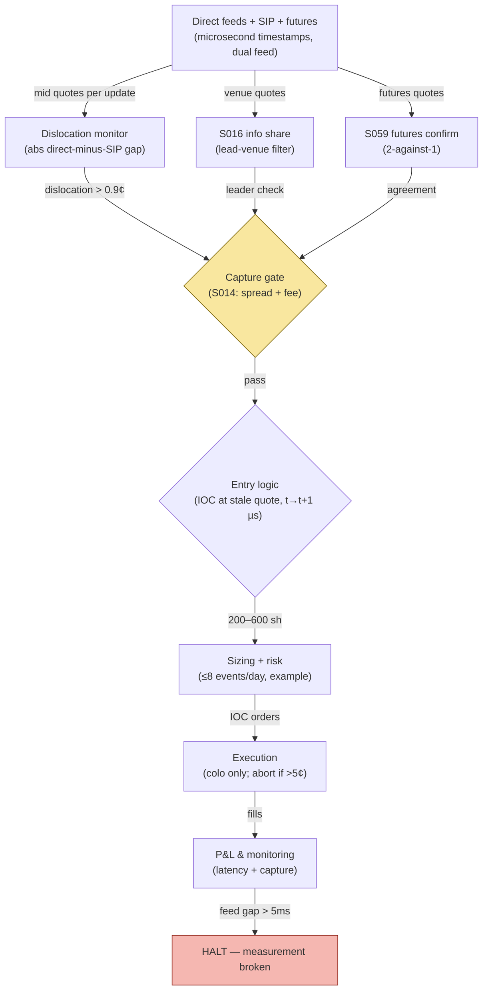

## Stage 189/200 — T089: Quote-Matcher (SIP-vs-Direct)

*Batch TB9 · Strategy 89/100 · Signals S016, S059, S014 · Provenance [D]*

### T1. One-line verdict

| | |
|---|---|
| **Style** | Latency arbitrage: trade dislocations between the SIP quote and direct-feed quotes |
| **Edge source** | The consolidated SIP feed lags direct exchange feeds by ~1–2 ms in active names (Ding–Hanna–Hendershott 2014): when the direct mid moves and the SIP quote hasn't caught up, the stale quote is tradable — for whoever sees both feeds first |
| **Typical holding period** | Milliseconds to seconds per dislocation |
| **Capacity hint** | Tiny: 200–600 shares per event (`example`); dislocations are small and fleeting |
| **Build-or-buy in one line** | Neither, remotely — **quote matching without co-location and direct feeds is infeasible in production; all SIP-derived routing results in this chapter are simulated-only** |

### T2. Full mechanics

**Universe & session.** Very active US large caps (the example: fictional "LGX" at $200.00), RTH. The strategy watches one dislocation metric: `dislocation = |direct_mid − SIP_mid|`.

**Lead-lag filter (S059).** *Futures lead cash*: index futures prices lead stale cash-market quotes (Chan 1992). The filter uses the futures-implied fair value as a third reference: a dislocation counts only if the direct feed *and* the futures-implied value agree the SIP quote is stale (two-against-one, `example`). This cuts false positives from direct-feed flicker.

**Venue leadership (S016).** Information share identifies *which* venue's direct quote leads price discovery; the strategy only trades dislocations where the leading venue's quote is the fresh one — trading a follower venue's stale quote against the SIP is picking up pennies in front of adverse selection.

**Capture gate (S014).** Trade only if `dislocation > effective half-spread + take fee` (`example`). With a 0.6¢ half-spread and 0.3¢ take fee, the gate is **0.9¢**: smaller dislocations are unprofitable after costs by construction.

**Entry rule.** Dislocation detected at time *t* (both feeds compared) → earliest fill *t+1* — where *t+1* is microseconds later in production. Direction: buy the lagging quote if it's the ask side that's stale (price moved up), sell the lagging bid if the price moved down.

**Why IOC and not limits.** An *immediate-or-cancel* order sweeps the stale quote and cancels any unfilled remainder — it never rests. A limit order left resting at the stale price is strictly worse: if the dislocation was real, the IOC already captured it; if the quote updates against you mid-flight, the resting limit becomes the stale quote *you* are now offering to the faster desks. The IOC's fill-or-kill semantics are the strategy's risk control: maximum exposure is one event's size for a few hundred microseconds. The cost is the take fee on every fill — there is no maker-rebate version of this trade, which is why the 0.9¢ gate prices the fee in before the decision, not after.

**Exit rule.** Immediate: the position is held only for the dislocation's life (typically 1–2 ms); exit at the converged quote. Stop: if the dislocation widens beyond 5¢ (`example`), it's news, not staleness — abort.

**Position sizing.** 200–600 shares per event (`example`); max 8 events/day/name (`example`).

**Risk limits.** Daily loss stop −$300 (`example`); halt if the SIP/direct latency monitor shows the feed gap exceeding 5 ms (`example`) — the measurement itself is broken.

**Cost model.** Take fee 0.3¢/share (`example`); half-spread 0.6¢ (`example`); no rebate (taker).

**Order/execution sketch.** IOC (immediate-or-cancel) marketable orders on the stale quote; the entire premise is speed — a limit order is a donation.

**Binding production constraint.** Dislocations last ~1–2 ms. Acting on them requires seeing the direct feed *before* the SIP updates and reaching the matching engine in microseconds: co-located servers and direct feeds are mandatory. **A remote server on the SIP feed cannot observe a dislocation in time to trade it — quote matching without co-location and direct feeds is infeasible in production; every number in this chapter is simulated-only.**

**Worked intuition — a tiny numerical sketch.** Event 4: the direct mid jumps to $200.034 while the SIP still shows $200.00 — a 3.4¢ dislocation. The gate needs 0.9¢ (0.6¢ half-spread + 0.3¢ fee), so 2.5¢/share is capturable: 400 shares × 2.5¢ = $10.00, the session's best event. Event 5 shows the gate's discipline: 1.0¢ dislocation minus 0.9¢ costs = 0.1¢/share × 300 = $0.30 — tradable but barely; a 0.05¢ fee misestimate turns it negative. Events 3 and 6 (0.7¢, 0.5¢) fail the gate outright — more than half the session's *events* are untradable, which is the honest shape of latency arbitrage: a handful of small wins, constant filtering, and zero tolerance for cost optimism.

**Parameter robustness.** The `example` parameters (0.9¢ gate, 200–600 share sizes, 8 events/day, 5¢ abort) are starting points — and mostly moot remotely, since the binding constraint is colo. Sensitivity protocol (for the colo operator): re-run with gates of 0.7/0.9/1.2¢ and sizes of 100/400/800 shares; net capture should stay positive across 7 of 9 combinations. The gate is load-bearing: at 0.7¢ the two skipped events become marginal trades and fee-tier reality decides the sign — which is why the gate must be set from the operator's *measured* fees, not a headline schedule.

### T3. Signals it consumes

| Signal | Role | Weight / logic |
|---|---|---|
| S016 (information share) | Lead-venue filter | trade only dislocations led by the highest-IS venue (`example` rule) |
| S059 (futures lead) | Confirmation | require futures-implied value to agree with the direct feed (2-against-1, `example`) |
| S014 (spread decomposition) | Capture gate | require dislocation > 0.6¢ half-spread + 0.3¢ fee = 0.9¢ (`example`) |

Pseudocode (≤25 lines):
```
on every quote update at time t (microsecond clock):
    dis = abs(direct_mid - sip_mid)                       # cents
    if dis > 0.9:                                         # S014 gate, example
        leader = argmax(info_share)                       # S016
        if direct_venue == leader and futures_agrees():   # S059 2-against-1
            side = BUY if sip_ask stale-low else SELL
            send_IOC(side, 200-600 shares)                # fill >= t+1 (µs)
            exit at converged quote; abort if dis > 5.0  # example
```

### T4. Worked example — numbers + P&L (SYNTHETIC, SIMULATED-ONLY)

Fictional "LGX" at $200.00, seed 189. Eight dislocation events; gate 0.9¢; net capture per traded event = (dislocation − 0.9¢) × shares.

| Event | Dislocation | Shares | Traded? | Net capture |
|---|---|---|---|---|
| 1 | 1.2¢ | 300 | yes | (1.2−0.9)¢ × 300 = **$0.90** |
| 2 | 2.1¢ | 500 | yes | (2.1−0.9)¢ × 500 = **$6.00** |
| 3 | 0.7¢ | 200 | no (below gate) | $0.00 |
| 4 | 3.4¢ | 400 | yes | (3.4−0.9)¢ × 400 = **$10.00** |
| 5 | 1.0¢ | 300 | yes | (1.0−0.9)¢ × 300 = **$0.30** |
| 6 | 0.5¢ | 500 | no (below gate) | $0.00 |
| 7 | 2.8¢ | 200 | yes | (2.8−0.9)¢ × 200 = **$3.80** |
| 8 | 1.6¢ | 600 | yes | (1.6−0.9)¢ × 600 = **$4.20** |
| **Total** | | **2,300** | **6 of 8** | **$25.20** |

**Session net: +$25.20 simulated capture on 2,300 shares (simulated-only).**

**Binding constraint restated.** The $25.20 assumes microsecond reaction to direct-feed quotes from a co-located server. **Quote matching without co-location and direct feeds is infeasible in production; all SIP-derived routing results here are simulated-only.** On a remote SIP feed, events 1–8 are unobservable in tradable time — the "strategy" would print exactly $0.00 and a latency bill.

**Where the example is optimistic.** The simulation assumes zero competition; real dislocations are contested by every co-located HFT desk and the winner is decided by nanoseconds. The futures-agreement filter is assumed perfect; real futures-implied values have their own staleness. Fees assume a flat 0.3¢ take fee; real schedules are tiered and venue-specific. Two of eight events already fail the gate — in production, most candidate dislocations fail or are phantom prints.

### T5. Data & infra — what must run

Direct exchange feeds *and* the SIP feed, timestamped to microseconds on a common clock; futures quotes for the S059 confirmation; a latency monitor comparing feed arrival times. Intraday loop: per-update dislocation check (the hot loop — nanoseconds matter); pre-open: calibrate the IS ranking and the latency baseline; post-close: reconcile simulated vs (colo) actual fills. Storage: full-depth dual-feed capture ≈ 200+ GB/month/name. M5 Max feasibility: **research simulation yes** (replay historical dual-feed data at ~100–500k events/sec per `notes/cost-model.md`); **production no** — this strategy cannot run on a remote workstation, full stop. Feed-drop failure plan: if either feed's latency exceeds 5 ms (`example`), halt immediately — trading a dislocation you can't see is just market-taking at random.

**Calibration discipline.** The IS ranking and the futures-implied fair value are computed on a rolling 30-minute window ending 1 minute before the trading second (embargo, `example`); the latency monitor's baseline is the trailing day's median feed gap. The simulation joins every event to the feed timestamps *as recorded*, never to a reconstructed "true" timeline — reconstructing the timeline from the slower feed is the look-ahead leak that makes simulated capture look achievable. Throughput: the per-update check is a handful of ops; the cost is dual-feed capture and storage (200+ GB/month/name).

### T6. Buy vs build

**Don't build this remotely — and don't buy it either.** The honest vendor section: co-location (thousands/mo per rack unit class, `indicative — verify before budgeting`), direct-feed licenses per venue (five figures/yr class, `indicative — verify before budgeting`), FPGA/precision-timing hardware (tens of thousands class, `indicative — verify before budgeting`). Research replay on **QuantConnect** (~$60–$300/mo class, `indicative — verify before budgeting`) or **Databento** (~$200–$500/mo class, `indicative — verify before budgeting`) for historical dual-feed data. Verdict: **for a ≤$1M paper operation, this strategy is a research exhibit, not a deployment candidate** — the simulated $25.20/session cannot be harvested without institutional latency infrastructure.

### T7. Success-ratio evidence

Published, checkable sources only:

1. Ding–Hanna–Hendershott (2014), "How Slow Is the NBBO?": direct measurement that the SIP NBBO lags direct feeds, with dislocations in very active stocks typically lasting 1–2 ms — the physical fact the strategy needs *and* the measurement that disqualifies remote SIP trading. (https://ideas.repec.org/a/bla/finrev/v49y2014i2p313-332.html)
2. Chan (1992), "A Further Analysis of the Lead-Lag Relationship between the Cash Market and Stock Index Futures Market": futures lead cash quotes — the S059 confirmation leg. (http://ideas.repec.org/a/oup/rfinst/v5y1992i1p123-52.html)
3. Hasbrouck (1995), "One Security, Many Markets": information-share methodology for identifying the leading venue. (https://www.bauer.uh.edu/rsusmel/phd/hasbrouck95.pdf)

No published paper documents after-cost profitability of SIP-vs-direct quote matching for a non-colocated trader — because the trade is definitionally unavailable to one.

### T8. Failure modes

- **Latency fantasy (the strategy).** The entire P&L assumes reaction inside the dislocation's 1–2 ms life. Mitigation: none remotely — this is a go/no-go on colo.
- **Phantom dislocations.** Feed timestamping errors create fake dislocations. Mitigation: the futures 2-against-1 confirmation and the 5 ms latency monitor.
- **Winner's curse.** If you *do* get filled, ask why the faster desks passed — possibly informed flow. Mitigation: the 5¢ widen-abort rule.
- **Fee-tier reality.** Real take fees exceed the modeled 0.3¢ at low volumes. Mitigation: model the operator's actual tier, not the headline rate.
- **Regulatory.** Quote-matching at scale invites order-to-trade scrutiny. Mitigation: keep the event count low (8/day/name, `example`) and document the economic rationale per trade.

**Bottom line for the two operators.** For the ≤$1M paper operation: do not deploy this. The simulated $25.20 is a physics demonstration of why the trade exists and why you can't have it — the chapter's value is inoculation against latency-arbitrage marketing, not a strategy. For the institutional desk with colo: quote-matching is a real, tiny, fully-competed sleeve — budget it as infrastructure yield (basis points on flow), not as alpha.

**Two more failure modes.**

- **Regulatory reclassification.** Persistent SIP-vs-direct arbitrage at scale can draw order-to-trade and "disruptive trading" scrutiny. Mitigation: cap events per day per name and keep per-trade economic rationale logs.
- **Feed-handler failover gaps.** Colo feed handlers fail over to backup lines with millisecond gaps; the strategy sees phantom dislocations during failover. Mitigation: halt on any feed-handler state change until the latency monitor re-baselines (`example`: 60 seconds).

### T9. Visuals


*Chart caption: synthetic data — not market data. Watermark reads "SYNTHETIC EXAMPLE" exactly. Additional banner: "SIMULATED ONLY — requires co-location + direct feeds".*



### T10. Sources

1. Ding, S., Hanna, J. & Hendershott, T. (2014). "How Slow Is the NBBO? A Comparison with Direct Exchange Feeds." *Financial Review* 49(2): 313–332. https://ideas.repec.org/a/bla/finrev/v49y2014i2p313-332.html — SIP lags direct feeds; ~1–2 ms dislocations. URL located and title confirmed via search 2026-09-10.
2. Chan, K. (1992). "A Further Analysis of the Lead-Lag Relationship between the Cash Market and Stock Index Futures Market." *Review of Financial Studies* 5(1): 123–152. http://ideas.repec.org/a/oup/rfinst/v5y1992i1p123-52.html — futures lead cash. Inherited from S059's S12 (verified in an earlier batch).
3. Hasbrouck, J. (1995). "One Security, Many Markets: Determining the Contributions to Price Discovery." *Journal of Finance* 50(4): 1175–1199. https://www.bauer.uh.edu/rsusmel/phd/hasbrouck95.pdf — information share. Inherited from S059's S12 (verified in an earlier batch).

**Unverified leads** (not confirmed facts — verify before use):
- The 1–2 ms dislocation figure is the paper's summary for very active stocks; the operator's symbols and colo footprint will differ — measure, don't assume.
- The per-event share sizes and the 0.9¢ gate are example parameters; real capture must be measured on the operator's own dual-feed capture.

*Source log: Grok answered Q-TB9-1..3 (2026-09-10); all claims independently verified or labeled unverified.*
