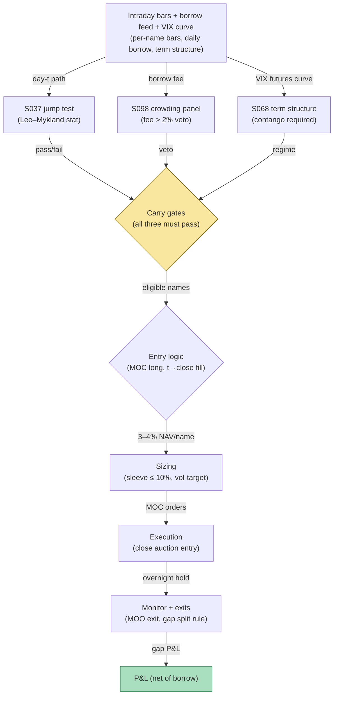

## Stage 190/200 — T090: Overnight Inventory Carry Manager

*Batch TB9 · Strategy 90/100 · Signals S037, S098, S068 · Provenance [D/SR]*

### T1. One-line verdict

| | |
|---|---|
| **Style** | Overnight gap carry: hold selected long positions through the close→open window, fading only non-jump gaps |
| **Edge source** | Overnight gaps partially revert when they contain no jump (no genuine news): the Lee–Mykland jump filter (S037) separates news gaps (don't fade) from noise gaps (fade). Borrow/crowding (S098) and the VIX term structure (S068) gate the carry |
| **Typical holding period** | One night: enter before the close, exit at/after the open |
| **Capacity hint** | $70k sleeve on $1M NAV (`example`); overnight gaps are capacity-thin |
| **Build-or-buy in one line** | Build the gate stack; the jump test is public — buy the borrow-rate feed, build the rest |

### T2. Full mechanics

**Universe & session.** US large caps, price ≥ $20 (`example`), optionable (for borrow visibility). Decision at 15:30–15:55 (`example`); positions held overnight; exits at the open auction or within the first 30 minutes (`example`).

**Jump filter (S037).** The Lee–Mykland **nonparametric jump test** detects whether the day's price path contained a genuine jump (news) vs diffusive noise. The rule *fades only non-jump gaps*: if the jump statistic exceeds the 1% critical value (6.63, `example`), the gap is news-driven and the name is excluded — fading news gaps is catching a falling knife with a thesis. In the example, BBB's jump stat of **9.4 > 6.63 → no carry**.

**Borrow/crowding gate (S098).** Short-interest and borrow-fee data proxy for crowding: if the borrow fee exceeds 2% annualized (`example`), the name is too crowded/expensive to carry — in the example CCC's **12.5% borrow fee → no carry**. S098 is a *panel*, not a standalone alpha: it vetoes, it doesn't select.

**VIX term-structure gate (S068).** The **VIX curve's slope and curvature** encode market stress expectations: carry only when the curve is in **contango** (slope > 0, `example`) — backwardation means the market is pricing near-term stress, and overnight gaps then skew adverse. In the example, EEE faces a slope of **−1.5 → no carry**.

**Carry selection.** A name is carried only if **all three gates pass**. Worked-example book (synthetic):

| Name | Jump stat | Borrow fee | VIX slope | Carry? | Weight |
|---|---|---|---|---|---|
| AAA | 2.1 (pass) | 0.8% (pass) | +2.1 (pass) | **YES** | 4% ($40,000) |
| BBB | 9.4 (FAIL) | 0.5% | +2.1 | no | 0% |
| CCC | 1.3 | 12.5% (FAIL) | +2.1 | no | 0% |
| DDD | 0.9 (pass) | 0.4% (pass) | +2.1 (pass) | **YES** | 3% ($30,000) |
| EEE | 3.2 | 1.1% | −1.5 (FAIL) | no | 0% |

**Entry rule.** Gates evaluated on data through 15:55 at day *t* → entries fill at the close auction of *t* (the signal bar is the trading day; earliest fill is the close — the *t+1* principle holds: no signal computed on the close bar fills before the close). Direction: long only in this variant (`example`); the fade is expressed by *which* names are carried, not by shorting.

**Exit rule.** Exit at the next open: market-on-open orders. If the overnight gap exceeds ±2% (`example`), exit half at the open auction and the rest in the first 30 minutes (liquidity provision on the gap). Stop: none overnight (the gates are the risk control); a gap beyond ±5% (`example`) triggers an immediate review, not an automatic exit — news gaps were supposed to be filtered.

**Position sizing.** 3–4% of NAV per name (`example`); sleeve cap 10% (`example`); vol-target: scale the sleeve so its trailing-20-day overnight volatility annualizes to 10% (`example`).

**Risk limits.** Sleeve daily loss stop −2% of NAV (`example`); if the VIX curve flips to backwardation intraday, cancel the carry program for that night (gate re-checked at 15:55).

**Cost model.** Borrow fee at the actual rate for one night (annualized/365); commission $0.005/share (`example`); open-auction spread cost 1¢/share (`example`).

**Order/execution sketch.** Market-on-close entries, market-on-open exits; participation ≤ 5% of the auction volume (`example`).

**Worked intuition — a tiny numerical sketch.** AAA closes at $100.00 with no jump (stat 2.1), borrow 0.8%, VIX curve in contango (+2.1 slope). The carry buys $40,000 at the close. Overnight, no news: the stock opens at $100.60 (+0.6%) — the noise component of yesterday's range partially reverting, the classic non-jump gap. The $240 gain costs $0.88 in borrow — the carry's economics are almost entirely the gap, with borrow as a rounding error *when the gates pass*. Contrast CCC: it also has no jump, but its 12.5% borrow fee would cost $13.70/night on the same $40,000 — and crowded shorts mean the gap skews against the carry. The gates don't predict the gap; they select the nights when the gap's distribution is benign.

**Parameter robustness.** The `example` parameters (jump stat < 6.63, borrow < 2%, slope > 0, 3–4% sizing, ±2% gap split) are starting points. Sensitivity protocol: re-run with jump cutoffs at 99%/95% critical values, borrow caps of 1%/2%/5%, and sizing of 2%/3%/5%; sleeve net should keep its sign across at least 7 of 12 combinations. The borrow cap is the sensitive one: at 5% the sleeve admits crowded names and the gap distribution's left tail fattens — the 2% cap is a tail-risk control disguised as a cost control.

### T3. Signals it consumes

| Signal | Role | Weight / logic |
|---|---|---|
| S037 (Lee–Mykland jump test) | Primary filter | carry only non-jump names: jump stat < 6.63 (`example`, 1% critical value) |
| S098 (short-interest/borrow crowding) | Veto | exclude if borrow fee > 2% annualized (`example`); panel input, not alpha |
| S068 (VIX curve slope/curvature) | Regime gate | require term slope > 0 (contango, `example`); backwardation → no carry night |

Pseudocode (≤25 lines):
```
at 15:55 on day t:
    for name in universe:
        j = lee_mykland_jump_stat(name, day t)      # S037
        b = borrow_fee_annualized(name)             # S098
        s = vix_term_slope()                        # S068
        if j < 6.63 and b < 0.02 and s > 0:         # example gates
            carry[name] = 0.03 * NAV                 # example sizing
    enter MOC long carry names                       # fill at close t
at open t+1:
    exit MOO; if |gap| > 2%: half at auction, half in 30 min  # example
```

### T4. Worked example — numbers + P&L (SYNTHETIC)

Seed 190, $1M NAV. Carry set at the close: AAA 4% ($40,000), DDD 3% ($30,000). Overnight gaps (synthetic): AAA **+0.6%**, DDD **−0.3%**.

| Item | Calculation | Amount |
|---|---|---|
| AAA gap P&L | $40,000 × +0.6% | +$240.00 |
| AAA borrow (0.8% pa, 1 night) | $40,000 × 0.008/365 | −$0.88 |
| AAA net | | **+$239.12** |
| DDD gap P&L | $30,000 × −0.3% | −$90.00 |
| DDD borrow (0.4% pa, 1 night) | $30,000 × 0.004/365 | −$0.33 |
| DDD net | | **−$90.33** |
| **Sleeve net** | $239.12 − $90.33 | **+$148.79** |

**Session net: +$148.79 (synthetic; demonstrates the ledger, not forward alpha or after-cost profitability).**

**Where the example is optimistic.** The jump filter is assumed to cleanly separate news from noise; real jump statistics have false negatives — some "non-jump" gaps are slow news leaks that keep drifting. Borrow fees are assumed static overnight; specials can reprice. The example carries only two names that both pass all gates — real nights often produce zero eligible names (correct behavior, zero P&L). Gap exits assume full fills at the open print; wide gaps have wide spreads.

### T5. Data & infra — what must run

Intraday bars (for the jump test), a borrow-rate/short-interest feed, VIX futures/options term structure, corporate-action calendar. Daily loop: 15:30 pre-computation of jump stats, 15:55 gate evaluation, MOC order generation; morning: gap attribution. Storage: bars + borrow history ≈ 10 GB/month. M5 Max feasibility: the daily batch is minutes of compute (see `notes/cost-model.md`); live needs only a 15:55 cron job. Feed-drop failure plan: if the borrow feed is stale at 15:55, default to no-carry for names lacking fresh borrow data (fail closed — an unknown borrow fee is treated as infinite); if VIX data is stale, cancel the night.

**Calibration discipline.** The Lee–Mykland statistics are computed on the day's bars with multipower-variation settings fixed per name per quarter (`example`) — refitting the variation estimator daily lets it adapt to the very jumps it's supposed to detect. Borrow data must be timestamped ≤15:55; anything older fails closed to no-carry. The VIX slope uses settlement values, not intraday flickers. Throughput: the 15:55 batch over 500 names is seconds on the M5 Max; the job's real constraint is data arrival, not compute.

### T6. Buy vs build

**Buy the borrow feed; build the gates.** Borrow/short-interest: **S3 Partners / ORTEX**-class data (four-to-five figures/yr class, `indicative — verify before budgeting`); VIX term structure from **Cboe data** or a consolidated options feed (**Polygon.io** ~$199/mo class, `indicative — verify before budgeting`); research on **QuantConnect** (~$60–$300/mo class, `indicative — verify before budgeting`). Verdict: **build** — the jump test is public (Lee–Mykland 2012), and the three-gate combination is the proprietary logic; buy only the borrow panel.

### T7. Success-ratio evidence

Published, checkable sources only:

1. Lee–Mykland (2012), "Jumps in Equilibrium Prices and Market Microstructure Noise": the nonparametric jump test — documents that detected jumps align with news events, which is why jump nights are excluded from the fade. (https://ideas.repec.org/a/eee/econom/v168y2012i2p396-406.html)
2. Stübinger–Schneider (2019), "Statistical Arbitrage with Mean-Reverting Overnight Price Gaps": jump-test-filtered overnight-gap backtest on S&P 500 high-frequency data reporting 51.47% p.a., Sharpe 2.38 after costs — with the replication caveats documented in S037's chapter (treat as an existence proof of the *design*, not a promise of the return). (https://www.mdpi.com/1911-8074/12/2/51)
3. Demeterfi et al. (1999), "More Than You Ever Wanted To Know About Volatility Swaps": the implied-variance math underlying VIX-term-structure interpretation. (https://www.realvol.com/volatilityblog/?p=516)

No paper tests this exact three-gate carry rule; the Stübinger–Schneider figures come with documented replication caveats and are not a forward claim.

### T8. Failure modes

- **Jump-test false negatives.** Slow news leaks don't trip the jump statistic but drift all night. Mitigation: add a news-flow check (scheduled announcements calendar) as a fourth veto (`example`).
- **Borrow repricing.** Specials can gap up overnight. Mitigation: fail-closed on stale borrow data; cap borrow at 2% annualized.
- **VIX whiplash.** The curve can invert between 15:55 and the open. Mitigation: the loss stop is the backstop; consider VIX futures as a direct hedge (not modeled).
- **Zero-eligible nights.** Correct behavior produces no trades; operators override the gates out of boredom. Mitigation: log gate decisions; review overrides weekly.
- **Gap-exit slippage.** Wide gaps mean wide open-auction spreads. Mitigation: the half-at-auction/half-in-30-min split for gaps beyond ±2%.

**Bottom line for the two operators.** For the ≤$1M paper operation, the overnight carry is executable as drawn: MOC/MOO orders need no special infrastructure, the gates are daily-batch computations, and the $148.79 illustrative night shows the ledger honestly. For the institutional desk, overnight gap carry is a known sleeve — the edge is in the jump filter's calibration and the borrow panel's freshness, and capacity is the binding constraint (gaps don't scale).

**Two more failure modes.**

- **After-hours news.** The jump filter runs on regular-hours bars; news breaking at 16:05 gaps the stock with no filter coverage. Mitigation: scrape the after-hours newswire until 17:00 (`example`); any name-level headline voids the carry before the close auction fills are final — use cancel-replace windows where the venue allows.
- **Dividend/split calendar misses.** A missed ex-date turns a "gap" into a corporate action. Mitigation: hard-join the corporate-action calendar; any action within ±2 days (`example`) voids the name regardless of gates.

### T9. Visuals


*Chart caption: synthetic data — not market data. Watermark reads "SYNTHETIC EXAMPLE" exactly.*



### T10. Sources

1. Lee, S. S. & Mykland, P. A. (2012). "Jumps in Equilibrium Prices and Market Microstructure Noise." *Journal of Econometrics* 168(2): 396–406. https://ideas.repec.org/a/eee/econom/v168y2012i2p396-406.html — nonparametric jump test; jumps align with news. Inherited from S037's S12 (verified in an earlier batch).
2. Stübinger, J. & Schneider, L. (2019). "Statistical Arbitrage with Mean-Reverting Overnight Price Gaps on High-Frequency Data of the S&P 500." *Journal of Risk and Financial Management* 12(2). https://www.mdpi.com/1911-8074/12/2/51 — jump-filtered overnight-gap backtest with documented replication caveats. Inherited from S037's S12 (verified in an earlier batch).
3. Demeterfi, K., Derman, E., Kamal, M. & Zou, J. (1999). "More Than You Ever Wanted To Know About Volatility Swaps." Goldman Sachs Quantitative Strategies Research Notes. https://www.realvol.com/volatilityblog/?p=516 — implied-variance math behind VIX term-structure reading. Inherited from S068's S12 (verified in an earlier batch).

**Unverified leads** (not confirmed facts — verify before use):
- The 6.63 critical value, 2% borrow cap, and contango requirement are example parameters from the batch design, not published recommendations.
- The Stübinger–Schneider performance figures (51.47% p.a., Sharpe 2.38) carry the replication caveats noted in S037's chapter; do not quote them as achievable.

*Source log: Grok answered Q-TB9-1..3 (2026-09-10); all claims independently verified or labeled unverified.*
