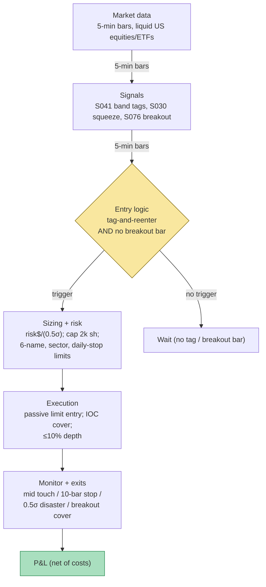

## Stage 114/200 — T014: Bollinger Reversal + Squeeze Exit

*Batch TB2 · Strategy 14/100 · Signals S041, S030, S076*

### T1. One-line verdict

| | |
|---|---|
| **Style** | Intraday band-fade mean reversion with an expansion-defense exit leg |
| **Edge source** | Bollinger-band tags revert toward the midline (S041 `[D]`); fades taken while bandwidth is squeezed run under immediate S076 expansion defense (S030 `[SR]`); any live fade is *covered* on the first adverse vol-breakout bar (S076 `[D/SR]`) |
| **Typical holding period** | Minutes to ~1 hour on 5-minute bars (`example` time stop M = 10 bars) |
| **Capacity hint** | Low — the fade leg is a per-name, spread-bound microstructure bet; scales to a few dozen liquid names before impact eats it |
| **Build-or-buy in one line** | Build: the bands are 20 lines of code — buy only the bar feed |

### T2. Full mechanics

**Universe & session.** Liquid US equities and ETFs: price ≥ $10, average daily dollar volume ≥ $20M, quoted spread ≤ 10 basis points (`examples` — a *basis point* is 0.01%, so 10 bps = 0.10%). Regular trading hours (RTH — 9:30–16:00 ET) only. Exclude earnings-announcement sessions, halted names, and the first 5 minutes of the day (opening-print noise). Bars: 5-minute (`example`); 1-minute works with noisier bands, daily bars for the swing variant.

**The signals in the strategy's own notation.** S041 `[D]` (Bollinger-band reversal): with closes P_t, window n = 20 (`example`), multiplier k = 2.0 (`example`): Mid_t = SMA(20)_t (SMA — simple moving average), σ_t = sample standard deviation of the last 20 closes, Upper_t = Mid_t + 2σ_t, Lower_t = Mid_t − 2σ_t. A *tag* is a close outside a band; the traded fade is *tag-and-reenter*: P_t < Lower_t **and** P_{t+1} > Lower_{t+1} → long at P_{t+1}'s close (mirror for upper tags → short). S030 `[SR]` (bandwidth squeeze): BW_t = (Upper_t − Lower_t)/Mid_t × 100%; P_t = percentile rank of BW_t against its trailing 125 bars; *squeeze armed* when P_t ≤ 15 (`example` — S030's typical range is 5–20). S076 `[D/SR]` (vol breakout): range ratio R_t / R̄_{t−1}^{(10)} > 1.75 (`example`, R_t = bar range) → a vol-breakout bar in the direction of bar t's close.

**Entry rule (long; short mirrors).** At bar t+1's close, enter long only if ALL hold: (i) S041 tag-and-reenter fired (tag at t, back inside at t+1); (ii) S030 conditioner: when a squeeze is armed (P_t ≤ 15, `example`), the fade may still be taken, but the squeeze arms immediate S076 expansion defense — the breakout-cover exit fires on the first adverse vol-breakout bar — because tags during compression are expansion candidates, not reversion setups; (iii) S076 check: bar t+1 is not itself a vol-breakout bar. **Causal timing:** Mid_t, σ_t, BW_t use closes ≤ t; the re-entry is confirmed at t+1's close; earliest fill is t+1's close or t+2's open — never the tag bar's close (the tag bar is where the loss lives).

**Exit rule.** First of: (a) *midline touch* — first close ≥ Mid (longs) / ≤ Mid (shorts); (b) *time stop* — bar t+10 (`example` M = 10, per S041); (c) *disaster stop* — beyond the tag extreme by 0.5σ (`example`); (d) *squeeze/expansion cover* — the strategy's signature: if while in a fade a vol-breakout bar prints **against** the position, cover at that bar's close instead of waiting for the time stop.

**Position sizing.** Fixed-fractional on the disaster stop: shares = risk$ / (0.5σ_t), with risk$ = $250 per trade (`example`); hard cap 2,000 shares per name (`example`). (σ_t is already in dollars, so 0.5σ_t is the dollar risk per share at the disaster stop — no extra × price.) The worked example uses a flat 1,000 shares for readability.

**Risk limits.** Max 6 concurrent fades (`example`); max 2 names per sector; daily loss stop −$500 (`example` — about 2× the expected daily win rate of a working book); kill switch: 3 disaster-stop hits in one session → flat for the day, review the squeeze filter calibration before re-enabling.

**Cost model.** Half-spread 1¢/share/side + commission $0.005/share + $0.50/ticket (`examples`); breakout-cover exits add +0.5 tick slippage (`example` — you are demanding liquidity into the expansion). Borrow stubbed at ~0 for liquid intraday shorts (verify with your broker). Every fade must clear ~$31 round-trip on 1,000 shares before it shows a dollar of edge.

**Execution sketch.** Entries: passive limit at the re-entry close, 1-tick improvement if the queue allows; if not filled within 2 bars, cancel (the setup decays). Mid-touch exits: limit at the midline. Breakout cover: marketable limit IOC (immediate-or-cancel), participation ≤ 10% of visible depth (`example`). Queue-position honesty: on SIP/L1 data, fills "at the touch" are *simulated only — requires MBO/ITCH* (MBO — market-by-order, the full order-level feed) to model honestly.

### T3. Signals it consumes

| Signal | Role | Weight / logic |
|---|---|---|
| S041 `[D]` — Bollinger-band reversal | **Primary trigger** (direction) | tag-and-reenter only; pure tag fades (no re-entry) are excluded — too many false positives |
| S030 `[SR]` — Bandwidth squeeze | **Conditioner** | a fade taken while P_t ≤ 15 (`example`) runs under immediate S076 expansion defense (breakout-cover exit on the first adverse vol-breakout bar); the squeeze arms the *breakout* book alongside the fade book |
| S076 `[D/SR]` — Vol breakout | **Defense exit** | adverse breakout bar → cover at bar close; also gates entry (no fade into an expansion bar) |

Combination pseudocode (≤25 lines):

```
# per name, per 5-min bar close (all inputs causal, data <= t)
mid, up, lo, sd = bollinger(close[:t+1], n=20, k=2.0)   # S041
bw = (up - lo) / mid * 100
p  = percentile(bw, trailing=125)                        # S030
brk = (high[t]-low[t]) / mean(range[t-10:t]) > 1.75     # S076
if flat:
    if close[t] < lo and close[t+1] > lo_next:          # tag-and-reenter
        if not brk:                                     # S076 gate: never fade into an expansion bar
            # S030: squeeze armed (p <= 15) does NOT veto the fade — it arms
            # immediate S076 expansion defense (breakout cover on first adverse vol bar)
            enter long at close[t+1]                    # examples throughout
elif long:
    if close[t] >= mid: exit("mid touch")
    elif t - t_entry >= 10: exit("time stop")           # example M=10
    elif brk and close[t] < close[t-1]: exit("breakout cover")  # S076 defense
    elif close[t] < tag_low - 0.5*sd: exit("disaster stop")
# short mirrors
```

### T4. Worked example — numbers + P&L (SYNTHETIC)

Setup: fictional stock SYN at **~$50** (synthetic prices — not market data), 5-minute bars, **seed 114** (`batches/TB2/plot_T014.py`), n = 20, k = 2.0, flat **1,000 shares** per trade, cost **$31.00/trade** round-trip (half-spread 2 × $10.00 + commission 2 × $5.50 — `examples`). Three trades:

| # | Setup | Entry (bar, $) | Exit (bar, $) | Gross | Costs | Net |
|---|---|---|---|---|---|---|
| 1 | Long fade: lower-tag bar 60, re-entry bar 61 | 61, $49.9278 | 70, $49.9933 (mid touch) | +$65.48 | −$31.00 | **+$34.48** |
| 2 | Short fade: upper-tag bar 110, re-entry bar 111 | 111, $50.3550 | 119, $50.3045 (mid touch) | +$50.49 | −$31.00 | **+$19.49** |
| 3 | Long fade with squeeze armed (BW pct 11.2% ≤ 15 `example`) | 181, $50.4126 | 182, $50.3370 (adverse vol-breakout cover; range ratio 2.28 > 1.75) | −$75.62 | −$31.00 | **−$106.62** |
| **Total** | | | | | | **−$52.65** |

Line-by-line walk, trade 1: buy 1,000 @ **$49.9278** = $49,927.80. Sell 1,000 @ **$49.9933** = $49,993.30. Gross +$65.48; half-spread −$20.00; commission −$11.00; **net +$34.48**. (Leg prices are shown to 4 decimals; gross/net are computed at full script precision, hence ±$0.02 rounding vs the rounded legs.) Trade 2: short 1,000 @ **$50.3550** = $50,355.00; cover @ **$50.3045** = $50,304.50; gross +$50.49 − $31.00 = **+$19.49**. Trade 3: buy 1,000 @ **$50.4126**; the next bar's range ratio printed 2.28 against the position → cover @ **$50.3370**; gross −$75.62 − $31.00 = **−$106.62**. The no-cover alternative — riding to the 10-bar time stop at bar 191 ($49.6564) — would have netted **−$787.19**; the S076 cover leg saved ≈ $680. **Three-trade total net: −$52.65.** The chart plots exactly this tape: price with Bollinger bands, the squeeze shading (BW percentile ≤ 15), entry/exit markers, per-trade net annotations, and the cumulative P&L stepping +34.48 → +53.97 → −52.65.

**Cost-model note.** The 0.5-tick breakout-cover stress allowance (T2) is omitted from the displayed ledger — Trade 3's cover exit carries only the half-spread. Adding it (0.5 × $0.01 × 1,000 shares = $5.00) would move Trade 3 to −$111.62 and the three-trade book to −$57.65. The chart plots the displayed (partial-cost) ledger.

**Where the example is optimistic.** The reversions in trades 1–2 are engineered into the synthetic tape — real tags revert far less obediently, and many tags are the *start* of the expansion, which is precisely what the squeeze filter tries (imperfectly) to avoid. Fills are at exact bar closes with no partial fills and no queue-position modeling. The breakout cover assumes a fill at the bar close with only the modeled half-spread — a real expansion bar gaps through your cover price. Note the honest shape of the result: two textbook fade wins (+$54) are wiped out by one defended loser (−$107) even *with* the cover leg working. That is the strategy's real economics: costs are certain, reversion is probabilistic, and the exit leg only bounds the damage.

### T5. Data & infra — what must run

**Pipeline inventory.** One intraday job: per 5-minute bar, recompute rolling SMA-20/σ/bands/bandwidth percentile for the universe (a few numpy rolling ops per name — O(bars) each). One daily job: corporate-action adjustment check (splits/dividends corrupt the SMA — the #1 data bug in band strategies), universe re-screen (price/ADV/spread gates), and a bandwidth-percentile history rebuild. No overnight batch otherwise.

**M5 Max feasibility: trivial (Tier L, ~8–16 h ≈ $1,200–2,400 loaded-cost estimate; full strategy harness M+, 40–100 h ≈ $6,000–15,000).** Per cost-model §2: 500 symbols × 390 one-minute bars = 195k bars/day; numpy vectorized math runs ~50–200M elements/sec — the entire universe recomputes in well under a second per bar. Per §3: 1-min bars for 500 symbols × 60 days ≈ 12 MB RAM — trivial; §4: ~3 GB/60 days on disk — archive freely. Bottleneck: none computationally; the risk is *data* risk (unadjusted splits), not compute.

**Feed-outage safe-mode.** If bars are stale > 2 bars: no new fades; any live fade is covered at the next available print and the book goes flat. Fades are never carried overnight on stale data — the disaster stop is meaningless without a live quote. Clock skew > 50 ms vs NTP → halt (bar timestamps drive the percentile ranking).

### T6. Buy vs build

| Option | What you get | Indicative price | Gains | Loses |
|---|---|---|---|---|
| Tier 0: Alpaca IEX / Stooq bars | 1-min/daily bars, delayed or limited | ~$0, indicative — verify before budgeting | Free band research | No live 5-min trigger; weak corporate actions |
| Tier 1: Polygon Stocks Advanced | Real-time 1-min bars + corporate actions | ~$30–200/mo, indicative — verify before budgeting | Everything the bands need | — |
| Tier 2: Databento Standard | Honest L1 (MBP-1) for touch-level fade timing | ~$200/mo + usage, indicative — verify before budgeting | Real queue/touch modeling | Overkill for a band strategy |
| Retail platform: QuantConnect paper | Paper broker + minute data + scheduling | ~$60–300/mo, indicative — verify before budgeting | Fastest paper host | Platform lock-in for 20 lines of math |

**Verdict: build; buy only the bar feed.** Bollinger bands are a 20-line rolling computation — no vendor sells you a better SMA. The buy-vs-build question that matters is L1 vs bars: buy Databento L1 only if you graduate the fade to touch-level entries; the band logic itself never justifies it. Crossover: none — there is no licensed data in this strategy.

### T7. Success-ratio evidence

| Study / source | Market & period | Metric | Before/after cost | Caveat |
|---|---|---|---|---|
| Fang, Jacobsen & Qin (2014), "Popularity versus Profitability: Evidence from Bollinger Bands," SSRN 2484322 | 14 international indexes, 1885–2014 | Basic Bollinger breakout gross edge decayed 0.45%/day pre-1983 → **0.00% post-2001** | Before-cost (gross) | Breakout variant, not the tag-fade — but it is the closest peer-reviewed family evidence, and it is zero |
| Practitioner mega-backtest (~20M tests, TradingView/EdgeTools, via S076's chapter) | ES futures (CME_MINI:ES1) | Squeeze-breakout directional edge ≈ 0 (−0.10pp long / +0.15pp short, insignificant after Bonferroni); **squeeze forecasts future volatility, not direction** | Before-cost | Practitioner source, not peer-reviewed — treat as a lead, not a finding |
| Bollinger (2001), *Bollinger on Bollinger Bands* | Practitioner doctrine | The squeeze is explicitly direction-neutral: "periods of low volatility are followed by periods of high volatility" | n/a (doctrine) | Supports the filter/exit use of S030, not the fade |
| Andersen, Bollerslev, Diebold & Labys (2003), *Econometrica* 71(2) | FX/equity realized vol | Volatility clusters — long memory in realized variance | n/a (mechanism) | The mechanism behind compression→expansion; says nothing about fade profitability |

No peer-reviewed study documents an after-cost premium for band-tag fading. The documented facts are: (1) volatility clusters, so squeezes resolve into expansions (the exit leg's premise), and (2) the directional fade leg has no published edge net of costs. **Bottom line for ≤$1M paper:** this is a spread-bound lab exercise — excellent for learning cost modeling and exit engineering, not a P&L engine. An institutional desk would never run the fade standalone; bands survive in production as *risk/context features* (regime gates, like the squeeze filter here), which is exactly the leg of this strategy with the most support.

### T8. Failure modes

1. **The trend is the fade's natural predator.** Bollinger's own Method II is trend-following — tags that don't revert are breakouts, and fading them is the anti-strategy. *Mitigation:* the S030 conditioner (fades taken while squeezed run under immediate S076 expansion defense) plus the S076 cover; accept that whipsaw (cover, then price reverts) is a permanent tax.
2. **Squeeze expansion against the position.** Compression resolves violently, often on news. *Mitigation:* the breakout-cover leg; plus a hard rule — never fade the *first* tag out of a squeeze, only re-entries after the percentile has normalized (`example` refinement).
3. **Wide spreads eat the edge.** A 10 bps spread on a 15 bps expected reversion is a coin flip with a fee. *Mitigation:* Corwin–Schultz-style spread gate (S013): skip names/days where estimated effective spread > 50% of the expected mid-touch gain (`example`).
4. **Parameter mining.** 20/2 is convention, not science; optimizing n/k on 5-min bars overfits the band to the sample's vol. *Mitigation:* fix 20/2.0 as convention, vary only M and the squeeze percentile, walk-forward (S088 discipline).
5. **News jumps.** A tag caused by a jump (S092 territory) has no reason to revert — the midline itself relocates. *Mitigation:* skip fades on bars where |return| > 3× diurnal σ (jump filter, `example`); no fades 5 minutes either side of scheduled releases.
6. **Bid–ask bounce contamination.** Tags computed on last-sale prices are partly just the bounce; backtests on trades overstate reversion. *Mitigation:* compute bands and P&L on quote midpoints (the batch's research Q&A, Grok Q-TB2-2, details the midpoint-accounting defense — research lead, standard practice); report mid-to-mid, mid-to-touch, and touch-to-touch P&L separately.
7. **Overnight gap through the disaster stop.** A tag fade held into a gap open blows past the 0.5σ stop. *Mitigation:* flat into the close — no overnight holds, no exceptions; the strategy is intraday by construction.
8. **Crowding of retail band-fades.** Band-fading is the most retailed mean-reversion setup in existence; crowded tags get run over. *Mitigation:* liquid-universe filter, participation caps, and the squeeze conditioner (retail fades ignore the squeeze — that is your differentiation).

### T9. Visuals




### T10. Sources

1. Bollinger, J. (2001). *Bollinger on Bollinger Bands*. McGraw-Hill. ISBN 9780071373685. (Band construction, the squeeze concept, tag semantics.)
2. Fang, J., Jacobsen, B. & Qin, Y. (2014). "Popularity versus Profitability: Evidence from Bollinger Bands." SSRN 2484322. https://papers.ssrn.com/sol3/papers.cfm?abstract_id=2484322 (Breakout edge 0.45%/day pre-1983 → 0.00% post-2001, 14 indexes.)
3. Andersen, T. G., Bollerslev, T., Diebold, F. X. & Labys, P. (2003). "Modeling and forecasting realized volatility." *Econometrica* 71(2), 579–625. DOI: 10.1111/1468-0262.00418. https://doi.org/10.1111/1468-0262.00418 (Volatility clustering — the mechanism behind compression→expansion.)

**Unverified leads:** the ~20M-backtest practitioner note (TradingView/EdgeTools: squeeze-breakout directional edge ≈ 0, insignificant after Bonferroni; squeeze forecasts volatility, not direction) — practitioner source, not peer-reviewed, used only as a lead; Grok's Q-TB2-2 midpoint-accounting defense for reversal backtests — standard practice described in the batch's research Q&A, not independently measured here; all thresholds and the worked example are the author's synthetic construction.

*Source log: Grok answered Q-TB2-1..3 (2026-09-10); all claims independently verified or labeled unverified.*
