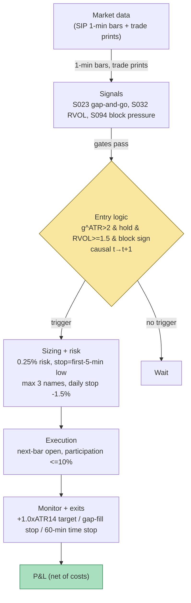

## Stage 118/200 — T018: RVOL-Gated Gap-and-Go

*Batch TB2 · Strategy 18/100 · Signals S023, S032, S094*

### T1. One-line verdict

| | |
|---|---|
| **Style** | Intraday momentum / opening-gap breakout |
| **Edge source** | Continuation of large, institutionally sponsored opening gaps: when a stock gaps far beyond its recent volatility and prints heavy, same-direction volume plus signed block trades in the first minutes, the overnight information (news, earnings, index flows) is still being digested, and price tends to drift further in the gap's direction for the first hour |
| **Typical holding period** | 15 minutes to ~2 hours; flat by early afternoon |
| **Capacity hint** | Low. Only a handful of names per day pass the gap + RVOL + block gates, and the entry window is minutes wide. A single operator can run it; a desk would crowd the same prints |
| **Build-or-buy in one line** | Build the scanner yourself on rented SIP 1-minute bars plus a trades feed; there is no off-the-shelf product that sells your entry thresholds |

### T2. Full mechanics

**Jargon used below.** *ATR* (Average True Range): the trailing mean of each bar's True Range — the largest of (high−low), |high−prior close|, |low−prior close| — a volatility unit in dollars. *RVOL* (Relative Volume): the ratio of volume in a time-of-day window today to the same window's trailing average. *Block trade*: a single print above a size threshold (e.g. 10,000 shares *example*), used as an institutional-footprint proxy. *Lee–Ready (1991)*: the standard rule for signing a trade as buyer- or seller-initiated (the quote test against the lagged midquote, then the tick test). *SIP*: the consolidated US equity tape. *NBBO*: the National Best Bid and Offer across exchanges.

**Universe & session.** US common stocks, price ≥ $5 (*example*), 20-day average dollar volume ≥ $20M (*example*), quoted spread at the open ≤ 10 bps (*example*), float ≥ 50M shares (*example*). RTH only; entries armed 09:35–11:30 ET (*example*); flat by 13:00 (*example*). Exclusions: halts, IPOs within 60 sessions (*example*), split-artifact "gaps" (adjust first, then measure), auction-imbalance-artifact opens.

**Entry rule.** All four gates must pass, using S023 `[SR]`'s gap/hold/go structure plus the S032 `[SR]`/S094 `[SR]` confirmations. Let C_{t−1} be the prior close, O_t the opening print, ATR_{t−1}(14) the 14-session ATR, and g^ATR_t = (O_t − C_{t−1}) / ATR_{t−1}(14) (S023 `[SR]`):

1. **Gap gate (S023 `[SR]`):** g^ATR_t > 2.0 (*example*). The gap must be large in volatility units, not just percent.
2. **Hold gate (S023 `[SR]`):** min low of the first M = 10 minutes (*example*) stays above C_{t−1} for gap-ups (mirrored for gap-downs). The gap is not immediately filling.
3. **Participation gate (S032 `[SR]`):** RVOL over the first-5-minute window ≥ 1.5 (*example*), where RVOL = V_{5min,t} / (mean of the same 5-minute window over the prior 14 sessions, *example*).
4. **Institutional-footprint gate (S094 `[SR]`):** block-trade imbalance BlockImb = (buy-block volume − sell-block volume) / total block volume over the first 10 minutes (*example*), with blocks signed by Lee–Ready and a ≥ 10,000-share threshold (*example*), must have the same sign as the gap (BlockImb > +0.2 for gap-ups, *example*).
5. **Go trigger (S023 `[SR]`):** the close of a 1-minute bar τ (after the first 5 minutes) prints above the first-5-minute high (gap-ups).

**Causal timing.** The gap is known at the 09:30 opening print; the hold and RVOL gates need the first 5–10 minutes of tape; the trigger is determined at the close of bar τ and is tradable no earlier than the **open of bar τ+1** (fills are modeled at τ+1's open, never τ's close).

**Exit rule.** First of: (a) profit target = entry + 1.0×ATR_{t−1} (*example*, gap-ups); (b) stop = the first-5-minute low (the hold breaks); (c) time stop = 60 min after entry (*example*) or 11:30 ET, first; (d) momentum died: RVOL on a down bar > 1.5× while price breaks the prior 5-minute low.

**Position sizing.** shares = (equity × 0.25%) / (entry − stop) (*example*), to 100s. Max 3 concurrent names (*example*); portfolio heat ≤ 0.75% (*example*); max gross 3× equity (*example*). Short gap-downs only with a confirmed locate; otherwise long-only.

**Risk limits.** Daily loss stop −1.5% of equity (*example*), then no new entries; per-trade cap 0.5% (*example*); max gross 3× equity (*example*). Kill switch: flatten if the 1-minute feed is stale > 120 seconds (*example*), the opening print deviates > 3× the premarket-indicated range (bad open), or the block-trade feed drops (the footprint gate cannot be evaluated).

**Cost model (applied in T4).** Half-spread $0.02/share (*example*, $120-name spread) paid on entry and exit; commission $0.005/share + $0.50/ticket (*example*); slippage 1 tick ($0.01, *example*) on the momentum entry only; borrow fee $0 in the long-only variant. No market-impact term for ≤ 1,000-share clips (*example*); square-root impact beyond that.

**Order/execution sketch.** A stop-entry 1 tick above the first-5-minute high, converting to a market order on trigger, capped at ≤ 10% of visible depth at the touch (*example*). Honesty note: on SIP data the queue position is unknowable — fills are modeled at the τ+1 open with half-spread + 1-tick slippage (`simulated only — requires MBO/ITCH` for any queue-level claim).

### T3. Signals it consumes

| Signal | Role | Weight / logic |
|---|---|---|
| S023 `[SR]` — Gap-and-go | Primary trigger (direction + timing) | Enter only if g^ATR_t > 2.0 AND hold (M=10 min) AND 1-min close τ above the first-5-min high |
| S032 `[SR]` — RVOL-filtered breakout | Participation gate (veto) | Veto unless RVOL_{first-5-min} ≥ 1.5; the breakout "counts" only with abnormal volume |
| S094 `[SR]` — RVOL + signed block pressure | Institutional-footprint confirmation (veto) | Veto unless sign(BlockImb_{10min}) = sign(gap); BlockImb > +0.2 (gap-ups) |

```python
# T018 combination logic (<=25 lines). All thresholds marked example.
def t018_signal(day):
    g_atr = (day.open - day.prior_close) / day.atr14          # S023
    if abs(g_atr) <= 2.0: return None                        # example gate
    hold = min_low_first_10min(day) > day.prior_close        # S023 hold
    if g_atr > 0 and not hold: return None
    rvol = vol_first_5min(day) / mean_same_window_14d(day)   # S032
    if rvol < 1.5: return None                               # example veto
    bimb = block_imbalance_first_10min(day, min_shares=10000) # S094
    if sign(bimb) != sign(g_atr) or abs(bimb) < 0.2: return None
    for bar in one_min_bars_after(day, "09:35"):             # S023 go trigger
        if g_atr > 0 and bar.close > first_5min_high(day):
            return ("LONG", bar.next_open)                   # fill at t+1 open
        if g_atr < 0 and bar.close < first_5min_low(day):
            return ("SHORT", bar.next_open)
    return None
```

### T4. Worked example — numbers + P&L (SYNTHETIC)

All prices below are synthetic (seed 118, `rng = np.random.default_rng(118)`); the setup is a fictional $120 med-tech name "AVNX". The chart `images/T018_example.png` plots this exact path.

Setup: prior close $120.00; ATR14 = $3.00 (*example*); open $126.60 → gap g^ATR = (126.60 − 120.00)/3.00 = **2.2×** (> 2.0 ✓). First-5-minute (09:30–09:35) high $127.10, low $126.30 — low > prior close, hold ✓. First-5-minute volume 400k vs 14-day same-window mean 150k → RVOL = **2.67** (≥ 1.5 ✓). Blocks in the first 10 minutes: 6 Lee–Ready-signed buys totaling 180k shares, 1 signed sell of 40k → BlockImb = (180 − 40)/220 = **+0.64** (> +0.2, sign matches ✓). The 09:40–09:45 bar closes $127.35 > $127.10 → trigger; entry at the 09:45 open, $127.40 (the raw synthetic next-bar open — half-spread and slippage are charged in the ledger below, not embedded in the price).

Sizing: equity $500,000; risk 0.25% = $1,250 (*example*); stop = first-5-minute low $126.30 → risk/share = $1.10 → 1,136 → **1,000 shares** (rounded, *example*).

Exit: target = entry + 1.0×ATR14 = $127.40 + $3.00 = **$130.40**, touched at 10:35 → sell 1,000 @ $130.40.

| Step | Price | Side | Shares | Cash flow | Notes |
|---|---|---|---|---|---|
| Entry 09:45 | $127.40 | Buy | 1,000 | −$127,400.00 | raw synthetic next-bar open |
| Spread cost (entry leg) | — | — | — | −$20.00 | $0.02 half-spread × 1,000 |
| Commission in | — | — | — | −$5.50 | 1,000×$0.005 + $0.50 |
| Slippage (entry) | — | — | — | −$10.00 | 1 tick on momentum entry |
| Exit 10:35 (target) | $130.40 | Sell | 1,000 | +$130,400.00 | +1.0×ATR target |
| Spread cost (exit leg) | — | — | — | −$20.00 | $0.02 half-spread × 1,000 |
| Commission out | — | — | — | −$5.50 | |
| **Gross P&L** | | | | **+$3,000.00** | 1,000 × ($130.40 − $127.40) |
| **Total costs** | | | | **−$61.00** | spread $40 + comm $11 + slip $10 |
| **Net P&L** | | | | **+$2,939.00** | |

Stop path (for the record): a fill of the gap at $126.30 would gross 1,000 × ($126.30 − $127.40) = −$1,100, net ≈ **−$1,161** after the same $61 costs.

**Where the example is optimistic.** The fill is assumed exactly at the 09:45 open with known 1-tick slippage — no partial fills, no queue misses, no spread widening at the trigger bar. The RVOL baseline (150k) is known exactly; in production a single news-day outlier poisons the 14-day mean (use the median or winsorized baseline, S032). The block imbalance assumes a clean trades feed — Lee–Ready signing errors on fast tape are an additional, unquantified drag (see unverified leads). Most importantly, this is one winner: most qualifying gaps never reach the +1.0×ATR target, and the trigger's base rate (not one fill's P&L) decides whether the strategy survives.

### T5. Data & infra — what must run

**Pipeline inventory.** (1) *Pre-open (08:00 ET)*: compute g^ATR for ~3,000 names from the universe file as official opens print. (2) *Intraday loop (09:30–13:00 ET)*: every minute, update first-5-minute statistics, RVOL, and rolling block imbalance from the trades feed; evaluate triggers; manage positions. (3) *Post-close*: archive bars/trades, recompute RVOL baselines, log fills vs model.

**Feeds.** SIP 1-minute OHLCV with the official open (Tier 1: ~$30–200/mo `indicative — verify before budgeting`, per cost-model §6) plus a trades feed with per-print size for the block filter (Tier 2, e.g. Databento Standard ~$200/mo + usage `indicative — verify before budgeting`). Opening-print quality warning (Grok): vendor daily "open" is often a composite, not a quote midpoint — validate against the auction print before the gap is measured.

**M5 Max feasibility: feasible.** Tier M build (L1-adjacent event logic on 1-min bars, ~40–100 eng-hours per cost-model §5 → $6,000–15,000 `loaded-cost estimate`). Throughput is trivial: 500 names × 390 one-minute bars = 195k bars/day (cost-model §2); the block-signing loop over the first 10 minutes of trades is the heaviest piece and fits a Python event loop (~100–500k events/sec) for a ≤ 20-name watchlist. RAM: 60 days of 1-min bars for 500 names ≈ 3 GB (cost-model §4) — far inside the 77 GB budget. Storage: ~50 MB/day of 1-min bars; the trades feed is the growth item (~2–8 GB/symbol-day for L1, cost-model §4) — archive per-symbol daily files, never the full universe. Bottleneck: engineering time and data licensing, not compute.

**Feed-outage safe mode.** 1-minute feed stale > 120 s (*example*): cancel pending stop-entries, flatten at market, page the operator. Trades/block feed drops while bars continue: the footprint gate cannot be evaluated → no new entries; existing positions run to stops/targets. Broker API drops: hard stops are lodged at the broker (*example* practice), so worst case is the modeled stop distance. No overnight positions — outage exposure is intraday only.

### T6. Buy vs build

| Option | What you get | Indicative price | What buying gains | What buying loses |
|---|---|---|---|---|
| Tier 0: Stooq / Alpaca IEX delayed | Daily bars, delayed quotes | ~$0 | Free universe screening | No real-time 1-min bars or official opens — unusable for the entry |
| Tier 1 retail: Polygon Stocks Advanced / Alpaca SIP | Real-time SIP 1-min bars, official opens, corporate actions | ~$30–200/mo `indicative — verify before budgeting` | Cheapest adequate tape for gates 1–3 | Block-level trades cost extra; wide-scan rate limits |
| Tier 2 professional: Databento Standard (MBP-1 + trades) | Honest L1 quotes + trade prints for block signing | ~$200/mo + usage `indicative — verify before budgeting` | Clean block footprints (gate 4); backtestable | Usage meter runs on a wide universe; eng still yours |
| Retail platform (QuantConnect/Composer-style) | Hosted backtest + paper broker | ~$10–50/mo `indicative — verify before budgeting` | No infra to run | Coarse block-trade data; you still write the strategy |
| Buy the signal (news-sentiment gap screen) | Third-party gap/catalyst flags | ~$100–300/mo `indicative — verify before budgeting` | Saves the catalyst-classification eng | Their flags, their false positives; the sizing IP stays yours anyway |

**Verdict: build the strategy, buy the tape.** The scanner, gates, and sizing are 40–100 hours of your IP (Tier M+ per cost-model §5); the data is rented. Crossover: without a trades feed, drop the block gate and run the RVOL-only variant (T005's family) — do not fake block pressure from bar data.

### T7. Success-ratio evidence

| Study / source | Market & period | Metric | Before/after cost | Caveat |
|---|---|---|---|---|
| Plastun, Sibande, Gupta & Wohar (2019), "Price Gap Anomaly in the US Stock Market" | US DJI/S&P 500/NASDAQ, 1928–2018 | Gap-day momentum: prices tend to continue in the gap's direction; trading simulation "efficient," results not random | Trading simulation (costs modeled per their method) | Index-level gaps; continuation effect is temporary; single-stock gaps are noisier |
| Stübinger & Schneider (2019), "Statistical Arbitrage with Mean-Reverting Overnight Price Gaps," JRFM | S&P 500 constituents, 1998–2015, high-frequency | 51.47% p.a., Sharpe 2.38 after transaction costs — for the FADE (reversal), not the go | After cost (their model) | Directly the opposite trade: shows the gap edge is real but direction is contested — the RVOL/block gate is this strategy's answer to that contest |
| 2011 Charles H. Dow Award, "Analyzing Gaps for Profitable Trading Strategies" (CMT Association) | Russell 3000, 2006–2010 | 20,611 gap-ups / 17,435 gap-downs in 1,259 sessions (~16/day up, ~14/day down) | Descriptive (no P&L) | Capacity anchor: the raw opportunity set is thin even before the RVOL/block gates |
| Crabel (1990), *Day Trading With Short Term Price Patterns and Opening Range Breakout* | Practitioner literature | Opening-range expansion as the intraday continuation trigger — the ancestor of the "go" leg | Before cost | No formal statistics; cited as provenance, not evidence |

**Regimes where it fails.** Gap-fade regimes (the Stübinger–Schneider world): when overnight gaps are noise, continuation dies and the fade wins. Low-volume melt-up days: RVOL passes on retail herding with no block sponsorship, then reverses. Crowding: the first-5-minute-high breakout is the most published retail entry; on crowded tickers the trigger bar is the local top.

**Honest bottom line.** As a standalone trigger ("buy every big gap"), gap-and-go is roughly a coin flip with a left tail — the literature is split between continuation (Plastun et al.) and reversal (Stübinger & Schneider). The strategy's only honest claim is that the RVOL + signed-block gates select the informed subset. For a ≤$1M paper operation this is buildable and cheap to run (rented Tier 1/2 data, one intraday loop); expect a low-frequency, low-capacity sleeve, not a book. For an institutional desk it is a tactic inside a larger intraday book — capacity is single-digit names per day.

### T8. Failure modes

1. **Gap fills instead of going (fade regime).** Mitigation: the hold gate + block-sign confirmation; hard stop at the first-5-minute low; daily loss stop caps a fade-day bleed.
2. **RVOL false positive from retail herding.** A meme-name prints 3× volume with no institutional sponsorship. Mitigation: the block gate (S094) — require signed block volume, not share volume; veto if BlockImb is near zero.
3. **Blocks are crosses, not directional flow.** An opening cross prints as a large "block" with no information. Mitigation: exclude prints flagged as crosses/derivatively-priced; require the imbalance to persist over the 10-minute window, not one print.
4. **Opening print is an auction artifact, not a mid.** Grok's bounce-defense note (Q-TB2-2): vendor "open" is often a composite; trading a 10–20 bp "gap" on a 20 bp spread is spread-paying theater. Mitigation: validate the open against the auction print; require spread ≤ 10 bps (*example*) before arming.
5. **News-gap into a halt.** The gap is real, the continuation is real, then the stock halts and reopens against you. Mitigation: skip names with pending binary events (FDA, court rulings) where halts cluster; hard per-name cap.
6. **Threshold overfitting (2.0×ATR, 1.5×RVOL).** Mined on one regime, dead in the next. Mitigation: walk-forward re-estimation, wide parameter plateaus only (edge across 1.5–2.5×ATR), and S088 purged-CV discipline on the label set.
7. **Latency: the break is priced before the fill.** On SIP data the τ+1 open is already the crowded print. Mitigation: 1-tick minimum slippage; measure fill shortfall live and widen it; `simulated only — requires MBO/ITCH` for queue-level claims.
8. **Stale RVOL baseline.** One news-day outlier in the 14-day window halves the measured RVOL. Mitigation: median or winsorized baseline (S032 variants); recompute nightly.

### T9. Visuals




### T10. Sources

- Plastun, A., Sibande, X., Gupta, R. & Wohar, M.E. (2019), "Price Gap Anomaly in the US Stock Market: The Whole Story," SSRN. https://papers.ssrn.com/sol3/papers.cfm?abstract_id=3461283 — gap-day continuation (momentum) on US indices, 1928–2018.
- Stübinger, J. & Schneider, L. (2019), "Statistical Arbitrage with Mean-Reverting Overnight Price Gaps on High-Frequency Data of the S&P 500," *Journal of Risk and Financial Management* 12(2). https://www.mdpi.com/1911-8074/12/2/51 — the documented fade counter-case (their reported 51.47% p.a. / Sharpe 2.38 after costs, 1998–2015).
- "Analyzing Gaps for Profitable Trading Strategies" (2011), Charles H. Dow Award, CMT Association. https://cmtassociation.org/wp-content/uploads/2025/08/2011-dowaward.pdf — Russell 3000 gap counts 2006–2010 (20,611 gap-ups / 17,435 gap-downs).
- Crabel, T. (1990), *Day Trading With Short Term Price Patterns and Opening Range Breakout*, Traders Press — practitioner ancestor of the opening-range "go" trigger.

**Unverified leads.** Grok Q-TB2-1(B): gap-fill-rate tape by gap size (full fill ~44% for 0–0.5% gaps, ~27% for 1–2%, ~8% above 6%) — chatbot-reported, no checkable source. Grok Q-TB2-2: Norgate Platinum ~$630/yr, Massive Stocks Advanced $199/mo, FirstRate one-time dumps — Grok-reported vendor figures, `indicative — verify before budgeting`. Grok Q-TB2-2 bounce-defense notes (auction-print opens, mid-vs-last accounting) — practitioner guidance, not independently sourced. The Lee–Ready misclassification figure in T4/T8 ("10–20% of prints") is a practitioner rule of thumb, not a sourced statistic — treat as an unverified lead.

Grok answered Q-TB2-1..3 (2026-09-10); all claims independently verified or labeled unverified.
