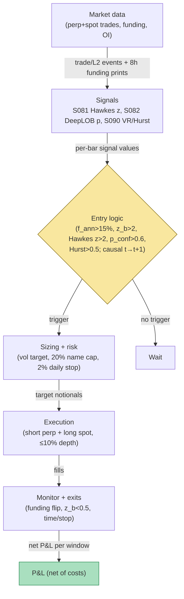

## Stage 151/200 — T051: Funding-Rate Carry + Basis Mean-Reversion

*Batch TB6 · Strategy 51/100 · Signals S081, S082, S090*

**Provenance [D/SR].** The perpetual-futures **funding-rate** mechanism (a periodic cash payment between long and short holders, proportional to the gap between the perpetual price and the **spot** price — the price for immediate delivery) and **basis** convergence are documented market design (He, Manela, Ross & von Wachter, arXiv:2212.06868; exchange documentation). The combination — harvesting the funding **carry** (the yield from the funding payment) with order-flow timing (S081), book-classifier confirmation (S082), and a persistence gate (S090) — is a standard reconstruction, not a published recipe. Related plan strategies: **T075 — Crypto Funding-Rate Reversal** (fades crowded funding extremes; this chapter harvests the carry while the premium persists), **T077 — Crypto Basis Cash-and-Carry** (the plain convergence trade without the flow-timing overlay).

### T1. One-line verdict

| | |
|---|---|
| **Style** | Crypto derivatives carry + delta-neutral basis mean-reversion |
| **Edge source** | Persistent funding-rate premium paid by leveraged longs, plus mean-reversion of the perp–spot basis toward zero |
| **Typical holding period** | Hours to days (one to several 8-hour funding windows) |
| **Capacity hint** | Tens of $M notional on BTC/ETH perps at good fee tiers; thins fast on altcoins |
| **Build-or-buy in one line** | Build the timing and risk layer yourself; buy clean historical funding/basis data for research |

### T2. Full mechanics

**Universe & session.** Top-10 **USDT-margined** perpetuals (perps settled in the Tether stablecoin rather than the underlying coin) ranked by **open interest** (the total notional of outstanding contracts), traded on 2–3 major centralized exchanges (CEXs). Exclusions: tokens with open interest below an example floor (e.g. $50M), assets within 7 days of a listing/delisting event, and coins where the spot leg cannot be borrowed or bought without >10 bp impact (*example*). Session: 24/7; decisions are evaluated at each 8-hour funding timestamp (00:00 / 08:00 / 16:00 UTC, *example*), when the funding payment is exchanged.

**Entry rule.** All thresholds below are *examples*. At funding timestamp *t*, open a delta-neutral pair — short the perp, long the spot — only if **all** hold:

1. Annualized funding rate f_ann(t) > f_min (*example* 15% APR): the carry is rich enough to matter. (Funding positive means longs pay shorts, so the short-perp leg *receives* the payment.)
2. Basis z-score z_b(t) > +2 (*example*): basis b_t = (F_t − S_t)/S_t is stretched rich, so the pair also harvests convergence. z_b uses a trailing 7-day mean/std (*example*).
3. **S081** buy-side intensity burst: z_t > κ (*example* κ = 2) on the perp's trade tape — the premium is driven by live one-sided flow (persistent) rather than a stale quote.
4. **S082** confirmation: the classifier's max-class probability max_c P(c) > p_conf (*example* 0.6) with predicted direction not opposing the carry, and the expected move clears the spread-cost filter.
5. **S090** regime gate: implied Hurst Ĥ(8) > 0.5 (*example*) on recent 5-minute bars — run the carry only when the tape is persistent; in anti-persistent chop, funding flips sign and whipsaws the book.

**Causal timing.** Every input is computed from data with timestamps ≤ *t*; orders are sent for the window starting at *t+1* (the next funding window). The strategy never trades on the same print that computed its z-scores — no **lookahead** (using future information).

**Exit rule.** Close the pair on the first of: (i) f_ann(t) < f_exit (*example* 3% APR) or turns negative — the carry is gone; (ii) |z_b(t)| < 0.5 (*example*) — basis converged; (iii) time stop of N windows (*example* N = 5); (iv) stop-loss: z_b(t) > +3.5 (*example*) — the premium is diverging structurally (e.g. a spot borrow squeeze), not converging; (v) **S081** flips to a sell burst z_t < −κ (*example*) while holding — the premium's flow support is gone.

**Position sizing.** Volatility-targeted: notional per pair N_pair = (σ_target / σ̂_basis_ann) × Equity, where σ̂_basis_ann is the trailing annualized volatility of the basis (*example* σ_target = 10% of equity vol). Caps (*examples*): ≤ 20% of equity per name, portfolio gross ≤ 2× equity. Size for the carry, not the convergence: funding P&L scales with notional; convergence P&L is capped by the entry basis.

**Risk limits.** Daily loss stop 2% of equity (*example*); per-position stop 1% (*example*); maximum 3 concurrent pairs (*example*); **kill switch** (an automated halt that cancels orders and flattens risk) fires if any venue's websocket is stale > 60 s (*example*) or realized 1-minute volatility exceeds 5× its median (*example*).

**Cost model.** Applied explicitly to the worked example in T4. Round-trip cost per pair (*example*): 4 legs × 2 bp taker fee = 8 bp, plus 2 spread crossings × 2 bp = 4 bp, total **12 bp** of notional. Funding received/paid is modeled per window (it is P&L, not cost). Slippage for sizing studies: 0.5 × spread + ψ·σ·√(q/V) (*example* ψ = 0.5), where q is order size and V is recent volume. Retail taker tiers (5–10 bp) roughly double the modeled cost — use the reader's actual tier in the gate.

**Order/execution sketch.** Enter both legs near-simultaneously: short perp via post-only limit (maker where the book allows), long spot via limit at the touch; if either leg is unfilled after 30 s (*example*), cancel the other — never hold a naked directional leg. Participation ≤ 10% of visible depth per child order (*example*). Honesty note: fills are *modeled* at touch plus slippage — no queue-position claims (the plan's `simulated only — requires MBO/ITCH` label, applied here to direct crypto feeds).

### T3. Signals it consumes

| Signal | Role | Weight / logic |
|---|---|---|
| **S081 — Hawkes buy/sell intensity imbalance** [D] | Primary timing trigger | Enter only if buy-burst z_t > κ (*example* κ = 2); exit early if z_t < −κ. Formula (MASTER.md S081): d_t = λ^b_t − λ^s_t, z_t = (d_t − m_t)/s_t, burst flag at \|z_t\| > κ |
| **S082 — Deep learning on the LOB** [D/SR] | Confirmation filter | Require max_c P(y = c \| X_t) > p_conf (*example* 0.6) with direction not opposing the carry, and expected move > spread + fees (the S082 [SR] trade rule) |
| **S090 — Variance-ratio / Hurst regime toggle** [D/SR] | Regime gate | Run only if Ĥ(k) > 0.5 (*example*). VR(k) = Var(r_t(k))/(k·Var(r_t)); Ĥ(k) = (1/2)·[1 + ln VR(k)/ln k]; VR > 1 / H > 0.5 ⇒ persistence |

Combination pseudocode (≤25 lines):

```
# evaluated at each funding timestamp t; tradable at t+1
f_ann, b, z_b      = funding_panel(t)          # annualized funding, basis, basis z-score
z_hawkes           = S081(t)                   # (d_t - m_t)/s_t on perp trade tape
p_conf, direction  = S082(t)                   # softmax max prob + argmax class
hurst              = S090(t)                   # implied Hurst on 5-min bars
if (f_ann > F_MIN and z_b > 2.0 and z_hawkes > KAPPA
        and p_conf > P_CONF and direction != OPPOSES_CARRY
        and hurst > 0.5 and feed_fresh(t)):
    size = vol_target_size(sigma_basis(t))     # capped per-name / portfolio
    open_pair(short_perp, long_spot, size)      # cancel-other if a leg fails
for pos in open_positions:
    if (f_ann < F_EXIT or abs(z_b) < 0.5 or age > N_WINDOWS
            or z_b > 3.5 or z_hawkes < -KAPPA):
        close_pair(pos)
```

### T4. Worked example — numbers + P&L (SYNTHETIC)

All numbers below are synthetic. Seed: `np.random.default_rng(151)`; `batches/TB6/plot_T051.py` regenerates `images/T051_example.png` from the same table — window-close values here and in the chart agree (intra-window basis points are deterministic interpolation for display). Setup: BTC-like perp/spot, notional **$100,000 per leg** (short $100k perp + long $100k spot), round-trip cost 12 bp = **$120** per position (4 legs × 2 bp fees + 2 × 2 bp spread crossings).

**Position 1 — funding carry (enter W1, exit end of W5).** f_8h is the funding payment per 8-hour window in bp of notional (positive = received by the short-perp leg).

| Window | f_8h (bp) | Funding P&L | Basis (bp, close) | Basis MTM P&L |
|---|---|---|---|---|
| W1 | +9 | +$90 | 25 → 20 | +$50 |
| W2 | +12 | +$120 | 20 → 15 | +$50 |
| W3 | +7 | +$70 | 15 → 12 | +$30 |
| W4 | −4 | −$40 | 12 → 8 | +$40 |
| W5 | +3 | +$30 | 8 → 5 | +$30 |
| **Total** | | **+$270** | | **+$200** |

Gross = $270 + $200 = **$470**. Costs = $120. **Net = +$350.**

**Position 2 — thin basis mean-reversion (enter W3, exit end of W4).** The honest case: funding too thin to clear costs.

| Window | f_8h (bp) | Funding P&L | Basis (bp, close) | Basis MTM P&L |
|---|---|---|---|---|
| W3 | +2 | +$20 | 10 → 8 | +$20 |
| W4 | −3 | −$30 | 8 → 6 | +$20 |
| **Total** | | **−$10** | | **+$40** |

Gross = −$10 + $40 = **$30**. Costs = $120. **Net = −$90 — costs exceed gross.** This is the point: a 4 bp basis convergence with 2 bp funding cannot pay a 12 bp round trip. The entry gate (f_ann > 15% APR *and* z_b > 2) exists precisely to reject trades like Position 2.

**Where the example is optimistic.** Fills are assumed instant at window marks with no partial fills and no leg mismatch; the funding payment is taken as known at entry, whereas real funding accrues from the time-weighted premium *during* the window and entering just before the timestamp faces crowding; exchange funding clamps/caps are ignored; borrow/transfer frictions on the spot leg, **ADL** (auto-deleveraging — the exchange forcibly closing profitable positions when the insurance fund is stressed), and venue-outage risk are all assumed away. None of this is a backtest.

### T5. Data & infra — what must run

**Pipeline inventory.** (1) 24/7 websocket collectors per venue: trades, top-of-book L2, funding rate, **mark price** (the exchange's fair-value index used for liquidations), open interest, and the liquidation/force-order stream. (2) Funding-history REST backfill with point-in-time timestamps. (3) Intraday compute loop: Hawkes recursion per trade event (S081), volume-bar builder + VR/Hurst on 5-minute bars (S090), classifier scoring every N events (S082). (4) Funding-timestamp decision job. (5) Daily reconciliation: positions vs exchange, fee-tier audit, funding P&L attribution. Storage: funding + 1-minute bars are trivial (~12 MB for 500 symbols × 60 days per cost-model §3); sampled tick trades for 10 names dominate at GBs/day, kept as per-symbol daily files.

**M5 Max feasibility: feasible (Tier M+).** Per cost-model §5, a strategy harness around M-tier signals is **40–100 h ≈ $6,000–15,000** at the $150/hr loaded-cost estimate — the work is the 24/7 collector, causal funding accounting, and the pair-execution state machine, not the math. Throughput per cost-model §2: a Python event loop handles ~100–500k events/sec; 10 crypto symbols at ~1–5k events/sec each is 10–50k/sec — comfortable, bottleneck is websocket fan-in and I/O, not compute. RAM: live working set < 1 GB (77 GB budget per §3). What breaks first: full-depth multi-venue L2 for 100+ symbols — does not fit; use per-symbol daily files + streaming.

**Feed-outage safe mode.** If a venue's market-data websocket is stale > 60 s (*example*): cancel all open orders on that venue; if the pair is left with one live leg, flatten the orphan leg immediately (a naked perp/spot leg is directional risk, not carry); block new entries until funding data is fresh — carry without a known funding rate is unpriced risk. Stale funding data alone blocks entries, not exits. The daily-loss kill switch pages the operator and requires manual re-arm.

### T6. Buy vs build

| Option | What you get | Indicative price | What buying gains | What buying loses |
|---|---|---|---|---|
| Exchange public websockets/REST (funding, trades, L2, OI) | Real-time market data, no redistribution rights issues for internal use | ~$0 (indicative — verify before budgeting) | Zero marginal cost; canonical source | You build/maintain collectors, history, and cleaning |
| Historical crypto data vendor (e.g. Kaiko / CoinAPI-style) | Years of funding history + tick trades, cleaned | ~hundreds–thousands $/mo (indicative — verify before budgeting) | Research-ready history; no backfill engineering | Recurring cost; schema lock-in |
| VPS near exchange regions / colocation | Lower websocket latency, stable 24/7 runtime | ~tens–hundreds $/mo VPS; colocation institutional $$$$ (indicative — verify before budgeting) | Uptime and latency for the always-on loop | Ops burden; cost before the strategy proves itself |

**Verdict: build the live stack, buy history for research.** No vendor sells the timed carry decision (the S081/S082/S090 overlay is the product); the funding mechanism is public. Crossover: buy multi-year tick history if your backtest needs it; build live collectors from day one — they double as your outage detector.

### T7. Success-ratio evidence

| Study / source | Market & period | Metric | Before/after cost | Caveat |
|---|---|---|---|---|
| He, Manela, Ross & von Wachter, "Fundamentals of Perpetual Futures," arXiv:2212.06888 (2024) | Crypto perps, ~2020–2024 | No-arbitrage bounds; "a simple trading strategy generates large Sharpe ratios even for investors paying the highest trading costs on Binance" | After-cost claimed (their backtest) | arXiv working paper, not peer-reviewed; one sample; authors document deviations *diminishing over time* — the edge decays |
| Makarov & Schoar, "Trading and Arbitrage in Cryptocurrency Markets," JFE 135(2) (2020) | BTC spot across exchanges, 2017–2018 | Large recurrent cross-exchange deviations, persisting days–weeks | Before-cost (deviations, not a traded P&L) | Spot cross-border premia driven by capital controls — not the same-venue perp–spot basis this chapter trades |
| Practitioner funding-carry desks | Crypto perps, 2020–present | No verified public after-cost Sharpe found | n/a | Absence of evidence: desks that run this do not publish |

**Capacity & decay.** Documented decay channel: He et al. find perp deviations from no-arbitrage bounds shrink as the market matures — the easy basis is arbitraged away first, leaving the funding carry, which itself compresses as more capital chases it. Capacity is fee-tier-bound: at retail taker fees (5–10 bp) the 12 bp round trip in T4 becomes 20+ bp and the gate must roughly double.

**Honest bottom line.** As a standalone book this is a *thin, real* edge, not a license to print: the funding payment is contractual and observable, but after fees, spread, and whipsaw windows (W4 in T4), per-trade margin is basis points. For a ≤$1M paper operation it is implementable on BTC/ETH with maker-first execution — the binding constraints are the fee tier and reliable 24/7 infrastructure. An institutional desk runs the same carry at scale with VIP fee tiers (an order of magnitude lower), prefunded multi-venue inventory, and full-time ops: smaller edge per dollar, far more dollars.

### T8. Failure modes

1. **Funding sign flip mid-hold.** A crowded long unwind turns funding negative and the carry becomes a bleed (W4 in T4). *Mitigation:* the f_exit gate plus the S081 sell-burst early exit; size for the carry, not the convergence.
2. **Structural basis divergence.** Spot borrow squeezes or listing euphoria push the basis to +3.5σ and keep it there. *Mitigation:* hard stop-loss on divergence; never average down a diverging basis.
3. **Venue risk: outage, ADL, insurance-fund stress.** The pair can be left single-legged or forcibly closed at the worst print. *Mitigation:* per-venue capital caps, kill switch on stale feeds, prefer venues with published ADL/insurance-fund rules.
4. **Cost-model optimism.** Retail taker fees of 5–10 bp cut the T4 Position 1 net from +$350 to roughly +$150–230. *Mitigation:* gate thresholds scaled to the actual fee tier; maker-first execution; measure realized fees monthly.
5. **Lookahead in funding/basis features.** Using a funding print or basis z-score computed from data after the decision time. *Mitigation:* point-in-time funding series, causal t→t+1 timing, unit tests that shift timestamps.
6. **Regime misclassification by S090.** Chop labeled as trend leaves the carry running through funding whipsaw. *Mitigation:* hysteresis on the Hurst gate (require two consecutive persistent reads, *example*); dead zone around 0.5.
7. **Wash trading / fake volume** (Alexander & Dakos 2020) inflating open-interest and volume screens, admitting a manipulated name. *Mitigation:* venue-quality filter, cross-venue basis confirmation, OI screens on reputable venues.
8. **24/7 operational risk.** There is no close; a 3 a.m. UTC cascade gaps the basis while nobody is watching. *Mitigation:* fully automated kill switch and paging; no manual-only risk controls.

### T9. Visuals


*Chart notes: watermarked "SYNTHETIC EXAMPLE"; corner caption "synthetic data — not market data". Window-close funding and basis values match the T4 table; intra-window basis points are deterministic rng(151) interpolation. Position 1 nets +$350; Position 2 nets −$90 (costs exceed gross).*



### T10. Sources

1. He, S., Manela, A., Ross, O. & von Wachter, V. (2024), "Fundamentals of Perpetual Futures," arXiv:2212.06888. https://arxiv.org/abs/2212.06888 — no-arbitrage pricing of perps; funding proportional to the perp–spot gap; deviations larger than in traditional currency markets, comoving, diminishing over time.
2. Makarov, I. & Schoar, A. (2020), "Trading and Arbitrage in Cryptocurrency Markets," *Journal of Financial Economics* 135(2), 293–319. https://doi.org/10.1016/j.jfineco.2019.07.001 — large recurrent cross-exchange deviations; capital controls as the friction.
3. Alexander, C. & Dakos, M. (2020), "A Critical Investigation of Cryptocurrency Data and Analysis," *Quantitative Finance* 20(2), 173–188. https://doi.org/10.1080/14697688.2019.1641347 — exchange data-quality problems (wash trading, fake volume) that the venue filter must respect.
4. Zhang, Z., Zohren, S. & Roberts, S. (2019), "DeepLOB: Deep Convolutional Neural Networks for Limit Order Books," arXiv:1808.03668. https://arxiv.org/abs/1808.03668 — the S082 classifier family; documented classification premium on raw book data with a documented gap to after-cost P&L.

**Unverified leads.**
- Grok (Q-TB6-1..3, 2026-09-10): DeepLOB F1 83.40% on FI-2010 and ~70% on LSE L2 — *unverified chatbot claim* (the paper's existence is verified above; the specific figures were not independently checked and are not used).
- Grok's TB6 answers covered HMM regime allocation, DeepLOB training, and news momentum — not funding-rate carry — so no funding-specific chatbot claims were available to verify; none are used.

*Source log: Grok answered Q-TB6-1..3 (2026-09-10); all claims independently verified or labeled unverified.*
