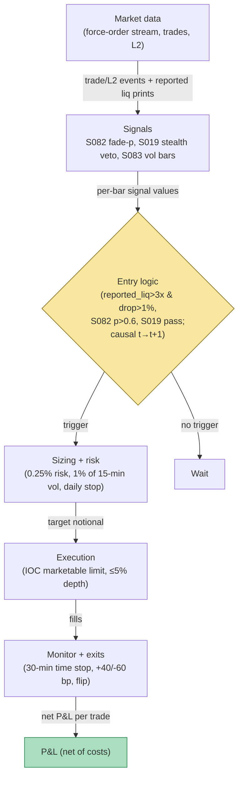

## Stage 152/200 — T052: Liquidation-Cascade Fade

*Batch TB6 · Strategy 52/100 · Signals S082, S019, S083*

**Provenance [D/SR].** Forced liquidation — an exchange automatically closing a leveraged position whose margin has fallen below the **maintenance margin** (the minimum collateral fraction) — is documented market mechanics: Cheng, Deng, Wang & Yu (arXiv:2102.04591, 2021) measure daily forced liquidations of 3.51% (longs) and 1.89% (shorts) of outstanding BitMEX bitcoin futures, with liquidated traders averaging ~60× leverage. The fade rule here (buy the forced-selling washout, timed on volume bars, confirmed by a book classifier, vetoed by a stealth-flow check) is a standard reconstruction. Closest plan sibling: **T076 — Liquidation-Cascade Fade** (buys liquidation clusters with funding context; this chapter is the execution-timing variant built on S082/S019/S083). **Honesty note, repeated everywhere it matters:** exchange-reported liquidation volumes are a *censored lower bound* on true forced flow — a preprint studying the October 2025 cascade finds publicly observed CEX liquidation volumes structurally undermeasure peak-stress activity — so every liquidation quantity in this chapter is labeled `reported_*`.

### T1. One-line verdict

| | |
|---|---|
| **Style** | Intraday crypto reversal — fading forced, price-insensitive flow |
| **Edge source** | Liquidation engines submit market orders that must execute *now*; the mechanical overshoot mean-reverts once the forced flow clears |
| **Typical holding period** | Minutes to ~1 hour |
| **Capacity hint** | Small — a few $M notional; the fade *is* liquidity provision and saturates fast |
| **Build-or-buy in one line** | Build the detector and the veto stack yourself; buy or aggregate the liquidation feed rather than scraping it |

### T2. Full mechanics

**Universe & session.** BTC and ETH perps plus up to 5 altcoin perps ranked by open interest, on 2–3 major CEXs. Exclusions (*examples*): open interest < $50M, tokens listed < 30 days, venues without a public liquidation/force-order stream. Session: 24/7; the detector runs continuously, but entries are suppressed during scheduled exchange maintenance windows.

**The trigger.** Forced selling arrives as market orders — a buyer of last resort gets paid the overshoot. Define `reported_liq_15m(t)` = sum of *reported* long-liquidation volume over the trailing 15 minutes (USD). A long-liquidation cluster fires when **both** hold (*examples*): (i) `reported_liq_15m(t)` > 3 × the trailing-24h median of `reported_liq_15m`; (ii) the perp mid-price fell > 1% over the same window. Mirror image for short-liquidation clusters (fade by shorting the spike). The 3×/1% are *examples* — calibrate per name.

**Entry rule.** At the first volume-bar close after the trigger (causal t→t+1: the bar that *detects* the cluster is never the bar you trade on), go long the washout **only if** the filters pass: (a) **S082**: max_c P(y = c | X_t) > p_conf (*example* 0.6) for the fade direction (up), and the expected move clears the spread-plus-fee filter — the classifier must agree the microprice has room to bounce; (b) **S019** stealth veto: compute the medium-size bucket's impact share over the trailing 30 min; **veto** if impact share_medium > 1.5 × volume share_medium (*example*) — elevated informed-size impact means the dump may be informed selling, not forced selling, and forced-flow logic does not apply; (c) **S083**: all of the above is computed on volume bars (close every $V traded, *example* $5M on BTC), so detection speed is activity-normalized — a cascade forms one bar, lunch chop forms one bar.

**Exit rule.** First of (*examples*): time stop 30 min; profit target +40 bp from entry; stop-loss −60 bp (the cascade has a second leg — you are early, not wrong, but early costs the same); or a fresh opposite-side cluster signal.

**Position sizing.** Risk 0.25% of portfolio per fade (*example*); notional ≤ 1% of trailing 15-minute volume (*example*); maximum 1 concurrent fade per symbol. Fading is knife-catching — the edge is statistical, the tails are real.

**Risk limits.** Daily loss stop 2% of equity (*example*); per-symbol daily stop 1% (*example*); kill switch on venue API errors or liquidation-feed staleness > 120 s (*example*) — a blind detector must not trade.

**Cost model.** In stress, spreads widen and you pay them: modeled entry cost 8 bp (5 bp taker fee + 3 bp half-spread-plus, retail tier *example*), exit 2 bp — 10 bp round trip, $98 on the T4 notional. Slippage function: half-spread + impact ψσ√(q/V) (*example* ψ = 1.0 in stress). Applied line-by-line in T4.

**Order/execution sketch.** Marketable limit orders (**IOC** — immediate-or-cancel: execute now or cancel, no resting) through the touch — in a cascade you are paying for immediacy, not queue position. Participation ≤ 5% of visible depth per child (*example*). Honesty: fills modeled at touch + modeled slippage; no maker-rebate assumptions, no queue-join claims.

### T3. Signals it consumes

| Signal | Role | Weight / logic |
|---|---|---|
| **S082 — Deep learning on the LOB** [D/SR] | Primary confirmation | Fire only if argmax class = fade direction, max_c P(c) > 0.6 (*example*), expected move > spread + fees (the S082 [SR] trade rule) |
| **S019 — Stealth trading (trade-size informedness)** [D] | Veto | Veto if impact share_medium ≫ volume share_medium (example: > 1.5×). MASTER.md S019: impact share_b = Σ_{k∈b}\|q_k·Δm_k\| / Σ_all\|q_k·Δm_k\|; the stealth signature is impact share concentrated in medium sizes |
| **S083 — Imbalance/tick/volume/dollar bars** [D/SR] | Infrastructure | Detector and all features run on volume bars (close every $V traded); imbalance variant θ_T = Σ b_i·q_i closes on fixed one-sided flow |

Combination pseudocode (≤25 lines):

```
# continuous loop on volume bars; tradable at bar t+1
for bar in volume_bars(V_DOLLARS):                      # S083 clock
    rep_liq = reported_liq_15m(bar.close_time)          # censored lower bound
    drop = (mid[bar] - max(mid[-15min])) / max(mid[-15min])
    trigger = rep_liq > 3*median(rep_liq_24h) and drop < -0.01   # examples
    if trigger and bar is first close after trigger:
        p, direction = S082(bar)                        # softmax over {up,flat,down}
        stealth = S019_impact_share_medium(30min)       # S019 veto gauge
        if p > 0.6 and direction == UP and stealth < 1.5*vol_share:  # examples
            enter_long(size=risk_pct(0.0025), ioc=True)  # fade the washout
for pos in open_positions:
    if age > 30min or pnl_bp > 40 or pnl_bp < -60 or opposite_cluster():
        exit_position(pos)
```

### T4. Worked example — numbers + P&L (SYNTHETIC)

All numbers synthetic. Seed: `np.random.default_rng(152)`; `batches/TB6/plot_T052.py` regenerates `images/T052_example.png` from this table (bar closes agree; intra-bar wicks are display jitter). Setup: BTC-like perp, 12 volume bars (~5 min each), fade size **1 BTC**.

| Bar | Close ($) | reported_liq_$M (long) | Event |
|---|---|---|---|
| 1 | 100,000 | 1.5 | baseline |
| 2 | 99,850 | 2.0 | selling starts |
| 3 | 99,300 | 8.0 | — |
| 4 | 98,400 | 30.0 | **trigger**: 30 > 3×median(~2) ✓; drop 1.6% > 1% ✓ |
| 5 | 97,600 | 45.0 | **ENTRY long 1 BTC @ 97,600** (first bar close after trigger, t→t+1) |
| 6 | 97,500 | 12.0 | holding |
| 7 | 97,700 | 4.0 | add-on considered → **S019 veto** (medium-size impact share elevated: informed flow) — no trade |
| 8 | 98,000 | 2.5 | bouncing |
| 9 | 98,150 | 2.0 | — |
| 10 | 98,350 | 1.8 | **EXIT @ 98,350** (30-min time stop) |
| 11 | 98,300 | 1.6 | flat |
| 12 | 98,400 | 1.5 | flat |

P&L walk, line by line:
- Gross: (98,350 − 97,600) × 1 BTC = **+$750**.
- Entry cost: 5 bp taker + 3 bp spread = 8 bp × $97,600 = **−$78**.
- Exit cost: 2 bp × $98,350 ≈ **−$20**.
- Total costs = **−$98**. **Net = +$652.**

The S019 veto at bar 7 earns no P&L — that is the point of showing it: the filter is allowed to say no.

**Where the example is optimistic.** The fill is assumed at 97,600 — in a live cascade the touch moves between detection (bar 4 close) and fill, and modeled slippage understates the real **adverse selection** (trading against flow that knows more than you). `reported_liq_$M` is a censored lower bound: true forced flow was larger, and the bounce may owe more to short-covering than to the fade working. No second cascade leg arrives after exit; the venue never halts; ADL never fires; the S082 confirmation is assumed correct. This is a toy tape, not a backtest.

### T5. Data & infra — what must run

**Pipeline inventory.** (1) 24/7 websocket collectors: liquidation/force-order streams, trades, top-of-book L2 per venue. (2) Volume-bar builder (S083) per symbol. (3) Feature jobs: trailing `reported_liq_15m` and its 24h median; S082 scoring on bar close; S019 medium-bucket impact monitor per 5 min. (4) Risk monitor: position age, P&L in bp, daily stops. Storage: per cost-model §3, tick trades for 10 symbols run to GBs/day — keep per-symbol daily parquet files; aggregates (bars, reported_liq series) are MBs.

**M5 Max feasibility: feasible (Tier M+).** Per cost-model §5, 40–100 h ≈ **$6,000–15,000** loaded-cost estimate — the work is the 24/7 collectors, the censored-data accounting, and the veto plumbing. Throughput per §2: a Python event loop at ~100–500k events/sec covers 10 symbols at a few k events/sec each with headroom; the S082 scorer is the heaviest per-bar op and runs at bar frequency, not tick frequency. RAM: live set < 2 GB of the 77 GB budget. Breaks first at: full L2 depth on 50+ symbols, or training the S082 model from scratch on this box (rent CUDA or use the GBT variant per the TB6 research notes).

**Feed-outage safe mode.** If the liquidation feed is stale > 120 s (*example*): no new fades — the detector is blind, and blind knife-catching is just knife-catching. If the price feed drops: flatten any open fade immediately via marketable limit on the backup venue. If one venue's stream dies mid-cascade: suppress entries on that venue only; existing positions keep their time stops. Daily-loss kill switch requires manual re-arm.

### T6. Buy vs build

| Option | What you get | Indicative price | What buying gains | What buying loses |
|---|---|---|---|---|
| Exchange force-order / liquidation websockets | Canonical per-venue reported liquidations | ~$0 (indicative — verify before budgeting) | Ground truth per venue; free | You aggregate, de-duplicate, and store; each venue is still only its own (censored) view |
| Aggregators (e.g. CoinGlass-style liquidation panels) | Cross-venue reported liquidation totals | ~$0–tens $/mo retail tiers (indicative — verify before budgeting) | One pipe, cross-venue sum | Still a lower bound (coverage gaps, methodology opacity); redistribution limits |
| Historical tick + liquidation archives (Kaiko-style) | Years of history for calibrating the 3×/1% trigger | ~hundreds–thousands $/mo (indicative — verify before budgeting) | Research-grade backtest input | Cost before the trigger is validated |

**Verdict: build the detector, aggregate the feeds yourself, buy history only for calibration.** The trigger logic (3× median + 1% drop + S082/S019 gates) is a few hundred lines; no vendor sells it. Crossover: buy 6–12 months of history once, to calibrate the trigger and the veto on purged/embargoed folds — then stop paying and collect your own.

### T7. Success-ratio evidence

| Study / source | Market & period | Metric | Before/after cost | Caveat |
|---|---|---|---|---|
| Cheng, Deng, Wang & Yu, "Liquidation, Leverage and Optimal Margin in Bitcoin Futures Markets," arXiv:2102.04591 (2021) | BitMEX BTC perps | Daily forced liquidations 3.51% (long) / 1.89% (short) of outstanding; liquidated traders avg ~60× leverage | Descriptive (not a strategy P&L) | 2018–2020 BitMEX sample; documents the *flow*, not the fade's profitability |
| "Same Shock, Same Assets, Different Microstructure" (ResearchSquare preprint rs-9459584, 2026) | Oct 10, 2025 cascade | ~$19B liquidations/24h; BTC diverged 7.24% across venues within a second; publicly observed CEX liquidation volumes are a *structural lower bound* | Event study | Preprint, not peer-reviewed; supports the censorship warning directly |
| Carnegie Mellon CyLab / CoinDesk (2021) | BitMEX derivatives | Cascading liquidations linked to rapid price jumps; small traders disproportionately liquidated | Descriptive | Press summary of a research report; no tradeable rule |

**No verified after-cost Sharpe exists for the liquidation fade as a rule.** The literature documents that forced flow is large, frequent, and mechanical — the *precondition* for the fade — not that fading it is profitable net of spread, fees, and the second leg. Treat any backtest Sharpe you see for this as guilty until proven innocent (purged/embargoed, stress-costed, multi-venue).

**Honest bottom line.** For a ≤$1M paper operation this is a legitimate *overlay*, not a book: a few fades a week on BTC/ETH, sized at 0.25% risk, with the S019 veto doing most of the work by keeping you out of informed dumps. For an institutional desk the fade is internalized differently — as market-making inventory that leans into forced flow with full liquidation feeds, balance sheet, and 24/7 staffing; the standalone retail version keeps the worst part (adverse selection) and none of the best (flow internalization).

### T8. Failure modes

1. **The second leg.** You fade the first washout; forced selling resumes and the stop-loss takes you out at −60 bp. *Mitigation:* hard stop, one fade per cluster, no averaging down — the example's bar 6 (−$100 MTM) is the warning.
2. **Informed flow wearing a liquidation costume.** A dump driven by real sellers trips the volume trigger; the S019 veto misfires. *Mitigation:* the veto is a veto, not a timing signal — when in doubt it says no; keep size at 0.25% risk regardless.
3. **Censored trigger data.** `reported_liq` understates the true forced flow, so the 3× trigger fires late or misses the peak. *Mitigation:* aggregate multiple venues, treat the series as a lower bound, and calibrate the trigger on the *reported* series only — never assume you see the full flow.
4. **Venue halt or ADL mid-cascade.** The exchange pauses or auto-deleverages; your stop becomes theoretical. *Mitigation:* per-venue position caps, kill switch, and never size as if the stop is guaranteed.
5. **Spread blowout.** Modeled 3 bp spread becomes 20 bp realized in stress; the 10 bp round trip doubles. *Mitigation:* stress-cost the gate (require expected edge > 25 bp in backtest, *example*); measure realized spreads monthly.
6. **Overfit trigger.** The 3×/1% pair is mined on two cascades and fails on the third. *Mitigation:* freeze the spec early; validate on purged/embargoed folds (S088); prefer fewer parameters.
7. **24/7 staffing gap.** Cascades happen at 04:00 UTC on Sundays. *Mitigation:* fully automated entries/exits and kill switch; paging for humans, not humans for paging.
8. **Funding bleed on the perp long.** Holding the long through several funding windows while funding is positive costs carry. *Mitigation:* the 30-minute time stop bounds funding exposure by construction.

### T9. Visuals


*Chart notes: watermarked "SYNTHETIC EXAMPLE"; corner caption "synthetic data — not market data". Bar closes and reported_liq_$M values match the T4 table. The purple X at bar 7 marks the S019 veto (no trade, no P&L).*



### T10. Sources

1. Cheng, Z., Deng, J., Wang, T. & Yu, M. (2021), "Liquidation, Leverage and Optimal Margin in Bitcoin Futures Markets," arXiv:2102.04591. https://arxiv.org/abs/2102.04591 — 3.51%/1.89% daily forced liquidations, ~60× average leverage of the liquidated; GEV-based margin analysis.
2. "Same Shock, Same Assets, Different Microstructure: A Comparative Analysis of CeFi and DeFi Venue Performance During the October 10, 2025 Cryptocurrency Cascade," ResearchSquare preprint rs-9459584 (2026). https://www.researchsquare.com/article/rs-9459584/latest.pdf — ~$19B/24h liquidations; 7.24% cross-venue BTC divergence within a second; publicly observed CEX liquidation volumes are a *structural lower bound*. (Preprint — not peer-reviewed.)
3. Soska et al. / Carnegie Mellon CyLab, "Crypto Derivatives Boom Leaves Small Traders Vulnerable to Liquidation" (2021), via CoinDesk. https://www.coindesk.com/markets/2021/05/05/crypto-derivatives-boom-leaves-small-traders-vulnerable-to-liquidation-carnegie-mellon — cascading liquidations and rapid price jumps on BitMEX; small-trader vulnerability.
4. Alexander, C. & Dakos, M. (2020), "A Critical Investigation of Cryptocurrency Data and Analysis," *Quantitative Finance* 20(2), 173–188. https://doi.org/10.1080/14697688.2019.1641347 — why venue data (including liquidation prints) must be treated as partial and manipulable.

**Unverified leads.**
- Grok (Q-TB6-1..3, 2026-09-10): DeepLOB F1 83.40% on FI-2010 / ~70% on LSE L2 — *unverified chatbot claim* (paper verified above; figures not independently checked, not used numerically).
- Grok's TB6 answers covered HMM allocation, DeepLOB training, and news momentum — not liquidation microstructure — so no liquidation-specific chatbot claims were available; none are used.

*Source log: Grok answered Q-TB6-1..3 (2026-09-10); all claims independently verified or labeled unverified.*
