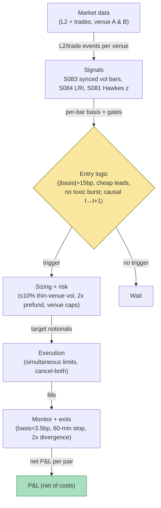

## Stage 153/200 — T053: Cross-Exchange Basis Arbitrage

*Batch TB6 · Strategy 53/100 · Signals S083, S084, S081*

**Provenance [D/SR].** Persistent price deviations for the same asset across crypto venues are documented: Makarov & Schoar (*Journal of Financial Economics* 135(2), 2020) find large, recurrent cross-exchange deviations that persist for days to weeks, and He, Manela, Ross & von Wachter (arXiv:2212.06888, 2024) derive no-arbitrage bounds for perpetual futures with deviations that comove and diminish over time. The execution rule here — synchronized volume-bar sampling (S083), Hasbrouck price-discovery leadership (S084), and a Hawkes toxic-flow veto (S081) — is a standard reconstruction. Related plan strategies: **T077 — Crypto Basis Cash-and-Carry** (the same-venue perp–spot convergence trade; this chapter is its cross-venue cousin) and **T036 — Cross-Asset Lead-Lag** (the equities lead-lag template this adapts to venues).

### T1. One-line verdict

| | |
|---|---|
| **Style** | Cross-venue relative-value arbitrage, delta-neutral (long cheap venue / short rich venue) |
| **Edge source** | The same perpetual contract trades at different prices on different exchanges; the spread mean-reverts as arbitrageurs and market makers realign quotes |
| **Typical holding period** | Minutes to hours (one convergence episode) |
| **Capacity hint** | Bounded by prefunded capital on each venue and the thinner venue's depth — $M-scale on BTC/ETH majors |
| **Build-or-buy in one line** | Build the synchronized sampler and the pair router; buy colocation only if you outgrow seconds-scale convergence |

### T2. Full mechanics

**Universe & session.** BTC and ETH USDT-margined perps listed with identical contract specs on 2–3 major CEXs. Exclusions (*examples*): venue pairs with < $1M combined 5-minute volume, venues with withdrawal freezes in the last 90 days, any venue where your account is not prefunded. Session: 24/7; the basis is evaluated continuously on synchronized bars.

**The signal.** Cross-venue basis b_t^{A,B} = (F^A_t − F^B_t)/F^B_t, in basis points. Entry when |b_t| exceeds the cost gate (*example*: 15 bp — roughly 2× the modeled 12 bp round trip, so the trade needs the spread to more than pay its way in).

**Confirmation stack.** A raw 15 bp print is often a stale quote, not an arb (*Alexander & Dakos 2020* data-quality warning). Three gates, all *examples*:
1. **S083 — synchronized sampling.** Both venues are resampled onto the *same* volume-bar clock (close every $V traded, *example* $2M on BTC) before comparing. Wall-clock comparison of a busy venue against a quiet one manufactures fake basis.
2. **S084 — price-discovery leadership.** Fit the Hasbrouck (1991) trade–quote **VAR** (**vector autoregression**: each variable regressed on lags of itself and the other) per venue pair on quote revisions and signed trades; compute each venue's long-run information share (**LRI** — the permanent price impact of a venue's trade innovation). Trade only if the *cheap* venue leads (LRI_cheap > LRI_rich, *example*): convergence should then come from the laggard catching up, not from your entry venue running away from you.
3. **S081 — toxic-flow veto.** If the Hawkes buy/sell imbalance on the cheap venue shows a sell burst (z_t < −κ, *example* κ = 2), the discount may be informed selling hitting that venue first — veto the entry.

**Causal timing.** Signals computed on synchronized bars ≤ *t*; both legs sent at bar *t+1*'s open. Never trade the bar that printed the basis extreme.

**Exit rule.** First of (*examples*): |b_t| back inside ±3.5 bp (convergence captured); time stop 60 min; stop-loss if |b_t| > 2× the entry basis (divergence, not convergence — something structural changed); either venue's feed stale > 30 s (flatten immediately — leg risk).

**Position sizing.** Inventory-neutral: equal USD notional per leg. Per-leg notional ≤ 10% of the thinner venue's 5-minute volume (*example*). Capital requirement: 2× notional, prefunded on both venues — there is no cross-margin between exchanges, so the strategy's true capital is double the traded notional.

**Risk limits.** Per-pair gross cap (*example*: $200k notional/pair on a $1M book); per-venue capital cap 30% of equity (*example*); daily loss stop 2% (*example*); kill switch on API errors, websocket staleness, or a venue's mark price diverging > 1% from the cross-venue median (*example* — possible venue distress).

**Cost model.** Round trip (*example*): 4 taker legs × 2 bp = 8 bp, plus 2 spread crossings × 2 bp = 4 bp → **12 bp** total. No on-chain transfer is needed (both legs are perps — no blockchain settlement, unlike spot cross-border arb). Funding-differential risk: if venue A's funding exceeds venue B's while the pair is open, the short-A leg bleeds the difference — include the expected funding differential in the gate for holds > 1 hour. Applied line-by-line in T4.

**Order/execution sketch.** Send both legs as limit orders simultaneously; if either leg is unfilled after 5 s (*example*), cancel both and re-quote — a half-filled pair is directional **leg risk**, the dominant operational risk of this strategy. Participation ≤ 10% of visible depth per child (*example*). Honesty: this is a seconds-to-minutes convergence trade, not a colocated latency race — fills are modeled, and the chapter claims no microsecond edge (the `simulated only — requires MBO/ITCH` spirit applies: no queue-position claims).

### T3. Signals it consumes

| Signal | Role | Weight / logic |
|---|---|---|
| **S083 — Imbalance/tick/volume/dollar bars** [D/SR] | Infrastructure (primary) | Resample both venues onto one volume-bar clock (close every $V traded, *example* $2M); compare basis only on synchronized bars. θ_T = Σ b_i·q_i closes imbalance bars on fixed one-sided flow |
| **S084 — Hasbrouck (1991) trade–quote VAR** [D] | Primary timing | Trade only if LRI_cheap > LRI_rich (*example*). MASTER.md S084: x_t = (Δm_t, q_t)⊤; VAR(p): x_t = c + Σ_ℓ A_ℓ x_{t−ℓ} + u_t; LRI = e_m⊤(I − Σ_ℓ A_ℓ)^{−1} e_q |
| **S081 — Hawkes buy/sell intensity imbalance** [D] | Veto | Veto if z_t < −κ (*example* κ = 2) on the cheap venue (toxic sell burst). d_t = λ^b_t − λ^s_t; z_t = (d_t − m_t)/s_t |

Combination pseudocode (≤25 lines):

```
# synchronized volume-bar loop; tradable at bar t+1
for bar in synchronized_volume_bars(V_DOLLARS, venues=[A, B]):   # S083
    b = (F_A[bar] - F_B[bar]) / F_B[bar] * 1e4                   # basis, bp
    if abs(b) > GATE_BP and feeds_fresh(A, B):                   # example 15 bp
        lri = S084_leadership(A, B, lookback=1h)                  # Hasbrouck LRI
        z_cheap = S081(min(F_A[bar], F_B[bar]))                   # Hawkes z on cheap venue
        cheap_leads = (lri[cheap] > lri[rich])
        if cheap_leads and z_cheap > -KAPPA:                      # veto toxic flow
            n = min(0.10 * vol_5min(thinner_venue), cap_pair)     # examples
            send_pair(long=cheap, short=rich, notional=n)         # cancel-both if a leg fails
for pos in open_positions:
    b = current_basis(pos)
    if abs(b) < 3.5 or age > 60min or abs(b) > 2*pos.entry_b:     # examples
        close_pair(pos)
```

### T4. Worked example — numbers + P&L (SYNTHETIC)

All numbers synthetic. Seed: `np.random.default_rng(153)`; `batches/TB6/plot_T053.py` regenerates `images/T053_example.png` — prices and basis here match the chart exactly. Setup: BTC-like perp on Venue A and Venue B, **$50,000 notional per leg** ($100k gross pair), cost gate 15 bp (*example*), round-trip cost 12 bp = **$60**.

| Bar | Venue A ($) | Venue B ($) | Basis (A−B)/B (bp) | Event |
|---|---|---|---|---|
| 1 | 100,010 | 100,000 | 1.0 | inside gate |
| 2 | 100,060 | 100,010 | 5.0 | inside gate |
| 3 | 100,220 | 100,000 | 22.0 | **ENTRY**: gate breached; S084: B leads (LRI_B > LRI_A); S081: no sell burst on B → short A @ 100,220, long B @ 100,000 |
| 4 | 100,180 | 100,010 | 17.0 | converging |
| 5 | 100,120 | 100,015 | 10.5 | converging |
| 6 | 100,060 | 100,020 | 4.0 | converging (still outside ±3.5 bp exit) |
| 7 | 100,036 | 100,004 | 3.2 | **EXIT**: basis inside ±3.5 bp → cover A @ 100,036, sell B @ 100,004 |
| 8 | 100,020 | 100,004 | 1.6 | flat |

P&L walk, line by line:
- Short A: (100,220 − 100,036)/100,220 × $50,000 = 18.4 bp × $50,000 = **+$92**.
- Long B: (100,004 − 100,000)/100,000 × $50,000 = 0.4 bp × $50,000 = **+$2**.
- Gross = **+$94**.
- Costs: 4 taker legs × 2 bp × $50,000 = $40; 2 spread crossings × 2 bp × $50,000 = $20; total **−$60**.
- **Net = +$34.**

A 22 bp entry converging to 3.2 bp yields 18.8 bp of convergence on the $50k notional — and costs eat 12 bp of it. The arb is real and almost entirely consumed by friction: that is the honest shape of this trade.

**Where the example is optimistic.** Both legs fill instantly at bar marks with no leg risk; the 22 bp print is assumed to be a *real* quote (the S083/S081 gates are assumed to have verified that — a stale print on A would make the "entry" fictional); spreads are modeled, not measured; the funding differential between venues over the ~20-minute hold is ignored; B's price-discovery leadership (LRI) is assumed stable through the episode; no venue latency, halt, or withdrawal friction. A toy pair, not a backtest.

### T5. Data & infra — what must run

**Pipeline inventory.** (1) 24/7 websocket collectors on each venue: L2 top-of-book, trades, funding rates, mark prices. (2) Synchronized volume-bar builder across venues (S083) — the heart of the strategy; bars must be cut on *combined* activity with per-venue timestamps aligned (venue clock vs NTP monitored). (3) Hourly Hasbrouck VAR refit per venue pair (S084); Hawkes recursion per trade event (S081). (4) Pair-execution state machine with cancel-both logic and leg-risk alarms. Storage: bars and basis series are MBs; sampled tick trades per venue are GBs/day in per-symbol daily files (cost-model §3).

**M5 Max feasibility: feasible (Tier M+).** Per cost-model §5, 40–100 h ≈ **$6,000–15,000** loaded-cost estimate — dominated by the synchronized sampler, the pair state machine, and venue-specific API quirks. Throughput per §2: two venues × a few k events/sec each is trivial for a Python loop (~100–500k events/sec budget); the VAR refit is hourly batch work. RAM: live set < 1 GB of the 77 GB budget. Breaks first at: adding full L2 depth on 10+ venues, or dropping the bar clock to millisecond synchronization across continents (then you need colocated capture, not a laptop).

**Feed-outage safe mode.** If *either* venue's feed is stale > 30 s (*example*): cancel all open orders on both venues and flatten any open pair immediately at the touch — an unhedged single leg during a venue outage is the strategy's nightmare. No new entries until both feeds are fresh *and* the basis has printed two consecutive synchronized bars. Venue mark-price vs cross-venue median divergence > 1% (*example*) triggers the kill switch and pages the operator.

### T6. Buy vs build

| Option | What you get | Indicative price | What buying gains | What buying loses |
|---|---|---|---|---|
| Exchange websockets/REST (both venues) | Canonical L2, trades, funding per venue | ~$0 (indicative — verify before budgeting) | Free, authoritative | You build sync, history, and cleaning; no cross-venue view |
| Multi-venue historical data (Kaiko-style) | Aligned multi-venue history for calibrating the gate and the LRI lookback | ~hundreds–thousands $/mo (indicative — verify before budgeting) | Research-ready; saves months of self-collection | Recurring; schema lock-in |
| VPS near exchange matching engines | Stable 24/7 runtime, lower websocket latency | ~tens–hundreds $/mo (indicative — verify before budgeting) | Uptime for the always-on router | Still not colocation; the ms race is not this strategy |

**Verdict: build the router, buy history for research, rent a VPS for live.** Nobody sells the synchronized-bar + lead-lag + veto stack as a product; the venue data is free. Crossover to colocation/serious connectivity spend: only when measured P&L shows the gate triggering often enough that seconds of latency are the binding constraint — for most readers that day never comes, and that is fine.

### T7. Success-ratio evidence

| Study / source | Market & period | Metric | Before/after cost | Caveat |
|---|---|---|---|---|
| Makarov & Schoar, "Trading and Arbitrage in Cryptocurrency Markets," JFE 135(2) (2020) | BTC spot across exchanges, 2017–2018 | Large recurrent cross-exchange deviations persisting days–weeks; wider across countries (capital controls) | Before-cost (deviations, not traded P&L) | Cross-border *spot* premia need fiat rails — a $1M paper op cannot harvest the Korea premium; same-jurisdiction perp deviations are far thinner |
| He, Manela, Ross & von Wachter, "Fundamentals of Perpetual Futures," arXiv:2212.06888 (2024) | Crypto perps, ~2020–2024 | Deviations from no-arb perp bounds comove across currencies and *diminish over time*; simple strategy "generates large Sharpe ratios even for investors paying the highest trading costs on Binance" | After-cost claimed (their backtest) | Working paper; one sample; the documented decay *is* the warning — the bound tightens as capital arrives |
| Oct 2025 cascade preprint (ResearchSquare rs-9459584, 2026) | Multi-venue, Oct 10 2025 | BTC diverged 7.24% across venues within a second; bid depth collapsed up to 99.8% | Event study | The giant prints coincide with untradable books — evidence *against* harvesting stress dislocations, not for it |

**Capacity & decay.** Two documented decay channels: (1) He et al.'s diminishing deviations — the no-arb bound tightens over time; (2) Makarov & Schoar's mechanism — where deviations persist, the friction is capital controls and settlement, i.e. precisely the frictions a small operation cannot remove. Capacity is set by the thinner venue's depth and your prefunded balances, not by signal quality.

**Honest bottom line.** For a ≤$1M paper operation, cross-venue perp basis arb on BTC/ETH is implementable and will fire a few times a week — and T4 shows what it pays: $34 net on $100k gross after honest costs. It is a real, thin, operationally demanding edge: the money is in running it cleanly for a year, not in any single convergence. For an institutional desk the advantages are fee tiers, prefunded balances on many venues, and colocated capture that turns the 15 bp gate into a 5 bp gate — the same trade, wider net, at scale.

### T8. Failure modes

1. **Stale-quote entry.** The 22 bp print is a dead quote on venue A; the "arb" never existed. *Mitigation:* synchronized volume bars (S083), minimum quote-update recency per venue, and the S081 veto — never trade a print you cannot refresh.
2. **Leg risk.** The short fills, the long doesn't; the pair becomes a naked directional bet. *Mitigation:* cancel-both logic within seconds (*example* 5 s), small notionals, leg-risk alarm that pages immediately.
3. **Divergence instead of convergence.** The basis widens to 2× entry — a venue-specific stress (withdrawal freeze rumor, insurance-fund event). *Mitigation:* stop-loss at 2× entry basis; per-venue capital caps; the mark-vs-median kill switch.
4. **Fake volume on the thin venue** (Alexander & Dakos 2020): depth that vanishes when you hit it. *Mitigation:* size to *realized* fill depth from your own execution logs, not displayed depth; venue-quality filter.
5. **Funding-differential bleed.** Venue A's funding exceeds B's for the whole hold; the carry works against the convergence. *Mitigation:* include expected funding differential in the gate for holds over an hour; prefer short holds.
6. **Latency inversion.** You are the slow arbitrageur: by the time both legs are sent, a faster desk has closed the spread and you bought the top. *Mitigation:* size for minutes-horizon convergence (the S084 leadership gate selects slow, structural dislocations), not millisecond races.
7. **Fee-tier mismatch.** The 12 bp model assumes 2 bp taker; at a retail 5 bp tier the round trip is ~24 bp and the 15 bp gate never fires profitably. *Mitigation:* scale the gate to the measured fee tier; re-measure monthly.
8. **Lookahead in the VAR.** Refitting the Hasbrouck VAR on data that includes the test window, or using smoothed leadership labels live. *Mitigation:* causal rolling refit, embargo between fit and trade windows (S088 discipline), freeze the lookback.

### T9. Visuals


*Chart notes: watermarked "SYNTHETIC EXAMPLE"; corner caption "synthetic data — not market data". Prices and basis match the T4 table; the shaded band is the ±15 bp cost gate (example).*



### T10. Sources

1. Makarov, I. & Schoar, A. (2020), "Trading and Arbitrage in Cryptocurrency Markets," *Journal of Financial Economics* 135(2), 293–319. https://doi.org/10.1016/j.jfineco.2019.07.001 — large recurrent cross-exchange deviations; capital controls as the persistent friction.
2. He, S., Manela, A., Ross, O. & von Wachter, V. (2024), "Fundamentals of Perpetual Futures," arXiv:2212.06888. https://arxiv.org/abs/2212.06888 — no-arbitrage bounds for perps; deviations comove and diminish over time; after-cost backtest claim.
3. Alexander, C. & Dakos, M. (2020), "A Critical Investigation of Cryptocurrency Data and Analysis," *Quantitative Finance* 20(2), 173–188. https://doi.org/10.1080/14697688.2019.1641347 — stale quotes and fake volume: why the synchronized-bar and venue-quality gates exist.
4. "Same Shock, Same Assets, Different Microstructure," ResearchSquare preprint rs-9459584 (2026). https://www.researchsquare.com/article/rs-9459584/latest.pdf — 7.24% cross-venue divergence inside a second during stress, with depth collapsing 99.8%: the giant prints are untradable. (Preprint — not peer-reviewed.)

**Unverified leads.**
- Grok (Q-TB6-1..3, 2026-09-10): no basis-arbitrage-specific claims were made (the questions covered HMM allocation, DeepLOB training, and news momentum); nothing to downgrade beyond the standing note that DeepLOB accuracy figures quoted there are *unverified chatbot claims*.

*Source log: Grok answered Q-TB6-1..3 (2026-09-10); all claims independently verified or labeled unverified.*
